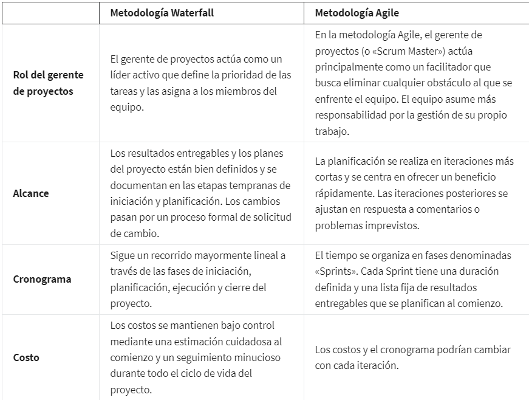
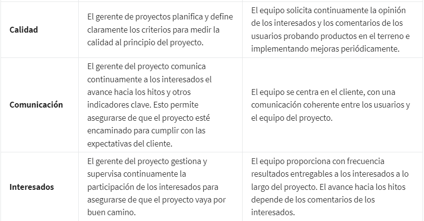

# Fundamentos de la gestión de proyectos

## modulo_1 Iniciar una carrera en gestion de proyectos

### Conceptos básicos de la gestión de proyectos

*Que es un proyecto?*

Un proyecto es un emprendimiento único, que suele incluir un conjunto de entregas específicas. También es una iniciativa
temporal. Tiene un principio y un final definidos. Un proyecto es una serie de tareas que deben realizarse para lograr
un resultado deseado. Lograr ese resultado deseado requiere colaboración y una planificación cuidadosa que mantenga el
proyecto en marcha y dentro del presupuesto.

*Que es la gestion de proyectos?*

La gestión de proyectos es vital para el éxito de proyectos grandes y pequeños.

La gestión de proyectos es la aplicación de conocimientos, destrezas, herramientas técnicas para cumplir con los requisi-
tos de un proyecto y lograr el resultado deseado.

*Cual es el valor de la gestion de proyectos para una organizacion?*

La gestión de proyectos es valiosa para las empresas porque ayuda a garantizar que un proyecto produzca los resultados
esperados, dentro del plazo y el presupuesto previstos.

Akgun aspectos basifos de la gestion de proyectos incluye: planificación y organización, gestión de tareas, elaboración
de presupuestos y control de costos, entre otros.

### ¿Qué hace un gerente de proyectos?

Los gerentes de proyectos suelen seguir un proceso que implica planificar y organizar, gestionar tareas, elaborar presu-
puestos y controlar costos y otros factores Todo lo que hacen apunta a que el proyecto se lleve a cabo dentro del plazo
y presupuesto previstos.

En términos generales, un gerente de proyectos también debe ocuparse de que el resultado del proyecto aporte valor a la
empresa.

Un gerente de proyectos puede añadir valor de muchas maneras diferentes. Ya sea porque crea un nuevo servicio para los
clientes o modifica uno actual para que se adapte mejor a las necesidades del cliente. No importa cuál sea la tarea, los
proyectos exitosos siempre añaden valor. Es el trabajo del gerente de proyectos asegurarse de que el proyecto sea valio-
so y exitoso.

### Destrezas transferibles de la gestión de proyectos

*Las responsabilidades diarias de un gerente de proyectos incluyen alguna forma de:*

*planificación y organización*. Esto significa descubrir exactamente qué se está tratando de lograr con tu proyecto. Es po-
sible que tengas una reunión inicial o que envíes una encuesta. A partir de allí también puedes trabajar en la creación
de planes de proyecto. Crear planes de proyecto es una parte esencial de la gestión de proyectos. Ayuda a marcar el tono
del proyecto, mantiene a todos a ritmo y en sintonía, y ayuda a que las tareas avancen.

*la gestión de tareas*. Una vez que el proyecto está en marcha, el gerente gestiona las tareas del equipo de trabajo y co-
munica los hitos clave al resto o a los clientes. Esto mantiene a los integrantes del equipo y a los clientes informados
sobre cómo avanza el proyecto.

*los presupuestos, el control de costos y otros factores.* La gestión del presupuesto y el control de costos son una res-
ponsabilidad común que tienen que entender los gerentes para avanzar dentro del presupuesto. Es un trabajo a tiempo com-
pleto porque el plan que creaste y que gestionas puede cambiar, y esto causar un aumento de costos inesperado.

### Pasos para convertirte en gerente de proyectos

Toma responsabilidad de tu vida, planea, ejecuta, monitorea, evalua y replanea, repite el ciclo en cada aspaecto de tu vida,
los gerentes de proyectos no dejan nada al azar, siempre, planean, ejecutan, monitorean, evaluan y reestrcuturan su plan
inicial.

### Conocer cuáles son las carreras relativas a la gestión de proyectos

Es posible encontrar el rol como gerende de proyectos, este es aplicado a muchas industrias y campos, tales como:
construccion, salud, gas y petroleos, energia, TI, etc.

de igual forma es posible encontrarlo con roles especificos en cada sector, por ejemplo, gerente d eproyectos en el area
de la construccion, gerente de proyectos en tecnologias de la informacion o gerente de proyectos en ingenieria.

Es posible palicarles tag al rol de. gerente de operaciones, gerente de programas educativos, gerente de programas en
orevencion y salud, etc.

Otros cargos que pueden ser considerados derivaciones de la gerencia de proyectos.

Asistente de proyectos.
Asistente de programas
Coordinador de proyectos.
Asistente de operaciones

Todos estos posibles cagos obtienen su nucleo en la gestion de proyectos.

#### Categorías de puestos y funciones comunes en la gestión de proyectos

*Puestos de gestión de proyectos de nivel introductorio.*

Los puestos de gestión de proyectos de nivel básico son una gran oportunidad para adentrarse en el área y conocer los
pormenores de cómo ejecuta y gestiona proyectos una empresa. Lo que aprendas con estas experiencias es sumamente valioso
para tu crecimiento en el área de la gestión de proyectos. Algunos puestos de gestión de proyectos de nivel básico son:

    Gerente de proyectos junior. Se ocupa de todos los aspectos de ser gerente de proyectos junto a un profesional con
    más experiencia.

    Administrador del proyecto. Asiste al resto del equipo del proyecto con las tareas administrativas.

    Asistente del proyecto o programa. Apoya a los miembros del equipo que trabajan en un proyecto y proporciona respaldo
    administrativo. Puede realizar investigaciones o elaborar documentos de capacitación junto con otros trabajos asigna-
    dos por los líderes del programa.

    Coordinador del proyecto o programa. Participa en trabajos prácticos y tareas administrativas del proyecto. Trabaja
    bajo la dirección de un gerente de proyectos para cumplir con los plazos y el presupuesto.

    Especialista en soporte de proyectos. Trabaja junto a un gerente de proyectos y los integrantes del equipo para super-
    visar los proyectos asignados. También puede ser responsable de capacitar y desarrollar a los empleados para que
    lleven a cabo las tareas designadas.

*Puestos tradicionales de la gestión de proyectos.*

Una vez que hayas adquirido experiencia en puestos de nivel introductorio, puedes explorar los roles tradicionales de la
gestión de proyectos, tales como:

    Gerente de proyectos. Responsable del inicio, la planificación, la ejecución, la supervisión y el cierre de un proyecto.
    Incluye cargos específicos del sector, como gerente de proyectos de TI, director de proyectos de construcción o gerente
    de proyectos de ingeniería, en los que se aplican destrezas transferibles entre sectores.

    Analista de proyectos. Hace avanzar un proyecto al compartir información, brindar soporte a través del análisis de
    datos y contribuir con la estrategia y el desempeño.

    Director o líder de proyecto. Se encarga de tomar las decisiones básicas y marca la dirección del proyecto. Por lo
    general, está bien informado sobre el producto y las entregas.

    Controlador de proyectos. Es responsable principalmente de la planificación de los proyectos. Es probable que veas
    este puesto de trabajo en sectores como la ingeniería y la construcción.

    Gerente técnico de proyectos. Realiza la planificación y gestión de proyectos con objetivos identificados dentro de
    una empresa. Se ocupa de que los proyectos se lleven a cabo según los requisitos dentro de un plazo y presupuesto
    definidos.

    Analista de la oficina de gestión de proyectos (PMO). Gestiona el progreso de proyectos complejos para garantizar la
    ejecución y la finalización dentro del plazo previsto.

*Un paso en la evolucion de los gerentes de proyectos tradicionales seria:*

    Gerentes de programas. Gestionan un grupo de proyectos relacionados o similares entre sí y manejan la coordinación
    de estos proyectos. Hacen posible la comunicación eficaz entre los gerentes de proyectos individuales y proporcionan
    apoyo cuando es necesario. También ayudan a crear y gestionar objetivos a largo plazo para su organización.

    Gestores de portfolio. Son responsables de gestionar un grupo de programas relacionados dentro de la misma organiza-
    ción. Coordinan diversos programas para garantizar que avancen como se espera y que la organización cumpla con sus
    iniciativas estratégicas. Los gerentes de portfolio examinan todos los proyectos y programas de la organización y
    priorizan el trabajo según sea necesario.

*Puestos de gestión operativa.*

En puestos de gestión operativa, tendrás la oportunidad de experimentar varios departamentos diferentes y cómo estos
interactúan y operan.

Los puestos de gestión operativa te permiten trabajar con colegas y con la gestión de diversos segmentos empresariales,
y esto te permite apreciar lo que hace cada segmento a diario. Los aspectos clave de la gestión de proyectos incluyen
asegurarse de que un proyecto se mantenga dentro del presupuesto y los plazos definidos.

Algunos puestos de gestión operativa son:

    Analista de operaciones. Gestiona y coordina la investigación, analiza los flujos de trabajo, crea procedimientos
    empresariales y recomienda cambios para mejorar el proyecto y la empresa.

    Gerente de operaciones. Supervisa la toma de decisiones estratégicas e implementa planes de acción basados en informes
    financieros, de cronogramas y de recursos.

    Director de operaciones. Es responsable de supervisar las funciones administrativas y operativas cotidianas de una
    empresa.

*Puestos del área Agile.*

Algunos de los puestos que puedes encontrar relacionados con este enfoque:

    Scrum Master. Coordina y guía al equipo de Scrum. Posee conocimientos sobre el marco de trabajo de Agile y Scrum, y
    es capaz de capacitar a otras personas en los valores y principios de Scrum.

    Encargado del producto. Contribuye con la dirección del desarrollo y el progreso de los productos.

### Cómo usar palabras de moda para buscar trabajo

las palabras de moda: palabras o frases que son populares durante un periodo o en un sector en particular. En el mercado
laboral actual, son comunes las palabras o frases de moda como «basado en datos», «espíritu de equipo» y «con iniciativa».

Es posible que veas que aparecen términos como estos en tus búsquedas:

    *Coordinación*, es decir conseguir que las personas y los equipos trabajen juntos. Es posible que veas que se mencionan
    responsabilidades en las descripciones de los puestos, como «coordinación de esfuerzos para lograr la entrega del proyecto»
    o «coordinar los recursos internos para garantizar la finalización exitosa del proyecto». Ser gerente de proyectos es,
    en esencia, gestionar la coordinación de los recursos para lograr el objetivo final. La coordinación es una de las
    principales destrezas que debe tener un gerente de proyectos, por lo que buscar este término puede ayudar a que encuentres
    los puestos apropiados.

    *Organización*, es decir la capacidad de mantenerte concentrado en diferentes tareas. Es posible que encuentres frases
    como «destrezas sólidas de organización, incluida la atención al detalle y la capacidad de realizar múltiples tareas»
    o algo tan simple como «altamente organizado». La organización es clave para ser un muy buen gerente de proyectos.

    *Liderazgo*, es decir poder dirigir a un grupo de personas. Es posible que veas frases como «fuertes cualidades de
    liderazgo» o «capacidad para liderar» en las descripciones de puestos. Un gerente de proyectos debe demostrar su capa-
    cidad de liderazgo de varias maneras, entre ellas con la planificación eficaz, la coordinación eficiente de tareas,
    la motivación de los integrantes del equipo y la toma de decisiones clave. Estás trabajando en muchas de las destrezas
    necesarias para convertirte en un gran líder en este programa.

Palabras de moda comunes de la gestión de proyectos

Incluir palabras de moda y destrezas en tu búsqueda de empleo puede ayudarte a encontrar trabajos que sean ideales para
ti y tu conjunto de destrezas. Una vez que hayas encontrado un puesto que te interese, usar las palabras de moda y las
destrezas relevantes para el puesto también puede facilitar que los reclutadores y gerentes de contratación te identifiquen
como un candidato calificado que posee los conocimientos requeridos.

Algunas palabras de moda y destrezas comunes relacionadas con la gestión de proyectos que podrías incluir en tu currículum
son:

    Analítico

    Firme

    Evaluación de resultados

    Evaluación del progreso

    Detallismo

    Resolución de conflictos

    Enfoque de colaboración

    Coordinación

    Comunicación

    Desarrollo

    Evaluación

    Ejecución de planes

    Análisis financiero

    Evaluación de impacto

    Captación del interés de los líderes

    Gestión de reuniones

    Gestión de las expectativas del cliente

    Gestión de conflictos

    Gestión de relaciones con los interesados

    Gestión de proveedores

    Capacidad de cumplir con plazos

    Monitoreo

    Capacidad para manejar múltiples tareas

    Planificación

    Capacidad para priorizar

    Resolución de problemas

    Desarrollo de procesos

    Mejora de procesos

    Coordinación de proyectos

    Implementación de proyectos

    Inicialización de proyectos

    Planificación de proyectos

    Informes de proyectos

    Control de calidad

    Evaluación de riesgos

    Gestión de riesgos

    Desarrollo de soluciones

    Planificación estratégica

    Destrezas interpersonales sólidas

    Excelente comunicación verbal

    Excelente comunicación escrita

## modulo_2 Convertirse en un gerente de proyectos eficaz

### Exploración de cómo un gerente de proyectos agrega valor

Los gerentes de proyectos dirigen proyectos de principio a fin y son guías para su equipo, gracias a sus destrezas impe-
cables a nivel interpersonal y organizativo en cada paso del camino.

Los gerentes de proyectos suelen seguir un proceso que implica planificar y organizar, administrar tareas, presupuestar
y controlar costos para que el proyecto se pueda completar dentro del plazo aprobado. Los gerentes de proyectos tienen
un rol fundamental en sus organizaciones.

#### El valor de un gerente de proyectos

Los gerentes de proyectos agregan valor a sus equipos y organizaciones de formas clave que incluyen la priorización,
delegación y comunicación efectiva.

*la priorización*. Los gerentes de proyectos agregan valor a sus equipos y organizaciones por medio de la priorización
efectiva de las tareas necesarias para completar un proyecto. Son expertos en ayudar a los miembros del equipo a identi-
ficar y dividir las tareas grandes en pasos más pequeños. Habrá ocasiones en las que un gerente de proyectos posiblemente
no sepa qué tarea priorizar. Para determinar cuáles son las más importantes para el éxito del proyecto, se conectarán con
sus equipos y con los interesados para recopilar información y hacer un plan.

    Los interesados son personas que tienen interés y se ven afectadas por la finalización y el éxito del proyecto, como
    el líder de una organización.

*La priorizacion*establece el orden en el que se desarrollaran las tareas, teniendo en cuenta multiples factores, nivel de
urgencia por tiempo de vencimiento, nivel de prioridad por que sin esa tarea otras se veran afectadas en su cumplimiento,
etc. Cuando priorizas de manera eficaz las tareas importantes, preparas a tu equipo y a ti mismo para un mejor resultado
del proyecto. Ahora hablemos de la delegación.

Los gerentes de proyectos usan *la delegación* para agregar valor a sus equipos y organizaciones al asignar tareas a las
personas que mejor pueden completar el trabajo.

*La comunicación efectiva.* Los gerentes de proyectos agregan valor a través de una comunicación efectiva, tanto con su
equipo como con los principales interesados. Esto se refiere a ser transparente, lo que significa ser sincero acerca de
los planes e ideas y facilitar el acceso a la información. Los gerentes de proyectos se mantienen en contacto regular con
su equipo sobre el progreso del trabajo y ayudan a identificar áreas donde un compañero de equipo puede necesitar apoyo.

#### Cómo afectan los gerentes de proyectos a las organizaciones

Has aprendido que los gerentes de proyectos pueden priorizar, delegar y comunicarse con eficacia para aportar valor a sus
proyectos. Estas formas incluyen:

* *Centrarse en el cliente*

    Los clientes son siempre un elemento clave para el éxito de cualquier negocio. El campo de la gestión de proyectos no
    es excepción.

    En la gestión de proyectos, la palabra “cliente” se refiere a una persona u organización que define los requisitos del
    proyecto y establece pautas importantes, como el presupuesto y los plazos. En los proyectos, los clientes pueden ser
    internos o externos. Los clientes internos son los interesados que forman parte de tu organización, como la gerencia,
    los miembros del equipo del proyecto, los gerentes de recursos y otros departamentos de la organización. Los clientes
    externos son ajenos a tu organización, como los contratistas, proveedores y consumidores.

    Para ejecutar un proyecto con éxito, éste debe cumplir con los estándares del cliente. Para cumplir con los estándares
    del cliente, debes asegurarte de entender con claridad sus expectativas. El cliente está en el centro de un proyecto
    exitoso.

    Los gerentes de proyectos pueden agregar mucho valor al proyecto si entablan relaciones con los clientes y se toman
    el tiempo para asegurarse de que se escuche al cliente y que esté satisfecho con el resultado.

    Hacer preguntas al cliente

        En primer lugar, siéntate con el cliente y pregúntale qué problema está tratando de resolver. Podrías preguntarle
        si tienen una visión específica del resultado final que les gustaría obtener. A veces, los clientes dependen de
        los gerentes de proyectos para encontrar la solución a su problema. Tu trabajo consiste en hacer preguntas
        como:

        ¿Cuál es el problema que le gustaría que lo ayudáramos a resolver? Respuesta de ejemplo: El cliente quiere ayuda
        para desarrollar un nuevo proceso que permita a su empresa ser más eficiente.

        ¿Cómo afecta el problema a su organización? Respuesta de ejemplo: El cliente afirma que está perdiendo clientes
        debido a la ineficiencia de sus procesos actuales, ya que a veces los clientes reciben sus pedidos con retraso.

        ¿Qué lo impulsó a pedir ayuda en este momento? Respuesta de ejemplo: El cliente dice que se puede reducir la
        financiación de su departamento si no mejora la eficiencia.

        ¿Qué esperanzas tiene con respecto al resultado de este proyecto? Respuesta de ejemplo: El cliente afirma que su
        objetivo final es aumentar la velocidad a la que preparan los pedidos sin sacrificar la calidad.

    Tomarse el tiempo para profundizar un poco más en el “por qué” detrás del proyecto puede ayudar a un gerente de pro-
    yectos a brindar un mejor apoyo y comprender más al cliente. Cuanto más entiendas los objetivos del cliente, más pro-
    babilidades tendrás de producir lo que el cliente busca.

* *Formar un equipo excelente*

    El equipo es el mayor activo de un proyecto. Un gerente de proyectos exitoso lo sabe y se toma el tiempo para compren-
    der las motivaciones, fortalezas y debilidades de cada persona. Los gerentes de proyectos agregan valor al proyecto
    al identificar el equipo adecuado para el proyecto y permitir que el equipo tenga éxito y tome decisiones.

    Cuando trabajas para formar un equipo excelente, tienes que tener en cuenta las destrezas necesarias para el proyecto,
    así como los recursos disponibles.

    Comprender los requisitos del cliente ayuda a dar forma a las destrezas que debe tener el equipo.

    Como gerente de proyectos, debes atraer a personas con las destrezas adecuadas y asegurarte de que cada miembro
    del equipo sepa que es valorado y apreciado, y que confías en ellos.

    Para demostrar cómo te sientes con respecto al valor del equipo, puedes permitirles aportar información y hacer pre-
    guntas, y atender sus necesidades lo antes posible.

* *Fomentar las relaciones y la comunicación*

    Como gerente de proyectos, mantener la satisfacción del cliente y formar un equipo excelente son dos formas en las
    que puedes agregar valor a un proyecto.

    Ambas destrezas se basan en las relaciones y la comunicación. Los gerentes de proyectos que aportan más valor son los
    que se toman el tiempo para entablar relaciones, comunicarse y tratar a los demás con consideración y respeto.

    Los gerentes de proyectos pueden marcar la pauta de un proyecto y entablar relaciones dentro de sus equipos y con los
    interesados.

    Tomarte el tiempo para hablar diariamente con tu equipo, ver cómo les va y preguntar si hay algo en lo que necesitan
    ayuda puede ser fundamental para que se sientan valorados y escuchados.

* *Gestionar el proyecto*

    Cuando formas equipos, a cada persona se le asignan tareas específicas del proyecto. Una vez finalizada la tarea, la
    persona responsable de esa tarea entrega esa parte del proyecto a la siguiente persona.

    Los miembros de tu equipo no siempre ven el panorama completo ni cómo afectan a los demás en un proyecto.

    Un gerente de proyectos exitoso observa el impacto de cada proceso dentro del proyecto y lo comunica al equipo. Esto
    garantiza que todos los que trabajan en el proyecto comprendan el objetivo de su tarea, así como el objetivo general
    del producto terminado.

    Por ejemplo, si un diseñador gráfico que trabaja en materiales de marketing para tu proyecto no entiende el objetivo
    general del cliente de atraer a los educadores, es posible que no pueda captar completamente la visión de la campaña.

    Ayudar a este miembro del equipo a comprender el panorama general le permitirá adaptar sus tareas para satisfacer las
    necesidades del objetivo final del proyecto.

    Gestionar un proyecto puede ser complicado, pero si te tomas el tiempo de entablar relaciones y mantener líneas de
    comunicación abiertas, aumentarás las posibilidades de éxito del proyecto, así como la satisfacción del cliente y de
    los miembros de tu equipo.

* *Superar los obstáculos*

    Un gerente de proyectos agrega valor a un proyecto cuando supera obstáculos, permite a su equipo crear nuevas formas
    de hacer las cosas y fomenta el intercambio de ideas. Como gerente de proyectos, tienes que ser un ejemplo de ingenio
    y colaboración, y animar a tu equipo a hacer lo mismo.

    ¿Cómo puedes superar los obstáculos en un proyecto? Puedes ofrecer apoyo al equipo a medida que prueben nuevos enfoques
    para buscar soluciones, y puedes abogar por recursos adicionales para el equipo. Si a tu equipo le resulta difícil
    obtener una respuesta de otra organización, puedes ponerte en contacto con esa organización tú mismo para mantener al
    equipo encaminado y dentro de los plazos programados.

### Más información sobre las funciones y responsabilidades del gerente de proyectos

#### Responsabilidades basicas

La planificación y organización. Una responsabilidad que corresponde al área de planificación y organización es aprovechar
las herramientas de productividad y la creación de procesos. Durante la planificación y ejecución de un proyecto, es po-
sible que tengas que utilizar ciertas herramientas y desarrollar procesos para mejorar el intercambio de información en
todo el equipo; es posible que también debas crear planes, plazos, horarios, y otras formas de documentación para realizar
un seguimiento del progreso del proyecto, y usualmente deberás mantener al día esos documentos a lo largo de la totalidad
del proyecto.

la elaboración de presupuestos, el control de costos, etc. Mientras el proyecto está en marcha, cambios en el plan y el
presupuesto es inevitable que aparezcan. Créeme. Esto requerirá que controles y administres el presupuesto, rastrees problemas
y riesgos a medida que surgen, y mitigues esos problemas y riesgos para gestionar la calidad. Una forma de hacer esto es
eliminar las barreras imprevistas que surgen. Cuando decimos obstáculos, queremos decir cosas que pueden impedir el progreso
del proyecto.

El rol de gerente de proyectos es gestionar tareas. Una tarea del proyecto es una actividad que se debe cumplir dentro de
un período de tiempo establecido por ti, tu equipo o los interesados. El seguimiento de tareas es una buena manera de ayudar
a gestionar la carga de trabajo del equipo y asegurarse de que se hagan las cosas. El seguimiento de las tareas es también
una excelente herramienta para mostrar el progreso a quienes no forman parte del equipo inmediato, como los interesados.

#### Responsabilidades que utilizan destrezas interpersonales

* *Enseñanza y tutoría*
  
  Cuando te tomas el tiempo para explicar completamente las expectativas, eliminas las repeticiones, la confusión y la
  frustración. Ser un mentor y enseñar a otros las lecciones que tú has aprendido como gerente de proyectos, le permite
  al equipo tomar mejores decisiones y aprovechar tu experiencia. La tutoría también implica apoyar a cada persona del
  equipo a cumplir con las expectativas y ayudarlos a superar su propia idea de potencial personal.

* *Establecer relaciones*
  
  Dedica tiempo a consultar y escuchar a la gente, ¡Las relaciones lo son todo! Al ocuparte de conocer a los miembros de
  tu equipo, se dan cuenta de que te preocupas por ellos como personas, no solo como empleados. Tomarte el tiempo necesario
  para establecer relaciones con tus clientes, proveedores y otros interesados es igualmente importante.

  Dedica tiempo a consultar y escuchar a la gente. Presta atención a las ideas que te ofrecen sobre su estilo de trabajo,
  ya que sus acciones pueden decirte cómo interactuar con ellos de la manera más efectiva.

  Pregúntales sobre sus vidas más allá del proyecto y realiza un seguimiento de esas conversaciones más adelante para
  mostrar tu interés en ellos. Cuando fomentas estas relaciones, todos se comprometen más con el éxito del proyecto.

* *Controlar el cambio*
  
  Los proyectos cambian a medida que vas comprendiendo las expectativas y las necesidades de los interesados.
  
  Como gerente de proyectos, debes ser flexible y ajustarte a las necesidades de los interesados. Sin embargo, también es
  importante proteger a tu equipo de cambios y repeticiones constantes.
  
  Una buena forma de hacerlo es documentar las expectativas iniciales del proyecto e identificar claramente los cambios
  que se solicitan. También es útil comprender el impacto de los cambios en el presupuesto y el cronograma, y asegurarte
  de que los interesados comprendan ese impacto. Como gerente de proyectos, eres responsable de proteger al equipo.

* *Empoderar al equipo*

   Todos disfrutamos ser escuchados y apreciados en nuestras profesiones. Dar a tu equipo la capacidad de trabajar direc-
   tamente con los interesados y sus equipos les permite saber que confías en ellos y crees en sus destrezas.

   Una de las mejores cosas de empoderar al equipo es que obtienes ideas frescas y empleados apasionados dispuestos a
   ayudarte a encontrar soluciones a los problemas. Otra forma de empoderar al equipo es delegarles responsabilidades,
   permitirles tomar algunas decisiones del proyecto y utilizar sus aportes en la planificación y ejecución del proyecto.

   La tutoría eficaz a menudo conduce a equipos más empoderados.

* *Comunicar el estado y las inquietudes*

    Como gerente de proyectos, la comunicación lo es todo. Con una comunicación efectiva, puedes trabajar junto con tu
    equipo para encontrar soluciones a los desafíos. El gerente de proyectos marca la pauta del proyecto. Mantener una
    política de puertas abiertas y generar confianza dentro de tu equipo y entre los interesados, todo ello sin dejar de
    ser positivo, contribuye al éxito del proyecto.

#### El rol de un gerente de proyectos dentro de un equipo

Un gerente de proyectos no suele ser el jefe directo de las personas que trabajan en el equipo de un proyecto. Aquí, de-
cimos que el gerente de proyectos gestiona las tareas de un proyecto. Todos los miembros del equipo tendrán roles y
responsabilidades. Y se unirán para asegurarse de que todos hagan su parte a fin de que avance el proyecto. Cada uno será
un experto en su parte del proyecto, pero nadie será un experto en todos los aspectos del proyecto.

Al gestionar tareas, tu equipo te rendirá cuentas porque les darás propiedad sobre partes específicas del proyecto.
Además, deberás asegurarte de que los problemas y los riesgos se rastreen y sean visibles y de establecer vías de elevación.

*Vías de elevación significa que sabes cómo comunicar los riesgos a las personas adecuadas y en el momento adecuado.*

Comprender y ayudar a tu equipo a adoptar los tipos de gestión de proyectos y flujos de trabajo adecuados. Como gerente
de proyectos, es probable que tengas la mejor idea de qué estilo es mejor para el trabajo. Es tu tarea asegurarte de que
el equipo respete ese estilo y los demás sistemas establecidos.

Colaborar con otros equipos de la organización para cumplir con el proyecto, alcance, cronograma y presupuesto. Es decir,
un proyecto puede afectar no solo a tu equipo, sino a otros en la organización, como por ejemplo el de marketing o el de
finanzas. Así que trabajarás con esos equipos para asegurarte de que todos estén contentos con los resultados del proyecto.

#### Trabajar con equipos multidisciplinarios

Los miembros de un equipo multidisciplinario se denominan “profesionales en T”. Son expertos en cómo colaborar e innovar
con personas que desempeñan diferentes funciones laborales y están en diferentes departamentos, pero también hacen aportes
en sus propias áreas de especialización. Cada miembro de un equipo multidisciplinario tiene su propia perspectiva y expe-
riencia únicas, y trae consigo diferentes ideas y estrategias al proyecto.

* *Aclarar los objetivos*

    Al trabajar con equipos multidisciplinarios, es importante asegurarse de que cada miembro del equipo comprenda su función
    cómo se apoyan mutuamente y los objetivos comunes del proyecto.

    Es vital establecer objetivos claros para el equipo y asegurarse de que el equipo los entienda.

    Debes ser directo y conciso, y evitar detalles y explicaciones extraños.

    Al comunicar los objetivos de la tarea o del proyecto, asegúrate de definir los elementos clave, como el presupuesto,
    los plazos, los requisitos de calidad o los recursos importantes.

    Para asegurarte de que los miembros del equipo entienden los objetivos de las tareas y del proyecto, aclara la infor-
    mación y anímalos a hacer preguntas.

    De ti depende hablar continuamente con el equipo para asegurarte de que todos avanzan hacia sus objetivos, se mantienen
    encaminados y realizan un trabajo de calidad.

    Los equipos multidisciplinarios pueden trabajar en diferentes departamentos, estar en ubicaciones físicas distintas y
    tener un liderazgo diferente, pero todos los miembros del equipo trabajan junto con el gerente de proyectos para hacer
    avanzar el proyecto actual.

* *Conseguir los miembros del equipo que tengan las destrezas adecuadas*

    Es fundamental asegurarte de tener miembros del equipo con las destrezas adecuadas para cada una de las funciones del
    proyecto. Como gerente de proyectos, debes asegurarte de que el equipo tenga a los integrantes adecuados y que cuenten
    con las destrezas necesarias para que el proyecto tenga éxito.

* *Medir el progreso*

    Mostrar al equipo cuánto ha logrado hacer ayuda a mantenerlo motivado. Toma el tiempo necesario para medir y comunicar
    el progreso del proyecto a todo el equipo multidisciplinario. Esto ayuda a que todos vean el panorama completo y reco-
    nozcan su impacto en el proyecto.

    Puedes medir el progreso de muchas maneras, como cumplir los hitos clave, completar tareas del proyecto y cumplir los
    objetivos del proyecto a tiempo y dentro del presupuesto. Comunícate regularmente con los miembros de tu equipo para
    mantenerte al tanto de su progreso.

    Pregúntales si creen que terminarán a tiempo. Si no, pregúntales cómo puedes ayudarlos a tener éxito.

    Es posible que tu proyecto compita con otras prioridades, por lo que comunicarte de forma clara y frecuente con tu
    equipo (y viceversa) te ayuda a identificar cualquier problema o inquietud potencial antes de que surja.

* *Reconocer esfuerzos*

    Cuando trabajas con equipos multidisciplinarios, hay ciertas destrezas que tienen más reconocimiento que otras.

    Como gerente de proyectos, es tu trabajo asegurarte de que cada miembro del equipo multidisciplinario reconozca el
    valor de sus esfuerzos en cada paso del camino.

    Aprender qué hace que los miembros del equipo se sientan respaldados, dar y recibir opiniones, y tener en cuenta los
    antecedentes, los identificadores personales y el estilo de trabajo de cada persona puede ayudarte a mediar en algunas
    de las diferencias que pueden aparecer entre los miembros del equipo.

### Adquirir las destrezas básicas de un gerente de proyectos exitoso

#### Las destrezas básicas de un gerente de proyectos

hay cuatro habilidades específicas que creemos que pueden llevarte al éxito. Estas son facilitar la toma de decisiones,
comunicación y escalamiento, flexibilidad, y sólidas habilidades organizativas.

*facilitar La toma de decisiones.* Facilitar la toma de decisiones en el equipo, o recopilar decisiones del líder apropiado,
es crucial para mantener los proyectos encaminados y lograr sus objetivos. Muchas de las decisiones diarias de un proyecto
es probable que dependan de acuerdos y conversaciones entre tú y tu equipo. Te asegurarás de que los proyectos avancen sin
retrasos al recopilar información de tus compañeros de equipo y utilizar esas ideas para que el equipo tome decisiones
informadas.

También te asegurarás de que esas decisiones lleguen a los compañeros de trabajo necesarios, ya sea el equipo inmediato o
los líderes de la empresa.

*Comunicar y escalar.* Como gerente de proyectos, usarás tus destrezas de comunicación en casi todo lo que haces. Esto
podría ser documentar planes, enviar correos sobre el estado del proyecto, o realizar una reunión para escalar riesgos o
problemas a los interesados.

*la flexibilidad.* Como gerente de proyectos, saber cómo ser flexible cuando se necesitan cambios es clave. Los planes
cambiarán en todos los casos, incluso con una cuidadosa planificación inicial.

    Planificación flexible

    El cambio es inevitable, y cuanto más flexible seas como gerente de proyectos, más éxito tendrás a lo largo de tu
    carrera. Estas estrategias de planificación flexibles pueden ayudarte a gestionar tu proyecto en momentos de imprevi-
    sibilidad:

        Evaluar las restricciones externas. Al planificar el proyecto, ten en cuenta los eventos externos, como los días
        festivos nacionales, las vacaciones de los miembros del equipo y las licencias por enfermedad. Dejar tiempo extra
        en el cronograma por adelantado para estos eventos inevitables puede ayudar a minimizar el impacto en el proyecto.

        Planificar cómo enfrentar los riesgos y desafíos. Si tienes en cuenta los riesgos que pueden surgir, es posible
        que puedas encontrar soluciones para ellos por adelantado. Por ejemplo, ¿qué pasa si alguien del equipo se enferma
        o decide renunciar? ¿Eres capaz de sustituirlos dentro de la empresa? Si no, ¿puedes utilizar a un contratista
        independiente? Elabora una lista de personas que podrían unirse al equipo si alguno de los miembros deja de estar
        disponible. También puedes evaluar los riesgos si observas los datos históricos. Revisa tus proyectos anteriores
        y examina los desafíos a los que te has enfrentado. Luego evalúa si podrían aparecer desafíos similares en este
        proyecto y prepárate en consecuencia. Hablaremos en profundidad de la gestión de riesgos más adelante en este
        programa.

        Calcular la “flotación” de la programación. La flotación, u holgura, se refiere a la cantidad de tiempo que puedes
        esperar para comenzar una tarea antes de que afecte al cronograma y amenace el resultado del proyecto. Identificar
        la flotación en el cronograma puede ayudarte con la gestión de recursos y la programación, y a mantener el proyecto
        encaminado. Aprenderás más sobre cómo calcular la flotación en un curso posterior, cuando hablemos de cómo crear
        una ruta crítica para las tareas del proyecto.

*Habilidades organizativas.* Como ya aprendiste antes, el rol del gerente de proyectos implica usar una variedad de pro-
cesos para encaminar el proyecto. Contar con sólidas habilidades organizativas significa tener la capacidad de organizar
estos procesos y los elementos centrales de un proyecto para garantizar que nada se pasa por alto, algo que, créeme, puede
suceder y de hecho sucede. Para evitarlo, puedes rastrear las tareas diarias en una hoja de cálculo o enviar frecuentes
actualizaciones de estado y recordatorios. Hay muchas maneras de mantenerte organizado y perfeccionar tus habilidades
organizativas,

#### Competencias clave: Flexibilidad y manejo de la ambigüedad

La ambigüedad puede representar un desafío importante en la gestión de proyectos. Los gerentes de proyectos a menudo se
enfrentan a ambigüedades en cuanto a objetivos, requisitos, cronogramas, visión u otras áreas relacionadas con el proyecto.

El equipo esperará que demuestres tu liderazgo en momentos de ambigüedad y cambio, y la flexibilidad es especialmente
importante en estos casos. Estas son algunas formas diferentes de ayudar al equipo a lidiar con la ambigüedad:

    - Mantén la calma. En tiempos de incertidumbre, manejar la ambigüedad con dignidad y aplomo ayudará a inspirar a los
    miembros del equipo a hacer lo mismo.

    - Expresa empatía. Como gerente de proyectos, es importante tratar de entender lo que piensa y siente tu equipo, espe-
    cialmente en momentos de ambigüedad. Haz saber a los miembros del equipo que te preocupan los desafíos a los que se
    enfrentan y que estás ahí para respaldarlos.

    - Comunica con claridad lo que sabes. Define los aspectos del proyecto que están confirmados y que no cambiarán. Esto
    ayuda al equipo a tener una mejor idea de lo que pueden esperar, independientemente de cualquier aspecto del proyecto
    que aún se desconozca o esté cambiando.

    - Toma decisiones y respétalas. Intenta no dudar de tus decisiones frente al equipo, ya que esto puede generar una mayor
    incertidumbre. Si necesitas cambiar de rumbo, explica con claridad al equipo por qué has elegido hacerlo.

    - Confía en la experiencia de tu equipo. Aumenta la claridad al hacer que todos los miembros del equipo analicen lo que
    ya saben o creen que es cierto sobre los componentes del proyecto, como lo que implican ciertas tareas o recursos ne-
    cesarios, en función de sus áreas de especialización. Luego, habla sobre lo que aún no se sabe y haz una lluvia de
    ideas sobre formas de recopilar más información.

#### Mitos comunes sobre los gerentes de proyectos

*Mito: Tienes que ser un experto en el campo del proyecto y tener muchos conocimientos técnicos sobre el proyecto.*

Tu trabajo consiste en gestionar la comunicación, la documentación y la organización necesarias para que el proyecto llegue
con éxito a la línea de meta. Los gerentes de proyectos contratan a los expertos y ayudan a armar todas las piezas del
proyecto. No es necesario que los gerentes de proyectos sean expertos en todos los campos.

*Mito: Solo las personas con mucha experiencia dentro de una organización pueden gestionar proyectos con éxito.*

Para gestionar con éxito proyectos en cualquier organización, es necesario adquirir las destrezas, los conocimientos, las
herramientas y las técnicas necesarias y saber aplicarlos. No es necesario que hayas trabajado con anterioridad en esa
organización. Para ser un gerente de proyectos exitoso en cualquier organización, independientemente de si has trabajado
allí con anterioridad, es esencial dominar las destrezas, herramientas y técnicas de gestión de proyectos.

*Mito: Debes conocer todos los detalles del proyecto en todo momento.*

Los detalles importan en la ejecución del proyecto, pero como gerente de proyectos también debes centrarte en el panorama
general y la estrategia del proyecto. ¿Cuál es el objetivo final? ¿Tu equipo y tú tienen una dirección clara? Si todo el
equipo entiende sus objetivos y cuenta con lo necesario para tener éxito en sus tareas, puede trabajar en los detalles
individuales y proporcionarte espacio para supervisar los objetivos generales del proyecto.

Tu función como gerente de proyectos consiste en comunicarte con los interesados, aclarar los objetivos y establecer
expectativas. Confía en que tu equipo se encargará de los detalles de cada tarea del proyecto y se comunicará contigo
cuando surja un problema. A través de la comunicación directa y tu enfoque estratégico para resolver problemas, puedes
ofrecer soluciones y ayudar a superar los obstáculos que afectan al equipo. Aquí es donde agregas valor.

#### Liderazgo y dinámica de equipo

Destrezas interpersonales fundamentales que usarás para generar relaciones con tus compañeros de equipo y los interesados.

Usar tus habilidades interpersonales es clave para generar relaciones con la gente involucrada en tu proyecto. Al desarrollar
estas relaciones, conocerás las necesidades e inquietudes del equipo. Esto te ayudará a determinar las prioridades del
proyecto y a motivar al equipo durante todo el proceso.

Contar con destrezas interpersonales sólidas es una parte importante de ser un buen líder. Incluso si nunca has ocupado
un puesto de liderazgo formal, tener estas destrezas te será de utilidad cuando debas guiar a un equipo. Esto se conoce
como influir sin imponer autoridad, y se refiere a la capacidad de un gerente de proyectos de guiar a los compañeros de
equipo para completar el trabajo asignado sin actuar como un superior directo.

Hay algunas destrezas interpersonales importantes que puedes usar para orientar los resultados del proyecto. Estas destre-
zas incluyen la comunicación, la negociación, la mediación de conflictos y la percepción de motivaciones.

    La comunicación. En el contexto de liderar un equipo, la comunicación puede incluir consultar a tus compañeros de equipo
    para entender cómo están progresando en una tarea y ofrecerles comentarios claros sobre la calidad de su trabajo.

    La negociación. La negociación puede incluir trabajar con un compañero de equipo para comprometerse en una nueva fecha
    límite cuando te diga que no podrá completar su trabajo a tiempo. usar destrezas de negociación a menudo con tu equipo
    y los interesados para equilibrar sus necesidades y lo que sea mejor para el proyecto.

    La mediación de conflictos. Como mencionamos, los planes del proyecto pueden cambiar y surgirán problemas. Esto a veces
    puede llevar a tensiones y conflictos dentro del equipo. La mediación de conflictos es una excelente destreza para
    practicar y desarrollar a fin de asegurarte de que el proyecto no sufra por los conflictos. Esto podría implicar coordinar
    una reunión con dos miembros del equipo que estén teniendo diferencias sobre la mejor manera de manejar una tarea
    compartida.

    Comprender sus motivaciones. Esto significa conocer a los miembros del equipo y averiguar qué los impulsa a hacer su
    mejor trabajo. Comprender las motivaciones también puede incluir aprender cómo el equipo prefiere recibir los comentarios,
    y cómo les gusta recibir reconocimiento cuando hacen un trabajo excelente. Usarás esa información individualizada para
    motivar y animar a cada miembro del equipo.

#### Características de un gerente de proyectos exitoso

## modulo_3 El ciclo de vida de la gestion de proyectos

### Comprensión del ciclo de vida del proyecto

#### Introducción: El ciclo de vida y las metodologías de la gestión de proyectos

Presentaremos los dos enfoques principales para la gestión de proyectos, Waterfall y Agile. También hablaremos sobre las
fases y el ciclo de vida de la gestión de proyectos, y aprenderás sobre los diferentes estilos, escenarios y factores que
pueden impactar en un proyecto y en sus tareas en una fase determinada. Cuando terminemos, podrás explicar y seguir el
ciclo de vida de un proyecto, definir y esbozar las fases de un proyecto y las tareas de cada una, comparar las diferentes
metodologías de gestión de proyectos para determinar cuál es más eficaz para un proyecto y, por último, organizar la
ejecución de un proyecto, de acuerdo con diferentes programas de metodologías de gestión.

#### Exploración de las fases del ciclo de vida del proyecto

El ciclo de vida es una excelente manera de guiar tu proyecto en la dirección correcta para que mantenga el rumbo y se
logren los resultados esperados.

La mayoría de los ciclos de vida de los proyectos tienen cuatro fases principales, cada una con su conjunto propio de
tareas e inquietudes. Las principales fases de un proyecto son:

* *Iniciar el proyecto*

    Es el punto de partida para todo el proceso del proyecto. En esta fase, definirás los objetivos y los entregables del
    proyecto, identificarás el presupuesto y los recursos necesarios, las personas involucradas y cualquier otro detalle que
    pueda impedir la correcta finalización del proyecto. Documentarás toda esta información en un lugar para mostrar el valor
    del proyecto, y con suerte conseguirás la aprobación para continuar. Una vez aprobado el proyecto, puedes comenzar.

* *Elaborar un plan*

    Elaborarás un plan sobre cómo se alcanzarán los objetivos del proyecto. Para ser efectivo, el plan necesita incluir:
    un presupuesto, un desglose de todas las tareas que deben realizarse, formas de comunicar los roles y las responsa-
    bilidades del equipo, un cronograma, recursos y qué hacer en caso de problemas o cambios en el proyecto, entre otros
    datos.

* *Ejecutar y completar las tareas*

    Es importante señalar que el equipo del proyecto debe completar las tareas. Como gerente de proyectos, tu rol es un
    poco diferente. Si bien puedes encargarte de completar ciertas tareas en el proyecto, tu trabajo principal como gerente
    de proyectos es supervisar el progreso y mantener al equipo motivado. También eliminarás los obstáculos que puedan
    surgir para que las tareas se ejecuten bien y a tiempo.

* *Cerrar el proyecto*

    Cuando se hayan completado todas las tareas, se contabilicen todos los recursos y el proyecto haya llegado a su fin,
    es hora de cerrar el proyecto. ¿Por qué es importante el cierre? Un motivo importante es que el equipo pueda celebrar
    el arduo trabajo realizado. Cerrar el proyecto también es una oportunidad para evaluar el resultado del proyecto, puedes
    tomar nota de lo que funcionó y lo que no para una mejor planificación en el futuro. Incluso si el proyecto fue un
    gran éxito, es útil tomarse un tiempo para reflexionar. Cerrar el proyecto también es una excelente manera de conectarse
    con cualquier persona ajena al equipo que se haya interesado en el objetivo del proyecto. Puedes dar a conocer las
    tareas que se completaron y los logros obtenidos.

### Análisis de las diferentes fases del proyecto

#### Fases en acción: Iniciación y planificación

Ahora que hemos abarcado el ciclo de vida del proyecto, vamos a explorar algunas de las diferentes tareas que forman parte
de cada fase del ciclo de vida:

*El primer paso del ciclo de vida del proyecto es iniciar el proyecto.*

Durante la iniciación, organizarás toda la información que tienes disponible acerca de tu proyecto. De esta manera, cuando
estés listo para continuar, estarás preparado para la siguiente fase en la que puedes elaborar el plan. Definir los objetivos
del proyecto deja en claro los detalles para que, junto con tu equipo, puedan completar con éxito el proyecto.

En esta fase tendrás que investigar un poco para generar ideas que te ayuden a alcanzar tus metas. También necesitarás
averiguar qué recursos están disponibles. Estos pueden incluir personas, equipos, programas de software, proveedores, es-
pacio físico o ubicaciones, entre otros. Todo lo que necesites para completar el proyecto se considera un recurso. Como
gerente de proyectos, documentarás todos estos detalles en la propuesta del proyecto y luego obtendrás la aprobación de
un responsable o un grupo de responsables de la toma de decisiones en tu empresa para poder continuar con los planes del
proyecto. En algunos casos, es posible que seas el responsable de la toma de decisiones. En este caso, debes asegurarte
de considerar los mismos factores de la fase iniciación del proyecto antes de pasar a la siguiente etapa.

*Elaborar un plan.*

En esta fase, crearás un presupuesto y establecerás el cronograma del proyecto. Definirás el equipo del proyecto y los
roles y responsabilidades de cada persona, la clave de la gestión de proyectos, la planificación deliberada es fundamental
para el éxito. Una parte clave de la gestión de proyectos es planificar el riesgo y los cambios. Un gerente de proyectos
con experiencia sabe que los planes siempre cambian. Esta capacidad de adaptación se trata de pensar y planificar el futuro.

La programación de los retrasos, los cambios de presupuesto, los requisitos de tecnología y software, las cuestiones legales,
el control de calidad y el acceso a los recursos son solo algunos de los tipos más comunes de riesgos y cambios que un gerente
de proyectos debe considerar. Por lo tanto, es importante tener en cuenta que la planificación es clave para reducir esos
riesgos.

Cuando tengas un plan, le comunicarás toda esta información a tu equipo. De esa forma, cada miembro sabrá qué tareas debe
realizar y qué debe hacer si tiene preguntas o surgen problemas. También le comunicarás tu plan a otros interesados en el
éxito del proyecto, para que conozcan tus planes y el progreso a medida que el proyecto continúa avanzando.

#### Fases en acción: Ejecución y cierre

*Ejecucion de los planes.*

Ahora es el momento de poner en práctica tus planes. Recuerda que tu trabajo no es llevar a cabo todas las tareas. Tu trabajo
principal como gerente de proyectos es gestionar el progreso del proyecto en su totalidad. Esto significa que supervisarás
los esfuerzos del equipo y te asegurarás de que todos entiendan lo que se espera de ellos, qué tareas deben realizarse, y
cómo y cuándo se deben completar. También es tu trabajo ayudar a eliminar cualquier obstáculo y alertar a las personas
adecuadas ante la posibilidad de un retraso en el proyecto. Esto significa que deberás comunicarte con el equipo y cualquier
otra persona involucrada en el proyecto mediante reuniones, comunicaciones escritas como notas, correos electrónicos o he-
rramientas de chat internas, y otros documentos de trabajo como informes de tareas.

Los gerentes de proyectos deben compartir información con el equipo a través de reuniones, correos electrónicos, notas y
otros medios. Cuando se trata de comunicación, es preferible que sobre y no que falte. En esta fase, los gerentes de proyectos
también administran el avance del proyecto y hacen los ajustes necesarios.

*Cierre de proyecto.*

A medida que avance el proyecto, se harán ajustes en el cronograma, el presupuesto y la asignación de recursos, comunicando
claramente las actualizaciones durante el proceso. Cuando se completen todas las tareas y se cumpla el objetivo del proyecto,
es hora del cierre.

Por lo general, esta fase se pasa por alto porque es fácil suponer que una vez que se cumple el objetivo del proyecto,
todos pueden seguir adelante. Pero no, todavía queda mucho por hacer. Primero, verifica que se hayan completado todas las
tareas, incluido cualquier trabajo que se agregó durante el proceso. Asegúrate de que se hayan pagado todas las facturas
pendientes, se devuelvan los recursos y se contabilicen, y se haya presentado la documentación del proyecto. Luego, y esto
es muy importante, obtén la confirmación por parte de los destinatarios de que están de acuerdo con el resultado final del
proyecto.

Es fundamental para el éxito del proyecto que la persona que te pidió que administraras el proyecto esté satisfecha con el
resultado final.

Una vez que tengas la confirmación de que el proyecto cumple con los objetivos, tómate un tiempo para reflexionar sobre
lo que salió bien y tal vez lo que no salió tan bien. Esta reflexión se suele llamar retrospectiva y es una oportunidad
para observar las mejores prácticas y aprender a gestionar tu proyecto de manera más eficaz en el futuro, incluso si todo
salió bien.

Las notas de tu retrospectiva también son valiosas para las personas u organización que reciben el resultado final del
proyecto. Ya que pueden usar esa información para informar decisiones sobre su negocio la próxima vez que consideren un
proyecto.

Tambien Ahora es el momento de recopilar toda la documentación del proyecto que se creó o recopiló durante el proceso,
incluidos todos los planes y reflexiones, y compartir los resultados finales del proyecto con los interesados.

tómate un tiempo para celebrar el esfuerzo de tu equipo en el proyecto. Celebrar ayuda a las personas a sentirse bien por
el trabajo realizado y pensar en el trabajo como inspirador y gratificante, porque realmente lo es. Algunas ideas para
pequeñas celebraciones son enviar un correo electrónico a toda la empresa o al equipo, agradeciendo al equipo y reconociendo
los esfuerzos individuales. Para grandes proyectos, incluso puedes considerar una fiesta de la empresa para celebrar el
éxito del equipo y del proyecto. Para finalizar, junto con el equipo pueden dejar atrás formalmente el proyecto para poder
llevar a cabo nuevos proyectos en el futuro.

#### Resumen de las fases del proyecto

El ciclo de vida del proyecto es el camino que sigue un proyecto de principio a fin. Cada fase del proyecto sirve de base
para la fase siguiente y ayuda a crear la estructura del proyecto. En resumen, las fases principales del ciclo de vida
del proyecto son: iniciar el proyecto, definir un plan, ejecutar y finalizar las tareas y cerrar el proyecto.

*Iniciar el proyecto.*

En esta fase, haz preguntas que te ayuden a sentar las bases del proyecto, como las siguientes:

    * ¿Quiénes son los interesados?

    * ¿Cuáles son los objetivos del cliente?

    * ¿Cuál es el propósito y la misión del proyecto?

    * ¿Cuáles son los objetivos medibles del equipo?

    * ¿Qué intenta mejorar el proyecto?

    * ¿Cuándo se debe terminar este proyecto?

    * ¿Qué competencias y recursos requerirá el proyecto?

    * ¿Cuánto costará el proyecto?

    * ¿Qué beneficios traerá?

*Elaborar un plan.*

En esta fase, haz un plan para llevar tu proyecto de principio a fin.

    * Crea un plan detallado del proyecto.

    * ¿Cuáles son los principales hitos?

    * ¿Qué tareas o resultados entregables conforman cada hito?

    * Crea un cronograma para poder administrar correctamente los recursos, el presupuesto, los materiales y el tiempo.

    * En esta fase deberás crear un presupuesto desglosado.

*Ejecutar el proyecto.*

En esta fase, pon en acción el trabajo arduo de las dos primeras fases.

    * Supervisa al equipo del proyecto mientras realiza las tareas.

    * Elimina cualquier obstáculo que ralentice las tareas o impida al equipo realizarlas.

    * Ayuda al equipo a mantenerse al tanto del cronograma y de los resultados entregables esperados.

    * Busca soluciones a las debilidades del proceso y analiza si hay puntos en los que tu equipo necesite formación
      adicional para alcanzar los objetivos del proyecto.

    * Adáptate a los cambios en el proyecto a medida que surjan.

*Cerrar el proyecto.*

En esta fase, debes dar un cierre al proyecto.

    * Comprueba si tu equipo ha completado todos los resultados solicitados.

    * Libera a tu equipo para que pueda dedicarse a otros proyectos dentro de la empresa.

    * ¡Tómate algo de tiempo con tu equipo para celebrar los éxitos!

    * Pasa todos los entregables restantes y obtén la aprobación de los interesados.

    * Documenta las lecciones que tú y tu equipo aprendieron durante el proyecto.

    * Reflexiona sobre las formas de mejorar en el futuro.

*En conclusion.*

Cada fase del ciclo de vida del proyecto tiene su propia importancia y razón de ser. Si sigues todas las fases del ciclo
de vida del proyecto, podrás asegurarte de lo siguiente:

    * Capturar las expectativas de tu cliente

    * Definir un plan para que tu proyecto tenga éxito

    * Ejecutar las tareas del proyecto y solucionar cualquier problema que surja

    * Cerrar el proyecto e interiorizar las lecciones aprendidas

### Comparación de metodologías y enfoques de gestión de proyectos

#### Introducción a las metodologías de gestión de proyectos

no todos los proyectos son iguales. Los diferentes tipos de proyectos se beneficiarán de la aplicación de diferentes
enfoques o metodologías de gestión de proyectos.

    Una metodología de gestión de proyectos es un conjunto de principios rectores y procesos para dirigir un proyecto a
    lo largo de su ciclo de vida.

Las metodologías de gestión de proyectos guían a los gerentes a lo largo de un proyecto con los pasos a seguir, las
tareas a completar y los principios para gestionar el proyecto en general.

Hablaremos sobre dos tipos diferentes, lineal e iterativa.

*Lineal* significa que la fase o tarea anterior debe completarse antes de comenzar la siguiente. Un enfoque lineal fun-
cionaría bien para un proyecto como la construcción. Tienen un objetivo claro y al ser secuencial es pcoc probable que el
cliente o alguno de los interesados realice cambios intermedios sin afectar el ciclo del proyecto hasta el punto de reiniciarlo
por completo.

Al usar este enfoque lineal en la gestión de proyectos, se debe completar cada paso en orden y acorde a los resultados
específicos acordados, y ser capaz de entregar lo que el cliente solicitó.

Los proyectos lineales no requieren muchos cambios durante el desarrollo y el proceso secuencial es claro. Si te comprometes
con el plan, es probable que completes las tareas acorde al cronograma y a los demás criterios.

en la metodología *iterativa*, un enfoque más flexible donde algunas de las fases de las tareas se superponen u ocurren
al mismo tiempo que se trabaja en otras. Al mismo tiempo, eres capaz de tomar decisiones y empezar a trabajar en otras
partes del proyecto,  Debido al enfoque iterativo, los planes siguen siendo flexibles y eres capaz de hacer ajustes a medida
que avanzas.

Los proyectos iterativos permiten más flexibilidad y se anticipan a los cambios. Tienes las posibilidad de probar partes
del proyecto para asegurarte de que funcionen antes de entregar el resultado final, y puedes entregar partes del proyecto
a medida que se completan, en lugar de esperar que se desarrolle el proyecto en su totalidad.

Cada proyecto, se beneficia de un enfoque diferente sobre cómo se llevarán a cabo las tareas, para cumplir con los objetivos
del proyecto de la mejor manera.

#### Introducción a las metodologías Waterfall y Agile

Waterfall y Agile son dos de las metodologías de gestión de proyectos más populares.

*Waterfall.*

La metodología Waterfall se creó en los años 70 y se basa en el orden secuencial de las fases. Se completa una a la vez
de manera lineal como una cascada que comienza en la cima de una montaña y termina en la base.

Waterfall tiene un enfoque lineal. Al principio, Waterfall se usó en las disciplinas de la ingeniería física, como la
fabricación y la construcción. Luego, el software se convirtió en un campo importante de la ingeniería, y Waterfall también
se aplicó a esos proyectos.

Todavía se usa mucho en los campos de la ingeniería, incluido el diseño y la aplicación de las funciones de un producto,
también conocido como diseño de aplicaciones. Con el tiempo, otras industrias, como la planificación de eventos y el comercio
minorista adaptaron las fases de Waterfall a sus proyectos.

Ahora hay muchos estilos de Waterfall, y cada uno tiene su conjunto específico de pasos. Sin embargo, lo que tienen en
común es que siguen un conjunto ordenado de pasos que se vinculan directamente a expectativas, recursos y objetivos claramente
definidos que probablemente no cambien.

Las fases del ciclo de vida de un proyecto de Waterfall siguen el mismo flujo estándar del ciclo de vida del proyecto Iniciar,
planificar, ejecutar, que incluye gestionar y completar las tareas, y cerrarlas.

*¿Cuándo deberías usar un enfoque Waterfall para la gestión de proyectos?*

Deberias elejir waterfall cuando:

    * Cuando las fases del proyecto estén claramente definidas.

    * cuando hay tareas que se deben completar antes de comenzar otras.

    * cuando los cambios en el proyecto son muy costosos de implementar una vez que ha comenzado.

El método tradicional no permitirá que el cliente cambie, Un enfoque tradicional bien pensado para gestionar un proyecto
puede ayudarte a alcanzar el resultado deseado con la menor cantidad de obstáculos posibles durante la ejecución del proyecto.
En un mundo ideal, seguir este enfoque te ayudará a identificar a las personas y las tareas adecuadas, planificar en consecuencia
para evitar contratiempos en el camino, crear espacio para documentar los planes y el progreso, y permitirte alcanzar ese
objetivo.

El método Waterfall dispone de algunas prácticas de gestión de riesgos para ayudar a evitar y enfrentar los cambios del
proyecto.

*Agile,*

Otro enfoque popular de la gestión de proyectos. El término Agile (ágil) significa ser capaz de moverse rápida y fácilmente.
También se refiere a la flexibilidad, lo que significa estar dispuesto y ser capaz de cambiar y adaptarse. Los proyectos
que utilizan un enfoque Agile suelen tener muchas tareas en las que se trabaja al mismo tiempo o en varias etapas de fi-
nalización, lo que lo convierte en un enfoque iterativo.

Los conceptos que dieron forma a la metodología Agile surgieron en los años 90 como respuesta a la creciente demanda de
una entrega más rápida de productos, principalmente aplicaciones de software, en ese momento. Pero no se llamó oficialmente
Agile hasta 2001.

Las fases de un proyecto Agile también siguen las etapas del ciclo de vida del proyecto que se describieron previamente,
en términos generales. Sin embargo, en lugar de tener que seguir un orden o esperar a que termine una fase antes de comenzar
la siguiente, las fases del proyecto Agile se superponen, y las tareas se completan en iteraciones, que en Scrum se llaman
sprints.

los sprints son periodos cortos, por lo general de una a cuatro semanas, durante los cuales un equipo trabaja en conjunto
para concentrarse en completar tareas específicas.

Es importante entender que Agile es una mentalidad más que una serie de pasos o fases. Se trata de crear un equipo eficaz
y colaborativo que busque comentarios periódicos del cliente para poder ofrecer el mejor valor lo más rápido posible y
adaptarse a medida que surjan cambios.

Los proyectos que se adaptan mejor al enfoque Agile son aquellos en los que el cliente tiene una idea de lo que quiere,
pero no tiene una imagen concreta en mente, o tienen un conjunto de cualidades que les gustaría ver en el resultado final,
pero no están tan preocupados por cómo se ve exactamente. Otro indicador de que un proyecto se puede beneficiar de Agile
es el nivel alto de incertidumbre y riesgo involucrado en el proyecto.

#### Comparación entre las metodologías Waterfall y Agile

#### Introducción a Lean y Six Sigma

*Lean Six Sigma.*

Esta fusion de metodologias aplica lean y six sigma, esto es ampliamente utilizada en proyectos que tienen como objetivo
ahorrar dinero, mejorar la calidad y avanzar rápidamente en los procesos. También se centra en el trabajo en equipo que
promueve un ambiente de trabajo positivo. Se basa en la idea de que si tu equipo se siente valorado, aumenta la motivación
y la productividad y todo el proceso funciona mejor.

Hay cinco fases en el enfoque Lean Six Sigma. *Definir, medir, analizar, mejorar y controlar*, comúnmente conocido como DMAIC.
DMAIC es una estrategia para mejorar los procesos, lo que implica intentar averiguar donde están los problemas en el proceso
actual y corregirlos para que todo funcione mejor. El objetivo de cada paso es garantizar los mejores resultados posibles
para tu proyecto.

Al igual que con Waterfall y Agile, hay detalles más específicos para usar DMAIC y el enfoque Lean Six Sigma. Pero lo bueno
del proceso DMAIC es que se puede usar para resolver cualquier problema comercial.

*La primera fase es definir* el objetivo del proyecto y lo que se necesita para alcanzarlo. Esta primera fase es muy similar
a la fase de iniciación en la gestión de proyectos tradicional.

*medir, Para mejorar los procesos, DMAIC se centra en los datos*. Aquí debes analizar el proceso actual y localizar con
precisión dónde se encuentran los problemas y de qué manera afectan al proceso, Luego, estableces un plan sobre cómo
obtendrás esos datos y con qué frecuencia debes medirlos. Esto puede implicar que la empresa genere informes semanales,
mensuales y trimestrales. En otras situaciones, puedes tener empleados o clientes que completan encuestas o miran el
inventario, expedientes de envío y seguimiento, Una vez que tengas los datos y las medidas, puedes pasar a la siguiente
fase que es analizar.

*Analizar.* Aquí, comenzarás a identificar brechas y problemas,  El análisis de datos es importante para los gerentes de
proyectos, independientemente de qué método eliges, A partir de los datos, comprenderás de manera clara las causas y
soluciones para pasar a la siguiente etapa.

*Mejorar.* A menudo, los gerentes de proyectos quieren pasar directamente a esta fase, sin embargo, los proyectos reales
de mejoras de procesos deben llevarse a cabo después de un análisis cuidadoso. Este es el punto donde presentas los
resultados y te preparas para comenzar a realizar mejoras.

*Controlar.* Has llevado el proceso y el proyecto a un buen lugar y ahora es momento de implementarlo y mantenerlo allí.
Controlar se trata de aprender del trabajo que realizaste desde el principio para ubicar nuevos procesos y documentación
en su lugar y continuar con la supervisión para que la empresa no vuelva a la antigua e ineficiente forma de hacer las
cosas.

Para resumir, puedes recordar DMAIC de esta manera: definir te muestra qué medir, medir te muestra qué analizar, analizar
te muestra qué mejorar y mejorar te muestra qué controlar.

*Usamos lean six sigma y DMAIC:*

Lean Six Sigma y el enfoque DMAIC son ideales cuando el objetivo del proyecto incluye mejorar el proceso actual para arreglar
problemas complejos o de alto riesgo, como mejorar las ventas, conversiones o eliminar un atasco, que es cuando se realiza
una copia de seguridad durante un proceso.

Seguir el proceso DMAIC previene la probabilidad de omitir pasos importantes y aumenta las posibilidades de un proyecto
exitoso. Para que tu equipo descubra las mejores prácticas que el cliente puede usar en el futuro, este enfoque utiliza
datos y se centra en el cliente o el usuario final a fin de resolver problemas enfocándose en el aprendizaje previo. De
esta manera, puedes descubrir soluciones eficaces permanentes para problemas difíciles.

#### Metodologías Lean y Six Sigma

*Lean:*

La metodología Lean suele denominarse Manufactura Lean porque se originó en la industria manufacturera. El principio fun-
damental de la metodología Lean es eliminar el desperdicio dentro de una operación. Al optimizar los pasos del proceso y
eliminar el desperdicio, solo se añade valor en cada fase de la producción.

En la actualidad, la metodología Lean reconoce ocho tipos de desperdicio dentro de una actividad:

    * Defectos.

    * Procesamiento excesivo.

    * sobreproducción.

    * Espera.

    * Inventario.

    * Transporte.

    * Movimiento.

    * Recursos humanos desaprovechados.

En la industria manufacturera, estos tipos de desperdicio suelen atribuirse a cuestiones como las siguientes:

    * Falta de documentación adecuada

    * Falta de estándares de proceso

    * No entender las necesidades de los clientes

    * Falta de comunicación efectiva

    * Falta de control de los procesos

    * Procesos con diseño ineficiente

    * Errores de gestión

Implementa la gestión de proyectos Lean si deseas utilizar menos recursos, reducir el desperdicio y agilizar los procesos
para obtener los máximos beneficios.

Puedes lograrlo utilizando los pilares de la herramienta de calidad Lean 5S.  los cinco pilares que se requieren para un
proyecto bien organizado: seleccionar, ordenar, limpiar, estandarizar y sostener (en español, las iniciales forman «soles»).
esto significa:

    *Seleccionar:* Elimina todos los artículos que no sean necesarios para las operaciones de producción actuales y deja
    solo lo esencial.

    *Ordenar:* Organiza los artículos necesarios de modo que sean fáciles de usar. Etiqueta los artículos para que cual-
    quiera pueda encontrarlos o guardarlos.

    *Limpiar:* Mantén todo en su lugar. Limpia tu espacio de trabajo todos los días.

    *Estandarizar:* Realiza el proceso siempre de la misma manera.

    *Sostener:* Acostúmbrate a seguir los procedimientos correctos e inculca esta disciplina en tu equipo.

*Six sigma:*

Six Sigma es una metodología utilizada para reducir las variaciones y garantizar que se sigan los procesos de calidad en
todo momento. El término «Six Sigma» (seis sigmas) tiene su origen en la estadística y generalmente significa que los
artículos o procesos deben tener una calidad del 99.9996%.

Estos son los siete principios clave de Six Sigma:

    * Centrarse siempre en el cliente.

    * Identificar y comprender cómo se hacer el trabajo (comprender cómo ocurre realmente).

    * Hacer que los procesos fluyan sin problemas.

    * Reducir el desperdicio y concentrarse en el valor.

    * Eliminar la variación y, con ella, los defectos.

    * Involucrar a los miembros del equipo y colaborar con ellos.

    * Abordar las actividades de mejora de forma sistemática.

## modulo_4 Estructura y cultura de la organizacion

### Entender la estructura de una organización

#### Descripción general de las estructuras clásica y matricial

El concepto de estructura de la organización y el papel del gerente de proyectos en una estructura determinada, no será
el mismo en cualquier equipo u organización, porque cada empresa puede tener una estructura diferente, pero esta visión
general puede servir de base en cualquier organizacion.

*¿qué es la estructura organizativa?*

La estructura de la organización es la forma en que se organiza o estructura una empresa u organización. La estructura
también nos dice cómo se dividen y coordinan las tareas y cómo los diferentes miembros de la organización se relacionan
unos con otros.

la estructura de la organización brinda una idea de quién responde a quién, Pero la estructura de la organización es mucho
más que eso, servire como un mapa para saber dónde encajas, con quién debes comunicarte y con qué frecuencia.

*jerarquías organizativas.*

La estructura de una organización se representa mediante un diagrama de jerarquía, también conocido como «organigrama». Los
diagramas de jerarquía muestran la relación entre personas y grupos dentro de la organización y detallan a quién responde
ada persona o grupo. Existen diferentes tipos de estructuras organizativas, las más populares: la clásica y la matricial.

*Estructura clásica.*

La organización clásica suele incluir lo que se conoce como estructuras «funcionales» o de «jerarquía descendente». La es-
tructura clásica sigue una cadena de mando tradicional, en la que el director ejecutivo, también conocido como CEO, está
a la cabeza, junto con otros ejecutivos, seguidos por los directores o gerentes, luego sus subalternos directos y así
sucesivamente.

Cada uno de estos directores o gerentes suele supervisar equipos dentro de su función en la organización, como Marketing,
Ventas, o Recursos Humanos. Puedes ver este tipo de estructura en acción si observas una rama de las Fuerzas Armadas. En
el Ejército, por ejemplo. Podrías entrar en el Ejército como soldado raso, bajo las órdenes de un sargento que supervisa
a varias personas de tu escuadrón. Ese sargento, en última instancia, está bajo el mando de un teniente, y así sucesivamente.

Sí tu organización tiene una estructura de este tipo, tú como gerente de proyectos podrías comunicarte regularmente con
tu gerente, tu superior inmediato, y también con los colegas que trabajan en los mismos tipos de proyectos que tú.

*Estructura matricial.*

Puedes pensar en una estructura matricial como una grilla en la que aun tendrás gente por encima, pero también tendrás
gente en departamentos adyacentes que querrán tener novedades sobre el avance de tu trabajo. Puede que estas personas no
sean tus jefes directos, pero eres responsable de comunicarte con ellas, ya que pueden introducir cambios en tu trabajo.

la estructura matricial tiene superiores directos a quienes responder e interesados de otros departamentos o programas.

#### El papel de un gerente de proyectos dentro de diferentes estructuras organizativas

Tanto en las organizaciones clásicas como en las matriciales, los gerentes de proyectos deben definir claramente las fun-
iones y responsabilidades para poder trabajar de manera eficaz. Sin embargo, en la mayoría de las organizaciones matriciales,
algunos gerentes de proyectos o directores de departamento pueden tener el mismo nivel de autoridad que los gerentes fun-
cionales y operar de forma más directa.

#### Cómo impacta la estructura de la organización en la gestión de proyectos

La estructura de una organización proporciona el marco para la responsabilidad y la comunicación. Como gerente de proyectos,
es vital que comprendas a quién reportas en cada proyecto y, lo que es más importante, a quién reportan los miembros de tu
equipo.

Conocer la estructura organizacional también te dice cómo y dónde obtener los recursos que necesitarás para poder realizar
el proyecto de manera eficiente.

Cuando comprendas la estructura de la organización, podrás identificar cómo afecta la manera en que administras el proyecto.

Una forma en que la estructura organizacional puede afectar la manera en que administras un proyecto es por la cantidad
de autoridad que la empresa te otorga como gerente de proyectos. La autoridad tiene que ver con tu capacidad para tomar
las decisiones relativas al proyecto que impactan en la organización. En algunos casos, es posible que tengas la autoridad
para hacer cosas como seleccionar los proveedores que brindan bienes o servicios para el proyecto. Otras veces, es posible
que tengas un grupo de proveedores ya seleccionado para ti. Tu nivel de autoridad y responsabilidad variará de un proyecto
a otro.

Otra forma en que las estructuras organizacionales pueden afectar la gestión de proyectos es a través de la disponibilidad
de recursos.

Gestionar un proyecto es mucho más fácil cuando sabes cómo acceder a las personas, los equipos y el presupuesto que necesitas.

Las diferentes estructuras pueden afectar la manera en gestionas un proyecto:

*En una estructura clásica:*

es posible que tengas menos autoridad y un alcance más limitado. Es posible que debas recibir la aprobación de los gerentes,
directores y jefes de departamento apropiados para avanzar y completar ciertas tareas. En este caso, es probable que dichas
personas tengan a su cargo a las personas de tu equipo y los recursos que necesitas.

Como un gerente de proyectos que trabaja en una estructura clásica, puede ser que dependas de los gerentes de tu organización
para la aprobación de los recursos. En otras palabras, la cantidad de personas que trabajan en tu proyecto o el presupuesto
asignado a tu proyecto depende de la decisión de los líderes de tu departamento o función.

En una estructura clásica, es posible que tengas que pasar por una cadena de aprobaciones y pedir más recursos si los nece-
sitas, Esa es la estructura clásica; una disposición tradicional de arriba hacia abajo de empleados y autoridad.

*En una estructura matricial.*
La principal diferencia con una estructura matricial es que los empleados a menudo tienen dos o más gerentes o líderes con
los que necesitarán trabajar y a quienes deberán reportar. Los miembros de tu equipo tendrán a su gerente funcional y a ti,
el gerente de proyectos.

Si los miembros están trabajando en múltiples proyectos, pueden tener aún más gerentes. Esto puede afectar tu autoridad
como gerente de proyectos, ya que necesitarás cooperar con más de un líder en la organización.

Es posible que debas compartir recursos y negociar prioridades. La clave es asegurarse de saber quiénes son tus partes
interesadas y quién controla qué, ya que la cadena de mando no siempre está tan claramente definida como en la estructura
clásica.

Debido a que no siempre hay una cadena de mando clara en una estructura matricial, debes asegurarte de haber identificado
y reportado a las personas a las que debas informar y de las que debas obtener aprobación mucho antes de iniciar el proyecto.
Sin embargo, una vez que esto se haya establecido, tu proyecto dentro de una estructura matricial debería poder ejecutarse
de manera eficiente.

Las estructuras matriciales enfatizan un fuerte enfoque en el proyecto por el equipo y la organización. Como gerente de
proyectos, generalmente tienes más autonomía para tomar decisiones y reunir recursos según sea necesario.

#### El papel de una oficina de gestión de proyectos

*¿Qué es una PMO?*

**Una Oficina de gestión de proyectos, o PMO,** es un grupo dentro de una organización que define y establece los estándares
y procesos de gestión de proyectos en toda la organización. A menudo, actúa como un centro coordinado para todos los pro-
yectos de la organización y contribuye a que estos funcionen de forma más fluida y eficaz.

Los gerentes de proyectos de una organización pueden operar dentro de la propia PMO o dentro de otros departamentos.

*¿Cuáles son las funciones de una PMO?*

Las PMO brindan:

* Orientaciónm, apoyo a los gerentes de proyectos de su organización, Planificación estratégica y dirección.

Esta es la función más importante de una PMO. Implica definir los criterios del proyecto, seleccionar los proyectos de
acuerdo con los objetivos empresariales de la organización y, luego, presentar los argumentos comerciales de esos proyectos
ante los directivos.

* Comparten prácticas recomendadas

Las PMO ayudan a implementar las mejores prácticas y procesos dentro de la organización. También comparten las lecciones
aprendidas de proyectos previos exitosos. Además, ayudan a garantizar la coherencia entre los proyectos de la organización
al proporcionar orientación sobre procesos, herramientas e indicadores.

* Comunican el estado de los proyectos, creación de documentación, archivos y herramientas del proyecto

Las PMO comunican el estado de los proyectos a los interesados y miembros de los equipos, proporcionan plantillas, herra-
mientas y software a los miembros del equipo para ayudarlos a gestionar los proyectos. También desempeñan un papel impor-
tante a la hora de llevar un registro de los proyectos de la organización. Una vez que se cierra un proyecto, archivan
todos los documentos creados durante el proyecto para consultarlos en el futuro y capturar las lecciones aprendidas.

* Gestión de recursos

Las PMO suelen ser responsables de administrar y asignar recursos, como personas y equipos, entre todos los proyectos de
la organización en función del presupuesto, las prioridades, los cronogramas y otros factores. También ayudan a definir
las funciones y responsabilidades necesarias en un proyecto determinado. Las PMO proporcionan capacitación, tutoría y
entrenamiento a todos los empleados, pero, sobre todo, a los gerentes de proyectos.

* Cultura común del proyecto

Mediante la capacitación de los empleados respecto a los enfoques óptimos y las prácticas recomendadas, las PMO ayudan a
definir prácticas comunes en relación con la cultura del proyecto. Esto ayuda a mantener prácticas de gestión de proyectos
coherentes y eficientes en toda la organización.

**En resumen:**los propósitos clave de una PMO son los siguientes: planificación estratégica y dirección, implementación
de prácticas recomendadas de gestión de proyectos, definición de una cultura común para los proyectos, gestión de recursos,
y creación de documentación, archivos y herramientas para los proyectos. Las PMO ayudan a sus organizaciones en la gestión
de un gran número de proyectos y a que todos los empleados trabajen en la misma dirección hacia los objetivos de la organi-
zación.

### Comprender el impacto de la cultura de la organización

#### Introducción a la cultura de una organización

¿Qué sabes sobre cultura? y ¿cómo defines cultura?, La cultura de una organización contextualiza y guía lo que sus miembros
valoran, cómo trabajan a diario, cómo se relacionan entre sí y lo que se espera de ellos. Hay muchas formas de definir la
cultura de una organización. Algunas hacen hincapié en el trabajo en equipo y la innovación, mientras que otras se centran
en la atención al detalle y los logros.

La cultura de una organización consiste tanto en los valores que comparten los empleados, como los valores de la organización,
su misión, su historia, etc. La cultura de una organización es, en cierto sentido, su personalidad. Comprender la cultura
de una organización ayudará a desenvolverte eficazmente en equipo para lograr el objetivo del proyecto.

La cultura también impacta en cómo planificas tu proyecto. Tendrás que familiarizarte con la cultura de una organización
para minimizar los conflictos y llevar adelante el proyecto con todo el apoyo y la armonía posibles. La misión de una or-
ganización y sus valores pueden dar pistas sobre su cultura.

Al demostrar cómo el proyecto apoya la misión de la empresa o cómo se alinea con sus valores, obtendra más apoyo de los
ejecutivos y los interesados a la hora de conseguir las aprobaciones y los recursos que necesitas.

Las siguientes preguntas ayudará a identificar los valores clave para la empresa y cómo puedes abordar la toma de decisiones

    ¿El equipo directivo prioriza la velocidad sobre la perfección?
    ¿Cómo se toman las decisiones dentro de la organización?
    ¿Se examina minuciosamente cada alternativa para cada decisión?

Tambien permitiran conocer qué valoran los directivos a la hora de hacer negocios.

Para entender mejor la cultura de una organización, ten en cuenta estas preguntas

    ¿Cómo prefiere comunicarse la gente?
    ¿A través de reuniones programadas, por correo electrónico o por teléfono?
    ¿Cómo se toman las decisiones: por mayoría o jerárquicamente?
    ¿Qué tipos de rituales existen cuando viene alguien nuevo a la oficina?
    ¿Lo llevan a almorzar, le dan un recorrido por el edificio o lo presentan al personal?
    ¿Cómo se ejecutan normalmente los proyectos? ¿Prefieren un estilo de gestión clásico, matricial o de algún otro tipo?
    ¿qué tipo de prácticas, comportamientos y valores reflejan los miembros de la organización?
    ¿Se espera que trabajen horas extras o durante el fin de semana?
    ¿Hay eventos sociales organizados por la empresa?

Averiguar qué valora la empresa, te dirá mucho sobre su cultura y cómo manejar la comunicación, gestionar las expectativas
e identificar conflictos potenciales mientras trabajas en el proyecto.

#### Aprender sobre la cultura de una organización

La cultura se come a la estrategia en el desayuno», La cultura de una organización es fundamental para su estado general,
para las personas que trabajan allí y para sus clientes.

* La importancia de la cultura de una organización.

*Identidad:*La cultura de una organización define su identidad. La identidad describe esencialmente la forma en que la
empresa lleva a cabo sus actividades, tanto interna como externamente. Los valores y la cultura de una organización van
 de la mano; sus valores forman parte de su identidad.

*Personas:* Una organización con una cultura sólida y positiva logra conservar a los mejores empleados. Las personas que
se sienten valoradas, comprometidas y desafiadas tienen más probabilidades de dar lo mejor de sí mismas y quieren impulsar
el éxito. La cultura de una organización puede ayudar a mantener a los empleados talentosos en una empresa, y también puede
atraer a grandes personas. En cambio, una cultura tóxica puede tener el efecto contrario.

*Procesos:* La cultura de una organización puede tener un impacto directo en sus procesos y, en última instancia, en su
productividad. Se inculca en toda la empresa, desde sus empleados hasta la forma en que hacen su trabajo.

* Comprender la cultura de una organización

Como gerente de proyectos, es importante que entiendas la cultura de tu empresa, especialmente porque podría afectar a los
proyectos en los que trabajas. La comunicación, la toma de decisiones, los rituales, los estilos de gestión previos y los
valores son algunos de los aspectos de la cultura de una organización que están directamente relacionados con la forma en
que gestionarás los proyectos.

Estas son algunas formas de obtener más información sobre la cultura de una empresa y cómo se aplica a ti como gerente de
proyectos:

    - Hacer preguntas
    
    Puedes aprender sobre la cultura de una organización haciendo preguntas a la gerencia y a tus compañeros. Puede ser
    útil formular estas preguntas en la fase de entrevista para comprender mejor la cultura de la empresa antes de aceptar
    un puesto. Por ejemplo, podrías hacer preguntas sobre los siguientes aspectos:

    Atmósfera de trabajo_

        ¿Cuál es el código de vestimenta de la empresa?

        ¿Cómo suelen compartir las personas el crédito por los logros?

        ¿Se alienta a las personas a asumir riesgos? ¿Qué sucede cuando fracasan?

        ¿Cómo apoyan y motivan los gerentes a su equipo?

        ¿Cómo interactúan las personas de este rol con los clientes y los usuarios?

        ¿Cuándo y cómo los miembros del equipo se hacen comentarios unos a otros?

        ¿Qué tradiciones laborales tiene la organización?

        ¿De qué formas celebra el éxito la empresa?

    Políticas:

        ¿Cuáles son las políticas relativas a las licencias por enfermedad y las vacaciones?

        ¿Ofrece la empresa flexibilidad a sus empleados (por ejemplo, trabajar desde casa u horarios de trabajo flexibles)?

        ¿Qué políticas existen para ayudar a los empleados a compartir su identidad en el lugar de trabajo?

    Procesos

        ¿Cuál es el proceso de incorporación de la empresa?

        ¿Cómo miden los empleados el impacto de su trabajo?

    Toma nota de los rituales de la empresa

        Los rituales pueden ser poderosos impulsores de la cultura. Involucran a las personas y ayudan a inculcar un sentido
        de propósito y experiencia compartidos.

        ¿Cómo se celebran los cumpleaños y los días festivos?

        ¿Los empleados suelen almorzar siempre a la misma hora y en el mismo lugar?

        Observa las interacciones entre los empleados: observar cómo interactúan los empleados puede ayudarte a adaptar
        tu estilo de interacción a las normas de la empresa.

        ¿Las interacciones con los empleados tienden a ser formales o informales?

        ¿Se invita a empleados de diferentes funciones a aportar ideas?

* Comprende tu impacto

Como gerente de proyectos, te conviertes en *agente del cambio*. Recuerda que un agente del cambio es una persona dentro
de una organización que la ayuda a transformarse centrándose en mejorar la eficacia e impulsar el desarrollo. Cuando empieces
en un nuevo puesto, reúnete con la gerencia para comprender mejor qué se espera de ti y cómo puedes aprovechar al máximo
la oportunidad.

* Mejora tus destrezas de comunicación

Las destrezas de comunicación interpersonal son una parte importante de la gestión de proyectos. La forma en que una orga-
nización se comunica está directamente vinculada a su cultura. Lo más probable es que interactúes con distintos departamentos
y niveles de gestión durante la ejecución de cada proyecto. Para comunicarte de forma eficaz, necesitarás entender cómo
navegar por los diferentes canales de la empresa. Cuando empieces en un nuevo rol, haz preguntas sobre las prácticas de
comunicación, como las siguientes: ¿Se acostumbra firmar los correos electrónicos en nombre del equipo en lugar de hacerlo
a título individual? ¿Las presentaciones deben incluir a todos los miembros del equipo o las debe presentar únicamente el
gerente del proyecto? Esto puede ayudarte a cumplir con lo que se espera de ti.

#### Gestión de proyectos en la vida y en la organización

"Amar, cuando llegas al trabajo cada día, pregunta, ¿cuáles son los tres principales desafíos que quieres resolver hoy?"

### Comprender la gestión de cambios

#### Introducción a la gestión de cambios

En la gestión de proyectos, el proceso de entregar el proyecto terminado y conseguir que la gente lo adopte se conoce como
gestión de cambios. Si comprendes la gestión de cambios, puedes asegurarte de que el proyecto se termine correctamente y
que la organización acepte y adopte las recomendaciones del proyecto.

A la hora de evaluar el éxito de tu proyecto, es importante tener en mente los cambios que las personas deberán implementar
como resultado. Si piensas en estos cambios de antemano, tendrás más probabilidades de que el proyecto sea aceptado y
adoptado.

La gestión de cambios en la gestión de proyectos se centra en tres conceptos y buenas prácticas centrales.

El primer concepto central es crear un sentido de propiedad y urgencia en torno al proyecto. Propiedad significa conseguir
que los demás sientan que deben hacerse responsables de realizar correctamente sus tareas. La urgencia radica en lograr
que entiendan que el proyecto es importante e identificar qué medidas deben adoptarse para hacer avanzar el proyecto. Cuando
el equipo siente propiedad y urgencia en torno a un proyecto, aumenta el interés, la motivación y el compromiso con el
resultado.

El segundo concepto concepto central es encontrar la combinación correcta de destrezas y personalidades cuando seleccionas
a las personas que trabajarán en tu equipo. Busca personas cuyos conocimientos y destrezas se complementen mutuamente. Si
alguien más selecciona a tu equipo, ve si eres capaz de elegir a quién se asigna cada tarea. Si eso no es posible, será
especialmente importante para ti encontrar formas de conectarte con los miembros de tu equipo. Esto generará entusiasmo
acerca del proyecto para que puedan abogar por el cambio cuando sea necesario. Una forma efectiva de motivar a tu equipo
es comunicar claramente la visión y el enfoque para el proyecto. Luego, podrás compartir cómo imaginas a todos trabajando
juntos como equipo para que esto suceda. Comunicar esta idea claramente permite que otros compartan tu visión y se sientan
responsables de hacerla realidad.

El último de los conceptos centrales es siempre importante: la comunicación efectiva. Y debe quedar muy en claro: la comu-
nicación es clave. Tener una comunicación eficaz con tu equipo significa ser transparente y sincero en relación con tus
planes e ideas y compartir la información necesaria. Asegúrate de que tu equipo, junto con el resto de la organización, se
mantenga al corriente del avance del proyecto. Así, todos se sentirán incluidos en el proyecto y se sentirán parte de él.

Cuando el proyecto esté terminado, podrías toparte con cierta resistencia o algunos obstáculos. Recuerda: el cambio no
sucede de la noche a la mañana, así que no te rindas. Si te topas con cierta resistencia, puedes contribuir a que el proceso
avance ayudando a las personas a adaptarse, recompensando sus esfuerzos y recordándoles el valor general que el proyecto
proporciona a largo plazo.

#### El papel de un gerente de proyectos en la gestión de cambios

Como gerente de proyectos, la gestión de cambios es una etapa necesaria para el éxito de tu proyecto. Tanto la gestión de
cambios como la gestión de proyectos tienen como objetivo aumentar las probabilidades de éxito del proyecto.

Ambas incorporan herramientas y procesos para lograr ese objetivo. La forma más eficaz de lograr el objetivo de un proyecto
es integrar la gestión de proyectos y la gestión de cambios, y es tu responsabilidad como gerente de proyectos hacerlo.

Cuando evalúes la gestión de cambios en relación con tu proyecto, empieza por hacerte las siguientes preguntas:

    ¿Cómo reaccionará la organización ante el cambio?

    ¿Qué personas podrían influir en el cambio?

    ¿Cuál es el mejor medio de comunicación?

    ¿Qué prácticas de gestión de cambios conducirán a la implementación exitosa de mi proyecto?

Las respuestas a estas preguntas te ayudarán a prepararte para distintos escenarios posibles y te permitirán diseñar solu-
ciones que favorezcan la adopción de tu proyecto.

*Buenas practicas para la gestion de cambios:*

*Sé proactivo.* Con una planificación proactiva e inclusiva de la gestión de cambios, los posibles interesados afectados
pueden mantenerse al tanto de los próximos cambios.

    * Incorpora la gestión de cambios entre los pasos de la gestión de proyectos.

    * Además, cuando estés cerca del final del proyecto, puedes planificar los pasos necesarios para presentar los entre-
      gables a los interesados. Puede tratarse de demostraciones, foros de preguntas y respuestas o videos de marketing.
      Puedes incluir todas estas decisiones en tu plan para que cualquier posible cambio tenga menos probabilidades de
      afectar tu cronograma.

#### Participar en la gestión de cambios

#### Gobierno corporativo y dirección de proyectos

### En busca de tu nueva carrera profesional
