# Iniciación del proyecto: Cómo iniciar un proyecto exitoso

## Fundamentos

### Comprender los componentes clave de la iniciación de un proyecto

#### ¿Por qué es esencial la iniciación de un proyecto?

Debido a que la iniciación es la primera fase del proyecto, es muy importante hacerlo bien. Una iniciación bien planifi-
cada da como resultado una base sólida para tu proyecto y lo prepara para el éxito, la iniciación comienza luego de iden-
tificar un problema u oportunidad dentro de una organización. A menudo, los interesados, como los altos directivos de una
empresa, inician un proyecto para abordar una necesidad específica para el negocio.

Es tu responsabilidad como gerente de proyectos ayudar a identificar los objetivos del proyecto, los recursos y otros deta-
lles basados en las conversaciones iniciales con los interesados del proyecto. Aunque alguien más podría presentar una idea
para el proyecto, sigue siendo tu trabajo imaginar todas las piezas importantes que necesitan unirse para hacer el trabajo.

La fase de iniciación es un momento crucial para hacer las preguntas correctas a los interesados, realizar investigaciones,
determinar los recursos, y documentar claramente los componentes clave de un proyecto. Hacer esto te ayudará a solidificar
el alcance, o los límites, del proyecto.

Si el proyecto no se inicia correctamente, las cosas pueden salir mal muy rápido. Por ejemplo, si no se cuenta con una
comprensión acabada de los objetivos del proyecto, podrías subestimar qué recursos necesitas o cuánto tiempo podría durar
el proyecto. O, si no logras un acuerdo con los interesados respecto de lo que entienden por “éxito”, podrías pensar que
el proyecto se ha completado correctamente, en tanto que los interesados podrían pensar que no lograron sus objetivos.

Hablar el mismo idioma y aportar claridad durante la fase de inicio permite ahorrar mucho tiempo y trabajo extra para todos
durante todo el proyecto.

Una iniciación adecuada también ayuda a garantizar que los beneficios de los resultados del proyecto superen los costes
del proyecto. Para determinar esto, harás lo que se denomina análisis costo-beneficio, que es el proceso de sumar el valor
esperado de un proyecto (los beneficios) y compararlos con los costos en dólares. Para ello, trabajarás con los interesados
para analizar algunas preguntas.

Para determinar los beneficios de un proyecto, estas preguntas podrían incluir:

    ¿Qué valor creará este proyecto?
    ¿Cuánto dinero podría ahorrar este proyecto a nuestra organización?
    ¿Cuánto dinero aportará de los clientes existentes?
    ¿Cuánto tiempo se ahorrará?
    ¿Cómo se mejorará la experiencia del usuario?

Y para determinar los costos del proyecto, estas preguntas podrían incluir:

    ¿Cuánto tiempo tendrán que dedicar las personas a este proyecto?
    ¿Cuáles serán los costos únicos? ¿Existen costos continuos?
    ¿Qué pasa con los costos a largo plazo?

Los beneficios de un proyecto deberían siempre superar los costos, así que es muy importante que consideres estas preguntas
desde el principio.

#### Componentes clave de la iniciación del proyecto

Hay varios componentes clave de la iniciación que necesitas tener en cuenta para que tu proyecto sea exitoso: metas u objetivos,
alcance, entregables, criterios de éxito, interesados y recursos.

*Primero debes considerar los objetivos del proyecto*, es decir, el objetivo es lo que se te ha pedido que hagas y lo que
estás tratando de lograr. Todos los proyectos deben tener metas claras que, a menudo, serán decisión de los líderes supe-
riores de la empresa.

*segundp, el alcance del proyecto.* Este es el proceso de definir el trabajo que debe suceder para completar el proyecto,
También debes pensar en los entregables del proyecto. Hay productos y servicios que crearás para tu cliente o patrocinador
del proyecto.

*tercero, Los entregables* pueden ser cualquier cosa, desde características del producto y funcionalidades hasta documentación,
procesos y más, cualquier cosa que permita alcanzar el objetivo de tu proyecto. Los entregables se envían para ayudarte a
alcanzar los objetivos de tu proyecto. Además, es importante tener en cuenta que los entregables pueden ser tangibles o
intangibles, un ejemplo de un entregable tangible podría ser enviar un capítulo de un manuscrito. Si el objetivo es publicar
un libro de texto o si el objetivo de tu proyecto es finalizar la implementación de un nuevo software de punto de venta
en una tienda minorista, programar las sesiones de capacitación para el personal podría ser un producto intangible.

*Cuarto, los criterios de éxito* de los estándares en función de los cuales mides el éxito de un proyecto en relación a
cumplir sus objetivos.

*Quinto los interesados,* ya que son clave para tomar decisiones informadas en cada paso del proyecto, incluida la fase de
iniciación. Hay personas que tienen interés y se ven afectadas por la finalización y el éxito de un proyecto. Como resul-
tado, a menudo son fundamentales para determinar los objetivos, los entregables y los criterios de éxito del proyecto, desde
proponer la idea hasta delinear las expectativas de sus resultados. A medida que avanzas en la fase de iniciación, debes
asegurarte de comprender las necesidades de los interesados en el proyecto con anticipación. También es tu función asegurarte
de que los interesados estén de acuerdo con los objetivos y la misión general del proyecto antes de pasar a la siguiente
fase.

*Sexto, recursos,* ya que, generalmente, se refieren al presupuesto, personas, materiales y demás elementos que tendrás
a tu disposición. Es muy importante pensar detenidamente en estas piezas desde el principio. Nadie quiere empezar un pro-
yecto solo para darse cuenta a mitad de camino de que no tienen suficiente dinero o suficiente gente para completar el
trabajo, porque sería un desastre.

una vez que hayas establecido los objetivos, el alcance, los entregables, los criterios de éxito, interesados y recursos,
es hora de crear un estatuto del proyecto.

*Un estatuto del proyecto* es un documento que contiene todos los detalles del proyecto. Los estatutos del proyecto definen
claramente el proyecto y sus objetivos y describen lo que se necesita para lograrlos. Un estatuto de proyecto te permite
organizarte, establecer un marco para saber qué se debe hacer y comunicar esos detalles a los demás. Una vez redactado el
estatuto, revisarás el documento con los principales interesados para obtener su aprobación para pasar a la etapa de
planificación.

Para recapitular rápidamente, recopila información sobre tus objetivos, el alcance, los entregables, los criterios de éxito,
los interesados y recursos, y documenta esa información en el estatuto del proyecto.

#### Cuestionario práctico: Reflexión: Iniciación del proyecto y componentes clave

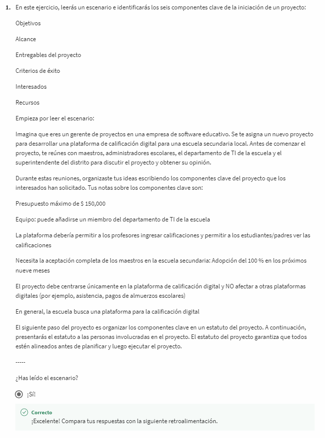

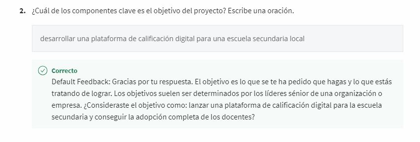

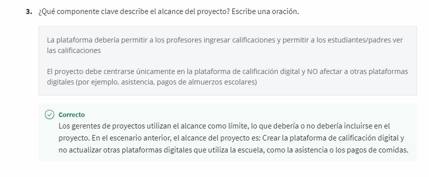

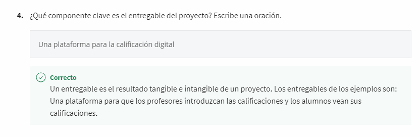

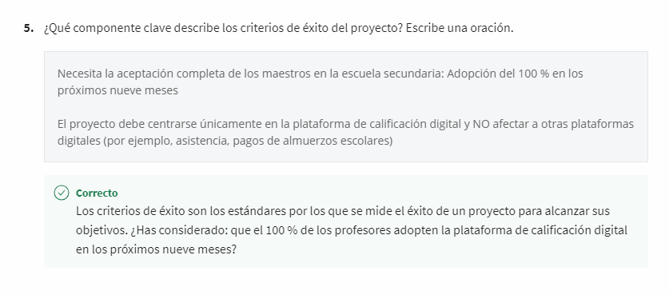

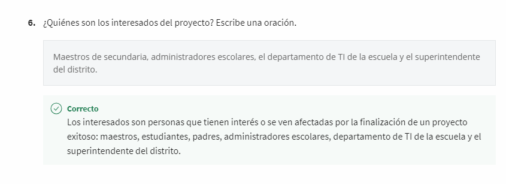

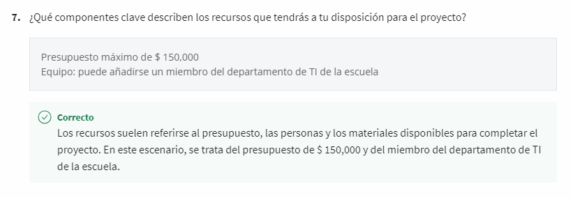

#### Realizar un análisis de costo-beneficio

Análisis de costo-beneficio es el proceso de sumar el valor esperado de un proyecto (los beneficios) y compararlo con los
costos en dólares. *retorno de la inversión (ROI).*

*Beneficios de un análisis de costo-beneficio:*

    Un análisis de costo-beneficio puede minimizar los riesgos y maximizar las ganancias para proyectos y organizaciones.

    Ayuda a comunicarte claramente con los interesados y los ejecutivos y mantener tu proyecto en marcha.

    Al utilizar datos objetivos, puede ayudar a reducir los sesgos y evitar que el interés propio de los interesados influya
    en las decisiones.

    Presentar un caso comercial sólido para los interesados y el liderazgo, y garantizar que tu organización persiga los
    proyectos más rentables o útiles

    Las organizaciones utilizan análisis de costo-beneficio para reducir el desperdicio e invertir sus recursos de manera
     responsable.

*Preguntas orientadoras para un análisis de costo-beneficio:*

Cuando persigues un proyecto, los beneficios deben superar los costos. Para determinar los beneficios de un proyecto, pue-
des preguntar:

    ¿Qué valor creará este proyecto?

    ¿Cuánto dinero podría ahorrar este proyecto a nuestra organización?

    ¿Cuánto dinero aportará de los clientes existentes?

    ¿Cuánto tiempo ahorrará?

    ¿Cómo mejorará la experiencia del cliente?

Para determinar los costos de un proyecto, considere preguntas como:

    ¿Cuánto tiempo tendrán que dedicar las personas a este proyecto?

    ¿Cuáles son los costos únicos?

    ¿Existen costos continuos?

    ¿Qué pasa con los costos a largo plazo?

Preguntas sobre *beneficios intangibles.* Se trata de ganancias que no son cuantificables, como por
ejemplo:

    Satisfacción del cliente ¿El proyecto aumentará la retención de clientes y hará que gasten más en los productos o
    servicios de la empresa?

    Satisfacción del empleado ¿Es probable que el proyecto mejore la moral de los empleados y reduzca la rotación?

    Productividad del empleado ¿Reducirá el proyecto las horas extraordinarias de los empleados, ahorrándole dinero a la
    empresa?

    Percepción de la marca ¿Es probable que el proyecto mejore la percepción y el reconocimiento de la marca de la empresa,
    atrayendo a más clientes o proporcionando una ventaja competitiva?

Preguntas para considerar *los costos intangibles.* Estos son costos que no son cuantificables, por ejemplo:

     ¿podría el proyecto poner en riesgo la retención de clientes, la satisfacción de los empleados o la percepción de la
     marca?

Al asignar valores a los costos y beneficios tangibles o intangibles, puedes hacer referencia a proyectos anteriores si-
milares, realizar investigaciones de la industria o consultar con expertos.

*Calcular costos y beneficios:*

El proceso de cálculo de costos y beneficios también se denomina cálculo de retorno de la inversión o ROI. Hay muchas
formas de determinar el ROI de un proyecto, pero la forma más sencilla es comparar los costos iniciales y continuos con
sus beneficios a lo largo del tiempo.

Una formula aplicada del ROI seria:

    ROI = (G-C) / C

    G = representa las ganancias financieras que esperas del proyecto.
    C representa los costos iniciales y continuos de tu inversión en el proyecto.

Por ejemplo, imagina que tu proyecto cuesta $ 6.000 por adelantado más $ 25 por mes durante 12 meses. Esto equivale a $ 300
por año, pero estimas que el proyecto generará $ 10.000 en ingresos durante el transcurso de ese año. Usando la fórmula
anterior, calculas el ROI como: ($10.000 - $6.300) / $6.300 = 0,58 * 100% = 58%

El ROI >= 0,58, o 58%. Consideras que se trata de un gran retorno de la inversión, por lo que decides continuar con el
proyecto

## Define Objetivos, Alcanse y criterios

### Identificar los objetivos del proyecto

#### Determinar los objetivos y entregables del proyecto

Para preparar un proyecto éxitoso y facilitar el trabajo, se recomienda descubrir lo que se debe hacer antes de siquiera
empezar. Es Necesario definir exactamente cuáles son los objetivos y entregables y de esta manera comunicar a los miembros
de tu equipo las actividades a realizar.

Es necesario una visión clara lo que se intenta lograr, cómo se va a lograr y cómo saber cuándo se ha logrado, el primer
paso es definir el objetivo del proyecto para empezar a descubrir qué debe lograr tu equipo del proyecto. El objetivo del
proyecto es el producto final deseado del proyecto. Es lo que han solicitado que se consiga.

Ejemplo de, tu objetivo podría ser mejorar el tiempo de respuesta para aumentar 20 por ciento los clientes por correo electrónico.
Las metas u objetivos son importantes porque brindan una hoja de ruta hacia la consecusion exitosa del proyecto. Sin un
objetivo claro en mente, ¿cómo saber hacia dónde ir o cómo llegar? Una de las mayores diferencias entre lo que constituye
un buen objetivo y uno no tan bueno es cuán bien está definido.

Es decir, cuán claro y específico es el objetivo. Si el objetivo es el fin ultimo, ¿está seguro de que sabrás cuando hayas
llegado? Los ejemplos antes mencionados, mejorar el tiempo de respuesta para aumentar 20 por ciento los clientes por correo
electrónico y aumentar los ingresos un cinco por ciento son dos objetivos bien definidos porque establecen lo que estás
intentando lograr. Las puntuaciones también establecen como lograr la tarea encomendada. En este caso, es por correo elec-
trónico y a través de una nueva oferta de servicios. Estos objetivos aclaran el objetivo aún más al sostener que mejoran
un 20 por ciento y aumentan un cinco por ciento.

*Los objetivos bien definidos son tanto específicos como medibles*, Dan un sentido claro de lo que estás intentando lograr.
Entre mas grande los objetivos, mas detalles conllevan. Al comenzar un proyecto, tómate el tiempo para verificar que tus
objetivos sean medibles y que estén bien definidos. Para verificar cuan medibles y definidos son los objetivos, es posible
que se requiera más información de los interesados.

Con los interesados se debe compartir la visión del proyecto, Preguntar cómo se alinea con los objetivos y la misión más
amplios de la empresa, esto permite delinear aun mas los objetivos del proyecto y la manera de medirlos, Al finalizar
esa conversación, tú y tus interesados deben aceptar apoyar los objetivos del proyecto para evitar tener problemas más
adelante.

Una vez que tengas las metas definidas, es hora de examinar *los entregables del proyecto*. Los entregables del proyecto
son los productos o servicios que se crean para el cliente, o patrocinador del proyecto. En otras palabras, un entregable
es lo que se produce o presenta al final de una tarea, evento o proceso. Adopte el objetivo de mejorar el tiempo de respu-
esta del cliente. Pero un entregable para ese objetivo podría ser la creación de plantillas de correo electrónico para
responder a preguntas típicas. Todos son ejemplos de entregables de proyectos. Uno bastante común es un informe. Cuando se
alcanza un objetivo, puedes ver los resultados documentados en el cuadro, gráfico o la presentación.

Los entregables nos ayudan a cuantificar y darse cuenta del impacto del proyecto. Al igual que se necesitan objetivos bien
definidos, necesitas entregables bien definidos prácticamente por las mismas razones. Los entregables generalmente se deciden
por adelantado con los interesados o clientes involucrados en el proyecto. Ellos responsabilizan a todos y son normalmente
una gran parte del logro del objetivo.

Establecer los entregables es una tarea interna del gerente de proyectos y poner en claro como estos se alinean con los
objetivos del proyecto y mision de la empreasa, ademas de asegurarse de que todos esten enteresados y compartan lo que ello
significa para el proyecto.

#### Cómo definir objetivos SMART

Dado que tus entregables dependen de tus objetivos, lo mejor para ti es definir esos objetivos lo mejor posible. Es
prudente aplicar un método sencillo para hacerlo este metodo para definir objetivos es SMART.

Los objetivos deben ser específicos y medibles, el método SMART para evaluar objetivos consta de tres consideraciones
más para el éxito. Ser alcanzable, ser relevante y tener plazos determinados. Combínados dan origen a Objetivos SMART.

en sistesis, en la metodologia SMART los objetivos deben cumplir las siguientes caracteristicas:

    deben ser específicos.
    deben ser medibles.
    deben ser alcanzables.
    deben ser relevante.
    deben tener plazos determinados.

*Los objetivos específicos deben responder al menos dos de las siguientes preguntas:*

    ¿Qué quiero lograr?
    ¿Por qué es esto un objetivo?
    ¿Tiene una razón, propósito o beneficio específico?
    ¿Quién está involucrado?
    ¿Quién es el beneficiario, Empleados, clientes, la comunidad en general?
    ¿Dónde debe cumplirse el objetivo y hasta qué punto?
    ¿cuáles son los requisitos y limitaciones?

A continuación, queremos definir objetivos que sean medibles, lo que significa que podemos determinar que se cumplieron
objetivamente. Medir no es solo una forma de que las personas sigan el progreso, sino también una herramienta para
ayudar a las personas a mantenerse motivadas. Puedes saber que el objetivo es medible preguntando cuánto y cómo sabré
cuando se haya logrado?

A veces, el éxito de un objetivo puede medirse con un simple sí o no, por ejemplo, ¿Aprendiste a tocar la guitarra, sí
o no? Necesitarás medir la mayoría de tus objetivos con métricas.

Métricas, se utiliza para medir algo como números o cifras. Por ejemplo, si tu objetivo era correr una carrera de cinco
kilómetros, entonces la distancia en kilómetros es tu métrica. En Office Green, El objetivo del proyecto es aumentar los
ingresos en un 5%. En este caso, los ingresos son la métrica.

Por último, considera puntos de referencia para asegurarte de que estás eligiendo métricas precisas. Por ejemplo,
si tu objetivo general es aumentar los ingresos, puedes ver los datos del año pasado como un punto de referencia para
decidir cuánto aumentar los ingresos este año. Si los ingresos del año pasado aumentaron un tres por ciento, entonces
un aumento del cinco por ciento en una economía en auge sería un objetivo razonable para este año.

El objetivo es específico y medible, pero es alcanzable?. ¿Se puede alcanzar razonablemente en función de las métricas?
Normalmente, los objetivos son un poco desafiantes para fomentar el crecimiento, de lo contrario, ¿cuál es el sentido
del objetivo si nada va a cambiar? Sin embargo, se recomienda que no sea demasiado extremo o nunca se alcanzará. Has
fallado incluso antes de comenzar. Se debe encontrar un equilibrio entre los dos extremos.

Por ejemplo, tomemos el objetivo de correr los 5 km. tenien en cuenta que corres habitualmente 2,5 kilómetros tres veces
por semana. Un objetivo alcanzable será pasar de correr 2,5 kilómetros a correr cinco kilómetros en cuatro semanas. Un
objetivo inalcanzable podría ser ganar el primer puesto en los 5 kilómetros. Es decir, podría suceder pero no es
probable, especialmente si nunca antes corriste una carrera, pero ¿cómo puedes saber si un objetivo es alcanzable, si
no es familiar? Una pista para ayudarte a descubrir si tu objetivo es alcanzable es preguntar:

    ¿cómo puede lograrse?

Desglosa el objetivo en partes más pequeñas y ve si eso tiene sentido. Pasar de 2,5 kilómetros a cinco kilómetros en
cuatro semanas significa aumentar tu distancia poco más de medio kilómetro cada semana. No es tan malo, utiliza el
mismo proceso al establecer el alcance del proyecto.

Ahora, es relevante?, ¿tiene sentido intentar alcanzar este objetivo? Determinar cómo se alinea el objetivo con otros
objetivos, prioridades y valores, es primordial para establecer la relevancia del objetivo. Preguntar:

    El objetivo parece valioso?.
    ¿El esfuerzo implica equilibrar los beneficios?
    ¿Coincide con las otras necesidades y prioridades de la organización?

Todos, desde el cliente, el equipo del proyecto, y las personas que finalmente usarán el producto deben sentir que vale
la pena apoyar el objetivo.

También considera tiempo. Tanto la cantidad de tiempo que llevará el proyecto, como los contextos económicos y sociales
más amplios pueden tener grandes impactos. preguntar para establecer tiempos:

    Puede que haya un presupuesto para completar el proyecto ahora, pero ¿la empresa podrá sostener el proyecto en el
    tiempo?
    ¿Existe una audiencia que seguirá usando el producto o servicio una vez entregado?

Una vez que tengas las respuestas a estas preguntas, debes tener un objetivo claro que colabore en la dirección del
proyecto. Si aún no hay seguridad acerca de los objetivos del proyecto, sigue investigando.

Está bien hacer preguntas si tienes dudas, comunicar las inquietudes a los principales interesados del proyecto y al
supervisor directo u otros colegas, por lo que es posible sentirte seguro de avanzar en el plan.

El último elemento de la lista de verificación es asegurarse de que tenga plazos determinados. Con plazos determinados
significa que el objetivo tenga un plazo. Los plazos ofrecen una forma de verificar el progreso, de lo contrario, es
posible que nunca se alcance el objetivo o ni siquiera se incie. El tiempo y las métricas suelen ir de la mano, porque
el tiempo también se puede utilizar como métrica.

Que una meta tenga plazos determinados, brinda una manera de desglosar cuánto se debe lograr con el tiempo. Por ejemplo,
si es necesario aumentar los ingresos para fin de año, es recomendable desglosar cuanto se debe aumentar cada trimestre,
mes y semana y eso es todo.

Específico, medible, alcanzable, relevante y con plazos determinados y un método casi infalible para crear una
evaluación de los objetivos del proyecto

como nota acalratoria:

    Es mejortrabaja sabiamente, no duramente.

#### Introducción a OKR

*OKR significa objetivos y resultados clave.* Combinan un objetivo y una métrica para determinar un resultado medible.

Objetivos: define lo que se debe lograrse; describe un resultado deseado. Resultados clave: los resultados medibles que
definen objetivamente cuándo se ha cumplido el objetivo

Los OKR para toda la empresa se utilizan para definir un objetivo final para toda la organización, mientras que los OKR
a nivel de equipo, departamento y proyecto describen los resultados enfocados que cada grupo deberá lograr para apoyar a
la organización.

Los OKR llevan los objetivos SMART un paso más allá al combinar un objetivo y métricas más detalladas para determinar
un resultado medible. No solo establecen claramente cuál es el objetivo, proporcionan detalles específicos que te
permiten medir el éxito del objetivo.

Una forma de pensar en los OKR es que separan los diferentes componentes del objetivo SMART y los aclaran aún más, en
lugar de agrupar todo en un solo enunciado.

La O significa objetivo y define lo que se necesita lograr. Describe el resultado o producto final deseados, como un
aumento en la retención de clientes, o una mejora en el proceso de incorporación de empleados.

KR hace referencia a los resultados clave. Son los resultados medibles que definen cuándo se ha cumplido el objetivo. Por
ejemplo, si tu objetivo es mejorar la retención de clientes, entonces el resultado clave podría ser tener
una calificación del 90 por ciento de satisfacción del cliente al final del primer trimestre.

Recuerda que uno de los criterios SMART es la cualidad de alcanzable, lo que significa que es factible lograr el
objetivo. Sin embargo, los resultados clave deberían ser un poco más ambiciosos.

En Google, usamos OKR para definir objetivos flexibles como una forma de desafiarnos a nosotros mismos a hacer algo que
no hemos logrado antes. Si realmente logramos todos nuestros resultados clave, es posible que hayamos hecho nuestros OKR
demasiado fáciles.

Los objetivos definen lo que debe lograrse y describen el producto final deseado. Los resultados clave definen cómo
sabemos si has logrado tu objetivo o no.

¿Cómo funcionan los OKR en la práctica? ¿Cómo se usan para administrar un proyecto?

Las organizaciones a menudo definen OKR en diferentes niveles, como el nivel de empresa, del departamento o del equipo y
el nivel del proyecto.

Los OKR a nivel de empresa se comparten comúnmente en toda una organización para que todos tengan claros los objetivos
de la empresa. Por lo general, se actualizan anualmente para ayudar a conducir a la organización en la dirección que
quiere ir. Estos OKR de alto nivel apoyan la misión de la organización.

Los OKR a nivel de proyecto deben respaldar y estar alineados con los OKR a nivel de empresa. Algunos de estos resultados
clave a nivel de empresa podrían convertirse en la base de proyectos. Los OKR a nivel de proyecto se definen durante la fase
de iniciación para ayudar a definir objetivos medibles del proyecto. Hay seguimiento durante la etapa de planificación y
ejecución para medir el éxito del proyecto. Los OKR a nivel de proyecto deben alinearse y apoyar a los OKR a nivel de
empresa y de departamento.

Los OKR a nivel de equipo o departamento apoyan los OKR más amplios de la empresa y ayudan a impulsar el rendimiento del
equipo. Los departamentos pueden desarrollar OKR de manera más específica para su función laboral.

#### Creación de OKR para tu proyecto

*Define tus objetivos:*

Los objetivos del proyecto deben ser aspiracionales, alineados con las metas organizacionales, orientados a la acción,
concretos y significativos. Considera la visión que tu y los interesados tienen para tu proyecto y determina lo que deseas
que el equipo del proyecto logre en 3 a 6 meses.

Ejemplos:

    Crear el software de seguridad de datos más seguro

    Mejorar continuamente el análisis web y las conversiones.

    Brindar un servicio de alto rendimiento

    Crear una aplicación disponible universalmente

    Aumentar el alcance del mercado

    Lograr las mejores ventas entre los competidores de la región

Los objetivos sólidos cumplen los siguientes criterios:

    Aspiracionales

    Alineados con los objetivos de la organización

    Orientados a la acción

    Concretos

    Significativos

Para ayudar a dar forma a cada objetivo, pregúntate a ti mismo y a tu equipo:

    ¿El objetivo ayuda a lograr los objetivos generales del proyecto?

    ¿El objetivo se alinea con los OKR de la empresa y del departamento?

    ¿El objetivo es inspirador y motivador?

    ¿Conseguir el objetivo tendrá un impacto significativo?

*Desarrollar resultados clave:*

A continuación, agrega entre 2 y 3 resultados clave para cada objetivo. Los resultados clave deben estar sujetos a plazos
determinados. Se pueden usar para indicar la cantidad de progreso que debe lograrse en un período más corto o para definir
si cumpliste tu objetivo al final del proyecto. También deberían desafiarte a ti y a tu equipo a esforzarse para lograr
más.

Ejemplos:

    X % de nuevos registros en el primer trimestre posterior al lanzamiento

    Aumentar la inversión de los anunciantes en un X %.

    La adopción de nuevas funciones es de al menos un X %

    Los clientes informan un máximo de 2 errores críticos por Sprint

    Mantener la tasa de cancelación de suscripción al boletín en un X %

Los resultados clave sólidos cumplen los siguientes criterios:

    Están orientados a los resultados, no a una tarea

    Son medibles y verificables

    Son específicos y con plazos determinados

    Son agresivos pero realistas

Para ayudar a dar forma a tus resultados clave, pregúntate a ti mismo y a tu equipo lo siguiente:

    ¿Qué significa el éxito?

    ¿Qué métricas probarían que hemos logrado el objetivo con éxito?

*Prácticas recomendadas en el desarrollo de los OKR:*

Estas son algunas de las prácticas recomendadas que deben tenerse en cuenta al escribir los OKR:

    Piensa en tus objetivos como motivadores e inspiradores y tus resultados clave como tácticos y específicos. El objetivo
    describe lo que quieres hacer y los resultados clave describen cómo sabrás que lo hiciste.

    Como regla general, intenta desarrollar entre 2 y 3 resultados clave para cada objetivo.

    Asegúrate de documentar tus OKR y vincularlos a tu plan de proyecto.

#### Eemplo de crear los OKR para tu proyecto

### Definir el alcance del proyecto

El alcance de tu proyecto incluye los límites de un proyecto. La forma en que lo definimos en Google es "un conocimiento
acordado de lo que se incluye o excluye en un proyecto". El alcance ayuda a garantizar que tu proyecto esté claramente
definido y trazado. Eso significa saber exactamente a quién se entregará el proyecto y quién usará el resultado final del
proyecto. También necesitas tener una idea sólida de la complejidad del proyecto.

¿Es sencillo con una lista de tareas manejable? ¿O requerirá investigación exhaustiva, varias rondas de aprobaciones y un
proceso de producción a gran escala que tardará años en completarse? El alcance también incluye el cronograma del proyecto,
el presupuesto y los recursos. Necesitas definirlos claramente para que puedas asegurarte de que estás trabajando dentro
de esos límites y lo que es realmente posible para que el proyecto funcione.

Un alcance mal definido o cambios importantes en tu alcance pueden provocar cambios en el presupuesto, el cronograma o
incluso el resultado final del proyecto.

Aquí hay algunas preguntas útiles más para añadir a la lista. ¿De dónde ha salido el proyecto? ¿Por qué es necesario? ¿Qué
se espera que logre el proyecto? ¿Qué tiene en mente el patrocinador del proyecto? ¿Quién aprueba los resultados finales?
Ahora estarás realmente preparado. En cuanto al tiempo, definir el alcance del proyecto debería llevarse a cabo durante
la fase inicial de planificación. Se recomienza comenzar a descubrir el alcance desde el principio para que todos puedan
aceptar el mismo conjunto de expectativas. Ayudará a mitigar los riesgos de grandes cambios más adelante. Sin embargo, siempre
puedes ajustar el alcance a medida que avance la planificación, si es necesario.

Se recomienda documentar todos los detalles para que cualquiera pueda consultarlos durante el ciclo de vida del proyecto.

*En sintesis:*

Un alcance claramente definido describe todos los detalles de un proyecto y regula lo que puede agregarse o eliminarse a
medida que avanza. Si bien finalmente es responsabilidad del gerente de proyectos supervisar el proyecto y asegurarse de
que todo el trabajo y los recursos entren en el alcance, puede alentarse a los miembros del equipo e interesados a hacer
su parte centrándose en las tareas más importantes para alcanzar el objetivo del proyecto.

#### Recopilar información para definir el alcance

Imagina que mientras trabajas en un grupo de administración de un restaurante, tu gerente te llama y te pide que “modernices
el espacio del comedor”, luego cuelga rápidamente el teléfono sin darte más indicaciones. En esta transferencia inicial
del gerente, te falta mucha información. ¿Cómo sabes siquiera qué preguntar?

Aqui algunos ejemplos de preguntas asociadas ocn el ejemplo anterior:

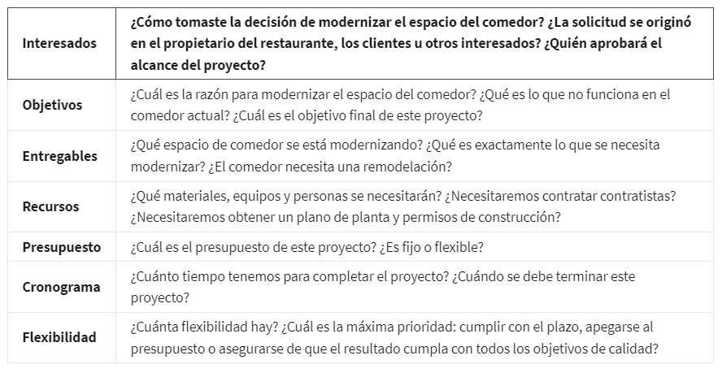

*Conclusión clave:*

Tomarse el tiempo para hacer preguntas y asegurarse de que comprendes el alcance del proyecto ayudará a reducir los gastos,
el reproceso, la frustración y la confusión. Asegúrate de comprender quién, qué, cuándo, dónde, por qué y cómo se aplica
al alcance. Si te falta algo de esa información, enfoca tus preguntas en esos elementos. La fase de iniciación del proyecto
sienta las bases para el proyecto, por lo que es esencial asegurarse de comprender el alcance y las expectativas durante
esta etapa.

#### Seguimiento y mantenimiento del alcance de un proyecto

Un objetivo importante de la gestión de proyectos es estar atento al alcance del proyecto y saber qué tareas son realmente
parte del plan y cuáles no lo son.

Las tareas incluidas en el proyecto y que contribuyen al objetivo general del proyecto se consideran dentro del alcance.
Las tareas que no están incluidas se denominan fuera del alcance.

Es tu trabajo como gerente de proyectos definir y mantener límites firmes para tu proyecto para que tu equipo pueda seguir
por el buen camino.

Por ejemplo, si a los redactores o diseñadores del catálogo de Plant Pals, se les ocurrió la idea para ampliar el tipo
de plantas que se ofrecen a los mejores clientes, tendrías que señalar que su sugerencia está fuera del alcance y llevaría
tiempo adicional y aumentar los costos de su presupuesto.

A medida que avanzas por el ciclo de vida del proyecto, te encontrarás desafíos inesperados o señalar nuevos detalles o
ideas que podrían afectar el éxito de tu proyecto. Los cambios, el crecimiento y los factores descontrolados que afectan
el alcance del proyecto en cualquier momento posterior al comienzo del proyecto se denominan "corrupción del alcance".

La corrupción del alcance es un problema común, y no siempre es fácil de controlar. Es uno con el que luchamos en cada
proyecto. Puede suceder en cualquier proyecto, en cualquier sector.

Imagina que estás trabajando en una empresa tecnológica y tu proyecto implica trabajar con diseñadores e ingenieros para
actualizar el diseño de los iconos de idiomas en una aplicación de teclado móvil para un teléfono inteligente.
Mientras el equipo está realizando la actualización, se dan cuenta de que el icono de búsqueda y el icono de entrada de
voz también necesitan una actualización del diseño. Son características muy pequeñas y, aunque técnicamente no está
dentro del alcance, el equipo cree que requeriría un esfuerzo mínimo y proporcionan mucho valor. Así que siguen adelante
y hacen las actualizaciones. Durante una revisión de los interesados, se ha señalado que hay un teclado en inglés, pero
no hay teclados para otros idiomas y se sugiere diseñar teclados adicionales. En este punto, el alcance del proyecto
está en peligro de expandirse desde una simple actualización de iconos hasta un despliegue complejo de varias
distribuciones de teclado. Añadir los teclados sería afectar los cronogramas del equipo y provocar que se tarde más en
terminar el proyecto. También afectaría los recursos, porque necesitarías contratar más personas o algunos de los
miembros actuales del equipo tendrían que trabajar horas extras. Y aumentaría el presupuesto, ya que el equipo no previó
los costos por horas extra o traducciones de teclado. Este es solo un ejemplo de corrupción del alcance. A veces es
sutil ("Solo diseña uno o dos íconos más") o más obvia ("Oye, ¿puedes añadir el diseño de teclados para otros idiomas?")
Al identificar la corrupción del alcance y ser proactivo, proteges a tu proyecto y al proyecto de tu equipo.

Para ayudarte a combatir la corrupción del alcance, debes saber que hay dos fuentes principales de las que surge:
externas e internas.

*Las fuentes externas de corrupción* del alcance son más fáciles de reconocer.

Por ejemplo, si estás trabajando en un proyecto con un cliente principal, el cliente podría solicitar cambios, el
entorno empresarial a tu alrededor podría cambiar o la tecnología subyacente que estás usando podría cambiar.

Si bien no puedes controlar todo lo que sucede, también existen algunas desventajas a tener en cuenta. En primer lugar,
asegúrate de que los interesados tengan visibilidad del proyecto. Se recomienda que sepan los detalles de lo que se va
a producir, qué recursos se necesitan, cuánto costará y cuánto tiempo llevará. Además, obtén claridad de los requisitos
y solicita críticas constructivas sobre la propuesta de producto inicial.

Es importante obtener esta información antes de firmar cualquier contrato. Asegúrate definir reglas básicas y expectativas
para la participación de los interesados una vez que se ponga en marcha el proyecto. Llega a un acuerdo sobre cada uno de
tus roles y responsabilidades durante las revisiones de ejecución y estado. Una vez que tengas claro el alcance del proyecto,
idea un plan sobre cómo hacer frente a solicitudes fuera del alcance.

Determinar quién puede realizar solicitudes formales de cambio y cómo se evaluarán, aceptarán y realizarán dichas
solicitudes. Y, por último, asegúrate de tener estos acuerdos por escrito. De esta manera, siempre tendrás documentación
para señalar si tú, un interesado o el cliente tienen un desacuerdo más adelante.

Una de las principales causas de la corrupción externa del alcance es no ser claro sobre los requisitos antes de definir
el alcance y obtener la aprobación formal para avanzar con el proyecto. Aquí es donde entran en juego los objetivos
medibles y específicos y los entregables.

Si los requisitos no son específicos y si no has llegado a un acuerdo sobre los procesos del proyecto, los entregables e
hitos, entonces es casi garantizado que lidiarás con la corrupción del alcance una vez que comienza el proyecto.

*Las fuentes internas de corrupción del alcance:*

son más complicadas de detectar y más difíciles de controlar. Este tipo de corrupción proviene de miembros del equipo
del proyecto que sugieren o incluso insisten en cambios o mejoras de procesos o productos.

Es posible que un desarrollador de productos justifique una decisión sobre los motivos para mejorar el producto, aunque
vaya a costar más o un líder de equipo podría decidir que un proceso determinado es más eficiente sin darse cuenta del
impacto que el cambio en el proceso tendrá en otros miembros del equipo encargados de diferentes partes del proyecto.

Lo que debes dejar en claro para tu equipo es que cualquier cambio fuera del alcance del proyecto se sale de la esencia,
amenaza el cronograma y aumenta el riesgo.

No hay pequeños impactos en el alcance del proyecto. Cada vez que un miembro del equipo asume una tarea no planificada,
se pierde más que solo el tiempo invertido en esa tarea.

Es responsabilidad como gerente de proyectos mantener los límites del proyecto. La mejor defensa es conocer completamente
los detalles de tu proyecto para estar siempre preparado con la respuesta más adecuada para una nueva idea o solicitud.

Recapitulemos. Monitorea el alcance de tu proyecto y protégelo a toda costa. Incluso el cambio más pequeño puede
significar un mayor riesgo para el éxito de tu proyecto.

#### Estrategias para controlar la corrupción del alcance

*Prácticas recomendadas de gestión del alcance:*

La corrupción del alcance es cuando el trabajo de un proyecto comienza a crecer más allá de lo que se acordó originalmente
durante la fase de iniciación. La corrupción del alcance puede generar estrés en ti, en tu equipo y tu organización, y puede
poner en riesgo tu proyecto. Los efectos de la corrupción del alcance pueden obstaculizar todos los aspectos del proyecto,
desde el cronograma hasta el presupuesto, los recursos y, en última instancia, su éxito general.

Las prácticas recomendadas para la gestión del alcance y el control de la corrupción del alcance:

*Define los requisitos de tu proyecto.* Comunícate con los interesados o clientes para descubrir exactamente qué quieren
del proyecto y documenta esos requisitos durante la fase de iniciación.

*Establece un cronograma de proyecto claro*. La gestión del tiempo y las tareas son esenciales para apegarte al alcance
de tu proyecto. Tu cronograma debe describir todos los requisitos de tu proyecto y las tareas que son necesarias para
lograrlos.

*Determina qué está fuera del alcance.* Asegúrate de que los interesados, los clientes y el equipo del proyecto comprendan
cuándo los cambios propuestos están fuera de alcance. Llega a un acuerdo claro sobre los posibles impactos al proyecto y
documenta el acuerdo.

*Brindar alternativas.* Sugiere soluciones alternativas al cliente o los interesados. También puedes ayudarlos a considerar
cómo los cambios propuestos podrían crear riesgos adicionales. Realiza un análisis de costo-beneficio, si es necesario.

*Configura un proceso de control de cambios.* Durante el transcurso del proyecto, algunos cambios son inevitables. Determina
el proceso de cómo se definirá, revisará y aprobará (o rechazará) cada cambio antes de agregarlo al plan de tu proyecto.
Asegúrate de que tu equipo de proyecto esté al tanto de este proceso.

*Aprende a decir que no.* A veces tendrás que decir que no a los cambios propuestos. Decir que no a los interesados o a un
cliente clave puede resultar incómodo, pero puede ser necesario para proteger el alcance de tu proyecto y su calidad general.
Si te piden que asumas tareas adicionales, explica cómo interferirán con el presupuesto, el cronograma o los recursos definidos
en los requisitos iniciales del proyecto.

*Recoge los costos del trabajo fuera del alcance.* Si se requiere trabajo fuera del alcance, asegúrate de documentar todos
los costos incurridos. Eso incluye los costos de trabajo afectados indirectamente por el aumento del alcance. Asegúrate
de indicar para qué son los cargos.

*Conclusion:*

Solo puedes evitar la corrupción del alcance si todos los involucrados en el proyecto comprenden y están de acuerdo con
las responsabilidades, los límites y los plazos. Evitar la corrupción del alcance también requiere una comunicación clara,
gestión de expectativas y un camino bien definido hacia el resultado deseado.

#### Gestionar cambios en el alcance de un proyecto

Gestionar el alcance va de la mano con definir objetivos. Por ejemplo, redefinir el alcance puede cambiar el objetivo y
una revisión del objetivo puede cambiar el alcance. El concepto de alcance del proyecto es importante en todo el proyecto.

Si bien cada proyecto tendrá sus propios objetivos, el objetivo general para el gerente de proyectos es entregar el proyec-
to según los acuerdos de alcance. Esto incluye entregar el proyecto dentro del plazo establecido y el presupuesto aprobado.

Al avanzar el proyecto, continuamente se necesario hacer concesiones y sopesar las compensaciones a medida que se presentan
nuevos desafíos, cambios y factores. Cada vez que un miembro del equipo asume una tarea no planificada, se pierde más que
solo el tiempo dedicado a trabajar en esa tarea.

Para decidir si un cambio de alcance es aceptable y qué impacto tendrá, los gerentes de proyectos generalmente se refieren al
modelo de restricción triple.

*El modelo de restricción triple:*

es la combinación de las tres restricciones más significativas de cualquier proyecto: alcance, tiempo y costo.

    *El tiempo* se refiere al cronograma y los plazos del proyecto.

    *El costo* incluye el presupuesto y también abarca los recursos y las personas que trabajarán en el proyecto.

Tanto el tiempo como el presupuesto deben gestionarse con cuidado junto con el alcance. Los tres están vinculados; no se
puede cambiar uno sin tener un impacto en los demás.

Por ejemplo, una disminución en el costo significa un cambio en el tiempo o alcance. Un aumento de tiempo significa un cambio en
el alcance, el costo o ambos. Es clave comprender cómo cambiar uno afecta a las otras dos limitaciones. Es importante considerar
qué intercambios estás dispuesto a hacer a medida que avanza el proyecto. Para hacerlo con éxito, es necesario comprender las
prioridades del proyecto, qué es lo más importante respecto del alcance, el tiempo y el costo.

Si debe cumplirse una fecha límite específica, debes limitar los cambios de alcance que puedan hacer que el proyecto supere la
fecha límite.

Si el producto debe verse o funcionar de cierta manera, entonces los requisitos son una prioridad y podrías justificar cambios
en el costo o el tiempo para cumplir con los requisitos del alcance. Pero solo porque es posible hacer un cambio, no significa que
necesariamente se deba hacer el cambio. Y a pesar de que se han definido los límites de alcance, tiempo y costos, se puede realizar
cambios si existe una buena razón para hacerlo.

el gerente de projectos no tendrá que decidir estos cambios por su cuenta. Si deben tomarse decisiones de alcance, es probable
que el gerente de proyectos deba consultar con el patrocinador y los interesados para obtener sus aprobaciones.

En la primera situación, se ha realizado una solicitud para mejorar las características del producto Plant Pals. El director de
Producto de Office Green quiere usar macetas que indiquen cuándo deben regarse las plantas. Hacer cambios en el producto es un
cambio de alcance. Sabes que no puedes cambiar el presupuesto, pero puedes ampliar el cronograma. Entonces, puedes aceptar las
solicitudes de cambio de alcance y ampliar el cronograma, siempre que el presupuesto no aumente.

Aquí hay otra situación posible. Se ha realizado una solicitud para reducir el presupuesto sin realizar cambios en el alcance. El
resultado final de Plant Pals aún debe verse y funcionar como se acordó originalmente. Si vas a reducir el presupuesto y mantener
el alcance, puede que debas ampliar el cronograma.

Aquí hay otra situación. Hay una solicitud para ajustar la línea de tiempo y terminar temprano, pero no se puede aumentar el
presupuesto. Para esto, se deben realizar cambios en el alcance, como limitar las opciones de envío. Hacer esto le dará más tiempo
a tu proyecto, porque tendrás un contrato de envío menos que negociar. El resultado final no será exactamente lo que se acordó en
principio, pero significa sacarlo antes según lo solicitado y dentro del presupuesto.

Probemos una más. En esta última situación, el director de Producto te informa que debe cumplirse la fecha límite del proyecto, es
lo más importante. En este caso, tus interesados están dispuestos a aumentar el presupuesto y realizar los cambios necesarios en
los requisitos del alcance para cumplir con la fecha límite. Al final, se trata de priorizar qué elemento del triángulo importa
más en el proyecto.

Al comprender el modelo de restricción triple, tendrás las herramientas para evaluar los cambios de alcance. Entender cómo los
cambios se evaluarán, aceptarán y realizarán es clave para la gestión del alcance.

#### La importancia de mantenerse dentro del alcance

el alcance es importante porque tener un alcance bien definido al comienzo de un proyecto ayudará a garantizar que los miembros
de tu equipo y los interesados estén alineados y en la misma frecuencia desde el principio, y puedes evitar cualquier pro-
blema que pudiera surgir y que tal vez no hayas tenido en cuenta. Algunos desafíos de mantenerse dentro del alcance podrían
ser lo que llamamos "corrupción del alcance" y esto puede pasar, por ejemplo, si tienes algunos interesados que tienen
ciertas necesidades, deseos o solicitudes que puedan terminar cambiando el alcance. La corrupción del alcance es cuando
cambia el alcance después de haber empezado el proyecto. Y esto puede ser un verdadero desafío para manejarlo si no lo vi-
gilas desde el principio.

Para administrar el alcance se recomienda asegurarse de documentar todo al principio y compartirlo con todos los interesados
y miembros del equipo, y asegurarse de que todos estén de acuerdo sobre ese alcance. Hay ocasiones en las que puede que
el alcance deba cambiar y está bien. Pero tienes que poder asegurarte de que también puedes cambiar el cronograma, los
recursos o incluso el presupuesto para adaptarse a ese cambio de alcance.

### Medir el éxito de un proyecto

#### Lanzar y aterrizar un proyecto

Entregar el resultado final de tu proyecto al cliente o usuario es el aterrizaje del proyecto. Terminas de desarrollar o
crear un proyecto, se completan las tareas y los entregables están hechos. Has alcanzado tu objetivo. El proyecto es exi-
toso y se considera completo en ese sentido, pero ¿funciona bien? ¿Logró el resultado deseado? El factor decisivo real del
éxito del proyecto es cuando se pone el producto final a prueba.

El aterrizaje es cuando realmente mides el éxito de tu proyecto con los criterios de éxito definidos al inicio del proyecto.

Tu éxito debe continuar más allá de entregar el proyecto final. Debes poder medir si el proyecto funciona según lo previsto
una vez que se pone en práctica.

En la mayoría de los proyectos, un lanzamiento en sí no es una medida significativa de éxito. Es lo que viene después del
lanzamiento lo que realmente cuenta. Los lanzamientos son solo un medio hacia un fin; es importante mirar más allá del
lanzamiento para garantizar que el lanzamiento logre sus objetivos generales.

Mirando más allá del lanzamiento hacia el aterrizaje, es más probable que llegues a donde intentas llegar. Dado que el
aterrizaje es un concepto y no una definición finita, es importante definir cómo se ve un aterrizaje exitoso para un pro-
yecto en particular. Una forma de medir y ayudarte a garantizar el éxito del proyecto. Se llama criterios de éxito y, si
logras seguirlos durante el ciclo de vida del proyecto, finalmente tendrás un aterrizaje suave.

Los criterios de éxito incluyen todos los detalles específicos de tus objetivos y entregables y pueden ser una guía para
saber si has logrado lo que te propusiste. Los criterios de éxito definirán estándares sobre cómo se juzgará tu proyecto.

#### Lectura: No te olvides de aterrizar: Medir el éxito del proyecto

En la gestión de proyectos, el "lanzamiento" de un proyecto significa que has entregado los resultados finales del proyecto
al cliente o usuario. Sin embargo, no puedes basar el éxito del proyecto únicamente en cuándo el cliente acepta el proyecto.
Tu trabajo en un proyecto no estará completo hasta que lo “aterrices” al medir minuciosamente los resultados. Aquí es cuando
serán útiles los criterios de éxito y las métricas que definiste inicialmente al establecer los objetivos SMART.

Los equipos deben tener claro lo que están tratando de lograr, más allá de simplemente lanzar algo a los usuarios.

¿Tu proyecto aumentará la retención?
¿Tu proyecto acelerará una característica del producto?

Dependiendo del producto y la situación, las respuestas serán diferentes, pero es importante que tu equipo se alinee y trabaje
hacia el mismo objetivo medible.

Un error común de muchos equipos de proyectos es "lanzar y olvidar" los resultados. Esto sucede cuando un gerente de proyectos
entrega el proyecto al cliente y el cliente acepta la entrega del proyecto, pero el gerente de proyectos no evalúa si los
entregables del proyecto satisfacen al cliente o al usuario.

El aterrizaje de un proyecto no debería crear más obstáculos. Si se hace correctamente, un aterrizaje crea una mayor ali-
neación dentro de los equipos sobre los resultados finales que todos desean y brinda a todos en el equipo una mejor visibi-
lidad sobre cómo lograr el éxito.

Lanzar tu proyecto al cliente puede ser un gran momento para ti. Le entregaste el proyecto a tu cliente y ahora puedes dar
un paso al costado y tomar un respiro. Pero asegúrate también de aterrizar tu proyecto. Revisa tus notas, habla con tu
equipo, reúnete con el cliente y recuerda volver a las métricas y los entregables previstos para ayudarte a medir el éxito.

#### Definir criterios de éxito

Al comienzo del proyecto, definiste objetivos y entregables que son medibles, es decir que puedes determinar si se cump-
lieron.

Del mismo modo, debes definir criterios de éxito que también puedan medirse para saber si se cumplieron. Los criterios de
éxito te dirán si el proyecto en su conjunto tuvo éxito o no. Son los detalles específicos de tus objetivos y entregables
que te dicen si has logrado lo que te propusiste.

Son los estándares por los que se juzgará el proyecto una vez que se haya entregado a los interesados y clientes. Definir
los criterios de éxito también aclara al equipo lo que están intentando lograr más allá de tan solo lanzar algo a los
usuarios.

¿Es aumentar la satisfacción del cliente con el servicio para que puedan seguir comprando más productos? ¿Mejorar una
función existente para retener clientes? Según el proyecto, las respuestas serán diferentes. Pero es importante que un
equipo esté alineado y trabaje hacia un objetivo compartido.

A veces forzar la conversación y aclarar cómo se ve el resultado final puedes sacar a la luz preguntas y áreas de desacuerdo.

Revisa los objetivos y entregables de tu proyecto, revisa el alcance e identifica los aspectos medibles del proyecto. Estas
serán algunas de las métricas utilizadas en los objetivos y entregables, junto con el presupuesto y los detalles de cronograma.

Obtener claridad de los interesados sobre los requisitos y expectativas del proyecto. Esa es la clave. Hay mucha gente
involucrada en cualquier proyecto; eso significa muchas ideas sobre cómo se ve el éxito para cada persona. Se recomienda
que hagas preguntas, por ejemplo:

¿Quién dice finalmente si el proyecto es exitoso o no?
¿Qué criterios se medirán para determinar el éxito?
¿En qué se basa el éxito de este proyecto?

Una vez que hayas recopilado información aclaratoria, documéntala y compártela para que tú, tu equipo y los interesados
puedan consultarlo luego.

No basta con hacer una lista de criterios; se necesita un proceso para medir el éxito de principio a fin en todo el ciclo
de vida del proyecto. De esta forma, puedes realizar ajustes y asegurarte de tener éxito cuando estés listo para aterrizar.
Hay muchas métricas que puedes utilizar y, para algunos productos, será lógico utilizar más de uno. Las métricas que elijas
deben estar alineadas con el objetivo de tu proyecto lo máximo posible.

Por ejemplo, las "métricas de felicidad" miden las actitudes y la satisfacción de los usuarios o facilidad de uso perci-
bida, y puedes medirlos mediante encuestas.

considerar las métricas de participación y adopción del cliente, junto con métricas más comerciales que rastrean cosas
como las ventas y el crecimiento. La adopción se refiere a cómo el cliente usa y adopta un producto o servicio sin problemas.

El compromiso se refiere a la frecuencia o importancia de la interacción y participación del cliente a lo largo del tiempo.

Las métricas de adopción pueden incluir lanzar un nuevo producto a un grupo de usuarios y que una gran cantidad lo utilicen
o lo adopten. Las métricas de participación pueden incluir el aumento del uso diario de una función de diseño o de pedidos
e interacciones con los clientes.

Una vez que hayas definido las métricas que medirás, piensa en cómo rastreas estas métricas. Evalúa qué herramientas pueden
ayudarte a recopilar los datos necesarios para asegurarte de mantenerte encaminado.

Por ejemplo, si estás midiendo métricas comerciales como ingresos, considera rastrearlo en una hoja de cálculo o tablero,
donde puedas detectar brechas y tendencias. Si estás midiendo la satisfacción del cliente, puedes pensar en una forma de
incentivar a los clientes a participar en encuestas periódicas por correo electrónico y crear un sistema para medir sus
respuestas cuando participan.

También utiliza tus herramientas de gestión de proyectos para comprobar las métricas de eficiencia, como qué porcentaje
de tareas se completan o si el proyecto avanza dentro de los plazos previstos.

Es inteligente medir el éxito con tu equipo mientras un proyecto o el producto está en curso. Por ejemplo, puedes realizar
una revisión del proyecto una vez al mes, hacer que los miembros completen listas de verificación de tareas antes de ciertos
plazos o realizar sesiones de comentarios en vivo con sus usuarios o clientes.

Hay muchas formas diferentes de medir el éxito. La clave es elegir los métodos que mejor se adapten a tus criterios de éxito.
Junto con cada criterio de éxito en tu lista, es buena idea también incluir los métodos de cómo se medirá el éxito, con qué
frecuencia se mide y quién es responsable de medirlo. Comparte el documento de criterios de éxito con tus interesados y
pregunta si están de acuerdo con cómo se determinará el éxito del proyecto.

También es una buena idea que los interesados apropiados aprueben los criterios de éxito. De esta forma, todos tendrán
claro quién es el responsable de cada tarea y todos comprenderán a fondo lo que implica el camino hacia el éxito.

Mantén esta documentación visible durante la duración del proyecto y comunícala claramente con tu equipo en todo momento.
Ellos son los que intentarán cumplir con los diferentes requisitos, así que no les ocultes lo que se supone que deben hacer
o cómo se supone que deben hacerlo. Si se hace correctamente, definir tus criterios de éxito debería crear mayor alineación
en el equipo y brindar a todos una mejor visibilidad sobre cómo lograr el éxito.

La claridad de las métricas de éxito también ayuda a los equipos a priorizar los esfuerzos con mayor impacto para sus usuarios.

#### Seguimiento y comunicación de criterios de éxito

Recuerda que los objetivos SMART son eSpecíficos, Medibles, Alcanzables, Relevantes y con plazos determinados y ayudan a
mantener un proyecto encaminado hacia el éxito.

También podemos determinar el éxito de un proyecto por la calidad del producto, la capacidad de satisfacer las necesidades
de sus clientes y la necesidad de satisfacer las expectativas de sus interesados.

*Criterios basados en calidad de producto:*

El producto, o resultado final, de un proyecto tiene su propio conjunto de atributos que definen el éxito. Los atributos
del producto que son necesarios para el éxito del producto incluyen integridad y calidad de las características, costo
unitario, facilidad de uso, etc.

La medida en que un producto esté completo contribuirá al éxito del producto. Esto puede aplicarse a cualquier proyecto
en el que se entregue un producto o un resultado tangible al final. Para mantenernos encaminados hacia el éxito, podemos
crear una lista de requisitos del producto para asegurarnos de que no te pierdas nada.

Para medir el éxito de un producto, considera incluir estas métricas en tu lista de verificación:

    Realiza un seguimiento de si implementaste los requisitos de prioridad del producto

    Realiza un seguimiento y evalúa la cantidad de problemas técnicos o defectos del producto

    Mide el porcentaje de funciones que ofreciste o lanzaste al final del proyecto

*Criterios basados en Qué es importante para los clientes o los interesados:*

Tener en cuenta las expectativas adicionales de los interesados y los clientes en cuanto a características y objetivos.
Estos objetivos estratégicos se relacionan con el caso comercial y la razón por la que iniciaste el proyecto en primer
lugar. A menudo, puedes medir el cumplimiento de los objetivos estratégicos mediante métricas de usuarios o clientes. Las
métricas a considerar incluyen:

    Evaluar la participación del usuario con el producto

    Medir la satisfacción de los interesados y los clientes a través de encuestas

    Seguimiento de la adopción del producto por parte del usuario mediante el uso de datos de ventas

*Documentar, alinear y comunicar el éxito:*

Comprender dónde estamos y hacia dónde vamos ayuda al equipo del proyecto a determinar si van por buen camino. Como apren-
diste en el video sobre este tema, debes tener claridad de los interesados sobre los requisitos y expectativas del proyecto.

Hay muchas personas involucradas en cualquier proyecto y el éxito será diferente para cada uno de ellos. Se recomienda que
haga preguntas, por ejemplo:

    ¿Quién dice en última instancia si el proyecto tiene éxito o no?
    ¿Qué criterios se medirán para determinar el éxito?
    ¿En qué se basa el éxito de este proyecto?

Es una buena práctica hacer que los interesados clave o el comité directivo revisen y aprueben sus criterios de éxito. Esto
se convierte en un acuerdo mutuo sobre cómo todas las partes definen el éxito del proyecto.

#### Usar OKR para evaluar el progreso

los OKR (objetivos y resultados clave) combinan un objetivo y una métrica para determinar un resultado medible. Establecer
OKR es una técnica que puede ayudar a los equipos de proyecto a definir, comunicar y medir criterios de éxito compartidos.

    Objetivos: Define lo que se debe lograrse; describe un resultado deseado.

    Resultados clave: Los resultados medibles que definen objetivamente cuándo se ha cumplido el objetivo.

Llevar a cabo controles periódicos y realizar un seguimiento activo del progreso con tu equipo puede ayudar a garantizar
que se cumplan los objetivos y que cualquier problema se resuelva lo antes posible.

*Comparte tus OKR con tu equipo.* Una vez que hayas creado los OKR para tu proyecto, es importante comunicárselos al equipo
para que todos sepan cómo enfocar y alinear sus esfuerzos. Puedes hacerlo compartiendo un documento digital, presentándolos
en una reunión o agregándolos a un sitio web interno. Los OKR pueden ayudar al equipo de proyecto a cumplir con los objetivos,
monitorear cuáles se están quedando cortos y estar continuamente motivado para cumplir con los objetivos del proyecto.

Asignar propietarios. Asigna un propietario a cada resultado clave para que todos sepan quién es responsable de qué. Esto
ayuda a agregar claridad y aumenta la responsabilidad.

Medir tus OKR es una parte importante de seguir y compartir su progreso. Un atajo para determinar el estado de un proyecto
es puntuar o calificar tus OKR. Si bien los puntajes o las calificaciones no brindan una evaluación completa del éxito de
un proyecto, son herramientas útiles para determinar cuán cerca estuviste de lograr tus objetivos. Luego, puedes compartir
tus puntajes OKR con los interesados del proyecto y los miembros del equipo como parte de las actualizaciones generales
del proyecto.

*Determina cómo puntuarás tus OKR.* Los OKR se pueden puntuar de diferentes formas. Puedes puntuar en función de un por-
centaje del objetivo cumplido, la consecución de determinados hitos o una escala del 1 al 10.

Utilizar un método de puntuación de "semáforo", donde el rojo significa que no hiciste ningún progreso, el amarillo significa
que hiciste algún progreso y el verde significa que completaste tu objetivo.

El enfoque más simple para calificar los OKR es el método “sí/no”, donde “sí” significa que lograste tu objetivo y “no”
significa que no lo lograste. Con este enfoque, un resultado clave como "Lanzar una nueva campaña de marketing de widgets"
podría calificarse con 1 o 0 dependiendo de si se lanzó (1) o no (0).

*Programar puntos de control.* Es importante comunicar periódicamente el estado de los OKR del proyecto a su equipo y a
los altos directivos. Por ejemplo, puede ser útil realizar controles mensuales sobre el progreso de los OKR para que tanto
las personas como su equipo tengan una idea de dónde se encuentran. Por lo general, al final del trimestre, calificarás
cada uno de tus OKR para evaluar cuán bien lo hizo el equipo para lograr sus objetivos.

## Trabajar eficazmente con los interesados

### Explorar las funciones y responsabilidades del equipo del proyecto

#### Introduccion

Los interesados son personas que tienen interés y se ven afectadas por la finalización y el éxito del proyecto. cada per-
sona involucrada tiene una función establecida y responsabilidades fijas para ayudar a hacer que el proyecto sea una rea-
lidad. Esas funciones incluyen a los patrocinadores de proyectos, clientes, miembros del equipo y al gerente del proyecto.

*Los gráficos RACI,* Estas son herramientas que ayudan a aclarar las funciones y responsabilidades, y evitan la confusión
sobre quién se hace cargo de qué tareas.

#### Accesibilidad para los gerentes de proyectos

La accesibilidad debería ser integrada en todas las funciones de una empresa, ya sea un diseñador de productos, comunicador,
desarrollador o un gerente de proyectos.

Es el mundo que nos rodea lo que debemos lograr que sea más accesible para todos. La accesibilidad se puede definir de
varias maneras diferentes. Podroa significar eliminar activamente los obstáculos que pudieran prevenir que las personas con
discapacidades puedan acceder a la tecnología, información o experiencias, y mejorar las condiciones para que todo el mundo
tenga iguales posibilidades de disfrutar de la vida y tener éxito.

Una discapacidad suele definirse como una condición física o mental que limita sustancialmente una actividad vital importante,
como caminar, hablar, ver, oír o aprender. Más de mil millones de personas en el mundo tienen una discapacidad: 1000 millones.
Eso es más que la población de los Estados Unidos, Canadá, Francia, Italia, Japón, México y Brasil combinadas. La discapacidad
es diversa e interseccional.
Alguien puede nacer con una condición o adquirirla más adelante en la vida. Una discapacidad puede afectarnos a todos de alguna
manera, directa o indirectamente, y en cualquier momento, de forma permanente, como la sordera, o temporal, como una pierna
fracturada, o situacional, como intentar usar un control remoto para prender la TV en la oscuridad. Al crear soluciones para
personas con discapacidad, no solo estás atendiendo las necesidades del público con discapacidades permanentes, sino que también
estás generando beneficios secundarios para todos los que puedan estar con o sin una discapacidad a lo largo del tiempo.

Establecer la expectativa de que estarás interactuando con otras personas, y aprender y trabajar de manera diferente es una
fortaleza clave de trabajar con la accesibilidad en mente. Preguntar a los demás qué necesitan de ti para aprender y comunicarse,
y también compartir lo que necesitas si tienes una discapacidad es importante para trabajar bien juntos como equipo.

En la gestión de proyectos, tú, los miembros de tu equipo de proyecto, o personas que han invertido mucho en tu proyecto podrían
tener una discapacidad, visible o invisible. Como gerente de proyectos, eres responsable de asegurarte de que un grupo de
personas pueden trabajar juntas para lograr un objetivo común utilizando herramientas y sistemas compartidos.

Para tener éxito, tienes que asegurarte de que la infraestructura y la cultura que creas se ajuste a todos. Conocer esto es un
elemento clave de la gestión de proyectos.

#### Cómo elegir el equipo para un proyecto

Para decidir quién hace qué en un proyecto, tenemos que considerar y delinear nuestras necesidades. Elegir a las personas
adecuadas para un equipo es una tarea enorme, y todo gerente de proyecto debe tomarla en serio. A fin de cuentas, son las
personas que hacen el trabajo en el proyecto, así que queremos asegurarnos de que contamos con las personas adecuadas.

Al identificar los recursos humanos, debemos considerar cuidadosamente las necesidades del proyecto y utilizar esa información
para modelar nuestra toma de decisiones.

Primero, un gerente de proyectos hará una lista de las funciones que necesitará en su equipo para completar cada tarea. Así
como un gerente de proyectos es encargado de la iniciación, planificación, ejecución, y finalización de un proyecto, la persona
en cada función es responsable de tareas específicas dentro del ciclo de vida del proyecto. Por ejemplo, un equipo de proyecto
de construcción de viviendas podría incluir funciones en sus listas como un arquitecto, un administrador del sitio y múltiples
trabajadores de la construcción.

Una vez que las tareas estén establecidas claramente, el gerente del proyecto decide cuántas personas necesitará en su equipo.
Esto puede variar mucho según el tamaño del proyecto. Para proyectos pequeños, es posible que un equipo solo deba incluir tres
o cuatro personas para completar los entregables a tiempo, y para proyectos más grandes, un equipo puede incluir docenas.
En Google, a veces tenemos a cientos de googlers trabajando en el mismo proyecto. Definir el tamaño adecuado del equipo es
importante por varias razones. Por ejemplo, cuando hay mucha gente en un proyecto, la comunicación se dificulta a veces. Eso
hace que sea más probable que alguien se pierda algún detalle importante. Pero si tu equipo es demasiado pequeño, puede que no
haya suficientes personas para completar todas las tareas.

Una vez que sepas cuántas personas necesitas en tu equipo, tienes que pensar en quién hace qué. Para decidir quién es la persona
adecuada para cada función, un gerente de proyectos debe pensar detenidamente sobre las habilidades. Si estás gestionando la
construcción de una casa, querrás confirmar que los trabajadores de la construcción que están haciendo el marco o instalando el
panel de yeso tengan las habilidades necesarias para hacerlo correctamente. Depende del gerente del proyecto asegurarse de que
todos los miembros del equipo tengan las habilidades adecuadas para cumplir con el trabajo, pero también es importante recordar
que las habilidades se pueden aprender. Si alguien no tiene una habilidad determinada en un principio, también puede encajar muy
bien en el equipo. Quizás esta persona aporta una actitud positiva y atención a los detalles: son razones perfectamente buenas
para tenerla en tu equipo. Solo debes tener en cuenta que si un compañero de equipo no cuenta con las habilidades necesarias, es
importante que se lo capacite a tiempo para no causar retrasos en el proyecto.

Al elegir compañeros de equipo, un gerente de proyectos también debe tener en cuenta la disponibilidad de cada persona y saber si
están motivados para realizar las tareas asignadas. Por ejemplo, es posible que conozcas un administrador de sitio fantástico que
sería un gran recurso para el equipo, pero si ya forma parte de otro proyecto grande, es posible que no tenga tiempo para trabajar
en el tuyo. O, incluso si tiene tiempo, puede que no sienta que este proyecto le dará la visibilidad que necesita para recibir un
ascenso. *La motivación es un ingrediente clave para un gran trabajo*. Es una buena idea elegir personas que estén ansiosas por
involucrarse, pero la verdad es que no siempre podemos elegir a nuestros recursos. A veces, otro gerente o líder de equipo podría
asignar personas a funciones. De ser así, es un desafío para el gerente de proyecto entregar el mejor trabajo con los recursos
dados.

En la eleccion del equipo debes plantearte preguntas sobre cosas como la experiencia del personal, la disponibilidad, el espacio
de trabajo, la carga de trabajo de los miembros del equipo en otros proyectos y más. No hay una fórmula exacta para formar el
equipo adecuado, lo que lo vuelve un poco complicado. Cada situación es diferente y requiere un conjunto diferente de ha-
bilidades, experiencia y perspectivas. Puede ser útil profundizar en cada tarea del proyecto. Siempre debes hacerte estas
preguntas clave:

    ¿Cuántas personas necesito en mi equipo en cada paso del camino?
    ¿A qué miembros del equipo necesito y cuándo?
    ¿Los expertos ya están ocupados en otros proyectos?
    ¿Quién toma las decisiones finales sobre los recursos del proyecto?

#### Repaso: Los componentes del equipo ideal para el proyecto

*¿Demasiado grande, demasiado pequeño o lo justo?*

La cantidad dependerá en gran medida del tamaño del proyecto en sí. Los proyectos complejos con grandes divisiones de
trabajo generalmente requerirán equipos de proyecto más grandes. Los proyectos simples con expectativas directas pueden
requerir que haya pocas personas en el equipo del proyecto. Como gerente del proyecto, tu trabajo es ayudar a encontrar
el equilibrio en función de lo que se necesita.

*Las habilidades y destrezas adecuadas para ocupar una función.*

En los equipos pequeños, una sola persona puede desempeñar varias funciones Para satisfacer las necesidades de proyectos
más especializados, los gerentes de proyectos pueden requerir personas que tengan las habilidades técnicas necesarias.

Las habilidades técnicas son las destrezas específicas de la tarea que debe realizarse. Las habilidades técnicas son muy
valoradas, pero no son las únicas habilidades que son importantes para los equipos que trabajan bien.

Las destrezas interpersonales, también conocidas como habilidades personales o habilidades blandas, como la paciencia y
la mediación de conflictos, pueden ser útiles para los miembros del equipo. Al contar con esto, el equipo puede combinar
su experiencia técnica con las habilidades de colaboración para cumplir con su trabajo. Cuando un equipo aplica sus des-
trezas interpersonales, puede minimizar los problemas relacionados con el equipos.

Las habilidades de resolución de problemas son algo que no le puede faltar a los miembros del equipo, especialmente cuando
se trata de proyectos grandes y complejos. Como gerente del proyecto, no podrás resolver todos los problemas que surjan
en tu equipo. En algún momento, tendrán que usar su propio juicio para resolver problemas y cumplir con su trabajo.

Un conjunto de habilidades subestimadas para los miembros del equipo del proyecto son las habilidades de liderazgo.Contar
con habilidades de liderazgo sólidas ayuda a los miembros del equipo a sortear los límites organizacionales y comunicarse
de manera efectiva con los interesados para generar su aceptación.

*¿Quién está disponible?*

la disponibilidad del equipo es una gran preocupación constante. Esto se aplica, especialmente, en las organizaciones de
estructura matricial, donde los miembros del equipo tienen múltiples jefes. No es poco frecuente sacar a un miembro del
equipo de un proyecto y llevarlo a otro antes de que su proyecto finalice. En un mundo ideal, solo eliges a las personas
que pueden permanecer en el proyecto durante todo su ciclo de vida. Aunque, también existe la posibilidad de que no puedas
elegir a ciertos miembros del equipo, lo que se denomina asignación previa. En estos casos, es el patrocinador quien designa
a los miembros del equipo para tu proyecto.

Recuerda que debes valorar la diversidad desde el principio al conformar el equipo. En los equipos diversos, todos pueden
contribuir con su experiencia profesional y personal única para que el proyecto sea aún más exitoso. La diversidad se
aprovecha más cuando se reconoce y se destaca como un recurso. Muchas personas evitan hablar de sus diferencias, pero si
fomentas este tipo de conversaciones, habrá una mayor comprensión y una mayor creatividad, y esto surge cuando las personas
trabajan juntas a pesar de las diferencias. Para lograrlo, es importante dedicar tiempo al principio del proceso de formación
del equipo para fomentar la confianza entre los miembros. Existe una mayor probabilidad de que los miembros del equipo que
se entienden entre sí confíen más y que sientan más libertad de compartir diferentes puntos de vista o perspectivas opuestas.
Esto también les permitirá ofrecer comentarios constructivos con más facilidad o ser más solidarios si hay desafíos en la
inámica del equipo en algún momento.

*¿Qué los motiva?*

El nivel de motivación de los miembros del equipo y el impacto que puede tener en el proyecto, es de suma importancia. El
hecho de que una persona esté preasignada a un proyecto no significa necesariamente que tenga poco interés en él, pero una
persona que se ofreció como voluntaria de manera proactiva puede tener una motivación adicional para cumplir con su trabajo.

Como gerente del proyecto, es tu responsabilidad hacer que los miembros del equipo se involucren y que estén motivados. En
este punto es donde entra tu capacidad de liderazgo: en lograr mantener al equipo comprometido y listo para superar cual-
quier obstáculo que pueda surgir. Vincularse de manera respetuosa y mantener una actitud positiva hacia el equipo en momentos
adversos son formas sencillas de hacer que el equipo esté motivado.

En resumen, el tamaño del equipo, las habilidades, la disponibilidad y la motivación son los componentes básicos para for-
mar un equipo ideal.

#### Definición de las funciones del proyecto

Contar con el equipo ideal es imprescindible, debido a las partes móviles en un proyecto. Eso significa que lo que realmente
se necesita es tener seguridad y confiar en que las personas que te rodean tienen las habilidades y la motivación para
hacer bien el trabajo.

Para tener confianza en tu equipo, hay que conocer la función de cada persona desde el principio. Establecer claramente
las responsabilidades de cada función ayuda a todos a saber qué tareas del proyecto son su responsabilidad.

Lo más probable es que no puedas completar este proyecto por ti mismo, incluso si eres el mejor gerente de proyectos del
mundo.

Antes de pasar a las funciones específicas de un proyecto, queremos aclarar que algunas funciones no son fijas. A veces,
los miembros del equipo necesitan adaptarse y asumir más de una función a la vez. Esto suele suceder si la empresa es
pequeña o los recursos son limitados.

Por ejemplo, en una compañía pequeña, tú podrías ser el gerente de proyectos, diseñador y comercializador. Independiente-
mente de si son fijas o no, siempre habrá estas funciones en un proyecto. Patrocinadores de proyecto, miembros del equipo,
clientes o usuarios, interesados y, por supuesto, el gerente del proyecto

*El patrocinador* del proyecto es la persona responsable del proyecto y se asegura de que el proyecto aporte el valor
acordado al negocio. Desempeñan un papel de liderazgo fundamental durante todo el proceso. En ocasiones, financian el
proyecto. Probablemente el patrocinador se comunique directamente con los gerentes y los principales interesados.

*Los miembros del equipo* son el corazón de la operación. Son las personas que realizan el trabajo diario y hacen realidad
el proyecto.

*Los clientes* son las personas que recibirán algún tipo de valor de un proyecto realizado con éxito. Dado que el proyecto
tiene como objetivo entregar algo útil para los clientes, sus necesidades suelen definir los requisitos del proyecto. Puedes
pensar en ellos como los compradores del proyecto. En algunas situaciones, tenemos tanto clientes como usuarios de un proyecto,
y tenemos que diferenciar entre los dos.

*Los usuarios* son las personas que utilizan el producto que el proyecto producirá. Para hacer que la distinción sea
agradable y claro, podria verse de esta manera: una empresa de software ha creado un tipo de software que permite a lo
equipos comunicarse entre sí a través de una aplicación de mensajería instantánea. El software es adquirido por la empresa
ABC: ellos son el cliente. Pero los usuarios son todos los de la empresa ABC que utilizarán la aplicación de mensajería
instantánea todos los días.

*Los interesados* son todos los involucrados en el proyecto, los que tienen un interés personal en el éxito del proyecto.
Los principales interesados son personas que esperan beneficiarse directamente de la finalización del proyecto, los inte-
resados secundarios tienen un papel intermediario y se ven afectados indirectamente por el proyecto. Los interesados secu-
ndarios pueden ser contratistas o miembros de una organización asociada, pero ya sean principales o secundarios, los
interesados ayudan a los gerentes de proyectos a definir los objetivos y resultados del proyecto.

*El gerente del proyecto:* la persona que planifica, organiza y supervisa el proyecto.

#### Funciones esenciales del proyecto

*El gerente del proyecto.*

El gerente del proyecto es quien se asegura del éxito del equipo y, en última instancia, del proyecto en su conjunto. Un
gerente de proyectos entiende que prestar mucha atención a la dinámica del equipo es esencial para completar un proyecto
satisfactoriamente, y utiliza técnicas de formación de equipos, motivación, influencia, toma de decisiones y habilidades
de entrenamiento para mantener la solidez del equipo.

Los gerentes de proyectos integran todo el trabajo del proyecto al elaborar el plan de gestión del proyecto, dirigiendo
el trabajo, documentando los informes, controlando los cambios y monitoreando la calidad.

Además, los gerentes de proyectos son responsables de equilibrar el alcance, el cronograma y el costo de un proyecto al
gestionar la interacción con los interesados. Al hacerlo, los gerentes de proyectos se apoyan en sus habilidades de comu-
nicación, la conciencia política y cultural, negociación, creación de confianza y habilidades de gestión de conflictos.

*Los interesados.*

Los interesados suelen dividirse en dos grupos: los principales interesados, también conocidos como partes interesadas
clave, estos se ven directamente afectados por el resultado del proyecto y los interesados secundarios, estos se ven afec-
tados indirectamente por el resultado del proyecto.

Los principales interesados suelen incluir a los miembros del equipo, líderes senior y clientes, un interesado secundario
podría ser el punto de contacto del proyecto en el Departamento Legal.

*Miembros del equipo del proyecto.*

Los miembros del equipo del proyecto también se consideran los principales interesados, ya que desempeñan un papel crucial
en la realización del trabajo. Los miembros del equipo variarán según el tipo, la complejidad y el tamaño del proyecto.

Es importante tener en cuenta estas variables a medida que seleccionas al equipo del proyecto y comienzas a trabajar con los
miembros. Recuerda que elegir compañeros de equipo con las habilidades técnicas y las destrezas interpersonales adecuadas
será valioso como parte del trabajo para cumplir con los objetivos del proyecto. Si no puedes seleccionar al equipo del
proyecto, no dejes de promover la diversidad y generar confianza para crear armonía dentro del equipo.

*El patrocinador.*

El patrocinador del proyecto es otro de los principales interesados. Un patrocinador inicia el proyecto y es responsable
de presentar un caso de negocio para justificar su existencia, firmar la carta del proyecto y autorizar recursos para el
gerente del proyecto. El patrocinador es muy importante para el proyecto, por lo que es fundamental comunicarse con él
con frecuencia durante todas las fases del proyecto.

### Evaluar a los interesados

#### Realizar un análisis de los interesados

Los principales interesados son personas que se beneficiarán directamente del éxito del proyecto, mientras que los inte-
resados secundarios son afectados indirectamente por el éxito del proyecto.

Tener tantas personas diferentes en un proyecto puede volverse confuso, y es entonces cuando el análisis de los interesados
resulta útil. Esta es una representación visual de todas las partes interesadas. Te ayuda a evitar sorpresas, formas las
alianzas necesarias y asegurar que estás involucrando a las personas adecuadas en el momento oportuno. Cuando se hace bien,
el análisis de los interesados te ayuda a ver todas las oportunidades de éxito y los riesgos potenciales, ilustra qué partes
interesadas están asumiendo qué responsabilidades y puede ayudarte a incluir a las personas adecuadas en conversaciones
importantes, lo que es clave para obtener el apoyo que necesitas durante todo el proyecto. Hay tres pasos clave para
iniciar un análisis de los interesados.

Primero, haz una lista de de los interesados a quienes impacta el proyecto, define el nivel de interés e influencia de
cada interesado.y evalúa su capacidad de participación y encuentra formas de involucrarlos.

La matriz energética es una cuadrícula de dos por dos que se usa para realizar un análisis de los interesados. Usamos la
matriz energética para asignar el nivel de importancia de cada parte interesada para el proyecto, para medir su interés
e influencia. La posición del interesado en la matriz generalmente determina su función activa en el proyecto. Cuanto mayor
sea el interés y la influencia, más contribuye el interesado al éxito del proyecto. Sin su apoyo, es poco probable que el
proyecto se realice. Estas personas son nuestras partes interesadas clave.

Ya tienes una mejor idea de la posición de cada parte interesada en el equipo, así que puedes planificar la mejor manera
de gestionar a todos. Hay cuatro técnicas diferentes que puedes usar para la gestión de las partes interesadas.

El primer grupo de interesados son los actores clave o los principales interesados. Estas personas se ubican en la esquina
superior derecha de la matriz. Para gestionar mejor a los principales interesados, querrás trabajar estrechamente con ellos
para alcanzar los resultados deseados. Por supuesto, no todo el mundo es un actor clave, pero cada función, incluso los
interesados secundarios, ocupan un lugar en la matiz.

Ubicarás a los interesados con mayor influencia y menor interés en la esquina superior izquierda de la matriz. Para gestionar
a estos interesados, vas a consultar con ellos y satisfacer sus necesidades. Sus opiniones y aportaciones son importantes
para el proyecto. El director de Producto tiene una gran influencia, pero es posible que no esté involucrado en las acti-
vidades del día a día, y, por lo tanto, tendrá un interés menor.

Los interesados con menor influencia e interés alto están en la esquina inferior derecha de la matriz. A estos interesados
querrás mostrarles consideración manteniéndolos actualizados sobre el proyecto. Es poco probable que necesiten opinar
sobre lo que sucede, pero mantenerlos informados es importante. Por ejemplo, el equipo de éxito del cliente puede tener
baja influencia, pero un alto interés, ya que trabajarán directamente con los clientes en el nuevo producto.

Por último, tenemos interesados con poca influencia y poco interés. Se encuentran en la esquina inferior izquierda. Son las
partes interesadas menos significativas, pero esto no quiere decir que no importen. Podría ser que, para este proyecto en
particular, no sean vitales. Entonces, para este proyecto, deberás monitorearlos, manteniéndolos al tanto.

Crear una matriz como esta es una forma efectiva de dar un seguimiento a con quién hay que comunicarse y cuándo. Esta matriz
es un ejemplo de cómo podría hacerse en función del proyecto y de los interesados. También es posible que desees crear un
comité directivo compuesto por interesados con alto nivel de influencia e interés. Estas personas serán el órgano de toma de
decisiones de mayor jerarquía en cualquier proyecto. Tienen la autoridad para realizar cambios en el presupuesto y aprobar
actualizaciones en el cronograma o el alcance.

El gerente de proyectos no es miembro del comité, pero sí es responsable de aportar la información correcta del proyecto
al comité directivo para que las decisiones se pueden tomar rápidamente.

Cómo involucrar a los interesados a partir de este momento depende de su situación particular. Hay diferentes formas de
involucrar a cada interesado, y debes actuar estratégicamente para brindar información útil y relevante a las personas
adecuadas y en el momento oportuno. Vas a querer reunirte con algunos interesados todos los días y a otros solo les
enviarás actualizaciones periódicas.

La aceptación de los interesados es el proceso de involucrar a estas personas en la toma de decisiones para alcanzar un
consenso más amplio sobre el futuro de la organización. Para lograr que los interesados acepten el proyecto, tendrás que
prestar especial atención a los interesados con un alto impacto y asegurarte de que se sientan vinculados.

Querrás explicarles la manera en que el proyecto les ayudará a lograr sus metas, y vas a querer contar con su apoyo más
adelante si surge algún problema.

Aquí hay algunas cosas importantes para tener en cuenta al comunicarse con los interesados. Si tienes un principal interesado,
es probable que esa parte tenga un alto nivel de influencia y necesite una comunicación constante. Pero si estás en un
proyecto más grande con varios interesados, no estarán tan involucrados en las tareas diarias. En el caso de los interesados
que necesitan tiempo para tomar decisiones sobre el proyecto, dales mucha información desde el principio. Por ejemplo,
organiza reuniones frecuentes y envía correos electrónicos con los avances al final del día. De esta manera, tienen
suficiente tiempo para sopesar las opciones y tomar decisiones. Piensa en el nivel de detalle sobre el proyecto que cada
interesado necesita. No vas a dedicarle tiempo a hablar en profundidad con interesados que solo necesitan un resumen del
proyecto.

Por ejemplo, el equipo de instalaciones que entrega el producto no necesita actualizaciones diarias sobre los precios del
proveedor o problemas con el sitio web. Por otro lado, sí debes dedicarte a informar a miembros clave que necesitan actua-
lizaciones frecuentes. El equipo de Ventas deberá conocer los cambios en los precios y la disponibilidad, por lo que tiene
sentido reunirse con ellos una vez por semana.

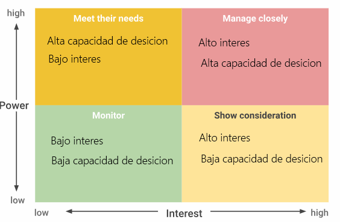

*Preguntas sugeridas para los interesados:*

    ¿Cuáles son tus prioridades/objetivos más importantes?

    ¿De qué manera esta iniciativa o este proyecto te respaldarán y respaldarán tus prioridades más importantes?

    ¿Qué función te gustaría desempeñar dentro de esta iniciativa o proyecto?

    He aquí cómo planeo mantener a la gente informada; ¿funciona esto para ti?

    ¿Qué puedo aclarar para ti?

    ¿Cuáles son tus expectativas? ¿Qué te gustaría que el proyecto logre?

    ¿Qué sería el éxito para ti?

    ¿A quién más me recomiendas contactar en relación con esta iniciativa?

    ¿Qué información o conocimientos tienes que para mí representarían un desafío encontrarlos?

    ¿Dónde me ves recibiendo apoyo para esta iniciativa? ¿Enfrentando resistencia?

    ¿Qué otros pensamientos o preguntas tienes?

#### Priorizar a los interesados y generar aceptación

*Completar un análisis de los interesados.*

Los interesados son una parte esencial de cualquier proyecto. La capacidad de un gerente de proyectos de equilibrar los
requisitos de los interesados, generar aceptación en ellos y comprender cuándo y cómo involucrarlos es clave para que el
proyecto sea exitoso.

Revisemos los pasos clave en el análisis de los interesados:

    Prepara una lista de todos los interesados en los que impacta el proyecto. Al hacer esta lista, pregúntate lo
    siguiente: ¿Quién está comprometido con el proyecto? ¿A quién afecta este proyecto? ¿Quién contribuye a
    este proyecto?

    Define el nivel de interés e influencia de cada interesado: con este paso, es más fácil determinar quiénes son los
    interesados clave. Cuanto mayor sea el nivel de interés e influencia, más importante será priorizar sus necesidades
    durante el proyecto.

    Evalúa la capacidad de los interesados de participar y encuentra formas de involucrarlos. Varios tipos de proyectos
    producirán varios tipos de interesados: algunos serán partes interesadas activas con más opiniones y puntos de contacto,
    y otros serán partes interesadas pasivas,quienes solo prefieren recibir actualizaciones de alto nivel y no estar invo-
    lucradas en el día a día. Dicho esto, el hecho de que un interesado no participe tan a menudo como otros no significa
    que no sea importante. Hay muchos factores que entrarán en juego al momento de determinar la capacidad de un interesado
    de participar en un proyecto, como la distancia física del proyecto y su carga de trabajo existente.

### Asignar las funciones y responsabilidades del equipo del proyecto

#### Elementos de un gráfico RACI

El análisis de los interesados nos muestra cómo trabajar mejor con las partes interesadas y cuándo comunicarse con las
diferentes personas involucradas en un proyecto.

Un gráfico RACI ayuda a definir funciones y responsabilidades de los individuos o equipos para garantizar que el trabajo
se haga de manera eficiente. Crea funciones claras y da una guía para cada miembro del equipo. Hay cuatro tipos de
participación incluida en un gráfico RACI. Estos son: responsable, encargado, consultado e informado.

“Responsable” se refiere a aquellos que trabajan para realizar la tarea.
“Encargado” se refiere a aquellos que se aseguran de que el trabajo se haga.
“Consultado” incluye a los que dan retroalimentación, como los expertos en la materia o tomadores de decisiones.
“informado”, que incluye a aquellos que solo necesitan conocer las decisiones finales o que una tarea está completa.

Aquí hay una imagen de cómo se desglosa en un gráfico.

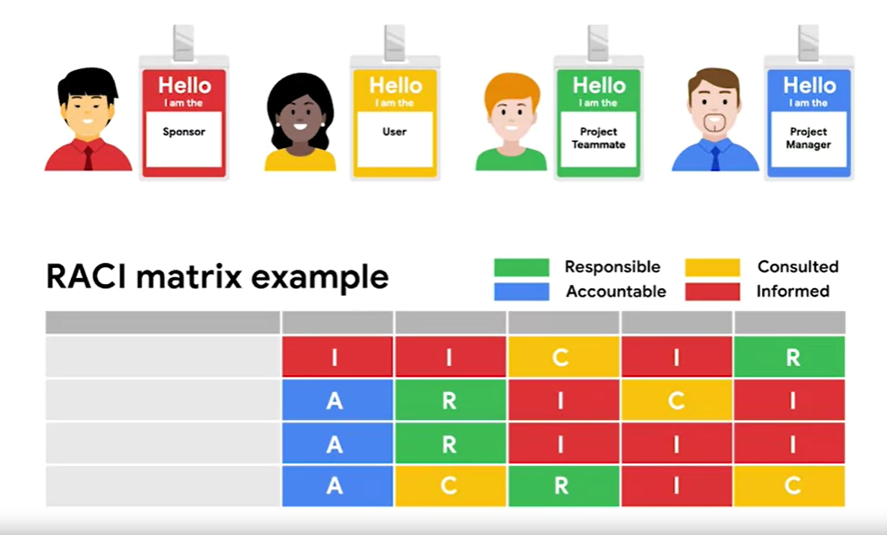

Al crear tu gráfico RACI, necesitas escribir cada tarea o entregable para el proyecto, y luego asignarle la función apropiada
a cada interesado. Para hacer esto:

primero piensa en quién está involucrado en el proyecto. Escribe las funciones o los nombres de las personas en una fila
en la parte superior del gráfico. Consejo profesional: usa funciones en lugar de nombres si hay personas que realizan más
de una función. anota las tareas o entregables en una columna a la izquierda. Intenta no ser demasiado específico.

El gráfico debe ser sencillo y fácil de leer. Después de eso, revisa cada tarea y entregable y pregunta:
¿Quién es responsable de hacer esto? ¿Quién es el encargado si esto no se hace? ¿Quién tendrá opiniones firmes que añadir,
y, por lo tanto, debe ser consultado sobre cómo se hace esto? Y ¿quién debe ser informado sobre el progreso o las decisiones
que se tomen sobre esto? Asigna las letras R, A, C e I basándote en las respuestas.

Por ejemplo, como el gerente de proyecto en Office Green del lanzamiento de un nuevo servicio, una de tus tareas es crear
diferentes puntos de precio para distintos paquetes y frecuencias de entrega. El jefe de Finanzas será el encargado porque
el proyecto debe mantenerse dentro del presupuesto y generar dinero, pero el analista financiero es el responsable, ya que
es la persona que trabaja para definir los precios óptimos. El director de Producto será consultado sobre el tema, pues
es quien supervisa las ofertas de productos. Y, finalmente, los miembros del equipo, como los del equipo de Ventas, deben
ser informados sobre el precio final.

Es posible que haya varias funciones que tengan las categorías “informado” y “consultado”. Una cosa que siempre será cons-
tante es que nunca habrá más de una persona designada como encargada. Esto evita confusiones, porque tener una sola persona
como encargada claramente define la propiedad. Sin embargo, la misma persona que es encargada también puede ser responsable.

Hay varios otros factores que pueden confundir las funciones. Por ejemplo, podría haber cargas de trabajo desproporcionadas,
lo que significa que hay gente que podría estar haciendo más trabajo o menos trabajo que otros. O podría haber una jerarquía
poco clara cuando las personas no saben a quién pedir ayuda si una tarea no se realiza, o cuando la propiedad de las decisiones
no está clara la gente no está segura de quién toma la decisión definitiva en un proyecto.

Otro problema podría ser el trabajo superpuesto. Esto ocurre cuando los equipos o individuos sienten que son responsables
por un mismo trabajo. Cuando esto sucede, las cosas pueden resultar muy confusas. Y lo mismo ocurre con la comunicación
excesiva.

Si bien la comunicación suele ser algo bueno, demasiada comunicación puede hacer que las cosas sean más complicadas. Puede
causar una sobrecarga de información y la gente no sabe dónde enfocar su atención, por lo que pueden perderse algo importante.

#### Creación de un gráfico RACI

Un gráfico RACI puede ser una forma muy efectiva de definir las funciones del proyecto, dar indicaciones a cada miembro
del equipo e interesados, y garantizar que el trabajo se realice de manera eficiente. Tener un gráfico RACI disponible
durante todo el proyecto es una ayuda visual muy útil.

*Elementos de un gráfico RACI:*

En un gráfico RACI, se crean funciones claras y se dan indicaciones a cada miembro del equipo e interesados. Durante tu
carrera, es posible que oigas que un gráfico RACI también se denomina matriz de asignación de responsabilidades (RAM),
diagrama RACI o matriz RACI. El objetivo final de esta tabla es aclarar la función de cada persona en el proyecto

    Primero, desglosemos cada una de las funciones que se pueden asignar a las personas:

    R: Responsable: quien hace el trabajo

    A: Encargado: quien se asegura de que el trabajo se haya realizado

    C: Consultado: quien brinda aportes o retroalimentación sobre el trabajo

    I: Informado: quien necesita conocer el resultado

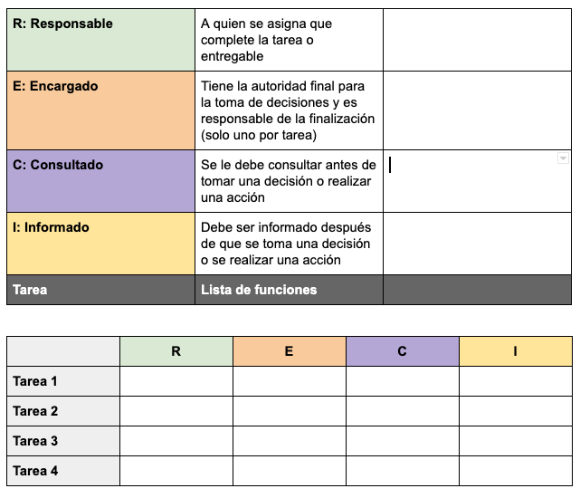

*Responsable:*

Las personas a las que se les asigna la función de “responsable” de una tarea son las que realmente están haciendo el
trabajo para completar la tarea. Para cada tarea, se necesita al menos una parte responsable. Es una práctica recomendada
intentar limitar el número de miembros del equipo a quienes se asigna la función de responsable de una tarea, pero en
algunos casos, es posible que haya más de uno.

Un par de preguntas que debes hacerte al determinar qué persona o personas deben ocupar la función de responsables de una
tarea determinada son:

    ¿En qué departamento recae el trabajo?

    ¿Quién realizará el trabajo?

Es útil evaluar a las personas del equipo para definir la función que mejor se ajusta a ellas. Recuerda que es posible
que debas enumerar funciones en lugar de nombres en caso de que algunas personas asuman más de una función.

*Encargado:*

La persona “encargada” es quien debe asegurarse de que la tarea se realice. Es importante tener un solo encargado para
cada tarea. Esto ayuda a aclarar la propiedad de la tarea. En última instancia, la persona encargada tiene la autoridad
para aprobar el entregable de la parte responsable.

Para definir a quién se debe designar como encargado, considera lo siguiente:

    ¿Quién delegará la tarea que se debe completar?

    ¿Quién revisará el trabajo para determinar si la tarea está completa?

Puede darse la situación de que la parte responsable también sea encargada, pero siempre que sea posible, conviene separar
estas funciones. Garantizar que la responsabilidad no sea compartida garantiza que no haya confusión sobre a quién pertenece
la propiedad.

*Consultado:*

Los miembros del equipo o los interesados que se colocan en la función de “consultados” tienen información útil para ayudar
a completar la tarea. No hay un número máximo o mínimo de personas a las que se les pueda asignar la función de “consulta-
dos”, pero es importante que haya un motivo para designar a cada persona como tal.

Estas son algunas maneras en que puedes identificar quién es apropiado para esta función:

    ¿A quién afectará la tarea?

    ¿Quién brindará aportes o retroalimentación para que la persona responsable ayude a completar el trabajo?

    ¿Quiénes son los expertos en la materia para la tarea?

Las personas consultadas estarán en comunicación frecuente y bidireccional con la parte responsable, por lo que es clave
asegurarse de que las personas adecuadas cumplan esta función, a fin de que la tarea se realice de manera eficiente y
correcta.

*Informado:*

Las personas que se identifican como las que necesitan ser “informadas” tienen que conocer las decisiones finales que se
tomaron y cuando se completa una tarea. Es común tener muchas personas en esta categoría y que algunos miembros del equipo
estén informados sobre la mayoría de las tareas. A los miembros del equipo o a los interesados no se les pedirá retroali-
mentación, por lo que es clave asegurarse de que las personas que están en este grupo solo requieran actualizaciones sobre
el estado y no necesitan brindar retroalimentación para complementar el esfuerzo.

Las preguntas clave que debe hacerse para asegurarse de que ha elegido a las personas apropiadas para esta función son las
siguientes:

    ¿A quién le importa que finalice esta tarea?

    ¿Quién se verá afectado por el resultado?

#### Sacar el máximo provecho de un gráfico RACI

*Definición y estructura:*

Determinar quién es Responsable, encArgado, Consultado e Informado en los proyectos te permite mantener el control de las
funciones de los interesados en el proyecto.

*Equilibrio de la carga de trabajo:*

¿Hay demasiadas tareas asignadas a un solo interesado? Cuando completas el gráfico, es una buena idea volver y contar el
número de R asignadas a cada interesado. Esto puede ayudarte a identificar la posible sobrecarga de trabajo de un miembro
del equipo.

El uso de un gráfico RACI para definir la responsabilidad de las tareas puede ayudar a mitigar los puntos únicos de falla
(conocidos como creación de silos, donde el conocimiento y la responsabilidad de una tarea recae en una sola persona) y
permitirte, como gerente de proyectos, delegar tareas y evitar el agotamiento. Mantener el equilibrio de la carga de trabajo
es una parte crítica de la gestión de proyectos. Es fácil caer en el patrón de confiar en los que producen los mejores
resultados para lograr que el proyecto avance. Sin embargo, esto no siempre es saludable para el proyecto o el equipo. Si
descubres que no cuentas con las personas adecuadas para asignarles responsabilidades, da un paso atrás y evalúa al equipo.

### Cómo trabajar eficazmente con los interesados

#### Por qué fracasan los proyectos: Pasos en falso en la iniciación

*Expectativas poco claras.*

    Es posible que recuerdes las preguntas que debes responder en la fase de iniciación del proyecto, que incluyen:

    ¿Cuál es el objetivo final?

    ¿Cuáles son los entregables y el cronograma esperados?

    ¿Cuál es el presupuesto?

    ¿Quiénes son los interesados?

No tomarse el tiempo al comienzo de un proyecto para hacer estas preguntas esenciales, documentar decisiones y comprender
el verdaero alcance del proyecto puede llevar al fracaso. Después de todo, sin indicaciones, nunca puedes llegar a tu
destino.

*Expectativas poco realistas.*

A todos nos gusta impresionar a nuestros gerentes, pero a veces, sin querer, aceptamos expectativas poco realistas y pre-
paramos nuestros proyectos para el fracaso desde el principio.

Por ejemplo, si se espera que un proyecto tome dos semanas debido al nivel de detalle y esfuerzo requerido pero intentamos
completarlo en una semana, no tendremos los recursos disponibles para cumplir con el cronograma consolidado. Esto proba-
blemente generará problemas de calidad.

Es importante comprender los requisitos de un proyecto antes de estar de acuerdo con los plazos. Como mejor práctica, no
te comprometas con plazos al iniciar el proyecto para evitar establecer expectativas poco realistas. Tendrás más informa-
ción y podrás gestionar mejor las expectativas en la fase de planificación.

*Falta de recursos.*

Los recursos incluyen a los miembros del equipo, el presupuesto y los materiales. Desafortunadamente, sin una planificación
adecuada, los recursos pueden sobrecargarse o agotarse rápidamente. A veces, los gerentes de proyectos no tienen en cuenta
el hecho de que los miembros del equipo están haciendo malabares con múltiples tareas, y es posible que no puedan dedicar
el tiempo necesario a completar todas las tareas asignadas correctamente y a tiempo. O bien, los gerentes de proyectos
podrían no darse cuenta de que se requiere un conjunto de habilidades específicas para completar ciertas tareas. Asegurarse
de que los miembros correctos del equipo estén disponibles en el momento adecuado es crucial.

Otro error común es hacer cálculos erróneos de los gastos del proyecto. Por ejemplo, imagina que cuentas con un presupuesto
de USD 10.000 para el proyecto. Si en el proyecto se requieren USD 10.000 para materiales y también es necesario enviar e
instalar esos materiales, entonces no tendrás suficiente dinero para completar el proyecto. Aclara los recursos que necesites
y confirma su disponibilidad con los líderes por adelantado para evitar retrasos o problemas en futuras etapas del proyecto.

*Corrupción del alcance (síndrome del lavadero).*

El alcance brinda un marco general de lo que está y no está incluido en el trabajo y los entregables del proyecto. Definir
el alcance en la fase de iniciación ayuda a identificar los recursos necesarios, el costo asociado con esos recursos y el
cronograma requerido para completar el trabajo. A veces, los proyectos fallan porque el alcance del proyecto aumenta y no
se capturan los impactos en el alcance.

Por ejemplo, imagina que recibes un proyecto que originalmente incluye tres entregables. Durante el transcurso del proyec-
to, un interesado solicita que se incluyan dos entregables adicionales, pero no se realizan cambios en el cronograma, el
presupuesto o los miembros del equipo para reflejar el impacto de este mayor número de entregables. Como gerente del pro-
yecto, cuando los entregables cambian, debes asegurarte de capturar el impacto potencial de esos cambios en el cronograma,
el presupuesto y la calidad. Por eso es tan importante asegurarse de que todo esté documentado en la fase de iniciación.
Cuenta con un plan sobre cómo manejar la corrupción del alcance, en caso de que ocurra, y aclara quién tiene la autoridad
para aprobar los cambios en el alcance.

## Recursos y herramientas

### Comprender las necesidades de recursos del proyecto

#### Recursos esenciales del proyecto

Los recursos, Como gerente de proyectos, comprender tus necesidades de recursos es crucial para alcanzar tus objetivos.
Por eso, durante la fase de iniciación, es importante que te preguntes qué nos falta adquirir para completar nuestro
proyecto.

Los recursos de un proyecto suelen incluir el presupuesto, las personas y los materiales. A medida que se establezcan los
objetivos y el alcance del proyecto, se delinearan los diferentes recursos Necesarios para alcanzar esos objetivos.

Es importante saber qué recursos necesitarás antes de que el proyecto se ponga en marcha. Esto hace que para todos los
miembros de tu equipo sea fácil hacer sus tareas, y ese es tu trabajo como gerente de proyectos. No harás el trabajo
directamente, pero apoyarás a las personas que lo hagan.

Averiguar los recursos con antelación también ayuda a evitar la falta accidental de personal en el proyecto, lo que puede
ralentizar seriamente el progreso del equipo y afectar la línea de tiempo general. Y lo que es peor, si no tienes cuidado
con la planificación de los recursos, podrías acabar subestimando el presupuesto. Es decir, es posible que no tengas
suficiente dinero para comprar los materiales necesarios, contratar a los proveedores o apoyar las solicitudes de horas
extras.

Planificar los recursos con antelación es una excelente manera de preparar a tu equipo para el éxito. Porque cuando tus
compañeros de equipo tienen lo que necesitan para hacer su trabajo a tiempo y dentro del presupuesto, están mejor preparados
para cumplir con los objetivos del proyecto.

Algunos de los recursos con los que suelen trabajar los gerentes de proyectos:

En primer lugar, hablemos de los presupuestos. Un presupuesto es un cálculo aproximado de la cantidad de dinero que costará
completar un proyecto. Casi todos los proyectos tienen presupuestos porque necesitan financiación para los gastos, como
la compra del software o de los materiales adecuados, la contratación de proveedores para completar los trabajos o la
realización de tareas de marketing una vez que el proyecto esté terminado. Durante la fase de iniciación, se habla con los
interesados y las personas que trabajan en el proyecto a fin de averiguar cuáles son las tareas necesarias para llevarlo a
cabo. En esta fase, puedes hacer preguntas que te ayuden a descubrir los costos ocultos. Por ejemplo,

    ¿hay algún impuesto sobre los productos que debas tener en cuenta?
    ¿Qué sucede con las tarifas adicionales?

Toda esta información te ayudará a elaborar un presupuesto, el cual podrás utilizar para obtener y comparar las propuestas
de los proveedores. Calcula los próximos costos y haz un seguimiento de todo el dinero que entra y sale de tu proyecto.

A menudo debes incluir el presupuesto y el estatuto del proyecto, que los interesados revisarán para su aprobación.

Cuando hablamos de los recursos, también nos referimos al equipo de personas que ayudan a ejecutar las tareas de un pro-
yecto. Por ejemplo, tú, como gerente de proyectos, eres un recurso. También lo es el director de marketing, que podría
crear anuncios para este nuevo producto.

Otros recursos pueden ser personas ajenas a tu empresa que tienen habilidades únicas y pueden realizar determinadas tareas
que las personas de tu organización no pueden hacer personalmente.

Luego están los materiales. Se trata de los elementos necesarios para llevar a cabo el proyecto. Por ejemplo, los materiales
de un proyecto podrían incluir la madera necesaria para completar un proyecto de construcción.

Los recursos de un proyecto incluyen el presupuesto, las personas y los materiales.

*¿Cómo se organizan estos recursos?* Las herramientas sirven de ayuda para facilitar a un gerente de proyectos o a un equipo
la gestión de los recursos y la organización del trabajo. Ayudan a realizar actividades, como el seguimiento de tareas, la
gestión de presupuestos y la colaboración con los compañeros de equipo.

Existen todo tipo de herramientas, incluidas las de productividad, como Google Docs, y las de software de gestión del trabajo,
como Asana.

Las herramientas son esenciales para el seguimiento del progreso, por lo que conviene tenerlas presentes en todas las fases
del proyecto.

#### Gestión de los recursos para realizar el trabajo

Los recursos del proyecto son aquello de lo que se depende para completar un proyecto, incluido el presupuesto, los mate-
riales y las personas. Aunque cada recurso es una entidad independiente, todos dependen unos de otros: tu equipo no puede
hacer el trabajo sin materiales, y tú no puedes comprar materiales sin un presupuesto. En esta lectura, analizaremos algunos
recursos clave del proyecto y consejos para gestionarlos.

*Presupuesto:*

Los aspectos comunes del presupuesto de tu proyecto incluirán:

    Equipo: el costo de las personas que realizan el trabajo

    Servicios: cualquier proveedor externo que ayude en el proyecto

    Materiales: cualquier artículo tangible adquirido para completar el proyecto

A lo largo de tu carrera de gestión de proyectos, te encontrarás con diversos tipos de proyectos con una amplia gama de
presupuestos. Algunos presupuestos no tendrán margen de error, mientras que otros pueden ser más flexibles. Independiente-
mente de esta variabilidad,

los problemas presupuestarios surgirán inevitablemente, por lo que es importante asegurarse de que el presupuesto esté
alineado con el alcance del proyecto y con las solicitudes de los interesados.

*Personas:*

Las personas son un recurso fundamental para tu proyecto; ¡no puedes completar tu proyecto por tu cuenta! Tendrás que
contar con un sólido equipo de personas con diversas habilidades y especialidades para realizar el trabajo. Como gerente
de proyectos, asegúrate de contar con el compromiso y la aceptación de la cantidad de horas que tus recursos necesitarán
para completar sus tareas. Además, descubrirás que los mejores socios de un proyecto son las personas que están alineadas
con los objetivos del proyecto o que están más interesadas en el trabajo que este conlleva.

*Materiales:*

Los materiales pueden ser diferentes en cada proyecto. Por ejemplo, si estás trabajando en un proyecto de TI, los mate-
riales pueden incluir discos duros y ordenadores para realizar los trabajos de codificación. También puede haber materia-
les intangibles. Por ejemplo, en el mismo proyecto de TI, el almacenamiento en línea, los programas de software o la capa-
citación de los empleados también pueden considerarse materiales. Es importante tener en cuenta todos y cada uno de los
materiales potenciales para ejecutar un proyecto de manera exitosa con el personal adecuado y acorde al presupuesto.

### Desarrollo de la documentación para el inicio del proyecto

#### El valor de la documentación del proyecto

#### Propuestas y estatutos de proyectos 101

#### Estatutos del proyecto: Elementos y formatos

#### Elaboración de un estatuto para el proyecto

### Evaluación de las herramientas para satisfacer las necesidades del proyecto

### Repaso del curso: Iniciación del proyecto: Cómo iniciar un proyecto exitoso
