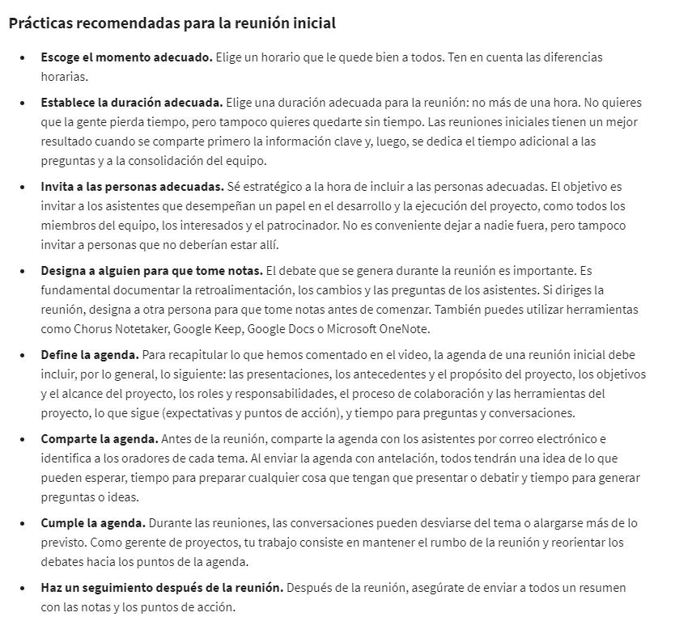
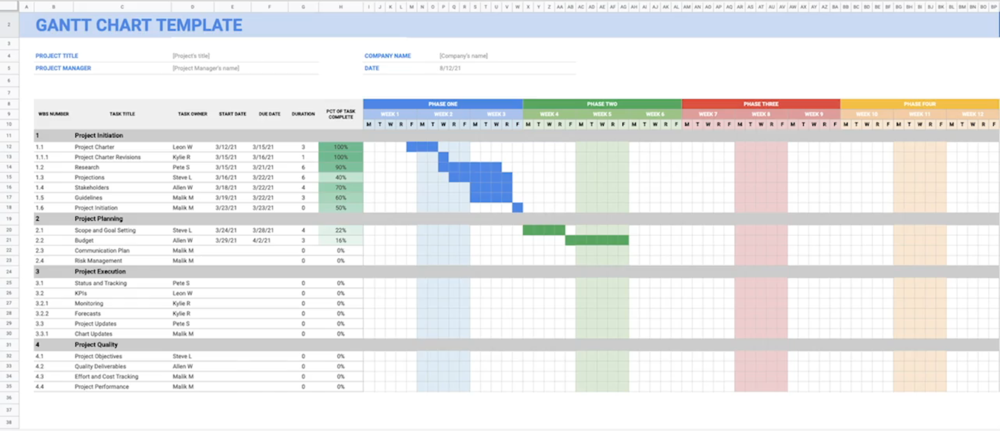
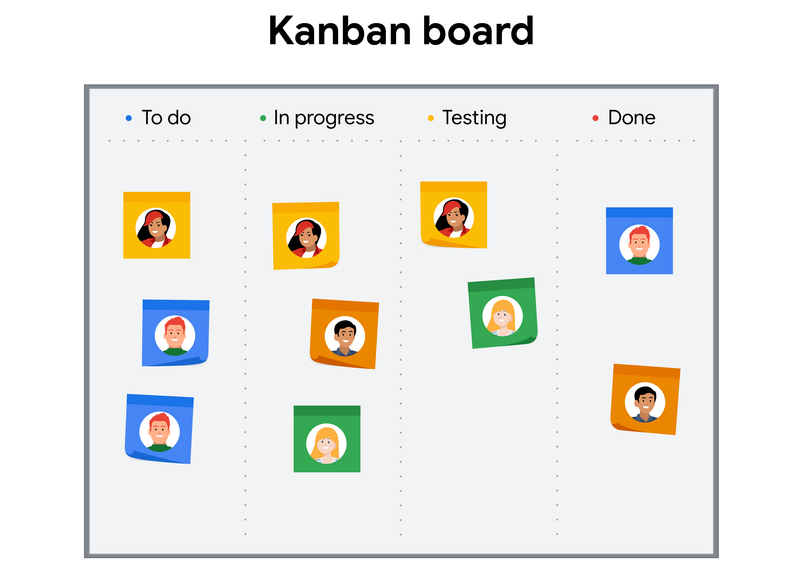
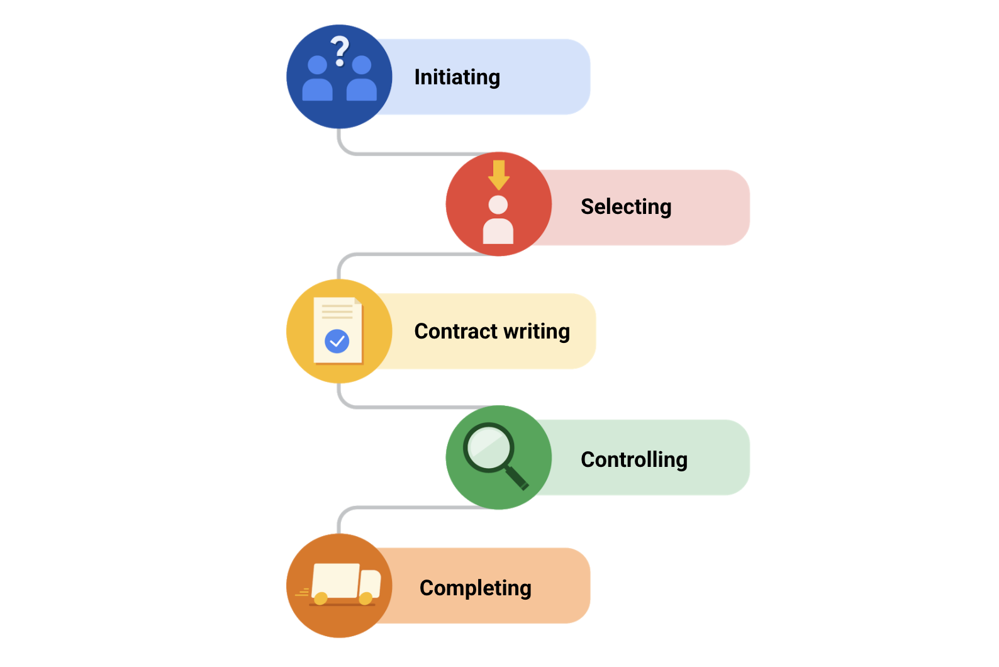
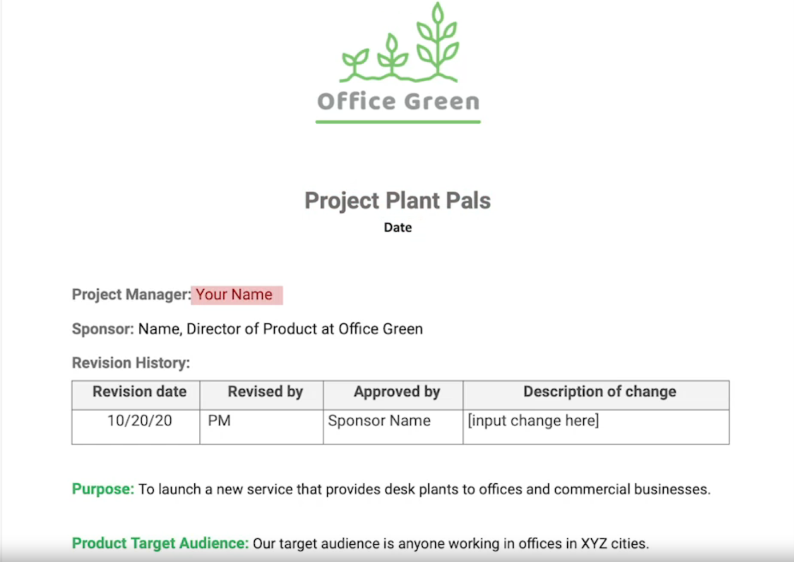
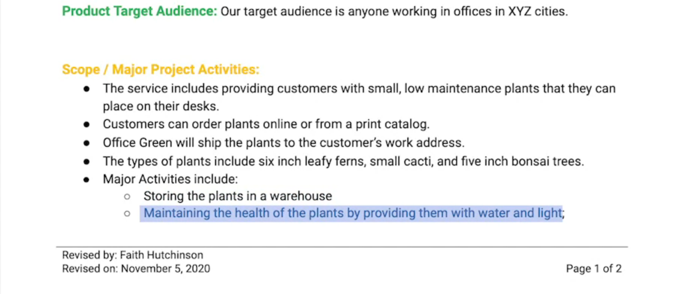
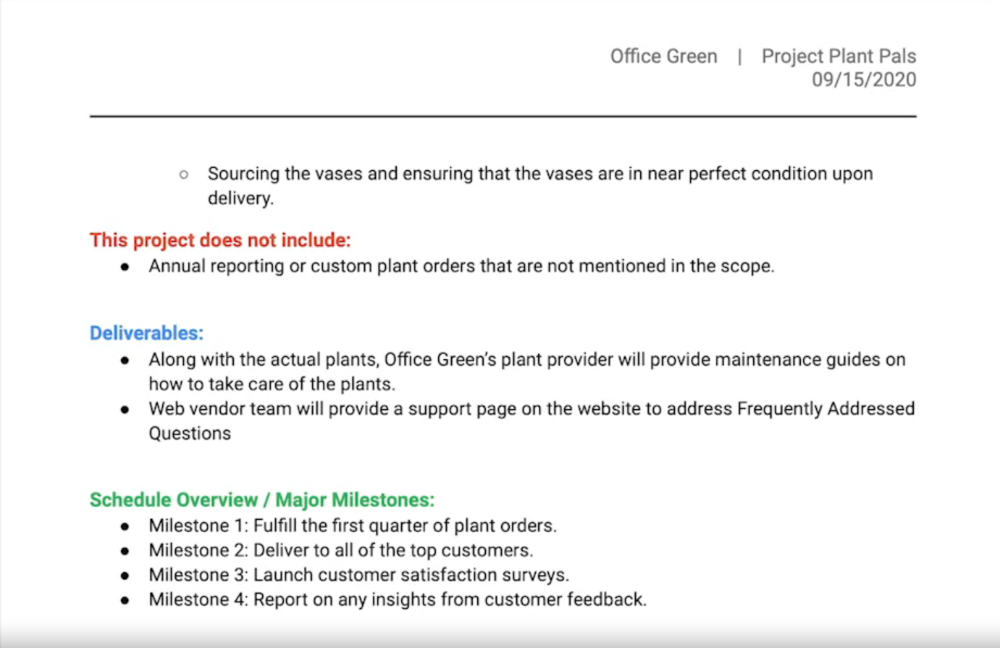
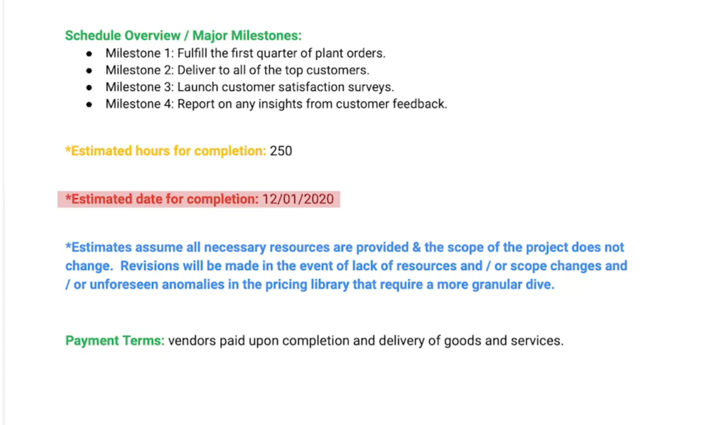

# Planificación del proyecto: reunir todos los elementos

## Inicio de la fase de planeacion

### Componentes de la fase de planificacion

#### Los beneficios de la planificación de proyectos

la fase de iniciación. Durante la fase de iniciación, el gerente de proyectos reúne toda la información preliminar necesaria
para obtener la aprobación de los interesados y planificar el proyecto. Algunas cosas clave deben ocurrir durante esta etapa.

Primero, se designa al gerente de proyectos Luego, deben aprobarse los objetivos del proyecto, así como el alcance del proyecto
y sus entregables. Varias personas se deberán asignar al proyecto, y tendrás una buena idea de sus roles y responsabilidades.

También necesitarás que los interesados aprueben el estatuto del proyecto. Si se cumplen todos estos criterios, significa que
estás listo para comenzar a planificar.

La planificación es importante para todos los proyectos. Mientras planificas el proyecto, los miembros del equipo definen
los procesos y flujos de trabajo necesarios para cumplir con los objetivos, y pensarán ideas sobre cómo hacer que el proyecto
sea un éxito.

Al planificar, puedes aprovechar tu experiencia en proyectos anteriores y pensar en nuevas formas de obtener resultados. Cada
proyecto es diferente, así que enfoques nuevos y diferentes pueden ser justo lo que necesitas. La planificación tiene muchos
beneficios.

Como hemos comentado, planificar te ayuda a mapear el proyecto completo. ayuda a entender el trabajo necesario para lograr
los objetivos. La planificación también ayuda a coordinar los esfuerzos y cronogramas con otros equipos, contratistas y
proveedores.

Otro gran beneficio de la planificación es que te da tiempo para identificar y prepararte para los riesgos que puedan afectar
el proyecto. Estos pueden incluir cosas como un retraso en el cronograma, la salida de un miembro importante del equipo o
un cambio en la dirección del proyecto determinado por uno de los interesados. La planificación también te da la oportunidad
de pensar en formas de mitigar o abordar esos riesgos.

También hay beneficios menos obvios. Por ejemplo, la fase de planificación puede ser útil para obtener la “aceptación” de
los miembros clave del equipo. Conseguir la aceptación significa que se ha obtenido apoyo para los planes. La planificación
también demuestra a las partes interesadas que al equipo le interesa empezar el proyecto con un plan detallado.

Uno de los beneficios más significativos de la planificación es el trabajo en equipo, lo que te ayudará a impulsar el
proyecto hasta cruzar la línea de meta. Al trabajar juntos en la fase de planificación, los individuos asignados al proyecto
pueden convertirse en un equipo sólido una vez que termina la planificación y el trabajo está a punto de empezar.

Planificar juntos crea un entendimiento compartido entre todas las partes involucradas en el proyecto.

En resumen, la planificación tiene muchos beneficios, desde ayudar al equipo a comprender el trabajo necesario para alcanzar
sus objetivos, hasta brindar planes de proyecto a los interesados.

#### Lanzamiento de la fase de planificación

La fase de planificación puede variar de un proyecto a otro, pero generalmente se trabaja en tres cosas importantes durante
esta fase:

    el cronograma
    el presupuesto
    el plan de gestión de riesgos.

*el cronograma*. El cronograma es básicamente una línea de tiempo del proyecto. Incluye la fecha de inicio, la fecha de
finalización y las fechas de las cosas que ocurrirán en el medio. Se utilizan técnicas de estimación del tiempo para deter-
minar estas fechas.

*el presupuesto.* El presupuesto tendrá en cuenta el costo total para completar el proyecto. El costo total se debe desglosar
para determinar cuánto hay que gastar en los distintos elementos del proyecto.

*La gestión de riesgos*, que significa buscar posibles problemas y planificar con antelación para mitigar estos riesgos.
el riesgo es inevitable en todo proyecto. Lo que no es inevitable es cómo afecta el riesgo a tu proyecto.

Una buena planificación del proyecto significa buscar los lugares en los que pueden ocurrir problemas. ¿Dónde podría re-
trasarse el cronograma? ¿Dónde podría el presupuesto superar tus estimaciones? Trabajarás con el equipo para considerar
las respuestas a estas preguntas y preparar un plan de gestión de riesgos basado en lo que descubras.

Para recapitular, en la fase de planificación crearás el cronograma, establecerás el presupuesto y prepararás el plan de
gestión de riesgos, pero primero debes conseguir el apoyo de todo el equipo.

#### Facilitar una reunión inicial del proyecto

una vez que en el modo de planificación. Es importante programar una reunión que sirva como un comienzo formal a la plani-
ficación del proyecto.

La reunión inicial de un proyecto es la primera reunión en la que el equipo de un proyecto se une para poner a todos de
acuerdo en una visión compartida, obtener un entendimiento compartido de los objetivos y el alcance del proyecto, y entender
los roles de cada persona dentro del equipo.

¿quiénes participan en la reunión inicial? Los miembros del equipo identificados en un gráfico RACI, creado durante
la fase de iniciación. un gráfico RACI ayuda a definir roles y responsabilidades para individuos o equipos para garantizar
que se trabaje de manera eficiente. Durante la reunión inicial, los miembros del equipo aprenderán más sobre cómo contri-
buirán al proyecto y obtendrán una comprensión más profunda de cómo el equipo trabajará en conjunto para alcanzar los
objetivos.

También se incluyen a los interesados y al patrocinador a la reunión, para que tengan la oportunidad de entender el plan
de alto nivel del proyecto, puedan compartir su perspectiva, y para asegurarte de que todos están de acuerdo.

Las reuniones pueden llevar mucho tiempo, y definitivamente hay situaciones en las que un correo o un chat rápido con al-
guien del equipo bastará. Pero cuando estás iniciando un proyecto, especialmente proyectos más grandes con varias personas,
es importante reunirse para establecer una visión compartida, ponerse de acuerdo sobre el alcance y generar buenas intera-
cciones en el equipo.

También es una oportunidad para que tu equipo haga preguntas y brinde ideas, y es un muy buen momento para que establezcas
las expectativas con el equipo sobre cómo cada persona contribuirá de forma individual al proyecto.

Cómo planificar y realizar una reunión inicial. Hay muchas plantillas para agendas de reuniones iniciales en línea, y la
mayoría sigue una estructura similar y dura alrededor de una hora. es de tener en cuenta que esto es solo una sugerencia,
y no debes dudar en programar todo el tiempo que sea necesario para cada elemento de la agenda en función de las necesida-
des del proyecto y el equipo.

La mayoría de las reuniones comienzan con presentaciones. Puedes asignar alrededor de 10 minutos para que cada miembro del
grupo se presente y diga sus funciones, y, si el tiempo lo permite, compartan algo divertido para generar buenas interac-
ciones.

A continuación, unos cinco minutos para dar una descripción general de los antecedentes del proyecto. Esto cubre detalles
como cómo surgió y por qué es importante el proyecto. También usarás este tiempo para dar una visión compartida.

dedica unos cinco minutos a compartir los objetivos y el alcance, que se refiere a los límites en torno a un proyecto. Eso
incluye dejar claro qué trabajo se considera que está dentro del alcance y qué trabajo se considera fuera del alcance. Este
también es un buen momento para compartir la fecha de lanzamiento prevista y resaltar los hitos importantes que el equipo
debe tener en cuenta.

Una vez que hayas cubierto los objetivos y el alcance, es hora de hablar de los roles de cada uno. Es una buena idea dedicar
unos cinco minutos a asegurar que todos tienen claro de qué trabajo serán responsables durante todo el proyecto.

Luego, es el momento de abordar la colaboración, que es la forma en que cooperarán en el proyecto. Este es un buen momento
para repasar las herramientas que servirán como fuente común de información para el equipo, como un plan de proyecto creado
en una hoja de cálculo o una herramienta de gestión del trabajo, como Asana. También es un buen momento para determinar
cómo se comunicará entre sí el equipo y con que frecuencia, por ejemplo, con actualizaciones diarias por correo electrónico,
en una sala de chat y en reuniones semanales de actualización. Deberías dedicar unos 10 minutos a este tema.

dedicar unos 10 minutos a establecer las expectativas sobre lo que se avecina. También utilizarás este tiempo para aclararle
a cada uno qué acciones tomarán a continuación.

Por último, es muy importante dedicar unos 15 minutos para las preguntas del grupo. Esta es la oportunidad del equipo para
despejar las dudas sobre cualquiera de los temas que has tratado hasta ahora. También es tu oportunidad de escuchar al
equipo y asegurarte de que el proyecto se beneficie de una diversidad de opiniones, experiencias e ideas.

Por ejemplo, además de responder preguntas en voz alta en la reunión, puedo invitar al equipo a que aporten preguntas
o retroalimentación en un documento compartido. Esta práctica puede ayudar a crear un espacio para colaborar. También es
posble consultar a los compañeros de equipo acerca de su confianza sobre los temas hablados ese día. cuál es su nivel de
confianza en una escala de uno a cinco: uno es “No tengo nada de confianza”, y cinco es “Estoy extremadamente confiado”. Si
no tienen confianza, Les pregunto qué puedo hacer para ayudar a cambiar eso. Esta práctica puede dar al equipo un sentido
de respaldo más sólido, porque se está disponible para ayudarlos a superar los obstáculos.

Si pruebas esta práctica en las reuniones, asegúrate de cumplir los acuerdos la reputación como gerente de proyectos de
cumplir los objetivos y eliminar obstáculos es fundamental para establecer y mantener las relaciones.

Una vezfinalizada la agenda de la reunión, documenta esta información en una plantilla para agendas, y envíala
a los asistentes uno o dos días antes de la reunión. Como gerente de proyectos, liderarás la mayor parte de esta reunión,
y, cuando hablas, es difícil tomar notas y exponer al mismo tiempo. Por lo tanto, al comienzo de la reunión, pide a un
compañero de equipo que tome notas sobre los puntos clave que explicaste durante toda la sesión y que registre los elemen-
tos de acción de sus compañeros. En algunos casos, puede ser beneficioso grabar la reunión para que puedan verla más tarde,
especialmente si tienes un equipo grande o desperdigado. Tan solo asegúrate de obtener de antemano el permiso de los asis-
tentes para grabarlos.

Después de la reunión, enviar un correo electrónico de seguimiento al grupo, con un resumen de los puntos clave y resulta-
dos de la reunión, así como los elementos de acción de los asistentes. En el correo electrónico de seguimiento, invitar
también a los asistentes a que te consulten si tienen alguna pregunta adicional.

#### Consejos para dirigir una reunión inicial exitosa

](image-8.png)

### Definir tareas e hitos

#### Comprender las tareas y los hitos

el gerente de proyectos es responsable de asignar el trabajo al equipo y de realizar un seguimiento del progreso del pro-
yecto. Al hablar de la asignación del trabajo, algunos términos clave, como hitos del proyecto y tareas del proyecto.

Un hito del proyecto es un punto importante dentro del cronograma que indica el progreso y significa la finalización de
un entregable o una fase del proyecto. Estos son puntos de control importantes en el proyecto, y hacer un seguimiento de
ellos ayuda a garantizar que se cumplan los objetivos a tiempo.

Por ejemplo, un hito puede ser completar el primer borrador de un informe, y el objetivo en última instancia puede ser
publicar el informe. Otro ejemplo de hito es recibir la aprobación del cliente con respecto a un entregable importante.

cómo los hitos difieren de las tareas del proyecto. Una tarea del proyecto es una actividad que debe realizarse dentro de
un plazo determinado. El trabajo de un proyecto se desglosa en muchas tareas diferentes. Para alcanzar un hito, el equipo
debe completar varias tareas.

Por ejemplo, si un hito es preparar el primer borrador de un informe, las tareas necesarias para llegar a ese hito pueden
ser contratar a un redactor, llevar a cabo investigaciones y redactar las secciones del informe.

Imaginemos los hitos y las tareas en el contexto del proyecto Plant Pals de Office Green. Uno de los entregables del proyecto
es lanzar el sitio web del nuevo servicio, donde los clientes podrán realizar pedidos y obtener atención al cliente. Algunos
de los hitos previos serán obtener la aprobación del diseño del sitio web e implementar la retroalimentación de los usuarios.
Para lograr esos hitos, tu equipo debe completar múltiples tareas del proyecto. Por ejemplo, para alcanzar el hito del diseño,
el diseñador del sitio web deberá crear prototipos iniciales del diseño propuesto. Tendrás que revisar esos prototipos, y
el diseñador tendrá que implementar tu retroalimentación. Cada uno de estos elementos es una tarea del proyecto, y no puedes
alcanzar los hitos sin completarlos.

Los hitos son puntos importantes dentro del cronograma del proyecto, y las tareas son actividades que se deben realizar en
un período determinado para ayudar a alcanzar esos hitos. Los hitos y las tareas del proyecto están interconectadas. Las
tareas conducen a los hitos, que son cruciales para el seguimiento del proyecto.

#### La importancia de establecer hitos

un hito es un punto importante dentro del cronograma del proyecto que destaca el progreso y suele marcar la finalización
de un entregable o una fase del proyecto.

ahora por qué establecer hitos dentro del proyecto es tan importante? Si bien puede parecer tentador hacer una lista rápida
de tareas y continuar con el proyecto, es muy importante que te tomes el tiempo y el esfuerzo para desglosar el proyecto
parte por parte.

Primero, establecer hitos te da una clara comprensión de la cantidad de trabajo que requerirá el proyecto. El acto de
establecer hitos te obliga a desglosar el proyecto en fragmentos más manejables. Cuanto más avances, mejor podrás ver
cuánto más trabajo necesitarás para alcanzar los objetivos.

A primera vista, podría parece fácil lanzar un nuevo sitio web, pero podría darte más trabajo de lo que piensas. Si desglosas
ese entregable en hitos y esos hitos en tareas, tendrás una mejor compresión de la verdadera cantidad de trabajo que hay
que hacer. Esto te ayudará a gestionar mejor la carga de trabajo.

Otra razón por la que los hitos son fantásticos es que te ayudan a mantener el proyecto encaminado. Cuando estableces un
hito, asignas plazos claros para cuando es necesario completar ciertos entregables del proyecto. Luego, a medida que trabajas
en la fase de ejecución, puedes repasar estos plazos para asegurarte de que el proyecto esté progresando al ritmo correcto.

Una tercera razón por la que deberías establecer hitos es que te ayudan a descubrir áreas en las que es necesario ajustar
el alcance, los plazos o los recursos para cumplir tus objetivos. Por ejemplo, si te das cuenta de que alcanzar un hito
requerirá más tareas de lo que habías anticipado, puedes pedirle a un interesado permiso para reducir el alcance del proyecto
y disminuir el número de tareas.

Por último, hay una razón más por la cual los hitos son muy importantes. Alcanzar hitos puede motivar mucho a tu equipo e
ilustrar el progreso real para los interesados. Con proyectos grandes que continúan durante meses, deberías conservar la
motivación del equipo. Un hito significa la finalización de una parte importante del trabajo y ofrece un momento de cele-
bración para el equipo, incluso si hay más trabajo por delante.

Los hitos también sirven como un excelente punto de revisión para resaltar el progreso para los interesados. Les da la
oportunidad de ver el trabajo que se ha completado hasta ahora y les permite ver que todo va por buen camino y que está
a la altura de sus estándares. También es importante recordar que los hitos deben completarse a tiempo y en orden secuencial
porque, por lo general, llegar al hito siguiente depende de completar un hito anterior.

Piensa en esto tomando como referencia el proyecto Plant Pals de Office Green. Como vimos anteriormente, para lanzar un
sitio web para un nuevo servicio de plantas, hay algunos hitos que debes alcanzar, como obtener la aprobación del diseño
del sitio web, completar el desarrollo del sitio web e implementar la retroalimentación de los usuarios. Los hitos deben
suceder en este orden. Este es el por qué. El desarrollador web no puede crear el sitio web si los interesados no han
aprobado el diseño, y no puedes implementar la retroalimentación de las pruebas de usuario si no hay sitio web para probar.

Es importante alcanzar hitos en orden secuencial, pero es igual de importante que los completes a tiempo. Si el equipo no
logra finalizar a tiempo un entregable vinculado a un hito específico, podría retrasar el cronograma del proyecto, es decir,
es posible que el equipo deba trabajar horas extras o sumar recursos para ponerse al día.

Por ejemplo, si necesitas obtener la aprobación de los interesados para el diseño del sitio web para el viernes, pero el
diseñador aún no ha completado el diseño, es posible que tengas que esperar hasta después del fin de semana para obtener
la aprobación de los interesados. Esto retrasará el inicio de la fase de desarrollo, y el equipo tendrá menos tiempo para
crear el sitio web. Peor aún, esta demora podría afectar el presupuesto del proyecto si completar este entregable está
vinculado directamente a un pago del cliente. Si no cumples con el plazo, probablemente retrasarás la recepción de ese
pago. Incluso, puedes correr el riesgo de no recibir el pago. Aunque los plazos a veces son flexibles, es importante tener
muy en cuenta los hitos en los que el plazo no es negociable.

#### Cómo establecer hitos

los hitos extremadamente importantes. Ayudan a dar una imagen clara de la cantidad de trabajo necesario. Ayudan a que el
proyecto se mantenga encaminado, descubren áreas en las que necesitas recursos adicionales, motivan a tus compañeros de
equipo y muestran el progreso a los interesados.

*Como identificar los hitos dentro de tu proyecto y cómo establecer plazos para ellos?*

El primer paso para establecer un hito es evaluar el proyecto en su conjunto. Es útil consultar el estatuto del proyecto
para recordar el objetivo.

Primero, haz una lista de qué debe hacer tu equipo para lograr ese objetivo. Los elementos principales para el progreso
son los hitos. Estos son los puntos clave en el cronograma del proyecto que significan la finalización de un entregable o
una fase del proyecto.

Los elementos más pequeños, cualquier cosa que un interesado no necesite revisar, por ejemplo, son tareas. Las planificarás
una vez que las hayas separado de los hitos.

Así que volvamos al ejemplo de Office Green. Uno de los entregables del proyecto es un nuevo sitio web. Y, como determinamos
anteriormente, algunos hitos de la situación del sitio web de Office Green incluyen obtener la aprobación para el diseño del
sitio web, completar el desarrollo del sitio web e implementar la retroalimentación de los usuarios. Hacer prototipos del
diseño inicial o crear una página de destino son cosas más pequeñas en tu lista, entonces, se marcan como tareas.

Es de tener en cuenta que algunos proyectos pueden contar con muchos hitos, mientras que otros podrían tener solo dos o
tres. No hay un número correcto de hitos para establecer, la cantidad variará de un proyecto a otro.

Una vez que hayas determinado los hitos, el siguiente paso es asignar un plazo para cada uno. Completar cada uno de los
hitos depende de la finalización de varias tareas del proyecto. Así que, para asegurarte de dar a tu equipo tiempo suficiente
para cada una de esas tareas, deberás espaciar los hitos en consecuencia. Para un proyecto grande, de varios meses, como
el proyecto Plant Pals, no deberías tratar de alcanzar varios hitos en el lapso de una semana. Hacer prototipos del sitio
web y recopilar datos de las pruebas de usuario son tareas que llevan tiempo.

Espaciar los hitos para darle tiempo al equipo para completar su trabajo. Para tener una buena idea de cómo hacer esto, puedes
conectarte con tus compañeros de equipo para analizar las tareas requeridas para alcanzar cada hito y obtener sus estimaciones
de cuánto tiempo llevarán estas tareas. Con esas estimaciones en mente, puedes tomar una decisión informada sobre plazos
razonables para cada hito.

Cuando estableces plazos para los hitos, también debes considerar las necesidades de los interesados. Pregúntate cuándo
esperarán ver un entregable del proyecto en particular, y considera la respuesta al elegir un plazo. Los interesados que-
rrán ver indicaciones periódicas de que el equipo está progresando, y los hitos son una buena forma de mostrar ese progreso.

Para recapitular, estableces hitos al considerar el proyecto como un todo y extraer puntos de control importantes que mu-
estran el progreso. A continuación, asignas plazos a cada hito a la vez que mantienes en primer plano las necesidades de
los interesados.

#### Establecer los hitos: Prácticas recomendadas

*Una tarea del proyecto* es una actividad que debe realizarse en un periodo determinado y que se asigna a una o varias per-
sonas para que la realicen. El trabajo de un proyecto se divide en muchas tareas diferentes.

*Un hito del proyecto* es un punto importante dentro del cronograma del proyecto que suele significar la finalización de un
entregable importante. Los hitos son puntos de control significativos en el proyecto, y hacer un seguimiento de ellos ayuda
a garantizar que el proyecto no se retrase, para cumplir con los objetivos.

*Establece tareas para identificar los hitos.*

Establecer tareas puede ayudarte a definir con claridad los hitos. Puedes hacerlo de dos maneras:

*Programación descendente:*En este enfoque, el gerente de proyectos establece los hitos de alto nivel y desglosa el esfu-
erzo en tareas del proyecto. El gerente de proyectos trabaja con su equipo para asegurarse de que se hayan capturado todas
las tareas.

*Programación ascendente:* En este enfoque, el gerente de proyectos examina todas las tareas individuales que deben com-
pletarse y las agrupa en fragmentos manejables que conducen a un hito.

*Integra los hitos en el cronograma del proyecto.*

No hay un número constante de hitos en todos los proyectos. Algunos proyectos tendrán unos pocos hitos, mientras que otros
pueden tener docenas de ellos. En lugar de aspirar a alcanzar un número determinado de hitos, trata de establecer hitos
para los acontecimientos más importantes del proyecto. Revisa el cronograma del proyecto e identifica los momentos o puntos
de control importantes. En otras palabras: señala en qué momento del proyecto vas a alcanzar los objetivos más importantes
y convierte esos puntos en tus hitos.

*Errores al establecer hitos.*

Estas son algunas cosas que hay que evitar al establecer hitos:

*No establezcas demasiados hitos.* Cuando hay demasiados hitos, se les resta importancia. Si los hitos son demasiado pequeños
o demasiado específicos, puedes acabar teniendo demasiados, lo que hace que el proyecto parezca mucho más grande de lo que
realmente es para tu equipo y los interesados.

*No confundas las tareas con los hitos.* Recuerda que los hitos deben representar momentos en el tiempo y que, para planificar
cómo llegarás a esos momentos, debes asignar tareas más pequeñas a cada hito.

*No hagas una lista de hitos y tareas por separado.* Asegúrate de que las tareas y los hitos puedan visualizarse juntos en
un solo lugar, como un plan de proyecto. Esto ayudará a asegurarte de que cumplas con los plazos y los hitos.

#### Crear una estructura de desglose del trabajo

Una estructura de desglose del trabajo, que se suele abreviar como WBS, es una herramienta que organiza los hitos y las
tareas de un proyecto en una jerarquía, en el orden en que deben completarse. Esta es una herramienta útil porque ayuda
a desglosar los desafíos a veces intimidantes de un proyecto en trozos más manejables.

Proyectos grandes como publicar un informe u organizar una conferencia parecen mucho menos intimidantes cuando el trabajo
necesario para realizarlos se desglosa paso a paso con un camino claro desde el inicio del proyecto hasta el final.

Veamos un ejemplo de una estructura básica de desglose del trabajo. Hay muchas formas diferentes de diseñar una estructura
de desglose del trabajo, pero una forma común es crear un diagrama de árbol de las tareas del proyecto.

Digamos que estamos creando una estructura de desglose del trabajo para el lanzamiento del sitio web del proyecto Plant Pals.

En la parte superior del diagrama está el nombre del proyecto.

El segundo nivel de nuestro diagrama divide el proyecto en hitos.

    Obtener la aprobación del diseño,
    desarrollar el sitio web
    implementar la retroalimentación de los usuarios.

En el tercer nivel del gráfico, podemos ver que cada uno de los hitos se desglosa en una serie de tareas del proyecto. Por
ejemplo, las tareas enumeradas debajo del hito de aprobación del diseño incluyen realizar prototipos del diseño y recopilar
comentarios. Este es un ejemplo muy sencillo de una estructura de desglose del trabajo. Solo creamos una estructura de desglose
del trabajo para un nuevo sitio web, que es solo uno de los entregables del proyecto Plant Pals. Ten en cuenta que en futuros
roles de gestión de proyectos, probablemente crees una WBS que describa las tareas de todo un proyecto.

Crear una estructura de desglose del trabajo es un ejercicio útil para visualizar las tareas del proyecto, no es común incluir
este tipo de diagrama en tu plan de proyecto oficial. Lo que sí harás es ingresar las tareas identificadas en este ejercicio
en una hoja de cálculo o el software de gestión del trabajo que elijas, donde designarás más fácilmente a los propietarios de
cada tarea.

Después de completar una estructura de desglose del trabajo y organizar esas tareas en una hoja de cálculo, algunas cosas
deberían estar más claras para ti.

Primero, deberías tener un conjunto de tareas del proyecto discretas que se suman para cumplir cada uno de los hitos. El
equipo y tú sabrán exactamente qué es necesario hacer para alcanzar el primer hito y los hitos posteriores.

Segundo, ahora estás en una buena posición para asignar esas tareas a los miembros del equipo. Cada persona debería tener
una comprensión clara de las tareas que son de su propiedad y el orden en que debe completarlas. Vamos a desglosar cómo
asignar tareas. Por lo general, las tareas se asignan de acuerdo con el rol de la persona en el proyecto.

Por ejemplo, en el caso de Office Green, al diseñador web se le asigna la tarea del prototipo del diseño inicial del sitio
web, a ti se te asigna la tarea de revisar ese diseño y brindar retroalimentación, y al diseñador se le asigna la tarea
de implementar tu retroalimentación. A un desarrollador web se le asignará la próxima tarea de desarrollar el sitio. A
veces, en el equipo, varios miembros trabajarán en el mismo tipo de función.

Para asignar tareas entre dos o más miembros del equipo con los mismos roles, puedes tener en cuenta cuánto sabe cada uno
sobre las tareas en cuestión. Por ejemplo, si tienes varios desarrolladores web trabajando en el nuevo sitio, puedes en-
cargarle a un desarrollador que cree la página de "destino" y asignar al otro desarrollador la tarea de crear la página de
“Contacto”.

Al asignar tareas, deberías considerar también la carga de trabajo de cada uno. Piensa en cuánto tiempo se supone que dediquen
al proyecto en comparación con el trabajo fuera del proyecto del que ellos también pueden ser responsables. Es importante
equilibrar la carga de trabajo de todos. Debes asegurarte de no asignar más trabajo a una persona que a otras. También debes
asegurarte de que a nadie se le asigne más trabajo de lo que pueda manejar. Cuando la gente está sobrecargada, la calidad
de su trabajo puede verse afectada o pueden necesitar más tiempo para completar las tareas, lo que pone en riesgo el crono-
grama general del proyecto.

Como gerente del proyecto, te asegurarás de que tus compañeros de equipo tengan claras sus tareas asignadas. Puedes hacerlo
al asignar tareas con la ayuda de herramientas de gestión de proyectos como Asana, Cuando gestionas un proyecto en Asana,
agregas tareas para representar partes del trabajo accionables necesarias para completar el proyecto.

Como práctica recomendada, es bueno empezar cada tarea con un verbo. Por ejemplo, en lugar de tan solo escribir “sitio web”,
deja en claro que la tarea es “crear prototipos del sitio web” o “añadir imágenes al sitio web”. Otra cosa en la que pensar
cuando asignas tareas es el cronograma. Asegúrate de asignar a una persona y un plazo para cada tarea, para que quede claro
quién hace qué y para cuándo.

Por último, asegúrate de incluir tantos detalles de contexto de la tarea como sea posible para evitar errores de comunicación.
En Asana, puedes hacer clic en los detalles de la tarea para añadir información útil. Puedes añadir una descripción, enlaces
a los archivos o adjuntos correspondientes y comentar sobre el trabajo relacionado con la tarea. La asignación de tareas es
muy beneficiosa, pero lo mejor es que te da libertad para concentrarte en gestionar el proyecto.

De esta manera, puedes sentir confianza al saber que cada persona tiene asignado un trabajo específico. También hay algunos
beneficios menos obvios de la asignación de tareas. Un beneficio menos obvio de asignar tareas es que crea una sensación de
responsabilidad personal para los miembros del equipo. Cuando asignas una tarea a un compañero de equipo, celebras un acuerdo,
y esta persona se convierte en propietaria de la tarea hasta que se complete.

Crear un sentido de propiedad para los miembros del equipo es importante porque los hace estar más comprometidos con el pro-
yecto. También les da espacio para el crecimiento personal. Además, desarrolla tus propias destrezas como un gerente que es
un delegador comprensivo. Y, además de eso, mantiene al equipo motivado y comprometido en completar el trabajo a tiempo.

Si bien cada uno debería tener un sentido de responsabilidad por su tarea asignada, un completo sentido de propiedad podría
ser abrumador para algunos miembros del equipo. Si se da el caso, es una buena idea que el gerente de proyectos anime a los
compañeros a apoyarse entre sí en sus tareas. Esto también es ideal para generar buenas interacciones en el equipo.

#### Desglosar la estructura de desglose del trabajo

Estructura de desglose del trabajo (WBS). Una WBS es un desglose en componentes más pequeños de un proyecto, orientado a
los resultados entregables. Es una herramienta que ordena los hitos y las tareas de un proyecto en una jerarquía, en el
orden en que deben completarse.

Una WBS completa ofrece una representación visual del proyecto y de las tareas necesarias para cumplir con cada hito. Fa-
cilita la comprensión de todas las tareas esenciales del proyecto, como la estimación de costos, la elaboración de un cro-
nograma, la asignación de roles y responsabilidades, y el seguimiento del progreso. Piensa en cada dato como parte del
rompecabezas general del proyecto: no puedes navegar con éxito a través de las tareas sin entender cómo encajan entre sí.
Por ejemplo, muchas tareas más pequeñas pueden convertirse en una tarea o hito de mayor tamaño.

Pasos para crear una WBS

Los tres pasos principales que hay que seguir para crear una WBS:

*Empieza con la imagen general del proyecto a alto nivel*. Haz una lluvia de ideas con tu equipo para enumerar los principales
entregables e hitos. Ejemplo: Imagina que estás planificando un evento de la empresa. Los hitos principales podrían incluir
categorías como “asegurar que se cuenta con el lugar del evento”, “finalizar la logística de los invitados” y “establecer
la agenda”.

*Identifica las tareas que hay que realizar para poder cumplir esos hitos*. Ejemplo: Podrías desglosar un hito como “asegurar
que se cuenta con el lugar del evento” en tareas como “buscar lugares”, “visitar y decorar el espacio”, “hacer el pago
inicial”, etc.

*Examina esas tareas y divídelas en subtareas*. Ejemplo: Podrías desglosar una tarea como “visitar y decorar el espacio” en
subtareas como “organizar el comité de decoración”, “comprar la decoración”, “asignar responsabilidades de decoración”,
etc.

## Construir plan de proyecto

### Empezar con un plan de proyecto

#### Componentes de un plan de proyecto

Un plan de proyecto puede ser útil para cualquier proyecto, grande o pequeño, ya que te ayuda a documentar el alcance, las
tareas, los hitos y las actividades generales del proyecto. En el centro del plan de proyecto está el cronograma del pro-
yecto. El cronograma del proyecto puede ayudarte a estimar la cantidad de tiempo que tardarás en completar el proyecto y
puede proporcionar al equipo una forma de realizar un seguimiento del progreso del proyecto respecto de tus objetivos.

Lo *que se incluye en un plan de proyecto* puede variar de una empresa a otra, pero la mayoría de los planes contienen estos
cinco elementos básicos. *tareas, hitos, personas, documentación y tiempo*.

Un plan de proyecto incluirá tareas e hitos. Las tareas son actividades que deben ser logradas en un período de tiempo de-
terminado. Se asignan a diferentes miembros del equipo de acuerdo con sus roles y habilidades. Y los hitos son puntos im-
portantes dentro del cronograma que indican el progreso. Suelen corresponderse con un entregable o una fase del proyecto.

Un plan de proyecto también incluirá a las personas que trabajan en tu equipo y sus roles. Es importante que cada miembro
del equipo entienda su rol y las tareas de las que son responsables. Al asegurarte de que todos tengan claras sus tareas
asignadas, eres libre para concentrarte en gestionar el proyecto y creas un sentido de la responsabilidad individual en
los miembros del equipo.

Un plan de proyecto es un buen lugar para vincular la documentación pertinente. Esto incluye documentos como tu gráfico
RACI, que ayuda a definir los roles y las responsabilidades de las personas de tu equipo. También puedes vincularla a tu
estatuto, que define claramente el proyecto y describe los detalles necesarios para alcanzar tus objetivos. La documenta-
ción pertinente también puede incluir documentos como tu presupuesto y tu plan de gestión de riesgos. Analizaremos esto
más adelante en el curso. Por último, un plan de proyecto debe incluir el tiempo estimado que se dedicará al proyecto. Esto
constituye la base del cronograma, que es el pilar de tu plan de proyecto.

El tiempo estimado incluye las fechas en las que las tareas deben iniciarse y completarse y las fechas en las que esperas
alcanzar los distintos hitos. También incluye las fechas de inicio y finalización del proyecto, que son importantes para
determinar qué recursos necesitarás y cuándo los necesitarás.

#### Reunir las piezas de un plan de proyecto

Cada plan de proyecto es un artefacto viviente que será la hoja de ruta de tu equipo a lo largo del proyecto, elementos
comunes de los planes de proyecto, incluidas las tareas, los hitos, las personas, la documentación y el tiempo.

- Cómo se conectan los componentes de un plan de proyecto

En el centro del plan del proyecto está el cronograma del proyecto, que te ayuda a estimar la cantidad de tiempo que tomará
completar el proyecto y brinda al equipo una forma de rastrear el progreso del proyecto con respecto a tus objetivos. Además
del cronograma, también debes incluir los siguientes componentes en tu plan de proyecto:

    - Alcance y objetivos

        Tanto el alcance como los objetivos del proyecto se establecerán inicialmente en *el estatuto del proyecto*, el
        documento que define claramente los detalles clave de tu proyecto. Puedes vincular el estatuto del proyecto con
        tu plan de proyecto. Tener los detalles sobre el alcance y los objetivos del proyecto a disposición puede ayudar
        a recordarle a tu equipo los objetivos que están tratando de lograr y deben hacer algo que vaya más allá de lo
        acordado inicialmente para lograr esos objetivos.

    - Estructura de desglose del trabajo (WBS)

        Una estructura de desglose del trabajo es una herramienta que ordena los hitos y las tareas de un proyecto en una
        jerarquía, en el orden en que deben completarse. La WBS es clave para tu plan de proyecto, ya que divide el trabajo
        en partes más manejables. En tu plan de proyecto, las tareas deben estar visibles en un solo lugar con las descrip-
        ciones, los propietarios y las fechas de entrega indicados de forma clara. Esto les permitirá a ti y a tu equipo
        comprender quién es responsable de qué tareas y cuándo se supone que debe completarse cada una. Tu plan de proyecto
        también debe contener hitos y estados detallados relacionados con estas tareas, lo que los ayudará a ti y a los
        miembros de tu equipo a visualizar el progreso del proyecto.

        Además de la WBS, la documentación adicional, como un cuadro RACI, ayudará a definir roles y responsabilidades, y
        sería útil agregarlo a tu plan de proyecto. Mantener esta documentación almacenada o vinculada en un solo lugar
        es una buena práctica para la transparencia y la comunicación efectiva.

    - Presupuesto

        A lo largo del ciclo de vida de tu proyecto, será necesario administrar y monitorear el presupuesto. El presupuesto
        del proyecto a menudo está vinculado al plan del proyecto porque depende en gran medida de los elementos clave del
        proyecto. La vinculación de estos componentes permite una gestión y una visibilidad más fluidas.

        Dependiendo del tamaño de tu proyecto y tu organización, es posible que no seas la persona principal responsable
        de administrar el presupuesto del proyecto. Por ejemplo, si tu proyecto está en una organización grande y los fondos
        son administrados por otro departamento, es posible que no tengas tanta autonomía o conocimiento de todos los elementos
        del presupuesto. Como resultado, es posible que no puedas controlar el presupuesto de cerca. Si alguien en otro
        departamento está administrando el presupuesto, asegúrate de consultarles con regularidad para asegurarte de hacer
        un seguimiento.

    - Planes de gestión

        Los planes de gestión, como el plan de gestión de cambios, el plan de gestión de riesgos y el plan de comunicación,
        son todos parte integral para mantener un proyecto organizado y encaminado, y deben estar vinculados en tu plan de
        proyecto. Estos planes se analizarán en detalle en las próximas lecciones de este curso.

### Usar la estimación para definir los plazos del proyecto

#### Hacer estimaciones de tiempo realistas

Como gerente de proyectos, no eres responsable de completar todas las tareas. De lo que eres responsable es de identificar
y ayudar a asignar esas tareas y luego de estimar cuánto tardarán en completarse. Estas estimaciones se unen para determinar
el cronograma general del proyecto.

Pero, ¿cómo calculas la cantidad de tiempo que tomará una tarea determinada? Lo haces con la ayuda de tu equipo. La estimación
del tiempo es una predicción de la cantidad total de tiempo necesaria para completar una tarea. La estimación del trabajo
es una predicción de la cantidad y dificultad del trabajo activo requerido para completar una tarea.

La estimación del trabajo difiere de la estimación del tiempo en que el trabajo cuantifica la cantidad de tiempo que le
tomará a una persona completar el trabajo en una tarea. Por otro lado, el tiempo hace referencia a la duración total de
la tarea desde su inicio hasta su finalización. Eso incluye el tiempo de inactividad.

Aquí hay un ejemplo: La estimación del trabajo de pintar una pared puede ser de 30 minutos, pero la estimación del tiempo
puede ser de 24 horas. Eso es porque, además de los 30 minutos de pintado activo, también hay 23 horas y media de tiempo
inactivo de secado.

Es importante comprender la diferencia entre la estimación del tiempo y la estimación del trabajo, porque puede ayudarte
a ser más eficiente con tus recursos disponibles. Si hay tiempo de inactividad integrado en una tarea determinada, tu
compañero de equipo queda efectivamente libre para hacer otras cosas. Un pintor puede hacer otras tareas mientras la pared
se seca, como pintar el buzón o la moldura de la ventana.

Una estimación de trabajo poco realista puede afectar negativamente el cronograma de un proyecto. Generalmente, esto sucede
cuando subestimas la cantidad de tiempo que tomará completar una tarea. A menudo, el responsable de que se subestime el
trabajo es el optimismo. Y escucha, el optimismo es un rasgo maravilloso que un gerente de proyectos debe poseer. Pero
demasiado optimismo puede llevarte a pasar por alto los riesgos potenciales que podrían retrasar tus planes. Aunque puede
resultar tentador hacer la suposición optimista de que las tareas se ejecutarán exactamente según los planes, siempre existe
la posibilidad de que haya contratiempos.

Entonces, ¿cómo intentas evitar hacer estimaciones de trabajo poco realistas? Puedes hacerlo comunicándote con los compañeros
de equipo asignados a cada tarea. Tus compañeros de equipo tendrán una idea más realista de la cantidad de trabajo requerido
para completar una tarea y deberían poder brindarte la mejor estimación.

Agregar tiempo de reserva a cada tarea podría alargar el cronograma de tu proyecto innecesariamente, y los dejaría a ti,
a tu equipo y a los interesados con un cronograma poco realista. Aquí es donde los tiempos de reserva para el proyecto son
útiles. Los tiempos de reserva para el proyecto se diferencian de los tiempos de reserva para tareas en que brindan tiempo
adicional al cronograma general del proyecto. En lugar de agregar un tiempo de reserva a cada tarea, puedes agregar tiempo
adicional como tiempo de reserva hacia el final del cronograma de tu proyecto. Entonces puedes usar ese tiempo extra, dos
o tres días, por ejemplo, según lo necesites durante todo el proyecto.

Por ejemplo, si un compañero de equipo no cumple una fecha límite en algún momento, el tiempo de reserva del proyecto te
da un margen en el cronograma general para recuperar el tiempo perdido.

Es posible que tu organización no considere que el proyecto sea un éxito. La estimación de tiempo, la estimación del trabajo
y los tiempos de reserva pueden ayudarte a crear planes realistas para lograr el objetivo del proyecto.

#### Caso práctico: Ejecuta rápido, paga después

*La estimación de tiempo* se utiliza para predecir la cantidad de tiempo que se necesitará para completar una tarea. Hemos
hablado de cómo una de las tareas centrales de un gerente de proyectos es la planificación. Realizar con cuidado los pasos
clave de tu proceso de planificación, como la estimación de tiempo, puede tener un gran impacto en el éxito de tu proyecto.

Por el contrario, una estimación de tiempo deficiente es la causa raíz de muchos proyectos fallidos. Eso significa que muchos
proyectos fallan porque los gerentes de proyectos y los equipos no estiman con precisión el tiempo que tomará completar
las tareas.

#### Superar la falacia de la planificación

Es parte de la naturaleza humana subestimar la cantidad de tiempo y esfuerzo que se necesita para completar una tarea, desde
algo tan simple como pasear al perro hasta algo tan complejo como completar un proyecto. Por lo general, la gente quiere
tener la esperanza de obtener un resultado positivo, y esta es una gran cualidad para tener como persona. Pero como gerente
de proyectos, este tipo de optimismo también puede ser una deficiencia, especialmente durante la fase de planificación de
un proyecto.

*La falacia de la planificación y el sesgo del optimismo.*

La idea de la falacia de la planificación se introdujo por primera vez en un artículo de 1977, escrito por Daniel Kahneman
y Amos Tversky, dos figuras fundamentales en el campo de la economía del comportamiento.

*La falacia de la planificación* describe nuestra tendencia a subestimar la cantidad de tiempo que llevará completar una
tarea, así como los costos y riesgos asociados con esa tarea, debido al sesgo del optimismo.

*El sesgo del optimismo* surge cuando una persona cree que tiene menos probabilidades de experimentar un acontecimiento
negativo.

La falacia de la planificación puede sucederle a cualquier persona, independientemente de si tiene o no experiencia en la
realización de tareas similares. Ya sea que pasees a tu perro por primera vez o por enésima vez, aún debes considerar los
diferentes factores que pueden afectar el tiempo que te llevará completar la caminata. Este mismo principio se aplica a la
gestión de proyectos.

Puede que seas nuevo en este tipo de proyectos o que hayas gestionado miles de proyectos similares antes. De cualquier manera,
debes tener cuidado de no subestimar el tiempo que llevará completar cada tarea en este proyecto en particular. Como gerente
de proyectos, debes tratar de estar al tanto de la falacia de la planificación y, al mismo tiempo, mantener una actitud
optimista sobre el proyecto, incluso cuando las cosas cambian.

Sé optimista y realista: Esfuérzate por obtener los mejores resultados mientras planificas el tiempo adecuado que puede
llevar completar cada tarea.

Estar atento a los "qué pasaría si" es una habilidad clave en la gestión de proyectos. Tener en cuenta situaciones que
podrían afectar si el proyecto se completa o no a tiempo puede ayudarte a superar la falacia de la planificación. Además,
siempre tendrás un equipo de proyecto a tu lado, de modo que asegúrate de utilizarlo como recurso para que te ayuden a
identificar posibles riesgos. Recuerda ser "realista con optimismo" y esforzarte por obtener el mejor resultado mientras
planificas el tiempo correcto para realizar cada tarea..

#### Planificación de capacidades y ruta crítica

La estimación del tiempo, es una predicción de la cantidad total de tiempo requerido para completar una tarea, Y la estimación
del esfuerzo, que es una predicción de la cantidad y la dificultad del trabajo activo necesario para completar una tarea.

Estas técnicas te pueden ayudar a estimar la cantidad de tiempo que tomará completar una tarea. Una vez que tengas esa infor-
mación, tendrás que determinar si tienes la cantidad adecuada de personas para realizar el trabajo. Para averiguarlo puedes
usar una técnica llamada *planificación de la capacidad*.

La capacidad se refiere a la cantidad de trabajo que las personas o los recursos asignados al proyecto pueden completar
de manera razonable en un período determinado.

Una persona puede hacer una tarea hasta cierto punto, y es importante tener en cuenta la capacidad de cada persona al asignar
trabajo. Aquí es donde entra en juego la planificación de la capacidad.

La planificación de la capacidad se refiere a la acción de asignar personas y recursos a las tareas de un proyecto. Y de-
terminar si tienes los recursos necesarios para completar el trabajo a tiempo. Durante este proceso, es posible que necesites
más recursos para acelerar el plazo del proyecto, como otro desarrollador web u otro escritor.

Imaginemos la planificación de la capacidad en el contexto de nuestro proyecto Plant Pals en Office Green. Si sabes que tendrás
que entregar plantas a 100 clientes durante un período de cinco días, tendrás que determinar si contrataste suficientes
repartidores para cumplir con esa fecha límite. Si un conductor hace en promedio cuatro entregas en una jornada laboral de
ocho horas, sabes que deberás contratar al menos cinco conductores para completar el trabajo a tiempo.

Aunque una persona de tu equipo del proyecto pase el 100 % de su tiempo trabajando en tu proyecto, tendrán una capacidad
limitada para la cantidad de trabajo que se espera que completen cada día. Entre reuniones, tareas urgentes inesperadas y
otros elementos de una jornada laboral típica, cada persona puede completar cada tarea hasta cierto punto.

Entonces, ¿cómo decides en qué momento un equipo debe enfocarse en sus prioridades y aprovechar al máximo su capacidad?
Puedes priorizar su tiempo trazando la ruta crítica del plazo de tu proyecto.

*La ruta crítica* se refiere a la lista de hitos del proyecto que debes alcanzar para cumplir con el objetivo del proyecto
a tiempo. Además de las tareas obligatorias que contribuyen a la finalización de cada hito, todo lo demás se considera que
está fuera de la ruta crítica.

Por ejemplo, algunas tareas en la ruta crítica para lanzar el proyecto Plant Pals podrían incluir contratar proveedores de
plantas, desarrollar un nuevo sitio web y cumplir con las entregas.Es bueno incluir una tarea como agregar flores a tu línea
de productos. Pero es posible que no tenga mucho impacto en el éxito general de tu proyecto, porque esta tarea no es crucial
para tu lanzamiento. Estas tareas no forman parte de la ruta crítica.

        A modo de resumen, tu ruta crítica incluye la cantidad mínima de tareas e hitos que necesitas para alcanzar el
        objetivo de tu proyecto. Si tu equipo no puede completar alguna de esas tareas a tiempo, eso podría generar un
        retraso del proyecto.

Para determinar la ruta crítica de un proyecto, empiezas por:

    Enumerar todas las tareas necesarias para completar el proyecto y los hitos de los que forman parte. Este es un momento
    perfecto para recordar la estructura de desglose de tu trabajo, o WBS, que es un gráfico que ordena todo los hitos y las
    tareas de un proyecto en una jerarquía de acuerdo con el orden en el que deben completarse. Esto incluye una descripción
    detallada general de cada tarea del proyecto.

    Determinar qué tareas en la lista no puedes comenzar en absoluto hasta que otra tarea esté completa. Esto se llama
    dependencia.

    Trabajarár con tu equipo para realizar estimaciones de tiempo para cada tarea y mapear cada tarea de principio a fin.

La ruta más larga es la ruta crítica. Hay algunos factores que pueden afectar la capacidad y la planificación de la capa-
cidad.

Primero debes poder identificar qué tareas pueden realizarse en paralelo. Esto significa que pueden realizarse al mismo
tiempo que otras tareas. identificar qué tarea puede realizarse secuencialmente, lo que significa que deben realizarse en
un orden específico.

Al identificar qué tareas pueden realizarse en paralelo, puedes crear eficiencias dentro del cronograma de tu proyecto
demostrando dónde puedes completar varias tareas al mismo tiempo e identificando tareas secuenciales, Te ayuda a identificar
las tareas que debes priorizar desde el inicio del proyecto.

Por ejemplo, una tarea secuencial para el proyecto Plant Pals puede incluir la necesidad de que se apruebe el presupuesto
antes de contratar a un proveedor. Y dos tareas paralelas pueden incluir la contratación de repartidores y el desarrollo
de un sitio web. Estas tareas no tienen relación entre sí, ya que se centran en diferentes partes del proyecto, y se pueden
completar con diferentes miembros del equipo. Eso significa que una tarea puede comenzar aunque la otra tarea no se haya
completado. Por lo tanto, el trabajo para completar estas tareas puede realizarse al mismo tiempo.

Determinar qué tareas del proyecto tienen una fecha de inicio fija. Una fecha de inicio fija se refiere a la fecha en la
que debes comenzar a trabajar en tu tarea para lograr tu objetivo. Identificar si tu tarea tiene fechas de inicio fijas
puede ayudar con la planificación de la capacidad. Porque ayuda a garantizar que tendrás la cantidad correcta de personas
disponibles para completar las tareas a tiempo.

Por ejemplo, imaginemos que tu contrato dice que deberás entregar 100 plantas en una fecha específica. Eso significa que
la tarea de recoger esas plantas tienen un día de inicio fijo un día antes de la entrega.

De modo alternativo, algunas tareas pueden tener una fecha de inicio más temprana. Una fecha de inicio más temprana se
refiere a la fecha más temprana en la que puedes comenzar a trabajar en una tarea. La identificación de una fecha de inicio
anterior puede establecer expectativas precisas sobre cuándo los proveedores y los miembros del equipo estarán activos
trabajando en el proyecto. Esto puede ayudarte a planificar tu trabajo y a priorizar tu trabajo en consecuencia.

Por ejemplo, si trabajas con un proveedor nuevo, debes esperar hasta que se firmen los contratos, y hasta que se apruebe
y cree el pedido de compra antes de que el proveedor pueda empezar. Digamos que en Office Green este proceso puede tardar
unas tres semanas. Con base en esta información, puedes determinar que la fecha de inicio más temprana de tu proveedor
será en tres semanas a partir de la reunión inicial que tengas con él.

Otra práctica recomendada para la planificación de la capacidad y la creación de una ruta crítica incluye identificar si
una tarea tiene también una reserva, a veces conocida como holgura. Un margen se refiere a la cantidad de tiempo que puedes
esperar para comenzar una tarea antes de que afecte el cronograma del proyecto y ponga en riesgo el resultado del proyecto.
Se trata de tareas de alta prioridad que tienen poco o ningún margen de maniobra. Esto ayuda a reforzar lo que está y lo
que no está incluido en tu ruta crítica.

Por ejemplo, las tareas en la ruta crítica no deben tener ningún margen, lo que significa que no hay espacio para los re-
trasos. Y las tareas que sí tienen margen no son parte de la ruta crítica. Por ejemplo, el envío de plantas a un cliente
prioritario que ha solicitado su entrega en una fecha concreta es una tarea que no tiene margen.

#### Creación de una ruta crítica

*la ruta crítica*hace referencia a la lista de hitos del proyecto requeridos que debes alcanzar para completar el cronograma
del proyecto, así como las tareas obligatorias que contribuyen a la finalización de cada hito. Puedes pensar en la ruta
crítica como un framework que te dice a ti, el gerente del proyecto, dónde te encuentras, hacia dónde te diriges y cuándo
llegarás allí.

*Por qué la ruta crítica es crítica.*

La ruta crítica te ayuda a determinar las tareas esenciales que deben completarse en tu proyecto para alcanzar tu obje-
tivo final y cuánto tiempo tomará cada tarea.

La ruta crítica también proporciona una referencia rápida para las tareas críticas al revelar qué tareas afectarán negati-
vamente la fecha de finalización de tu proyecto si sus fechas de finalización programadas se retrasan o no se cumplen.

Una ruta crítica puede ayudarte a definir los recursos que necesitas, los puntos de partida de tu proyecto y cualquier
flexibilidad que tengas en el cronograma.

*Cómo crear una ruta crítica.*

Cada proyecto en el que trabajes será diferente, pero hay algunos pasos generales para crear una ruta crítica que se
aplican a la mayoría de los proyectos:

    Paso 1: Captura todas las tareas
    Paso 2: Establece dependencias
    Paso 3: Crea un diagrama de red
    Paso 4: Haz estimaciones de tiempo
    Paso 5: Encuentra la ruta crítica

*Paso 1: Captura todas las tareas.*

Cuando comiences a trabajar en el cronograma de tu proyecto, registrarás todas las tareas asociadas con la finalización
del trabajo. Recuerda utilizar los documentos de planificación clave que has creado para llegar a este punto, como tu
estructura de desglose del trabajo (WBS). El objetivo principal de este paso es asegurar que no se está perdiendo una
pieza clave del trabajo que se requiere para completar tu proyecto.

Al crear una ruta crítica, concéntrate en las tareas esenciales "que es necesario hacer", en lugar de las tareas "que te
gustaría hacer", pero que no son esenciales para la finalización del proyecto.

*Paso 2: Establece dependencias.*

Con todas tus tareas críticas en forma de lista, organiza esas tareas en orden de finalización identificando las dependen-
cias.

Para determinar las dependencias, define qué tareas deben completarse antes de que puedan comenzar otras tareas. La iden-
tificación de dependencias es clave para el éxito del cronograma de un proyecto.

Para identificar las dependencias de cada tarea, pregunta:

        ¿Qué tarea debe realizarse antes de esta tarea?

        ¿Qué tarea se puede terminar al mismo tiempo que esta tarea?

        ¿Qué tarea debe realizarse inmediatamente después de esta tarea?

Una vez que hayas respondido a estas preguntas, puedes enumerar estas dependencias junto a tu lista de tareas.

*Paso 3: Crea un diagrama de red.*

Una forma común de visualizar la ruta crítica es creando un diagrama de red.

*Paso 4: Haz estimaciones de tiempo.*

Después de determinar las tareas y las dependencias, consulta a los interesados clave para obtener estimaciones de tiempo
precisas para cada tarea.

Este es un paso crucial para determinar tu ruta crítica. Si tus estimaciones de tiempo están significativamente fuera de
lugar, es posible que cambie la longitud de tu ruta crítica. Las estimaciones de tiempo se pueden revisar y actualizar a
lo largo del proyecto, según sea necesario.

*Paso 5: Encuentra la ruta crítica.*

Ahora que tienes la duración estimada de cada tarea, agrega esa información a tu diagrama de red:

Si sumas la duración de todas tus tareas "esenciales" y calculas la ruta más larga posible, puedes calcular tu ruta crítica.
*En tu cálculo, solo incluye las tareas que, si quedan sin terminar, afectarán la fecha de finalización del proyecto*. En
este ejemplo, si las tareas "no esenciales", como el diseño del jardín y el pavimento de la entrada, no se completan, la
fecha de finalización de la estructura de la vivienda no se verá afectada.

También puedes calcular la ruta crítica utilizando dos enfoques comunes:

    - el movimiento de avance
    - el movimiento de retroceso.

Estas técnicas son útiles si se te pide que identifiques las fechas de inicio más tempranas y más tardías (las fechas más
tempranas y más tardías en las que puedes comenzar a trabajar en una tarea) o la holgura (la cantidad de tiempo que la
tarea puede demorarse más allá de tu fecha de inicio más temprana sin retrasar el proyecto).

*El movimiento de avance:* se refiere a cuando comienzas al principio de la lista de tareas de tu proyecto y sumas la dura-
ción de las tareas en la ruta crítica hasta el final de tu proyecto. Al utilizar este enfoque, comienza con la primera
tarea que hayas identificado que debe completarse antes de que se pueda comenzar con cualquier otra.

*El movimiento de retroceso es lo opuesto:* comienza con la tarea o el hito final y retrocede a lo largo de tu cronograma
para identificar la ruta más corta para completarlo. Cuando hay una fecha límite estricta, trabajar de atrás hacia adelante
puede ayudarte a determinar qué tareas son realmente críticas. Es posible que puedas cortar algunas tareas, o completarlas
más tarde, para cumplir con su fecha límite.

#### Obtener estimaciones de tiempo precisas de tu equipo

La estimación de tiempo, la estimación del trabajo y la planificación de la capacidad son todas técnicas útiles para crear
el cronograma de tu proyecto. En el centro de toda esta planificación está tu equipo. En todo el proceso de planificación
del cronograma, trabajas con tus compañeros de equipo para recopilar estimaciones, y tienes en cuenta la capacidad de cada
persona al crear el cronograma del proyecto.

Tiene sentido involucrar a tus compañeros de equipo en esta etapa. Después de todo, es probable que la persona asignada a
la tarea tenga una mejor idea de cuánto tiempo tomará completar esa tarea. También conocerá mejor su propia capacidad para
asumir el trabajo. Pero estas conversaciones son bidireccionales, y tendrás que recurrir a tus habilidades interpersonales
para obtener la estimación más precisa de parte de tu equipo.

*Las habilidades interpersonales* son características personales que ayudan a las personas a trabajar eficazmente con otras
personas. Las habilidades interpersonales pueden ser importantes cuando tratas de entender lo que podría estar bloqueando la
habilidad de alguien para que tenga el mejor rendimiento en su trabajo.

Tres formas de usar las habilidades interpersonales y reunir estimaciones precisas de tus compañeros de equipo. Estas incluyen
*hacer las preguntas correctas, negociar con eficacia y practicar la empatía.*

*hacer las preguntas correctas.* Piensa en conversaciones en torno a la estimación de tiempo como una especie de entrevista. Te
conectas con tus compañeros de equipo para aprender más sobre cómo trabajan en tareas específicas y usarás esta información para
crear tu cronograma. Con el objetivo de aprovechar al máximo la información más relevante de estas conversaciones, debes estar
seguro de que estás haciendo preguntas eficaces y abiertas que dan lugar a a las respuestas que estás buscando. Una pregunta
abierta es una pregunta que no se puede responder con un sí o un no. La respuesta proporciona los detalles pertinentes a lo que
necesitas saber.

Una pregunta como: ¿Puedes completar los bosquejos en una semana? Esta es una pregunta cerrada que podría provocar una simple
respuesta de sí o no, lo que no te dice mucho sobre la tarea o sobre el estilo de trabajo de tu compañero de equipo. Ahora,
una pregunta abierta, Por ejemplo, podrías preguntar algo así como: ¿Cuánto tiempo suele llevarte hacer un bosquejo del diseño
de un sitio web como este? Se trata de una pregunta abierta, y es más probable que provoque una respuesta más detallada. A
partir de ahí, puedes hacer preguntas de seguimiento como: ¿Qué tan complejos son los pasos para completar esta tarea? ¿Cuáles
son los riesgos asociados a esta tarea? Y... ¿Cuándo crees que puedes tener esto listo? Al hacer a tus compañeros de equipo
preguntas abiertas eficaces sobre sus tareas asignadas, puedes obtener más información sobre cómo trabajan y lo que hacen. A
medida que tengas más de estas conversaciones, desarrollarás una mejor comprensión de los roles de tus compañeros de equipo
y sus tareas y dependerás menos de tu equipo para hacer estimaciones precisas

*Negociar con eficacia.* Parte de tu trabajo como gerente de proyectos es cerrar la brecha entre los objetivos de alto nivel
del proyecto y la perspectiva cotidiana de tu equipo. Si bien tu proyecto podría ser tu principal prioridad, es posible que
las personas en tu equipo de proyecto tengan prioridades contrapuestas en otros equipos de las que también deban hacer un
seguimiento. Negociar de manera efectiva puede ayudarte a influenciar a un miembro del equipo para que tu proyecto sea su
prioridad y colaboren para lograr un resultado que funcione para todos.

Por ejemplo, imaginemos que el diseñador del sitio web calcula que le llevará dos semanas hacer el bosquejo del diseño del
sitio web para que lo revises. Pero tal vez esperabas que la estimación pudiera ser de una semana. Para llegar a una estimación
que funcione tanto para ti como para el diseñador, podrías desafiar un poco la estimación haciendo preguntas de seguimiento.
Quizás puedes preguntar si su estimación incluye el bosquejo de diseños para varias páginas. Si es así, puedes preguntar si
el diseñador puede compartir una o dos páginas contigo antes de la fecha límite propuesta. Al hacer preguntas, puedes
determinar si su estimación es flexible o si necesitas contratar a otro diseñador para respetar el cronograma.

Al negociar eficazmente con tus compañeros de equipo, puedes crear un sentido de responsabilidad compartida respecto de
los resultados del proyecto y crear un cronograma que se alinee con la carga de trabajo de todos.

*El valor de practicar la empatía.* La empatía hace referencia a la capacidad de una persona para relacionarse con los
pensamientos y los sentimientos de los demás. Practicar la empatía en el trabajo puede ser una forma muy efectiva de generar
confianza con tu equipo.

Tus compañeros de equipo son humanos, cada persona puede hacer una tarea hasta cierto punto. Cuando analices estimaciones
con el equipo, podrías practicar la empatía preguntando a cada persona sobre su carga de trabajo, incluidos el trabajo ajeno
al proyecto y el equilibrio general entre el trabajo y la vida personal.

También puedes preguntar si tienen vacaciones programadas o licencia durante el transcurso del proyecto, o si hay días festivos
cruciales en los que no trabajarán. Esto te puede ayudar a evitar asignar tareas cuando tus compañeros de equipo no puedan
completarlas a tiempo.

Por ejemplo, el diseñador web podría decirte que también están diseñando un sitio web para otro equipo de Office Green y
que el plazo de ambos proyectos se superpone. Por lo tanto, para evitar sobrecargar de trabajo a tu diseñador, podrías
trabajar con el otro gerente de proyectos para equilibrar las cargas de trabajo de los equipos. A la gente le gusta sentir
que se valora su trabajo, de modo que un aspecto de la empatía es recordar siempre ser agradecido del trabajo, la colaboración
y el apoyo que recibes de tu equipo.

En resumen, hacer las preguntas correctas, negociar eficazmente y practicar la empatía puede ayudarte a obtener estimaciones
viables precisas de tus compañeros de equipo sobre las tareas del proyecto.

### Utilizar herramientas para construir un plan de proyecto

#### Elaborar un cronograma del proyecto

Cómo incluir toda la información en un plan de proyecto para ayudarlos a ti y a tu equipo a encaminarse para cumplir sus
objetivos. Incluso los proyectos más sencillos pueden beneficiarse de un plan formulado con claridad, y el pilar de un
buen plan del proyecto es un cronograma claro que contenga todas las tareas de un proyecto, sus propietarios y cuándo
deben completarse. Una vez tengas el cronograma de tu proyecto, puedes construir un plan sólido en torno a ese cronograma
usando herramientas como las hojas de cálculo y aplicaciones como Asana.

*Cómo crear el cronograma de un proyecto.*

Hay muchas herramientas útiles que se pueden usar para crear el cronograma de un proyecto, pero centrémonos en una se llama
diagrama de Gantt.

Un diagrama de Gantt es un diagrama de barras horizontales que traza el cronograma de un proyecto. Dato curioso: el diagrama
recibe su nombre del ingeniero estadounidense Henry Gantt, quien ayudó a popularizar el diagrama a principios del siglo XX.

¿por qué las personas que trabajan en gestión de proyectos encuentran útil este diagrama? Bueno, es una representación muy
visual de las tareas de un proyecto, con un desglose claro de quién es responsable del trabajo y cuándo se deben completar
las tareas.

Para muchos, una ayuda visual que desarrolle las instrucciones escritas puede ser útil para entender y sintetizar el trabajo
que tienen que hacer, cuándo deben completarlo y cómo sus tareas individuales se conectan con las demás tareas de un proyecto.

Los diagramas de Gantt son casi como calendarios. Incluyen las fechas de inicio y finalización de cada tarea, y las barras
se alinean con la cantidad de tiempo que se dedica a cada una de esas tareas. Por ejemplo, supongamos que tu compañero de
equipo, Leon, tiene la tarea de crear un estatuto de proyecto, y otro compañero de equipo, Kylie, tiene la tarea de revisar
y editar el estatuto cuando Leon haya terminado. Con un diagrama de Gantt, usarás barras de colores para ilustrar los días
en que estarán trabajando en estas tareas. Con este método, tú y el resto de tu equipo pueden determinar que Leon tiene el
viernes, el lunes y el martes para trabajar en el diagrama, y Kylie tiene el miércoles para completar la revisión.

Las barras bajan en cascada e ilustran el paso del tiempo y los bloques de tiempo en los que se completan las tareas. Los
diagramas de Gantt pueden ser una herramienta útil para hacer un seguimiento de los cronogramas, pero, ¿qué tipo de herramientas
puedes usar para hacer un diagrama de Gantt?

Hay algunas opciones, pero nos centraremos en una hoja de cálculo sencilla. Crear un diagrama de Gantt en una hoja de cálculo
es bastante simple. Puedes organizar las columnas de la izquierda por elementos como:

    título de la tarea
    propietario de la tarea,
    fecha de inicio
    fecha de finalización
    duración
    porcentaje de la tarea completada.

Este es un muy buen lugar para enumerar las tareas y los hitos identificados anteriormente en una estructura de desglose
del trabajo.

Incluirás información relevante en las filas de abajo, organizadas por fecha de inicio. En el lado derecho de la hoja,
ordenarás tus columnas según las semanas estimadas para completar el proyecto de principio a fin. En las filas inferiores,
incluirás barras que representen las fechas en las que se llevarán a cabo ciertas tareas.

Como se muestra a continuacion:

Las hojas de cálculo son útiles aquí, porque pueden almacenar más información que solo el diagrama de Gantt.
Aunque el cronograma del proyecto sirve como el componente central del plan del proyecto, puedes usar pestañas separadas
en tu hoja de cálculo para colocar o vincular otros documentos que quieras incluir en tu plan, como:

    un gráfico RACI.
    el estatuto de un proyecto.
    planes de gestión de riesgos y comunicación.

Con una hoja de cálculo, puedes añadir una pestaña para tus documentos. Conservar todos los documentos del proyecto en una
hoja de cálculo te permite ahorrar tiempo, ayuda a todos a mantenerse organizados y reduce la carga de tener que buscar en
los correos electrónicos para obtener información.

Como alternativa, también puedes optar por usar un documento digital para vincular todos los documentos pertinentes. Si
bien los diagramas de Gantt son una herramienta útil, están lejos de ser la única opción para tu plan de proyecto, y hay
muchas razones por las que esta forma de documentación podría no funcionar para ti o tu equipo de proyecto.

Para un proyecto sencillo, puede que descubras que tu equipo responde mejor a un documento que incluya una lista de tablas
o tareas, sus propietarios, fechas de entrega y vínculos a otros documentos de planificación pertinentes. O quizás tu equipo
trabaja mejor con los tableros Kanban, que usan fichas para rastrear y visualizar el progreso de las tareas.

Independientemente de la herramienta que elijas, si tu plan incluye los objetivos del proyecto, sus tareas, propietarios,
fechas de inicio y finalización, y la documentación de planificación pertinente, entonces podrás mantener todos al día con
la información.

#### Mejores prácticas del plan de proyecto

Logramos crear un plan de proyecto basado en un cronograma de proyecto que enumere todos los hitos, las tareas y las fechas
límite del proyecto, y que describa claramente a las personas responsables de cada tarea. También aprendiste sobre los
diagramas de Gantt, que son formas visuales simples de crear tu cronograma.

Cinco prácticas recomendadas para crear un gran plan de proyecto que seguirán siendo útiles durante todas las fases de
ejecución y cierre de tu proyecto, Estas incluyen:

    - Garantizar una revisión cuidadosa de los entregables, los hitos y las tareas del proyecto.
    - Tomarte el tiempo para planificar.
    - Reconocer y planificar lo inevitable (las cosas saldrán mal).
    - Ser siempre curioso.
    - defender tu plan.

Revizar detenidamente los entregables, los hitos y las tareas. Durante la fase de inicio, recordarás que creaste un estatuto
del proyecto con información importante con respecto al proyecto, como tu objetivo, el alcance y los entregables. Cuando
un proyecto entra en la fase de planificación, tus planes se vuelven más granulares.

Analicemos esto en el contexto de tu proyecto en Office Green. En tu plan, debes desglosar más esta información. Estás
creando un nuevo sitio web para ofrecer el servicio, de modo que tendrás que desglosar esa entrega en hitos más pequeños,
como comenzar con una reunión con el desarrollador web y obtener la aprobación de los interesados. Y esos hitos se desglo-
sarán en tareas más pequeñas, como bosquejar un diseño de un nuevo sitio web y desarrollar una página de bienvenida. Cada
una de estas tareas se asignará a un compañero de equipo y se le indicará una fecha de inicio y finalización. Ahora, un
nuevo sitio web no es el único entregable del proyecto Plant Pals. Tendrás que desglosar cada entregable en hitos y tareas
para asegurarte de que tú y tu equipo tengan una idea clara de lo que debe hacerse para cumplir con los objetivos de tu
proyecto.

Tu plan gira en torno a completar todas y cada una de las tareas pequeñas, por lo que debes tomarte tu tiempo para hacer
bien esta parte. Esto me lleva a mi segundo consejo: tómate el tiempo para planificar. Hay una razón por la que la plani-
ficación es una fase completa del ciclo de vida del proyecto. Es un proceso intensivo, especialmente para proyectos más
grandes con varios entregables. La planificación les da a ti y a tu equipo tiempo para pensar de manera realista sobre lo
que tu equipo puede y no puede lograr dentro de un marco de tiempo determinado. Ni tú ni tus compañeros de equipo son
máquinas. Hay límites para la cantidad de trabajo que una persona puede hacer en un período determinado. Usar las estrate-
gias que compartimos anteriormente, como la estimación del trabajo y y la planificación de la capacidad, pueden ayudar a
tu equipo a tener una idea realista de cuánto tiempo llevará el proyecto y cuándo podrás alcanzar tus hitos. También
es importante incluir tiempo de reserva, dado que los proyectos rara vez salen exactamente según lo planeado. Más adelante
en el proyecto, agradecerás haber incluido inicialmente cierta flexibilidad incorporada en torno al tiempo.

Tercer consejo: reconocer y hacer planes para lo inevitable, ya que algunas cosas saldrán mal. Incluso con una planificación
exhaustiva, tus proyectos seguirán experimentando contratiempos inesperados y baches en el camino. No puedes hacer planes
para todos los problemas, pero el equipo puede identificar los riesgos más probables y crear planes para prevenir o mitigar
esos riesgos. El tiempo de reserva es una herramienta útil para mitigar los problemas relacionados con las ralentizaciones
en el progreso, un plan de gestión de riesgos.

Cuarto consejo: mantén la curiosidad. Aunque puede que seas el único experto en tu proyecto en general, es extremadamente
improbable que seas un experto en todas las tareas del proyecto. Por eso es tan importante sentarte con tus compañeros de
equipo durante la fase de planificación y hacer muchísimas y muchísimas preguntas. Como mencionamos anteriormente, hacer
preguntas a tus compañeros de equipo sobre su trabajo puede brindarte información más detallada sobre sus tareas para el
proyecto. Su aporte te ayudará a construir un plan más sólido, y el diálogo bidireccional te ayudará a generar confianza
con tus compañeros de equipo. Para que el proyecto siga funcionando sin problemas, también es importante entender las
expectativas, las prioridades, las evaluaciones de riesgos y los estilos de comunicación de los interesados y los provee-
dores, Por ejemplo, puedes preguntar a los interesados cuál es la mejor manera de mantenerlos informados sobre los planes
del proyecto, y podrías preguntar a tus proveedores sobre su disponibilidad para trabajar en el proyecto.

Quinto consejo: defiende tu plan. Al decidir cómo organizar tu plan, deberás hacerte unas preguntas,

¿pueden tus compañeros de equipo usar la herramienta que usaste para crear tu plan?
¿Es la información lo suficientemente clara para los interesados?
¿Utilizarás este plan como una fuente de la verdad para permitir a tu equipo y a los interesados ahorrar tiempo y energía
cuando necesiten encontrar información sobre el proyecto?

Si la respuesta a cada una de estas preguntas es un sí rotundo, entonces estás en el camino correcto. Para lograr que tus
compañeros de equipo y los interesados acepten tu plan de proyecto, ¡defiéndelo! Explica a tu equipo por qué los beneficia
estar al día en relación con el plan. Al hacerlo, puedes influenciar a tus compañeros de equipo para que se mantengan en
el camino correcto y actualicen el plan con regularidad.

Recapitular, puedes preparar tu plan de proyecto para el éxito si revisas tus entregables, hitos y tareas; si te tomas el
tiempo para planificar; si te preparas para las cosas que salen mal; te mantienes curioso; y defiendes tu plan una vez que
esté finalizado.

#### Construir un plan de proyecto: Herramientas y plantillas

Los planes de proyecto son fundamentales porque se utilizan para determinar el alcance y el tiempo que lleva completar un
proyecto. El plan de proyecto es esencialmente el plano del proyecto: establece todas las actividades y los hitos que tu
equipo debe lograr para completar con éxito el proyecto. Los planes de proyectos vienen en formas, tamaños y clases
diferentes. Dependiendo del proyecto que estés gestionando, la plantilla que uses puede variar, y algunas empresas incluso
tienen plantillas estándar que sus gerentes de proyectos deben usar.

¿cómo saber qué herramientas y técnicas utilizar y cuándo? Como regla general, es mejor utilizar una hoja de cálculo para
un proyecto simple y un software de gestión de proyectos para un proyecto más complejo. Independientemente de la herramienta
que utilices, asegúrate de incluir esta información clave:

Números de identificación de tareas o nombres de tareas: Puedes terminar teniendo docenas, cientos o incluso miles de tareas
en un proyecto. La asignación de un ID o nombre de tarea facilita la búsqueda y consulta de una tarea al comunicarse con
los miembros del equipo y los interesados.

Duraciones de las tareas: La duración de una tarea es la cantidad de tiempo que estimas que debería tomar esa tarea. Agregar
la duración de las tareas a su plan de proyecto te ayuda a organizar y priorizar las tareas en el proyecto para asegurarte
de alcanzar tu objetivo a tiempo.

Fechas de inicio y finalización: Incluir fechas de inicio y finalización de cada tarea te ayuda a saber si estás progresando
a tiempo o no.

Quién es responsable de qué: Incluir el rol y las responsabilidades de cada miembro del equipo ayuda a promover la claridad
y la eficiencia. Como práctica recomendada, asigna también un propietario a cada tarea.

Usar una hoja de cálculo para construir un plan de proyecto

Las hojas de cálculo son una excelente herramienta para utilizar en los planes de proyectos, especialmente para proyectos
que son menos complejos y que tienen una clara asignación de tareas. Las hojas de cálculo pueden requerir una gran cantidad
de entrada manual de información, pero, como gerente de proyectos, es posible que descubras que te gusta el control que
brindan las hojas de cálculo. Las hojas de cálculo también se pueden personalizar, por lo que puedes adaptarlas a las ne-
cesidades de tu proyecto.

#### Introducción a los tableros Kanban

Los tableros Kanban son una herramienta visual que se utiliza para administrar tareas y flujos de trabajo. Los tableros
Kanban se pueden crear en pizarras, pizarras magnéticas, cartulinas, programas informáticos y más. Las tareas asociadas
con el proyecto se escriben en tarjetas. Estas tarjetas se colocan en columnas, que representan el progreso que se ha
hecho.

Aunque los tableros Kanban son útiles para todo tipo de proyectos, normalmente son los más adecuados para los equipos de
proyectos que trabajan en un enfoque de gestión de proyectos Agile. Quizás recuerdes que la gestión de proyectos Agile es
un enfoque iterativo para gestionar proyectos que se centra en lanzamientos continuos e incorpora los comentarios de los
clientes en cada iteración. Una vez que te conviertes en gerente de proyectos y has creado tu plan de proyecto, puedes
decidir si un tablero Kanban es adecuado para tu proyecto.

- Propósitos de un tablero Kanban

Los tableros Kanban se utilizan para lo siguiente:

        Proporcionar una comprensión visual rápida de los detalles del trabajo e información crítica sobre la tarea.

        Facilitar las transferencias entre los interesados, como entre los recursos de desarrollo y prueba o entre los
        miembros del equipo que trabajan en tareas relacionadas.

        Ayudar a registrar métricas y mejorar los flujos de trabajo.

        Uso de un tablero Kanban

Antes de crear un tablero, es una buena práctica recopilar la información necesaria y diseñar elementos clave, como tareas,
estado, fechas y duraciones. Esta información te servirá cuando crees tu tablero.

Centrémonos en un ejemplo de tablero Kanban a continuación. Cada rectángulo de color está asociado con una tarea. Las
tareas se representan horizontalmente a lo largo del plazo que requiere completar el trabajo. Cada columna representa
dónde se encuentra la tarea en relación con su finalización. Entonces, cuando se inicia una tarea, pasará de hacer a en
curso.

Cuando el proyecto esté casi listo para publicarse o completarse, pasará a estar a prueba, y, cuando se someta a prueba
y se apruebe, pasará a estar finalizado. Ten en cuenta que este es solo un ejemplo de un tablero Kanban y, según la
herramienta que utilices, como un software o un tablero físico, podrás personalizar tu tablero utilizando distintas columnas
y tarjetas. El tablero también puede tener filas para los recursos (equipo o persona), para ayudar a visualizar quién está
trabajando activamente en qué.

- Creación de tarjetas

Las tarjetas varían en estilo, incluso puedes usar notas adhesivas en una pizarra, pero la mayoría de las tarjetas contienen
algunos detalles clave sobre la tarea que representan. Cuando se usan tarjetas físicas, los equipos suelen usar ambos
lados. Esto es lo que deben incluir ambos lados de la tarjeta:

Parte delantera

    Título e identificador único: Asegúrate de tener una referencia rápida para las tareas y los números de identificación.

    Descripción del trabajo: Describe brevemente la tarea por realizar. Recuerda que esto debe registrarse en algo que no
    sea más grande que una ficha.

    Estimación del trabajo: Estima la cantidad de trabajo que se necesitará para completar la tarea. Por ejemplo, puedes
    escribir “poco”, “medio” o “mucho” para indicar la cantidad de trabajo que crees que implicará esa tarea.

    Quién está asignado a la tarea: Indica quién es responsable de completar la tarea; idealmente, una persona por tarjeta.

Reverso

    Fecha de inicio: Incluye la fecha de inicio de la tarea para usar en métricas y seguimiento, y asegúrate de que tu
    estimación de tiempo sea precisa.

    Días bloqueados: Indica en qué días las tareas pueden verse interrumpidas. Una tarea puede bloquearse si no se puede
    seguir trabajando en ella. Por ejemplo, si se suponía que ibas a recibir un entregable y aún no se ha entregado, es
    posible que ese día esté bloqueado para esta tarea en particular.

    Fecha de finalización: Al igual que con cualquier plan, es importante saber cuándo se supone que se debe finalizar la
    tarea. Esto te permite asegurarte de que tu proyecto aún esté en camino de alcanzar el objetivo final.

Software de tablero Kanban

    Si optas por utilizar una herramienta de software en lugar de un tablero físico, tienes algunas opciones. Asana  y Trello
    son excelentes herramientas de software para usar si estás buscando introducir Kanban en tu proyecto. Hay muchas opciones,
    así que tómate el tiempo para evaluar cuál es la mejor para ti y tu proyecto.

## Gestionar presupuestos y compras

### Comprender los presupuestos de los proyectos

#### La importancia de definir un presupuesto

El presupuesto de un proyecto se trata de una estimación de los recursos económicos necesarios para alcanzar las metas y
objetivos del proyecto. Cuando trabajes con el presupuesto de un proyecto, debes considerar todos los gastos potenciales
y proyectados necesarios para completar el proyecto.

Primero, desglosas el presupuesto en hitos, que son puntos importantes dentro del cronograma del proyecto que indican el
avance y generalmente se corresponden con un resultado entregable o una fase del proyecto. Luego, enumeras las actividades
y tareas junto con sus costos asociados.

Así, podrás calcular los gastos correctos de un período de tiempo particular. *Esto se considera una proyección*. Una pro-
yección del presupuesto de tu proyecto es una estimación o predicción de los costos en un período de tiempo. Deberás revisar
con frecuencia el presupuesto del proyecto y este evolucionará a lo largo del ciclo de vida del proyecto.

Los presupuestos suelen tener elementos como mano de obra, costos operativos y costos asociados con los materiales necesarios,
como hardware, software o equipamiento. El presupuesto de un proyecto no sirve solo para ahorrar dinero. En la gestión de
proyectos, un presupuesto se considera un resultado entregable. Es un indicador del éxito.

El presupuesto sirve para comunicarse con los interesados sobre exactamente qué se necesita y cuándo. El presupuesto tendrá
un efecto directo sobre la viabilidad financiera de la empresa. Entonces, como podrás ver, es una parte integral de la
gestión de proyectos.

La creación del presupuesto se realiza en la fase de iniciación del proyecto. Ten en cuenta que el presupuesto se ajustará
según sea necesario a lo largo del ciclo de vida del proyecto. Según cuál sea tu rol en la empresa, no siempre serás el
único creador del presupuesto.

Tu dominio sobre cosas como el presupuesto y la relación con proveedores podría variar según factores como el tamaño de
la empresa, el equipo de soporte o el organigrama del equipo. Aunque no siempre gestionarás el presupuesto de principio
a fin, el presupuesto y los hitos van de la mano. Por eso, es importante que conozcas cada detalle del presupuesto a lo
largo del proyecto.

Como gerente de proyecto, podría ser tu tarea obtener aprobaciones para los gastos. Las empresas suelen tener una política
de gastos o de aprobación. Esta describe quién tiene la autoridad para comprometer recursos o contraer gastos u otras
obligaciones en nombre de la empresa.

Esto es importante, porque no podrás avanzar con ciertos entregables o acciones si no sabes cuánto costarán determinadas
actividades y si tienes disponibles los fondos necesarios. No tendría ningún sentido alquilar una propiedad sin saber el
costo del alquiler, ¿no? Sobre todo si el precio del alquiler excede tu presupuesto. La misma lógica vale a la hora de
presupuestar un proyecto.

El proceso de presupuestación suele ocurrir junto con el de programación porque los pasos de la programación dependen en
gran medida de los costos. El gerente del proyecto colaborará con otros participantes para crear una estimación. Después
del proceso de estimación de costos, es común que el patrocinador del proyecto u otro interesado clave revisen y aprueben
la estimación de costos.

Si es necesario ajustar y reasignar fondos para el proyecto, podría ser necesaria la aprobación final del director ejecu-
tivo o del director de operaciones.

Por ejemplo, en nuestro proyecto de Office Green, el director del producto es quien da la aprobación final. Como mencionamos
antes, el gerente del proyecto quizás necesite algún tipo de autorización del Departamento de Finanzas. Esto puede variar
de una empresa a otra. Así que asegúrate de conocer los procesos de tu empresa.

La presupuestación de proyectos no es una operación estandarizada. Como gerente de proyectos, tendrás que priorizar los
fondos dentro del proyecto para garantizar la máxima producción.

Al final, la mayoría de los proyectos buscan mejorar la productividad laboral, aumentar los ingresos o reducir costos dentro
de una organización. El presupuesto es uno de los aspectos más importantes de la gestión de proyectos y, cuando empiezas,
cumplir con él es una de las tareas más complicadas.

Es importante no excederse del presupuesto y costarle más dinero a la empresa, y es igualmente importante no estar por
debajo del presupuesto, ya que eso podría afectar el presupuesto de la empresa para el próximo año. Las empresas de alto
perfil, incluidas aquellas que cotizan en bolsa, como Google u organizaciones del sector público, como el Departamento de
Educación local, podrían tener la obligación de informar sobre su desempeño financiero a los accionistas o auditores.

Gastar mucho más o mucho menos del presupuesto cambiará la forma en que la empresa presupuesta para el año siguiente, lo
que podría dejarte con menos dinero para trabajar en el futuro. En otras palabras, un gerente de proyectos debe demostrar
que la cantidad de dinero solicitada realmente se usó, a fin de asegurar suficiente presupuesto para proyectos futuros.

En las empresas más pequeñas, el presupuesto puede ser más ajustado, en cuyo caso es especialmente importante tener cuidado
de no gastar más de lo inicialmente asignado. Entender los presupuestos es muy útil para tu éxito general como gerente de
proyectos.

#### Componentes clave del presupuesto de un proyecto

Los gerentes de proyecto deben comprender las necesidades de los interesados, contemplar gastos imprevistos, ser capaces de
adaptarse y revisar y actualizar las proyecciones a lo largo de todo el proyecto. Estos son solo algunos ejemplos de lo
que necesitas tener en cuenta.

En términos de comprender las necesidades de los interesados, es importante saber exactamente qué esperan ellos de este
proyecto, con el fin de cumplir sus expectativas. Como empresa, el objetivo final suele ser tener una ganancia y ahorrar
tiempo y dinero. El patrocinador del proyecto, —que, en este caso, es el director del producto— necesita que el proyecto
no supere cierto costo para obtener una ganancia. Como gerente de proyectos, también deberás contemplar en el presupuesto
los gastos inesperados. A medida que avanza tu proyecto, tendrás que revisar tu presupuesto y, a veces, volver a proyectar,
lo que significa crear un nuevo presupuesto revisado de acuerdo con el seguimiento de tu proyecto. Mantenerte al tanto del
presupuesto te ayudará a estar organizado y volver a proyectar es una forma de recalibrar el presupuesto si es necesario.

Como gerente de proyectos, podrías tener que trasladar costos a diferentes recursos y categorías dentro del presupuesto
del proyecto. Quizás inicialmente sobrestimaste el costo. Podrías reasignar estos importes según fuera necesario. Ese es
un buen ejemplo de cómo revisar el presupuesto y volver a proyectar.

Hay varios factores a tener en cuenta a la hora de crear un presupuesto, como las tarifas de los recursos, el análisis de
reservas, el presupuesto para contingencias y el costo de la calidad. Deberás determinar las tarifas de los recursos. Las
tarifas de los recursos son exactamente lo que te imaginas: el costo de un recurso. Algunos ejemplos de recursos son la
mano de obra, las herramientas, los equipos, los materiales y el software. Deberás preguntarte: «¿Cuánto le costará a la
empresa cada uno de estos recursos?».

A veces, un proyecto se descarrila porque el director del proyecto no incluyó suficientes fondos de reserva o «colchones».
Realizar un análisis de reservas te ayudará a estimar los fondos de reserva que podrías necesitar. Un análisis de reservas
es un método para controlar los recursos restantes del proyecto. Cuando realices un análisis de reservas, deberás revisar
todos los riesgos potenciales del proyecto y determinar si necesitas agregar fondos de reserva. Estos fondos son necesarios
porque surgirán nuevos costos que no previste originalmente.

Los fondos de reserva también se conocen como presupuesto para contingencias. En el contexto de la gestión de proyectos,
el presupuesto para contingencia es dinero que se incluye para cubrir posibles eventos imprevistos que no se hayan tenido
en cuenta en una estimación de costos. Su propósito es compensar la incertidumbre en las estimaciones de costos y tiempos,
así como la exposición a riesgos impredecibles.

El costo de la calidad se refiere a todos los costos que se contraen para evitar problemas con productos, procesos o ta-
reas. El costo de la calidad incluye los costos de prevención, los costos de tasación, los costos de fallas internas y
los costos de fallas externas.

Una vez que hayas aplicado estos factores, las tarifas de recursos, el análisis de reservas, el presupuesto para contin-
gencias y el costo de la calidad en tu presupuesto, podrás estimar cuánto podría costar el proyecto. Recuerda que lo más
probable es que tu presupuesto cambie, pero comenzar con una estimación inicial es una forma de asegurarte de que al menos
estés encaminado.

#### Introducción a la elaboración de presupuestos para proyectos

El presupuesto de un proyecto es una estimación de los recursos monetarios necesarios para alcanzar las metas y los obje-
tivos del proyecto.

Los presupuestos se crean en la fase inicial del proyecto.

Al igual que con cualquier otro documento de gestión de proyectos, debes continuar revisando y controlando el presupuesto
durante todo el ciclo de vida de tu proyecto.

El presupuesto no se reduce a cuánto costará ejecutar el proyecto; también es una herramienta útil para consultar a la
hora de comunicarse con los interesados y puede ser útil para hacer un seguimiento del avance de tu proyecto.

Los presupuestos también ayudan a controlar los costos y actúan como base de la parte económica del proyecto.

*Buenas prácticas para crear presupuestos de proyectos.*

Algunos consejos que debes tener en cuenta a la hora de crear el presupuesto de tu proyecto:

    *Datos históricos de referencia:* Es posible que tu proyecto sea similar a un proyecto anterior en el que haya trabajado
    tu organización. En ese caso, es importante consultar cómo se manejó el presupuesto de ese proyecto, averiguar qué salió
    bien y aprender de los errores del pasado.

    *Consulta a tu equipo, tus mentores o tu gerente:* Adquiere el hábito de pedirle a tu equipo que revise tu trabajo para
    que tus documentos pasen por más miradas críticas.

    *Divide tu presupuesto en fases:* Dividir tus presupuestos en fases te permite asignar costos a las tareas del proyecto
    a lo largo del cronograma proyectado en el que están planificados esos gastos. Si comparas tus tareas con un cronograma,
    puedes realizar un seguimiento y comparar los costos planificados con los reales a lo largo del tiempo y administrar los
    cambios en el presupuesto según sea necesario.

    *Verificar una y otra vez:* Asegúrate de que tu presupuesto sea preciso y no contenga errores. Es probable que tu presu-
    puesto requiera la aprobación de otro departamento, como Finanzas o la alta dirección, así que haz todo lo posible para
    asegurarte de que sea lo más sencillo posible de entender y de que todos tus cálculos sean correctos.

*Categoriza diferentes tipos de costos.*

Tu proyecto deberá incurrir en diferentes tipos de costos. Por ejemplo, quizás debas contabilizar tanto los costos directos
como los costos indirectos en el presupuesto del proyecto. Categoriza estos diferentes tipos de costos en tu presupuesto
para asegurarte de cumplir con los requisitos de la organización y del cliente.

    Costos directos
    
        Estos son los costos de los artículos necesarios para ejecutar el proyecto. Estos incluyen, por ejemplo, los
        siguientes:

        * Sueldos y salarios de empleados y contratistas

        * Costos de materiales

        * Costos de alquiler de equipos

        * Licencias de software

        * Costos de viaje y transporte relacionados con el proyecto

        * Formación del personal

    Costos indirectos

        Estos son los costos de los elementos que no conducen directamente a la finalización del proyecto, pero de todos
        modos son esenciales para que el equipo del proyecto haga su trabajo. También se conocen como gastos generales.
        
        Estos incluyen, por ejemplo, los siguientes:

        * Costos administrativos

        * Servicios públicos

        * Seguro

        * Equipamiento general de oficina

        * Seguridad

*Desarrollar un presupuesto de referencia.*

Un presupuesto de referencia es una estimación inicial de los costos de un proyecto. Una vez que hayas creado un presupu-
esto para el proyecto y esté aprobado, debes publicar este presupuesto de referencia y usarlo para compararlo con los gastos
reales. Así, sabrás cómo viene el presupuesto del proyecto y podrás realizar ajustes informados.

### Gestionar el presupuesto de un proyecto

#### Introduccion Crear el presupuesto de un proyecto

Un presupuesto sirve para controlar los costos a lo largo de un proyecto. Ayuda a los gerentes de proyectos a definir los
principales objetivos del proyecto y a mantenerse dentro de un marco razonable para asegurarse de que el proyecto tenga
sentido para la empresa desde el punto de vista económico.

¿Cuál es la mejor manera de comenzar a hacer un presupuesto para un proyecto? Descubrirás que, a medida que avances por
el proceso, hay varios recursos y tácticas que puedes usar para asegurarte de no sobreestimar ni subestimar. Deberás
utilizar técnicas como:

    Investigar datos históricos.
    Recurrir a expertos.
    Usar el enfoque ascendente.
    Confirmar la precisión.
    Definir un presupuesto de referencia.

*Revisar proyectos pasados* que sean similares al tuyo para tener una idea de qué podría implicar tu proyecto. Esto se
conoce como consultar datos históricos. De esta manera, puedes averiguar qué hicieron bien y mal los gerentes de proyectos
anteriores. Cuanta más experiencia tengas como gerente de proyectos, de más datos históricos dispondrás y mejores serán
tus estimaciones.

*Recurrir a expertos* en el campo y sacarles el máximo partido en beneficio de tu proyecto. Recurrir a los expertos sig-
nifica reunir sus conocimientos para hacer algo de manera más eficaz. Contactarse con colegas que hayan trabajado en un
proyecto similar será un gran recurso para ti como gerente de proyectos de nivel básico. Si pides asesoramiento a alguien
externo a tu empresa, recuerda no compartir información confidencial de la empresa con esa persona.

*«enfoque ascendente».* Eso implica pensar en todas las partes de un proyecto desde el principio hasta el final, hacer
una lista de cada material, recurso, trabajador por contrato o cualquier otra cosa que tenga un costo asociado y sumar
todo. También debes pedirles presupuestos a los proveedores con quienes piensas trabajar, de modo de tener una idea aproxi-
mada de cuánto costará su trabajo. Una vez que hayas creado el presupuesto con estos recursos, te recomendamos revisar
que todos los datos sean correctos.

*Definir una referencia.* La referencia es el importe contra el que realizarás comparaciones para saber si vas por buen
camino o no y para medir el éxito del proyecto. Una vez que hayas definido una referencia, deberás revisar ese número y
ajustarlo para que coincida con el estado actual del proyecto. Hacer ajustes en tiempo real es algo muy común para un
gerente de proyectos.

El tamaño del proyecto y de la empresa determinarán con qué frecuencia deberás reexaminar y actualizar el presupuesto. Crear
un presupuesto detallado es importante para el éxito del proyecto.

En el proyecto sugerimos dividirlo en tareas. Ese es el enfoque ascendente. Luego, estimamos el costo de cada partida,
sumamos esas estimaciones, agregamos reservas para contingencias e impuestos y buscamos la aprobación general del presu-
puesto por parte de los interesados clave.

Una vez definidas estas tareas, tendrás que negociar las asignaciones de empleados y las tarifas de los contratistas y
buscar proveedores y otros servicios. Esto te ayudará a estimar los costos de cada tarea. Ahora que las tareas se han
desglosado y asignado, deberás tener en cuenta los costos de materiales. ¿Los miembros de tu equipo y los interesados
necesitan equipamiento? Quizás un empleado con discapacidad necesite modificaciones para adaptar o mejorar su lugar de
trabajo. Quizás algunos trabajadores remotos necesiten hardware y accesorios para poder trabajar desde casa. Aquí deberás
incluir todo lo relacionado con el lanzamiento, desde computadoras hasta software. ¿Necesitarás espacio de almacenamiento
o suministros varios? “Varios” es un término que usamos para representar elementos adicionales que no están incluidos en
ninguna de las otras áreas. Por lo general, son elementos menores o de los que solo hay una o dos unidades y que no cons-
tituyen una partida presupuestaria importante. Recuerda agregar estos elementos a tus gastos. También necesitarás algunas
partidas más. Comienza con el costo fijo que no cambiará en el transcurso del proyecto. Digamos que pagas para anunciar un
rol en una bolsa de trabajo. Publicar esa oferta de trabajo podría costarte alrededor de $50. Ese es un ejemplo de un costo
fijo por única vez. A continuación, necesitarás una partida para cosas como viáticos y comidas.

Por último, deberíamos contabilizar los «colchones» y los fondos de reserva.

También tendrás que contemplar costos inesperados que pueden surgir más adelante. Recuerda dejar un «colchón» en el pre-
supuesto. En este caso, elegimos considerar cinco por ciento del total del proyecto como «colchón». Esta es una práctica
estándar y podrás aumentar o reducir el porcentaje de reserva en función de cuántos detalles conozcas ya sobre el proyec-
to. El cliente debe estar al tanto de este «colchón» en caso de que el gasto comience a volverse excesivo. Si esto ocurre,
deberás sentarte con el cliente y acordar posibles cambios en el alcance del proyecto.

Se recomienda incluir columnas de costos planificados y costos reales. Así, podrás hacer un seguimiento de los costos en
cada paso del camino. Recuerda que cada proyecto tendrá un costo estimado y un costo final. Tu objetivo es lograr que el
costo estimado sea lo más cercano posible al costo final. Es posible que tengas que recalibrar tus estimaciones durante
el proyecto.

Es entonces cuando entra en juego el costo estimado para ejecutar el proyecto. El costo final del proyecto será diferente
del costo previsto o estimado si no cumpliste exactamente con el presupuesto. Recuerda que, si bien tu objetivo es estar
tan cerca como sea posible de la estimación original, no siempre será así. Cada vez que comiences un nuevo proyecto, será
útil recordar los costos finales de proyectos anteriores y ver qué tan cerca de la meta estuviste.

#### Mantener el presupuesto de un proyecto

¿pero qué significa controlar el presupuesto? ¿Qué deberías controlar? ¿Cómo puedes saber si te estás ciñendo al presupu-
esto o no? Controlar el presupuesto es fundamental para que un gerente de proyectos pueda exigir responsabilidad en términos
de gastos.

Si controlas tu presupuesto con regularidad, podrás saber si los planes que defines realmente se aplican, tanto a nivel
económico como operativo. un hito es un punto importante del cronograma del proyecto que indica progreso y suele corres-
ponder con un resultado entregable o una fase del proyecto. Los hitos sirven para hacer un seguimiento del progreso del
proyecto. Los hitos son una buena oportunidad para volver a revisar el presupuesto e identificar si es necesario modificar
o revisar algo a lo largo del proyecto. los hitos sirven como puntos de control para la gestión del presupuesto y los pagos.
En el contrato, podrías haber acordado que te pagan al alcanzarse ciertos hitos y no al final del proyecto. Los contratos
fijos generalmente se pagan cuando se alcanzan ciertos hitos, mientras que los contratos de tiempo y materiales generalmente
se pagan mensualmente según las horas trabajadas y otros gastos, como los viáticos y las comidas.

Cuando supervisas el presupuesto, es buena idea estar al tanto del control de costos. El control de costos es una práctica
en la que el gerente del proyecto identifica factores que impactan en su presupuesto y crea acciones efectivas para minimizar
las diferencias.

En cierta forma, es como una gestión proactiva del presupuesto. Es mucho mejor ser proactivo que reactivo con el presupu-
esto. Si reaccionas en lugar de anticiparte, quizás ya tengas algún tipo de problema con el presupuesto. Para controlar
los costos, debes definir un plan de aprobación e informar a los interesados correspondientes de cualquier cambio que se
produzca.

Tendrás que preguntarte qué interesados o qué patrocinador aprobarán las hojas de tiempo del contratista o proveedor. ¿Y
las facturas? También deberás asegurarte de que todo cambio en el presupuesto del proyecto sea acordado. Por ejemplo, no
deberías aprobar un costo o una partida nuevos si no se han acordado o si no están dentro del alcance del proyecto y no
deberías gastar dinero si los interesados o el patrocinador del proyecto no lo aprueban previamente.

También es importante tener un buen argumento comercial antes de presentar el proyecto a un interesado. Además, deberás
gestionar los cambios a medida que se realizan. Esto implica actualizar las proyecciones o las estimaciones y rastrear
todo. Los cambios de presupuesto no deberían tomarte por sorpresa ni es buena idea pedir más dinero a los interesados
una y otra vez. Una forma de evitarlo es revisar los números con regularidad. También debes aceptar que el presupuesto
inevitablemente tendrá errores. Tu trabajo es que los sobrecostos esperados estén dentro de límites aceptables.

Antes de que comience el proyecto, colabora con los patrocinadores y los interesados clave para fijar un límite aceptable.
¿Es 1%? ¿Es 10%? Tendrán que decidirlo juntos. Si un proyecto supera el presupuesto, la empresa podría tener menos fondos
para otras áreas del negocio. Aunque parezca que gastar de menos es el sueño de un gerente de proyectos, en realidad, no
lo es. Gastar menos de lo presupuestado es un indicador de una gestión de proyectos poco satisfactoria. Estar por debajo
del presupuesto indica que posiblemente no hayas hecho un buen trabajo en la estimación inicial. También podría señalar
que pudiste haber gastado más en el proyecto, lo que significa que pudiste haber tenido más recursos o resultados de mejor
calidad, y puede significar que el presupuesto para proyectos futuros se reducirá. La empresa podría pensar que, dado que
el proyecto costó menos de lo esperado, también podrá realizar proyectos futuros con un menor presupuesto, y esa tampoco
es una situación totalmente deseable. La mejor opción es evaluar bien, adaptarse y gestionar el presupuesto con el riesgo
en mente.

#### Superar los desafíos presupuestarios

*Desafío 1: Preasignación del presupuesto.*

Podría haber situaciones en las que el presupuesto ya esté definido antes incluso de comenzar el proyecto. Esto se conoce
como preasignación presupuestaria. Algunas organizaciones siguen ciclos presupuestarios estrictos, lo que puede llevar a
que se realicen estimaciones de costos antes de que el alcance del proyecto esté completamente definido.

Si te dan un presupuesto preasignado, es importante trabajar con el cliente para definir expectativas sobre el alcance
y los resultados entregables dentro del presupuesto asignado. Para entregar un buen producto sin salirte del presupuesto
asignado, deberás planificar en detalle.

Un presupuesto preasignado también se debe controlar de manera rutinaria a fin de asegurarse de que los montos presupuestados
sean suficientes para cubrir los costos. Recuerda realizar un seguimiento cuidadoso de todos los gastos del presupuesto.
Contrasta regularmente estos gastos con el presupuesto preasignado a fin de asegurarte de tener fondos suficientes para
el resto del proyecto.

Parte de esa planificación involucra asegurarte de realizar un seguimiento de los gastos fijos y aquellos relacionados
con el tiempo y materiales. Los contratos fijos generalmente se pagan cuando se alcanzan ciertos hitos. Los contratos de
tiempo y materiales, por otra parte, tienen pagos mensuales en función de las horas trabajadas y otras tarifas asociadas
con el trabajo, como los viáticos.

*Desafío 2: Cálculo incorrecto del TCO.*

Otro escollo presupuestario que debes procurar evitar es subestimar el costo total de propiedad (TCO) de los recursos del
proyecto. El TCO tiene en cuenta múltiples elementos que contribuyen al costo de un artículo. Este valor tiene en cuenta
no solo los costos iniciales, sino también los gastos asociados con un producto o servicio a lo largo de toda su vida
útil.

Veamos el TCO en el contexto de un bien más común, como un vehículo. Digamos que compras un vehículo por un precio deter-
minado, pero, luego, también debes pagar por cosas relacionadas con él, como los gastos relacionados con la licencia de
conducir, el patentamiento y el mantenimiento. Si sumas todo esto, obtendrás el TCO del vehículo. Entonces, ahora que sabes
qué cosas incluye el TCO, puedes evaluar esas tarifas antes de comprar tu próximo vehículo. Por ejemplo, podrías optar
por un vehículo con menos requisitos de mantenimiento frente uno que requiera un servicio más frecuente, ya que sabes que
eso te permitirá ahorrar dinero en general.

El mismo concepto se aplica a la hora de presupuestar un proyecto. Por ejemplo, si tu equipo usa tecnología de software
que tiene una tarifa de servicio, entonces es importante tener en cuenta los costos asociados con ese servicio. Otros tipos
de costos que debes tener en cuenta a la hora de calcular el TCO son las garantías, los suministros, los costos adicionales
requeridos y los costos de actualización.

*Desafío 3: Requisitos imprevistos.*

Los requisitos imprevistos, también conocidos como «corrupción del alcance» o «síndrome del lavadero, hacen referencia a
una situación en la que los cambios, el crecimiento y otros factores afectan el alcance de un proyecto después de que
comience. Los requisitos imprevistos derivan en trabajo adicional no planificado, lo que puede afectar el presupuesto del
proyecto.

Hay varios factores que pueden conducir a requisitos imprevistos. Estos son algunos de ellos:

    Una declaración de trabajo (SoW) imprecisa

    Conversaciones y acuerdos sobre el proyecto que no se documentan oficialmente.

    Cronogramas y plazos inalcanzables

    Pedidos de último momento de los principales interesados

    Abordar estos factores mientras planificas tu proyecto puede ayudarte a evitar que los requisitos imprevistos afecten
    tu presupuesto.

#### Introducción a los términos presupuestarios

*Flujo de efectivo.*

El flujo de efectivo o flujo de caja representa la entrada y salida de efectivo del proyecto. Como gerente de proyectos,
es importante que entiendas esto porque necesitarás financiación (dinero en efectivo para afrontar gastos) a fin de man-
tener tu proyecto en marcha.

El efectivo que ingresa a tu proyecto te permite mantener y compensar recursos y pagar facturas por materiales o servicios
externos. En algunos proyectos, tendrás desde el comienzo todo el efectivo que necesitarás hasta el final. Si este es el
caso, es importante controlar las erogaciones para asegurarte de tener fondos suficientes para completar el proyecto.

Controlar el flujo de efectivo te permite tener una referencia de la evolución financiera del proyecto. Por ejemplo, si
el efectivo que ingresa al proyecto es menor que las erogaciones, deberás ajustar el presupuesto. Planificar el flujo de
caja de tu proyecto y hacer un seguimiento adecuado es un componente clave de la gestión presupuestaria.

*CAPEX y OPEX.*

Las organizaciones tienen varios tipos diferentes de gastos, desde los salarios que pagan a sus empleados hasta el costo
de los materiales con que crean sus productos. Estos gastos se pueden organizar en diferentes categorías. Dos de las más
comunes son los gastos de capital (CAPEX) y los gastos operativos (OPEX).

Los gastos de capital (CAPEX) son los gastos importantes por única vez que una organización realiza para adquirir activos
que poseerá y conservará a largo plazo, como edificios, equipos y vehículos. La empresa incurre en estos gastos porque
cree que crearán un beneficio para ella en el futuro.

Los gastos operativos (OPEX) son gastos a corto plazo que se requieren para las tareas diarias involucradas en el funcio-
namiento de la empresa, como los salarios, el alquiler y los servicios públicos. A menudo, son recurrentes.

Es posible que debas contabilizar tanto los OPEX como los CAPEX en tus proyectos. Por ejemplo, si tu organización realiza
una compra importante de software como parte de un proyecto de TI, podría contabilizarla como un gasto de capital. Los
salarios mensuales pagados a un contratista para ayudar a implementar el software, por el contrario, serían un gasto ope-
rativo. Es una buena idea hablar con tu departamento de finanzas o contabilidad cuando comiences a trabajar en el presu-
puesto del proyecto para ver cómo distinguen entre OPEX y CAPEX. Esto te guiará en la asignación adecuada de gastos de
capital y operativos para tus proyectos.

*Reservas para contingencia.*

A veces, un proyecto tiene problemas e incurre en gastos adicionales. Una forma de prepararse para los costos no planifi-
cados es mediante reservas para contingencias. Las reservas para contingencias son fondos que se agregan al costo estimado
del proyecto para cubrir los riesgos identificados. Estos también se conocen informalmente como «colchones».

Para determinar el importe de las reservas de contingencia, deberías usar un proceso de gestión de riesgos a fin de iden-
tificar los riesgos que tienen más probabilidades de ocurrir. Profundizaremos en la gestión de riesgos más adelante en el
curso, pero es importante que comprendas que los riesgos del proyecto pueden tener un impacto en el presupuesto.

Las reservas para contingencias también se pueden utilizar para cubrir áreas en las que los costos reales resultan ser más
altos que los costos estimados. Por ejemplo, podrías estimar una cierta cantidad en concepto de costos laborales, pero, si
un trabajador contratado de tu equipo obtiene un aumento, los costos reales serán más altos de lo que estimaste.

*Reservas de gestión.*

Mientras que las reservas para contingencias se utilizan para cubrir los costos de los riesgos identificados, las reservas
de gestión se utilizan para cubrir los costos de los riesgos no identificados. Por ejemplo, si estuvieras gestionando un
proyecto de construcción y un meteoro golpeara tu maquinaria, podrías usar las reservas de gestión para cubrir los costos
de los daños.

Las reservas para contingencias son una cantidad estimada, mientras que las reservas de gestión generalmente son un por-
centaje del costo total del proyecto. Para determinar las reservas de gestión de un proyecto, puedes estimar un porcentaje
del presupuesto que se reservará. Esta estimación suele oscilar entre el 5% y el 10%, pero la cantidad dependerá de la
complejidad del proyecto. Un proyecto con un mayor alcance podría requerir mayores reservas de gestión. Ten en cuenta que
el gerente del proyecto generalmente necesitará la aprobación del patrocinador del proyecto para poder utilizar las reservas
de gestión.

### Introducción a las adquisiciones

#### Comprender las adquisiciones

Las compras tienen que ver con obtener todos los materiales, servicios y suministros necesarios para completar el proyec-
to. También necesitarás conseguir proveedores. Los proveedores son personas o empresas que proporcionan bienes y servicios
esenciales. La gestión de proveedores puede pensarse como la «compra» de personas o empresas.

La gestión de proveedores cubre las actividades incluidas en la investigación y la contratación de proveedores. En lugar
de materiales, la gestión de proveedores busca adquirir un servicio o talento específico y, luego, manejar esa relación.

La búsqueda de talento incluye investigar y obtener estimaciones de costos de diferentes empresas asociadas que puedan
participar en un proyecto. Por lo general, recurrirás a proveedores cuando brinden habilidades especializadas que no
estén disponible dentro de la empresa.

La gestión de proveedores implica encontrar proveedores, pedirles presupuestos, identificar qué proveedores satisfarán
mejor las necesidades, negociar contratos, fijar plazos, evaluar el desempeño y asegurarse de que se realicen los pagos.

También implica familiarizarse con regulaciones como la Ley de Estadounidenses con Discapacidades, si trabajas en los
EE. UU., por ejemplo. Si trabajas en otro lugar, deberás estar al tanto de regulaciones similares vigentes en ese país.

Ten en cuenta que no todos los proyectos requerirán proveedores o contratistas, por lo que no todos los proyectos reque-
rirán tareas de gestión de proveedores.

#### El proceso de adquisición

El proceso de compras tiene cinco pasos:

*La iniciación*, que es el proceso de planificación en el que defines qué tipo de ayuda puedes necesitar por fuera de tus
recursos actuales para alcanzar los objetivos del proyecto. En este paso, también deberás argumentar a favor de la necesidad
de conseguir más recursos a través del proceso de compras.

*La selección,* que implica decidir qué suministros necesitas y qué proveedores elegirás.

*Redacción de contratos,* que es donde se redactan, revisan y firman los contratos.

*Control,* que es cuando realizas pagos, defines la logística y los requisitos para mantener la calidad y te aseguras de
que se cumpla el contrato de servicio.

*Finalización,* en el que mides el éxito del proceso de compras.

El proceso de compras puede variar un poco según la metodología de gestión de proyectos. Por ejemplo, hay diferencias en
las compras entre la metodología Agile y la tradicional.

En la metodología Agile, la gestión de compras suele implicar más colaboración con el equipo del proyecto y con el proveedor
final que en los enfoques tradicionales. Se hace un fuerte énfasis en la relación entre estas partes. El equipo completo
del proyecto desempeña un papel más importante a la hora de identificar qué se debe comprar. En lugar de tener contratos
que se basan en entregables fijos, la gestión de compras en la metodología Agile tiende a tener un contrato «vivo» que se
puede adaptar en función de la evaluación del proyecto. Si piensas en la palabra «agilidad», que significa moverse fácil
y rápidamente, recordarás que las compras en la metodología Agile pueden cambiar más fácilmente que en los métodos de compras
tradicionales.

En este proceso, el equipo revisa el proyecto o los resultados entregables de forma periódica y aborda de manera consistente
los comentarios. Esta forma de trabajar es importante para comunicarte con tus proveedores, de modo que entiendan este
estilo de trabajo y acepten mantener la flexibilidad. Una vez más, es muy importante tener una relación positiva con el
proveedor de compras. Esto es clave, ya que posiblemente el contrato deba renegociarse en varios puntos a lo largo del
proyecto.

la gestión tradicional de las compras tiende a centrarse en contratos estándar con términos y resultados entregables
claros. En los enfoques tradicionales, el gerente de proyectos podría ser responsable de todas las etapas de las compras
en lugar de que todo el equipo aporte su opinión. Los contratos suelen incluir documentación extensa que establece requisitos
fijos y muchos detalles sobre los servicios y resultados entregables. Si bien esto puede parecer más rígido, la ventaja
es que delinearás con más claridad los flujos de trabajo y los plazos. De esta manera, estarás mucho más protegido frente
a circunstancias imprevistas y quizás no tengas que afrontar cambios impredecibles. En los enfoques tradicionales, el
proceso de negociación puede ser un poco más complicado. No necesariamente tendrás flexibilidad para renegociar contratos
si algo cambia, por lo que quizás tengas que iniciar todo el proceso de nuevo. Por eso, ser tan detallado como sea posible
y dedicar más tiempo a la fase de negociación es sumamente importante en un enfoque más tradicional de gestión de proyectos.

#### Consejos para el proceso de adquisición

Adquisición significa obtener todos los materiales, servicios y suministros necesarios para completar el proyecto. Hay
cinco pasos en el proceso típico de adquisición:

    Iniciación: planificar lo que necesitas para cumplir los objetivos de tu proyecto

    Selección: decidir qué suministros y proveedores utilizar

    Redacción de contratos: desarrollar, revisar y firmar los contratos

    Control: realizar los pagos y mantener y garantizar la calidad

    Finalización: medir tu éxito

Durante cada paso del proceso de adquisición, hay algunos consejos que pueden ayudarte a ahorrar tiempo y dinero y al mismo
tiempo garantizar el éxito de tu proyecto.

Consejos para la iniciación

Mientras planificas tu proyecto, averigua qué materiales, recursos y suministros necesitarás para realizar el trabajo. Durante
esta etapa, decidirás qué elementos se obtendrán internamente y qué elementos se conseguirán externamente. Una vez que
hayas decidido qué elementos necesitas subcontratar, compara las especificaciones, componentes, medidas de calidad, normas
y características de cada uno de ellos con los requisitos de tu proyecto. Es posible que algunos de los elementos tengan
características que no necesitas. Si puedes identificar esas características innecesarias, sabrás con exactitud qué quieres
que tenga o no tenga tu elemento, y esto puede reducir tu costo total.

Consejos para la selección

Ahora que has esbozado lo que necesitas para tu proyecto, tienes que determinar los proveedores para obtener estos ele-
mentos. Investiga y evalúa varios proveedores y prestadores, e intenta averiguar si los proveedores que prefieres tienen
fama de entregar un trabajo de calidad a tiempo. Después de que hayas identificado a tus proveedores preferidos, entre-
vístalos y conoce más sobre sus productos y servicios. De ser posible, haz visitas a las instalaciones para ver exactamente,
en persona, cómo dirige su negocio cada proveedor.

Consejos para la redacción de contratos

La redacción de contratos requiere prestar suma atención a los detalles, así que observa con detenimiento las inclusiones
y las exclusiones en la oferta del proveedor. Puede que haya algunos elementos incluidos en el precio del proveedor que
puedas obtener internamente con un costo adicional bajo o nulo. Por ejemplo, la oferta del proveedor puede incluir cargos
por almacenamiento de materiales, uso de ciertos equipos o mano de obra. Todas estas son cosas que puedes conseguir con
los recursos de tu organización, por lo que puedes optar por ahorrar el costo de esos elementos del proveedor mediante
el uso de materiales y recursos internos.

A veces, el proveedor puede redactar el contrato. En este caso, verifica cuidadosamente que la claridad y la exactitud te
garanticen que sabes exactamente lo que estás recibiendo del proveedor. Ya sea que el contrato lo escribas tu o el proveedor,
casi siempre querrás consultar al equipo de legales y de cumplimiento normativo para asegurarte de que todo el contrato
sea ético y legal.

Consejos para el control

El proceso de adquisición no termina con la firma del contrato. El paso siguiente es garantizar que el trabajo se realice
de acuerdo con los términos del contrato. Tendrás que revisar periódicamente el desempeño y la calidad de cada proveedor.
Cuando te comuniques con los proveedores, mantén la profesionalidad, pero la firmeza suficiente para asegurarte de que se
cumplen todos los requisitos del proyecto y de que todos los hitos importantes se cumplan a tiempo y según el costo previsto.

Construir y mantener una buena relación con tus proveedores beneficia al equipo y al proyecto en general. Esta relación
facilitará los ajustes y las revisiones de los contratos si surge la necesidad. La adopción de ciertas medidas, como la
realización de reuniones periódicas de verificación, garantizará que el trabajo se realice según lo previsto.

Consejos para la finalización

En la etapa de finalización del proceso de adquisición, medirás el éxito de tus adquisiciones. Pregúntate lo siguiente:

    ¿Los materiales creados fueron de buena calidad?

    ¿Hubo problemas con los contratos de mano de obra?

    ¿Cómo fueron tus relaciones con los proveedores?

Durante esta etapa, también es importante documentar las lecciones aprendidas. Es probable que en el futuro participes en
otro proyecto similar a este. Toma nota sobre cómo funcionó el proceso de adquisición para que puedas usar esta información
en un proyecto futuro

#### Documentación común de adquisiciones

Hay algunos documentos importantes que pueden ayudar a un gerente de proyectos en cada fase del proceso de compras. Por
ejemplo:

en la fase de iniciación, el gerente de proyectos deberá crear un contrato de confidencialidad o NDA.
En la fase de selección, deberá crear una solicitud de propuesta o RFP.
En la fase de contratación, se crea una declaración de trabajo o SOW.

Contrato de confidencialidad, también conocido como NDA. Muchas empresas usan el NDA de forma estandarizada y se recomienda
pedirles a los trabajadores contratados que firmen uno. El propósito de un NDA es mantener la información confidencial dentro
de la organización. Por ejemplo, si una empresa utiliza algún tipo de tecnología patentada en un proyecto o se prepara
para el lanzamiento secreto de un producto, debes asegurarte de que las conversaciones y la información sobre la tecnología
no se filtren a la competencia o al público antes de que esté todo listo para el lanzamiento.

Solicitud de propuesta o RFP, que es un documento que describe los detalles y requisitos del proyecto que se transmitirán
a los proveedores. Las RFP se utilizan para solicitar ofertas a los proveedores y, así, poder seleccionar el proveedor
ideal para tu proyecto. Las RFP se usan ampliamente en diferentes departamentos de una empresa y en varios sectores. Una
RFP suele incluir:

    Introducción al proyecto
    Los resultados deseados u objetivos.
    Los objetivos
    Los plazos,
    Los hito
    La información de contacto para que cada proveedor pueda enviarte una propuesta detallada de cómo piensa abordar el
    trabajo.

Cuando crees una RFP, no olvides agregar las siguientes secciones al documento.

*La introducción.* Trata esta sección como un resumen general. ¿Cuál es el propósito del proyecto? ¿Qué problemas solucionará?
¿Qué nuevas puertas le abrirá a la empresa?

*Tus objetivos.* ¿Cuáles son algunos resultados medibles que puedes intentar lograr a lo largo del proceso?

*el alcance del trabajo.* ¿Cuáles son los detalles del proyecto? ¿Cómo vas a lograr esos objetivos y asegurarte de que el
proyecto se inicie correctamente?

*los hitos.* No olvides resaltar los hitos clave que incluirá tu proyecto.

*Los requisitos de presentación*, como: «Enviar la RFP como presentación e incluir tres prototipos», junto con las preguntas
que quieras que el proveedor responda como parte del proceso. Esto te ayuda a evaluar adecuadamente a los proveedores
potenciales. Por ejemplo, podría interesarte saber qué problemas anticipa un contratista o cómo se desglosarán los costos.

*Cuando envíes la RFP,* varios proveedores la verán y, si creen que pueden satisfacer las necesidades de tu proyecto, te
harán una propuesta.

Por ejemplo, podrías crear una RFP para buscar proveedores de plantas en el proyecto de Plant Pals. En este caso, deberías
enviar la RFP a todos los posibles proveedores de plantas para asegurarte de obtener el mejor precio, calidad y valor general
posibles.

Podrías oír que RFP se use como verbo, como en: «¿Ya se RFPeó esto?». Esa es una forma de preguntar si ya se envió una
RFP a los proveedores. Ten en cuenta que tanto el NDA como la RFP son fijos y siguen siendo los mismos durante todo el
proceso. Esto significa que no hay mucho espacio para personalizar estos documentos y que no cambiarán una vez que se
hayan enviado.

declaración de trabajo o SOW. Una SOW se envía después de seleccionar el proveedor y evoluciona a medida que avanza el
proyecto.

#### Crear una declaración de trabajo

Después de enviar una solicitud de propuesta a los clientes y seleccionar al proveedor, cliente o contratista con los que
quieres trabajar, también les enviarás una *declaración de trabajo o SoW*.

Una declaración de trabajo es un documento que expone claramente los productos y servicios que un proveedor o contratista
proporcionará a la organización. Una SoW también proporciona una descripción de lo que el contratista necesita para prestar
correctamente los servicios acordados. Aunque la SoW cubre las necesidades del cliente, es igualmente importante incluir
las necesidades de la organización y las del proveedor. Es fundamental que todos los involucrados entiendan qué se espera
de cada uno de ellos para poder ofrecer los mejores productos o servicios posibles.

El gerente de proyectos es el responsable de redactar la SoW, pero suele recurrir a expertos en la materia o SME que
tengan experiencia técnica que el gerente de proyectos no posea. Los asesores legales de tu organización revisarán este
documento contigo e incluso podrían ayudarte a redactarlo.

Cómo crear una SoW, para empezar incluir encabezados de página con el nombre de la empresa, el proyecto y la fecha de
creación. En la parte superior de la página, no olvides incluir el nombre de los principales interesados, como el tuyo,
como gerente de proyectos, y el del patrocinador, que en este caso es el director del producto.

A continuación, deberás construir una tabla de revisiones. La SoW probablemente pasará por varias rondas de revisión,
porque distintos interesados podrían revisarla y sugerir cambios. Deberás detallar esos cambios en este cuadro.

A continuación, deberás crear una sección de propósito, en la que darás detalles sobre cuáles son los resultados deseados
No olvides incluir una sección sobre el público objetivo y asegúrate de que incluya a todos.

Por ejemplo, en este caso, el objetivo del proyecto es lanzar un nuevo servicio que proporcione plantas de escritorio a
oficinas y negocios comerciales. Si tienes objetivos más específicos, también puedes enumerarlos aquí.

está la sección de alcance, donde deberás incluir qué implica el servicio. Puedes escribir que el servicio incluye proporcionar
a los clientes plantas pequeñas que requieren poco mantenimiento y que pueden colocar en sus escritorios. Los clientes
pueden pedir plantas en línea o desde un catálogo impreso. Office Green enviará las plantas a la dirección de trabajo del
cliente. Entre los tipos de plantas, se incluyen helechos de seis pulgadas, cactus pequeños y bonsái de cinco pulgadas.
Si se considera este proveedor, estas serían algunas actividades importantes: almacenar las plantas en un depósito,
mantener el buen estado de las plantas al proporcionarles agua y luz, comprar los jarrones y asegurarse de que estén en
casi perfectas condiciones al momento de la entrega.

También deberías mencionar qué cosas están fuera del alcance o, en otras palabras, qué no incluye el proyecto. Así, no
habrá ningún lugar para la confusión y el proveedor tendrá expectativas más claras. Por ejemplo, podrías indicar que el
proyecto no incluye informes anuales ni pedidos de plantas especiales que no se mencionen en el alcance del proyecto. Esto
ayuda a trazar límites claros y define expectativas claras para el proveedor. En cuanto a los resultados entregables,
lo mejor es una definición clara de qué ofrecerá el proyecto. Por ejemplo, los resultados entregables del proyecto de
Office Green podrían ser que el proveedor entregue guías de mantenimiento que expliquen cómo cuidar las plantas o que el
proveedor sea el responsable de desarrollar una página de ayuda en el sitio web de Office Green para abordar preguntas e
inquietudes. Dado que los hitos son una parte tan importante del seguimiento del avance, el presupuesto y el alcance, tam-
bién se incluirán aquí.

Estos podrían ser algunos hitos del proyecto de Plant Pals: atender los pedidos de plantas del primer trimestre, realizar
entregas a los principales clientes, presentar encuestas de satisfacción del cliente, reunir opiniones y comentarios de
clientes, y crear informes al respecto.

Dejar muy en claro aquí cuántas horas se necesitan para terminar este proyecto e indicar aquí una fecha específica antes
de la cual se deban brindar los servicios. En la parte inferior, generalmente, agregarás términos y condiciones, junto
con otros descargos. Es buena idea incluir un descargo que indique que podrían realizarse revisiones a lo largo del pro-
yecto. Es importante incluir esto en caso de que el alcance cambie a causa de problemas imprevistos. Es aconsejable men-
cionar las revisiones en este descargo porque, como gerente de proyectos, lo mejor es no prometer de más y cumplir de
menos. Siempre debes dejar en claro que pretendes cumplir el programa a menos que surjan circunstancias que estén fuera
de tu control.

Otra parte de la SoW son las condiciones de pago. En ellas, se establece cuándo les pagarás a los proveedores. Asegurarte
de pagarles a los proveedores a tiempo contribuirá con una buena relación. En general, una buena práctica de compras sería
pagarles a tus proveedores y contratistas al momento de la entrega de los bienes y servicios y no antes, a menos que se
haya acordado lo contrario en un caso en particular.

Por ejemplo, el proveedor de plantas de Office Green podría solicitar que le paguen al alcanzar cada hito y no al final
de todo el proyecto.

### Afrontar los desafíos asociados con las compras

#### Obtener apoyo para las compras

El proceso de compras no termina una vez que has seleccionado los proveedores y firmado los contratos. Deberás usar indi-
cadores de rendimiento y reuniones, como revisiones trimestrales, para hacer un seguimiento del rendimiento y evaluar si
ambas partes cumplen con su acuerdo inicial.

Cuando haya contratos y papeleo con terminología que desconozcas, deberás buscar ayuda de un equipo legal. La situación
puede variar en función del tamaño de la empresa. Algunas empresas, como las empresas grandes y bien establecidas, cuentan
con un equipo legal. Otras empresas subcontratan su equipo de servicios legales. Algunas startups o empresas pequeñas no
cuentan con un equipo legal, pero recurren a asesores legales si es necesario. De nuevo, todo depende de la empresa en la
que trabajas. Las leyes relacionadas con la manufactura y el consumismo varían de un país a otro,

pero casi siempre habrá leyes vigentes que tendrás que seguir sobre temas como el comercio justo y ético. La mayoría de
las empresas tienen una misión o declaración de valor. A veces, un equipo de Ética y Cumplimiento se asegura de que las
operaciones diarias cumplan con la declaración de valor y las políticas gubernamentales. Este equipo también trabajará
para evitar la discriminación y asegurarse de que la empresa actúe con responsabilidad social empresarial. Además, como
gerente de proyectos, tú debes garantizar que los distintos interesados que representan a la empresa también adhieran a
estas políticas y procesos.

Todos deberán estar al tanto de las reuniones pertinentes sobre asuntos legales o cuestiones de cumplimiento, y tú, como
director de proyecto, tendrás que recordarle al equipo cuándo son las reuniones. Incluir a los interesados adecuados es
especialmente importante si se requiere alguna aprobación, ya que impactará en el proyecto de una forma u otra.

Como en la mayoría de los proyectos, es clave involucrar a Asuntos legales y Cumplimiento para las revisiones y aprobacio-
nes. Por ejemplo, digamos que algunas de las oficinas admiten mascotas. En tu contrato con el proveedor, especificaste que
quieres ofrecer solo plantas no tóxicas. Por desgracia, el proveedor proporcionó una planta con hojas que son nocivas para
los animales. Office Green podría ser responsable y meterse en problemas legales porque se pasó por alto este detalle crítico.

Es una consideración bastante crucial, ¿no? Sin importar si tu futura empresa tiene un equipo o asesores legales, que algún
experto en el tema revise los contratos tiene sentido desde el punto de vista empresarial y debe ser una prioridad.

#### Ética en el proceso de compras

No ser cuidadoso a la hora de elegir proveedores puede tener graves consecuencias. Podemos hacer muchas cosas para asegu-
rarnos de que las empresas trabajen de forma ética. Los gerentes de proyectos deben descifrar si cada aspecto del proyecto
proviene de una fuente ética. Esto ayuda al gerente de proyectos a supervisar cuidadosamente el proyecto a fin de mitigar
los riesgos de seguridad económicos y ambientales del proyecto. En otras palabras, investigar a fondo. Supervisar y evaluar
a lo largo del proyecto es una de las tareas del gerente de proyectos.

Hay distintos pasos para garantizar la ética en el proceso de compras. El primero es conocer los requisitos legales aplicables. Debes entender en detalle cuáles son tus obligaciones legales como gerente de proyectos de tu empresa. También puedes consultar el código de ética de tu profesión, en este caso, el de los gerentes de proyectos. Por ejemplo, el Project Management Institute, también conocido como PMI, tiene un código de ética al que puedes acceder si eres miembro o tienes credenciales. El código te ayudará a entender algunos parámetros para evaluar si las compras son éticas o no. De acuerdo con el Código de Ética del PMI, la honestidad, la responsabilidad, el respeto y la equidad son valores que respaldan una conducta ética en la profesión de la gestión de proyectos. Cuando te conviertes en un gerente de proyectos exitoso, si no estás totalmente seguro de que algo sea ético, primero intenta usar el buen juicio, piensa en lo que crees que significan esas palabras y sigue realizando la investigación necesaria. Si aun así no estás seguro, no dudes en preguntarle a un experto en la materia, como alguien del equipo legal. Como un punto de partida, algunos problemas o riesgos éticos con los que podrías toparte son los sobornos y la corrupción. Las leyes en otros países podrían no coincidir con las del tuyo. Por ejemplo, deberías asegurarte de que los trabajadores de producción reciban un trato justo, trabajen en buenas condiciones y tengan un salario adecuado por su trabajo. Es una buena idea consultar a tu equipo legal para no quedar atrapado en estas situaciones y estar al tanto de las normas relacionadas con estos procesos. También se recomienda estar atento a problemas con las compras a un único proveedor. En ciertas situaciones, podrías tener que realizar compras no competitivas, en las que la empresa restringe el proceso de ofertas a un único proveedor. Esto es común en las empresas que son más celosas de sus secretos comerciales. Pero, sin importar el motivo, deberás poder justificar exactamente por qué eliges restringir las ofertas a un único proveedor. Otra cuestión es la interacción con entidades estatales. Debes tener cuidado cuando trates con agencias estatales y funcionarios públicos. Las agencias estatales suelen tener restricciones y regulaciones más estrictas en relación con las compras y corres el riesgo de hacer algo que no sea ético sin siquiera saberlo. Un gerente de proyectos debe controlar los aspectos éticos a lo largo de todo el proceso. En la fase de iniciación, deberás decidir si el proyecto es ético en sí mismo. ¿Cumple con el Código de Ética de tu empresa? ¿Cumple con las normas de ética ambiental dispuestas por los organismos oficiales? ¿La mano de obra será de fuentes éticas? Tendrás que leer las normas y políticas oficiales, evaluar los riesgos potenciales y reunir a un equipo diverso en cuya ética confíes. Antes de firmar los contratos, deberás decidir si los proveedores que piensas contratar son éticos. Debes asegurarte de conseguirlos de forma ética y de pagarles precios justos. También debes entender en detalle la cadena de suministro, si es que hay una. Una vez que los proveedores hayan firmado los contratos, recuerda llevar adelante tus deberes de aseguramiento. Estos podrían incluir cosas como auditar las tareas y los costos, ejecutar un control de calidad e incluso aprobar facturas. Durante la producción del producto o servicio, céntrate en las relaciones cotidianas con los proveedores para asegurarte de que conozcan tus entregables, cumplan con ellos y te mantengan informado de posibles obstáculos. Luego de realizar toda la investigación posible para determinar si tu proyecto es ético, recuerda confiar en ti mismo. Si sientes que algo no está bien, probablemente no lo está. Como sabes, un gerente de proyectos debe llevar la cuenta muchas cosas. Tener presentes estos principios éticos desde el comienzo del proyecto les ahorrará a ti y a la empresa mucho tiempo y muchos dolores de cabeza. Por lo general, podrás recurrir a tu equipo legal o a los principales interesados si tienes preguntas o necesitas otra opinión. En el siguiente video, repasaremos todo lo que abordamos y le daremos un cierre. Nos vemos luego.

#### Evitar las trampas éticas en las compras

## Gestion eficaz de riesgos

## Organizar la comunicacion y la documentacion
