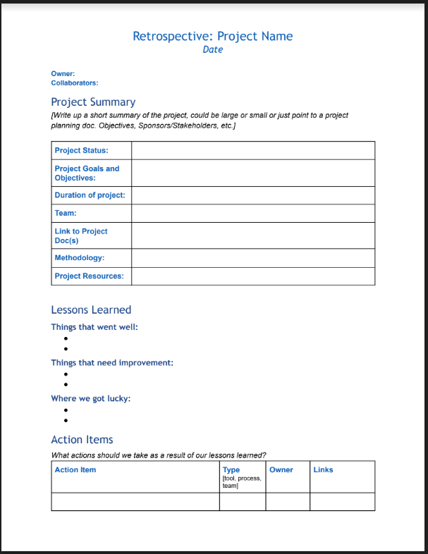
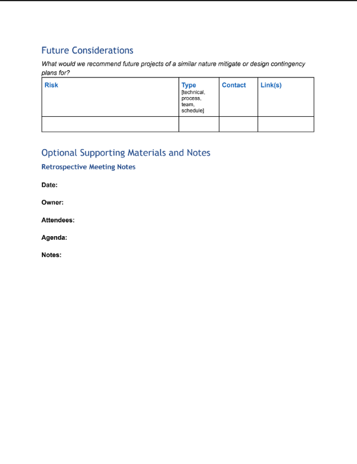
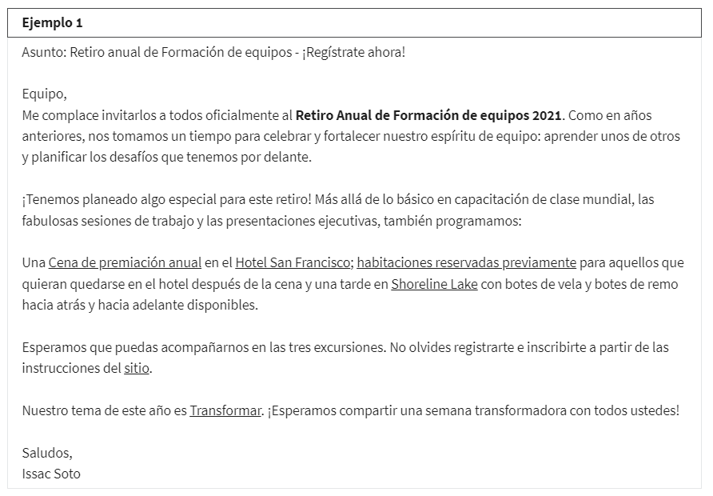
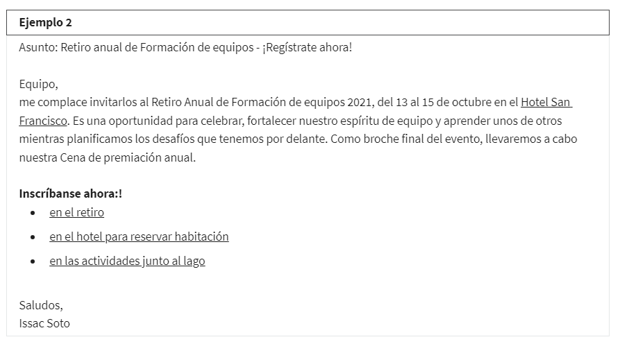

# Ejecución del proyecto: Ejecutar el proyecto

## Introduccion a la ejecucion de proyectos

### Seguimiento y medición del progreso del proyecto

#### La importancia del seguimiento

Una vez que comienza la fase de ejecución del proyecto, ¿cómo sabes que realmente se está haciendo el trabajo? Bueno, puedes
hacerlo de distintas maneras, pero sobre todo, puedes vigilar el progreso del proyecto a través del seguimiento y la medición.
En realidad, esto es una gran parte de la gestión de proyectos.

Por definición, el seguimiento es un método de controlar el progreso de las actividades de un proyecto. Medir el desempeño
del proyecto habitualmente para identificar desviaciones del plan del proyecto puede ayudar a asegurar que el proyecto se
mantenga en marcha.

Una desviación es cualquier cosa que altere el curso de acción original. Las desviaciones del plan del proyecto pueden ser
positivas o negativas.

    ¿Te adelantas a lo previsto porque un problema técnico es menos complejo de lo que pensabas? Qué bien.
    ¿Un desastre natural cerró tu equipo de pruebas? Qué mal.

Ambos son ejemplos de desviaciones. También son ejemplos de por qué el seguimiento es una parte tan fundamental de tu papel
durante la fase de ejecución del proyecto.

Vamos a examinar algunas de las formas en que el seguimiento es beneficioso para el éxito de tu proyecto:

Para empezar, el seguimiento hace que la información clave del proyecto sea transparente, y la transparencia es esencial
para una toma de decisiones precisa. Incluso los gerentes de proyectos más fuertes toman malas decisiones cuando carecen
de información o contexto.

El seguimiento centraliza información del proyecto para que todo el mundo pueda entender el estado de cada parte del pro-
yecto, lo que puede ayudarte a identificar lagunas en tus conocimientos. Además, los proyectos tienen muchos detalles pe-
queños. Es difícil mantener todo como se planeó. El seguimiento ayuda a garantizar que no te arriesgues y olvides algo
importante.

El seguimiento ayuda a mantener a todo el equipo y a los interesados en contacto con los plazos y las metas. Para garantizar
que todos tengan visibilidad del progreso del proyecto, deberías tener un plan de proyecto que funcione tanto para ti como
para tu equipo. De esta manera, todos sabrán lo mismo sobre cómo avanza el proyecto.

El seguimiento también es fundamental para reconocer riesgos y problemas que pueden descarrilar tu progreso. Con un segui-
miento efectivo, serás capaz de identificar problemas de manera oportuna y trabajar con tu equipo para tomar una acción
correctiva. Cuando proporcionas visibilidad de las diversas partes del proyecto, el seguimiento te ayuda a ti y a tu equipo
a identificar y enfocarse en las áreas de riesgo.

El seguimiento ayuda a generar confianza en que el proyecto está planeado para entregarse a tiempo y dentro del alcance
y el presupuesto. Tener una imagen clara y actualizada del estado general del proyecto mantiene al equipo motivado y cen-
trado en mantener el rumbo.

Para recapitular, el seguimiento es importante por algunas razones clave, como la transparencia, la gestión de riesgos y
el mantenimiento del proyecto en marcha.

#### Elementos comunes para hacer un seguimiento

Bueno, hemos hablado sobre que el seguimiento controla el progreso de las actividades del proyecto. Sin embargo, es posible
que aún te preguntes, ¿a qué específicamente deberías hacerle un seguimiento? Ahora, analizaremos los elementos más comunes
para hacer seguimiento que considero útiles en la gestión de proyectos en Google.

Primero, siempre debes realizar un *seguimiento del cronograma del proyecto*. Esto se compone de tareas y actividades que
garantizan que el proyecto está efectivamente encaminado hacia su fecha de finalización. Después de todo, tu objetivo
final es cumplir con los entregables a tiempo.

Igual de importante es el *seguimiento del estado de los elementos de acción, las tareas clave y las actividades* para
garantizar que ese trabajo en verdad se esté haciendo. El seguimiento de las tareas también ayuda a controlar el progreso
de tu equipo hacia los hitos. Cuando estés en medio de un proyecto, surgirán nuevas tareas todo el tiempo. Para evitar no
poder cumplir con las entregas, es esencial realizar un seguimiento de las tareas mientras progresan y se acercan a los
hitos clave.

hacer *seguimiento de los costos* para garantizar que no gastes de más o de menos en las tareas del proyecto. Como mencioné
anteriormente, todos los proyectos tienen presupuestos, y ya sea que supervises o no todo el presupuesto, es posible que
supervises tareas y recursos que producen consecuencias en los presupuestos.

Por último, tendrás que realizar un *seguimiento de las decisiones clave, los cambios, las dependencias y los riesgos del*
*proyecto, incluidos los acordados en caso de cambios en el alcance*. De esta manera, tu equipo y los interesados sabrán
qué se debe hacer para que el proyecto triunfe.

Para resumir, los elementos que son útiles para hacer un seguimiento en toda la fase de ejecución del proyecto incluyen
el cronograma del proyecto, que contiene las tareas y actividades clave, el estado de los elementos de acción, el progreso
hacia los hitos, los costos y las decisiones y los cambios clave.

#### Diferentes métodos de seguimiento

El propósito de tu plan del proyecto es guiarte a través de la ejecución de tu proyecto. Por lo tanto, siempre incluirá,
al menos, un tipo de método de seguimiento y, a veces, podrías usar más de uno según las necesidades de tu equipo. Los
métodos de seguimiento que debatiremos son un diagrama de Gantt, una hoja de ruta y un diagrama de trabajo pendiente. El
tipo que elijas dependerá de lo que consideres adecuado para tu proyecto. Es importante recordar que debes seleccionar
algo que todo el equipo pueda entender, consultar y mantener actualizado fácilmente.

Quizás el método de seguimiento más común de todos es el *diagrama de Gantt*. Es una herramienta de eficacia probadas
para mantener tu proyecto en marcha. Un diagrama de Gantt mide las tareas contra el tiempo e incluye información útil,
como quién hará cada tarea y cuál debería ser el orden de las tareas. Por este motivo, *es un diagrama útil para mantener*
*el cronograma y para proyectos con muchas dependencias, tareas, actividades o hitos que dependen unos de otros.* También
es un diagrama útil para equipos con muchas personas porque la propiedad y las responsabilidades se presentan explícita-
mente de forma visual. A medida que haces un seguimiento y avanzas de manera secuencial en el tiempo, comienza a verse
como una cascada; es por eso que los diagramas de Gantt *se usan generalmente en la gestión de proyectos de Waterfall*.
Cada tarea está representada por una barra de progreso horizontal y la longitud de la barra depende de cuánto tiempo se
asigne a la tarea. Las barras se agrupan una sobre la otra para denotar que la tarea en la parte superior debe completarse
antes de que la siguiente se pueda completar. Los diagramas de Gantt suelen residir en tu plan de proyecto y se actualizan
con el progreso del proyecto.

*Las hojas de ruta* son otro método de seguimiento común usado aquí en Google. Una hoja de ruta es más *adecuada para cuando*
necesitas una forma de *hacer un seguimiento de los grandes hitos* de tu proyecto. Es útil para ilustrar a un equipo y a los
interesados clave cómo debe evolucionar un proyecto a lo largo del tiempo. Aquí hay un ejemplo:

una hoja de ruta puede incluir las metas de tu proyecto en la parte superior y una descripción del enfoque que nos ayudará
a cumplir esos objetivos. En este ejemplo, la meta es aumentar las ventas en línea de la empresa a consumidores en un 20%
interanual e incrementar las ventas de vacaciones a clientes existentes en un 8% respecto al año anterior. El enfoque detalla
las principales tácticas que tu equipo usará para alcanzar el objetivo. Una hoja de ruta también incluye un resumen del
proyecto de alto nivel. En este contexto, alto nivel significa un resumen conciso, por lo general de tres a cuatro oraciones,
para indicar claramente los objetivos y las prioridades de tu proyecto. Por debajo de los objetivos, el enfoque y el resumen
está la tabla que mapea lo que implicará el proceso. En este ejemplo, nuestra la tabla se divide en trimestres que reflejan
el cronograma del proyecto. Un trimestre es un período de tres meses en el calendario financiero de una empresa. Los hitos
clave se enumeran para cada trimestre. También hay tareas que cada miembro del equipo o departamento debe completar. La mayoría
de las tareas se pueden asignar a un hito programado para el mismo trimestre. En nuestro ejemplo, el proyecto en su conjunto
tiene un hito clave en el primer trimestre de finalizar el inventario para la temporada navideña. El trabajo de la prueba
del producto y la finalización de las sugerencias para las ofertas recaen principalmente en los equipos de marketing y ventas.
Sin embargo, a veces las tareas pueden tener que completarse antes para desbloquear a otro equipo o hito de futuros trimestres.
El equipo de producto e ingeniería trabaja en tareas del primer trimestre y el segundo trimestre que conducirán al lanzamiento
de la renovada tienda en línea en el tercer trimestre. Para alcanzar ese hito, cada departamento debe completar tareas específicas
y la hoja de ruta hace un seguimiento individual y del progreso del proyecto en cuanto a los hitos.

Un *diagrama de trabajo pendiente*, el más detallado de estos tres métodos de seguimiento. Un diagrama de trabajo pendiente
mide el tiempo en función de la cantidad de trabajo realizado y la cantidad de trabajo restante. Su función principal es
mantener al equipo del proyecto al tanto de las fechas de finalización previstas y que el equipo sea consciente del alcance
a medida que ocurre. Los diagramas de trabajo pendiente son los *más adecuados para proyectos que requieren una revisión*
*detallada y desglosada de cada tarea asociada con un proyecto*, y son geniales para proyectos en los que terminar a tiempo
es la máxima prioridad.

El eje y, o eje vertical, representa el número de tareas que quedan por ompletar, y el eje x, o eje horizontal, representa
el tiempo. Se realiza un seguimiento del progreso desde la esquina superior izquierda del diagrama. A medida que el proyecto
avanza, harás un seguimiento y trabajarás para conseguir cero tareas restantes, y a la derecha, trabajarás para cumplir
con la fecha de finalización. Suele haber una línea de puntos para lo que se espera o proyecta del progreso en función
del tiempo que tu equipo estima que llevará cerrar tareas, y una línea continua que representa tu progreso real.

Antes de seguir adelante con tu proyecto, tendrás que decidir qué sistema de seguimiento es más adecuado.

Si necesitas comunicar hitos a un gran equipo, podrías elegir una hoja de ruta.
Si tienes un proyecto con múltiples dependencias, podrías elegir un diagrama de Gantt.
Si el seguimiento de las tareas contra la fecha límite es especialmente importante, entonces el diagrama de trabajo pendiente
podría ser tu mejor opción.

Incluso puedes elegir usar más de uno. Debido a que el método de seguimiento será determinado por el tipo de proyecto en
el que estés trabajando, tus recursos y el alcance del proyecto, probablemente usarás varios tipos de métodos de seguimiento
en algún momento de tu carrera.​

#### Elegir el método de seguimiento adecuado para tu proyecto

Hasta ahora, has aprendido sobre la importancia de hacer un seguimiento del progreso del proyecto. También revisaste algunos
de los diferentes métodos de seguimiento usados por los gerentes de proyectos, como los planes de proyectos, los diagramas
de Gantt y de trabajo pendiente, y las hojas de ruta.

- Diagramas de Gantt

El diagrama de Gantt es uno de los métodos de seguimiento más populares y se puede usar para todo tipo de proyectos. Los
diagramas de Gantt suelen estar en el estatuto del proyecto y se actualizan a medida que el proyecto avanza.

Los diagramas de Gantt son útiles para lo siguiente:

    Ayudar a un equipo a cumplir con el cronograma

    Proyectos con muchas tareas, dependencias e hitos

    Proyectos con grandes equipos, porque la propiedad y las responsabilidades se establecen explícitamente de forma visual

Asana, una de las herramientas de software de gestión del trabajo incluida en esta certificación, tiene recursos útiles
para comenzar con los diagramas de Gantt.

[Diagramas de gantt]([https://](https://asana.com/es/resources/gantt-chart-basics))

- Hojas de ruta

Las hojas de ruta son otro método de seguimiento común. Al igual que los diagramas de Gantt, las hojas de ruta también
hacen un seguimiento del progreso individual y del proyecto para cumplir los hitos. Sin embargo, las hojas de ruta son más
adecuadas para realizar un seguimiento de los grandes hitos de tu proyecto.

Las hojas de ruta son útiles para lo siguiente:

    Seguimiento de alto nivel de grandes hitos. Las hojas de ruta describen el proyecto en su conjunto y proporcionan una
    imagen general de los puntos clave, al igual que un mapa de ruta real contiene puntos de interés y marcadores de
    millas.

    Demostrar a tu equipo o a los interesados clave cómo debe evolucionar un proyecto con el tiempo

Las hojas de ruta se pueden crear usando diferentes herramientas. Puedes crear una hoja de ruta en un documento de google
docs o Ms Word.

[Platillas de hojas de ruta]([https://](https://www.smartsheet.com/free-product-roadmap-templates-smartsheet))
[Conceptos]([https://](https://www.smartsheet.com/content/project-roadmap-templates))

- Diagramas de trabajo pendiente

Los equipos de Agile Scrum suelen usar los diagramas de trabajo pendiente. Los diagramas de trabajo pendiente revelan qué
tan rápido trabaja tu equipo, ya que muestran cuánto trabajo queda por hacer y cuánto tiempo queda para completarlo. Los
usos principales de un Gráfico de quemado son:

    Mantener al equipo del proyecto al tanto de las fechas de finalización objetivo
    
    Dar a conocer la corrupción del alcance si ocurrieran.

El diagrama debe mostrarse para que todos puedan verlo y actualizarse habitualmente para que sea eficaz. Los diagramas de
trabajo pendiente son útiles para lo siguiente:

    Proyectos que requieren una revisión detallada de las tareas

    Proyectos donde terminar a tiempo es la máxima prioridad

Un Gráfico de quemado te ayuda, como gerente de proyectos, a comprender cómo trabaja tu equipo y qué influye en su capacidad
para completar las tareas a tiempo. De esta manera, puedes abordar los inconvenientes de inmediato, antes de que se
conviertan en problemas importantes. También te ayudan a planificar de manera más eficiente para el próximo proyecto, ya
que identifica áreas potencialmente problemáticas.

[Trabajo pendiente en jira]([https://](https://www.atlassian.com/agile/tutorials/burndown-charts))
[Conceptos basicos]([https://](https://www.projectmanager.com/blog/burndown-chart-what-is-it))

#### Informes de estado del proyecto

Identificar y comparar varios tipos de métodos de seguimiento y cómo usarlos para hacer un seguimiento y comunicar los
elementos comunes del proyecto en una imagen.

- Componentes clave de un informe de estado del proyecto

Un informe de estado del proyecto ofrece una descripción general de todos los elementos comunes del proyecto y los resume
en una imagen. Es una herramienta de comunicación eficiente para transmitir el estado más reciente en un solo lugar para
el equipo y los interesados.

*La mayoría de los informes de estado contienen los siguientes componentes:*

*Nombre del proyecto:* El nombre del proyecto debe ser específico para el propósito del proyecto, de modo que el objetivo
general del proyecto se pueda entender de un vistazo.

*Fecha:* Crearás informes de estado del proyecto muchas veces durante el transcurso de la fase de implementación de un
proyecto. Los informes se pueden crear semanal o mensualmente; todo depende de las necesidades de los interesados y del
ritmo del proyecto. Agregar la fecha a cada informe de estado sirve como un punto de referencia para tu audiencia y también
crea un registro histórico del estado del proyecto a lo largo del tiempo.

*Resumen:* El resumen condensa los objetivos, el cronograma, los mejores y peores aspectos del proyecto en un lugar central
para facilitar la visibilidad de los interesados. Por lo general, la sección de resumen irá seguida del resumen del cronograma
y el estado general del proyecto o estará junto a ellos.

*Estado:* Como puedes imaginar, el estado es una pieza fundamental. El estado del proyecto ilustra tu progreso real frente a
tu progreso planificado. En la gestión de proyectos, una forma común de describir esto es a través de los informes de estado
RAV (rojo, ámbar, verde) o rojo-amarillo-verde. El informe RAV sigue un patrón de semáforo para indicar el progreso y el
estado.

    *El rojo* indica que hay problemas que necesitan una solución y que el proyecto puede retrasarse o exceder significa-
    tivamente el presupuesto.

    *El ámbar/amarillo* significa que hay posibles problemas con el cronograma o el presupuesto, pero que es probable que
    estos se resuelvan con acciones correctivas.

    *el verde* significa que el cronograma y el presupuesto van bien y que el proyecto va por buen camino.

Puedes usar el informe RAV para indicar el estado general del proyecto, así como el estado de los hitos. Cada equipo del
proyecto y los interesados pueden tener una perspectiva ligeramente diferente sobre lo que significan los colores y la
urgencia de escalar los problemas cuando ven un estado ámbar/amarillo o rojo, por lo que es importante asegurarse de que
todos entiendan lo que significan los diferentes estados de color para tu proyecto.

*Hitos y tareas:* Un resumen de los principales hitos del proyecto hasta el momento y las tareas actuales ayuda al equipo
y a los interesados a visualizar fácilmente el progreso de esos elementos. En un plan de proyecto, normalmente representarás
las tareas y los hitos como "no iniciados", "en curso" o "completados" en un nivel de elemento por elemento. Sin embargo, en
el informe de estado del proyecto, es común resumir estos elementos en dos categorías para comunicar mejor el estado. Usarás
los logros clave para detallar lo que ha sucedido y los futuros para detallar los grandes hitos que lograrás después.

*Problemas:* Los problemas incluyen los obstáculos actuales y los riesgos potenciales de tu proyecto. Los informes de estado
son una oportunidad importante para establecer expectativas con los interesados. Si el estado de tu proyecto es rojo o ámbar,
puedes destacar qué te impide estar donde planeabas estar. También puedes aprovechar esta oportunidad para indicar tu plan
para que el proyecto vuelva a ser de color verde y solicitar cualquier recurso o ayuda que puedas necesitar para hacerlo.

- Tipos de informes de estado del proyecto

Si tienes esos elementos clave en mente, puedes dar formato a tu informe de diversas formas según tu audiencia y lo que
necesitas comunicar.

Si necesitas compartir un informe de estado con tu equipo para un proyecto que contiene múltiples capas de complejidad,
puede ser mejor formatear el informe en una hoja de cálculo para realizar un seguimiento de todos los aspectos móviles.

Si simplemente necesitas comunicar actualizaciones a los interesados sénior, es mejor que tu informe de estado tenga un
ormato como una presentación de diapositivas que contiene solo una descripción general de los puntos más importantes.

- Conclusiones clave

En resumen, los informes de estado del proyecto son una herramienta poderosa para lograr lo siguiente:

    Mejorar y simplificar la comunicación en todo el equipo.

    Mantener informados a todos, incluidos los interesados clave.

    Solicitar más recursos y apoyo (si fuera necesario).

    Crear estructura y transparencia registrando el estado del proyecto en un lugar centralizado.

### Gestión de cambios, riesgos y dependencias

#### Por qué ocurren los riesgos y los cambios

Por qué los riesgos y los cambios podrían ocurrir durante un proyecto y cómo eso puede afectar el alcance del proyecto.
Un riesgo es un evento potencial que podría ocurrir y afectar tu proyecto. Cuando piensas en los riesgos en el contexto
de la gestión de proyectos, lo harás de forma hipotética. En otras palabras, estos podrían no ser eventos que sin dudas
sucederán, pero como existe la posibilidad de que ocurran, es tu responsabilidad como gerente de proyectos identificarlos
y hacer planes para enfrentar esos riesgos.

Algunos ejemplos de riesgos. Un riesgo para el proyecto puede ser que un contratista no cumpla con una fecha límite,
o introducir una herramienta que podría provocar una interrupción de la comunicación dentro de tu equipo, o un trabajo
inesperado adicional debido a la puesta en marcha de una política imprevista.

Cuando se presenta algún riesgo, la consecuencia es un cambio en el plan del proyecto. Un cambio es cualquier cosa que
altera o afecta las tareas, las estructuras o los procesos dentro de un proyecto. Los cambios suelen ser inesperados.
La mayoría de las veces, tienen un impacto negativo en el proyecto y tendrás que aprender a afrontarlos.

Sin embargo, a veces, y hago un énfasis especial en "a veces", los cambios pueden tener un impacto positivo. Los cambios
pueden abarcar cualquier variación del plan del proyecto original con respecto a la triple restricción. Esto puede implicar
cambios en las prioridades, el alcance, el presupuesto y los recursos, o cambios en el cronograma del proyecto. Las dependencias
internas y externas de un proyecto se afectan entre sí y provocan cambios.

Algunos tipos de cambios que pueden afectar tu proyecto. Algunos ejemplos de cambios pueden incluir:

*cambios en las dependencias o nuevas dependencias.* Las dependencias son tareas, actividades o hitos que dependen unas de
otras. Así que si una tarea no se completa a tiempo, podría atrasar el resto de las tareas. Podrías estar a cargo de las
renovaciones de una vivienda donde hay dependencias. Por ejemplo, en la remodelación del baño, no se puede instalar un
lavabo nuevo hasta que se coloquen el tocador y las tuberías. Lo siguiente es cambiar las prioridades. El alcance de la
remodelación cambia si los suegros de tu cliente de repente tienen que mudarse y tienes que adelantar el trabajo planificado
del dormitorio libre antes de completar la remodelación del baño. A continuación, la capacidad y las personas disponibles
podrían cambiar. Tal vez tengas que reemplazar el plomero porque tenías problemas en el sitio de trabajo.

*Otro tipo de cambio podría incluir una nueva limitación en tu presupuesto o recursos.* Por ejemplo, si necesitas reducir
los costos del diseño del baño nuevo en un 10% porque tu presupuesto para el trabajo eléctrico es más alto de lo esperado.

*Otro cambio podría ser la corrupción del alcance.* La corrupción del alcance se refiere a cuando los cambios, el crecimiento
y otros factores afectan el alcance del proyecto. Por ejemplo, tus clientes están tan contentos con los azulejos del baño
nuevo que les gustaría reemplazar los azulejos de todos sus baños.

Por último, *está la fuerza mayor.* Este es otro cambio que podría ocurrir debido a una crisis nacional o internacional. Si
no estás familiarizado con este término, significa una circunstancia imprevista que impide que alguien cumpla con el contrato
debido a una crisis grave. La fuerza mayor es poco común, pero, por ejemplo, si un sindicato se declara en huelga, ciertos
proveedores no podrán cumplir con sus contratos. Si hay una pandemia, toda la producción de tu nuevo producto podría detenerse.

Los cambios se deben medir en contra de las estimaciones del cronograma de alcance, el presupuesto y el tiempo asignadas para
tu proyecto, según los requisitos originales. Ten en cuenta que cuando cambies cualquiera de esas cosas, puede tener efectos
que pueden ser positivos o negativos. Por ejemplo, tus clientes pueden creer que tienen hermosos pisos de madera escondidos
debajo alfombra vieja de la sala y querer sacar la alfombra vieja y usar el piso original que está debajo. Tú, como gerente
de proyectos de este trabajo de construcción particular presupuestaste retirar la alfombra y lijar los pisos viejos y manchados.
Pero surgieron malas noticias. Levantas la alfombra y encuentras que los pisos están en mal estado y podridos. Tendrán que ser
reemplazados o reparados, lo que podría resultar costoso. Por lo tanto, tu cronograma y presupuesto probablemente se modifiquen.

Cuando se trata de quién asume la responsabilidad de gestionar el cambio, serás tú, el gerente de proyectos. Sin embargo, según
el proyecto, es probable que no lo hagas solo. Para gestionar los cambios de forma apropiada, querrás referirte a documentos
como tu Declaración de trabajo y el gráfico RACI. Sin embargo, es posible que también debas crear documentos nuevos. Querrás
crear o familiarizarte con los procesos para solicitar cambios para tu equipo u organización. Estos procesos pueden incluir un
formulario de solicitud de cambio.

*Los formularios de solicitud de cambios.* Tú y los interesados usarán estos formularios para estar preparados para cualquier
cambio y poder gestionarlo de manera adecuada. Dado que muchas personas con diferentes funciones en el proyecto pueden llenar
estos formularios, es importante que los formularios sean claros y muy completos. En la plantilla proporcionada, que contiene
una tabla de 2 por 10, tendrás que incluir información en las celdas, tales como:

    el nombre del proyecto,

    el propietario del debate,
    
    quién toma la iniciativa en este debate del equipo
    
    el tipo de debate. Querrás que el público sepa si están debatiendo un riesgo, una oportunidad o cualquier otra cosa.
    identificar a los equipos involucrados
    
    el resultado esperado del debate, lo que podría implicar un cambio en las prioridades, un cambio en el cronograma o una
    convocatoria oficial sobre cómo proceder con un problema.
    
    Agrega la fecha límite del debate
    
    identifica qué hitos o metas podrían verse afectados
    
    Proporciona una breve descripción de la situación actual, el cambio y cualquier diferencia esperada que se deba hacer en el
    plan de registro, como una imagen del antes y el después.

    profundiza la propuesta de los cambios necesarios y aborda cualquier compensación.
    
    proporciona cualquier información previa para que todos tengan el mismo contexto.

También puedes consultar tu declaración de trabajo, o SOW, para obtener más información sobre quién necesita participar en esa
conversación. Si notas que uno o más de tus hitos corren riesgo de no completarse, entonces necesitarás que el cliente lo
apruebe antes de que el alcance, la fecha límite o el presupuesto se modifiquen, y todos los involucrados deben estar
informados.

#### Identificación y seguimiento de las dependencias

las dependencias son uno de los factores más importantes de un proyecto, tanto internas como externas, pero, ¿qué son exactamente
las dependencias? *Las dependencias son los enlaces* que conectan una tarea del proyecto con otra y, como mencionamos, a menudo son
la mayor fuente de riesgo para un proyecto.

Es posible que dos o más tareas del proyecto tengan una relación entre sí en la que la finalización de una tarea dependa de la
iniciación de otra y viceversa. Piensa en estas tareas como una línea de dominós en la que una pieza cae sobre la otra, una por
una. Si una pieza cae, golpeará a la siguiente y así sucesivamente.

Por ejemplo, una empresa constructora puede tener varios trabajos en toda la ciudad. Cada proyecto requiere que el capataz y el
gerente de proyectos sean elegidos antes de firmar los requisitos, el cronograma y el presupuesto, y contratar a los empleados. No
elegirías un equipo y les dirías que se pongan a trabajar antes de que el trabajo haya sido claramente delimitado y se hayan firmado
los contratos. Ese es un ejemplo de una *dependencia interna*, que describe la relación entre dos tareas dentro del mismo proyecto.

Por otro lado, *las dependencias externas* se refieren a tareas que dependen de factores externos, como organismos reguladores u otros
proyectos. Por ejemplo, si una empresa de construcción debe demoler un sitio de construcción, tendrá que esperar hasta que el municipio
apruebe el proyecto. Las dependencias externas no siempre están bajo el control del gerente de proyectos, pero es importante conocerlas
para que el proyecto se mantenga en marcha.

*Las dependencias obligatorias* son tareas requeridas legal o contractualmente. Por ejemplo, cuando esa empresa de construcción finaliza
la demolición y comienza la construcción, primero tendrá que verter una base de hormigón y luego el municipio los inspeccionará para
asegurarse de que cumpla con sus normas antes de que la empresa pueda seguir construyendo.

Por último, el equipo del proyecto define las *dependencias discrecionales*. Estas son dependencias que pueden ocurrir por sí solas, pero
el equipo vio la necesidad de hacer que esas dependencias dependan unas de otras. Por ejemplo, la empresa constructora puede usar hormigón
de un proveedor nuevo y querer hacer una prueba, vertiendo una parte del hormigón para obtener una mejor estimación de la cantidad total
de producto necesaria para completar el trabajo, en lugar de comprar demasiado o muy poco producto por adelantado. La tarea de verter una
porción del hormigón es lo primero, porque el equipo necesita más información antes de tomar una decisión.

Un gerente de proyectos tiene que trabajar con diligencia para incorporar la gestión de la dependencia. La gestión de la dependencia es el
proceso de gestionar todas estas tareas y los recursos interrelacionados dentro del proyecto para garantizar que tu proyecto en general se
complete con éxito a tiempo y dentro del presupuesto. Para lograr una gestión eficaz de la dependencia, hay cuatro pasos importantes que un
gerente de proyectos puede tomar:

    Identificación adecuada,
    
    Registro de las dependencias,
    
    Control y monitoreo continuos,
    
    Comunicación eficiente.

El primer paso es la *identificación adecuada*. Un gerente de proyectos hará una lluvia de ideas sobre todas las posibles dependencias del
proyecto con su equipo y las clasificará en consecuencia.

El siguiente paso es *registrar las dependencias*. Una vez identificadas todas las dependencias, debe crearse un registro de riesgos. Un
registro de riesgos es una tabla o diagrama que contiene una lista de riesgos y dependencias. El registro de riesgos debe incluir una
descripción de la dependencia, la fecha y todas las actividades o tareas que pueden verse afectadas por la dependencia.

A continuación, el gerente de proyectos querrá hacer un *monitoreo y control continuos*. Esto significa que querrás programar reuniones
periódicas para verificar las tareas interrelacionadas, mantenerte actualizado sobre cualquier progreso realizado y verificar los cambios
que afectarán otras tareas.

El último paso es una *comunicación eficiente*. Mantener al equipo del proyecto y a los interesados actualizados puede ayudar a resolver
las dependencias y lograr que el proyecto esté encaminado.

#### Técnicas para ayudar a gestionar los riesgos

La gestión de riesgos es absolutamente fundamental para el éxito de un proyecto. La gestión de riesgos es el proceso de identificar
los riesgos potenciales y las cuestiones que podrían afectar un proyecto, luego evaluar y aplicar medidas para abordar los efectos de
los problemas y los riesgos identificados.

Una forma de gestionar riesgos y, con suerte, evitar que cualquier riesgo se materialice es centrarse en gestionar los cambios y las
dependencias, así como cualquier riesgo imprevisto en tu proyecto. Si puedes gestionar tanto los cambios como las dependencias y la
corrupción del alcance, otros tipos de riesgos se vuelven mucho más fáciles de gestionar.

    Si tus dependencias se logran a tiempo, es menos probable que tu equipo se atrase con el cronograma.

    Si el alcance está bien gestionado, es menos probable que se produzcan cambios en tu presupuesto o que te veas obligado a extender
    el cronograma.

*Una lluvia de ideas* con tu equipo es una de las técnicas más efectivas para identificar los riesgos de un proyecto. Es probable que tus
compañeros de equipo aporten habilidades y experiencia de proyectos anteriores, lo que puede ayudar a descubrir similitudes y evitar que
se repitan los problemas. Mientras hacemos una lluvia de ideas con nuestro equipo, lo mejor es crear un registro de riesgos.

Un *registro de riesgos* es una tabla o diagrama que contiene la lista de riesgos de tu equipo. Será buena idea hacer preguntas a tu equipo,
como qué podría mejorar el resultado del proyecto o qué podría perjudicarlo u obstaculizarlo. Haz una lista de todo como si fueran afirma-
ciones. Por ejemplo, si ocurre un evento determinado, así es como se ve afectado el proyecto. Para ayudar a priorizar los riesgos dentro
de tu registro de riesgos, puedes calcular tu exposición al riesgo. *La exposición al riesgo* es una forma de medir el potencial de pérdidas
futuras que se den como resultado de una actividad o un evento específicos. Un buen método para calcular la exposición al riesgo es construir
una matriz como esta:

Cuando desarrolles tu matriz, usarás dos variables: impacto del riesgo y probabilidad. Escribe "impacto del riesgo" en la parte superior, en
el eje horizontal, y "probabilidad" en el lateral, en el eje vertical. También, marca el alto, el medio y el bajo a lo largo de cada eje, en
la parte superior de izquierda a derecha y hacia abajo en el costado, porque así es como vas a diagramar la exposición al riesgo. Suma cada
riesgo al gráfico en la sección de la intersección del impacto que puede tener el riesgo en tu proyecto y la probabilidad o posibilidad de
que se produzca el riesgo. Esta es una técnica, pero en cualquier estrategia que uses para examinar tu exposición al riesgo, tus riesgos deberán
ser la prioridad para que tú y tu equipo sepan a cuáles deben prestar atención inmediata. Para cualquier cosa que tenga un gran impacto en tu
proyecto, incluso si tiene una baja probabilidad de que ocurra, asegúrate de tener un plan de mitigación en marcha. ¿Cómo manejarás este riesgo
si realmente se materializa? Si bien un registro de riesgos es una gran herramienta, es probable que surjan algunos riesgos imprevistos.

Es casi imposible dar cuenta de todos los riesgos en el transcurso de un proyecto. Ahí es donde la técnica ROAM puede ayudar. La técnica ROAM,
que significa resuelto, asignado, aceptado y mitigado, se usa para ayudar a gestionar acciones después de que surgen los riesgos. Una vez que
se presenta un riesgo, debes decidir qué hacer con él.

    Si el riesgo se eliminó y no será un problema, entra en la categoría de "resuelto".

    Si al miembro de un equipo se le asigna un cierto riesgo y se le confía que lo maneje, ese riesgo pasa a la categoría de "asignado" y se
    supervisa hasta su finalización.

    Si el riesgo fue "aceptado", se acordó que no se hará nada al respecto.

    Si se han tomado acciones y el riesgo se ha mitigado, ya sea reduciendo la probabilidad de que se produzca o el impacto en el proyecto, pasa
    a la categoría de "mitigado".

Después de que cada riesgo se coloca en una categoría, el equipo debatirá cada riesgo y decidirá cuál debe tener prioridad.

### Comunicar problemas a los interesados

#### Priorizar problemas

la responsabilidad del gerente de proyectos es resolver problemas y eliminar las restricciones que perjudican el éxito del
proyecto. Una forma de hacerlo es por elevación.

*La elevación* es el proceso de solicitar la ayuda de un líder o gerente de proyectos de nivel superior para eliminar un
obstáculo, aclararlo o reforzar las prioridades, y validar los siguientes pasos. Puede parecer que la elevación tenga una
connotación negativa, pero ese no es el caso en la gestión de proyectos. En la gestión de proyectos, la elevación debe
alentarse, usarse a menudo e incluso celebrarse. Las elevaciones son saludables y actúan como controles y herramientas de
balance para asegurar que se están tomando las medidas adecuadas. Pueden tener como resultado una toma de decisiones rápida
y, en general, cuanto antes se resuelva un problema, mejor será el proyecto. En lugar de ir y venir entre dos miembros del
equipo que no pueden ponerse de acuerdo, un tercero que sea objetivo podría ayudar a hacer la llamada y reducir las frustraciones
del equipo. Finalmente, las elevaciones fomentan la participación. Alentar a los demás a participar en la resolución o la
asignación de problemas puede promover la confianza y la responsabilidad compartida entre compañeros de equipo, que son signos
de un equipo sano y funcional.

Antes de empezar a trabajar en un proyecto, el gerente de proyectos, el equipo y el patrocinador del proyecto deben establecer
las normas y prácticas de elevación. Esto significa que especificarán a quién se le plantearán los problemas, cómo se plantearán
y el foro de debate. Un poco de trabajo inicial ayudará a que las elevaciones se ejecuten sin problemas si fueran necesarias.

¿cómo sabes cuándo hacer una elevación? Un gerente de proyectos debe elevar un problema ante la primera señal de problemas graves
en el proyecto. Los problemas graves son problemas que pueden causar:

    Un retraso a un hito importante del proyecto.
    
    Uroblemas que causan excesos en el presupuesto.
    
    Problemas que pueden provocar la pérdida de un cliente.
    
    Problemas que hacen aplazar la fecha estimada de finalización del proyecto.

Básicamente, cualquier cosa que afecte tu restricción triple, tiempo, presupuesto y alcance es algo que debería elevarse.
La elevación es ideal para prevenir dos problemas comunes dentro de un proyecto: *guerras de trincheras y malos compromisos*.

*Las guerras de trincheras* ocurren cuando dos pares o grupos no pueden llegar a un acuerdo y ninguna de las partes está
dispuesta a ceder.Esto lleva a una paralización del proyecto y, probablemente, provocará retrasos en ciertos aspectos del
progreso del proyecto.

Por lo general, pensamos en los *compromisos* como una forma positiva de resolver problemas, pero también existen malos
compromisos. Un mal compromiso ocurre cuando dos partes deciden una supuesta solución, pero el producto final igual sufre
consecuencias. Cuando se trata de comprometerse con los objetivos importantes del proyecto, no es productivo para ninguna de
las partes que simplemente se conformen porque es un medio para alcanzar un fin. Sí, comprometerse y al mismo tiempo mantener
los objetivos más grandes del proyecto en mente y trabajar para todo eso junto.

#### Comunicar cambios al equipo

Comunicar el cambio a los miembros del equipo del proyecto y los interesados no es solo una cuestión de mantener los documentos de
seguimiento actualizados. Incluso los cambios más pequeños serán significativos para alguien de tu equipo y deben ser comunicados,
También es cierto que tendrás que adaptar tus tácticas de comunicación según el tema y el destinatario.

Como gerente de proyectos, a veces vas a querer tener una reunión con todo tu equipo, mientras que otras veces un correo
electrónico puede ser suficiente. Personalmente, prefiero tomar un café rápido o tener una charla en el pasillo con mis compañeros
de equipo y luego hacer un seguimiento por correo electrónico que detalle en qué nos pusimos de acuerdo. Esto es particularmente
útil cuando necesitas un acuerdo rápido o si el tema es un poco delicado.

¿Cómo sabrás qué táctica de comunicación es adecuada? En última instancia, tendrás que usar tu propio juicio, pero aquí hay
algunas maneras con las que puedes decidir qué acción tomar. Como gerente de proyectos, cuando se comunica un pequeño cambio
que afectará a una persona, es una buena idea enviar un correo electrónico. Asegúrate de evitar temas emotivos o cualquier cosa
que necesite debatirse en profundidad. Solo avísales y coordina una reunión. Es posible que las reuniones semanales no sean
necesarias, en especial si tu agenda es acotada. Si estableces una reunión y luego decides no realizarla, puedes recurrir a un
correo electrónico o tratar el tema en un foro diferente.

Cuando haya un gran cambio dentro de tu proyecto que involucre a más de una persona y probablemente cambie el presupuesto, la
fecha límite o el alcance del proyecto, probablemente deberás tener una reunión con el equipo. Una táctica útil para mantener
en mente a la hora de analizar estos cambios en tu proyecto se denomina tiempo de espera. Un tiempo de espera significa tomar
distancia del proyecto para descansar, reagruparse y ajustar el plan de juego. Un tiempo de espera puede interrumpir de manera
temporal tu impulso, pero puede ser absolutamente necesario para prepararte para triunfar al final del proceso. Es posible que
desees un tiempo de espera cuando el cliente quiera redefinir el alcance del proyecto o si los miembros del equipo deben reasignarse
a otros proyectos y necesitas un plan para reemplazarlos. Este tiempo de espera es una oportunidad para que el equipo del proyecto
evalúe los cambios y pueda ajustar el plan según sea necesario.

Durante todo el proceso, quizás quieras mantener reuniones para debatir los éxitos, contratiempos y posibles mejoras en las
características del proyecto. Estas reuniones son denominadas retrospectivas. Las retrospectivas se realizan a lo largo del ciclo
de vida del proyecto. Una retrospectiva se centra en identificar las causas que contribuyeron a un incidente o patrón de incidentes
sin culpar a una sola persona. Cuando realices una retrospectiva, siempre debes suponer que todo el mundo tuvo buenas intenciones y
que hizo lo correcto con la información que tenía, ya sea que haya funcionado bien o no. Siempre hay una posibilidad de aprender y
hacerlo mejor. Como gerente de proyectos, es importante identificar técnicas efectivas de comunicar cambios a una persona del equipo
o a todo tu equipo.

#### Escribir un correo electrónico de elevación efectivo

*la elevación:* el proceso de obtener la ayuda de líderes o gerentes de proyectos de mayor nivel para eliminar un obstáculo, aclarar
o reforzar las prioridades y validar los próximos pasos.

- Prácticas recomendadas de elevación por correo electrónico

Tu función como gerente de proyectos es ayudar a resolver problemas y eliminar los obstáculos que impiden que tu equipo avance
hacia sus metas. Si bien muchos problemas pueden ser lo suficientemente pequeños como para resolverlos dentro del equipo principal,
es posible que otros, como un cambio importante en tu presupuesto o en el cronograma, deban presentarse a los interesados para
que tomen una decisión final. Detallar estos problemas, su posible impacto y el apoyo que necesitas en un correo electrónico
claro y directo a tu audiencia puede ser una herramienta de comunicación efectiva.

Correos electrónicos de elevación efectivos:

    Mantener un tono amistoso

      - Considera empezar tu correo electrónico con una simple muestra de buena voluntad, como “Espero que estén bien”.
      - Cuando describas el problema, busca un tono irreprochable.
      - mantén el correo electrónico amigable y profesional. Después de todo, estás pidiendo ayuda al destinatario.
      - Asegúrate de terminar el correo electrónico agradeciendo al destinatario por su tiempo.

    Indicar tu conexión con el proyecto

      - Preséntate al comienzo del mensaje si tienes menos confianza con los interesados del proyecto.
      - Asegúrate de indicar claramentetu nombre, función y relación con el proyecto. Esto ayuda al lector a entender por qué te
        estás comunicando.
      - Mantén tu introducción breve y al grano; una sola oración debería ser suficiente.
      - Si conoces a la persona que recibe la elevación por correo electrónico, simplemente puedes reforzar tu responsabilidad en
        el proyecto antes de abordar directamente el problema.

    Explicar el problema

      - Una vez que saludes al destinatario y te presentes brevemente, explica el problema en cuestión.
      - Indica claramente el problema que necesitas resolver.
      - Proporciona el contexto suficiente para que el lector comprenda el problema.
      - trata de mantener el mensaje lo más conciso posible.
      - Evita los párrafos largos y confusos que pueden ocultar tu mensaje y tentar al lector a omitirlos.

    Explicar las consecuencias

      - Después de explicar el problema, describe claramente las consecuencias.
      - Describe específicamente cómo este problema está afectando gravemente al proyecto o cómo tiene el potencial de afectarlo gravemente
        más adelante en el cronograma del proyecto.
      - De nuevo, mantén tu explicación concisa y tu tono amigable.

    Proponer un curso de acción y hacer una solicitud

      - Propones una solución (o soluciones) e indicas lo que necesitas del destinatario.
      - Una solución bien pensada acompañada de una solicitud clara permite al destinatario saber cómo puede ayudarte y te lleva a una resolución.

- Reunir todos los elementos

Veamos cómo se combinan estas buenas prácticas para crear una elevación por correo electrónico sólida.

Conclusión clave:

En resumen, los correos electrónicos de elevación efectivos aplican estas cinco prácticas recomendadas:

    Mantener un tono amistoso

    Indicar tu conexión con el proyecto

    Explicar el problema

    Explicar las consecuencias

    Hacer una solicitud

La elevación es una habilidad útil para resolver problemas rápidamente, y enviar una elevación por correo electrónico sólida
que aplique estas prácticas recomendadas puede ayudar a que tu equipo reciba la ayuda necesaria.

## Gestión de calidad y mejora continua

### Comprender la gestión de calidad

#### Conceptos clave de la gestión de calidad

Al gestionar un proyecto, siempre tener en cuenta la limitación triple: tiempo, alcance y presupuesto. Cada uno de estos tres
elementos afectará al proyecto; un problema con alguno de ellos es un problema para la calidad general del proyecto.

Hay una diferencia importante entre "calidad" y "realización". El simple hecho de terminar un proyecto no basta; el proyecto
debe cumplir con los estándares del cliente en cuanto a calidad más allá de su mera realización. Como en todos los aspectos de
la gestión de proyectos, cuanto más eficazmente te comuniques con tu equipo, más probable es que tu equipo ofrezca entregables
de alta calidad.

¿Cómo definimos la calidad en el marco de la gestión de proyectos? La calidad se logra al cumplir los requisitos indicados para
el entregable y satisfacer o superar las necesidades o expectativas de los clientes. Cuando se trata de calidad, es importante
entregar un producto o servicio que satisfaga las necesidades de los clientes. Para lograrlo, debes conocer conceptos importantes
de la gestión de calidad y supervisar la implementación de un plan de calidad para la gestión de proyectos.

Al prepararte para el éxito, debes considerar los cuatro conceptos principales de la gestión de calidad:

- Normas de calidad.

El proceso de calidad comienza con el establecimiento de las *normas de calidad*. Estas normas indican los requisitos, las
especificaciones o las directrices que pueden servir para garantizar que los productos, procesos o servicios permitan alcanzar
el resultado deseado.

Establece las normas de calidad junto con tu equipo y el cliente al comienzo del proyecto. Tómate el tiempo para definir las
normas de calidad y los criterios para el trabajo actual para que los miembros del equipo y los interesados comprendan exactamente
cuáles son. Después de establecer esas normas de calidad bien definidas, deberás hacer controles periódicos y asegurarte de que
todo se vea bien y se cumplan los requisitos.

Recuerda que definir bien las normas y los requisitos conduce a menos reelaboración y menos retrasos.

Examinemos esto a partir de un ejemplo, Eres gerente de proyectos en Office Green, una empresa que se especializa en plantas
decorativas para oficinas y otros negocios; conduces un proyecto llamado Plant Pals, un nuevo servicio que ofrecerá plantas
para escritorio a los clientes más importantes. Aquí hay un ejemplo de algunas normas de calidad para este proyecto:

Normas de confiabilidad: Cada maceta llega a la hora convenida y en buenas condiciones, lista para colocarla sobre un escritorio,
Los proveedores tienen suficientes plantas en sus almacenes para satisfacer la demanda del cliente a tiempo.

Normas de usabilidad: Las plantas no causarán reacciones alérgicas ni enfermedades a los clientes y serán aptas para todas las
personas y los animales.

Del mismo modo, puedes tener normas del producto: El proveedor debe cumplir con el aspecto y estilo de tu marca, usar los
materiales especificados y entregar el producto intacto. Debe adherirse a las normas de calidad para todos los productos
y procesos. Por ejemplo, puedes implementar normas de usabilidad en el proceso de desarrollo del sitio web indicando que el
sitio web debe ser fácil de navegar, ya sea desde un teléfono, computadora o tableta.

- Planificación de calidad.

El siguiente paso: *la planificación de calidad*, se trata específicamente de las acciones de un gerente de proyectos o el equipo
para establecer y realizar un proceso tendiente a identificar y determinar exactamente qué normas de calidad en verdad se
corresponden con el proyecto en su conjunto y cómo cumplirlas. Para llevar adelante esta conversación, pregúntate lo siguiente:

    "¿Qué resultado esperan mis clientes al final de este proyecto?
    ¿En qué se refleja la calidad según ellos?
    ¿Cómo puedo cumplir sus expectativas?
    ¿Cómo determino si las medidas de calidad nos llevarán al éxito del proyecto?".

Aquí es donde planificarás los procedimientos para cumplir las normas de calidad. Recuerda que una norma de calidad del proyecto
Plant Pals es la confiabilidad, la expectativa de que cada planta llegue a la hora convenida y en buenas condiciones. Por lo tanto,
como medida de planificación de calidad, tendrás que hacer planes con tu proveedor de plantas para comprobar la durabilidad de las
macetas antes de decidir utilizarlas.

- Garantía de calidad.

El tercer concepto de la gestión de calidad es *la garantía de calidad*, a menudo abreviada como QA, consiste en evaluar si el proyecto
avanza hacia la entrega de un servicio o producto de alta calidad. A diferencia de las normas y la planificación de calidad, la QA
abarca el ciclo de vida del proyecto en su totalidad en lugar de ocurrir en una fase específica. El plan de calidad debe incluir
auditorías periódicas para confirmar que todo procede conforme al plan y se siguen los procedimientos necesarios.

Hacer controles regulares e informar a los interesados ayuda a aumentar su confianza y la tuya también. La garantía de
calidad es donde te aseguras de que tú y tus clientes obtienen el producto exacto que acordaron.

En el proyecto de Plant Pals, aquí es donde el equipo evaluará las opciones de macetas y tal vez realice pruebas de durabilidad. Si
planificas que el proveedor de plantas realice las pruebas de durabilidad por su cuenta, asegúrate de supervisar su progreso y hacer
controles periódicos.

- Control de calidad.

El concepto final de la gestión de calidad es el *control de calidad, a menudo abreviado como QC*. Aquí, se usan técnicas para
cumplir las normas de calidad al identificar un problema o si el plan de calidad no se ejecuta de la manera deseada y hay
que realizar acciones correctivas.

El control de calidad implica supervisar los resultados y la entrega del proyecto para determinar si se logran los resultados
deseados o no. Si no se logran, hay que realizar acciones alternativas. El control de calidad también es fundamental para
allanar el camino para el próximo proyecto.

Después de colocar las plantas en todas las oficinas de los clientes, el control de calidad podría ser que tú o un miembro
del equipo haga un recorrido final por las oficinas donde se entregaron las plantas. Así, controlarías si hay macetas o
plantas rotas que se dañaron al llevarlas y las cambiarías en caso de que fuera necesario. No puedes hacer esto con cada
cliente, pero es una buena idea hacerlo al comienzo, por si acaso detectas cuestiones que puedas mejorar cuando vuelvas
a la oficina.

Si te atienes al plan de calidad, lo que implica comprobar la calidad a lo largo del ciclo de vida del proyecto (QA) y, por
supuesto, corregir según sea necesario (QC), la probabilidad de cumplir las normas de calidad es alta, lo que permite un
entregable de alta calidad al final del proyecto que satisface los objetivos de tu organización y supera las expectativas del
cliente.

#### Resumen: Conceptos de la gestión de calidad

En resumen los 4 pilares de la gestion de calidad en proyectos son:

    Las normas de calidad ofrecen requisitos, especificaciones o pautas que se pueden utilizar para garantizar que los
    productos, procesos o servicios sean adecuados para lograr el resultado deseado. Estas normas deben cumplirse para
    que la organización y el cliente consideren exitoso el producto, proceso o servicio. Establecerás las normas de calidad
    con tu equipo y el cliente al comienzo del proyecto. Las normas bien definidas conducen a que haya menos reelaboración
    y menos retrasos de programación a lo largo del proyecto.

    La planificación de calidad comprende tus acciones o las de tu equipo para establecer y realizar un proceso tendiente
    a identificar y determinar exactamente qué estándares de calidad son relevantes para el proyecto en su conjunto y cómo
    satisfacerlos. Durante este proceso, planificarás los procedimientos para cumplir con las normas de calidad del proyecto.

    La garantía de calidad, o QA, es un proceso de revisión que evalúa si el proyecto avanza hacia la entrega de un servicio
    o producto de alta calidad. Incluye auditorías periódicas para confirmar que todo procede conforme al plan y que se
    siguen los procedimientos necesarios. La garantía de calidad te ayuda a asegurarte de que tú y tus clientes obtengan
    el producto exacto que acordaron.

    El control de calidad, o QC, implica controlar los resultados y la entrega del proyecto para determinar si se alcanzan
    los objetivos deseados. Incluye las técnicas que se utilizan para garantizar que se mantengan las normas de calidad
    cuando se identifica un problema. El control de calidad es un subconjunto de las actividades de garantía de calidad.
    La QA busca prevenir los defectos antes de que ocurran, mientras que el QC tiene como objetivo identificar los defectos
    después de que hayan ocurrido y también implica tomar medidas correctivas para resolver estos problemas.

#### Fomentar las relaciones con los clientes mediante habilidades comunicativas

La comunicación comienza aun antes que el proyecto y continúa de forma constante durante el resto del proyecto. las habilidades
interpersonales, como negociar, entregar mensajes con empatía y preguntar para aclarar dudas ayuda a fomentar y fortalecer
la comunicación, También así las opiniones como base de iteración de un producto.

Según el Instituto de Gestión de Proyectos, se descubrió que la mayoría de los proyectos padecen algún tipo de ruptura
comunicacional, aunque los gerentes de proyectos trabajen cerca del 90% de su tiempo exclusivamente en la comunicación. Lo
mejor para el gerente de proyectos es comunicarse con tacto, no solo con los miembros de su organización, sino también con
los clientes y proveedores. Cuando es eficaz la comunicación estratégica con un cliente común o profesional puede inculcar
una sensación de confianza en que haces un buen trabajo y eres un socio de confianza.

¿Cómo debería un gerente de proyecto abordar la comunicación con el cliente? El uso de habilidades interpersonales, como
negociación, escucha empática y creación de confianza, ayudará a generar una buena relación entre tú y tus clientes, y un
buen gerente de proyectos sabe cómo y cuándo aplicar estas habilidades.

Una práctica clave para la negociación, la escucha empática y la creación de confianza es hacer preguntas. Es importante
hacer preguntas abiertas y escuchar activamente para entender el estado actual del cliente comparado a su estado deseado
y qué podría ayudarlo a pasar de uno al otro. Si haces preguntas abiertas, descubrirás en qué puntos puedes hacer que los
clientes se sientan más seguros. Podrás negociar para garantizar la satisfacción de tus necesidades y la creación de la
confianza necesaria para tener una asociación exitosa.

Los gerentes de proyectos eficaces fijan expectativas claras sobre cuándo comunicarán ciertas cuestiones a los clientes. Por
ejemplo, podrías fijar la expectativa de que brindarás actualizaciones de progreso semanales para mantener a los clientes
informados en lugar de esperar que acudan a ti con preguntas. Al solucionar un problema con el producto, posiblemente no sea
necesario notificar al cliente un problema que no afectará el resultado.

Supongamos que un diseñador del equipo renuncia y tienes que reemplazarlo; podrías reemplazar a ese diseñador por uno nuevo
rápidamente y sin perder un ápice del progreso del proyecto. Puedes completar la tarea sin causar al cliente ninguna preocupación
adicional. El nivel de visibilidad entre los clientes comunes y profesionales de un proyecto puede variar, y tendrás que usar
tu criterio sobre aquello que es importante comunicar a tu cliente.

A veces, querrás decirle al cliente si surge algún problema. Si llegas a un punto del proyecto donde no puedes seguir
adelante sin su ayuda y opiniones, tendrás que comunicarle el problema con calma y empatía.

Veámoslo en el contexto del proyecto Plant Pals, si abordáramos un problema de macetas rotas. Tal vez al articular las
normas de calidad, dejamos un margen para un error del proveedor y contemplamos algunas macetas rotas. Digamos que resolvimos
que el número aceptable de macetas rotas era de dos cada 50. Pero imaginemos que el cliente recibió un envío y había cinco
macetas rotas. En ese momento, necesitaremos reunirnos con el cliente y hacer preguntas de negociación importantes. Tendremos
que decidir si las cinco macetas rotas de 50 son un resultado aceptable o tendremos que discutir si el cliente consideraría
invertir en macetas de mejor calidad con menor probabilidad de que se rompan. Una solución como el uso de macetas más
resistentes afectará el presupuesto y tendrá que ajustarse en consecuencia. ¿El cliente acepta ese cambio? ¿Eso llevaría
a un nuevo acuerdo?.

Si tienes en cuenta que el objetivo principal es la satisfacción del cliente durante todo el proceso de negociación, querrás
ser considerado en cuanto a sus sentimientos y limitaciones. Puedes hacerlo demostrando empatía: entender sus frustraciones,
abordarlas y encontrar una solución que sea beneficiosa para ambos. Posiblemente hayas tenido en el pasado la función de tratar
con clientes, ya sea en un centro de llamadas, como asociado minorista, al trabajar en un restaurante o en una variedad
de puestos. Incluso si no la tuviste, probablemente hayas tenido que defenderte a ti mismo al conversar con un representante
de servicio al cliente. En virtud de ello, seguro sabes apreciar cuando hay un buen servicio al cliente. Un buen servicio
al cliente te hace volver a la misma peluquería, panadería o cafetería porque te gusta cómo te trataron y el servicio que
recibiste (aunque hayas tenido algún problema), a diferencia de los lugares donde eliges no volver por no haber recibido
ese nivel de atención.

Las experiencias pasadas te enseñan a gestionar las relaciones y a evitar entregar algo que es de baja calidad. No se
siente muy bien cuando eres tú el que lo recibe. Para obtener mejores resultados en proyectos futuros, debes escuchar la
opinión de los clientes. A veces, esa opinión llegará durante el proceso y, a veces, una vez que el proyecto haya finalizado,
según cómo lo hayas planeado en la fase de iniciación. La cuestión de cuándo recibes las opiniones puede conducirte a lo
que realmente quieres lograr en tu proyecto. Si tu empresa lanza un sitio de comercio electrónico, las opiniones de los
usuarios te permitirán hacer ajustes para optimizar la experiencia de compra de los clientes. Si tu empresa es un servicio
de entrega de cookies por solicitud, posiblemente quieras entregar las cookies y luego recibir opiniones de los usuarios
para conocer su reacción acerca de las cookies y la experiencia de entrega en su conjunto.

Las opiniones de los usuarios ayudan a cerrar cualquier brecha y a acercar las expectativas del cliente y las necesidades
del proyecto.

#### Medir la satisfacción del cliente

Si el objetivo final del proyecto es tener un producto o servicio de gran calidad tanto para la organización como para
nuestro cliente, necesitamos hacernos una idea de lo que él desea.

La mejor manera de saber lo que desean los clientes y usuarios es preguntarles, pero no se trata de llamar por teléfono a
cada uno y literalmente preguntarle. Esa podría no ser la mejor forma de usar nuestro tiempo. Afortunadamente, hay algunas
formas de racionalizar esa información. Podemos realizar una serie de encuestas o pruebas con los clientes y usuarios. Suelen
usarse encuestas de opinión y pruebas de aceptación de los usuarios.

Comencemos con las *encuestas de opinión*. Son encuestas en las que los usuarios opinan sobre las características del producto
que les gustan o no. Estas encuestas se pueden realizar mientras diseñas, antes del lanzamiento, para saber si la gente
entiende el producto y si les gusta, o bien después del lanzamiento, para garantizar que la experiencia del usuario es aún
más satisfactoria, entonces, los usuarios participan en una encuesta y te dan su opinión sobre qué característica les gusta
o no y, potencialmente, qué aspectos les parecen bastante intuitivos y qué aspectos son un poco más difíciles de navegar. A
partir de esas opiniones, estarás listo para lanzarlo, si aún no lo has hecho, o darás marcha atrás para iterar el producto
si ya está en el mercado.

Alternativamente, puedes realizar *pruebas de aceptación del usuario*. En sentido amplio, una prueba de aceptación del
usuario, o UAT, permite que una empresa se asegure de que el producto o solución funciona para los usuarios. Una UAT debe
cumplir con los requisitos acordados y entregar los resultados esperados. Normalmente, se la utiliza para evaluar de principio
a fin la experiencia del usuario con un nuevo proceso o producto. La UAT es demasiado importante porque se realiza cerca
del final del desarrollo del producto y, por lo tanto, es una prueba general de la experiencia del usuario y del producto,
software o servicio completo. Las UAT a veces se conocen como "pruebas beta". Averigüemos qué aspecto podría tener una agenda
de UAT. En un entorno típico de UAT, das la bienvenida a tus usuarios y les agradeces por participar. Luego, les presentas
el producto. Esto incluye discutir pautas de prueba y demostrar cómo funciona el producto. A continuación, comienzas con los
casos de la prueba de UAT, que conducen a la audiencia por recorridos críticos para el usuario.

*Un recorrido crítico* para el usuario es una secuencia de pasos que este sigue para completar tareas en el producto. Al
presentar algo que has creado, debes dar a los usuarios una representación visual o maqueta del producto o hacerles una
demostración. Por ejemplo, si trabajas en un proyecto basado en la construcción y deseas reemplazar los electrodomésticos
y las instalaciones en el hogar, querrás darle al usuario algún tipo de visión de lo que eso podría implicar. Podrían ser
modelos 3D, planos digitales, muestras y mucho más. Tu demostración de UAT debe propender a un llamado a la acción. Por
ejemplo, el llamado a la acción para el proyecto puede ser la necesidad de probar las instalaciones en el futuro hogar
del cliente. Quizás los propietarios solicitaron un lavavajillas que se pudiera abrir y cerrar con muy poca fuerza y que
no hiciera demasiado ruido. En ese caso, querrás ofrecer al cliente escenarios de la vida real sobre los cuales trabajar.
Pídele que cargue los platos e inicie el ciclo de lavado. Luego haz preguntas como: "En una escala de uno a 10, ¿cuánta
fuerza hizo para abrir y cerrar el lavavajillas?". Esto permite determinar si la lavadora cumple sus expectativas.

Durante tu presentación y el recorrido de la UAT, deberías recopilar opiniones de los usuarios sobre su experiencia
general. Durante esta parte de las pruebas, los usuarios pueden ayudarte a identificar casos extremos. Los casos extremos
son raros: valores atípicos que los requisitos originales no tenían en cuenta. Se ocupan de los extremos máximos y mínimos
de los parámetros. Por ejemplo, imagina que creaste una aplicación que permite subir fotos sin límite, basado en que los
usuarios rara vez suben más de 1000 fotos en una sola sesión. ¿Cómo reaccionará el sistema ante alguien que sí sube miles,
o millones, de fotos en una sola carga? Es poco probable, pero podría ser desastroso para el software.

Después de identificar casos extremos, el último paso de la agenda de la UAT es recapitular los hallazgos, identificar
errores o problemas y priorizar qué problemas deben abordarse primero. Cuando hayas abordado el problema y determinado
los pasos por seguir, podrás cerrar y concluir las pruebas de aceptación del usuario.

#### Garantizar accesibilidad durante la recepción de comentarios

Primero, si recopilas opiniones con entrevistas en tiempo real, asegúrate de incluir distintos tipos de adaptaciones en tu
correspondencia cuando organices las sesiones. Quizá te pidan subtítulos en tiempo real o la presencia de un intérprete. Otras
personas que quizá sufren de ansiedad o están dentro del espectro autista pueden pedir las preguntas por adelantado así
tienen tiempo de pensar y preparar sus respuestas. Recuerda que lo que funciona con una persona quizá no funciona con otra,
incluso si ambas personas tienen la misma discapacidad.

Si estás llevando a cabo una entrevista cara a cara, examina el espacio teniendo en mente la accesibilidad, por ejemplo,
garantiza que haya un camino accesible al edificio y al salón, y que los pasillos estén libres para que alguien en silla
de ruedas o un andador pueda pasar sin problemas, o alguien con discapacidad visual pueda moverse con seguridad.

Si envías una encuesta o recopilas opiniones usando tecnología, corrobora que los sistemas que usas sean ciento por ciento
accesibles. Si no lo sabes con certeza, contacta al titular del sistema y pregunta si cumplen con las últimas pautas de
accesibilidad del contenido web o WCAG. Prepárate para hacer preguntas y recopilar respuestas de otra forma si es necesario.

Además de recopilar opiniones, como gerente de proyectos, es importante que facilites la accesibilidad de la conversación
desde el principio, en especial si tu proyecto tiene que ver con un proceso o un producto. A menudo, se pasan por alto las
funciones de accesibilidad de un producto o se dejan para el final del proyecto. Esto puede tener consecuencias serias, como
retrasos en el lanzamiento o, peor aún, un producto que cierto porcentaje de la población no puede utilizar.

Asegúrate de que los desarrolladores conozcan los requisitos de accesibilidad desde el comienzo. Si no los conocen, ponlos
en contacto con los recursos o expertos adecuados. Incluye testers con distintas discapacidades en tus pruebas de usabilidad
cada vez que puedas y, al menos, evalúa si el producto cumple con las pautas de accesibilidad.

En síntesis, piensa desde el principio y a menudo en la accesibilidad, y anima a otros miembros del equipo del proyecto a
que también lo hagan.

#### Pruebas de aceptación del usuario: Objetivos, prácticas recomendadas y gestión

- Los objetivos de la UAT

En resumen, la UAT es una prueba que ayuda a una empresa a asegurarse de que un producto, servicio o proceso funcione para
sus usuarios. Los principales objetivos de la UAT son:

    Demostrar que el producto, servicio o proceso se comporta de la manera esperada en escenarios del mundo real.

    Mostrar que el producto, servicio o proceso funciona según lo previsto.

    Identificar los problemas que deben abordarse antes de considerar que el proyecto está completo.

La UAT simula las condiciones del mundo real; entonces, cuando la función logra el desempeño previsto durante el proceso
de prueba, puedes estar más seguro de que el producto, servicio o proceso funcionará correctamente una vez que se lance,
permite a un equipo de proyecto recopilar información detallada sobre cómo los usuarios interactúan con un producto,
servicio o proceso.

La UAT ayuda al equipo a responder preguntas tales como:

    ¿Los usuarios reconocen la finalidad y los usos?

    ¿Cómo interactúan con él?

    ¿Cuánto tiempo los usuarios interactúan con él?

    ¿Advierten todas sus funciones?

    ¿El producto, servicio o proceso es accesible para todos?

La UAT también permite al equipo del proyecto registrar información sobre cómo los usuarios perciben su experiencia con
el producto, servicio o proceso. A través de las pruebas, el equipo puede conocer las emociones que causa, las identidades
que transmite, el atractivo que tiene, etc.

- Mejores prácticas para una UAT eficaz

Para lograr estos objetivos, la UAT debe llevarse a cabo con cuidado. Estas prácticas recomendadas pueden ayudarte a
administrar una UAT eficaz:

    Define y anota tus criterios de aceptación. Los criterios de aceptación son normas o requisitos preestablecidos que
    debe cumplir un producto, servicio o proceso. Anota estos requisitos para cada elemento que desees probar. Por ejemplo,
    si tu proyecto es crear un nuevo manual del empleado para tu pequeña empresa, puedes establecer criterios de aceptación
    para que el manual sea un PDF digital al que se pueda acceder en dispositivos móviles y de escritorio.

    Crea los casos de prueba para cada elemento que sometas a prueba. Un caso de prueba es una secuencia de pasos y sus
    resultados esperados. Suele constar de una serie de acciones que el usuario puede realizar para averiguar si el
    producto, servicio o proceso se comportó como se suponía. Continuando con el ejemplo del manual del empleado, puedes
    crear un proceso de caso de prueba en el que el usuario haga clic para descargar el PDF del manual en su dispositivo
    móvil o computadora de escritorio para asegurarse de poder acceder a él sin problemas.

    Selecciona a tus usuarios con cuidado. Es importante elegir usuarios que realmente sean los usuarios finales del producto
    servicio o proceso.

    Escribe los guiones de la UAT en función de las historias de los usuarios. Estos guiones se entregarán a los usuarios
    durante el proceso de prueba. La historia de usuario es una explicación general e informal de una función redactada
    desde la perspectiva del usuario final. En nuestro ejemplo del manual del empleado, una historia de usuario podría
    ser: "Como empleado nuevo, quiero poder usar el manual para encontrar fácilmente la política de vacaciones y compartirla
    con mi equipo por correo electrónico".

    Comunícate con los usuarios y hazles saber qué pueden esperar. Si puedes preparar a los usuarios con anticipación,
    habrá menos preguntas, problemas o retrasos durante el proceso de prueba.

    Prepara el entorno de prueba para la UAT. Asegúrate de que los usuarios tengan las credenciales y acceso adecuados y
    pruébalos con anticipación para asegurarte de que funcionan.

    Proporciona un plan paso a paso para guiar a los usuarios a través del proceso de prueba. Será útil para los usuarios
    contar con instrucciones claras y fáciles de seguir que ayudarán a dirigir su atención en las direcciones correctas. Puedes
    crear este plan en un documento digital o en una hoja de cálculo y compartirlo con ellos anticipadamente.

    Recopila notas en un solo documento y registra todos los problemas encontrados. Puedes crear una hoja de cálculo o
    documento digital que corresponda a tu plan. Puedes designar áreas donde hay que realizar un seguimiento de los problemas
    para cada elemento que se pruebe, incluidas las opiniones de los usuarios sobre la gravedad de cada problema. Esto te
    ayudará a priorizar las correcciones.

- Gestión de los comentarios de la UAT

Los usuarios opinan después de realizar la UAT. Sus opiniones pueden incluir comentarios positivos, informes de errores
y solicitudes de cambio. Como gerente de proyectos, puedes abordar los diferentes tipos de comentarios de la siguiente
manera:

Errores o problemas: Los usuarios pueden informar problemas técnicos, también conocidos como errores, u otros tipos de
problemas después de realizar la UAT. Puedes realizar un seguimiento y supervisar estos problemas en una hoja de cálculo
o sistema equivalente y priorizar los problemas que se deben corregir. Por ejemplo, los problemas críticos, como La
imposibilidad de acceder, descargar o buscar en el manual del empleado, deben priorizarse sobre los problemas no críticos,
como las opiniones sobre la portada del manual.

Solicitudes de cambio: A veces, el usuario puede sugerir cambios menores en el producto, el servicio o el proceso después
de la UAT. Este tipo de solicitudes o cambios también deben gestionarse y priorizarse. Según el tipo y la cantidad de
solicitudes, es posible que debas compartir estos datos con tus principales interesados y, además, ajustar el cronograma
del proyecto para implementar estas nuevas solicitudes.

Las pruebas de aceptación del usuario son una herramienta poderosa para garantizar que el resultado del proyecto sea el
buscado y tenga éxito. Asegúrate de dejar tiempo en el cronograma para las pruebas y soluciones de problemas pertinentes.

#### la importancia de comprender las necesidades del cliente

Un gerente del programa técnico es responsable de asegurarse de que el equipo cumpla con lo que se propone hacer. Esto
significa reunir muchas capacidades y entregables provenientes de muchos equipos para reunir un producto y entregarlo a
nuestros clientes.

Sin clientes, realmente no hay motivo para desarrollar ningún producto. Y lo que tiene de interesante desarrollar proyectos,
trabajar con clientes e intentar imaginarse lo que quieren es que te coloca en este lugar realmente único donde necesitas
ponerte en sus zapatos e imaginar el mundo o imaginar el producto a través de sus ojos. Al desempeñar una función de gestión
de proyectos, poder empatizar y entender cómo distintas personas en el mundo interactuarán con tu producto es realmente
importante y te da esta perspectiva increíble.

Entender las necesidades de los clientes es un trabajo muy difícil, pero es realmente importante. Creo que es una habilidad
que puedes desarrollar con el tiempo. De hecho, considero que un cliente es solo una especie de interesado. Me gusta tomar
a mis interesados y agruparlos en categorías, con lo que tengo clientes, que suelen ser los usuarios finales de un producto
o los que comprarán el producto. Y luego tengo interesados, que son los patrocinadores, es decir «las personas que financiarán
al equipo que está desarrollando el proyecto. Esos dos grupos de personas son muy diferentes, y me gusta tratar a un patrocinador
de una manera muy especial. Pretenden aumentar su retorno de la inversión, por lo que siempre debes buscar formas de
cuantificarlo:

¿cómo generas un retorno de esa inversión? Siempre hay un poco de temor respecto de que no van a recuperar el dinero que
invirtieron, y darles información con frecuencia y en el nivel correcto de detalle es una habilidad muy importante para
tener como gerente de proyectos. A veces puedes abrumarlos con demasiados detalles y no pueden ver todo el panorama, y a
veces no les das los detalles suficientes, y no confían en lo que les estás diciendo. De modo que lograr ese equilibrio
es muy importante.

Me gusta mucho ver un proyecto desde el principio hasta el final, y cuando en realidad puedes mostrárselo a un cliente y
obtener su aceptación y reconocimiento, y puedes ver su entusiasmo al ver el producto en funcionamiento; algo que, al empezar,
no había nada, solo ideas y quizás algunos documentos. Pero muchos meses más tarde, en realidad tienes un producto del que
puedes presumir.

### Buscar la mejora continua

#### Mejora continua y mejora de procesos

*La mejora continua* es un intento permanente de mejorar los productos o servicios. Ayuda a garantizar que un producto avance
regularmente hacia el mejor resultado posible. La mejora continua comienza con reconocer cuándo los procesos y las tareas
deben crearse, eliminarse o mejorarse. Luego, un gerente de proyectos debe planificar e implementar cambios para que el
proyecto siga en marcha.

Aquí es donde surge el proceso de mejora. *La mejora de los procesos* es la práctica de identificar, analizar y mejorar
los procesos existentes para aumentar el rendimiento del equipo y desarrollar las mejores prácticas u optimizar la experiencia
del consumidor. Al trabajar en las mejoras de procesos, la experimentación en un entorno controlado puede ayudarte a
entender si los cambios pensados resolverían el problema.

*El control* es un experimento u observación diseñado para minimizar los efectos de las variables. *Los grupos de control*
son muestras representativas que permiten determinar si las diferencias entre los grupos experimentales y la norma se debe
a tus cambios en lugar de otro factor, Eliminando explicaciones alternativas de tus resultados.

Por ejemplo, observas un problema con tu proceso y propones una hipótesis, que es una suposición fundamentada sobre su causa
y cómo lo resolverías. Luego, cambias una variable en el sistema sin modificar el grupo de control y vuelves a observar
los resultados.

Pongamos esto en el contexto del escenario del proyecto Plant Pal. La actividad de Office Green está en auge y la demanda
del nuevo servicio Plant Pal de tu equipo crece rápidamente. Para satisfacerla, los proveedores simplificaron el proceso
de embalaje mediante una caja de tamaño único para todas las plantas. Supongamos que usas un solo tamaño de caja para enviar
todas las plantas. Para plantas pequeñas, el espacio remanente se cubre con más relleno y normalmente llegan intactas. Pero
hay que meter a presión las grandes dentro de las cajas y a veces llegan dañadas, según indican las encuestas al cliente. Para
solucionar este problema, hipotetizas una solución posible en forma de pregunta. ¿Habrían llegado intactas más plantas grandes
si se hubieran enviado en cajas más grandes con el mismo relleno utilizado para las pequeñas? Aquí es donde interviene el
control. Sigues enviando la mitad de las plantas grandes en las cajas originales. Este es tu grupo de control. Y experimentas
al enviar la otra mitad en cajas más grandes. Las cajas no difieren en nada más que el tamaño. La forma, el grosor, el proveedor
de cajas, el destinatario de la entrega, absolutamente todo lo demás permanece igual. Una vez entregadas las plantas grandes,
realizas una nueva encuesta. Si más plantas grandes llegan intactas, se confirma tu hipótesis. Si los resultados son los
mismos que los anteriores al experimento, tendrás que probar otra solución para el problema de las plantas dañadas.

Trabajar en un entorno controlado no es la única forma de garantizar las mejoras continuas. Hay varios frameworks de mejora
basados en datos, como DMAMC y PHVA.

#### Frameworks de mejora basados en datos

frameworks de mejora basados en los datos. Los frameworks de mejora basados en los datos son técnicas utilizadas para tomar
decisiones basadas en datos reales. El primer framework de mejora basado en los datos que abordaremos puede resultarte familiar,
ya que lo discutimos en un curso anterior. Recuerda que D-M-A-M-C, o *DMAMC*, significa definir, medir, analizar, mejorar y
controlar; su función es planear cinco pasos que puedes dar al trabajar en pos de las mejoras continuas. Al considerar
cómo mejorar las experiencias de los clientes, comienza con lo siguiente:

definir el problema, los objetivos, recursos, el alcance y el cronograma del proyecto para la empresa.
mide. Aquí, recogerás métricas y datos de rendimiento con el fin de establecer bases de referencia y medir el éxito.
analiza. Trabaja para encontrar las causas raíz de los problemas y entender su impacto.
mejora. Esto significa implementar una solución al problema que sea razonable.
controla. Aquí es donde implementarás los cambios y te encargarás de supervisar los procesos actualizados que estableciste.

Otro framework que puedes utilizar al trabajar en las mejoras continuas es *PHVA*. PHVA es un proceso de cuatro pasos que
se centra en identificar un problema, resolverlo, evaluar si la solución tuvo éxito y perfeccionar la solución final. Los
pasos por seguir tienen este orden:

Planificar. Se trata de identificar el problema, su causa raíz y proponer soluciones.

Supongamos que un tipo de planta no se vende bien y, por lo tanto, el almacén está repleto de una misma especie. Si no
actúas con rapidez, las plantas pueden morir pronto. ¿Cuáles son algunas soluciones viables? Propones mover los artículos
de la parte inferior a la superior en la página de ventas del sitio web para que esas plantas queden a la vista. También
puedes hacer campañas de marketing por correo electrónico que contengan ofertas de dos por uno en la compra de esa planta.

Hacer, o resolver el problema.

En este caso, tu patrocinador decidió que no le agradaba regalar plantas que podrían aportarle ingresos. Has optado por
la primera opción: mover la planta a una parte más destacada del sitio web. Tu hipótesis es que la mejor manera de cambiar
el inventario más antiguo es colocarlo en un lugar que no pase inadvertido para los clientes.

Verificar. Compara los resultados con el fin de averiguar si se resolvió el problema.

Entonces, aguarda una semana y observa si aumentó el número de ventas de esa planta. Si así fue, tu hipótesis es correcta
y salvaste la vida de algunas plantas, lo que permitió a Office Green evitar pérdidas financieras.

Tanto PHVA como DMAMC son grandes frameworks de resolución de problemas para aplicar en la vida cotidiana y el lugar de
trabajo. Estos frameworks te ayudan a identificar problemas, reducir los errores y optimizar los procesos. Te animo a que
consideres estas técnicas la próxima vez que adviertas un problema o algún margen de mejora en un flujo de trabajo. Te
sorprenderá cómo un simple framework puede ayudar a organizarte para el éxito.

#### Diferenciar proyectos de programas

Los proyectos no son la única tarea en la que el gerente de proyectos puede participar. También hay programas y portfolios.

    El proyecto es una tarea que tiene un solo propósito
    el programa es un conjunto de proyectos
    el portfolio es el conjunto de proyectos y programas de toda la organización.

Piénsalo así: los proyectos pueden existir dentro de los programas, que a su vez pueden existir dentro de los portfolios.

Ten en cuenta que digo “pueden”, ya que no siempre es el caso. También pueden existir proyectos como iniciativas independientes,
sin vinculación. Pero si integran algo mayor dentro de la organización, los proyectos pueden convertirse en un programa.

Los éxitos colectivos e individuales de los tres se basan en las mejoras continuas. Entonces, ¿quiénes gestionan estas
tareas diversas e impulsan el éxito? Analicemos esto de forma organizacional y empecemos por el gerente de proyectos.

El gerente de proyectos supervisa los proyectos individuales y tiene entregables concretos a corto plazo. El gerente de
proyectos tiene a su cargo la mejora continua del proyecto que le asignaron.

El gerente del programa supervisa a los grupos de los proyectos e incluso a otros gerentes de proyectos y se centra en
objetivos comerciales a largo plazo. Este gerente del programa tiene a su cargo la mejora continua del conjunto de proyectos
que le asignaron.

Un gerente de portfolio supervisa un grupo de proyectos y programas y se encarga de la gestión centralizada de todos ellos,
tiene a su cargo la mejora continua de su conjunto asignado de proyectos y programas.

Las diferentes empresas pueden tener nombres apenas diferentes para estas funciones, pero el concepto es el mismo.

Vamos a examinar un ejemplo en el que estas funciones directamente crean una mejora continua para sus organizaciones. Un
gerente de proyectos ha decidido ofrecer capacitaciones interdepartamentales mensuales a los miembros de su equipo. Su
equipo es pequeño, así que consideró útil que las personas de otros departamentos entiendan su carga de trabajo y sus
procesos. De esta manera, si alguien está fuera de la oficina, siempre habrá cobertura. Después de un par de meses de estas
capacitaciones, el gerente de proyectos se da cuenta de que no solo mejoran los procesos de comunicación, sino que también
actúan como formadores de equipos sin advertirlo. Debido a las capacitaciones, los empleados tienen la oportunidad de
interactuar y llegar a conocerse mejor. El gerente de proyectos eleva esta información a su gerente del programa, y al
gerente del programa le encanta esta información inesperada. Ahora, el gerente del programa puede incorporar estos capacitadores
en todos los proyectos bajo su gestión, lo que lleva las mejoras continuas a todo el programa en lugar de solo al proyecto.

Entonces, ¿qué sería exactamente un proyecto, un programa y un portfolio en Office Green? Lograr que el servicio de Plant
Pals se lance y funcione es un proyecto. Es temporal y a corto plazo. Una vez que se lanza el servicio con éxito, elel
proyecto finaliza. Para lograr que el servicio funcione indefinidamente, es necesario que el proyecto se convierta en un
programa. El programa mediante el cual se lleva a cabo el servicio de Plant Pals se convierte en uno de los objetivos
comerciales a largo plazo de Office Green y la empresa trabajará en la mejora continua del programa. Ahora, Plant Pals,
junto a otros proyectos y programas de Office Green, se incorporan al portfolio de la empresa. Como las mejoras continuas
se llevan a cabo en el proyecto Plant Pals, el programa, los portfolios y Office Green notarán los beneficios.

Volvamos al ejemplo del exceso de existencias de las plantas del video anterior. Bueno, al implementar PHVA (planificar,
hacer, verificar, actuar), notas una caída de las ventas de una de las variedades de plantas. Entonces, decides reorganizar
el sitio web para destacar en la parte superior la especie que no se vende, con un pequeño descuento. Este cambio tiene
tanto éxito que se vuelve una buena práctica. De ahora en adelante, las variedades con rendimiento bajo o exceso de
existencias se destacarán en la parte superior del sitio web. Este es, de hecho, un proceso nuevo. Realizarlo una y otra
vez generará mejoras continuas. La mejora continua que hiciste en el proyecto se vio bien reflejada en el programa y el
portfolio ya que, ahora que se ha probado, se puede implementar la misma estrategia en toda la empresa y en el resto de
los sitios y productos, con reducción de las pérdidas y aumento de los ingresos en todos ellos. Si muchos o todos los
proyectos en Office Green evidencian la misma mejora, eso beneficia directamente al programa, que es el conjunto de lo
proyectos. Si la misma estrategia se aplica a los programas de Office Green, el portfolio se beneficiará directamente a
partir de indicadores de rentabilidad más sólidos.

### Uso de retrospectivas para el éxito del proyecto

#### El propósito de una retrospectiva

Una retrospectiva es un taller o reunión que da tiempo a los equipos para reflexionar sobre su proyecto. Las retrospectivas,
a veces conocidas como retros, deben hacerse durante todo el ciclo de vida del proyecto, pero suelen implementarse después
de los hitos más importantes o, más comúnmente, después de completar el proyecto, te brindan la oportunidad de hablar de
los éxitos y contratiempos que ocurrieron durante el proyecto o las fases. Puedes concebirlas como una forma de mejora de
procesos dentro del proyecto.

Las retrospectivas tienen tres objetivos principales:

En primer lugar, fomentan la formación de equipos, porque permiten a los miembros entender perspectivas diferentes dentro
de su equipo,  ya que permiten que los equipos se entiendan mejor entre sí

En segundo lugar, facilitan una mejor colaboración en proyectos futuros. En tercer lugar, promueven cambios positivos en
procedimientos y procesos futuros, facilitan una mejor colaboración, lo que aumenta la productividad.

Razones para realizar una retrospectiva:

Las retrospectivas enfatizan la mejora continua y el cambio, en lugar de reciclar hábitos, procedimientos y procesos
antiguos que pueden ser dañinos.

Las retrospectivas son útiles, ya que, aunque planifiquemos todos los riesgos posibles, lo más probable es que surja algo
imprevisto. Cuando algo sale mal y necesitas reflexionar sobre ello con el equipo, te conviene realizar una retrospectiva.

Algunas razones adicionales para hacerlo comprenden el incumplimiento de plazos o expectativas o una mala comunicación entre
los interesados.

También es posible que quieras realizar la retrospectiva al final de un sprint. Recuerda que sprint es una serie de tareas
asignadas con el fin de cumplir un objetivo.

También puedes realizar una retrospectiva tras el lanzamiento y los aterrizajes del producto.

Todas estas son grandes oportunidades para registrar elecciones clave que otras personas pueden aprender al trabajar en
sus propios proyectos. Identificar los obstáculos y éxitos en un proyecto ayuda a mejorar los procesos futuros, pero la
forma en que decides realizar una retrospectiva puede variar. No existe exactamente una fórmula o plantilla para una
retrospectiva productiva; la forma en que elijas estructurar tu retrospectiva dependerá de tu equipo y lugar de trabajo.

Puedes decidir realizar una retrospectiva formal y presencial si el equipo prefiere intercambiar información en esas
condiciones. Puedes incorporar notas adhesivas, documentos o cualquier otro tipo de herramientas físicas para ayudar al
equipo a intercambiar información. O si adviertes que el equipo suele perder el rumbo en las reuniones presenciales, puedes
decidir que una retrospectiva virtual o en línea es la mejor opción. En este caso, las encuestas pueden ayudarte a organizar
las ideas.

Aunque no hay una sola forma de realizar las retrospectivas, hay algunas buenas prácticas para tener en cuenta. Como
mencionamos anteriormente, querrás que tus retrospectivas sean incuestionables. Si te aseguras de que todos se sientan
cómodos para dar su opinión con la mayor franqueza posible, el resultado será la retrospectiva más productiva posible.

Para sortear situaciones incómodas o temas delicados, puede ser necesario alentar opiniones anónimas o privadas. Un par
de tácticas que el gerente de proyectos puede usar para garantizar que el proceso siempre sea incuestionable son el cambio
de perspectiva y la sustitución de un discurso de “tú” por uno de “nosotros”. Cambiar de perspectiva implica ponerte en
los zapatos del otro. Si tu equipo se apresura en culpar a la empresa transportista por las plantas que no llegan a la
oficina del cliente a tiempo, considera la situación desde la perspectiva de esa empresa. ¿Su ruta de entrega contó con
optimización y pruebas para evitar el tráfico? Si no, tal vez debería haber existido esa tarea en el proyecto.

El discurso de “tú” puede meterte en problemas, porque se puede percibir como que todos los que están en la habitación
juzgan a la persona responsabilizada.

Por ejemplo, le dices al patrocinador del proyecto: “No aclaraste que no teníamos dinero para un presupuesto de contingencia
ante la muerte de las plantas”. Más productivo sería decirle: “La falta de un presupuesto de contingencia no se aclaró desde
el principio, y eso es algo que podemos mejorar la próxima vez”. El patrocinador puede sentirse atacado y preguntarse por
qué tú, el gerente de proyectos, no hiciste las preguntas adecuadas en las primeras etapas. Tal vez la cuestión es que ambos
podrían haber hecho un poco más para incluir un presupuesto de contingencia, y está bien. Asegúrate de no centrarte en lo
negativo solamente.

Las retrospectivas consisten en reflexionar sobre los aspectos positivos de los proyectos también, así que habla sobre
aquello que salió bien. ¿Qué estuvo divertido? ¿Qué cosas nuevas serás capaz de llevar contigo a los proyectos futuros?
Quizás los equipos de ventas y marketing no suelen trabajar juntos, pero esto les dio la oportunidad de vincularse. Quizás
disfrutaste tanto trabajar en el proyecto Plant Pals con el diseñador de sitios web contratado que el equipo ha decidido
contratarlo a tiempo completo. Cualesquiera que sean los aspectos positivos, vale la pena celebrarlos. Incluso puedes pedir
algo para cenar o un postre como agradecimiento a todos.

Finalmente, debes asegurarte de aplicar los cambios que se hayan mencionado. Implementarás esos cambios como corresponde
y decidirás manejar el proyecto de forma un poco diferente en la siguiente fase. Las personas no quieren participar en
retrospectivas si perciben que sus opiniones no se tienen en cuenta ni se implementan en absoluto.

#### Realizar una retrospectiva

Situaciones diferentes demandan técnicas diferentes y, en lo referente a recibir opiniones posiblemente delicadas, es mejor
considerar las necesidades del equipo. Hay un par de cosas para tener en cuenta antes de comenzar una retrospectiva:

Primero, debes mantener un tono positivo durante todo el proceso, recuerda, aunque haya algunas conversaciones difíciles,
el objetivo de la retrospectiva es fomentar las mejoras, que te preparan para proyectos futuros. En general, la retrospectiva
debe considerarse una experiencia positiva en la que los miembros del equipo comparten opiniones cómodamente.

Además, posiblemente debas ser considerado con los otros equipos. Si hay otros equipos con los que colaboras habitualmente,
también deberán participar en la retrospectiva. Por ejemplo, algunos equipos adyacentes que formaban parte del proyecto
pueden querer expresar su opinión sobre la lucha por mantener la comunicación entre los equipos. Si eligen no participar
en la retrospectiva, al menos deberías compartir tus hallazgos con ellos. Después de todo, suavizar las interacciones entre
equipos y las transferencias de entregables es un tema que suele abordarse en las retrospectivas.

Como se mencionó anteriormente, puedes usar varios accesorios y herramientas para realizar la retrospectiva. Aquí hay un
ejemplo de lo que una retrospectiva puede implicar.

Como notarás, es bastante amplio e incluye muchas oportunidades para los detalles. Debes fomentar el máximo de opiniones
posibles del equipo, Esta plantilla de retrospectiva es un documento estándar con espacios que los gerentes de proyectos
completan y discuten con sus equipos, además de usarlos como guía para la conversación. Repasa la cadena de eventos del
mismo modo que ocurrieron en tiempo real:

    ¿Qué pasó durante la fase de planificación?
    ¿Qué podría haber sido mejor?
    ¿En qué tuvo suerte tu equipo?
    ¿Cómo fue la fase de ejecución?

Mientras lo haces, completa la sección de lecciones aprendidas, que es un espacio para profundizar sobre aquello que podrías
hacer diferente la próxima vez. Este es un espacio para indicar qué riesgos se materializaron durante el proyecto:

¿Hubo una gran brecha entre el plan original y la ejecución?
¿Qué opinó el equipo al respecto?

Quizás varios de los miembros del equipo del proyecto opinaron que el sitio web no se lanzó conforme al plazo original. Como
resultado, los miembros del equipo de ventas no alcanzaron sus objetivos ese mes, el departamento de marketing tuvo que
cambiar varios elementos de los contenidos y anuncios, y el patrocinador tuvo que dar cuenta y razón a los inversores
ansiosos por ver el sitio web. Ahora, los miembros del equipo están molestos porque, si se hubiera priorizado finalizar
el sitio web y dedicado menos tiempo a tareas de menor importancia, todo eso podría haberse evitado.

Es una opinión difícil, pero en pos de éxitos futuros, es pertinente considerar por qué se materializó este riesgo. La
próxima vez, te asegurarás de priorizar esa tarea con tantas dependencias.

Ahora que has repasado cómo salió todo, construye un futuro mejor para el equipo completando las tablas restantes. La
primera consiste en elementos de acción y responde a la pregunta:

“¿Qué acción debemos tomar a partir de las lecciones aprendidas?”.

Empezarás por el lado izquierdo, con los elementos de acción que deseas abordar; luego, continúa por las celdas hacia la
derecha, en las que consignarás información como esta:

Tipo: ¿es una herramienta, un proceso, un equipo o algo más?
      ¿Quién tendrá a su cargo este elemento de acción?

Y los enlaces relacionados: considera adónde rastreamos este elemento.

La siguiente tabla se trata de consideraciones con vistas al futuro:

¿Existe algún riesgo que podría volverse un problema si no se aborda el próximo trimestre?
¿Necesitas transferir la propiedad de este proyecto a otra persona?

Incluye todo eso y asegúrate de completar las demás celdas.

que comprenden:

Tipo: ¿es un proceso, un equipo o algo más? Contacto: ¿quién puede ser un recurso en este procedimiento si necesitamos
consultarlo más tarde? Y, nuevamente, cualquier enlace que pueda ser de relevancia para este tema; puede ser una documentación
relevante si estás por pasar el proyecto o, quizás, un registro de riesgos de tu proyecto.

¡Eso es! Ahora, voy a mostrarte una retrospectiva estándar como la que tendrías que completar; pero, si crees que el equipo
necesita algo un poco más interactivo, tienes libertad para hacerlo. La forma de obtener esta información del equipo puede
ser más innovadora que una simple lista. Puedes utilizar códigos de colores, notas adhesivas, columnas con emojis y cualquier
forma que juzgues apropiada para captar la atención del equipo. Hagas lo que hagas, asegúrate de llevar las lecciones
aprendidas a tus próximos proyectos.

## Toma de decisiones basadas en datos

### Recopilación de datos para un proyecto

#### El valor de los datos

Los datos son un gran negocio. Cada día se crean 2,5 trillones de bytes de datos. Son muchos datos y mucha información. Los
datos son una colección de hechos o información, y a través del análisis de datos, aprenderás a usarlos para sacar conclusiones,
hacer predicciones y tomar decisiones.

Usamos los datos a diario para ayudarnos a tomar decisiones y mejorar el rendimiento. Por ejemplo, mi amiga es una corredora
que participa en carreras anuales de cinco y diez kilómetros. Cuando entrena para correr, usa los datos de su reloj GPS
para medir el tiempo y la distancia. Incluso puede calcular su ritmo si mide los minutos por kilómetro. Usa los datos de
minutos por kilómetro para hacer un seguimiento de su rendimiento a lo largo del tiempo y así poder centrarse en mejorar
para el futuro. Del mismo modo, las empresas usan los datos y los análisis de datos para mejorar y dar valor a su organización
de diversas maneras.

Por ejemplo, las empresas obtienen datos sobre el comportamiento y la demanda de los clientes para ofrecer mejores servicios
y crear nuevos productos. Netflix es un gran ejemplo de una empresa que usa la inteligencia de datos para predecir lo que
los clientes quieren. Al observar los puntos de datos relativos a los tipos de géneros, las calificaciones y el número de
visualizaciones repetidas, Netflix recomienda programas de televisión que cree que les pueden gustar a los clientes, mejorando
así la experiencia de visualización de los clientes. Del mismo modo, como gerente de proyectos, puedes usar los datos a
diario para tomar mejores decisiones, resolver problemas, comprender el rendimiento, mejorar los procesos y entender a tus
usuarios.

Si tienes los datos sobre las pautas de compra de los clientes e identificas que tus productos más vendidos son las plantas
tropicales, podrás tomar mejores decisiones a la hora de hacer nuevos pedidos de plantas a tu proveedor. También podrás
entender mejor a los usuarios y sus preferencias para mejorar tus ofertas y rendimiento. Otro beneficio diario de los datos
dentro de tu equipo del proyecto es la oportunidad de mejorar los procesos.

Si tienes los datos de tu rastreador de proyectos sobre el número de tareas completadas, el número de escaladas o el número
de problemas que surgen en torno a un proceso interno, podrás deducir de dónde provienen la mayoría de los problemas. Estos
datos te ayudarán a tomar una decisión sobre dónde centrar tu atención para mejorar el proceso.

Aunque se trata de ejemplos sencillos, mediante el análisis crítico, la aplicación y la ejecución, los datos se convierten
en una poderosa herramienta para guiar a cualquier proyecto en la dirección correcta.

#### Tipos comunes de datos de proyectos

Los datos son la recopilación de hechos que pueden ayudar a tomar decisiones. Puedes empezar a notar cómo los datos del
proyecto afectan a las actividades diarias del equipo, al progreso general y al éxito del proyecto. Para ello se usan
varios tipos de métricas.

*Una métrica* es una medida cuantificable que se usa para seguir y evaluar un objetivo del negocio. Las métricas se basan
en objetivos seleccionados. Varían según el proyecto y sirven como un tipo de datos clave del proyecto. Hay muchos tipos
de datos del proyecto que puedes usar para determinar el progreso y la eficiencia. Puedes agrupar las métricas del proyecto
en métricas de productividad y métricas de calidad.

*La productividad* suele medir el progreso y la producción a lo largo del tiempo. Las métricas de productividad te permiten
hacer un seguimiento de la eficacia y la eficiencia de tu proyecto e incluyen métricas como hitos, tareas, proyecciones y
duración. Desglosemos cada métrica. *Un hito* es un punto importante dentro del cronograma del proyecto que indica progreso y
suele significar la finalización de un resultado entregable o una fase del proyecto. Y *una tarea* del proyecto es una actividad
que se debe realizar en un período determinado.

*Una proyección* es la forma de predecir un resultado en función de la información que tienes ahora. Por ejemplo, puedes
predecir que con los recursos que tienes al inicio del proyecto, este se completará en seis meses. *La duración* de un
proyecto es el tiempo total que se tarda en completar un proyecto desde su inicio hasta su finalización. La duración también
se puede usar para los hitos y para determinar si vas a cumplir con los plazos del proyecto. Estos datos se dividen en horas,
días, semanas, meses y, a veces, años.

Así que, para recapitular, las métricas de productividad incluyen hitos, tareas, proyecciones y duración.

*Las métricas de calidad*. Las métricas de calidad se relacionan con la consecución de resultados aceptables y pueden incluir
métricas como el número de cambios, los problemas y la variación de costos, que afectan a la calidad. El número de cambios
durante el proyecto o el alcance del proyecto ayuda a monitorear los riesgos. Los cambios muestran cualquier incongruencia
con los requisitos iniciales del proyecto. Una serie de pequeños cambios acumulados pueden indicar un problema mayor y proporcionar
señales de alerta temprana de estos problemas. El uso de un *registro de cambios* para llevar un control de estos cambios
es una herramienta útil para comunicar a los interesados por qué algo está tardando mucho tiempo o cuesta más de lo que se
esperaba. Un registro de cambios es un registro de todos los cambios notables en un proyecto. *Un problema* es un inconveniente
conocido y real que puede afectar la capacidad de completar una tarea. Por ejemplo, un problema podría ser el retraso de
la aprobación legal de un anuncio que esperabas lanzar o la falta de asientos confirmados para asegurar un lugar en una
conferencia de negocios.

*Otra métrica de calidad es la variación de costos*. Ilustra la diferencia entre el costo real y el costo presupuestario. En
pocas palabras, la variación de costos compara lo que se planea gastar frente a lo que realmente se ha gastado. Pongamos
un ejemplo. Si el presupuesto era solo de 250 asistentes a una próxima conferencia de negocios, pero se presentan 275
personas y el local te cobra por esos invitados adicionales, los costos reales serán más altos que tu presupuesto o estimación
inicial.

Así que, para recapitular, las métricas de calidad pueden incluir elementos como el número de cambios, los problemas y la
variación de costos. Aunque los gerentes de proyectos suelen hacer un seguimiento de estos datos, hay muchos más que puedes
aprovechar para tomar las decisiones en tu proyecto. La buena noticia es que hay una gran cantidad de software y herramientas
sofisticadas que se utilizan para la gestión de proyectos y el análisis de datos y te ayudarán a mantener el control de
todos estos tipos de datos diferentes en una ubicación centralizada.

Las herramientas de gestión de proyectos como Workfront y JIRA hacen un seguimiento de la actividad y proporcionan resultados
legibles para que puedas medir la salud general de tu proyecto. Las herramientas de análisis de datos como Tableau son
útiles para la visualización de datos.

#### Métricas de datos comunes para la gestión de proyectos

Hay muchos tipos de datos de proyectos que puedes usar para determinar el progreso y la eficiencia de tu equipo, evaluar
el éxito de tu proyecto e informar las decisiones del proyecto. Si bien no es necesario ser un experto en datos, saber
cómo medir, rastrear y evaluar el tipo correcto de datos te ayudará a ofrecer el mayor valor e impacto.

- Las ventajas de analizar los datos en la gestión de proyectos

Como gerente de proyectos, puedes usar los datos a diario para tomar mejores decisiones, resolver problemas, mejorar el
rendimiento y los procesos y comprender a tus usuarios.

Por ejemplo, si tienes datos sobre los patrones de compra de los clientes, puedes identificar tus productos más vendidos
y podrás tomar decisiones más inteligentes al realizar pedidos de nuevos productos a tus proveedores. Estos datos también
te ayudarán a comprender mejor a tus usuarios y tus preferencias para poder mejorar la oferta y el rendimiento de tus productos.

También puedes usar los datos del equipo del proyecto para ayudarte a refinar tus procesos. Por ejemplo, si tu equipo tiene
un problema, el análisis de los datos del rastreador de proyectos sobre el número de tareas completadas, las escalaciones
o los problemas de procesos internos puede ayudarte a encontrar el origen. Esto te permitirá tomar una decisión informada
sobre dónde enfocar tus esfuerzos para mejorar los procesos.

A través del análisis crítico, la aplicación y la ejecución, los datos se convierten en una poderosa herramienta para guiar
cualquier proyecto en la dirección correcta.

- Datos, métricas y análisis

Tres imágenes: Números agrupados en un círculo para representar los datos; un gráfico con reglas que alinean los ejes x Y
y para representar las métricas; dos personas que trabajan en un rompecabezas para representar el análisis.

Los datos son información. Son los números y los comentarios que tienes a tu disposición sobre diferentes aspectos de tu
proyecto.

*Las métricas* son la forma de medir los datos. Definen la información importante o específica (datos) que necesitas saber
sobre tu proyecto, como la productividad, la calidad o el compromiso. Una vez que determines las métricas de tu proyecto,
analiza los datos de acuerdo con esas métricas para encontrar patrones y responder a preguntas sobre tu proyecto.

Este proceso se *denomina análisis:* usar los datos para responder a preguntas, descubrir relaciones y predecir resultados
desconocidos.

Al analizar los datos, pregúntate:

    ¿Qué significan las métricas para ti?
    ¿Cómo quieres usar las métricas que has elegido?
    ¿Puedes encontrar patrones para hacer predicciones sobre tu proyecto?
    ¿Puedes encontrar formas de mejorar, u optimizar, ciertos aspectos de tu proyecto?
    ¿Qué lecciones puedes aprovechar de los datos de tu proyecto?

- Métricas de productividad

*Las métricas de productividad* suelen medir el progreso y la producción a lo largo del tiempo. Te permiten rastrear, o predecir,
la efectividad y eficiencia de tu equipo de proyecto.

Para hacer un seguimiento de la productividad de tu equipo a lo largo del tiempo, analiza el número de tareas o hitos
completados en un período de tiempo determinado. Hazte preguntas como:

    ¿qué porcentaje de tareas se completan a tiempo y cuánto tiempo suelen tardar?
    ¿cuánto tiempo más de lo previsto se tardó en completar todas las tareas?

*Las tazas de finalización a tiempo* pueden ayudar a ilustrar a los clientes e interesados cómo progresa el proyecto y cuándo
pueden esperar que estén listos ciertos entregables. *Si las tasas de finalización de tu proyecto son altas*, significa que
estás haciendo un buen trabajo para cumplir con tus objetivos de finalización. *Si las tasas son bajas*, significa que no
se cumplen los plazos.

El análisis de los datos puede ayudarte a tomar decisiones sobre aspectos como mejorar o implementar nuevos procesos, o
reevaluar la forma de estimar el alcance, la complejidad y el cronograma del proyecto.

Calcular *la duración (el tiempo que lleva algo)* puede resultar útil para establecer y evaluar las tareas y los hitos y
determinar si se cumplirá con los plazos del proyecto. El seguimiento de la duración de las tareas puede mejorar la precisión
de la estimación del cronograma de un proyecto. Estos datos se dividen en horas, días, semanas, meses y, a veces, años.

También puedes analizar la información actual para predecir los resultados futuros y hacer *proyecciones (o previsiones)*
sobre las tendencias de productividad, la duración de los proyectos, los costos, el rendimiento o la calidad. Este tipo
de datos te permite gestionar de forma proactiva tu proyecto y tus recursos y medir la exactitud de tus proyecciones a lo
largo del tiempo. Por ejemplo, el *análisis del rendimiento o la velocidad general de tu equipo* puede responder a preguntas
como:

    ¿el equipo está completando sus tareas e hitos?
    ¿Qué porcentaje de tareas termina a tiempo el equipo?

Predecir el futuro puede ser imposible, pero comprenderlo mejor y perfeccionar el método para hacer proyecciones es posible
y valioso.

- Métricas de calidad

*Las métricas de calidad* se relacionan con el logro de resultados aceptables y pueden incluir métricas como el número de
cambios, los problemas y la variación de costos, todos los cuales afectan a la calidad.

*Los cambios* se refieren a las diferencias en cualquier aspecto del proyecto con respecto a lo que se planeó o requirió
originalmente.

*Los problemas* son asuntos que pueden afectar la finalización de las tareas y, a menudo dan lugar a un cambio. Haz un
seguimiento del número de cambios y problemas para identificar patrones, perfeccionar procesos y compartir información sobre
el proyecto con los interesados.

*La variación de costo o del presupuesto* es la diferencia entre la cantidad real de dinero gastada en un proyecto y la
cantidad que se presupuestó para el proyecto. Con el tiempo, estos datos pueden ayudarte a comprender si estimas bien los
presupuestos para tus proyectos.

*Una variación baja* significa que has estimado el presupuesto del proyecto con precisión. *Una variación alta* significa
que debes reevaluar el proceso de estimación. Es posible que estés subestimando o sobreestimando los costos de tu presupuesto,
o que no estés haciendo un seguimiento eficaz de los gastos.

- Felicidad y satisfacción

Los gerentes de proyectos usan un subconjunto de métricas llamadas *métricas de felicidad*, que también se relacionan con
la calidad. Se trata de métricas que se relacionan con distintos aspectos de la satisfacción general del usuario con un
producto o servicio, como el atractivo visual, la probabilidad de que lo recomiendes y la facilidad de uso.

Las métricas de felicidad generalmente se pueden capturar con una encuesta bien diseñada o mediante el seguimiento de los
ingresos generados, la retención de clientes o las devoluciones de productos.

Las puntuaciones de satisfacción del cliente reflejan las actitudes del usuario, su satisfacción o la facilidad de uso
percibida. Estas puntuaciones indican si el proyecto cumplió con lo previsto y si satisface las necesidades de los clientes
y los interesados.

Las puntuaciones de satisfacción del cliente suelen representar una métrica combinada: la suma de varias métricas de felicidad
diferentes. Por ejemplo, en una encuesta de satisfacción, un cliente puede calificar por separado la apariencia de un
producto con 6/10, la facilidad de uso con 7/10 y la probabilidad de recomendarlo o volver a usarlo con 8/10. El puntaje
global de la satisfacción del cliente sería entonces de 7/10.

Tendrás que determinar qué puntuaciones son aceptables para tu proyecto al discutir con los interesados cuáles son los
aspectos más importantes del proyecto.

- Adopción y compromiso

Otro conjunto de métricas relacionadas con la calidad son *la adopción y el compromiso.*

*La adopción* se refiere a la aceptación y uso de un producto, servicio o proceso.

*El compromiso* se refiere al grado en que se usa, es decir, la frecuencia de uso, la cantidad de tiempo que se usa y la
amplitud de uso.

Puede ser útil pensar en ellos como si se tratara de una fiesta: tus métricas de adopción te revelarán si las personas
aceptaron o no la invitación y se presentaron. Las métricas de compromiso te dirían si estuvieron activos en la fiesta,
si participaron en las actividades o interactuaron con otros asistentes, si invitaron a sus amigos a ir con ellos y cuánto
tiempo se quedaron.

*Las métricas de adopción* para el lanzamiento de un producto o servicio, como una aplicación, un programa de software, un
servicio de entrega o una membresía en un gimnasio, serían similares a las del ejemplo de la fiesta. Sin embargo, pueden
ser un poco más complejas si necesitas hacer un seguimiento de las métricas para más de una cosa, por ejemplo, si los
usuarios hacen compras adicionales o se inscriben en funciones premium.

Cada proyecto tendrá que definir su propio conjunto de métricas de adopción exitosas, como por ejemplo:

    Índices de conversión

    Tiempo para generar valor (TTV)

    Tasas de finalización de la integración

    Frecuencia de las compras

    Proporcionar comentarios (calificar el producto o servicio)

    Completar un perfil

*Las métricas de compromiso* te indican hasta qué punto se usa un producto, servicio o proceso. Revelan la frecuencia y el
tipo de interacción y participación de los clientes a lo largo del tiempo. Las métricas de compromiso pueden incluir la
tasa de uso diario de una función de diseño o el seguimiento de los pedidos y las interacciones de los clientes.

Como gerente de proyectos, no solo te preocupa el nivel de compromiso del usuario final. También es importante monitorear
el compromiso de los interesados y de los miembros del equipo. La medición de la participación de los interesados mediante
el seguimiento de la frecuencia de la comunicación, las respuestas a los correos electrónicos o las actualizaciones, la
asistencia a las reuniones o el nivel de aportación puede darte una idea de si los interesados encuentran o no valor en
el proyecto.

La falta de un compromiso significativo podría poner en riesgo tu proyecto. Es posible que los interesados no estén al
tanto de los cambios o del progreso general del proyecto y, por lo tanto, el resultado final del proyecto puede no satisfacer
sus expectativas. Medir el compromiso de los miembros del equipo es vital para el éxito de tu proyecto, porque cuanto más
comprometidos estén, más productivos serán y habrá más probabilidades de que produzcan resultados de alta calidad.

Lo ideal es que las métricas de adopción y compromiso aumenten o, al menos, alcancen las métricas de los objetivos que se
establecieron con los interesados al principio del proyecto.  Si no hay aumento o las métricas bajan, entonces tus tasas
son bajas y, por lo tanto, no tienen tanto éxito.

- Conclusión clave

Los datos, las métricas y los análisis son importantes para el éxito de tu proyecto. Deberás estar familiarizado con la
forma de recopilar y medir los datos y con la forma de usarlos para informarte sobre los distintos aspectos de tu proyecto.
Dependiendo del proyecto y de sus objetivos únicos, algunas métricas serán más importantes que otras. Tu trabajo consiste
en asegurarte de que entiendes qué métricas son las que más importan a tus interesados y qué elementos afectan a la capacidad
de tu equipo para ofrecer resultados de calidad a tiempo y dentro del presupuesto.

Enlaces utiles

[text](https://www.wrike.com/blog/what-are-project-management-performance-metrics/)
[text]([https://](https://top5projectmanagement.com/articles/data-driven-project-management-the-4-most-important-data-points-to-look-at/))
[text]([https://](https://www.ecosys.net/blog/project-analytics-benefits-challenges-and-first-steps/))
[text]([https://](https://www.pmi.org.in/conference2017/pdfs/papers-pdfs/theme-3-rapidly-changing-world/21-Project-Analytics-to-Improve-Project.pdf))
[text]([https://](https://www.workfront.com/project-management/metrics))
[text]([https://](https://www.ringcentral.com/us/en/blog/productivity-metrics/))

### Priorizar y analizar datos

#### Determinar qué datos son importantes

Hay todo tipo de información y datos que puedes recopilar como gerente de proyectos, pero es importante que seas consciente
de las señales que amenazan el éxito general del proyecto. *Una señal* es un cambio observable, y puede ayudarte a determinar
la salud general de tu proyecto y a identificar los primeros signos de que algo no está bien. Ser consciente de los diferentes
tipos de datos a los que se tiene acceso y saber a qué señales responder es clave para decidir qué datos son más importantes.

"¿Cómo determino qué datos son importantes?" Buena pregunta. Como gerente de proyectos, depende de ti buscar señales y
priorizar los datos para obtener resultados positivos. Hay un par de maneras de empezar a hacerlo:

Una forma es observar la productividad y el rendimiento de tu equipo. Identificar qué tareas contribuyen más al objetivo
general. Esto te ayudará a determinar la importancia de en qué puntos de datos, en este caso, tareas y actividades, debes
centrarte.

En segundo lugar, priorizar los datos o métricas más valiosos para los interesados.

Por ejemplo, digamos que tienes un proyecto en curso en una empresa para lanzar un electrodoméstico portátil para el tercer
trimestre. Tus interesados están preocupados por si cumplirás o no con la fecha límite. Bien, empieza por pensar ¿qué datos
tienes sobre el proyecto? Sabes que es el primer trimestre y que ya excediste el presupuesto en USD 2000. Pero también sabes
que llevas 30 días de adelanto con respecto a lo previsto, según tu gráfico de pendientes, que mide el tiempo con respecto
a la cantidad de trabajo realizado y la cantidad de trabajo restante. Puedes pensar que tu proyecto se ejecuta según lo
previsto, pero hay otras cosas que debes tener en cuenta. Por un lado, el número de tareas ha aumentado un diez por ciento
en las últimas tres semanas porque los interesados quieren agregar más funciones al aparato. Y ahora la productividad de
tu equipo está disminuyendo porque están empezando a agotarse debido a las jornadas extendidas y las largas horas necesarias
para añadir esas nuevas funciones. Ahora, ¿qué opinas sobre el cumplimiento de la fecha límite del tercer trimestre? No es
tan bueno, ¿verdad? ¿Qué es lo que haces? Podrías tener la tentación de centrarte en la señal de que excediste el presupuesto
en USD 2000, pero, si los interesados te comunicaron que están más preocupados por cumplir con la fecha límite que por exceder
el presupuesto, entonces debes estar atento a las señales clave relacionadas con el tiempo y el alcance más que con el
presupuesto y luego concentrarte en esas señales para identificar y priorizar las áreas por mejorar. Los datos pertinentes
te indican que podrás cumplir con la fecha límite, siempre y cuando los interesados dejen de solicitar nuevas características
del producto que den lugar a más tareas para que tu equipo complete. Puedes usar tus métricas de productividad para prever
cómo gestionarás un aumento del alcance con la tasa de productividad actual de tu equipo y comunicarlo a los interesados,
Para evitar tener que restablecer las expectativas con los interesados una y otra vez, puedes mantener tu plan de proyecto
al día con las prioridades de este y garantizar que esa información sea accesible para todos. Los interesados pueden consultar
tu plan del proyecto para obtener una visión general resumida de respuestas a preguntas importantes, criterios de éxito,
artefactos y la salud general de tu proyecto.

Recuerda que tienes muchos puntos de datos a tu disposición. Usar las señales, centrarse en las tareas que tienen el mayor
impacto en el objetivo del proyecto y alinearse con las prioridades de los interesados son una buena forma de ayudarte a
priorizar las tareas correctas.

#### Consideraciones éticas de datos

- Ética de datos

Como gerente de proyectos, la recopilación y el análisis de datos serán una parte fundamental de tus proyectos. Como has
aprendido, recopilarás datos de diversas fuentes, como grupos focales, entrevistas y cuestionarios. Los datos que se
recopilan suelen contener PII (información de identificación personal), es decir, información que podría usarse para
identificar, contactar o ubicar directamente a una persona. Muchas veces, también necesitarás informar sobre los datos
que recopilas a los interesados, a los clientes y al equipo del proyecto.

Recopilar, analizar y compartir estos datos de forma ética es extremadamente importante para mantener la integridad de tu
organización, tus proyectos y tu posición.

La ética de datos es el estudio y la evaluación de los desafíos morales relacionados con la recopilación y el análisis de
datos. Esto incluye generar, registrar, conservar, procesar, compartir y usar los datos con el fin de encontrar soluciones
éticas.

    Las empresas aplican prácticas de ética de datos para lo siguiente:

    Cumplir con la normativa

    Demostrar que son dignos de confianza

    Garantizar un uso justo y razonable de los datos

    Minimizar sesgos

    Desarrollar una percepción pública positiva

La ética de los datos se basa en varios principios. En esta lectura, nos centraremos en dos de estos principios:

    la privacidad de los datos y el sesgo de datos.

- Privacidad de los datos

La privacidad de los datos es una parte fundamental de la ética de datos. La privacidad de los datos se ocupa del manejo
adecuado de los datos. Esto incluye la finalidad de la recopilación y el procesamiento de datos, las preferencias de privacidad,
el modo en que las organizaciones administran los datos personales y los derechos de las personas. Se centra en garantizar
que el modo en que recopilamos, procesamos, compartimos, archivamos y eliminamos los datos se ajusta a la ley.

Como gerente de proyecto, es tu responsabilidad proteger los datos que recopilas. Puedes ayudar a garantizar la privacidad
de los datos recopilados de los usuarios, los interesados y otras personas para tus proyectos al:

    Aumentar la conciencia sobre la privacidad de los datos. Asegúrate de que todos los miembros de tu equipo de proyecto,
    además de los proveedores, contratistas y otros interesados ajenos a tu empresa, conozcan los protocolos de seguridad
    y privacidad de los datos de tu organización.

    Usar herramientas de seguridad. Las herramientas de seguridad gratuitas, como las soluciones de almacenamiento con
    cifrado y los administradores de contraseñas, pueden disminuir la vulnerabilidad de tu proyecto ante una filtración
    de datos. En muchas aplicaciones, como las que forman parte de Google Workspace y Microsoft OneDrive, la configuración
    de privacidad puede ajustarse para dar acceso solo a personas específicas.

    Anonimizar los datos. La anonimización de datos se refiere a una o varias técnicas, como la eliminación, el hashing
    o el enmascaramiento de información personal e identificativa para proteger la identidad de las personas incluidas
    en los datos. Esto ayuda a proteger la información personal de las personas al mantenerlos en el anonimato. Una vez
    anonimizada la información, puede usarse y compartirse con libertad. Los tipos de datos que se deben anonimizar incluyen
    ombres, números de teléfono, números de seguridad social, direcciones de correo electrónico, fotografías y números de
    cuenta.

- Sesgo de datos

Otra práctica importante de la ética de datos es asegurarse de que los datos que se recopilan no indican ningún sesgo.

*El sesgo de datos* es un tipo de error que tiende a sesgar los resultados en una determinada dirección. Tal vez las preguntas
de tu encuesta tenían un sesgo particular para influir en las respuestas, o tal vez tu grupo de muestra no era completamente
representativo de la población que querías estudiar. El sesgo también puede ocurrir si el grupo de una muestra carece de
inclusión. Por ejemplo, si tu muestra no incluye a personas con discapacidades. El modo en que obtienes los datos también
puede sesgar un conjunto de datos. Si le das a la gente poco tiempo para responder a las preguntas, esto puede llevar a
respuestas apresuradas. Cuando las personas se apresuran, tienden a cometer más errores, lo que puede afectar a la calidad
de tus datos y crear resultados sesgados. Como gerente de proyectos, debes pensar en el sesgo y la equidad desde el momento
en que empiezas a recopilar los datos hasta el momento en que presentas tus conclusiones.

- Tipos de sesgos

Hay diferentes tipos de sesgos por tener en cuenta a la hora de configurar tus procesos de recopilación de datos. Estos
son cuatro de los tipos de sesgos más comunes que podrían afectar a tus datos:

    El sesgo del muestreo se produce cuando una muestra no es representativa de toda la población en general. Por ejemplo,
    puede que tu muestra no incluya a personas mayores de 65 años. O tal vez haya excluido a personas de determinados
    grupos socioeconómicos.

    El sesgo del observador es la tendencia de distintas personas a observar las cosas de manera diferente. Por ejemplo,
    los interesados de distintas partes del mundo pueden ver los mismos datos de manera diferente y sacar distintas
    conclusiones a partir de ellos.

    El sesgo de interpretación es la tendencia a interpretar siempre las situaciones que no tienen respuestas obvias de
    una manera estrictamente positiva o negativa, cuando, en realidad, hay más de una manera de entender los datos. Los
    datos que no proporcionan una serie de conclusiones obvias hacen que algunas personas se sientan ansiosas, lo que puede
    llevar a un sesgo de interpretación. Por ejemplo, un miembro del equipo puede interpretar negativamente los resultados
    no concluyentes de la encuesta, mientras que otros miembros del equipo pueden pensar con más cuidado y evaluar los datos
    desde distintos ángulos.

    El sesgo de confirmación es la tendencia a buscar o interpretar la información de manera que confirme las creencias
    preexistentes. Por ejemplo, puedes pedir a determinados interesados que te den su opinión sobre algunas partes del
    proyecto porque sabes que es más probable que tengan la misma perspectiva que tú.

Cada uno de estos tipos de sesgo afecta la forma de recopilar y dar sentido a los datos, por lo que es importante tenerlos
en cuenta a la hora de configurar tus procesos de recopilación de datos.

Conclusión clave

Según [el Código de Ética y Conducta Profesional]([https://](https://www.pmi.org/about/ethics/code#:~:text=Ethics%20is%20about%20making%20the,absolutely%20dependent%20on%20ethical%20choices.))
del Project Management Institute:

    “La ética consiste en tomar las mejores decisiones posibles en relación con las personas, los recursos y el medio
    ambiente. Las decisiones éticas disminuyen el riesgo, promueven los resultados positivos, aumentan la confianza, determinan
    el éxito a largo plazo y construyen reputación. El liderazgo depende absolutamente de las decisiones éticas".

Una manera clave de demostrar tus habilidades de liderazgo es ejercer un buen juicio en lo que respecta a la ética de datos. Para
contar la historia de un proyecto basada en datos a los interesados, a los miembros del equipo del proyecto y a otras personas
de manera ética, debes asegurarte de tener en cuenta las preocupaciones relacionadas con los sesgos y la privacidad en el
modo de conducir, analizar y compartir esos datos.

#### Usar análisis de datos para tomar decisiones fundadas

Todos los días usamos los datos para ayudarnos a tomar decisiones simples e importantes en nuestras vidas. Por ejemplo,
imagina que estás ahorrando dinero para una gran compra. Quizás decidiste que la mejor manera de alcanzar tu objetivo
antes es crear un presupuesto. Después de dedicar tiempo a revisar tu presupuesto, quizás notes que tus gastos semanales
son superiores a tu presupuesto semanal y que muchos de tus gastos son por pedir comida y cenar afuera. Te das cuenta de
que, para alcanzar tu objetivo, tendrás que empezar a gastar menos dinero en cenar afuera y buscar maneras más rentables
de comprar alimentos. Con esta nueva información, has encontrado una manera de ahorrar para tu gran compra.

Al igual que cuando se crea un presupuesto ajustado para alcanzar el resultado aceptable, tu función como gerente de
proyectos es seleccionar datos adecuados para ayudarte a tomar decisiones. Puedes hacerlo mediante un proceso llamado
análisis de datos.

*El análisis de datos* es el proceso de recopilación y organización de la información para ayudar a sacar conclusiones. Se
usa para resolver problemas, tomar decisiones fundadas y apoyar los objetivos. Las empresas usan el análisis de datos para
revelar la información importante y los patrones dentro de sus datos que ayudan a fundamentar las acciones e impulsar los
resultados.

La recopilación de datos es solo parte del proceso. La otra parte es analizar los datos. Lo que aprendes de tu análisis
se convierte en conocimiento que impulsa soluciones inteligentes para tu proyecto. Los gerentes de proyectos suelen aplicar
el análisis de datos para buscar comportamientos repetidos y encontrar una solución basada en las predicciones de los datos.

Por ejemplo, imaginemos que una empresa de viajes compartidos tiene un grupo de analistas de datos que trabajan en el uso
de patrones en el comportamiento de los pasajeros para mejorar la atención al cliente. Observaron una gran demanda de
conductores a mitad de semana durante la hora pico en una ciudad específica. En consecuencia, los pasajeros tienen
dificultades para conseguir que los conductores los recojan en las horas pico. Como gerente de proyectos, se te ha pedido
que propongas una solución para ayudar a cumplir con la creciente demanda de conductores. Trabajas con tu equipo para
determinar qué puntos de datos sería más apropiado revisar. Puedes decidir hacer un seguimiento de las horas pico de
tráfico, del número de solicitudes promedio diarias de pasajeros y del número de conductores disponibles. Estos puntos
de datos pueden ayudar a informar sobre cómo resolver la alta demanda en las horas pico. Tras analizar los datos, tu equipo
se da cuenta de que una solución podría ser ofrecer incentivos a los conductores para que recojan a los pasajeros en la
ciudad durante las horas pico. Los nuevos incentivos hacen que los conductores se sientan apreciados, y el aumento de
conductores aumenta la satisfacción del cliente. Y has llegado a esta solución gracias a las reflexiones obtenidas del
análisis de datos.

En el ejemplo anterior, recopilaste tipos de datos: cualitativos y cuantitativos:

*Los datos cuantitativos* incluyen datos estadísticos y numéricos sobre el número d solicitudes de pasajeros que llegaron.
Las solicitudes en la ciudad aumentaron en puntos específicos durante un plazo determinado.

*Los datos son los cualitativos*, que describen las cualidades subjetivas o aspectos que no pueden medirse con datos
numéricos, como los comentarios de los usuarios sobre el servicio o el producto. En la gestión de proyectos, usarás tanto
los datos cualitativos como los puntos de datos cuantitativos para tomar decisiones, hacer mejoras y compartir reflexiones.

#### Los seis pasos del análisis de datos

El análisis de datos consta de seis pasos principales: preguntar, preparar, procesar, analizar, compartir y actuar.

- PREGUNTAR

Durante la fase Preguntar, haz preguntas clave que te ayuden a enmarcar tu análisis, empezando por la siguiente:

¿Cuál es el problema? Al definir el problema, observa el estado actual de la empresa e identifica en qué se diferencia
del estado ideal. Por lo general, hay un obstáculo en el camino o algo incorrecto que debemos arreglar.  En esta etapa,
debes ser lo más específico posible. También debes centrarte en el problema en sí, no solo en los síntomas.

Por ejemplo, imagina que estás haciendo un análisis de datos para un gimnasio que está perdiendo socios. Podrías preguntarte
lo siguiente: ¿Por qué seguimos perdiendo socios? Pero una pregunta mejor y más específica sería la siguiente: ¿Qué factores
afectan negativamente a la experiencia de los socios? De este modo, cuando te pongas a investigar, sabrás exactamente lo
que tienes que buscar.

Otra parte de la etapa de Preguntar es identificar a los interesados y comprender sus expectativas. Puede haber muchos
interesados en un proyecto, y cada uno de ellos puede tomar decisiones, influir en las acciones y opinar sobre las
estrategias. Cada interesado también tendrá objetivos específicos que quiere cumplir. Es bastante habitual que un interesado
acuda a ti con un problema que necesita solución. Pero antes de comenzar tu análisis, debes tener claro lo que te piden.

Por ejemplo, si tu gerente te asigna un proyecto relacionado con el análisis del riesgo comercial del gimnasio, sería una
buena idea confirmar si quieren que analices todos los tipos de riesgos que podrían afectar al gimnasio o solo los riesgos
relacionados con el clima o las tendencias estacionales.

- Preparar

Una vez que tengas una dirección clara, es el momento de pasar a la etapa de Preparar. Aquí es donde se recopilan y almacenan
los datos que se usarán para el próximo proceso de análisis.

Volvamos a nuestro ejemplo de la afiliación a un gimnasio. Para recopilar datos sobre la experiencia de los socios, decides
enviar encuestas a los socios del gimnasio pidiéndoles comentarios sobre su experiencia. Para asegurarte de obtener respuestas
específicas, pídeles que te den su opinión en tres categorías distintas:

    mantenimiento de las instalaciones, servicio al cliente y costo de la afiliación.

También deja espacio para que escriban una respuesta. Cuando recibas las encuestas de los socios, es importante que tengas
un sistema organizado para localizarlas y archivarlas.

- Procesar

En esta etapa es cuando llega el momento de procesar los datos. En este paso, “limpiarás” tus datos, lo que significa que
los ingresarás en una hoja de cálculo o en otra herramienta de tu elección y eliminarás las incoherencias e inexactitudes
que puedan obstaculizar los resultados.

Al recopilar los datos, asegúrate de eliminar las respuestas duplicadas o los datos sesgados. Esto te ayuda a saber que
cualquier decisión tomada a partir del análisis se basa en hechos y que es justa e imparcial.

Por ejemplo, si al clasificar las encuestas observas que hay respuestas duplicadas de un solo socio del gimnasio, tendrás
que deshacerte de las copias para asegurarte de que tu conjunto de datos es preciso.

Durante esta etapa, también es importante verificar los datos que preparaste para asegurarte de que están completos y son
correctos y de que no hay errores tipográficos u otros errores.

- Analizar

Ahora llegó el momento de analizar. En esta etapa, analizarás de cerca los datos para sacar conclusiones, hacer predicciones
y decidir los próximos pasos. Aquí, transformarás y organizarás los datos de manera que resalte el alcance completo de los
resultados para que puedas descubrir qué significa todo. Puedes crear visualizaciones mediante tablas y gráficos para
determinar si hay tendencias o patrones en los datos o si es necesario hacer una investigación adicional.

En nuestro ejemplo de afiliación a un gimnasio, digamos que el 50 % de los socios escribió una respuesta adicional en la
encuesta citando que el equipo está desactualizado. La encuesta también mostró que el 75 % de las respuestas citaban
“cuotas de afiliación costosas”. Al observar en un gráfico el 50 % de las respuestas que citan “equipos desactualizados” y
el 75 % de las respuestas que citan “tarifas de afiliación costosas”, se puede deducir que estas respuestas se informan
entre sí. Los socios sienten que la experiencia no vale el precio. Puedes llegar a la conclusión de que el gimnasio debe
invertir en nuevos equipos si quieren mantener a los socios y agregar valor a la cuota de afiliación.

- Compartir

Una vez que hayas hecho las preguntas para resolver el problema, y se hayan preparado, procesado y analizado los datos,
es el momento de compartir las conclusiones. En esta etapa, se usa la visualización de datos para organizarlos en un
formato que sea claro y fácil de digerir para el público. Al compartirlos, puedes ofrecer la información que obtuviste
durante tu análisis para ayudar a los interesados a tomar decisiones eficaces y basadas en datos para resolver el problema.

- Actuar

Y, por último, ¡ya estás listo para actuar! En la etapa final de tu análisis de datos, la empresa toma todos los conocimientos
que has proporcionado y los pone en acción para resolver el problema original del negocio.

Hacer un análisis de datos es un proceso esencial para entender las necesidades y los desafíos de una empresa y determinar
soluciones eficaces. Estos seis pasos fundamentales: preguntar, preparar, procesar, analizar, compartir y actuar, te ayudarán
a alcanzar el éxito.

### Presentar y visualizar datos

#### Presentar datos para contar la historia de un proyecto

La presentación es una forma poderosa de comunicar tus ideas y apoyar tus decisiones a lo largo del recorrido del proyecto,
piensa en la presentación como una forma de contar la historia de tu proyecto.

La narración es el proceso de convertir los hechos en una narrativa para comunicar algo al público. La narración es la
forma de dar vida a los datos y es una manera útil de informar a los interesados dentro de tu organización sobre tu proyecto. En
cierto modo, todos somos narradores que usan información y experiencias para compartir ideas con las demás personas. Las
historias suelen tener un principio, un desarrollo y un final.

Para contar una gran historia usando datos, repasaremos algunas de las prácticas recomendadas para asegurarnos de que tu
historia sea completa, precisa y convincente. En general, hay seis pasos principales para la narración:

Primero, definir tu público.
Segundo, recopilar los datos.
Tercero, filtrar y analizar los datos.
Cuarto, elegir una representación visual.
Quinto, dar forma a la historia.
Sexto, reunir tus comentarios.

*Paso 1:* definir tu público. En este primer paso, es importante que sepas para quién es la presentación:

¿Es para los patrocinadores del proyecto o para los ejecutivos?
¿O para los miembros del equipo?

Definir tu público y averiguar qué es lo que más les importa. Empieza por hacerte preguntas de calificación como las siguientes:

¿Qué querría conocer mi público sobre el proyecto?
¿Cuáles son sus preocupaciones más urgentes?
¿Qué puntos de datos clave influyen en la historia y el resultado del proyecto?

Esto te permitirá saber el tipo de historia que quieres contar y el tipo de datos que debes usar para contarla. Por ejemplo,
hace años, estaba trabajando en un proyecto para Google Maps. Nuestro objetivo era aplicar una etiqueta a todos los negocios
del mundo, como restaurantes, hoteles, gasolineras, lo que fuera. Hay muchos, muchos, muchos negocios en el mundo, y yo
solo tenía un pequeño equipo de ingenieros para trabajar. Para este proyecto, adaptamos nuestra narración a un público de
vicepresidentes de Google Maps y Google Search. Era importante tener en cuenta ambos aspectos, ya que ayudábamos a los
usuarios a encontrar y conectarse con las empresas a través de la aplicación Google Maps y de Google Search. Volveré a
este ejemplo a medida que te lleve por los pasos de la narración.

*Paso 2:* encontrar los datos que se conectan a la pregunta que quieres responder. Tendrás que empezar a buscar datos de
recursos confiables que respalden el punto que intentas exponer. Aprovecha los recursos relevantes del proyecto en documentos
como el plan del proyecto o el software de gestión del trabajo para descargar y analizar los puntos de datos clave. Para
mi proyecto de Google Maps, la pregunta que intentábamos responder era la siguiente: ¿Dónde debemos centrar nuestra atención
primero? Así que, para encontrar los datos adecuados para esta pregunta, recurrimos a los numerosos negocios de nuestra
base de datos interna y a la información disponible sobre los tipos de negocios que buscaban los usuarios.

*Paso 3:* filtrar y analizar los datos. Ahora que has recopilado tus datos, tendrás que comprobar su credibilidad y filtrar
la información. Para mi proyecto de Maps, usamos las consultas de búsqueda para determinar los tipos de negocios que los
usuarios buscaban con mayor frecuencia, que incluían restaurantes, cafeterías y hoteles. Había otras categorías como gasolineras,
museos, etc., pero en conjunto representaban un porcentaje mucho menor del tráfico de la búsqueda geoespecífica.

*Paso 4:* elegir una representación visual. Las visualizaciones son una buena manera de ayudar a las personas a recordar
la información que estás presentando y son una pieza esencial de la narración. Puedes usar los datos de diferentes maneras
para contar una historia, puede ser con tableros, tablas, infografías y mapeos, y analizaremos estos ejemplos con más detalle
en el siguiente video. Para mi proyecto de Maps, nos decidimos por un gráfico circular para ayudar a contar nuestra historia.

*Paso 5:* dar forma a la historia. Una vez que has analizado tus datos y sabes cómo te gustaría visualizarlos, es hora de
unirlos todos en una narrativa coherente. Tómate un tiempo para pensar en lo que esperas conseguir, en los puntos que quieres
exponer y en las preguntas e inquietudes que quieres responder. Para el proyecto Maps, usamos el gráfico circular para mostrar
que la mayoría de las consultas de la búsqueda geoespecífica están cubiertas por un número relativamente pequeño de negocios.

De esta manera, construimos una historia sobre esos datos. Queríamos que los vicepresidentes estuvieran de acuerdo en trabajar
para mejorar los datos de este conjunto de categorías en algunos mercados importantes. Había que ilustrar que, si mejorábamos
los datos de las categorías, conseguiríamos mejorar los resultados de búsqueda para más del 50 % de las búsquedas geográficas.

*Paso 6:* reunir tus comentarios. Al igual que cuando le pides a un amigo que practique contigo antes de una entrevista,
debes asegurarte de hacer una prueba antes de presentar la historia. Intenta recibir la opinión de alguien que no esté
relacionado con el proyecto. Averigua si fue interesante. ¿Tiene sentido? ¿Qué preguntas tenía? Sus comentarios pueden
ayudarte a identificar las áreas de tu historia que no eran claras o memorables y darte una última oportunidad para hacer
ajustes. Para recapitular, hay que definir el público, recopilar los datos, filtrarlos y analizarlos, elegir una representación
visual, dar forma a la historia, y, por último, reunir los comentarios. La clave para una narración eficaz es ser organizado,
intencionado y estar preparado. A continuación, hablaremos más sobre el Paso 4: visualización efectiva. Nos vemos ahí.

#### Herramientas de visualización de datos

*La visualización de datos* es la representación gráfica de la información para facilitar la comprensión. Puede incluir
gráficos, mapas y tablas, por nombrar algunos.

Los gerentes de proyectos usan estas representaciones visuales por algunas razones:

    - Son útiles para comunicar datos a otras personas porque ayudan a filtrar la información al centrar al público en
      los puntos de datos e ideas más importantes.

    - Las visualizaciones también son una forma más eficiente para resumir la información porque se condensan las ideas
      y los hechos largos en una sola imagen o representación y, sobre todo, ayudan al espectador a dar sentido y recordar
      la información que se presenta.

    - Las visualizaciones ayudan a procesar la información y mejoran la memoria.

    - Desempeñan un papel activo en el proceso de narración, ya que ayudan a comunicar las ideas del proyecto para el
      público.

Analicemos algunos tipos de visualizaciones de datos conocidas que los gerentes de proyectos usan en todo el ciclo de vida
del proyecto:

*Un panel* es un tipo de interfaz de usuario, normalmente un gráfico o una tabla resumida, que proporciona una vista instantánea
del progreso de tu proyecto o su rendimiento. Actúa como un lugar centralizado para que los interesados del proyecto puedan
extraer información rápida. Puedes mostrar un resumen de métricas conciso, estadísticas e indicadores clave de rendimiento o
KPI. *Un KPI* es un valor o métrica medible que demuestra la eficacia de una organización en la consecución de objetivos
clave. Sirven de gran ayuda para que tu equipo y los interesados entiendan si vas por el buen camino. En otras palabras,
señalan si estás progresando para alcanzar tus criterios de éxito. En tu panel, puedes tener un resumen de tus principales
KPI o métricas y tu progreso hasta la fecha.

Por ejemplo, si uno de tus objetivos es que tu proyecto alcance una puntuación del 95 % de satisfacción del cliente al
final de un período de tres meses, puedes hacer un seguimiento de ese objetivo mediante miles de encuestas de satisfacción
del cliente. En lugar de mostrar una hoja de cálculo de cada respuesta, un panel es un buen lugar para resumir esos
resultados y mostrar la puntuación promedio de la satisfacción del cliente para ver el ritmo de tu objetivo.

De forma similar, también podrías incluir otros KPI clave que indiquen el progreso, como una cuenta atrás que muestre el
número de días que faltan para el lanzamiento del proyecto o el porcentaje del número de problemas resueltos. Muchos paneles
de proyectos también pueden resumir los planes del proyecto, documentos, e informes en un solo lugar y proporcionar una ilustración
del estado de cada uno de ellos.

Por ejemplo, si tu plan del proyecto tiene cientos de tareas con diferentes grados de progreso, tu panel puede resumir la
cantidad de tareas o hitos completados en ese momento y el porcentaje de tareas que se encuentran en progreso, completadas
o no iniciadas.

*Los paneles son grandes visualizaciones para las actualizaciones de estado* eficientes porque te permiten agrupar, resumir
y destacar los puntos de datos principales del proyecto.

*El gráfico de quemado*. Un gráfico de quemado es un gráfico de líneas que mide el tiempo contra la cantidad de trabajo
realizado y la cantidad de trabajo restante.

*El trabajo pendiente suele estar en el eje vertical, con el tiempo visualizado de manera horizontal*. Esto sirve como una
fuerte visualización para ayudar al equipo a imaginar la cantidad de tareas que quedan por completar. Al igual que el gráfico
de líneas, el gráfico de columnas es otro gráfico popular que se usa para señalar el rendimiento y el progreso del proyecto,
Los gráficos de columnas son útiles para comparar diferentes actividades o comparar el progreso a lo largo del tiempo.

Por ejemplo, puedes mostrar diferentes resultados, como el número de clientes y el número de plantas entregadas, año tras
año, para demostrar el crecimiento del cambio. Los gráficos circulares son útiles para mostrar la composición de algo o la
relación entre las partes y el todo. Todos estos gráficos sencillos ofrecen visualizaciones que permiten extraer ideas rápidas
y ayudan a contar historias.

*Las infografías*, Las infografías son representaciones visuales de información, como datos o hechos, y suelen tener la
forma de lo que en Google llamamos "one-pager" o "one-sheeter". La diferencia es que suelen ser resúmenes concisos de esos
datos. Esto suele hacerse principalmente a través de gráficos o dibujos, destacando los puntos más importantes con texto
añadido para dar más explicaciones. Usa las infografías para presentar información compleja de forma rápida, profesional y
clara, especialmente cuando no puedas estar presente para compartir todos los detalles. Las infografías deben ser capaces
de comunicar información sólida sin necesidad de apoyos y explicaciones adicionales.

Estos son solo algunos ejemplos de visualización de datos en la gestión de proyectos. Recuerda que deberás usar elementos
visuales para demostrar e ilustrar situaciones, por ejemplo, los cambios en el tiempo, la frecuencia, las correlaciones
de las relaciones, y para analizar el valor y los riesgos.

Otro consejo importante: asegúrate de que estas visualizaciones sean accesibles. Como mencionamos anteriormente, deberás
asegurarte de que tu historia de datos sea entendida por todos.

#### Diferentes formas de visualizar los datos

La visualización de datos nos ayuda a organizar los datos y convertirlos en información clara y fácil de digerir para
nuestro público.

*Visualización de los datos.*

Antes de plasmar los datos en una tabla o gráfico, debes tener claro lo que quieres mostrar a tu público. Averigua qué
datos quieres usar y por qué. Es posible que quieras informar a tu público sobre una nueva tendencia o una información
valiosa o mostrar las relaciones entre los conjuntos de datos o tal vez necesites comparar valores, entender la composición
de algo o analizar tendencias y comportamientos durante períodos determinados.

El tipo de datos que tengas y la información que quieras mostrar o entender te ayudarán a determinar la visualización de
datos correctos que debes usar. Repasemos algunos escenarios y analicemos qué tablas y gráficos serían los mejores para
cada uno.

- Mostrar relaciones

Un *diagrama de dispersión*, a veces denominado tabla de dispersión o gráfico de dispersión, usa puntos para representar
los valores de dos variables diferentes. La posición de cada punto en el eje horizontal y vertical indica valores para un
punto de datos individual. Los diagramas de dispersión a veces tienen una línea dibujada en su centro. Esta línea se conoce
como línea de tendencia y destaca la dirección hacia la que tienden los puntos.

*Los diagramas de dispersión muestran la relación entre conjuntos de datos y pueden ayudarnos a entender el impacto de un*
*factor sobre otro.* Por ejemplo, el siguiente diagrama de dispersión muestra la relación entre la esperanza de vida de
las personas que viven en un país y lo felices que son esas personas. La primera variable, la puntuación de felicidad,
se refleja en el eje vertical, también denominado eje y. La segunda variable, la esperanza de vida, se encuentra en el eje
horizontal, también denominado eje x. Al observar este diagrama de dispersión, se puede decir que a medida que aumenta la
puntuación de felicidad de una persona también lo hace su esperanza de vida.

Prácticas recomendadas de los diagramas de dispersión: Inicie el eje y en 0 para representar los datos con precisión.

- Comparación de valores

*Los gráficos de barras* usan el contraste de tamaño para comparar dos o más valores. En el siguiente ejemplo, la hora del
día se compara con el nivel de motivación de una persona durante toda la jornada laboral. Al comparar estos datos, se puede
decir que la motivación de esta persona es baja al principio de la jornada laboral y va aumentando al final. Los gráficos
de barras también son una buena manera de aclarar tendencias e identificar patrones.

Prácticas recomendadas en los gráficos de barras:

    - Usa colores consistentes en toda la tabla

    - Usa colores de énfasis para resaltar puntos de datos importantes o cambios a lo largo del tiempo

    - Usa etiquetas horizontales para que sea más fácil de leer

- Demostrar la composición

Ahora veamos otra visualización que probablemente reconozcas: *el gráfico circular*.  Los gráficos circulares nos muestran
la composición de algo. En otras palabras, cuánto constituye en el todo cada parte de algo. El siguiente gráfico circular
nos muestra todas las actividades que componen el día de alguien. La mitad de ella se dedica a trabajar, lo que se demuestra
por la cantidad de espacio que ocupa la sección azul. De un rápido vistazo a este gráfico circular, se puede saber con
facilidad qué actividades constituyen una buena parte del día y cuáles ocupan menos tiempo.

Prácticas recomendadas de gráficos circulares:

    - Evita incluir demasiadas categorías para que sa fácil comparar las partes

    - Asegúrate de que los valores de los cortes sumen el 100 %

    - Ordena las partes según su tamaño

- Análisis de tendencias y comportamientos

El seguimiento de las tendencias puede ayudarnos a entender los cambios en nuestros datos. *Los gráficos de líneas* son una
gran herramienta para mostrar visualmente los cambios con el tiempo, pero también se pueden combinar con otros factores. En
el siguiente gráfico de líneas, usamos dos líneas para comparar la popularidad de gatos y perros durante un período. Como
l gráfico usa dos colores de línea diferentes, se puede decir instantáneamente que los perros son más populares que los
gatos. Aunque las líneas se mueven hacia arriba y hacia abajo, hay una tendencia general hacia arriba, y la línea de los
perros siempre se mantiene más alta que la línea de los gatos.

#### Técnicas de presentación efectivas

Hablar a un público, ya sea para informar, entretener o compartir, no siempre es fácil, y los datos por sí solos no son
suficientes para convencer a las personas de que has tomado las decisiones correctas o de que tu proyecto fue impactante.

Una presentación eficaz ayuda a transmitir el importante trabajo que tú y tu equipo están realizando en tu proyecto. Y a
lo largo del proyecto, es probable que tengas muchas oportunidades de hacer presentaciones, desde la reunión inicial, pasando
por las actualizaciones de estado semanales, hasta la presentación final de tu proyecto.

Cuando empieces a elaborar la narrativa, piensa en tu público. Pregúntate lo siguiente:

    ¿Qué quiero que mi público sepa, piense o haga como resultado de esta presentación?

Crea tu presentación en torno al panorama general y hazlo de forma sencilla. Existen tres cualidades que te ayudarán a dar
una presentación eficaz. Sé preciso, flexible y memorable.

En primer lugar, para dar una presentación eficaz, *hay que ser preciso* en los puntos clave. Identifica el problema que
estás resolviendo para tu público y quita cualquier contenido que diluya tu narrativa. Una de las maneras en que me aseguro
de que mis presentaciones de diapositivas sean lo más precisas posible es mediante el uso de una técnica llamada "diseñar
durante cinco segundos". La idea es que el público sea capaz de entender una diapositiva en cinco segundos. Por eso las
diapositivas de mis presentaciones son sencillas; incluyo solo los puntos de datos más relevantes, para evitar sobrecargar
al público con texto que no tienen tiempo de leer.

Para dar una presentación eficaz, también *hay que ser flexible*. La flexibilidad es una parte enorme de tu trabajo como
gerente de proyectos. Por ejemplo, es posible que un interesado tenga que abandonar tu presentación inesperadamente o que
otros asistentes lleguen tarde. Considera el enfoque que adoptarías si tuvieras que acortar tu presentación de una hora a
30 minutos, o incluso a solo cinco. Debes conocer los puntos más importantes que quieres exponer y estar preparado para
compartir solo esos puntos, en caso de que ocurra lo inesperado. Prepararte con antelación también te ayuda a ser más
flexible a la hora de presentar. Una amplia preparación te ayuda a evitar pequeños errores que pueden distraerte de tu
narrativa, como tropezar con las frases o tener dificultades para llevar adelante una presentación de diapositivas. Para
prepararte con antelación, puedes ensayar tu presentación ante los miembros de tu equipo e invitarlos a dar su opinión,
hacer preguntas o compartir sus inquietudes. Prepararte con antelación también te da espacio para identificar y dar
respuestas a los tipos de preguntas que tu público puede tener sobre tu presentación. También te da tiempo para imaginar
y prepararte para las posibles objeciones que tu público pueda tener a las decisiones que quieres tomar.

Por último, *sé memorable.* Desarrolla una estrategia que ayude a que tu narrativa sea inolvidable. Piensa en la eficacia
de la narración. Este es el punto en el que se debe unir el análisis de datos, la visualización efectiva y dar los últimos
toques a la narrativa para unirlos todos. Usa historias o incluye repeticiones para ayudar a tu público a recordar la
información en adelante.

Otro consejo útil es tener cuidado con el lenguaje corporal a la hora de presentar:

    - Mantén una postura erguida y apoya las manos a los costados.

    - Cuando hagas un comentario, intenta elevar tu tono de voz para enfatizar.

    - Controla tu ritmo a través de pausas intencionales.

    - habla a la mitad de la velocidad a la que lo harías normalmente.

    - mantén las frases cortas.

    - Haz contacto visual con tu público

    - mantén tus expresiones faciales cálidas y amistosas.

    - ten confianza. Si has investigado y estás bien preparado, puedes dejar de lado tus preocupaciones.

Si eres preciso, flexible y memorable, darás una gran presentación.

#### Preparar una presentación efectiva

En varios momentos de un proyecto, es probable que tengas que hacer una presentación a los miembros del equipo, a los
interesados clave, a los altos dirigentes o a los clientes, aquí algunos consejos para llevarlo a cabo:

- Preparación

*Aclara tus objetivos y el propósito de tu presentación.*

Sé claro y específico sobre lo que quieres obtener de la reunión y, a continuación, enmarca el debate con ese objetivo en
mente. Por ejemplo, “Necesitamos dos ingenieros que hayan trabajado antes en esta industria”, en lugar de “Necesitamos más recursos”.

*Busca opiniones y establece expectativas.*

Pregunta a tu gerente o consulta con los interesados sobre los objetivos de tu presentación. Obtén sus aportes y comentarios
con anticipación.

    Si fuiste invitado a presentar, asegúrate de comprender de antemano exactamente lo que el solicitante espera obtener
    de tu presentacion

*Crea un plan de entrega.*

Identifica un título para cada diapositiva, que es el punto principal de una sola oración que intentas ilustrar con esa
diapositiva.

    Crea un par de puntos de apoyo que agreguen interés al titular, como anécdotas, tablas, datos, etc.

    Construye señales. Estas son formas de dar pistas al público sobre hacia dónde se dirige y qué esperar de tu presentación.

    Limita el número de diapositivas en la presentación principal. Al mismo tiempo, considera la posibilidad de crear
    diapositivas de respaldo para posibles desafíos, preguntas difíciles, compensaciones o soluciones alternativas. Puedes
    ocultar estas diapositivas de respaldo al final de la presentación si no las necesitas o agregarlas a la presentación
    si lo necesitas.

*Sé consciente del tiempo de tu público.*

Invita solo a los participantes que necesitas que estén presentes.

    Envía la presentación con anticipación si es posible.

*Desarrolla una estrategia para hacer que tu presentación sea memorable.*

Usa historias y repite los puntos clave.

    Empieza con una introducción sólida.
    
    Dedica tiempo adicional a la preparación del inicio.
    
    Al principio es cuando los nervios suelen ser mayores, y hacer la presentación con éxito puede ayudarte a ganar confianza
    con rapidez.

- Práctica.

Guía a tu público a través de tu presentación.

    Ayúdalos a notar lo que tú notas y haz la transición entre las diapositivas usando frases como "Partiendo de este punto..."
    o "Como mencioné antes..."

*Haz un simulacro de presentación con tu equipo.*

Si habrá más de un presentador, coordina lo que cubrirá cada persona y cómo gestionarás las transferencias.

    Practica una sesión de preguntas y respuestas, anticipando el tipo de preguntas que podrían hacer tus participantes
    para que estés preparado con una respuesta rápida y segura. Además, practica lo que dirás si te hacen una pregunta
    cuya respuesta no sabes.

    Debes estar preparado para llevar a cabo toda la reunión tú mismo. Si un copresentador no se presenta, ¿estás preparad
    para sustituirlo?

*Programa tiempo para practicar.*

    Una vez que hayas descrito lo que quieres decir, practícalo (idealmente frente a un espejo) o grábate. Esto puede
    ayudarte a identificar frases incómodas que podrían mejorarse y otros problemas.

*Debes estar preparado para las sorpresas.*

Demuestra que puedes adaptarte y que conoces el tema.

    Si se te acaba el tiempo, ¿puedes resumir rápidamente los puntos clave?

    ¿Puedes cambiar el contenido en función de lo que es más importante para tu público?

- Presentación y ritmo
*Ve al grano.*

Identifica el problema que estás resolviendo y exponlo desde el principio.

    Dile al público por qué estás en la habitación con ellos y qué cubrirás.

    Establece las reglas básicas. Por ejemplo, ¿cómo deseas manejar las preguntas y los comentarios? ¿Las aceptarás a lo
    largo de tu presentación o después?

*Controla tu ritmo.*

Sé consciente de las pistas de tu público y ajústate en consecuencia.

- Seguimiento

Si procede, envía un correo electrónico de seguimiento con notas resumidas, elementos de acción y plazos.

    Informa a tu gerente o miembros clave del público sobre lo que escucharon de la presentación. Pregúntales qué ha ido
    bien y qué podría haber ido mejor.

    Revisa los próximos pasos.

#### Crea presentaciones accesibles

Así como necesitas ser estratégico, estar preparado y tener claro qué datos quieres compartir, también necesitas asegurarte
de que tus presentaciones sean accesibles y puedan ser consumidas y entendidas por todos.

Algunos consejos de accesibilidad para que tengas éxito, empezando por el diseño de tu presentación:

En primer lugar, crea *diapositivas claras y simples*. *Evita usar demasiados gráficos, demasiado texto o demasiada animación*,
La complejidad visual hace que sea más difícil para las personas absorber la información durante tu presentación, especialmente
para aquellos con discapacidad visual o cognitiva. Si la diapositiva usa animación, asegúrate de no dejar atrás a las personas
haciendo desaparecer contenidos importantes. Si la gente lee más despacio o dependen de un intérprete, puede que necesiten
un poco más de tiempo para absorber el contenido. Evita usar animaciones repetitivas, como intermitentes o parpadeos, ya que
pueden distraer y provocar convulsiones.

Simple no tiene por qué significar aburrido. Una simple diapositiva puede ser hermosa e informativa. No intentes concentrar
demasiada información o actividad en una sola diapositiva. Si por lo general no usas diapositivas al dar una charla, considera
la posibilidad de intentarlo, aunque crees solo una diapositiva con tus puntos principales.

Si dependes solo de tu voz, es decir, no proporcionas algún acompañamiento visual, algunas personas pueden tener dificultad
para entender, ya sea por un obstáculo lingüístico o por una discapacidad auditiva o cognitiva. Otro consejo es incluir un
texto alternativo, también llamado "alt text", para cualquier imagen, dibujo o diagrama. Así se describe la información
transmitida en un gráfico para hacerla accesible a las personas que dependen de los lectores de pantalla. Para agregar
texto alternativo en Google Slides o PowerPoint, solo tienes que seleccionar el objeto, hacer clic con el botón derecho
y seleccionar "alt text".

Se aplica la misma consideración a las tablas. Las tablas pueden ser difíciles de descifrar, sobre todo si usan letra
pequeña para que quepan más datos. Si la diapositiva incluye tablas o gráficos con muchos datos, asegúrate de especificar
el resultado en la propia diapositiva o en las notas del orador.

A continuación, *usa siempre texto para la información crítica*. No confíes nunca en el color u otro formato visual para
transmitir información crítica en una tabla o diapositiva. Depender demasiado del formato visual excluye a quienes son
daltónicos o no pueden ver la pantalla. Por ejemplo, para resaltar una nueva sección de un diagrama de flujo, no basta
con usar un color diferente. Junto con el cambio de color, agrega una señal textual, como la palabra "nuevo".

Si tu presentación depende en gran medida de las imágenes, considera la posibilidad de incluir un resumen escrito al final
de la presentación para que las personas puedan leer con facilidad tus puntos principales en un solo lugar.

Otro consejo consiste en incluir subtítulos para los contenidos de video y en tiempo real. Proporciona subtítulos para todas
las grabaciones de audio o video compartidas en tu presentación. Si usas un video de YouTube, comprueba que los subtítulos
automáticos de YouTube sean precisos. Si no lo son, solicita subtítulos ocultos a través de un servicio de subtítulos. Usa
subtítulos en tiempo real para tu presentación si están disponibles. Además de ayudar a los miembros del público sordos o
con problemas de audición, los subtítulos en tiempo real son útiles si hay diversos acentos e idiomas en la sala, si el
orador habla demasiado rápido, si hay problemas con el micrófono o si hay miembros del público conversadores que distraen
a sus vecinos.

Otro tema que hay que recordar es que para el contraste y el tamaño del texto, más es mejor. La diferencia entre el texto
y su color de fondo se denomina relación de contraste. *Una relación de alto contraste* facilita a las personas la lectura
del texto o el descifrado de las imágenes, especialmente si están sentadas lejos o tienen baja visión o daltonismo. Una
relación de contraste ideal es de 7:1. Hay herramientas de corrección de contraste disponibles en línea, así que asegúrate
de revisarlas.

Las recomendaciones para el tamaño del texto varían, pero más grande suele ser mejor. Antes de que empiece tu presentación,
ve al fondo de la sala y asegúrate de que puedes leer tus diapositivas. Además, el uso de mayúsculas hace que la lectura
de los textos sea más difícil para algunas personas, como las que padecen dislexia. Cuando sea posible, evita usar todas
las letras en mayúsculas. Se trata de un cambio sencillo que puede ayudar mucho.

Comparte tu contenido con antelación. Si es posible, envía las diapositivas a a tu público unos días antes de la presentación,
Esto le dará al público la oportunidad de revisar el contenido y, si es necesario, hacer arreglos para ajustar sus propias
necesidades y preferencias. Por ejemplo, los miembros del público con discapacidad visual pueden querer seguir tus diapositivas
en su propio dispositivo con software de lectura de pantalla. Si no puedes compartir tus diapositivas con antelación, considera
enviar un documento con un esquema de puntos de tu presentación. Si usas acrónimos o terminología técnica o complicada,
incluye un glosario con definiciones. Esta información es especialmente útil para los intérpretes de lenguaje de señas y
los subtituladores.

## Habilidades de liderazgo e influenzia

### Cultivar equipos efectivos

#### La necesidad del trabajo en equipo del proyecto

Piensa en un líder al que admiras y respetas. ¿Qué cualidades tiene que lo convierten en un buen líder?

Quizás sea un oyente activo.

Tal vez sepa fomentar un sentido de comunidad en las personas que lo rodean.

Como gerente de proyectos, el liderazgo es una parte importante del trabajo. Pero ser un buen gerente de proyectos es más
que simplemente liderar un equipo para completar un proyecto. Se trata de apoyar a las personas de tu equipo para que hagan
su mejor trabajo y permitir que las personas construyan cosas de las que estén orgullosas.

Los mejores líderes pueden hacer que las personas trabajen juntas. Por eso la capacidad de un gerente de proyectos de
desarrollar y liderar equipos que trabajen bien juntos es tan importante. pensemos, ¿qué es exactamente un equipo? Aunque
existen muchas definiciones diferentes de la palabra equipo, *Un equipo es un grupo de personas* que planifican, resuelven
problemas, toman decisiones y revisan el progreso de un proyecto o un objetivo específico. Los miembros del equipo confían
unos en otros para hacer las cosas. Por ejemplo, un equipo de ingeniería de software puede tener la tarea de crear una
experiencia de software perfecta que satisfaga las necesidades de los usuarios. Más allá de la coordinación con el gerente
de proyectos, los miembros del equipo de ingeniería de software también coordinarán entre ellos mientras trabajan para
lograr su objetivo compartido

Los equipos difieren de los grupos de trabajo, que definimos como basados en jerarquías organizativas o gerenciales. Aunque
las personas de un grupo de trabajo pueden estar trabajando en un objetivo común, es más probable que su trabajo esté
coordinado, controlado o asignado por una sola persona o entidad. Por ejemplo, un grupo de trabajo centrado en las pruebas
de garantía de calidad podría estar encargado de ejecutar un conjunto de planes de prueba. El gerente del grupo podría
dividir el trabajo y asignar a cada tester de garantía de calidad un plan para revisar. Sin embargo, a diferencia de un
equipo, los testers trabajarán con independencia de los demás para completar sus tareas. Y se coordinarán principalmente
con el gerente y el equipo de desarrollo de la función que están probando.

Los equipos y grupos de trabajo tienen cada uno beneficios dentro de una organización más grande. Sin embargo, para el
propósito de este programa, estudiaremos los equipos. Más específicamente, analizaremos cómo los gerentes de proyectos
desarrollan y lideran equipos eficaces al fomentar una cultura de trabajo en equipo.

*El trabajo en equipo* es una forma eficaz y colaborativa de trabajar en la que cada persona está comprometida y encaminada
hacia una meta compartida. El trabajo en equipo maximiza las fortalezas individuales de cada miembro del equipo para sacar
lo mejor de cada persona. Como puedes imaginar, el trabajo en equipo es una parte crucial de una gestión de proyectos
exitosa. Hay varias razones para ello. Por un lado, el trabajo en equipo fomenta la creatividad. Un equipo puede aprovechar
las diversas perspectivas, destrezas y experiencias de sus miembros para idear mejores soluciones y crear productos que
aborden una mayor diversidad de necesidades de los usuarios que si trabajaran de forma independiente.

El trabajo en equipo también alienta la responsabilidad. Saber que la ejecución de tus tareas impacta directamente en las
tareas del resto del equipo puede ser una motivación poderosa. Y lo más importante: el trabajo en equipo te ayuda a cumplir
con los objetivos. Los proyectos grandes y complejos necesitan personas capaces de completar tareas y alcanzar hitos para
cumplir con los objetivos del proyecto.

Como gerente de proyectos, tu trabajo es animar a otros a participar activamente en trabajar juntos como un equipo para
fomentar la creatividad y la responsabilidad y cumplir con los objetivos.

El trabajo en equipo es una forma eficaz de trabajar, y, cuando se hace bien, puede tener un impacto positivo en los resultados
medibles y la cultura.

#### Los factores que afectan la eficacia del equipo

Los equipos están formados por individuos, y los individuos son impulsados por diferentes motivaciones. Por ejemplo, servir
a su organización, mantener económicamente a su familia o simplemente trabajar en proyectos que creen que son geniales.

Aprender sobre las personas de tu equipo para determinar mejor cómo motivar a todos al mismo tiempo. Hace unos pocos años,
los investigadores de Google se propusieron identificar la dinámica de los equipos eficaces. Y, a través de esta investigación,
identificaron cinco factores que tienen un impacto en la efectividad del equipo.

En orden de importancia, esos cinco factores son:

    Seguridad psicológica.

    Fiabilidad.

    Estructura y claridad.

    Significado e impacto.

*la seguridad psicológica*, que es el factor número uno que afecta la eficacia del equipo. Los investigadores la definen
de este modo:

    La seguridad psicológica se refiere a la percepción de un individuo, de las consecuencias de tomar riesgos interpersonales.
    En otras palabras, creen que es seguro correr riesgos dentro de su equipo y no hay riesgo de ser etiquetados como ignorantes,
    incompetentes o negativos.

En equipos con *alta seguridad psicológica*, los miembros se sienten cómodos al tomar riesgos en torno a los demás miembros,
buscar opiniones diferentes y resolver conflictos interpersonales cuando surgen, un ejemplo de ello al presentar ideas
novedosas que pueden fallar sin conllevar señalamientos al interior del equipo a pesar de no srer aprobadas y ejecutadas.

*la confiabilidad/FIABILIDAD*. Los investigadores de Google lo explican de esta manera, En equipos confiables, los miembros son
responsables y terminan su trabajo a tiempo. Para crear un equipo confiable se combina la determinación, la negociación
y el cumplimiento de las expectativas. Sí, tu equipo debe cumplir con las expectativas que le han establecido. Al mismo
tiempo, como gerente de proyectos, debes tener una relación bidireccional con tu equipo. Tienes que ser capaz de comunicar
con claridad las expectativas y garantizar que el equipo esté cómodo al negociar contigo cuando sea necesario.

Por ejemplo, es probable que una persona de tu equipo trabaje en dos o más proyectos con plazos que compitan entre sí, Si
tiene miedo de compartir sus propias limitaciones contigo, entonces su trabajo en ambos proyectos podría verse afectado. Por
otro lado, si te cuenta sus preocupaciones y lo comprendes y negocias en torno a las prioridades, podrías ayudar a aliviar
su carga.

*Estructura y claridad.* la definen de este modo. La estructura y la claridad se refieren a que se comprendan las expectativas
del trabajo, se entienda cómo cumplir con esas expectativas y cuáles son las consecuencias del desempeño de la persona.
Cada miembro del equipo conoce sus roles, planes y objetivos individuales. Y tiene una idea de cómo su trabajo afecta al grupo.
Como gerente de proyectos, puedes fomentar un sentido de estructura y claridad en el equipo. Por ejemplo, si el seguimiento
en el proyecto es descuidado, desorganizado e incoherente, es probable que la producción del equipo sea descuidada, desorganizada
e incoherente. Esto puede provocar tensión en el equipo. Por otra parte, si haces bien el seguimiento del proyecto, el equipo
tendrá claridad, se sentirá más unido y podrá colaborar eficazmente.

*El significado* también afecta la eficacia del equipo. Los investigadores definieron significado en este contexto como
encontrar un sentido de propósito, en el trabajo en sí o en sus resultados. Por ejemplo, tus compañeros de equipo pueden
encontrar sentido en la autosuficiencia financiera, en ayudar al equipo a que alcance sus objetivos o en querer que sus
productos lleguen a una nueva comunidad de usuarios.

*eL impacto*, Los investigadores definen el impacto como la creencia de que los resultados del trabajo propio importan y
crean cambios. Puede ser un desafío que la gente se dé cuenta de cómo su trabajo puede hacer avanzar todo un ecosistema,
Parte de tu rol como gerente de proyectos es ayudar a los compañeros de equipo a identificar cómo impulsan el impacto,
tanto dentro como fuera del equipo.

El seguimiento de proyectos puede ser una herramienta útil para visualizar el progreso y el impacto, Alcanzar hitos, por
ejemplo, demuestra al equipo cómo las tareas individuales contribuyen a los objetivos más amplios del proyecto.

En resumen, los investigadores de identificaron seguridad psicológica, confiabilidad, estructura y claridad, significado
e impacto como los cinco factores clave que afectan la eficacia del equipo.

### Liderazgo de proyectos

#### Liderar equipos de alto funcionamiento

HHay formas clave en las que los gerentes de proyectos construyen equipos altamente funcionales que trabajan para cumplir
con los objetivos. Crean sistemas que convierten el caos en orden; se comunican y escuchan; promueven la confianza y la
seguridad psicológica, demuestran empatía y generan motivación, delegan responsabilidades y priorizan, y celebran el éxito
del equipo.

*Los buenos gerentes de proyectos dirigen sus equipos con sistemas que transforman el caos en orden.*

Puedes hacerlo al crear, implementar y mejorar: estandarizar flujos de trabajo y procesos medibles, repetibles y escalables
para tu equipo. Por ejemplo, si notas que muchas veces persigues a tus compañeros de equipo para que progresen en su trabajo,
puedes establecer un proceso de cómo y cuándo un compañero de equipo debe avisarte que ha completado una tarea. Piensa en
crear sistemas como si fuera el juego de conectar los puntos. Ser gerente de proyectos es algo así, pero no hay números,
solo puntos y una imagen parcial. Pero no necesitamos los números. Nos podemos dar cuenta de los puntos, conocer su importancia
y conectarlos para ayudar a todos a visualizar el proyecto como un todo. Encuentras el sistema a través del caos y ayudas
a otros a encontrarlo también.

*Los gerentes de proyectos también lideran a través de la comunicación y la escucha.*

Como gerente de proyectos, tu trabajo es garantizar que todo el equipo esté de acuerdo con respecto al estado del proyecto.
Por ejemplo, puedes comunicarte con el equipo a través de correos electrónicos de actualización de estado diarios o semanales
y reuniones periódicas. Las reuniones de equipo también brindan un espacio para escuchar, ya sea que recibas retroalimentación
sobre un flujo de trabajo o un proceso, o respondas a las preguntas del grupo. También puedes pedir retroalimentación o
preguntas mediante correos electrónicos de actualización de estado, ya que algunos prefieren hablar en privado. Además de
comunicarte y escuchar al equipo en general, también debes conectarte regularmente con los compañeros de equipo individualmente.
Haces esto al adquirir una comprensión de los estilos de comunicación y preguntar a los miembros del equipo cómo prefieren
comunicarse. Lo que es importante saber es que todos se comunican de manera diferente. Por ejemplo, podría charlar informalmente
con los colegas que sé que lo disfrutan. O podría ir directo al grano con colegas que prefieren conversar formalmente.

*Romover la confianza y la seguridad psicológica dentro del equipo.*

Como recordatorio, la seguridad psicológica se refiere a la percepción de un individuo de las consecuencias de tomar riesgos
interpersonales. Los miembros del equipo deben confiar en que están seguros y hacerse escuchar si tienen comentarios o
inquietudes sobre todo el proyecto o sobre sus tareas individuales. Tu trabajo es crear un ambiente de equipo donde las
opiniones son bienvenidas y todos los miembros se respetan durante las conversaciones desafiantes. Por ejemplo, durante
las reuniones de estado semanales, puedes programar tiempo para conversaciones abiertas, reflexivas e inclusivas. Puedes
modelar esto solicitando ayuda para resolver un problema que está afectando al equipo. Debes fomentar las contribuciones
de todos los miembros del equipo, independientemente de su rol o rango. Al hacer esto, dejas en claro a tus compañeros de
equipo que deberían sentirse cómodos al desafiar los procesos y flujos de trabajo. Y deja en claro que son bienvenidas las
críticas al proyecto y los planes, y se valoran sin importar de quién vengan. Si bien puede resultar desafiante brindar y
recibir retroalimentación, es una parte saludable de la gestión de proyectos y por lo general implica un mejor resultado
del proyecto.

*Liderar practicando la empatía y creando motivación para los miembros del equipo.*

Es posible que hayas escuchado la frase “no existe el yo en un equipo”, y, si bien es cierto que los equipos deben trabajar
en conjunto para ser eficaces, también es importante recordar que los equipos están formados por personas con diferentes
motivaciones y vidas fuera del trabajo. Puedes demostrar empatía por tus compañeros de equipo si estás presente, escuchas
y haces preguntas. Durante las conversaciones individuales, evita hacer suposiciones sobre lo que la otra persona piensa
y siente. Si eres silencioso y curioso, siempre hay más que aprender. Además de mostrar empatía por mi equipo, también me
gusta generar motivación al reconocer un trabajo bien hecho a través de foros públicos. Como en una reunión o en un correo
electrónico grupal. El reconocimiento les dice a las personas que están haciendo lo correcto y los motiva a seguir haciendo
un buen trabajo. Asegúrate de reconocer el buen trabajo, y no solo los esfuerzos heroicos.

*Liderar al delegar responsabilidades y priorizar.*

Es probable que muchos proyectos tengan varias tareas que se realizan a la vez. Y es tu trabajo mantener al equipo concentrado
y dirigirte hacia los objetivos y entregables del proyecto. Al delegar la responsabilidad por tareas específicas a miembros
individuales del equipo, les ofreces la oportunidad de añadir valor con su conjunto particular de destrezas. También te
das espacio para concentrarte en el proyecto como un todo. Al priorizar las tareas, reduces la ambigüedad y aportas claridad
para tu equipo. Si crees que una tarea es importante, pero tu equipo no cree lo mismo, pueden trabajar en cualquier tarea
que les guste. Al priorizar y dar a conocer esa priorización, mantienes al equipo concentrado. Trabaja con el equipo para
consensuar las prioridades y explica tu justificación para obtener su aceptación y aumentar su compromiso con el trabajo.

*Liderae al celebrar el éxito del equipo tanto durante el proyecto como al final de este.*

Esto incluye celebrar las victorias grandes y pequeñas, como alcanzar un hito o recibir retroalimentación positiva de los
interesados. Celebrar el éxito es una herramienta importante para motivar al equipo porque aumenta su moral y compromiso.
Puedes celebrar al equipo con un almuerzo en grupo, un pequeño regalo o incluso un correo electrónico de felicitación. Gestos
simples como estos demuestran agradecimiento por el trabajo del equipo. Y cuando la gente se siente apreciada, tienden a
trabajar con más esfuerzo y sus equipos funcionan mejor.

*En resumen.*

los gerentes de proyectos construyen equipos de varias maneras:

    Crean sistemas que conviertan el caos en orden.

    Se comunican y escuchan.

    Promueven la confianza y la seguridad psicológica.

    Demuestran empatía y crean motivación.

    Delegan responsabilidades y priorizan.

    Celebran el éxito del equipo.

#### Proporcionar "cobertura aérea" a tu equipo

Gran parte de la gestión de proyectos implica supervisar el trabajo de los demás, pero también implica gestionar las necesidades
y expectativas de los que están por encima de ti. Esas personas son los interesados, los patrocinadores del proyecto y
otros líderes dentro de tu organización.

Si bien las necesidades y solicitudes de los interesados son cruciales para el éxito del proyecto, puede llegar un momento
en que tengas que priorizar las necesidades del equipo sobre las necesidades de los interesados. A esto se le llama
*proporcionar "cobertura aérea" al equipo* y es una parte importante de la gestión de un proyecto.

La capacidad de proporcionar cobertura aérea de manera efectiva requiere una relación de confianza entre un gerente de
proyectos y los interesados. En esta relación, el gerente de proyectos tiene como objetivo demostrar sus destrezas para
liderar un equipo y comunicarse de manera efectiva.

Existe cierto riesgo al proporcionar cobertura aérea. A veces, un gerente de proyectos proporciona cobertura aérea y el
equipo igualmente no puede cumplir con los objetivos del proyecto. En este caso, los interesados pueden cuestionar la
capacidad del gerente de proyectos para completar los proyectos con éxito. Por lo tanto, cuando te prepares para defender
al equipo de solicitudes fuera de alcance, asegúrate del estado de progreso del equipo hacia el objetivo del proyecto.

Otra forma en que los gerentes de proyectos brindan cobertura aérea a sus equipos es dominando el desafío de intervenir
delicadamente desde detrás de escena cuando un interesado hace solicitudes poco realistas u ofrece críticas irrazonables.

Proporcionar cobertura aérea al equipo requiere práctica. Implica un equilibrio cuidadoso de las necesidades de los interesados
y las necesidades del equipo del proyecto. A medida que adquieras más experiencia en el liderazgo de proyectos, desarrollarás
un sentido más sólido de cómo gestionar situaciones con tantos matices como estas y proporcionarás la cobertura aérea que
el equipo necesita para hacer su mejor trabajo.

#### Desarrollo del equipo y gestión de la dinámica del equipo

Para entender mejor cómo el equipo puede desarrollarse con el tiempo, analicemos las cinco etapas de desarrollo del equipo
del psicólogo Bruce Tuckman. Formación, adaptación, normalización, desempeño y cierre. Estas etapas de desarrollo ilustran
cómo crecen los equipos a partir de un grupo dispar de personas para llegar a ser una unidad de alto rendimiento, Puede que
incluso reconozcas las características de cada etapa por experiencias previas de trabajo en equipo.

*La primera fase la formación.*

En este punto, todo parece brillante y nuevo. Los miembros del equipo recién se conocen y están ansiosos por causar una
buena impresión. Y normalmente tienen ansias de comenzar a trabajar. Durante esta etapa, el gerente de proyectos, debe
aclarar los objetivos, los roles y el contexto del proyecto. Las personas buscan orientación y es su trabajo brindar esa
orientación.

*La segunda etapa la etapa de conflicto/adaptación.*

Aquí es donde las cosas se complican un poco, A medida que las personas se adaptan a sus roles y comienza el trabajo,
interactúan más y quizás tengan desacuerdos. Aquí es donde pueden surgir sentimientos de frustración. Las personas pueden
tener problemas con procesos que consideran ineficientes o con compañeros con los que no están de acuerdo, sobre todo cuando
el equipo realiza tareas que son más complejas de lo que parecían ser al principio. Tiene sentido, Si trabajas en estrecha
colaboración con un nuevo grupo por primera vez, seguramente habrá algún conflicto interpersonal. Los compañeros de equipo
pueden estar en desacuerdo en las estimaciones de tiempo y esfuerzo, variar en sus niveles de independencia o preferir
priorizar determinadas tareas sobre otras igualmente importantes. Como gerente de proyectos, el trabajo es centrarte en la
resolución de conflictos. Escucha a medida que el equipo se enfrenta a los problemas por resolver y comparte ideas sobre
cómo podrían funcionar mejor como unidad.

*La tercera etapa la normalización.*

En este punto, el equipo ha resuelto algunos de sus conflictos internos con nuevas normas. Por ejemplo, con procesos y
flujos de trabajo que facilitan el trabajo de todos. El equipo se siente mejor equipado para trabajar de manera eficiente
y eficaz. como gerente de proyectos debes codificar las normas del equipo, asegurándote de informar al equipo sobre ellas
y reforzarlas cuando sea necesario. Por ejemplo, si has accedido a hablar de soluciones a los problemas durante las reuniones
semanales, asegúrate de tener tiempo para eso cada semana.

*La cuarta etapa de la de desempeño.*

En ella, el equipo trabaja en conjunto de manera relativamente fluida para completar tareas, alcanzar hitos y avanzar hacia
el objetivo del proyecto. En la etapa de desempeño, como gerente de proyectos, debes centrarte en delegar, motivar y dar
retroalimentación para mantener el impulso del equipo.

*La quinta etapa la de cierre.*

En esta etapa, el proyecto está concluyendo y el equipo se disuelve. Puede ser un momento agridulce para el equipo y tal
vez quieras marcar el final del proyecto con una celebración. como gerente de proyectos, debes elegir el momento de celebrar
los hitos finales y el éxito del proyecto como grupo. Y asegúrate de que cada miembro del equipo sepa qué sigue para ellos.

En resumen, las cinco etapas de desarrollo del equipo de Tuckman son formación, adaptación, normalización, desempeño y
cierre. Estas etapas de desarrollo del equipo se unen para formar un framework útil que puedes utilizar para evaluar y
reconocer la dinámica del equipo y luego ajustar tu estilo de gestión en consecuencia.

La dinámica del equipo se refiere a las fuerzas conscientes e inconscientes que impactan en el comportamiento y el desempeño
del equipo.

La gestión de la dinámica del equipo es importante para motivar al equipo. Puede ser tentador suponer que la gente puede
avanzar a toda velocidad. Pero, en realidad, es importante tomarte el tiempo para entender la dinámica del equipo en general
y cómo encajan los miembros individuales. Esto es especialmente importante durante las etapas más precarias de formación
y adaptación.

gestionar la dinámica del equipo es muy importante, Primero, los equipos tienen individuos con diferentes conjuntos de
destrezas, diversos grados de autonomía, y prioridades enfrentadas. Como gerente de proyectos el trabajo es forjar un
consenso y establecer propósitos, objetivos, dependencias y responsabilidades.

Cuando los equipos funcionan de manera cohesiva, pueden centrarse en el ahora. Otra razón por la que es importante gestionar
la dinámica del equipo es que te ayuda a crear un entorno colaborativo y psicológicamente seguro. Cuando los miembros del
equipo se sienten seguros, están dispuestos a ayudarse entre sí y aceptar ayuda cuando la necesitan. Esto beneficia a todo
el proyecto al mantener los cronogramas al día. Aunque puede llevar tiempo llegar a la etapa de desempeño, usar la etapa
de normalización como un momento para fomentar un entorno colaborativo puede ayudarte a llegar a ese punto más rápido.

Comprender y gestionar la dinámica del equipo también puede ayudarte a entender cómo motivarlos. Es probable que los miembros
del equipo motivados contribuyan más a los debates, completen sus tareas y participen en otras actividades del proyecto. Un
ambiente de equipo positivo puede ayudar a los empleados a sentirse empoderados, a estar más cómodos al tomar riesgos calculados
y más inclinados a buscar soluciones innovadoras a problemas complejos.

Gran parte de la dinámica del equipo ocurre bajo la superficie. Identificar y comprender las etapas de desarrollo del equipo
puede ayudarte a ver cómo funciona la dinámica en tu equipo. Esto puede ayudarte a ser un mejor líder.

#### Delegar los detalles

Como gerente de proyectos, descubrirás que, en realidad, no eres el gerente directo de las personas en sus funciones. La
habilidad interpersonal clave que debes tener aquí está relacionada con la influencia; influir sin ejercer autoridad, Es
la capacidad de poder comunicarse con las personas y asegurarse de que entienden tus metas y objetivos, y llevarlos contigo
en una visión y un recorrido compartidos.

uno de los errores que se comete es tratar de hacer todo sin pedir ayuda. En el transcurso, realmente se aprende cómo delegar
y trabajar con otros como parte de un equipo para asegurar que esta gestionando un proyecto de forma eficaz como gerente
de proyectos, independientemente de si tengo jerarquía o autoridad sobre el equipo del proyecto, y permitir que esos expertos
en la materia se dediquen a aquello en lo que son buenos.

Delegar es la función cotidiana y podria verse así: Intento encontrar expertos en la materia o personas que realmente disfruten
haciendo algo específico que, tal vez, no sea parte de su función real. Uno de los mejores consejos tiene que ver con
encontrar personas en la organización que disfrutaran haciendo algo y delegarles tu trabajo. De esa manera puedes concentrarte
en la gestión del proyecto o programa general sin tener que embrollarte con ciertos detalles que, en realidad, puede que
no disfrutes hacer o que alguien más disfrute mucho de hacerlo.

La seguridad psicológica es muy importante en los equipos porque aporta diversidad de pensamiento. Algo en lo que realmente
debes trabajar es en asegurar de que llevemos a cabo reuniones inclusivas. Un ejemplo de ello podría ser que, en una reunión,
si notas que uno o dos participantes suelen estar callados o no hablan, intentes animarlos a ser parte de la conversación,
O, aun mejor, toma un café con ellos antes y pregúntales qué piensan del próximo tema. Anímalos a compartir esas ideas con
el equipo. Tener diversidad de pensamiento en una reunión es muy importante. De lo contrario, terminarás con solo una persona
en la reunión constantemente aportando sus pensamientos e ideas.

Un tema respecto de la seguridad psicológica es esta asociación con la mentoría y el patrocinio. Para delegar, me asegurarse
de patrocinar personas. Mostrar su trabajo de mejor calidad a todo el equipo del proyecto, Es muy importante para la moral,
Del otro lado de la mentoría, si hay un miembro junior en el equipo que tal vez no tiene la experiencia o no tiene la suficiente
confianza para hablar, suelo delegarle tareas más pequeñas para que adquiera confianza o le delego algo que podría considerar
divertido y que no sea parte de su trabajo cotidiano habitual. Encontrar esos equilibrios únicos es la mejor manera de delegar
y priorizar.

#### Liderazgo ético e inclusivo

Liderar un equipo de proyecto conlleva la responsabilidad de crear un entorno seguro psicológicamente para las personas
que te rodean. Mediante un liderazgo ético e inclusivo, puedes crear una cultura de equipo que funcione para todos y los motive
para que hagan su mejor trabajo.

¿qué implica el liderazgo ético e inclusivo en un equipo y en una organización?

*El liderazgo ético.*

El liderazgo ético Es una forma de liderazgo que promueve y valora la honestidad, la justicia, el respeto, la comunidad
y la integridad, promueves el liderazgo ético al definir y alinear valores dentro de tu equipo y al demostrar cómo respetar
los valores beneficia la misión de la organización.

Para tener un ejemplo de esto, considera cómo ha evolucionado la cultura del trabajo, En todo el mundo, los empleados que
trabajan para organizaciones de todo tipo vienen pidiendo a sus empleadores que adopten cambios de políticas éticas y que
expongan sus posiciones sobre los acontecimientos actuales. Las empresas pueden demostrar liderazgo ético mediante la creación
de foros donde los empleados puedan plantear sus puntos de vista, ser escuchados y recibir seguimiento de los líderes de
la empresa sobre sus inquietudes.

El liderazgo ético está estrechamente vinculado al liderazgo inclusivo. Si el objetivo del liderazgo ético es crear foros
en los que se escuchen las inquietudes de los empleados, el del liderazgo inclusivo es poner en práctica lo que hemos escuchado
para crear un entorno que nos anime y empodere a todos y cada uno de los miembros de nuestra comunidad. Esto, a su vez,
conduce a una mayor innovación y mejores soluciones.

*El liderazgo inclusivo.*

El liderazgo inclusivo es cuando se respetan, valoran e integran la identidad, los antecedentes y las experiencias de todos
en la forma en que opera el equipo. Estas diferencias mejoran la cultura, la colaboración, la innovación y el rendimiento
del equipo.

El liderazgo inclusivo está relacionado con la diversidad porque la diversidad es el conjunto de diferencias que cada uno
de nosotros posee, ya sean visibles o invisibles, que nos dan una perspectiva única sobre el mundo y nuestro trabajo, La
inclusión es lo que hace el equipo con esa diversidad de pensamiento y esa perspectiva.

hemos identificado tres formas de liderar con inclusividad. Estas incluyen el fomento de una cultura de respeto, la igualdad
de oportunidades de éxito y la aceptación e integración de perspectivas diversas.

Para fomentar una *cultura de respeto*, tu trabajo como gerente de proyectos es servir como modelo, marcar la pauta en el
equipo y actuar cuando sea necesario. Eso significa ser un modelo de los valores de tu organización y tomar las medidas adecuadas
si se observa una mala conducta. Crear un entorno en el que los miembros
del equipo se sientan cómodos para comunicar sus inquietudes, y reconocer
sus contribuciones con regularidad.

Para crear *igualdad de oportunidades* de tener éxito, debes asegurarte de que cada persona tenga acceso a la información
y los recursos para hacer su mejor trabajo. Haces esto a través de una comunicación constante, documentación accesible y
reuniones regulares con el equipo para escuchar, compartir información, preguntar, dar respuesta a sus preguntas y brindarles
apoyo. Como gerente de proyectos, estás en el lugar justo para identificar el trabajo que podría ser adecuado para una persona
que realmente lo quiere, pero que tiene vergüenza de pedirlo. Conocer las aspiraciones de un individuo te ayudará a destacar
estas oportunidades.

Finalmente, *aceptar e integrar perspectivas diversas*, tu rol es cultivar una cultura en la que se puedan compartir, escuchar
e integrar abiertamente sus ideas en las decisiones relacionadas con el trabajo. Haces esto al crear una sensación de seguridad
psicológica en el equipo y al invitar a sus miembros a compartir pensamientos, ideas e inquietudes, independientemente de
su función o rango en el equipo.

Desarrollar habilidades de liderazgo éticas e inclusivas requiere una práctica continua. Así que ya sea que lideres un equipo
de proyecto de dos o de 20 o 200, debes ser diligente al mejorar tus habilidades de liderazgo inclusivo y crear un entorno
en el que se sientan seguros, escuchados y valorados. Puedes hacerlo fomentando una cultura de respeto, con igualdad de
oportunidades de éxito, y aceptando e integrando perspectivas diversas.

#### Un marco para la toma de decisiones éticas

El liderazgo ético es una forma de liderazgo que promueve y valora la honestidad, la justicia, el respeto, la comunidad y
la integridad. Como líder de un equipo de proyecto, se espera que ayudes al equipo a tener éxito liderando con ética. Fomentar
el respeto y la confianza con los equipos con los que trabajas, desde los individuos hasta los socios externos y los interesados
del proyecto, comienza con la práctica de una conducta ética.

*Ética en tu organización.*

La ética se puede definir como los principios de conducta que rigen a un individuo o un grupo. Sin embargo, no existe una
agrupación única y aceptada universalmente de estándares éticos; estas definiciones difieren según la cultura y la comunidad
de tu empresa.

En el mundo laboral, los estándares éticos pueden variar según la profesión, la industria y la organización. Por lo general,
una organización tendrá su propio código de conducta que especifique las normas según las cuales deben rendir cuentas sus
empleados.

Parte del desafío de liderar con ética es garantizar que tus acciones se alineen con los estándares éticos de la comunidad
tanto dentro de la organización como fuera de ella. En tu rol como gerente de proyectos, un framework claro para la toma
de decisiones éticas puede guiarte para tomar decisiones positivas a lo largo del proyecto.

Un framework común para la toma de decisiones éticas

El Centro Markkula de Ética Aplicada de la Universidad de Santa Clara  desarrolló el siguiente framework como una guía útil
para la toma de decisiones éticas,consta de los siguientes puntos:

    Reconocer un problema ético
    Conoce los hechos
    Evaluar acciones alternativas
    Toma una decisión y pruébala
    Actuar y reflexionar sobre el resultado

*Reconocer un problema ético.*

De acuerdo con este framework, puedes comenzar a cuestionar la ética de un problema haciéndote preguntas sobre la naturaleza
del problema.

    ¿Tu decisión podría afectar negativamente a otra persona o grupo de personas?
    ¿El tema va más allá de lo legal o eficiente?

A partir de ahí, puedes proceder a la recopilación de datos.

    Ejemplo: Un proveedor con el que has trabajado en el pasado te envía un generoso obsequio navideño poco antes de que
    estés a punto de seleccionar un proveedor para una tarea particular en tu proyecto. Si aceptas el regalo, ¿otras personas
    se verían afectadas negativamente? Para determinar la respuesta a esta pregunta, conoce más hechos.

*Conoce los hechos.*

Decide qué debes hacer al respecto y busca respuestas según sea necesario. Consulta a las personas adecuadas para considerar
todas las opciones disponibles.

    Ejemplo: Continuando con el ejemplo anterior, debes verificar si tu empresa tiene pautas éticas con respecto a la aceptación
    de obsequios de terceros. De lo contrario, consulta a tu representante de Recursos Humanos sobre el asunto.

*Evaluar acciones alternativas.*

Puedes evaluar acciones alternativas haciéndote las siguientes preguntas:

    "¿Qué opción producirá el mayor beneficio y el menor daño?"

    "¿Qué opción respeta mejor los derechos de todos los interesados?"

    "¿Qué opción trata a las personas de manera igualitaria o proporcional?"

    "¿Qué opción sirve mejor a la comunidad en su conjunto, no solo a algunos miembros de ella?"

    "¿Qué opción me lleva a actuar como el tipo de persona que quiero ser?"

Ten en cuenta que tus respuestas a estas preguntas son subjetivas y es posible que te convenga obtener la opinión de los
demás antes de decidir una acción alternativa.

    Ejemplo: En el caso del ejemplo del regalo del proveedor, la respuesta a la pregunta "¿Qué opción trata a las personas
    de manera igualitaria o proporcional?" podría ser "rechazar el regalo", dado que aceptarlo puede influir en tu decisión
    sobre a quién adjudicar el contrato.

*Toma una decisión y pruébala.*

Una vez que hayas elegido una opción, pruébala imaginando la reacción a tu elección de parte de una persona cuya opinión
valoras.

    Ejemplo: Una vez que hayas decidido rechazar el regalo, analiza la decisión con tu gerente, el representante de Recursos
    Humanos o un colega de confianza.

*Actuar y reflexionar sobre el resultado.*

Considera cómo llevar a cabo la decisión con consideración y cuidado y, después de actuar, considera los resultados de la
decisión.

    Ejemplo: Rechaza respetuosamente el obsequio del proveedor, señalando tu motivo (por ejemplo, las pautas éticas de tu
    empresa establecen que los empleados no pueden aceptar obsequios valorados en más de $20 de proveedores o contratistas).

### Los elementos de influencia

#### Pasos para influir de forma eficaz

¿qué queremos decir con influir? Influir es la capacidad de alterar el pensamiento o el comportamiento de otros.

El experto en liderazgo, Dr. Jay A. Conger, identifica los pasos para influenciar efectivamente como:

    Credibilidad establecida.

    Marco para intereses comunes.

    Proporcionar evidencia.

    Conectarse emocionalmente.

*Establecer credibilidad.* Durante este paso, argumentas por qué la audiencia debería escucharte. Según el Dr. Conger, la
credibilidad proviene de dos fuentes, la experiencia y las relaciones. Tienes que demostrar a la audiencia que eres un experto
sobre un tema determinado, ya sea a través de la experiencia profesional, una amplia investigación, u otra cosa, y debes
demostrar credibilidad de relaciones al establecer que eres honesto, digno de confianza y alguien con quien querrán trabajar.

Para establecer credibilidad, puedes comenzar el correo electrónico de Office Green con un saludo al destinatario por su
nombre y luego escribir algo como “Soy Elita, gerenta de proyectos en Office Green. Su colega, Alex, me pasó su información
de contacto. Alex y yo trabajábamos juntos para lanzar nuevos servicios en Office Green antes de que ella se uniera a su
organización”. En estas líneas iniciales, has establecido tu experiencia y credibilidad al presentar tu puesto en Office
Green y al resaltar que has lanzado nuevos servicios en el pasado. Para demostrar la credibilidad de la relación, has
establecido que tú y el destinatario tienen un contacto compartido que ha trabajado contigo en el pasado y que puede dar
fe de tu confiabilidad e inteligencia emocional.

*Los intereses comunes*. En este paso, argumentarás cómo tu idea puede beneficiar al público. Para determinar esto, necesitarás
contar con una sólida comprensión de la audiencia y sus valores. En esencia, ¿qué parte de tu idea los atraerá y cómo se
beneficiarán si aceptan tu idea?.

En el correo electrónico de Office Green, puedes establecer que has investigado su organización extensamente y que crees
que este nuevo servicio podría alinearse con sus productos actuales. Por ejemplo, podrías escribir algo como esto, “Vamos
a lanzar un servicio para brindar plantas de escritorio a los clientes principales y nos gustaría explorar un paquete de
oferta que combine chocolate de alta calidad con los pedidos de plantas. He admirado la iniciativa de su organización en los
últimos años para trabajar con otras marcas de estilo de vida y bienestar y creo que puede haber una excelente oportunidad
para que colaboremos”. En esta parte del correo electrónico, has establecido que has hecho tu investigación sobre la organización
y que sus asociaciones anteriores indican que trabajar juntos podría ser muy bueno.

*Proporcionar evidencia.* En este paso, argumentarás con datos reales y una narración persuasiva. Los números no son lo
suficientemente fuertes por sí solos. Necesitan historias que los expresen.

En el correo electrónico de Office Green, puedes atraer al destinatario con una línea como, “Recientemente, encuestamos a
los clientes para evaluar el interés en este tipo de producto, y su marca apareció una y otra vez”. En este ejemplo, proporcionas
evidencia a través de los resultados de encuestas de clientes que mostraron un reconocimiento de marca abrumadoramente positivo
para la audiencia compartida.

*Conectarte emocionalmente.* En este paso, demostrarás a la audiencia que estás comprometido emocionalmente con tu idea
y harás lo mejor que puedas para coincidir con su estado emocional.

En el correo electrónico de Office Green, puedes demostrar una conexión emocional aprovechando el espíritu de su marca,
Por ejemplo, podrías escribir algo como, “Hemos estado siguiendo su perfil en Instagram y nos encantan las publicaciones
sobre la conexión del chocolate con un estilo de vida equilibrado. Quizás podamos analizar cómo combinar fuerzas para llevar este
mensaje a una audiencia aún más amplia”, y luego terminar la nota con un cierre amistoso, algo así como: “Si le interesa,
me encantaría conectarme y compartir de qué se trata nuestro programa de socios”.

*Para recapitular:*

Establecer credibilidad, enmarcar intereses comunes, proporcionar evidencia y conectarse emocionalmente son cuatro pasos
comprobados y eficaces que puedes aplicar cuando quieras influir en los demás. El Dr. Conger también identificó cuatro errores
comunes que cometen las personas cuando tratan de influir en los demás:

A menudo se acercan a la audiencia con demasiada agresividad, lo que desanima a la gente por completo.

También pueden resistirse al compromiso, que es crucial para cualquier tipo de acuerdo mutuo.

Se concentran demasiado en argumentar a favor de su idea y no lo suficiente en establecer credibilidad, enmarcar intereses
comunes, proporcionar evidencia y conectarse emocionalmente, y suponen que pueden llegar a un acuerdo a través de
solo una conversación.

Estos errores pueden poner en peligro tus intentos de influir en los demás y limitar tu capacidad de entablar relaciones,
así que ten en cuenta estos errores comunes al prepararte para presentar tu gran idea a otra persona.

#### Usar fuentes de poder para influir

tu enfoque puede impactar en tu capacidad de influir en los demás. Pero influir es algo más que tu enfoque. De hecho, gran
parte de tu capacidad de influir en otros proviene de tus propias fuentes de poder. A lo largo de tu carrera, dependerás
de tus fuentes de poder para influir en otros para que hagan un gran trabajo en servicio de los objetivos del proyecto.

En su libro, Los elementos del poder: lecciones de liderazgo e influencia, el investigador Terry Bacon, determinó que la
mayoría de *las fuentes de poder caen en dos grupos: organizativas y personales.*

*Las fuentes de poder organizativas,* que incluyen tu rol, información, red, y reputación:

    tu rol, que se refiere a tu puesto dentro de una organización o equipo. En un rol de gestión de proyectos, tienes un
    cierto nivel de poder sobre el proyecto, y, por lo tanto, más influencia.

    La información es otra fuente de poder organizativo, que se refiere a tu nivel de acceso, y control de la información,
    como gerente de proyectos, posees una gran cantidad de información sobre tu trabajo y los interesados, lo que puede
    beneficiarte. Puede resultar tentador suponer que, como líder, tienes todas las respuestas, pero para ser un buen
    influenciador deberías hacer preguntas y considerar todas las ideas. Puede que incluso escuches nuevas perspectivas y
    notes los problemas de una manera diferente. Comparte información con tu equipo con regularidad para que puedan darte
    su opinión sobre el panorama completo.

    tu red. Esto se refiere a las personas con las que estás conectado profesionalmente y personalmente. Las conexiones
    sólidas dentro y fuera de tu organización pueden impulsar tu capacidad de influir en los demás y ayudar a que el proyecto
    continúe. Si demuestras que estás bien conectado y tienes buenas posibilidades de obtener el apoyo de los interesados
    o la aprobación presupuestaria de tus planes, es más probable que la audiencia esté de tu lado. Deberías usar tu red
    para ayudar a que los colegas realicen nuevas conexiones. La eficacia de tu equipo aumentará a medida que asumas la
    responsabilidad de ayudar a cada persona a desarrollar sus destrezas y ampliar su red, lo que a su vez aumenta su propio
    poder de influencia.
    
    Por último, tenemos la reputación, que se refiere a cómo otros te perciben en general. Como es de esperar, las personas
    con *reputación positiva* tienden a ser más influyentes que las que tienen reputación negativa. Una manera en la que
    funciona esto es a través de la colaboración. Si eres un buen colaborador, puedes mejorar tu reputación al hacerte
    conocido porque es fácil trabajar contigo, cumples tus compromisos y ayudas a otros a alcanzar sus propias metas.

Tu rol, acceso y control de la información, red, y reputación son importantes fuentes de poder organizativas que debes tener
en cuenta.

*fuentes de poder personales,* son las fuentes de poder que provienen de ti. , que incluyen conocimientos, expresividad,
historia y carácter.

    El conocimiento se refiere al poder que extraes de tu experiencia en ciertos temas, tus destrezas y conjuntos de habilidades
    únicos e incluso tu capacidad de aprender cosas nuevas. ¿Qué te viene a la mente cuando piensas sobre un líder influyente?
    Por lo general, tiene mucho conocimiento en su campo y es más probable que confíes en su opinión. Cuando estés considerando
    cómo usar tu propio conocimiento como una fuente de poder, reflexiona sobre la experiencia que ya tienes y considera
    las áreas en las que todavía quieres crecer y obtener más información.

    La expresividad se refiere a tu capacidad de comunicarte con los demás. Esta es importante. Como ya aprendiste antes,
    gran parte de la influencia se reduce a cómo te acercas a la audiencia. Quizás eres un gran narrador o tal vez eres
    realmente bueno para conectarte emocionalmente con la gente. Las destrezas sólidas de comunicación como estas pueden
    aumentar mucho tu capacidad de influir en los demás.

    La siguiente fuente de poder personal es la historia. La historia se refiere al nivel de historia personal que hay entre
    tú y la otra persona. Tiene sentido. Una relación sólida con la persona a la que esperas influenciar puede ser muy útil,
    Como gerente de proyectos, gestionarás la dinámica del equipo y construirás las relaciones del equipo, que pueden ayudarte
    a generar una historia personal con la gente a tu alrededor.

    El carácter se refiere a la opinión de otras personas de las cualidades que te convierten en quien eres. Como honestidad,
    integridad, amabilidad y mucho más. El carácter es muy importante. Derivarás una enorme cantidad de poder a partir de
    estimaciones positivas de tu carácter. ¿Qué características personales valoras en ti mismo? Estas son las cualidades
    que tienen el poder de hacerte un líder fuerte y solidario para las personas que te rodean.

Conocimiento, expresividad, historia y carácter son solo cuatro fuentes de poder personales, pero es importante recordar
que hay mucho más dentro de cada una de ellas. Hay confiabilidad, autenticidad, sabiduría, y así sucesivamente. Hay muchos
atributos de los que se puede extraer poder.

En resumen:

las fuentes de poder que pueden influir en nuestra capacidad para influir en los demás. Estas fuentes de poder se dividen
en dos categorías: organizacionales y personales.

*fuentes de poder organizacionales* incluyen nuestro rol en la organización, el acceso y control de la información, nuestra
red de contactos y nuestra reputación

*fuentes de poder personales* incluyen nuestro conocimiento, nuestra capacidad de expresión, nuestra historia personal y
nuestro carácter.

Es importante reconocer y aprovechar estas fuentes de poder para influir de manera efectiva en los demás.

#### Chris: Influir en otros al demostrar el impacto del proyecto

En resumen influir en otros es:

    - El influir es una habilidad importante en la gestión de proyectos.

    - Es necesario pensar en el impacto que el proyecto tendrá en el negocio o en los consumidores.

    - Todos tenemos la capacidad de influir, desde que somos niños.

    - Es importante considerar el valor que el proyecto tiene para los demás.

    - El influir requiere tiempo, relación y demostración de impacto.

    - Mantén la comunicación simple y adaptada a tu audiencia.

    - Si no te emociona tu propio trabajo, es posible que no emocione a los demás.

#### Crear una declaración influyente efectiva

- ¿Qué es influir?

Influir es la capacidad de alterar el pensamiento o el comportamiento de otra persona. Si alguna vez has intentado persuadir
a otra persona para que comprenda tu punto de vista, entonces sabes que influir es más fácil de decir que de hacer.

- Los cuatro pasos de Conger

En su artículo, El arte necesario de la persuasión, Jay A. Conger identificó cuatro pasos para influir de manera efectiva
en otra persona para que considere nuevas ideas.

Como viste anteriormente, los pasos son:

- Establecer credibilidad

        Al tratar de persuadir a otra persona para que te escuche, es útil establecer credibilidad. Pregúntate, ¿por qué
        debería escucharte esta persona? Según Conger, es mejor obtener credibilidad tanto de la experiencia como de las
        relaciones.

        Puedes generar credibilidad al mostrar un alto nivel de experiencia en el tema en cuestión. También ayuda tener
        "un historial de buen juicio". Si descubres que no tienes experiencia suficiente en un tema, ¡no te preocupes! Puedes
        trabajar para aumentar tus conocimientos a través de la educación o la investigación, o incluso puedes pedir ayuda
        a un experto.

        También puedes generar credibilidad a través de relaciones sólidas con tu audiencia y otras personas a tu alrededor,
        Conger descubrió que los líderes influyentes tienden a mostrar su confiabilidad y voluntad de hacer lo correcto
        por sus colegas con el tiempo y, a su vez, es más probable que las personas los escuchen.

- Marco para intereses comunes

        Para establecer un marco para intereses comunes, Puedes hacerlo argumentando cómo tu idea beneficiaría a la audiencia
        y puedes determinar cómo tus ideas beneficiarán a la audiencia al obtener una sólida comprensión de ellas y lo que
        valoran. Presta mucha atención a lo que le importa a la audiencia escuchando atentamente y recopilando información
        durante las reuniones y conversaciones. Luego, enmarca tus ideas en función de las necesidades e intereses de la
        audiencia.

- Proporcionar evidencia

        El tercer paso es proporcionar evidencia que respalde tus ideas. Como señala Conger, aunque los números son importantes,
        los mejores persuasores combinan los números con un lenguaje vívido. Comparten historias, ejemplos y metáforas para
        ayudar a influir en sus audiencias. El uso de un lenguaje vívido puede ayudar a dar vida a tus cifras y atraer el
        interés de los interesados hacia tu propuesta.

- Conectarse emocionalmente

        El cuarto paso es conectarse emocionalmente con la audiencia. En este paso, demuestras que estás involucrado
        emocionalmente en la idea que estás presentando. Y lo que es más importante, señala Conger, es que debes hacer todo
        lo posible para determinar y reflejar el estado emocional de la audiencia.

Los cuatro pasos de Conger (establecer credibilidad, establecer un marco de intereses comunes, proporcionar evidencia y
conectarse emocionalmente) deben aplicarse en las conversaciones importantes con aquellos en quienes pretendas influir. Pero,
para prepararte para el éxito durante estas conversaciones, puedes aplicar los cuatro pasos a la declaración influyente
que prepara el escenario para tu idea.

## Comunicacion eficaz del proyecto

### Herramientas y técnicas de comunicación

#### Comunicar de diferentes maneras

La comunicación efectiva del equipo es fundamental para el éxito de un proyecto, Como gerente de proyecto, eres el enlace
principal entre tu equipo y la información que necesitan.

Debes asegurarte de transmitir la información de manera coherente y clara para que todos comprendan el estado actual del
proyecto y lo que sigue.

Los gerentes de proyecto se comunican a través de reuniones, documentos del proyecto y otros medios como correos electrónicos
y mensajes instantáneos.

Es importante coordinar la información entrante y saliente, conectar a las personas con los detalles necesarios y realizar
un seguimiento de quién necesita recibir qué información y cuándo.

La comunicación debe realizarse de diferentes formas para adaptarse a las preferencias de aprendizaje de cada miembro del
equipo.

Existen diversas herramientas de comunicación de equipo, como correo electrónico, reuniones en persona, videoconferencias
y herramientas de gestión y colaboración en el trabajo.

Es importante estar familiarizado con estas herramientas y utilizar las que sean más efectivas para tu proyecto.

en resumen:

        - La comunicación efectiva del equipo es fundamental para el éxito de un proyecto.

        - Como gerente de proyecto, eres el enlace principal entre tu equipo y la información que necesitan.

        - Debes asegurarte de transmitir la información de manera coherente y clara para que todos comprendan el estado actual
        del proyecto y lo que sigue.

        - Los gerentes de proyecto se comunican a través de reuniones, documentos del proyecto y otros medios como correos
        electrónicos e mensajes instantáneos.

        - Es importante coordinar la información entrante y saliente, conectar a las personas con los detalles necesarios y
        realizar un seguimiento de quién necesita recibir qué información y cuándo.

        - La comunicación debe realizarse de diferentes formas para adaptarse a las preferencias de aprendizaje de cada miembro
        del equipo.

        - Existen diversas herramientas de comunicación de equipo, como correo electrónico, reuniones en persona, videoconferencias
          y herramientas de gestión y colaboración en el trabajo.
        
        - Es importante estar familiarizado con estas herramientas y utilizar las que sean más efectivas para tu proyecto.

#### Principios para redactar correos electrónicos eficazmente

El correo electrónico ha sido durante mucho tiempo el principal método de comunicación para muchas personas en el ámbito
empresarial, pero los mensajes se malinterpretan o ignoran fácilmente. Los cuatro principios para redactar correos electrónicos
eficazmente estos principios ayudarán a que tus correos se destaquen, se recuerden y obtengan la respuesta que necesitas,
Estos principios son los siguientes:

    Indica claramente lo que quieres.

    Redacta un texto breve y conciso.

    Estructura la redacción.

    Revisa la gramática, la puntuación y la ortografía.

- Indica claramente lo que quieres

Cuando te pones a redactar un correo electrónico, es porque hay algo que quieres solicitar a tu lector. Tal vez quieres
recibir una respuesta simple, persuadir a alguien de algo o concertar una reunión. Antes de redactar un correo electrónico,
piensa en lo que quieres, cuándo lo necesitas y la mejor manera de obtenerlo cuando quieras.

Estos son algunos consejos sobre cómo indicar claramente lo que quieres en tu correo electrónico:

    - Incluye tu solicitud en la línea de asunto del correo electrónico.

    - Describe lo que solicitas dentro de los dos primeros párrafos del cuerpo del correo electrónico.

    - Indica la llamada a la acción específica asociada a tu solicitud (por ejemplo, responder, revisar, S. R. C.).

    - Escribe oraciones claras y concisas para brindar detalles.

    - Define los términos. Evita el uso de acrónimos y terminología que los usuarios pueden desconocer. Agrega la información
    que sea necesaria para evitar malentendidos.

- Redacta un texto conciso

Haz que las palabras trabajen para ti. Elimina cualquier texto que no ayude a definir lo que quieres o no contribuya a las
necesidades del lector.

    - Resume el contenido que quieres transmitir y elimina del correo electrónico todo lo que no contribuya a tu objetivo.

    - Procura escribir correos electrónicos «indudables» y «autosuficientes». Es decir, el mensaje contiene información
      suficiente para valerse por sí solo.
    
    - El lector no debe tener ninguna duda sobre lo que quieres y cuándo lo quieres.

    - Conoce a tu audiencia. Es posible que algunas personas, como los ejecutivos y otros líderes ocupados, no quieran leer
      correos electrónicos de más de unas pocas oraciones o hacer clic en enlaces externos para obtener más información,
      Intenta adaptar tus correos electrónicos en consecuencia.

- Estructura la redacción

La estructura tiene que ver con el recorrido visual, o la estética, del correo electrónico. Un correo electrónico bien
estructurado transmite información crítica al lector rápidamente y le permite escanear el texto explicativo, o bien ignorarlo
por completo. Estos son algunos consejos para estructurar el correo electrónico de manera eficaz:

    - Usa listas. Las listas interrumpen el recorrido visual. Si tienes que decir más de una cosa sobre algo, considera
      usar listas.

    - Escribe verbos de acción fuertes al principio de cada línea.

    - Usa etiquetas. Las etiquetas ayudan a orientar al lector hacia la información más importante.

    - Agrega enlaces. Los enlaces permiten a los lectores acceder directamente a la información adicional, en lugar de
      añadir esos detalles extensos dentro del correo electrónico.

    - Escribe una oración temática fuerte. Incorpora la idea principal del párrafo en la oración temática.

- Revisa la gramática, la puntuación y la ortografía.

La gramática, la puntuación y la ortografía son fundamentales. Activar las sugerencias gramaticales y ortográficas en tu
aplicación de correo electrónico puede ayudarte a identificar los errores rápidamente. Asegúrate de corregir todos los
errores antes de realizar el envío.

Convirtiendo un correo en un correo eficas:

- Conclusión clave

Al redactar un correo electrónico, considera a quiénes lo envías y qué necesitan para leerlo rápidamente y entenderlo bien,
Recuerda:

    Indica claramente lo que quieres.

    Redacta un texto conciso.

    Estructura la redacción.

    Revisa la gramática, la puntuación y la ortografía.

Tener en cuenta estos principios al redactar correos electrónicos te ayudará a comunicarte más eficazmente con los miembros
del equipo, los interesados, los clientes y otros. También te permite demostrar tu nivel de profesionalismo y competencia
y hacer que los demás confíen en tu capacidad.

#### Herramientas de comunicación comunes

Entre las herramientas de comunicación para proyectos tenemos:

Correo electrónico: estándar para comunicaciones comerciales.

    Elije cuidadosamente a quién le envías un correo electrónico y, más que nada, que sepas por qué lo envías.
    Asegúrate de que el campo de asunto indique claramente de qué se trata el correo.
    Si es urgente o requiere respuesta, indícalo en el asunto y en la primera línea del cuerpo.
    Mantén los correos electrónicos breves y concisos.
    Usa un asunto claro y específico.
    Resume en qué quieres que se centre el que lo lea.
    Si necesitas una acción específica del destinatario, indícalo claramente para que entienda qué esperas de él y cuándo.
    Evita la jerga y los atajos.
    Sé amigable, motivador y claro.

Mensajería instantánea: Alternativa al correo electrónico para preguntas rápidas o actualizaciones, Google Meet o Slack

    La mensajería instantánea te ayuda a reducir la recepción y envío de correos electrónicos o llamadas telefónicas
    Aclarar malentendidos rápidamente
    Hacerte saber si debes tratar un problema en una reunión y cuándo hacerlo.
    Puede ser informal y distractor.
    No es adecuado para información confidencial.

Herramientas de reuniones virtuales: Las herramientas de reuniones virtuales, como Google Meet y Zoom, son ideales para

    comunicarse, especialmente cuando el trabajo remoto se vuelve más común.
    son de fácil acceso y se aprende a usarlas fácilmente.
    Permiten la interacción en tiempo real.
    Mejoran la moral y el sentido de equipo.
    Permiten compartir archivos y colaborar.

Las reuniones en línea bien realizadas pueden tener una gran eficacia: les permiten a ti y al equipo interactuar en tiempo
real. Esto puede ayudar a aumentar la confianza y crear una sensación de equipo cuando no es posible reunirse en persona,
Las reuniones virtuales pueden ser muy atractivas, ya que los participantes pueden acceder y compartir archivos durante la
reunión.

Herramientas de gestión del trabajo y colaboración

    Facilitan el intercambio de información entre equipos.
    Permiten el seguimiento del progreso y la gestión de tareas.
    Mantienen a los interesados informados.
    Permiten la colaboración en tiempo real.

las herramientas de gestión de trabajo y colaboración, como Google Drive, Asana y Smartsheet. Este tipo de herramientas
facilitan el intercambio de información entre equipos; mejor aún, con herramientas de gestión de trabajo y colaboración
el intercambio de información fluye en ambos sentidos.

Los miembros del equipo pueden actualizar fácilmente su progreso sin necesidad de reuniones o llamadas telefónicas
adicionales. Estas herramientas pueden lograr muchas cosas, como el seguimiento del progreso en las tareas, los entregables
y los hitos. También pueden ayudarte a gestionar un presupuesto, crear gráficos y diagramas útiles, gestionar contratos y
licencias y mantener a los interesados informados.

Las herramientas de gestión de trabajo y colaboración te permiten orientar las comunicaciones en el contexto de tareas
específicas, detalles del proyecto y el cronograma.

En lugar de escribir un correo electrónico con enlaces a la información correspondiente, cuando trabajas y te comunicas
con una de estas herramientas, la información ya está disponible en un lugar para consultarla y tomar decisiones fácilmente,
Otro gran beneficio de este tipo de herramientas es que el trabajo se hace en tiempo real. Estas herramientas permiten a
los equipos remotos colaborar y comunicarse como si trabajaran de forma presencial en la misma oficina.

Alentar a tus equipos a registrarse y actualizar su progreso regularmente ayuda a la sensación de interactuar con compañeros
de trabajo en tiempo real. Hay muchos tipos diferentes de software de gestión de trabajo que facilitan la planificación y
el seguimiento de proyectos automáticamente. Y son mucho más eficaces que el seguimiento de proyectos manual.

Una breve advertencia antes de pasar al uso, acceso o intercambio de información confidencial o que se necesita conocer
desde afuera, incluidos los datos financieros y empresariales, los datos del usuario y la información sobre nuestros productos
y servicios que suele estar prohibida si no te otorgan permiso explícito.

Al compartir con herramientas de gestión de trabajo, distingue a aquellos que quieren y necesitan acceso de aquellos que
no, para cumplir tu parte en la protección de datos importantes. Hay tantas formas diferentes de compartir información con
el equipo, ya sea a través de reuniones, correos electrónicos, mensajes instantáneos, hojas de cálculo y rastreadores.

### Organizar y realizar reuniones de proyecto

#### Cómo organizar reuniones eficaces

Las reuniones pueden ser un método eficaz para distribuir información, comunicarse con el equipo y los interesados y ayudar
a que el proyecto siga en marcha.

Si bien el tamaño, el propósito y el formato de las reuniones pueden variar, las reuniones eficaces siempre tienen los
siguientes factores en común: Son estructuradas, intencionadas, colaborativas e inclusivas.

*Reuniones eficaces son estructuradas.* Esto significa que:

    - Comienzan y terminan en un tiempo establecido.

    - Se seleccionaron los participantes cuidadosamente.

    - Se priorizaron los temas de la reunión.

    - se designó a alguien como encargado de tomar notas.

Administrar el tiempo de la reunión y la audiencia permite a los participantes saber que se los valora y aprecia. Recuerda
que el tiempo de todos es valioso. Si la presencia de alguien es innecesaria, no tienes que invitarlo a la reunión. Quizás
puedas compartirle las notas. Incluye a personas que puedan aportar a la conversación y a todos aquellos a quienes los temas
por tratar afecten directamente.

Las reuniones estructuradas también tienen una agenda con temas prioritarios. Así que las cuestiones más importantes reciben
la atención que merecen. Es bueno considerar y establecer expectativas sobre cuánto tiempo esperas que el grupo dedique a
un tema determinado. Esto se define como bloques de tiempo; sencillamente, significa que estableces un límite de tiempo
para la conversación. En un bloque de tiempo, asignas algunos minutos a cada tema para asegurarte de no sobrecargar la agenda.

Ten en cuenta el tiempo de reunión y asegúrate de que sea suficiente para el tema que tienes que cubrir. Si son varios los
temas que debes abordar, considera programar algunas reuniones más breves centradas en uno o dos temas solamente. Después
de las primeras reuniones de equipo, considera el ritmo para saber si debes ser más generoso con el tiempo que otorgas a
cada tema o si el grupo tiene tiempo para algo más. Si cubres los temas con tiempo de sobra, puedes finalizar la reunión
más temprano. A todos les encanta que les devuelvan su tiempo.

Por último, una reunión estructurada debe tener designado a alguien que tome notas. Así, tú o cualquier otro podrán consultar
las notas de la reunión después y averiguar lo que se conversó. El encargado de tomar notas puedes ser tú u otro participante
de la reunión. Por esta razón, ten en claro cómo, cuándo y con quién se comparten los resultados de la reunión.

*La reuniones eficaces son intencionadas.* Esto significa que:

tienen propósito y expectativas declarados, que deben constar en la agenda y la invitación de la reunión. Así, todos comprenden
por qué participan.

La agenda debe establecer expectativas claras sobre lo que debe ocurrir antes y durante la reunión. Esto ayuda a los participantes
a prepararse, a que todos se centren en los temas adecuados y aclara las expectativas y objetivos que cumplir.

El propósito de la reunión podría ser tomar una decisión, asignar tareas, proponer/ inventar una idea o algún otro. El propósito
(u objetivo) de la reunión describe el motivo por el cual se reúnen y lo que quisieras lograr. Una agenda bien diseñada aumenta
la capacidad del grupo para abordar problemas y evita la pérdida de tiempo.

Por ejemplo, supón que revisas las ventas comerciales del último mes y estableces objetivos para el siguiente. Tal vez el
grupo necesite elegir coordinadores para un próximo evento. O el objetivo puede ser que tu supervisor priorice una lista
de tareas.

El propósito puede variar de una reunión a otra o puede ser el mismo. Si los participantes necesitan información, envía
todo material de lectura introductoria antes de la reunión para que todos asistan ya preparados para participar.

Según el propósito, *las reuniones pueden ser formales o informales*, con grupos de tan solo dos o tres miembros o cientos
de participantes. Sea como sea, asegúrate de declarar un propósito claro y racional y esfuérzate por lograr ese propósito
al final del tiempo asignado.

*Reuniones eficaces fomentan un entorno colaborativo*. Existe colaboración cuando las personas trabajan juntas para producir
o crear algo. Hay muchas maneras de hacer que reuniones colaborativas, aunque el propósito sea que una persona comparta información
importante con el resto del grupo.

Una forma sencilla de hacerlo es asegurarte de que la agenda no esté llena de presentaciones en las que los participantes
solo escuchen.

Asegúrate de que la agenda sea clara con respecto a los objetivos de la sesión. ¿Se tomará una decisión o la sesión es de
información y discusión? Además, comparte un documento digital sobre la reunión y alienta a los participantes a escribir
cualquier comentario o idea directamente en el documento.

Es importante que les recuerdes que se compartirán las notas. Esto alienta la escucha activa y la participación en tiempo
real durante la reunión.

Por último, es importante respetar y aceptar a cada persona en su preferencia de estilo comunicativo también en las reuniones,
especialmente en las reuniones colaborativas. Hazles saber que se agradecen las respuestas verbales, a través del chat,
en las notas de la reunión o en cualquier otro formato que desees incluir.

*Reunión eficaces son inclusiva.* La inclusión es la práctica o política de incluir a personas que en otro caso quedarían
excluidas o marginadas. Un buen uso de la inclusión conduce a una excelente colaboración al garantizar que se valoran todos
los aportes de los participantes.

Como gerente de proyectos, tienes la función esencial de garantizar que los participantes se sientan respaldados e incluidos,
Por lo tanto, es útil ofrecer recursos adicionales sobre formas de participar. Tanto para reuniones presenciales como
virtuales, considera designar un moderador o facilitador de la reunión. Esta persona guiará la reunión y ayudará a los
participantes con las preguntas en tiempo real mientras otro hace una presentación. Así, el presentador puede concentrarse
en su tema mientras el moderador presta atención a los participantes y puede guiarlos sobre cuándo intervenir.

También es una buena idea dejar un espacio en la reunión para los participantes que estuvieron callados. Al cerrar un tema
o antes de finalizar la reunión, podrías considerar recorrer la habitación de vez en cuando y preguntar a cada persona su opinión
sobre un problema o cuestión en particular. Me gusta llamarlo una verificación de vuelo final antes de que todos despeguen
y tomen rutas diferentes. Un componente clave de la inclusión es asegurarse de que las reuniones y las presentaciones sean
accesibles.

Otro tema que debes tener en cuenta es el nivel de acceso a Internet cuando se realizan reuniones virtuales. Ofrece una
opción de llamada telefónica a aquellos sin un buen acceso a internet. Google Meet, Zoom y la mayoría de los servicios
de reuniones virtuales tienen esta opción. Hazles saber a los participantes que pueden apagar sus cámaras si necesitan
mejorar la conexión o ajustar la calidad de video. Centrarse en la inclusión ayuda a crear sentido de pertenencia y sirve
para recordarnos que vivimos en un mundo con muchos tipos de personas diferentes. Crear un espacio de reunión donde las personas
tengan diferentes perspectivas, antecedentes y experiencias puede rendir frutos, y el apoyo mutuo es primordial.

Estos consejos no agotan el tema en absoluto, pero con suerte pueden ser útiles para empezar a empoderar a otros para que
se unan y contribuyan significativamente. Cuando se hacen bien, las reuniones pueden ser herramientas de comunicación de
gran utilidad. Por eso, es importante actuar con decisión al diseñar reuniones que sean estructuradas, intencionadas,
colaborativas e inclusivas. Esto te dará la reputación de alguien que escribe reuniones eficaces, inclusivas y exitosas en
las que todos se sienten apreciados, lo cual es grandioso para tu proyecto y tu carrera.

#### Realizar reuniones inclusivas y accesibles

las reuniones eficaces generalmente tienen cuatro factores en común: son estructuradas, intencionadas, colaborativas e
inclusivas.

- Crear un entorno inclusivo

La inclusión de empleados de diferentes orígenes e identidades es extremadamente importante para cualquier organización
que busque crear un fuerte sentido de pertenencia en el ámbito laboral. Además, cuando los miembros del equipo se sienten
incluidos, tienden a querer hacer su mejor trabajo. Esto también es perfecto para la organización.

Crear un ambiente inclusivo puede ser particularmente desafiante en las reuniones porque estas les pueden resultar intimidantes
a los participantes. Como gerente de proyectos, es parte de tu trabajo realizar reuniones que incluyan a todos los participantes
y que creen una sensación de seguridad emocional y valor para la participación activa de todos. Para ayudar a realizar
reuniones inclusivas en las que todos se sientan fortalecidos, debes implementar procedimientos que sean predecibles y se
sigan de manera coherente.

    Formaliza consignas iniciales para el grupo que fomenten la comprensión y aseguren que todos sepan que se necesita su
    opinión. Crea un proceso que pida constantemente a cada persona que comente sobre su trabajo o cómo le va en su vida
    cotidiana. Las preguntas deben ser abiertas y variar con el tiempo para incluir algo de humor, analogías y oportunidades
    de "terminar la oración". Como gerente de proyectos, tu ejemplo prepara el terreno de la dinámica del equipo, así que
    siempre consulta al equipo e inspira profesionalismo, vulnerabilidad y empatía. Las consignas populares incluyen:
    «Lo destacado de mi semana fue...» y «Esta semana agradezco...»

    Presta tu atención total a todos. Escucha atentamente lo que todos tienen que decir y ten cuidado de no interrumpir a
    nadie mientras habla. El lenguaje corporal, como mantener el contacto visual y girar el cuerpo en la dirección de un
    hablante, puede ayudar a que alguien se sienta seguro al expresar su opinión. Evita sacudir la cabeza, mirar hacia otro
    lado o fijarte en el teléfono cuando alguien habla.

    Procura que todos los participantes sean escuchados. Pide ideas a los participantes y haz preguntas para fomentar la
    participación. Si interrumpen a una persona, redirige la atención de todos hacia ella y pídele que complete su idea. Si
    alguien aún no ha hablado, pregúntale qué piensa. Es importante tener en cuenta que algunas personas tienen temor de
    hablar en las reuniones. Esto puede ocurrir más que nada en reuniones virtuales o conferencias telefónicas. También
    ocurre en el caso de personas que no son la mayoría en la sala y pueden sentir que representan a todo un grupo de
    personas que se ven, suenan o se muestran como ellos. También puedes notar que quienes están en el nivel inicial pueden
    tener miedo de hablar, ya que recién comienzan sus carreras. Puede ayudar a las personas a sentirse más cómodas y
    respaldadas si les avisas anticipadamente que se les pedirá que hablen durante una reunión. Entonces, podrán prepararse
    con anticipación. Al finalizar la reunión, también puedes pedirle la opinión a alguien que no habló.

    Ayuda a los participantes a sentirse cómodos al compartir diferentes perspectivas. Para alentar la diferencia o
    contraposición de ideas, aclara que se valoran los puntos de vista alternativos. Puedes preparar el terreno al alentar
    perspectivas en competencia al comienzo de la reunión. Trata de obtener al menos tres puntos de vista sobre algún tema
    que pueda tener cierta variación en la sala. Continúa después de la reunión mediante la solicitud de ideas adicionales.

    Usa imágenes que reflejen la diversidad del mundo. En los materiales y folletos de tu presentación, selecciona imágenes
    que ilustren la diversidad en cuanto a raza, género, edad, capacidad, antecedentes culturales, religión, ubicación
    geográfica, etc. Las personas de tus imágenes deben representar orígenes diversos para respaldar aún más la inclusión
    y que todos en la sala se sientan bienvenidos y representados.

- Hacer que las reuniones sean accesibles para todos

Las reuniones no pueden ser inclusivas si todos no pueden participar plenamente. Es importante que te asegures de que las
reuniones sean accesibles para todos. Accesible significa que algo resulta fácil de usar, acceder o adaptar a las personas
con discapacidades. En las reuniones, significa que las personas con discapacidades puedan participar o comprender la
información compartida.

Al planificar las reuniones, debes tener en cuenta las necesidades de las personas que tienen los siguientes tipos de
discapacidad:

    - Deficiencia visual o ceguera

    - Hipoacusia o sordera

    - Discapacidad motriz, lo que implica dificultades para moverse, como las que padecen personas que usan sillas de
      ruedas o bastones

Estos consejos pueden ayudarte a asegurarte de que en las reuniones puedan participar:

- Personas con deficiencia visual

Materiales de la presentación:

    Usa un tamaño de fuente grande (mínimo 22 puntos).

    Usa colores de contraste alto.

    Ofrece descripciones de texto alternativas para todas las imágenes, fotografías, gráficos, tablas, etc.

    Ofrece a los asistentes con deficiencia visual o ceguera una versión de la presentación en formato electrónico accesible.

    Ofrece a los participantes los materiales de presentación en un formato electrónico accesible con anticipación.

    Describe todos los gráficos significativos de tu presentación (tales como fotos, imágenes, gráficos e ilustraciones).

Folletos y materiales impresos

    Usa un tamaño de fuente grande (mínimo 18 puntos).

    Usa letras negras sobre papel blanco mate.

    Usa una fuente simple y evita las fuentes comprimidas y las cursivas.

    Usa 1.25 para duplicar el interlineado.

Personas hipoacúsicas

    Siempre mira a la persona con la que te estás comunicando. Esto es especialmente útil para los miembros de la audiencia
    que leen los labios.

    Habla con claridad, a un ritmo y volumen moderados, y da tiempo a la otra persona para que responda. Evita exagerar,
    ralentizar el discurso o levantar la voz.

    Pide aclaraciones si no entiendes algo que la persona te dice.

    Incluye toda la información presentada en una presentación hablada con diapositivas.

    Añade subtítulos a los vídeos. La Ayuda de YouTube  ofrece instrucciones para añadir tus propios subtítulos a los videos.

Personas con problemas motrices

    Ofrece un amplio espacio de circulación en la sala de reuniones para que las personas que usan dispositivos de movilidad
    puedan pasar fácilmente.

    Ofrece asientos accesibles en toda la habitación.

    En las presentaciones, usa asientos semicirculares para que todos los participantes puedan mirar en la dirección del
    orador.

En resumen:

Para crear reuniones inclusivas

    - Establece pautas claras: Fomenta la comprensión y asegura que todos se sientan valorados.

    - Escucha activamente: Presta atención a todos, evita interrumpir y utiliza el lenguaje corporal para demostrar interés.

    - Involucra a todos: Pide ideas, haz preguntas y redirige la atención hacia quienes no han hablado.

    - Valora las perspectivas diversas: Aclara que se valoran los puntos de vista alternativos y prepara el terreno para
      perspectivas en competencia.

    - Usa imágenes inclusivas: Representa la diversidad en los materiales de presentación para que todos se sientan bienvenidos.

Hacer que las reuniones sean accesibles

    - Para personas con discapacidad visual: Usa fuentes grandes, colores de alto contraste y descripciones de texto alternativas.

    - Para personas con discapacidad auditiva: Mira a la persona, habla con claridad, añade subtítulos a los vídeos y proporciona
      información escrita.

    - Para personas con discapacidad motriz: Ofrece espacio de circulación, asientos accesibles y asientos semicirculares.

#### Lista de verificación para reuniones productivas

Muchas cosas pueden hacer que las reuniones sean improductivas, pero un estudio interno de Google reveló que las reuniones
productivas tienen tres factores en común:

    Participación activa de los asistentes

    Una agenda clara y concisa que se sigue completamente

    Los participantes correctos (lo cual significa que los participantes pueden contribuir a lograr el objetivo de la reunión)

Sigue esta lista de verificación para ayudar a lograr estos objetivos y realizar reuniones más productivas para ti y el
equipo del proyecto:

- Antes de la reunión

Lo que debenos realizar antes de la reunion:

    Prepara una agenda que establezca el propósito y los objetivos de la reunión y compártela con los participantes.

    Solo invita a personas que necesiten estar presentes y que puedan ayudar a alcanzar los objetivos de la reunión.

    Aclara las funciones y responsabilidades de los participantes en la reunión.

    Agrega a los participantes no esenciales como opcionales en la invitación a la reunión.

    Si trabajas con personas en zonas horarias diferentes, comparte la carga de la zona horaria al variar las horas de reunión
    regulares.

    Evalúa la necesidad de la reunión y suspéndela si no es necesaria. Considera si el contenido de la reunión se puede cubrir
    por correo electrónico.

    Programa reuniones más cortas. Las reuniones tienden a sobrepasar el tiempo asignado, así que procura hacer más en menos
    tiempo.

    Asigna cierto tiempo a tu preparación para la reunión. Lee los materiales necesarios, revisa la agenda y prepárate para
    participar.

- Durante la reunión

Durante el transcurso de la reunion se recomienda:

    Declarar los objetivos de la reunión al iniciarla. Obedece la agenda durante toda la reunión para no perder el rumbo.
    
    En el caso de reuniones regulares, revisa los elementos de acción de la reunión anterior para garantizar la rendición
    de cuentas.

    Alentar a los participantes a guardar teléfonos y computadoras portátiles durante las reuniones y silenciar las notificaciones,
    si es posible.

    Practicar y demostrar la escucha activa. Responde verbalmente (p. ej.: «Eso tiene sentido. Cuéntanos más») y no verbalmente
    (al asentir con la cabeza y hacer contacto visual) para mostrar compromiso.

    Fomenta la participación y da a todos la oportunidad de hablar, incluidos los participantes remotos. Haz preguntas abiertas,
    como: «¿Qué piensan todos?» en lugar de «¿Todos están de acuerdo?».

    Ayuda a que todos se relajen y se sientan más cómodos al comenzar las reuniones con preguntas abiertas y personales,
    por ejemplo: «¿Cómo estuvo tu fin de semana?».

    Captura los puntos clave, elementos de acción y decisiones de la reunión y asigna elementos de acción a los participantes
    de la reunión indicados.

- Después de la reunión

Posterior a la reunion es reomendable:

    Resume las decisiones clave, los elementos de acción, los cronogramas y las notas y envíalos a los participantes.

    Programa las reuniones siguientes necesarias según el contexto correspondiente.

    Evalúa la necesidad y la frecuencia de las reuniones regulares. Si es posible, programa reuniones con menos frecuencia.

#### Tipos comunes de reuniones de proyectos

Hay cuatro tipos generales de reuniones de gestión de proyectos:

    Inicial del proyecto, de actualizaciones de estado, de revisión con los interesados, y de revisión del proyecto.

*La reunión inicial del proyecto.* Suele considerarse el comienzo oficial de un proyecto y sirve como una forma de alinear
la comprensión que el equipo tiene de los objetivos del proyecto con los planes y procedimientos reales. Los miembros del
equipo son los participantes principales de la reunión inicial. Pero la participación de la alta dirección y los interesados
clave también es necesaria para asegurar la aceptación y garantizar el alineamiento con los objetivos del proyecto.

*las reuniones de actualización de estado.* Las reuniones de actualización de estado son uno de los tipos de reunión más
comunes. Esta categoría incluye reuniones de equipo regulares cuyo objetivo principal es alinearlo con respecto a las
actualizaciones, el progreso, los desafíos y los próximos pasos. Durante la reunión, el gerente de proyectos puede distribuir
o presentar informes sobre el rendimiento del proyecto y las actualizaciones de estado formales sobre elementos clave del
proyecto. Esto permite al equipo y los interesados tener una mayor visión actualizada de los niveles de rendimiento y el
progreso de las tareas. Una de las responsabilidades clave del gerente de proyectos es estar al tanto del estado del proyecto
en cualquier momento dado y asegurarse de que los demás estén al día o sepan dónde hallar la información más reciente. Para
ello, las actualizaciones de estado se vuelven una herramienta esencial durante todo el ciclo de vida del proyecto para
supervisarlo. Normalmente, evaluarás el estado de cada uno de los siguientes aspectos durante la reunión.

Primero tenemos las actualizaciones de tareas. Es importante que los participantes sepan cuál es el estado de las tareas
más urgentes, cuántas tareas se han completado y cuántos asuntos quedan pendientes.

A continuación, tenemos el estado del cronograma. ¿Estamos retrasados? ¿Vamos adelantados? ¿O vamos al ritmo de nuestras
proyecciones? Asi mismo, es común discutir el estado presupuestario y cualquier cuestión nueva que afecte los resultados
finales.

Después, debes discutir los problemas actuales o por venir. Por ejemplo, cambios, riesgos, problemas de recursos, problemas
de proveedores, etc. Especialmente, los cambios en cuanto a calidad y alcance. Siempre es buena idea plantear estas cuestiones
regularmente para que no sorprendan a nadie y que puedas discutir las soluciones en forma grupal.

Por último, querrás discutir los elementos de acción. Un elemento de acción es una tarea de tu lista que debes completar. La
asignación de elementos de acción es un excelente broche final para la reunión y para asegurarte de que el proyecto siga
avanzando. Recuerda que cada elemento de acción tiene un dueño y una fecha de vencimiento. La reunión de estado es una
herramienta fundamental para el proyecto porque lo mantiene en marcha. La mayoría de los gerentes de proyectos recomiendan
usar una agenda y tiempo relativamente fijos para esta reunión. Para que el equipo preste atención, sigue la agenda y fija
un horario para la reunión. Como el gerente de proyectos debe ser capaz de brindar información actualizada a la fecha a los
patrocinadores del proyecto o a los clientes en todo momento, es importante realizar reuniones de estado regularmente.

Las reuniones de estado son beneficiosas porque brindan una oportunidad para identificar hitos, compartir información y
plantear al equipo los problemas. La frecuencia con la que decides programar estas reuniones dependen de varios factores,
como la complejidad del proyecto, el número de miembros del equipo y el nivel de información requerida por el patrocinador
del proyecto, los clientes u otros. No temas cambiar la frecuencia a medida que avanza el proyecto.

*La reunión con los interesados.* La participación de los interesados es esencial para convertirte en un gerente de proyectos
exitoso. El objetivo de una reunión con los interesados es conseguir su aceptación y respaldo. Cada uno de los interesados
tiene su propio kit de herramientas, conocimientos técnicos y experiencia.

Las reuniones con los interesados son el lugar donde se plantean y utilizan estas contribuciones. Tendrás que empezar con
una comprensión de los desafíos o problemas de los interesados. Luego, actúa en consecuencia y haz los ajustes necesarios
para resolver esos desafíos. Obtener y sostener el respaldo de los interesados es importante para el éxito del proyecto. En
algunos casos, es posible que quieras tener reuniones individuales con ellos. Esto te permite profundizar más los detalles
relevantes con cada uno. Entonces, puedes cubrir los temas que son más interesantes y preocupantes para esa persona en
particular. Otras veces tendrás que involucrar a los interesados en grupos. Si tienes que gestionar un gran número de
interesados, centra la reunión en los interesados con mayor influencia en tu proyecto. Identifica a los interesados adecuados
para una comunicación intensa.

Por ejemplo, puedes centrar la reunión en los altos directivos de cada uno de los grupos a los que necesitas cautivar. Puedes
informar a otros interesados mediante otros métodos, como correos electrónicos o notas de reuniones. Si bien hay una serie
de temas que puedes tratar al reunirte con los interesados, la mayoría de las reuniones se limitan a la comunicación de
información esencial.

Siempre debes poder presentar una actualización del proyecto. Comienza la reunión con una breve actualización general del
estado del proyecto en 2 a 5 minutos. Otra razón clave para reunirte con los interesados es pedir y escuchar opiniones. O
puedes reunirte con los interesados para tomar una decisión o resolver un problema importante en torno al proyecto.

En este caso, te reunirás a menudo con los altos líderes y con el patrocinador del proyecto. Las decisiones podrían incluir
escoger si ir o no ir, una elección entre opciones o firmar inversiones. Las reuniones con los interesados son, en general,
más formales. Es normal preparar materiales de lectura y documentos para revisar anticipadamente e inculcar a los participantes
la mentalidad adecuada para la reunión.

Las reuniones con los interesados pueden ser regulares y recurrentes o reuniones del proyecto ocasionales. La frecuencia
dependerá de por qué el interesado participa en el proyecto. ¿Desempeña una función consultiva, por ejemplo, es un consultor
en una RACI, o simplemente es alguien a quien hay que mantener informado? ¿Su participación se centra en torno a una sola
actividad del proyecto o tiene que seguir participando a largo plazo? Deberás decidirlo caso por caso.

*El final del proyecto* o el final de la fase del proyecto es una excelente oportunidad para revisar cómo se desarrolló el
proyecto. Una retrospectiva típica de la agenda de reunión incluye revisar las lecciones aprendidas sobre lo que va bien,
lo que debes seguir haciendo y lo que se puede mejorar. Tan importante como revisar las lecciones aprendidas es aprovechar
la oportunidad para celebrar el éxito del proyecto. Conocer la diferencia entre estos tipos de reuniones de proyecto te
permite maximizar la productividad y asegurarte de no perder el tiempo.

Obtendrás el resultado deseado en cada tipo de reunión, lo que te ayudará a impulsar las decisiones y las acciones proactivas
positivas.

*En resumen los tipos comunes de reunion de proyectos son:*

- Reunión de inicio del proyecto:

    Alineación del equipo sobre los objetivos y planes del proyecto.
    Participación de miembros del equipo, alta dirección y partes interesadas clave.

- Reuniones de actualización de estado:

    Actualizaciones regulares sobre progreso, desafíos y próximos pasos.
    Distribución de informes de rendimiento del proyecto.
    Discusión de actualizaciones de estado sobre tareas, cronograma, presupuesto y problemas.
    Asignación de elementos de acción.

- Reuniones de revisión de las partes interesadas:

    Obtener apoyo y participación de las partes interesadas.
    Comprender y abordar los desafíos de las partes interesadas.
    Comunicar información crítica del proyecto.
    Buscar comentarios y tomar decisiones.

- Reuniones de revisión del proyecto:

    Revisar lecciones aprendidas y celebrar el éxito del proyecto.
    Identificar áreas de mejora.

## Cerrar un proyecto

### Comprender como se cierra un proyecto

#### La importancia del cierre de un proyecto

¿Qué significa el cierre de un proyecto? ¿Por qué es importante, y cuándo ocurre?

El cierre de un proyecto es el proceso que se lleva a cabo para completar formalmente el proyecto, la fase actual y cumplir
con las obligaciones contractuales. Lo primero que debes saber es que completar un proyecto no es lo mismo que cerrar un
proyecto. Terminar un proyecto no significa que esté cerrado.

En un restaurante, solo porque pediste tu comida y la terminaste, no significa que tu experiencia culinaria haya terminado,
Tienes que pagar la cuenta antes de irte. Lo mismo ocurre con los proyectos.

*¿Qué se necesita en realidad para cerrar un proyecto?* Hay tres criterios que componen el cierre de un proyecto:

    Deberás asegurarte de que todo el trabajo está terminado.

    Asegúrate de que los procesos de gestión del proyecto acordados se ejecuten y finalicen.

    obtener el reconocimiento formal de los interesados de que el proyecto está terminado.

*Asegurarte de que todo el trabajo está terminado*. Existe la posibilidad de que una de las tareas se haya pasado por alto,
Supongamos que se hizo un cambio que requería volver a priorizar el trabajo durante el proyecto. Por ejemplo, cuando tu
equipo completó las pruebas de aceptación de usuarios del proyecto Plant Pals, se había finalizado y concluido. Meses después,
un cliente comienza a buscar información sobre alergias provocadas por las plantas en el sitio de Office Green, pero esa
información no se encuentra por ninguna parte. Si hiciste una revisión antes al concluir el proyecto, podrías haber descubierto
que esta tarea, crear documentación sobre las alergias, se pasó por alto y por lo tanto no se completó. Al hacer una revisión
del proyecto, verificas dos y hasta tres veces que todo el trabajo esté terminado para evitar tener que volver a examinar
el proyecto más adelante.

*asegurarte de que todos los procesos de gestión de proyectos acordados se hayan ejecutado.* A veces, las tareas de gestión
se pasan por alto. Si la tarea en sí misma se completó, el procedimiento o trabajo administrativo que tiene que llevarse
a cabo después podría quedar en el olvido. Un ejemplo podría ser firmar y procesar los contratos. Puede que hayan pasado
meses desde que el proyecto se completó, pero cuando revisas el contrato con tu proveedor de plantas, te das cuenta de que
ninguno de los dos lo firmó. Este es un paso en falso crucial que deja a ambas partes vulnerables y que se termina llevando
a cabo mucho después del lanzamiento oficial de los nuevos servicios.

*reconocimiento formal y el reconocimiento de los interesados clave* de que el proyecto se completó. Si no tienes la aprobación
formal de todos los interesados de que el proyecto está terminado, ciertos interesados aún podrían solicitar que se realicen
ajustes en el proyecto porque pensarán que sigue activo. Esto podría afectar a distintos miembros de tu equipo. Por ejemplo,
si los desarrolladores web contratados de Oficina Green creen que el proyecto sigue activo, todavía pueden estar dedicando
tiempo, e incluso horas de trabajo facturables, a este proyecto, lo que significa que Office Green desperdiciará dinero.

Del mismo modo en que todas las fases anteriores del proceso, como la iniciación, la planificación, la ejecución, la supervisión
y el control tienen un propósito, el cierre tiene un propósito igual de importante. Cerrar un proyecto es importante porque
garantiza que nada quede en el limbo. Si un proyecto no se cierra, los esfuerzos, el tiempo y la credibilidad de tu equipo
pueden verse afectados negativamente.

Para evitar que tu equipo se vea afectado, hay muchos tipos diferentes de proyectos que debes conocer y evitar. Estos son:
*el proyecto interminable y el proyecto abandonado.*

*Un proyecto interminable* es aquel cuyos entregables y tareas, por el motivo que sea, no se pueden completar. Esto puede
ocurrir cuando las tareas se delegan a miembros del equipo que no tienen las habilidades necesarias para completarlas o
cuando las fechas límite no son comunicadas correctamente, quizás cuando las pruebas de aceptación del usuario contienen
demasiados errores de bloqueo que no son relativos al lanzamiento, o cuando tu cliente no está satisfecho, a pesar de que
cumpliste con sus requisitos. Presta especial atención a proteger el alcance de tu proyecto y es mucho más probable que
cierres un proyecto con éxito. Si sientes que el cliente quiere mucho más de tu parte de lo que se acordó entregar en este
proyecto, tal vez la mejor opción sea comprometerse con un proyecto de seguimiento y cerrar el actual.

*En un proyecto abandonado,* hay una entrega insuficiente de los entregables del proyecto. Básicamente, el entregable final
nunca llega a tu cliente. No tendría sentido crear un producto y luego no poder comercializarlo o venderlo. Hacer planes
para garantizar una entrega o una transición adecuada de los entregables es crucial para garantizar que los clientes estén
satisfechos y que los proyectos se cierren correctamente.

- Resumen del cierre del proyecto

El cierre del proyecto es el proceso formal de completar un proyecto, su fase actual y las obligaciones contractuales,
Implica:

    - Asegurar que todo el trabajo esté hecho: Revisar que todas las tareas se hayan completado, incluso las que pueden
      haberse pasado por alto.
    
    - Garantizar que se ejecuten los procesos de gestión de proyectos acordados: Completar las tareas administrativas y
      de procedimiento necesarias, como firmar contratos.
    
    - Obtener el reconocimiento formal de las partes interesadas: Confirmar que todas las partes interesadas clave están
      de acuerdo en que el proyecto está completo.

- Importancia del cierre del proyecto

El cierre del proyecto es crucial porque:

    Garantiza que no se haya pasado por alto nada.
    Protege los esfuerzos, el tiempo y la credibilidad del equipo.
    Evita proyectos interminables o abandonados.

- Tipos de proyectos a evitar

Los siguientes tipos de proyectos deben ser evitados a toda costa:

    - Proyectos interminables: Proyectos que no pueden completarse debido a problemas como falta de habilidades, plazos
      poco claros o requisitos cambiantes.

    - Proyectos abandonados: Proyectos en los que los entregables no se entregan al cliente debido a una transferencia
      inadecuada.

En resumen, deberás hacer todo lo que puedas para cerrar correctamente un proyecto porque, de lo contrario, podrías quedar
enganchado por no haber completado los contratos o el alcance, o por no haber cumplido con las prácticas.

#### Caso práctico: El impacto de saltarse los pasos del cierre de un proyecto

*Importancia del cierre del proyecto.*

El cierre del proyecto es la fase final del ciclo de vida del proyecto y es tan importante como las demás fases. Asegurarse
de que el proyecto se cierre correctamente puede ayudar a evitar problemas como:

    Retrasos en el lanzamiento del producto o servicio

    Riesgos legales

    Pérdidas financieras

    Daño a la reputación

- Pasos para cerrar un proyecto correctamente

Para cerrar un proyecto correctamente, debes asegurarte de que:

    Todo el trabajo esté completo

    Se hayan completado todos los procesos de gestión de proyectos acordados

    Los interesados y el gerente del proyecto hayan reconocido formalmente y acordado que el proyecto está completo

- Ejemplo de descuido en el cierre del proyecto:

Tilly's Toys, un fabricante de juguetes, no completó correctamente el cierre del proyecto para su nueva alcancía interactiva,
Esto provocó:

    Cajas sin el descargo de responsabilidad de seguridad, lo que generó costos adicionales y retrasos
    
    Un contratista que compartió información sobre el juguete antes de su lanzamiento, lo que generó un riesgo legal
    
    El cliente solicitó cambios adicionales después de que el proyecto se considerara completo, lo que generó insatisfacción

- Cómo evitar descuidos en el cierre del proyecto:

Para evitar descuidos en el cierre del proyecto, es importante:

    Planificar la fase de cierre como cualquier otra fase del proyecto

    Asegurarse de que todo el trabajo esté completo

    Completar todos los procesos de gestión de proyectos acordados

    Obtener el reconocimiento formal y el acuerdo de los interesados de que el proyecto está completo

### Los pasos de cierre

#### El proceso de cierre para clientes e interesados

Un proceso de cierre formal es importante no solo porque un cierre inadecuado puede dejarte atrapado por no haber completado
los contratos o el alcance, sino también porque es recomendable que los interesados sientan que se han satisfecho sus
necesidades.

Como mencionamos anteriormente, la relación del equipo de un proyecto con los clientes, usuarios, proveedores, etc. puede
verse afectada por los cabos sueltos. Si las relaciones se ven perjudicadas, la credibilidad de tu equipo podría verse
afectada, Normalmente, los interesados establecen los objetivos y el alcance del proyecto junto con el gerente de proyectos,
de modo que un buen gerente de proyectos siempre se asegurará de que los interesados queden satisfechos con la calidad de
los entregables y el producto final también.

Entonces, ¿cómo puedes asegurarte de que los clientes y los interesados clave queden satisfechos con el cierre del proyecto?
Primero, debes decidir si tu proyecto amerita un breve proceso de cierre al final de cada hito o una fase de cierre formal
y más integral cerca del final. Puede que incluso decidas hacer tanto el breve proceso de cierre al final de cada hito y
una fase de cierre más formal al final de todo el proceso. Determinarás esto preguntándote si un hito particular es definitivo,
lo que quiere decir que el hito no deberá abordarse en un momento posterior del proyecto. De ser así, tener un cierre formal
y breve garantizará que todos conozcan los resultados de ese hito en particular.

Por ejemplo, imaginémoslo en el contexto del lanzamiento del sitio web del proyecto Plant Pals. El lanzamiento del sitio
web es un hito oficial, de modo que tener un cierre formal para el lanzamiento del sitio web podría tener sentido. Sí,
seguirá habiendo actualizaciones y mantenimiento continuos del sitio, pero no se volverá a lanzar. El lanzamiento es un
evento único. Debes asegurarte de que estás proveyendo los entregables, recopilando la documentación correspondiente y
comunicando a los interesados que alcanzaste ese hito y que esa parte del el proyecto ya está cerrada.

*Si decides llevar a cabo procesos de cierre después cada fase o hito,* así es como será eso para tu equipo. Primero, te
asegurarás de que el proyecto cumpla con los objetivos estratégicos que se pretendían cumplir. Para comenzar, debes hacer
referencia a la documentación previa, como tu declaración de trabajo, tu solicitud de propuesta, el registro de riesgos y
el gráfico RACI. Mientras lo haces, pregúntate:

¿se hizo todo el trabajo requerido en la fase transcurrida?
¿Se abordaron todos problemas identificados?
¿Todos los miembros del equipo completaron sus tareas asignadas?

Luego reunirás la documentación de cierre, como informes de cierre, Recopilarás y revisarás esa documentación con los miembros
del equipo para asegurarte de que se hayan analizado todos los aspectos del proyecto. También revisarás las notas de cualquier
retrospectiva en la que tú y tu equipo hayan participado. De esta manera, los miembros de tu equipo tendrán la oportunidad
de hablar sobre los aspectos que les gustaron o no les gustaron y quedarán con una sensación de cierre.

A continuación, realizarás el cierre administrativo del proceso de contratación. Cierra los contratos necesarios, emite los
pagos a los proveedores y recupera todos los entregables finales de los trabajadores contratados. Esto es muy importante
para que los interesados externos y los trabajadores contratados puedan entender que la fase o el proyecto ha terminado
oficialmente. En este punto, deberás reconocer formalmente la finalización de la fase, de ser necesario, Asegúrate de que
todos los interesados estén al tanto de que una fase o proyecto está finalizando. Esto puede ser tan simple como enviar un
correo electrónico que les informe que alcanzaste este hito o podría requerir una reunión más grande.

Por último, completarás cualquier trabajo de seguimiento necesario. Esto incluye acciones como reunir comentarios finales
y realizar encuestas de cierre. De esta manera, ayudarás de manera proactiva a los interesados con problemas futuros mediante
el seguimiento y el apoyo.

*Si, en lugar de hacer un cierre después de ciertas fases o hitos, decidiste hacer el cierre al final de tu proyecto,* el
proceso podría diferir un poco. Podría verse de este modo. Primero, proporciona las herramientas de capacitación, la
documentación y las capacidades necesarias para usar tu producto. Esto incluye elementos como manuales y guías prácticas,
que ofrezcan a tus clientes y usuarios una comprensión de cómo usar tu producto o servicio una vez que se cierre el proyecto.

A continuación, asegúrate de que el proyecto cumpla con los objetivos y resultados deseados. Revisa el proyecto para asegurarte
de que todas las tareas y entregables se hayan completado y no falte nada.

¿Lograste lo que te propusiste hacer?
¿Se completó todo el alcance del trabajo?

También deberás documentar la aceptación de todos los interesados, como los clientes y los patrocinadores. Asegurarte de
tener una prueba escrita de que los interesados están satisfechos con los entregables y los resultados es muy importante,
Esto podría ser a través de retrospectivas, un documento de finalización del proyecto o cualquier otra aprobación formal.

A continuación, revisa todos los contratos y la documentación con tu equipo de proyecto. Esto incluye documentos como SOW,
RFP, gráfico RACI, registro de riesgos, y otros documentos de adquisiciones. Incluir a todo tu equipo en este proceso de
revisión te ayudará a asegurarte de que no falte nada. Documenta siempre tus lecciones aprendidas realizando una retrospectiva
formal. Incluye a tu equipo, otros equipos involucrados, los interesados y proveedores externos en esta reunión. Por último,
puedes disolver y agradecer al equipo del proyecto.

El siguiente paso importante para cerrar un proyecto para los interesados es realizar un informe de impacto. Los informes
de impacto son una presentación que se brinda al final de un proyecto para los interesados clave, que normalmente incluye
a los interesados que había en la reunión inicial. El propósito de los informes de impacto es demostrar cómo les fue en
el proyecto y analizar el impacto de tu producto o servicio. Es importante para el gerente de proyectos porque podrás
demostrar el éxito de tu proyecto en tus propios términos y presentar el trabajo que hiciste para agregar valor a la
empresa, En esta presentación, veremos cómo se lanza el proyecto en términos de tiempo, alcance y presupuesto. Determinarás
cuándo se lanzará el nuevo servicio o producto, analizarás los comentarios disponibles de los usuarios y explicarás cómo
se lograron los resultados deseados.

En resumen:

- Importancia del cierre del proyecto para los clientes y las partes interesadas

Cerrar un proyecto formalmente es crucial para los clientes y las partes interesadas por varias razones:

*Satisfacción de las necesidades:*

    Un cierre adecuado garantiza que las necesidades de los clientes y las partes interesadas se hayan cumplido.

*Relaciones sólidas:*

    Un cierre positivo fortalece las relaciones con los clientes y las partes interesadas, lo que puede conducir a futuras
    oportunidades.

*Credibilidad del equipo:*

    Un cierre exitoso demuestra la competencia y confiabilidad del equipo del proyecto.

*Prevención de problemas legales:*

    Un cierre formal ayuda a evitar disputas legales al documentar la finalización del proyecto y la aceptación de los
    entregables.

- Proceso de cierre del proyecto

El proceso de cierre del proyecto puede variar según el proyecto, pero generalmente incluye los siguientes pasos:

*Evaluación del cumplimiento de objetivos:*

    Asegurarse de que el proyecto haya cumplido con sus objetivos estratégicos.

*Documentación del cierre:*

    Crear informes de cierre, revisar la documentación y realizar retrospectivas.

*Cierre administrativo:*

    Cerrar contratos, realizar pagos y recuperar entregables.

*Reconocimiento formal:*

    Notificar a las partes interesadas sobre la finalización del proyecto.

*Seguimiento:*

    Recopilar comentarios y brindar apoyo continuo.

- Cierre del proyecto al final del proyecto

Además de los pasos anteriores, el cierre del proyecto al final del proyecto puede incluir:

*Proporcionar capacitación y documentación:*

    Garantizar que los clientes y usuarios tengan los recursos necesarios para utilizar el producto o servicio.

*Documentación de la aceptación:*

    Obtener la aceptación formal de las partes interesadas sobre los entregables y resultados.

*Revisión de contratos y documentación:*

    Revisar todos los documentos del proyecto para garantizar que no se haya omitido nada.

*Retrospectiva formal:*

    Realizar una reunión de retrospectiva para identificar lecciones aprendidas y áreas de mejora.

*Disolución del equipo del proyecto:*

    Agradecer al equipo del proyecto y disolverlo.

- Informe de impacto

El informe de impacto es una presentación que se brinda a las partes interesadas clave al final del proyecto. Demuestra
el éxito del proyecto y su impacto en el negocio.

#### Demostrar el impacto del proyecto a los interesados

*¿Qué es un informe de impacto?:*

Es una presentación o informe formal que se prepara para los interesados clave al final de un proyecto. Destaca las áreas
clave de rendimiento y demuestra el impacto del proyecto en la organización.

*Destaca las áreas clave de rendimiento:*

El propósito de tu informe de impacto es mostrar a tus interesados clave el impacto que tuvo tu proyecto en la organización,
esto incluye Las metas, los objetivos, el presupuesto, los cronogramas y los indicadores clave de rendimiento (KPI) deben
determinarse al comienzo del proyecto.

Tu informe de impacto debe demostrar los buenos resultados que tuviste en relación con esos objetivos iniciales.

En tu informe, también debes responder a la pregunta:

    ¿Cuál era el problema que intentábamos resolver y cómo lo resolvimos?

Esto te ayudará a mostrar el valor que el resultado de tu proyecto aportó a la empresa.

Destaca estas áreas clave de rendimiento para demostrar a los interesados cómo lograste obtener resultados exitosos:

    Describe las metas y los objetivos que estableciste para el proyecto y lo que esperabas haber logrado al final.

    Describe cómo cumpliste con esos objetivos en comparación con tus KPI. Un KPI es un valor medible que demuestra la
    eficacia de una empresa para lograr sus objetivos. En tu informe de impacto, revisa cómo definiste el éxito de tu
    proyecto al principio y destaca los resultados que lograste que demuestran este éxito.

    Muestra el rendimiento de tu cronograma y presupuesto describiendo los ahorros de costos y eficiencias. Demuestra que
    cumpliste con los plazos establecidos en el alcance de tu proyecto y que tu proyecto se completó respetando el presupuesto.

*Utiliza métricas para mostrar tus resultados:*

Usa datos y estadísticas para resaltar los resultados que lograste en relación con las áreas de rendimiento descritas en
la sección anterior. Algunos ejemplos de métricas comunes que puedes incluir para demostrar un impacto positivo pueden ser
los siguientes:

    Mejora en el rendimiento del cronograma

    Aumento de ingresos

    Retorno positivo de la inversión (ROI)

    Mayor cantidad de usuarios externos

    Aumento del porcentaje de usuarios internos

    Costos frente a márgenes

    Alto porcentaje de satisfacción del cliente

    Reducción de los gastos generales

    Reducción de problemas técnicos

    Ahorro de tiempo

Las métricas y los puntos de datos son una de las mejores formas de presentar el impacto. A lo largo de tu proyecto, recopila
datos y realiza un seguimiento del progreso en cada una de las áreas que deseas medir. Si puedes complementar tus métricas
con las imágenes adecuadas y vincularlas a los objetivos más amplios del proyecto, puedes demostrar rápidamente el éxito
y el valor de tu proyecto.

*Preparar una presentación eficaz del informe de impacto:*

Una presentación eficaz puede ayudar a los interesados a entender el impacto del proyecto. Para transmitir con éxito toda
la información que preparaste:

    Sé conciso. Si bien debes compartir métricas que ilustren cómo lograste los objetivos de tu proyecto, no es necesario
    que incluyas detalles superfluos. Para una mayor claridad, organiza la información usando viñetas en lugar de párrafos.

    Conoce a tu público. Asegúrate de que tu informe no incluya demasiado lenguaje técnico o jerga para que los interesados lo entiendan.

    Usa elementos visuales. Usa una aplicación de presentación digital, como Google Slides, Microsoft PowerPoint o Canva, para presentar tu informe de impacto. Agrega diagramas, como tablas y gráficos, para ilustrar tus resultados. Usa imágenes para añadir interés visual. Agrega íconos para llamar la atención y ayudar a los interesados a comprender rápidamente la información.

    Describe tus aprendizajes. Analiza las lecciones que aprendiste durante el transcurso del proyecto y cualquier área
    que hayas identificado para mejorar.

    Capta la atención de los interesados. Capta y mantén la atención de los interesados variando la forma en que presentas
    tus datos:

        Haz demostraciones. Reproduce videos de demostraciones, testimonios o casos prácticos.

        Narra una historia. Narra una historia o anécdota relacionada con los datos del informe.

        Capta a tu público. Solicita la participación de tu público a través de preguntas, encuestas o cuestionarios.

#### El proceso de cierre para el equipo

Una retrospectiva es una reunión destinada a analizar los éxitos, los fracasos y las posibles mejoras en el proyecto. Puede
realizarse después de lograr un hito importante y al final de un proyecto.

Los tres principales beneficios de las retrospectivas para tu equipo:

    Las retrospectivas alientan el trabajo en equipo porque permiten que los miembros del equipo conozcan otras perspectivas.

    Las retrospectivas facilitan una mejor colaboración en proyectos futuros-

    Las retrospectivas promueven cambios positivos en procedimientos  procesos futuros.

Por ende, no nos sorprende que una retrospectiva sea una parte fundamental del cierre de un proyecto. Si tu equipo decidió
cerrar el proyecto después de cada fase o de forma integral al final, realizarás retrospectivas como parte de ese proceso,
Tu equipo del proyecto podría tentarse y negarse a reflexionar antes de seguir adelante con la siguiente fase, pero no puedes
crecer y mejorar si no dedicas tiempo a reflexionar.

Reflexionar es una excelente manera de aprender cuáles son las prácticas que debes seguir implementando y cuáles puedes
mejorar. Como gerente de proyectos, debes construir una cultura dentro de tu equipo y empresa que los guíe a aspirar a lograr
mejoras constantes. Esto significa que deberás pedir comentarios que te ayudarán a mejorar en tu próximo proyecto. Estos
comentarios pueden referirse a cualquier aspecto del proyecto, incluidas la planificación, la programación, la ejecución,
la comunicación o la dinámica del equipo. Es posible que recibas comentarios sobre procesos que lideraste, y está bien.

Analizar los comentarios es crucial para tu crecimiento como gerente de proyectos. Es importante crear un espacio seguro
para esos comentarios, de modo que la gente realmente pueda compartir lo que piensa y el equipo pueda crecer en conjunto,
Esta es una pieza clave para ayudar a mejorar la colaboración en proyectos futuros. Parte de alentar el crecimiento continuo
es reconocer y celebrar un trabajo bien hecho.

La forma en que lo celebres cambiará según dónde te encuentres en el proyecto y lo que consideres que es más apropiado para
tu equipo. Tomarte un momento para recompensarte con una muestra de de reconocimiento convierte a la celebración en un
ejercicio para el desarrollo del equipo. Reconocer el trabajo garantiza que lo que haces se siente inspirador y gratificante,
en lugar de monótono y agotador. También impulsa un cambio positivo. Por lo tanto, al cerrar un proyecto, no te olvides de
los elementos divertidos. Asegúrate de jugar un juego, comer pastel y celebrar un momento de calidad juntos, porque te lo
has ganado. Repasemos.

En resumen:

Retrospectivas para cerrar proyectos.

Las retrospectivas alientan el trabajo en equipo porque permiten a los miembros del equipo conocer otras perspectivas,
Facilitan una colaboración mejorada en proyectos futuros, y promueven cambios positivos en los procedimientos y procesos
futuros.

Las retrospectivas son reuniones donde el equipo discute:

    Éxitos: Qué salió bien
    Fracasos: Qué salió mal
    Mejoras: Cómo mejorar en el futuro

Beneficios de las retrospectivas:

    Fomentan el trabajo en equipo: Permiten que los miembros del equipo comprendan diferentes perspectivas.
    Mejoran la colaboración: Facilitan una mejor colaboración en proyectos futuros.
    Promueven cambios positivos: Impulsan cambios positivos en los procesos y procedimientos futuros.

Cómo realizar una retrospectiva:

    Crea un espacio seguro para que los miembros del equipo compartan sus opiniones.
    Solicita comentarios sobre todos los aspectos del proyecto.
    Reconoce y celebra los logros del equipo.
    Utiliza juegos o actividades divertidas para hacer que la celebración sea un ejercicio de trabajo en equipo.

Importancia de las retrospectivas:

    Ayudan a identificar prácticas que deben mantenerse y mejorar.
    Fomentan una cultura de mejora continua.
    Garantizan que el trabajo se sienta gratificante y no agotado

#### Sarah: Por qué me encantan las retrospectivas

Comunicación eficaz del proyecto

La comunicación eficaz es crucial para el éxito de cualquier proyecto. Permite a los miembros del equipo mantenerse informados,
coordinados y motivados. Aquí tienes algunos consejos para mejorar la comunicación del proyecto:

    Establece canales de comunicación claros: Determina cómo se comunicará el equipo (por ejemplo, correo electrónico,
    mensajería instantánea, reuniones).

    Define la frecuencia y el formato de las comunicaciones: Decide con qué frecuencia se comunicará el equipo y qué formato
    utilizará (por ejemplo, informes de estado, actualizaciones verbales).

    Utiliza herramientas de colaboración: Aprovecha las herramientas de colaboración como Google Drive o Trello para compartir
    documentos, realizar un seguimiento del progreso y facilitar la comunicación.

    Fomenta la comunicación abierta y honesta: Crea un entorno en el que los miembros del equipo se sientan cómodos compartiendo
    ideas, preocupaciones y actualizaciones.

    Escucha activamente: Presta atención a lo que dicen los demás y haz preguntas aclaratorias para asegurarte de que entiendes
    su perspectiva.

    Proporciona comentarios constructivos: Ofrece comentarios específicos y útiles para ayudar a los miembros del equipo
    a mejorar su comunicación.

    Documenta las decisiones y los acuerdos: Registra las decisiones y los acuerdos importantes para evitar malentendidos
    y garantizar la coherencia.

#### El proceso de cierre para el gerente de proyectos

#### Explorar: El proceso de cierre
