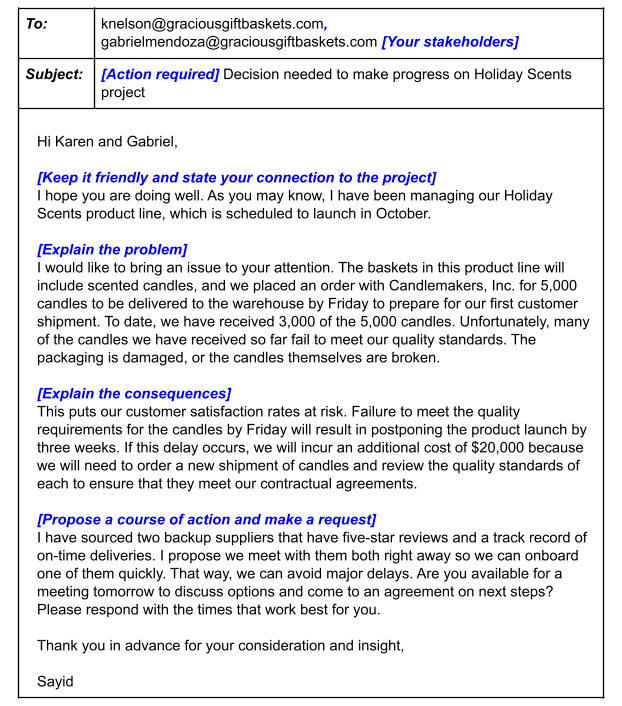

# Ejecución del proyecto: Ejecutar el proyecto

## Introduccion a la ejecucion de proyectos

### Seguimiento y medición del progreso del proyecto

#### La importancia del seguimiento

Una vez que comienza la fase de ejecución del proyecto, ¿cómo sabes que realmente se está haciendo el trabajo? Bueno, puedes
hacerlo de distintas maneras, pero sobre todo, puedes vigilar el progreso del proyecto a través del seguimiento y la medición.
En realidad, esto es una gran parte de la gestión de proyectos.

Por definición, el seguimiento es un método de controlar el progreso de las actividades de un proyecto. Medir el desempeño
del proyecto habitualmente para identificar desviaciones del plan del proyecto puede ayudar a asegurar que el proyecto se
mantenga en marcha.

Una desviación es cualquier cosa que altere el curso de acción original. Las desviaciones del plan del proyecto pueden ser
positivas o negativas.

    ¿Te adelantas a lo previsto porque un problema técnico es menos complejo de lo que pensabas? Qué bien.
    ¿Un desastre natural cerró tu equipo de pruebas? Qué mal.

Ambos son ejemplos de desviaciones. También son ejemplos de por qué el seguimiento es una parte tan fundamental de tu papel
durante la fase de ejecución del proyecto.

Vamos a examinar algunas de las formas en que el seguimiento es beneficioso para el éxito de tu proyecto:

Para empezar, el seguimiento hace que la información clave del proyecto sea transparente, y la transparencia es esencial
para una toma de decisiones precisa. Incluso los gerentes de proyectos más fuertes toman malas decisiones cuando carecen
de información o contexto.

El seguimiento centraliza información del proyecto para que todo el mundo pueda entender el estado de cada parte del pro-
yecto, lo que puede ayudarte a identificar lagunas en tus conocimientos. Además, los proyectos tienen muchos detalles pe-
queños. Es difícil mantener todo como se planeó. El seguimiento ayuda a garantizar que no te arriesgues y olvides algo
importante.

El seguimiento ayuda a mantener a todo el equipo y a los interesados en contacto con los plazos y las metas. Para garantizar
que todos tengan visibilidad del progreso del proyecto, deberías tener un plan de proyecto que funcione tanto para ti como
para tu equipo. De esta manera, todos sabrán lo mismo sobre cómo avanza el proyecto.

El seguimiento también es fundamental para reconocer riesgos y problemas que pueden descarrilar tu progreso. Con un segui-
miento efectivo, serás capaz de identificar problemas de manera oportuna y trabajar con tu equipo para tomar una acción
correctiva. Cuando proporcionas visibilidad de las diversas partes del proyecto, el seguimiento te ayuda a ti y a tu equipo
a identificar y enfocarse en las áreas de riesgo.

El seguimiento ayuda a generar confianza en que el proyecto está planeado para entregarse a tiempo y dentro del alcance
y el presupuesto. Tener una imagen clara y actualizada del estado general del proyecto mantiene al equipo motivado y cen-
trado en mantener el rumbo.

Para recapitular, el seguimiento es importante por algunas razones clave, como la transparencia, la gestión de riesgos y
el mantenimiento del proyecto en marcha.

#### Elementos comunes para hacer un seguimiento

Bueno, hemos hablado sobre que el seguimiento controla el progreso de las actividades del proyecto. Sin embargo, es posible
que aún te preguntes, ¿a qué específicamente deberías hacerle un seguimiento? Ahora, analizaremos los elementos más comunes
para hacer seguimiento que considero útiles en la gestión de proyectos en Google.

Primero, siempre debes realizar un *seguimiento del cronograma del proyecto*. Esto se compone de tareas y actividades que
garantizan que el proyecto está efectivamente encaminado hacia su fecha de finalización. Después de todo, tu objetivo
final es cumplir con los entregables a tiempo.

Igual de importante es el *seguimiento del estado de los elementos de acción, las tareas clave y las actividades* para
garantizar que ese trabajo en verdad se esté haciendo. El seguimiento de las tareas también ayuda a controlar el progreso
de tu equipo hacia los hitos. Cuando estés en medio de un proyecto, surgirán nuevas tareas todo el tiempo. Para evitar no
poder cumplir con las entregas, es esencial realizar un seguimiento de las tareas mientras progresan y se acercan a los
hitos clave.

hacer *seguimiento de los costos* para garantizar que no gastes de más o de menos en las tareas del proyecto. Como mencioné
anteriormente, todos los proyectos tienen presupuestos, y ya sea que supervises o no todo el presupuesto, es posible que
supervises tareas y recursos que producen consecuencias en los presupuestos.

Por último, tendrás que realizar un *seguimiento de las decisiones clave, los cambios, las dependencias y los riesgos del*
*proyecto, incluidos los acordados en caso de cambios en el alcance*. De esta manera, tu equipo y los interesados sabrán
qué se debe hacer para que el proyecto triunfe.

Para resumir, los elementos que son útiles para hacer un seguimiento en toda la fase de ejecución del proyecto incluyen
el cronograma del proyecto, que contiene las tareas y actividades clave, el estado de los elementos de acción, el progreso
hacia los hitos, los costos y las decisiones y los cambios clave.

#### Diferentes métodos de seguimiento

El propósito de tu plan del proyecto es guiarte a través de la ejecución de tu proyecto. Por lo tanto, siempre incluirá,
al menos, un tipo de método de seguimiento y, a veces, podrías usar más de uno según las necesidades de tu equipo. Los
métodos de seguimiento que debatiremos son un diagrama de Gantt, una hoja de ruta y un diagrama de trabajo pendiente. El
tipo que elijas dependerá de lo que consideres adecuado para tu proyecto. Es importante recordar que debes seleccionar
algo que todo el equipo pueda entender, consultar y mantener actualizado fácilmente.

Quizás el método de seguimiento más común de todos es el *diagrama de Gantt*. Es una herramienta de eficacia probadas
para mantener tu proyecto en marcha. Un diagrama de Gantt mide las tareas contra el tiempo e incluye información útil,
como quién hará cada tarea y cuál debería ser el orden de las tareas. Por este motivo, *es un diagrama útil para mantener*
*el cronograma y para proyectos con muchas dependencias, tareas, actividades o hitos que dependen unos de otros.* También
es un diagrama útil para equipos con muchas personas porque la propiedad y las responsabilidades se presentan explícita-
mente de forma visual. A medida que haces un seguimiento y avanzas de manera secuencial en el tiempo, comienza a verse
como una cascada; es por eso que los diagramas de Gantt *se usan generalmente en la gestión de proyectos de Waterfall*.
Cada tarea está representada por una barra de progreso horizontal y la longitud de la barra depende de cuánto tiempo se
asigne a la tarea. Las barras se agrupan una sobre la otra para denotar que la tarea en la parte superior debe completarse
antes de que la siguiente se pueda completar. Los diagramas de Gantt suelen residir en tu plan de proyecto y se actualizan
con el progreso del proyecto.

*Las hojas de ruta* son otro método de seguimiento común usado aquí en Google. Una hoja de ruta es más *adecuada para cuando*
necesitas una forma de *hacer un seguimiento de los grandes hitos* de tu proyecto. Es útil para ilustrar a un equipo y a los
interesados clave cómo debe evolucionar un proyecto a lo largo del tiempo. Aquí hay un ejemplo:

una hoja de ruta puede incluir las metas de tu proyecto en la parte superior y una descripción del enfoque que nos ayudará
a cumplir esos objetivos. En este ejemplo, la meta es aumentar las ventas en línea de la empresa a consumidores en un 20%
interanual e incrementar las ventas de vacaciones a clientes existentes en un 8% respecto al año anterior. El enfoque detalla
las principales tácticas que tu equipo usará para alcanzar el objetivo. Una hoja de ruta también incluye un resumen del
proyecto de alto nivel. En este contexto, alto nivel significa un resumen conciso, por lo general de tres a cuatro oraciones,
para indicar claramente los objetivos y las prioridades de tu proyecto. Por debajo de los objetivos, el enfoque y el resumen
está la tabla que mapea lo que implicará el proceso. En este ejemplo, nuestra la tabla se divide en trimestres que reflejan
el cronograma del proyecto. Un trimestre es un período de tres meses en el calendario financiero de una empresa. Los hitos
clave se enumeran para cada trimestre. También hay tareas que cada miembro del equipo o departamento debe completar. La mayoría
de las tareas se pueden asignar a un hito programado para el mismo trimestre. En nuestro ejemplo, el proyecto en su conjunto
tiene un hito clave en el primer trimestre de finalizar el inventario para la temporada navideña. El trabajo de la prueba
del producto y la finalización de las sugerencias para las ofertas recaen principalmente en los equipos de marketing y ventas.
Sin embargo, a veces las tareas pueden tener que completarse antes para desbloquear a otro equipo o hito de futuros trimestres.
El equipo de producto e ingeniería trabaja en tareas del primer trimestre y el segundo trimestre que conducirán al lanzamiento
de la renovada tienda en línea en el tercer trimestre. Para alcanzar ese hito, cada departamento debe completar tareas específicas
y la hoja de ruta hace un seguimiento individual y del progreso del proyecto en cuanto a los hitos.

Un *diagrama de trabajo pendiente*, el más detallado de estos tres métodos de seguimiento. Un diagrama de trabajo pendiente
mide el tiempo en función de la cantidad de trabajo realizado y la cantidad de trabajo restante. Su función principal es
mantener al equipo del proyecto al tanto de las fechas de finalización previstas y que el equipo sea consciente del alcance
a medida que ocurre. Los diagramas de trabajo pendiente son los *más adecuados para proyectos que requieren una revisión*
*detallada y desglosada de cada tarea asociada con un proyecto*, y son geniales para proyectos en los que terminar a tiempo
es la máxima prioridad.

El eje y, o eje vertical, representa el número de tareas que quedan por ompletar, y el eje x, o eje horizontal, representa
el tiempo. Se realiza un seguimiento del progreso desde la esquina superior izquierda del diagrama. A medida que el proyecto
avanza, harás un seguimiento y trabajarás para conseguir cero tareas restantes, y a la derecha, trabajarás para cumplir
con la fecha de finalización. Suele haber una línea de puntos para lo que se espera o proyecta del progreso en función
del tiempo que tu equipo estima que llevará cerrar tareas, y una línea continua que representa tu progreso real.

Antes de seguir adelante con tu proyecto, tendrás que decidir qué sistema de seguimiento es más adecuado.

Si necesitas comunicar hitos a un gran equipo, podrías elegir una hoja de ruta.
Si tienes un proyecto con múltiples dependencias, podrías elegir un diagrama de Gantt.
Si el seguimiento de las tareas contra la fecha límite es especialmente importante, entonces el diagrama de trabajo pendiente
podría ser tu mejor opción.

Incluso puedes elegir usar más de uno. Debido a que el método de seguimiento será determinado por el tipo de proyecto en
el que estés trabajando, tus recursos y el alcance del proyecto, probablemente usarás varios tipos de métodos de seguimiento
en algún momento de tu carrera.​

#### Elegir el método de seguimiento adecuado para tu proyecto

Hasta ahora, has aprendido sobre la importancia de hacer un seguimiento del progreso del proyecto. También revisaste algunos
de los diferentes métodos de seguimiento usados por los gerentes de proyectos, como los planes de proyectos, los diagramas
de Gantt y de trabajo pendiente, y las hojas de ruta.

- Diagramas de Gantt

El diagrama de Gantt es uno de los métodos de seguimiento más populares y se puede usar para todo tipo de proyectos. Los
diagramas de Gantt suelen estar en el estatuto del proyecto y se actualizan a medida que el proyecto avanza.

Los diagramas de Gantt son útiles para lo siguiente:

    Ayudar a un equipo a cumplir con el cronograma

    Proyectos con muchas tareas, dependencias e hitos

    Proyectos con grandes equipos, porque la propiedad y las responsabilidades se establecen explícitamente de forma visual

Asana, una de las herramientas de software de gestión del trabajo incluida en esta certificación, tiene recursos útiles
para comenzar con los diagramas de Gantt.

[Diagramas de gantt]([https://](https://asana.com/es/resources/gantt-chart-basics))

- Hojas de ruta

Las hojas de ruta son otro método de seguimiento común. Al igual que los diagramas de Gantt, las hojas de ruta también
hacen un seguimiento del progreso individual y del proyecto para cumplir los hitos. Sin embargo, las hojas de ruta son más
adecuadas para realizar un seguimiento de los grandes hitos de tu proyecto.

Las hojas de ruta son útiles para lo siguiente:

    Seguimiento de alto nivel de grandes hitos. Las hojas de ruta describen el proyecto en su conjunto y proporcionan una
    imagen general de los puntos clave, al igual que un mapa de ruta real contiene puntos de interés y marcadores de
    millas.

    Demostrar a tu equipo o a los interesados clave cómo debe evolucionar un proyecto con el tiempo

Las hojas de ruta se pueden crear usando diferentes herramientas. Puedes crear una hoja de ruta en un documento de google
docs o Ms Word.

[Platillas de hojas de ruta]([https://](https://www.smartsheet.com/free-product-roadmap-templates-smartsheet))
[Conceptos]([https://](https://www.smartsheet.com/content/project-roadmap-templates))

- Diagramas de trabajo pendiente

Los equipos de Agile Scrum suelen usar los diagramas de trabajo pendiente. Los diagramas de trabajo pendiente revelan qué
tan rápido trabaja tu equipo, ya que muestran cuánto trabajo queda por hacer y cuánto tiempo queda para completarlo. Los
usos principales de un Gráfico de quemado son:

    Mantener al equipo del proyecto al tanto de las fechas de finalización objetivo
    
    Dar a conocer la corrupción del alcance si ocurrieran.

El diagrama debe mostrarse para que todos puedan verlo y actualizarse habitualmente para que sea eficaz. Los diagramas de
trabajo pendiente son útiles para lo siguiente:

    Proyectos que requieren una revisión detallada de las tareas

    Proyectos donde terminar a tiempo es la máxima prioridad

Un Gráfico de quemado te ayuda, como gerente de proyectos, a comprender cómo trabaja tu equipo y qué influye en su capacidad
para completar las tareas a tiempo. De esta manera, puedes abordar los inconvenientes de inmediato, antes de que se
conviertan en problemas importantes. También te ayudan a planificar de manera más eficiente para el próximo proyecto, ya
que identifica áreas potencialmente problemáticas.

[Trabajo pendiente en jira]([https://](https://www.atlassian.com/agile/tutorials/burndown-charts))
[Conceptos basicos]([https://](https://www.projectmanager.com/blog/burndown-chart-what-is-it))

#### Informes de estado del proyecto

Identificar y comparar varios tipos de métodos de seguimiento y cómo usarlos para hacer un seguimiento y comunicar los
elementos comunes del proyecto en una imagen.

- Componentes clave de un informe de estado del proyecto

Un informe de estado del proyecto ofrece una descripción general de todos los elementos comunes del proyecto y los resume
en una imagen. Es una herramienta de comunicación eficiente para transmitir el estado más reciente en un solo lugar para
el equipo y los interesados.

*La mayoría de los informes de estado contienen los siguientes componentes:*

*Nombre del proyecto:* El nombre del proyecto debe ser específico para el propósito del proyecto, de modo que el objetivo
general del proyecto se pueda entender de un vistazo.

*Fecha:* Crearás informes de estado del proyecto muchas veces durante el transcurso de la fase de implementación de un
proyecto. Los informes se pueden crear semanal o mensualmente; todo depende de las necesidades de los interesados y del
ritmo del proyecto. Agregar la fecha a cada informe de estado sirve como un punto de referencia para tu audiencia y también
crea un registro histórico del estado del proyecto a lo largo del tiempo.

*Resumen:* El resumen condensa los objetivos, el cronograma, los mejores y peores aspectos del proyecto en un lugar central
para facilitar la visibilidad de los interesados. Por lo general, la sección de resumen irá seguida del resumen del cronograma
y el estado general del proyecto o estará junto a ellos.

*Estado:* Como puedes imaginar, el estado es una pieza fundamental. El estado del proyecto ilustra tu progreso real frente a
tu progreso planificado. En la gestión de proyectos, una forma común de describir esto es a través de los informes de estado
RAV (rojo, ámbar, verde) o rojo-amarillo-verde. El informe RAV sigue un patrón de semáforo para indicar el progreso y el
estado.

    *El rojo* indica que hay problemas que necesitan una solución y que el proyecto puede retrasarse o exceder significa-
    tivamente el presupuesto.

    *El ámbar/amarillo* significa que hay posibles problemas con el cronograma o el presupuesto, pero que es probable que
    estos se resuelvan con acciones correctivas.

    *el verde* significa que el cronograma y el presupuesto van bien y que el proyecto va por buen camino.

Puedes usar el informe RAV para indicar el estado general del proyecto, así como el estado de los hitos. Cada equipo del
proyecto y los interesados pueden tener una perspectiva ligeramente diferente sobre lo que significan los colores y la
urgencia de escalar los problemas cuando ven un estado ámbar/amarillo o rojo, por lo que es importante asegurarse de que
todos entiendan lo que significan los diferentes estados de color para tu proyecto.

*Hitos y tareas:* Un resumen de los principales hitos del proyecto hasta el momento y las tareas actuales ayuda al equipo
y a los interesados a visualizar fácilmente el progreso de esos elementos. En un plan de proyecto, normalmente representarás
las tareas y los hitos como "no iniciados", "en curso" o "completados" en un nivel de elemento por elemento. Sin embargo, en
el informe de estado del proyecto, es común resumir estos elementos en dos categorías para comunicar mejor el estado. Usarás
los logros clave para detallar lo que ha sucedido y los futuros para detallar los grandes hitos que lograrás después.

*Problemas:* Los problemas incluyen los obstáculos actuales y los riesgos potenciales de tu proyecto. Los informes de estado
son una oportunidad importante para establecer expectativas con los interesados. Si el estado de tu proyecto es rojo o ámbar,
puedes destacar qué te impide estar donde planeabas estar. También puedes aprovechar esta oportunidad para indicar tu plan
para que el proyecto vuelva a ser de color verde y solicitar cualquier recurso o ayuda que puedas necesitar para hacerlo.

- Tipos de informes de estado del proyecto

Si tienes esos elementos clave en mente, puedes dar formato a tu informe de diversas formas según tu audiencia y lo que
necesitas comunicar.

Si necesitas compartir un informe de estado con tu equipo para un proyecto que contiene múltiples capas de complejidad,
puede ser mejor formatear el informe en una hoja de cálculo para realizar un seguimiento de todos los aspectos móviles.

Si simplemente necesitas comunicar actualizaciones a los interesados sénior, es mejor que tu informe de estado tenga un
ormato como una presentación de diapositivas que contiene solo una descripción general de los puntos más importantes.

- Conclusiones clave

En resumen, los informes de estado del proyecto son una herramienta poderosa para lograr lo siguiente:

    Mejorar y simplificar la comunicación en todo el equipo.

    Mantener informados a todos, incluidos los interesados clave.

    Solicitar más recursos y apoyo (si fuera necesario).

    Crear estructura y transparencia registrando el estado del proyecto en un lugar centralizado.

### Gestión de cambios, riesgos y dependencias

#### Por qué ocurren los riesgos y los cambios

Por qué los riesgos y los cambios podrían ocurrir durante un proyecto y cómo eso puede afectar el alcance del proyecto.
Un riesgo es un evento potencial que podría ocurrir y afectar tu proyecto. Cuando piensas en los riesgos en el contexto
de la gestión de proyectos, lo harás de forma hipotética. En otras palabras, estos podrían no ser eventos que sin dudas
sucederán, pero como existe la posibilidad de que ocurran, es tu responsabilidad como gerente de proyectos identificarlos
y hacer planes para enfrentar esos riesgos.

Algunos ejemplos de riesgos. Un riesgo para el proyecto puede ser que un contratista no cumpla con una fecha límite,
o introducir una herramienta que podría provocar una interrupción de la comunicación dentro de tu equipo, o un trabajo
inesperado adicional debido a la puesta en marcha de una política imprevista.

Cuando se presenta algún riesgo, la consecuencia es un cambio en el plan del proyecto. Un cambio es cualquier cosa que
altera o afecta las tareas, las estructuras o los procesos dentro de un proyecto. Los cambios suelen ser inesperados.
La mayoría de las veces, tienen un impacto negativo en el proyecto y tendrás que aprender a afrontarlos.

Sin embargo, a veces, y hago un énfasis especial en "a veces", los cambios pueden tener un impacto positivo. Los cambios
pueden abarcar cualquier variación del plan del proyecto original con respecto a la triple restricción. Esto puede implicar
cambios en las prioridades, el alcance, el presupuesto y los recursos, o cambios en el cronograma del proyecto. Las dependencias
internas y externas de un proyecto se afectan entre sí y provocan cambios.

Algunos tipos de cambios que pueden afectar tu proyecto. Algunos ejemplos de cambios pueden incluir:

*cambios en las dependencias o nuevas dependencias.* Las dependencias son tareas, actividades o hitos que dependen unas de
otras. Así que si una tarea no se completa a tiempo, podría atrasar el resto de las tareas. Podrías estar a cargo de las
renovaciones de una vivienda donde hay dependencias. Por ejemplo, en la remodelación del baño, no se puede instalar un
lavabo nuevo hasta que se coloquen el tocador y las tuberías. Lo siguiente es cambiar las prioridades. El alcance de la
remodelación cambia si los suegros de tu cliente de repente tienen que mudarse y tienes que adelantar el trabajo planificado
del dormitorio libre antes de completar la remodelación del baño. A continuación, la capacidad y las personas disponibles
podrían cambiar. Tal vez tengas que reemplazar el plomero porque tenías problemas en el sitio de trabajo.

*Otro tipo de cambio podría incluir una nueva limitación en tu presupuesto o recursos.* Por ejemplo, si necesitas reducir
los costos del diseño del baño nuevo en un 10% porque tu presupuesto para el trabajo eléctrico es más alto de lo esperado.

*Otro cambio podría ser la corrupción del alcance.* La corrupción del alcance se refiere a cuando los cambios, el crecimiento
y otros factores afectan el alcance del proyecto. Por ejemplo, tus clientes están tan contentos con los azulejos del baño
nuevo que les gustaría reemplazar los azulejos de todos sus baños.

Por último, *está la fuerza mayor.* Este es otro cambio que podría ocurrir debido a una crisis nacional o internacional. Si
no estás familiarizado con este término, significa una circunstancia imprevista que impide que alguien cumpla con el contrato
debido a una crisis grave. La fuerza mayor es poco común, pero, por ejemplo, si un sindicato se declara en huelga, ciertos
proveedores no podrán cumplir con sus contratos. Si hay una pandemia, toda la producción de tu nuevo producto podría detenerse.

Los cambios se deben medir en contra de las estimaciones del cronograma de alcance, el presupuesto y el tiempo asignadas para
tu proyecto, según los requisitos originales. Ten en cuenta que cuando cambies cualquiera de esas cosas, puede tener efectos
que pueden ser positivos o negativos. Por ejemplo, tus clientes pueden creer que tienen hermosos pisos de madera escondidos
debajo alfombra vieja de la sala y querer sacar la alfombra vieja y usar el piso original que está debajo. Tú, como gerente
de proyectos de este trabajo de construcción particular presupuestaste retirar la alfombra y lijar los pisos viejos y manchados.
Pero surgieron malas noticias. Levantas la alfombra y encuentras que los pisos están en mal estado y podridos. Tendrán que ser
reemplazados o reparados, lo que podría resultar costoso. Por lo tanto, tu cronograma y presupuesto probablemente se modifiquen.

Cuando se trata de quién asume la responsabilidad de gestionar el cambio, serás tú, el gerente de proyectos. Sin embargo, según
el proyecto, es probable que no lo hagas solo. Para gestionar los cambios de forma apropiada, querrás referirte a documentos
como tu Declaración de trabajo y el gráfico RACI. Sin embargo, es posible que también debas crear documentos nuevos. Querrás
crear o familiarizarte con los procesos para solicitar cambios para tu equipo u organización. Estos procesos pueden incluir un
formulario de solicitud de cambio.

*Los formularios de solicitud de cambios.* Tú y los interesados usarán estos formularios para estar preparados para cualquier
cambio y poder gestionarlo de manera adecuada. Dado que muchas personas con diferentes funciones en el proyecto pueden llenar
estos formularios, es importante que los formularios sean claros y muy completos. En la plantilla proporcionada, que contiene
una tabla de 2 por 10, tendrás que incluir información en las celdas, tales como:

    el nombre del proyecto,

    el propietario del debate,
    
    quién toma la iniciativa en este debate del equipo
    
    el tipo de debate. Querrás que el público sepa si están debatiendo un riesgo, una oportunidad o cualquier otra cosa.
    identificar a los equipos involucrados
    
    el resultado esperado del debate, lo que podría implicar un cambio en las prioridades, un cambio en el cronograma o una
    convocatoria oficial sobre cómo proceder con un problema.
    
    Agrega la fecha límite del debate
    
    identifica qué hitos o metas podrían verse afectados
    
    Proporciona una breve descripción de la situación actual, el cambio y cualquier diferencia esperada que se deba hacer en el
    plan de registro, como una imagen del antes y el después.

    profundiza la propuesta de los cambios necesarios y aborda cualquier compensación.
    
    proporciona cualquier información previa para que todos tengan el mismo contexto.

También puedes consultar tu declaración de trabajo, o SOW, para obtener más información sobre quién necesita participar en esa
conversación. Si notas que uno o más de tus hitos corren riesgo de no completarse, entonces necesitarás que el cliente lo
apruebe antes de que el alcance, la fecha límite o el presupuesto se modifiquen, y todos los involucrados deben estar
informados.

#### Identificación y seguimiento de las dependencias

las dependencias son uno de los factores más importantes de un proyecto, tanto internas como externas, pero, ¿qué son exactamente
las dependencias? *Las dependencias son los enlaces* que conectan una tarea del proyecto con otra y, como mencionamos, a menudo son
la mayor fuente de riesgo para un proyecto.

Es posible que dos o más tareas del proyecto tengan una relación entre sí en la que la finalización de una tarea dependa de la
iniciación de otra y viceversa. Piensa en estas tareas como una línea de dominós en la que una pieza cae sobre la otra, una por
una. Si una pieza cae, golpeará a la siguiente y así sucesivamente.

Por ejemplo, una empresa constructora puede tener varios trabajos en toda la ciudad. Cada proyecto requiere que el capataz y el
gerente de proyectos sean elegidos antes de firmar los requisitos, el cronograma y el presupuesto, y contratar a los empleados. No
elegirías un equipo y les dirías que se pongan a trabajar antes de que el trabajo haya sido claramente delimitado y se hayan firmado
los contratos. Ese es un ejemplo de una *dependencia interna*, que describe la relación entre dos tareas dentro del mismo proyecto.

Por otro lado, *las dependencias externas* se refieren a tareas que dependen de factores externos, como organismos reguladores u otros
proyectos. Por ejemplo, si una empresa de construcción debe demoler un sitio de construcción, tendrá que esperar hasta que el municipio
apruebe el proyecto. Las dependencias externas no siempre están bajo el control del gerente de proyectos, pero es importante conocerlas
para que el proyecto se mantenga en marcha.

*Las dependencias obligatorias* son tareas requeridas legal o contractualmente. Por ejemplo, cuando esa empresa de construcción finaliza
la demolición y comienza la construcción, primero tendrá que verter una base de hormigón y luego el municipio los inspeccionará para
asegurarse de que cumpla con sus normas antes de que la empresa pueda seguir construyendo.

Por último, el equipo del proyecto define las *dependencias discrecionales*. Estas son dependencias que pueden ocurrir por sí solas, pero
el equipo vio la necesidad de hacer que esas dependencias dependan unas de otras. Por ejemplo, la empresa constructora puede usar hormigón
de un proveedor nuevo y querer hacer una prueba, vertiendo una parte del hormigón para obtener una mejor estimación de la cantidad total
de producto necesaria para completar el trabajo, en lugar de comprar demasiado o muy poco producto por adelantado. La tarea de verter una
porción del hormigón es lo primero, porque el equipo necesita más información antes de tomar una decisión.

Un gerente de proyectos tiene que trabajar con diligencia para incorporar la gestión de la dependencia. La gestión de la dependencia es el
proceso de gestionar todas estas tareas y los recursos interrelacionados dentro del proyecto para garantizar que tu proyecto en general se
complete con éxito a tiempo y dentro del presupuesto. Para lograr una gestión eficaz de la dependencia, hay cuatro pasos importantes que un
gerente de proyectos puede tomar:

    Identificación adecuada,
    
    Registro de las dependencias,
    
    Control y monitoreo continuos,
    
    Comunicación eficiente.

El primer paso es la *identificación adecuada*. Un gerente de proyectos hará una lluvia de ideas sobre todas las posibles dependencias del
proyecto con su equipo y las clasificará en consecuencia.

El siguiente paso es *registrar las dependencias*. Una vez identificadas todas las dependencias, debe crearse un registro de riesgos. Un
registro de riesgos es una tabla o diagrama que contiene una lista de riesgos y dependencias. El registro de riesgos debe incluir una
descripción de la dependencia, la fecha y todas las actividades o tareas que pueden verse afectadas por la dependencia.

A continuación, el gerente de proyectos querrá hacer un *monitoreo y control continuos*. Esto significa que querrás programar reuniones
periódicas para verificar las tareas interrelacionadas, mantenerte actualizado sobre cualquier progreso realizado y verificar los cambios
que afectarán otras tareas.

El último paso es una *comunicación eficiente*. Mantener al equipo del proyecto y a los interesados actualizados puede ayudar a resolver
las dependencias y lograr que el proyecto esté encaminado.

#### Técnicas para ayudar a gestionar los riesgos

La gestión de riesgos es absolutamente fundamental para el éxito de un proyecto. La gestión de riesgos es el proceso de identificar
los riesgos potenciales y las cuestiones que podrían afectar un proyecto, luego evaluar y aplicar medidas para abordar los efectos de
los problemas y los riesgos identificados.

Una forma de gestionar riesgos y, con suerte, evitar que cualquier riesgo se materialice es centrarse en gestionar los cambios y las
dependencias, así como cualquier riesgo imprevisto en tu proyecto. Si puedes gestionar tanto los cambios como las dependencias y la
corrupción del alcance, otros tipos de riesgos se vuelven mucho más fáciles de gestionar.

    Si tus dependencias se logran a tiempo, es menos probable que tu equipo se atrase con el cronograma.

    Si el alcance está bien gestionado, es menos probable que se produzcan cambios en tu presupuesto o que te veas obligado a extender
    el cronograma.

*Una lluvia de ideas* con tu equipo es una de las técnicas más efectivas para identificar los riesgos de un proyecto. Es probable que tus
compañeros de equipo aporten habilidades y experiencia de proyectos anteriores, lo que puede ayudar a descubrir similitudes y evitar que
se repitan los problemas. Mientras hacemos una lluvia de ideas con nuestro equipo, lo mejor es crear un registro de riesgos.

Un *registro de riesgos* es una tabla o diagrama que contiene la lista de riesgos de tu equipo. Será buena idea hacer preguntas a tu equipo,
como qué podría mejorar el resultado del proyecto o qué podría perjudicarlo u obstaculizarlo. Haz una lista de todo como si fueran afirma-
ciones. Por ejemplo, si ocurre un evento determinado, así es como se ve afectado el proyecto. Para ayudar a priorizar los riesgos dentro
de tu registro de riesgos, puedes calcular tu exposición al riesgo. *La exposición al riesgo* es una forma de medir el potencial de pérdidas
futuras que se den como resultado de una actividad o un evento específicos. Un buen método para calcular la exposición al riesgo es construir
una matriz como esta:

Cuando desarrolles tu matriz, usarás dos variables: impacto del riesgo y probabilidad. Escribe "impacto del riesgo" en la parte superior, en
el eje horizontal, y "probabilidad" en el lateral, en el eje vertical. También, marca el alto, el medio y el bajo a lo largo de cada eje, en
la parte superior de izquierda a derecha y hacia abajo en el costado, porque así es como vas a diagramar la exposición al riesgo. Suma cada
riesgo al gráfico en la sección de la intersección del impacto que puede tener el riesgo en tu proyecto y la probabilidad o posibilidad de
que se produzca el riesgo. Esta es una técnica, pero en cualquier estrategia que uses para examinar tu exposición al riesgo, tus riesgos deberán
ser la prioridad para que tú y tu equipo sepan a cuáles deben prestar atención inmediata. Para cualquier cosa que tenga un gran impacto en tu
proyecto, incluso si tiene una baja probabilidad de que ocurra, asegúrate de tener un plan de mitigación en marcha. ¿Cómo manejarás este riesgo
si realmente se materializa? Si bien un registro de riesgos es una gran herramienta, es probable que surjan algunos riesgos imprevistos.

Es casi imposible dar cuenta de todos los riesgos en el transcurso de un proyecto. Ahí es donde la técnica ROAM puede ayudar. La técnica ROAM,
que significa resuelto, asignado, aceptado y mitigado, se usa para ayudar a gestionar acciones después de que surgen los riesgos. Una vez que
se presenta un riesgo, debes decidir qué hacer con él.

    Si el riesgo se eliminó y no será un problema, entra en la categoría de "resuelto".

    Si al miembro de un equipo se le asigna un cierto riesgo y se le confía que lo maneje, ese riesgo pasa a la categoría de "asignado" y se
    supervisa hasta su finalización.

    Si el riesgo fue "aceptado", se acordó que no se hará nada al respecto.

    Si se han tomado acciones y el riesgo se ha mitigado, ya sea reduciendo la probabilidad de que se produzca o el impacto en el proyecto, pasa
    a la categoría de "mitigado".

Después de que cada riesgo se coloca en una categoría, el equipo debatirá cada riesgo y decidirá cuál debe tener prioridad.

### Comunicar problemas a los interesados

#### Priorizar problemas

la responsabilidad del gerente de proyectos es resolver problemas y eliminar las restricciones que perjudican el éxito del
proyecto. Una forma de hacerlo es por elevación.

*La elevación* es el proceso de solicitar la ayuda de un líder o gerente de proyectos de nivel superior para eliminar un
obstáculo, aclararlo o reforzar las prioridades, y validar los siguientes pasos. Puede parecer que la elevación tenga una
connotación negativa, pero ese no es el caso en la gestión de proyectos. En la gestión de proyectos, la elevación debe
alentarse, usarse a menudo e incluso celebrarse. Las elevaciones son saludables y actúan como controles y herramientas de
balance para asegurar que se están tomando las medidas adecuadas. Pueden tener como resultado una toma de decisiones rápida
y, en general, cuanto antes se resuelva un problema, mejor será el proyecto. En lugar de ir y venir entre dos miembros del
equipo que no pueden ponerse de acuerdo, un tercero que sea objetivo podría ayudar a hacer la llamada y reducir las frustraciones
del equipo. Finalmente, las elevaciones fomentan la participación. Alentar a los demás a participar en la resolución o la
asignación de problemas puede promover la confianza y la responsabilidad compartida entre compañeros de equipo, que son signos
de un equipo sano y funcional.

Antes de empezar a trabajar en un proyecto, el gerente de proyectos, el equipo y el patrocinador del proyecto deben establecer
las normas y prácticas de elevación. Esto significa que especificarán a quién se le plantearán los problemas, cómo se plantearán
y el foro de debate. Un poco de trabajo inicial ayudará a que las elevaciones se ejecuten sin problemas si fueran necesarias.

¿cómo sabes cuándo hacer una elevación? Un gerente de proyectos debe elevar un problema ante la primera señal de problemas graves
en el proyecto. Los problemas graves son problemas que pueden causar:

    Un retraso a un hito importante del proyecto.
    
    Uroblemas que causan excesos en el presupuesto.
    
    Problemas que pueden provocar la pérdida de un cliente.
    
    Problemas que hacen aplazar la fecha estimada de finalización del proyecto.

Básicamente, cualquier cosa que afecte tu restricción triple, tiempo, presupuesto y alcance es algo que debería elevarse.
La elevación es ideal para prevenir dos problemas comunes dentro de un proyecto: *guerras de trincheras y malos compromisos*.

*Las guerras de trincheras* ocurren cuando dos pares o grupos no pueden llegar a un acuerdo y ninguna de las partes está
dispuesta a ceder.Esto lleva a una paralización del proyecto y, probablemente, provocará retrasos en ciertos aspectos del
progreso del proyecto.

Por lo general, pensamos en los *compromisos* como una forma positiva de resolver problemas, pero también existen malos
compromisos. Un mal compromiso ocurre cuando dos partes deciden una supuesta solución, pero el producto final igual sufre
consecuencias. Cuando se trata de comprometerse con los objetivos importantes del proyecto, no es productivo para ninguna de
las partes que simplemente se conformen porque es un medio para alcanzar un fin. Sí, comprometerse y al mismo tiempo mantener
los objetivos más grandes del proyecto en mente y trabajar para todo eso junto.

#### Comunicar cambios al equipo

Comunicar el cambio a los miembros del equipo del proyecto y los interesados no es solo una cuestión de mantener los documentos de
seguimiento actualizados. Incluso los cambios más pequeños serán significativos para alguien de tu equipo y deben ser comunicados,
También es cierto que tendrás que adaptar tus tácticas de comunicación según el tema y el destinatario.

Como gerente de proyectos, a veces vas a querer tener una reunión con todo tu equipo, mientras que otras veces un correo
electrónico puede ser suficiente. Personalmente, prefiero tomar un café rápido o tener una charla en el pasillo con mis compañeros
de equipo y luego hacer un seguimiento por correo electrónico que detalle en qué nos pusimos de acuerdo. Esto es particularmente
útil cuando necesitas un acuerdo rápido o si el tema es un poco delicado.

¿Cómo sabrás qué táctica de comunicación es adecuada? En última instancia, tendrás que usar tu propio juicio, pero aquí hay
algunas maneras con las que puedes decidir qué acción tomar. Como gerente de proyectos, cuando se comunica un pequeño cambio
que afectará a una persona, es una buena idea enviar un correo electrónico. Asegúrate de evitar temas emotivos o cualquier cosa
que necesite debatirse en profundidad. Solo avísales y coordina una reunión. Es posible que las reuniones semanales no sean
necesarias, en especial si tu agenda es acotada. Si estableces una reunión y luego decides no realizarla, puedes recurrir a un
correo electrónico o tratar el tema en un foro diferente.

Cuando haya un gran cambio dentro de tu proyecto que involucre a más de una persona y probablemente cambie el presupuesto, la
fecha límite o el alcance del proyecto, probablemente deberás tener una reunión con el equipo. Una táctica útil para mantener
en mente a la hora de analizar estos cambios en tu proyecto se denomina tiempo de espera. Un tiempo de espera significa tomar
distancia del proyecto para descansar, reagruparse y ajustar el plan de juego. Un tiempo de espera puede interrumpir de manera
temporal tu impulso, pero puede ser absolutamente necesario para prepararte para triunfar al final del proceso. Es posible que
desees un tiempo de espera cuando el cliente quiera redefinir el alcance del proyecto o si los miembros del equipo deben reasignarse
a otros proyectos y necesitas un plan para reemplazarlos. Este tiempo de espera es una oportunidad para que el equipo del proyecto
evalúe los cambios y pueda ajustar el plan según sea necesario.

Durante todo el proceso, quizás quieras mantener reuniones para debatir los éxitos, contratiempos y posibles mejoras en las
características del proyecto. Estas reuniones son denominadas retrospectivas. Las retrospectivas se realizan a lo largo del ciclo
de vida del proyecto. Una retrospectiva se centra en identificar las causas que contribuyeron a un incidente o patrón de incidentes
sin culpar a una sola persona. Cuando realices una retrospectiva, siempre debes suponer que todo el mundo tuvo buenas intenciones y
que hizo lo correcto con la información que tenía, ya sea que haya funcionado bien o no. Siempre hay una posibilidad de aprender y
hacerlo mejor. Como gerente de proyectos, es importante identificar técnicas efectivas de comunicar cambios a una persona del equipo
o a todo tu equipo.

#### Escribir un correo electrónico de elevación efectivo

*la elevación:* el proceso de obtener la ayuda de líderes o gerentes de proyectos de mayor nivel para eliminar un obstáculo, aclarar
o reforzar las prioridades y validar los próximos pasos.

- Prácticas recomendadas de elevación por correo electrónico

Tu función como gerente de proyectos es ayudar a resolver problemas y eliminar los obstáculos que impiden que tu equipo avance
hacia sus metas. Si bien muchos problemas pueden ser lo suficientemente pequeños como para resolverlos dentro del equipo principal,
es posible que otros, como un cambio importante en tu presupuesto o en el cronograma, deban presentarse a los interesados para
que tomen una decisión final. Detallar estos problemas, su posible impacto y el apoyo que necesitas en un correo electrónico
claro y directo a tu audiencia puede ser una herramienta de comunicación efectiva.

Correos electrónicos de elevación efectivos:

    Mantener un tono amistoso

      - Considera empezar tu correo electrónico con una simple muestra de buena voluntad, como “Espero que estén bien”.
      - Cuando describas el problema, busca un tono irreprochable.
      - mantén el correo electrónico amigable y profesional. Después de todo, estás pidiendo ayuda al destinatario.
      - Asegúrate de terminar el correo electrónico agradeciendo al destinatario por su tiempo.

    Indicar tu conexión con el proyecto

      - Preséntate al comienzo del mensaje si tienes menos confianza con los interesados del proyecto.
      - Asegúrate de indicar claramentetu nombre, función y relación con el proyecto. Esto ayuda al lector a entender por qué te
        estás comunicando.
      - Mantén tu introducción breve y al grano; una sola oración debería ser suficiente.
      - Si conoces a la persona que recibe la elevación por correo electrónico, simplemente puedes reforzar tu responsabilidad en
        el proyecto antes de abordar directamente el problema.

    Explicar el problema

      - Una vez que saludes al destinatario y te presentes brevemente, explica el problema en cuestión.
      - Indica claramente el problema que necesitas resolver.
      - Proporciona el contexto suficiente para que el lector comprenda el problema.
      - trata de mantener el mensaje lo más conciso posible.
      - Evita los párrafos largos y confusos que pueden ocultar tu mensaje y tentar al lector a omitirlos.

    Explicar las consecuencias

      - Después de explicar el problema, describe claramente las consecuencias.
      - Describe específicamente cómo este problema está afectando gravemente al proyecto o cómo tiene el potencial de afectarlo gravemente
        más adelante en el cronograma del proyecto.
      - De nuevo, mantén tu explicación concisa y tu tono amigable.

    Proponer un curso de acción y hacer una solicitud

      - Propones una solución (o soluciones) e indicas lo que necesitas del destinatario.
      - Una solución bien pensada acompañada de una solicitud clara permite al destinatario saber cómo puede ayudarte y te lleva a una resolución.

- Reunir todos los elementos

Veamos cómo se combinan estas buenas prácticas para crear una elevación por correo electrónico sólida.

Conclusión clave:

En resumen, los correos electrónicos de elevación efectivos aplican estas cinco prácticas recomendadas:

    Mantener un tono amistoso

    Indicar tu conexión con el proyecto

    Explicar el problema

    Explicar las consecuencias

    Hacer una solicitud

La elevación es una habilidad útil para resolver problemas rápidamente, y enviar una elevación por correo electrónico sólida
que aplique estas prácticas recomendadas puede ayudar a que tu equipo reciba la ayuda necesaria.

## Gestión de calidad y mejora continua

### Comprender la gestión de calidad

#### Conceptos clave de la gestión de calidad

Al gestionar un proyecto, siempre tener en cuenta la limitación triple: tiempo, alcance y presupuesto. Cada uno de estos tres
elementos afectará al proyecto; un problema con alguno de ellos es un problema para la calidad general del proyecto.

Hay una diferencia importante entre "calidad" y "realización". El simple hecho de terminar un proyecto no basta; el proyecto
debe cumplir con los estándares del cliente en cuanto a calidad más allá de su mera realización. Como en todos los aspectos de
la gestión de proyectos, cuanto más eficazmente te comuniques con tu equipo, más probable es que tu equipo ofrezca entregables
de alta calidad.

¿Cómo definimos la calidad en el marco de la gestión de proyectos? La calidad se logra al cumplir los requisitos indicados para
el entregable y satisfacer o superar las necesidades o expectativas de los clientes. Cuando se trata de calidad, es importante
entregar un producto o servicio que satisfaga las necesidades de los clientes. Para lograrlo, debes conocer conceptos importantes
de la gestión de calidad y supervisar la implementación de un plan de calidad para la gestión de proyectos.

Al prepararte para el éxito, debes considerar los cuatro conceptos principales de la gestión de calidad:

- Normas de calidad.

El proceso de calidad comienza con el establecimiento de las *normas de calidad*. Estas normas indican los requisitos, las
especificaciones o las directrices que pueden servir para garantizar que los productos, procesos o servicios permitan alcanzar
el resultado deseado.

Establece las normas de calidad junto con tu equipo y el cliente al comienzo del proyecto. Tómate el tiempo para definir las
normas de calidad y los criterios para el trabajo actual para que los miembros del equipo y los interesados comprendan exactamente
cuáles son. Después de establecer esas normas de calidad bien definidas, deberás hacer controles periódicos y asegurarte de que
todo se vea bien y se cumplan los requisitos.

Recuerda que definir bien las normas y los requisitos conduce a menos reelaboración y menos retrasos.

Examinemos esto a partir de un ejemplo, Eres gerente de proyectos en Office Green, una empresa que se especializa en plantas
decorativas para oficinas y otros negocios; conduces un proyecto llamado Plant Pals, un nuevo servicio que ofrecerá plantas
para escritorio a los clientes más importantes. Aquí hay un ejemplo de algunas normas de calidad para este proyecto:

Normas de confiabilidad: Cada maceta llega a la hora convenida y en buenas condiciones, lista para colocarla sobre un escritorio,
Los proveedores tienen suficientes plantas en sus almacenes para satisfacer la demanda del cliente a tiempo.

Normas de usabilidad: Las plantas no causarán reacciones alérgicas ni enfermedades a los clientes y serán aptas para todas las
personas y los animales.

Del mismo modo, puedes tener normas del producto: El proveedor debe cumplir con el aspecto y estilo de tu marca, usar los
materiales especificados y entregar el producto intacto. Debe adherirse a las normas de calidad para todos los productos
y procesos. Por ejemplo, puedes implementar normas de usabilidad en el proceso de desarrollo del sitio web indicando que el
sitio web debe ser fácil de navegar, ya sea desde un teléfono, computadora o tableta.

- Planificación de calidad.

El siguiente paso: *la planificación de calidad*, se trata específicamente de las acciones de un gerente de proyectos o el equipo
para establecer y realizar un proceso tendiente a identificar y determinar exactamente qué normas de calidad en verdad se
corresponden con el proyecto en su conjunto y cómo cumplirlas. Para llevar adelante esta conversación, pregúntate lo siguiente:

    "¿Qué resultado esperan mis clientes al final de este proyecto?
    ¿En qué se refleja la calidad según ellos?
    ¿Cómo puedo cumplir sus expectativas?
    ¿Cómo determino si las medidas de calidad nos llevarán al éxito del proyecto?".

Aquí es donde planificarás los procedimientos para cumplir las normas de calidad. Recuerda que una norma de calidad del proyecto
Plant Pals es la confiabilidad, la expectativa de que cada planta llegue a la hora convenida y en buenas condiciones. Por lo tanto,
como medida de planificación de calidad, tendrás que hacer planes con tu proveedor de plantas para comprobar la durabilidad de las
macetas antes de decidir utilizarlas.

- Garantía de calidad.

El tercer concepto de la gestión de calidad es *la garantía de calidad*, a menudo abreviada como QA, consiste en evaluar si el proyecto
avanza hacia la entrega de un servicio o producto de alta calidad. A diferencia de las normas y la planificación de calidad, la QA
abarca el ciclo de vida del proyecto en su totalidad en lugar de ocurrir en una fase específica. El plan de calidad debe incluir
auditorías periódicas para confirmar que todo procede conforme al plan y se siguen los procedimientos necesarios.

Hacer controles regulares e informar a los interesados ayuda a aumentar su confianza y la tuya también. La garantía de
calidad es donde te aseguras de que tú y tus clientes obtienen el producto exacto que acordaron.

En el proyecto de Plant Pals, aquí es donde el equipo evaluará las opciones de macetas y tal vez realice pruebas de durabilidad. Si
planificas que el proveedor de plantas realice las pruebas de durabilidad por su cuenta, asegúrate de supervisar su progreso y hacer
controles periódicos.

- Control de calidad.

El concepto final de la gestión de calidad es el *control de calidad, a menudo abreviado como QC*. Aquí, se usan técnicas para
cumplir las normas de calidad al identificar un problema o si el plan de calidad no se ejecuta de la manera deseada y hay
que realizar acciones correctivas.

El control de calidad implica supervisar los resultados y la entrega del proyecto para determinar si se logran los resultados
deseados o no. Si no se logran, hay que realizar acciones alternativas. El control de calidad también es fundamental para
allanar el camino para el próximo proyecto.

Después de colocar las plantas en todas las oficinas de los clientes, el control de calidad podría ser que tú o un miembro
del equipo haga un recorrido final por las oficinas donde se entregaron las plantas. Así, controlarías si hay macetas o
plantas rotas que se dañaron al llevarlas y las cambiarías en caso de que fuera necesario. No puedes hacer esto con cada
cliente, pero es una buena idea hacerlo al comienzo, por si acaso detectas cuestiones que puedas mejorar cuando vuelvas
a la oficina.

Si te atienes al plan de calidad, lo que implica comprobar la calidad a lo largo del ciclo de vida del proyecto (QA) y, por
supuesto, corregir según sea necesario (QC), la probabilidad de cumplir las normas de calidad es alta, lo que permite un
entregable de alta calidad al final del proyecto que satisface los objetivos de tu organización y supera las expectativas del
cliente.

#### Resumen: Conceptos de la gestión de calidad

En resumen los 4 pilares de la gestion de calidad en proyectos son:

    Las normas de calidad ofrecen requisitos, especificaciones o pautas que se pueden utilizar para garantizar que los productos, procesos o servicios sean adecuados para lograr el resultado deseado. Estas normas deben cumplirse para que la organización y el cliente consideren exitoso el producto, proceso o servicio. Establecerás las normas de calidad con tu equipo y el cliente al comienzo del proyecto. Las normas bien definidas conducen a que haya menos reelaboración y menos retrasos de programación a lo largo del proyecto.

    La planificación de calidad comprende tus acciones o las de tu equipo para establecer y realizar un proceso tendiente a identificar y determinar exactamente qué estándares de calidad son relevantes para el proyecto en su conjunto y cómo satisfacerlos. Durante este proceso, planificarás los procedimientos para cumplir con las normas de calidad del proyecto.

    La garantía de calidad, o QA, es un proceso de revisión que evalúa si el proyecto avanza hacia la entrega de un servicio o producto de alta calidad. Incluye auditorías periódicas para confirmar que todo procede conforme al plan y que se siguen los procedimientos necesarios. La garantía de calidad te ayuda a asegurarte de que tú y tus clientes obtengan el producto exacto que acordaron.

    El control de calidad, o QC, implica controlar los resultados y la entrega del proyecto para determinar si se alcanzan los objetivos deseados. Incluye las técnicas que se utilizan para garantizar que se mantengan las normas de calidad cuando se identifica un problema. El control de calidad es un subconjunto de las actividades de garantía de calidad. La QA busca prevenir los defectos antes de que ocurran, mientras que el QC tiene como objetivo identificar los defectos después de que hayan ocurrido y también implica tomar medidas correctivas para resolver estos problemas.

#### Fomentar las relaciones con los clientes mediante habilidades comunicativas

La comunicación comienza aun antes que el proyecto y continúa de forma constante durante el resto del proyecto. las habilidades
interpersonales, como negociar, entregar mensajes con empatía y preguntar para aclarar dudas ayuda a fomentar y fortalecer
la comunicación, También así las opiniones como base de iteración de un producto.

Según el Instituto de Gestión de Proyectos, se descubrió que la mayoría de los proyectos padecen algún tipo de ruptura
comunicacional, aunque los gerentes de proyectos trabajen cerca del 90% de su tiempo exclusivamente en la comunicación. Lo
mejor para el gerente de proyectos es comunicarse con tacto, no solo con los miembros de su organización, sino también con
los clientes y proveedores. Cuando es eficaz la comunicación estratégica con un cliente común o profesional puede inculcar
una sensación de confianza en que haces un buen trabajo y eres un socio de confianza.

¿Cómo debería un gerente de proyecto abordar la comunicación con el cliente? El uso de habilidades interpersonales, como
negociación, escucha empática y creación de confianza, ayudará a generar una buena relación entre tú y tus clientes, y un
buen gerente de proyectos sabe cómo y cuándo aplicar estas habilidades.

Una práctica clave para la negociación, la escucha empática y la creación de confianza es hacer preguntas. Es importante
hacer preguntas abiertas y escuchar activamente para entender el estado actual del cliente comparado a su estado deseado
y qué podría ayudarlo a pasar de uno al otro. Si haces preguntas abiertas, descubrirás en qué puntos puedes hacer que los
clientes se sientan más seguros. Podrás negociar para garantizar la satisfacción de tus necesidades y la creación de la
confianza necesaria para tener una asociación exitosa.

Los gerentes de proyectos eficaces fijan expectativas claras sobre cuándo comunicarán ciertas cuestiones a los clientes. Por
ejemplo, podrías fijar la expectativa de que brindarás actualizaciones de progreso semanales para mantener a los clientes
informados en lugar de esperar que acudan a ti con preguntas. Al solucionar un problema con el producto, posiblemente no sea
necesario notificar al cliente un problema que no afectará el resultado.

Supongamos que un diseñador del equipo renuncia y tienes que reemplazarlo; podrías reemplazar a ese diseñador por uno nuevo
rápidamente y sin perder un ápice del progreso del proyecto. Puedes completar la tarea sin causar al cliente ninguna preocupación
adicional. El nivel de visibilidad entre los clientes comunes y profesionales de un proyecto puede variar, y tendrás que usar
tu criterio sobre aquello que es importante comunicar a tu cliente.

A veces, querrás decirle al cliente si surge algún problema. Si llegas a un punto del proyecto donde no puedes seguir
adelante sin su ayuda y opiniones, tendrás que comunicarle el problema con calma y empatía.

Veámoslo en el contexto del proyecto Plant Pals, si abordáramos un problema de macetas rotas. Tal vez al articular las
normas de calidad, dejamos un margen para un error del proveedor y contemplamos algunas macetas rotas. Digamos que resolvimos
que el número aceptable de macetas rotas era de dos cada 50. Pero imaginemos que el cliente recibió un envío y había cinco
macetas rotas. En ese momento, necesitaremos reunirnos con el cliente y hacer preguntas de negociación importantes. Tendremos
que decidir si las cinco macetas rotas de 50 son un resultado aceptable o tendremos que discutir si el cliente consideraría
invertir en macetas de mejor calidad con menor probabilidad de que se rompan. Una solución como el uso de macetas más
resistentes afectará el presupuesto y tendrá que ajustarse en consecuencia. ¿El cliente acepta ese cambio? ¿Eso llevaría
a un nuevo acuerdo?.

Si tienes en cuenta que el objetivo principal es la satisfacción del cliente durante todo el proceso de negociación, querrás
ser considerado en cuanto a sus sentimientos y limitaciones. Puedes hacerlo demostrando empatía: entender sus frustraciones,
abordarlas y encontrar una solución que sea beneficiosa para ambos. Posiblemente hayas tenido en el pasado la función de tratar
con clientes, ya sea en un centro de llamadas, como asociado minorista, al trabajar en un restaurante o en una variedad
de puestos. Incluso si no la tuviste, probablemente hayas tenido que defenderte a ti mismo al conversar con un representante
de servicio al cliente. En virtud de ello, seguro sabes apreciar cuando hay un buen servicio al cliente. Un buen servicio
al cliente te hace volver a la misma peluquería, panadería o cafetería porque te gusta cómo te trataron y el servicio que
recibiste (aunque hayas tenido algún problema), a diferencia de los lugares donde eliges no volver por no haber recibido
ese nivel de atención.

Las experiencias pasadas te enseñan a gestionar las relaciones y a evitar entregar algo que es de baja calidad. No se
siente muy bien cuando eres tú el que lo recibe. Para obtener mejores resultados en proyectos futuros, debes escuchar la
opinión de los clientes. A veces, esa opinión llegará durante el proceso y, a veces, una vez que el proyecto haya finalizado,
según cómo lo hayas planeado en la fase de iniciación. La cuestión de cuándo recibes las opiniones puede conducirte a lo
que realmente quieres lograr en tu proyecto. Si tu empresa lanza un sitio de comercio electrónico, las opiniones de los
usuarios te permitirán hacer ajustes para optimizar la experiencia de compra de los clientes. Si tu empresa es un servicio
de entrega de cookies por solicitud, posiblemente quieras entregar las cookies y luego recibir opiniones de los usuarios
para conocer su reacción acerca de las cookies y la experiencia de entrega en su conjunto.

Las opiniones de los usuarios ayudan a cerrar cualquier brecha y a acercar las expectativas del cliente y las necesidades
del proyecto.

#### Medir la satisfacción del cliente

Si el objetivo final del proyecto es tener un producto o servicio de gran calidad tanto para la organización como para
nuestro cliente, necesitamos hacernos una idea de lo que él desea.

La mejor manera de saber lo que desean los clientes y usuarios es preguntarles, pero no se trata de llamar por teléfono a
cada uno y literalmente preguntarle. Esa podría no ser la mejor forma de usar nuestro tiempo. Afortunadamente, hay algunas
formas de racionalizar esa información. Podemos realizar una serie de encuestas o pruebas con los clientes y usuarios. Suelen
usarse encuestas de opinión y pruebas de aceptación de los usuarios.

Comencemos con las *encuestas de opinión*. Son encuestas en las que los usuarios opinan sobre las características del producto
que les gustan o no. Estas encuestas se pueden realizar mientras diseñas, antes del lanzamiento, para saber si la gente
entiende el producto y si les gusta, o bien después del lanzamiento, para garantizar que la experiencia del usuario es aún
más satisfactoria, entonces, los usuarios participan en una encuesta y te dan su opinión sobre qué característica les gusta
o no y, potencialmente, qué aspectos les parecen bastante intuitivos y qué aspectos son un poco más difíciles de navegar. A
partir de esas opiniones, estarás listo para lanzarlo, si aún no lo has hecho, o darás marcha atrás para iterar el producto
si ya está en el mercado.

Alternativamente, puedes realizar *pruebas de aceptación del usuario*. En sentido amplio, una prueba de aceptación del
usuario, o UAT, permite que una empresa se asegure de que el producto o solución funciona para los usuarios. Una UAT debe
cumplir con los requisitos acordados y entregar los resultados esperados. Normalmente, se la utiliza para evaluar de principio
a fin la experiencia del usuario con un nuevo proceso o producto. La UAT es demasiado importante porque se realiza cerca
del final del desarrollo del producto y, por lo tanto, es una prueba general de la experiencia del usuario y del producto,
software o servicio completo. Las UAT a veces se conocen como "pruebas beta". Averigüemos qué aspecto podría tener una agenda
de UAT. En un entorno típico de UAT, das la bienvenida a tus usuarios y les agradeces por participar. Luego, les presentas
el producto. Esto incluye discutir pautas de prueba y demostrar cómo funciona el producto. A continuación, comienzas con los
casos de la prueba de UAT, que conducen a la audiencia por recorridos críticos para el usuario.

*Un recorrido crítico* para el usuario es una secuencia de pasos que este sigue para completar tareas en el producto. Al
presentar algo que has creado, debes dar a los usuarios una representación visual o maqueta del producto o hacerles una
demostración. Por ejemplo, si trabajas en un proyecto basado en la construcción y deseas reemplazar los electrodomésticos
y las instalaciones en el hogar, querrás darle al usuario algún tipo de visión de lo que eso podría implicar. Podrían ser
modelos 3D, planos digitales, muestras y mucho más. Tu demostración de UAT debe propender a un llamado a la acción. Por
ejemplo, el llamado a la acción para el proyecto puede ser la necesidad de probar las instalaciones en el futuro hogar
del cliente. Quizás los propietarios solicitaron un lavavajillas que se pudiera abrir y cerrar con muy poca fuerza y que
no hiciera demasiado ruido. En ese caso, querrás ofrecer al cliente escenarios de la vida real sobre los cuales trabajar.
Pídele que cargue los platos e inicie el ciclo de lavado. Luego haz preguntas como: "En una escala de uno a 10, ¿cuánta
fuerza hizo para abrir y cerrar el lavavajillas?". Esto permite determinar si la lavadora cumple sus expectativas.

Durante tu presentación y el recorrido de la UAT, deberías recopilar opiniones de los usuarios sobre su experiencia
general. Durante esta parte de las pruebas, los usuarios pueden ayudarte a identificar casos extremos. Los casos extremos
son raros: valores atípicos que los requisitos originales no tenían en cuenta. Se ocupan de los extremos máximos y mínimos
de los parámetros. Por ejemplo, imagina que creaste una aplicación que permite subir fotos sin límite, basado en que los
usuarios rara vez suben más de 1000 fotos en una sola sesión. ¿Cómo reaccionará el sistema ante alguien que sí sube miles,
o millones, de fotos en una sola carga? Es poco probable, pero podría ser desastroso para el software.

Después de identificar casos extremos, el último paso de la agenda de la UAT es recapitular los hallazgos, identificar
errores o problemas y priorizar qué problemas deben abordarse primero. Cuando hayas abordado el problema y determinado
los pasos por seguir, podrás cerrar y concluir las pruebas de aceptación del usuario.

#### Garantizar accesibilidad durante la recepción de comentarios

Primero, si recopilas opiniones con entrevistas en tiempo real, asegúrate de incluir distintos tipos de adaptaciones en tu
correspondencia cuando organices las sesiones. Quizá te pidan subtítulos en tiempo real o la presencia de un intérprete. Otras
personas que quizá sufren de ansiedad o están dentro del espectro autista pueden pedir las preguntas por adelantado así
tienen tiempo de pensar y preparar sus respuestas. Recuerda que lo que funciona con una persona quizá no funciona con otra,
incluso si ambas personas tienen la misma discapacidad.

Si estás llevando a cabo una entrevista cara a cara, examina el espacio teniendo en mente la accesibilidad, por ejemplo,
garantiza que haya un camino accesible al edificio y al salón, y que los pasillos estén libres para que alguien en silla
de ruedas o un andador pueda pasar sin problemas, o alguien con discapacidad visual pueda moverse con seguridad.

Si envías una encuesta o recopilas opiniones usando tecnología, corrobora que los sistemas que usas sean ciento por ciento
accesibles. Si no lo sabes con certeza, contacta al titular del sistema y pregunta si cumplen con las últimas pautas de
accesibilidad del contenido web o WCAG. Prepárate para hacer preguntas y recopilar respuestas de otra forma si es necesario.

Además de recopilar opiniones, como gerente de proyectos, es importante que facilites la accesibilidad de la conversación
desde el principio, en especial si tu proyecto tiene que ver con un proceso o un producto. A menudo, se pasan por alto las
funciones de accesibilidad de un producto o se dejan para el final del proyecto. Esto puede tener consecuencias serias, como
retrasos en el lanzamiento o, peor aún, un producto que cierto porcentaje de la población no puede utilizar.

Asegúrate de que los desarrolladores conozcan los requisitos de accesibilidad desde el comienzo. Si no los conocen, ponlos
en contacto con los recursos o expertos adecuados. Incluye testers con distintas discapacidades en tus pruebas de usabilidad
cada vez que puedas y, al menos, evalúa si el producto cumple con las pautas de accesibilidad.

En síntesis, piensa desde el principio y a menudo en la accesibilidad, y anima a otros miembros del equipo del proyecto a
que también lo hagan.

#### Pruebas de aceptación del usuario: Objetivos, prácticas recomendadas y gestión

- Los objetivos de la UAT

En resumen, la UAT es una prueba que ayuda a una empresa a asegurarse de que un producto, servicio o proceso funcione para
sus usuarios. Los principales objetivos de la UAT son:

    Demostrar que el producto, servicio o proceso se comporta de la manera esperada en escenarios del mundo real.

    Mostrar que el producto, servicio o proceso funciona según lo previsto.

    Identificar los problemas que deben abordarse antes de considerar que el proyecto está completo.

La UAT simula las condiciones del mundo real; entonces, cuando la función logra el desempeño previsto durante el proceso
de prueba, puedes estar más seguro de que el producto, servicio o proceso funcionará correctamente una vez que se lance,
permite a un equipo de proyecto recopilar información detallada sobre cómo los usuarios interactúan con un producto,
servicio o proceso.

La UAT ayuda al equipo a responder preguntas tales como:

    ¿Los usuarios reconocen la finalidad y los usos?
    ¿Cómo interactúan con él?
    ¿Cuánto tiempo los usuarios interactúan con él?
    ¿Advierten todas sus funciones?
    ¿El producto, servicio o proceso es accesible para todos?

La UAT también permite al equipo del proyecto registrar información sobre cómo los usuarios perciben su experiencia con
el producto, servicio o proceso. A través de las pruebas, el equipo puede conocer las emociones que causa, las identidades
que transmite, el atractivo que tiene, etc.

- Mejores prácticas para una UAT eficaz

Para lograr estos objetivos, la UAT debe llevarse a cabo con cuidado. Estas prácticas recomendadas pueden ayudarte a
administrar una UAT eficaz:

    Define y anota tus criterios de aceptación. Los criterios de aceptación son normas o requisitos preestablecidos que
    debe cumplir un producto, servicio o proceso. Anota estos requisitos para cada elemento que desees probar. Por ejemplo,
    si tu proyecto es crear un nuevo manual del empleado para tu pequeña empresa, puedes establecer criterios de aceptación
    para que el manual sea un PDF digital al que se pueda acceder en dispositivos móviles y de escritorio.

    Crea los casos de prueba para cada elemento que sometas a prueba. Un caso de prueba es una secuencia de pasos y sus
    resultados esperados. Suele constar de una serie de acciones que el usuario puede realizar para averiguar si el
    producto, servicio o proceso se comportó como se suponía. Continuando con el ejemplo del manual del empleado, puedes
    crear un proceso de caso de prueba en el que el usuario haga clic para descargar el PDF del manual en su dispositivo
    móvil o computadora de escritorio para asegurarse de poder acceder a él sin problemas.

    Selecciona a tus usuarios con cuidado. Es importante elegir usuarios que realmente sean los usuarios finales del producto
    servicio o proceso.

    Escribe los guiones de la UAT en función de las historias de los usuarios. Estos guiones se entregarán a los usuarios
    durante el proceso de prueba. La historia de usuario es una explicación general e informal de una función redactada
    desde la perspectiva del usuario final. En nuestro ejemplo del manual del empleado, una historia de usuario podría
    ser: "Como empleado nuevo, quiero poder usar el manual para encontrar fácilmente la política de vacaciones y compartirla
    con mi equipo por correo electrónico".

    Comunícate con los usuarios y hazles saber qué pueden esperar. Si puedes preparar a los usuarios con anticipación,
    habrá menos preguntas, problemas o retrasos durante el proceso de prueba.

    Prepara el entorno de prueba para la UAT. Asegúrate de que los usuarios tengan las credenciales y acceso adecuados y
    pruébalos con anticipación para asegurarte de que funcionan.

    Proporciona un plan paso a paso para guiar a los usuarios a través del proceso de prueba. Será útil para los usuarios
    contar con instrucciones claras y fáciles de seguir que ayudarán a dirigir su atención en las direcciones correctas. Puedes
    crear este plan en un documento digital o en una hoja de cálculo y compartirlo con ellos anticipadamente.

    Recopila notas en un solo documento y registra todos los problemas encontrados. Puedes crear una hoja de cálculo o
    documento digital que corresponda a tu plan. Puedes designar áreas donde hay que realizar un seguimiento de los problemas
    para cada elemento que se pruebe, incluidas las opiniones de los usuarios sobre la gravedad de cada problema. Esto te
    ayudará a priorizar las correcciones.

- Gestión de los comentarios de la UAT

Los usuarios opinan después de realizar la UAT. Sus opiniones pueden incluir comentarios positivos, informes de errores
y solicitudes de cambio. Como gerente de proyectos, puedes abordar los diferentes tipos de comentarios de la siguiente
manera:

Errores o problemas: Los usuarios pueden informar problemas técnicos, también conocidos como errores, u otros tipos de
problemas después de realizar la UAT. Puedes realizar un seguimiento y supervisar estos problemas en una hoja de cálculo
o sistema equivalente y priorizar los problemas que se deben corregir. Por ejemplo, los problemas críticos, como La
imposibilidad de acceder, descargar o buscar en el manual del empleado, deben priorizarse sobre los problemas no críticos,
como las opiniones sobre la portada del manual.

Solicitudes de cambio: A veces, el usuario puede sugerir cambios menores en el producto, el servicio o el proceso después
de la UAT. Este tipo de solicitudes o cambios también deben gestionarse y priorizarse. Según el tipo y la cantidad de
solicitudes, es posible que debas compartir estos datos con tus principales interesados y, además, ajustar el cronograma
del proyecto para implementar estas nuevas solicitudes.

Las pruebas de aceptación del usuario son una herramienta poderosa para garantizar que el resultado del proyecto sea el
buscado y tenga éxito. Asegúrate de dejar tiempo en el cronograma para las pruebas y soluciones de problemas pertinentes.

#### la importancia de comprender las necesidades del cliente

Un gerente del programa técnico es responsable de asegurarse de que el equipo cumpla con lo que se propone hacer. Esto
significa reunir muchas capacidades y entregables provenientes de muchos equipos para reunir un producto y entregarlo a
nuestros clientes.

Sin clientes, realmente no hay motivo para desarrollar ningún producto. Y lo que tiene de interesante desarrollar proyectos,
trabajar con clientes e intentar imaginarse lo que quieren es que te coloca en este lugar realmente único donde necesitas
ponerte en sus zapatos e imaginar el mundo o imaginar el producto a través de sus ojos. Al desempeñar una función de gestión
de proyectos, poder empatizar y entender cómo distintas personas en el mundo interactuarán con tu producto es realmente
importante y te da esta perspectiva increíble.

Entender las necesidades de los clientes es un trabajo muy difícil, pero es realmente importante. Creo que es una habilidad
que puedes desarrollar con el tiempo. De hecho, considero que un cliente es solo una especie de interesado. Me gusta tomar
a mis interesados y agruparlos en categorías, con lo que tengo clientes, que suelen ser los usuarios finales de un producto
o los que comprarán el producto. Y luego tengo interesados, que son los patrocinadores, es decir «las personas que financiarán
al equipo que está desarrollando el proyecto. Esos dos grupos de personas son muy diferentes, y me gusta tratar a un patrocinador
de una manera muy especial. Pretenden aumentar su retorno de la inversión, por lo que siempre debes buscar formas de
cuantificarlo:

¿cómo generas un retorno de esa inversión? Siempre hay un poco de temor respecto de que no van a recuperar el dinero que
invirtieron, y darles información con frecuencia y en el nivel correcto de detalle es una habilidad muy importante para
tener como gerente de proyectos. A veces puedes abrumarlos con demasiados detalles y no pueden ver todo el panorama, y a
veces no les das los detalles suficientes, y no confían en lo que les estás diciendo. De modo que lograr ese equilibrio
es muy importante.

Me gusta mucho ver un proyecto desde el principio hasta el final, y cuando en realidad puedes mostrárselo a un cliente y
obtener su aceptación y reconocimiento, y puedes ver su entusiasmo al ver el producto en funcionamiento; algo que, al empezar,
no había nada, solo ideas y quizás algunos documentos. Pero muchos meses más tarde, en realidad tienes un producto del que
puedes presumir.

### Buscar la mejora continua

#### Mejora continua y mejora de procesos

*La mejora continua* es un intento permanente de mejorar los productos o servicios. Ayuda a garantizar que un producto avance
regularmente hacia el mejor resultado posible. La mejora continua comienza con reconocer cuándo los procesos y las tareas
deben crearse, eliminarse o mejorarse. Luego, un gerente de proyectos debe planificar e implementar cambios para que el
proyecto siga en marcha.

Aquí es donde surge el proceso de mejora. *La mejora de los procesos* es la práctica de identificar, analizar y mejorar
los procesos existentes para aumentar el rendimiento del equipo y desarrollar las mejores prácticas u optimizar la experiencia
del consumidor. Al trabajar en las mejoras de procesos, la experimentación en un entorno controlado puede ayudarte a
entender si los cambios pensados resolverían el problema.

*El control* es un experimento u observación diseñado para minimizar los efectos de las variables. *Los grupos de control*
son muestras representativas que permiten determinar si las diferencias entre los grupos experimentales y la norma se debe
a tus cambios en lugar de otro factor, Eliminando explicaciones alternativas de tus resultados.

Por ejemplo, observas un problema con tu proceso y propones una hipótesis, que es una suposición fundamentada sobre su causa
y cómo lo resolverías. Luego, cambias una variable en el sistema sin modificar el grupo de control y vuelves a observar
los resultados.

Pongamos esto en el contexto del escenario del proyecto Plant Pal. La actividad de Office Green está en auge y la demanda
del nuevo servicio Plant Pal de tu equipo crece rápidamente. Para satisfacerla, los proveedores simplificaron el proceso
de embalaje mediante una caja de tamaño único para todas las plantas. Supongamos que usas un solo tamaño de caja para enviar
todas las plantas. Para plantas pequeñas, el espacio remanente se cubre con más relleno y normalmente llegan intactas. Pero
hay que meter a presión las grandes dentro de las cajas y a veces llegan dañadas, según indican las encuestas al cliente. Para
solucionar este problema, hipotetizas una solución posible en forma de pregunta. ¿Habrían llegado intactas más plantas grandes
si se hubieran enviado en cajas más grandes con el mismo relleno utilizado para las pequeñas? Aquí es donde interviene el
control. Sigues enviando la mitad de las plantas grandes en las cajas originales. Este es tu grupo de control. Y experimentas
al enviar la otra mitad en cajas más grandes. Las cajas no difieren en nada más que el tamaño. La forma, el grosor, el proveedor
de cajas, el destinatario de la entrega, absolutamente todo lo demás permanece igual. Una vez entregadas las plantas grandes,
realizas una nueva encuesta. Si más plantas grandes llegan intactas, se confirma tu hipótesis. Si los resultados son los
mismos que los anteriores al experimento, tendrás que probar otra solución para el problema de las plantas dañadas.

Trabajar en un entorno controlado no es la única forma de garantizar las mejoras continuas. Hay varios frameworks de mejora
basados en datos, como DMAMC y PHVA.

#### Frameworks de mejora basados en datos

frameworks de mejora basados en los datos. Los frameworks de mejora basados en los datos son técnicas utilizadas para tomar
decisiones basadas en datos reales. El primer framework de mejora basado en los datos que abordaremos puede resultarte familiar,
ya que lo discutimos en un curso anterior. Recuerda que D-M-A-M-C, o *DMAMC*, significa definir, medir, analizar, mejorar y
controlar; su función es planear cinco pasos que puedes dar al trabajar en pos de las mejoras continuas. Al considerar
cómo mejorar las experiencias de los clientes, comienza con lo siguiente:

definir el problema, los objetivos, recursos, el alcance y el cronograma del proyecto para la empresa.
mide. Aquí, recogerás métricas y datos de rendimiento con el fin de establecer bases de referencia y medir el éxito.
analiza. Trabaja para encontrar las causas raíz de los problemas y entender su impacto.
mejora. Esto significa implementar una solución al problema que sea razonable.
controla. Aquí es donde implementarás los cambios y te encargarás de supervisar los procesos actualizados que estableciste.

Otro framework que puedes utilizar al trabajar en las mejoras continuas es *PHVA*. PHVA es un proceso de cuatro pasos que
se centra en identificar un problema, resolverlo, evaluar si la solución tuvo éxito y perfeccionar la solución final. Los
pasos por seguir tienen este orden:

Planificar. Se trata de identificar el problema, su causa raíz y proponer soluciones.

Supongamos que un tipo de planta no se vende bien y, por lo tanto, el almacén está repleto de una misma especie. Si no
actúas con rapidez, las plantas pueden morir pronto. ¿Cuáles son algunas soluciones viables? Propones mover los artículos
de la parte inferior a la superior en la página de ventas del sitio web para que esas plantas queden a la vista. También
puedes hacer campañas de marketing por correo electrónico que contengan ofertas de dos por uno en la compra de esa planta.

Hacer, o resolver el problema.

En este caso, tu patrocinador decidió que no le agradaba regalar plantas que podrían aportarle ingresos. Has optado por
la primera opción: mover la planta a una parte más destacada del sitio web. Tu hipótesis es que la mejor manera de cambiar
el inventario más antiguo es colocarlo en un lugar que no pase inadvertido para los clientes.

Verificar. Compara los resultados con el fin de averiguar si se resolvió el problema.

Entonces, aguarda una semana y observa si aumentó el número de ventas de esa planta. Si así fue, tu hipótesis es correcta
y salvaste la vida de algunas plantas, lo que permitió a Office Green evitar pérdidas financieras.

Tanto PHVA como DMAMC son grandes frameworks de resolución de problemas para aplicar en la vida cotidiana y el lugar de
trabajo. Estos frameworks te ayudan a identificar problemas, reducir los errores y optimizar los procesos. Te animo a que
consideres estas técnicas la próxima vez que adviertas un problema o algún margen de mejora en un flujo de trabajo. Te
sorprenderá cómo un simple framework puede ayudar a organizarte para el éxito.

#### Diferenciar proyectos de programas

Los proyectos no son la única tarea en la que el gerente de proyectos puede participar. También hay programas y portfolios.

    El proyecto es una tarea que tiene un solo propósito
    el programa es un conjunto de proyectos
    el portfolio es el conjunto de proyectos y programas de toda la organización.

Piénsalo así: los proyectos pueden existir dentro de los programas, que a su vez pueden existir dentro de los portfolios.

Ten en cuenta que digo “pueden”, ya que no siempre es el caso. También pueden existir proyectos como iniciativas independientes,
sin vinculación. Pero si integran algo mayor dentro de la organización, los proyectos pueden convertirse en un programa.

Los éxitos colectivos e individuales de los tres se basan en las mejoras continuas. Entonces, ¿quiénes gestionan estas
tareas diversas e impulsan el éxito? Analicemos esto de forma organizacional y empecemos por el gerente de proyectos.

El gerente de proyectos supervisa los proyectos individuales y tiene entregables concretos a corto plazo. El gerente de
proyectos tiene a su cargo la mejora continua del proyecto que le asignaron.

El gerente del programa supervisa a los grupos de los proyectos e incluso a otros gerentes de proyectos y se centra en
objetivos comerciales a largo plazo. Este gerente del programa tiene a su cargo la mejora continua del conjunto de proyectos
que le asignaron.

Un gerente de portfolio supervisa un grupo de proyectos y programas y se encarga de la gestión centralizada de todos ellos,
tiene a su cargo la mejora continua de su conjunto asignado de proyectos y programas.

Las diferentes empresas pueden tener nombres apenas diferentes para estas funciones, pero el concepto es el mismo.

Vamos a examinar un ejemplo en el que estas funciones directamente crean una mejora continua para sus organizaciones. Un
gerente de proyectos ha decidido ofrecer capacitaciones interdepartamentales mensuales a los miembros de su equipo. Su
equipo es pequeño, así que consideró útil que las personas de otros departamentos entiendan su carga de trabajo y sus
procesos. De esta manera, si alguien está fuera de la oficina, siempre habrá cobertura. Después de un par de meses de estas
capacitaciones, el gerente de proyectos se da cuenta de que no solo mejoran los procesos de comunicación, sino que también
actúan como formadores de equipos sin advertirlo. Debido a las capacitaciones, los empleados tienen la oportunidad de
interactuar y llegar a conocerse mejor. El gerente de proyectos eleva esta información a su gerente del programa, y al
gerente del programa le encanta esta información inesperada. Ahora, el gerente del programa puede incorporar estos capacitadores
en todos los proyectos bajo su gestión, lo que lleva las mejoras continuas a todo el programa en lugar de solo al proyecto.

Entonces, ¿qué sería exactamente un proyecto, un programa y un portfolio en Office Green? Lograr que el servicio de Plant
Pals se lance y funcione es un proyecto. Es temporal y a corto plazo. Una vez que se lanza el servicio con éxito, elel
proyecto finaliza. Para lograr que el servicio funcione indefinidamente, es necesario que el proyecto se convierta en un
programa. El programa mediante el cual se lleva a cabo el servicio de Plant Pals se convierte en uno de los objetivos
comerciales a largo plazo de Office Green y la empresa trabajará en la mejora continua del programa. Ahora, Plant Pals,
junto a otros proyectos y programas de Office Green, se incorporan al portfolio de la empresa. Como las mejoras continuas
se llevan a cabo en el proyecto Plant Pals, el programa, los portfolios y Office Green notarán los beneficios.

Volvamos al ejemplo del exceso de existencias de las plantas del video anterior. Bueno, al implementar PHVA (planificar,
hacer, verificar, actuar), notas una caída de las ventas de una de las variedades de plantas. Entonces, decides reorganizar
el sitio web para destacar en la parte superior la especie que no se vende, con un pequeño descuento. Este cambio tiene
tanto éxito que se vuelve una buena práctica. De ahora en adelante, las variedades con rendimiento bajo o exceso de
existencias se destacarán en la parte superior del sitio web. Este es, de hecho, un proceso nuevo. Realizarlo una y otra
vez generará mejoras continuas. La mejora continua que hiciste en el proyecto se vio bien reflejada en el programa y el
portfolio ya que, ahora que se ha probado, se puede implementar la misma estrategia en toda la empresa y en el resto de
los sitios y productos, con reducción de las pérdidas y aumento de los ingresos en todos ellos. Si muchos o todos los
proyectos en Office Green evidencian la misma mejora, eso beneficia directamente al programa, que es el conjunto de lo
proyectos. Si la misma estrategia se aplica a los programas de Office Green, el portfolio se beneficiará directamente a
partir de indicadores de rentabilidad más sólidos.

### Uso de retrospectivas para el éxito del proyecto

#### El propósito de una retrospectiva

Una retrospectiva es un taller o reunión que da tiempo a los equipos para reflexionar sobre su proyecto. Las retrospectivas,
a veces conocidas como retros, deben hacerse durante todo el ciclo de vida del proyecto, pero suelen implementarse después
de los hitos más importantes o, más comúnmente, después de completar el proyecto, te brindan la oportunidad de hablar de
los éxitos y contratiempos que ocurrieron durante el proyecto o las fases. Puedes concebirlas como una forma de mejora de
procesos dentro del proyecto.

Las retrospectivas tienen tres objetivos principales:

En primer lugar, fomentan la formación de equipos, porque permiten a los miembros entender perspectivas diferentes dentro
de su equipo.

En segundo lugar, facilitan una mejor colaboración en proyectos futuros. En tercer lugar, promueven cambios positivos en
procedimientos y procesos futuros.

Vamos a detallar cada uno de ellos. Las retrospectivas son ideales para la formación de equipos, ya que permiten que los equipos se entiendan mejor entre sí y facilitan una mejor colaboración, lo que aumenta la productividad. Las retrospectivas enfatizan la mejora continua y el cambio, en lugar de reciclar hábitos, procedimientos y procesos antiguos que pueden ser dañinos. Las retrospectivas son útiles, ya que, aunque planifiquemos todos los riesgos posibles, lo más probable es que surja algo imprevisto. Cuando algo sale mal y necesitas reflexionar sobre ello con el equipo, te conviene realizar una retrospectiva. Algunas razones adicionales para hacerlo comprenden el incumplimiento de plazos o expectativas o una mala comunicación entre los interesados. También es posible que quieras realizar la retrospectiva al final de un sprint. Recuerda que sprint es una serie de tareas asignadas con el fin de cumplir un objetivo. También puedes realizar una retrospectiva tras el lanzamiento y los aterrizajes del producto. Todas estas son grandes oportunidades para registrar elecciones clave que otras personas pueden aprender al trabajar en sus propios proyectos. Identificar los obstáculos y éxitos en un proyecto ayuda a mejorar los procesos futuros, pero la forma en que decides realizar una retrospectiva puede variar. No existe exactamente una fórmula o plantilla para una retrospectiva productiva; la forma en que elijas estructurar tu retrospectiva dependerá de tu equipo y lugar de trabajo. Puedes decidir realizar una retrospectiva formal y presencial si el equipo prefiere intercambiar información en esas condiciones. Puedes incorporar notas adhesivas, documentos o cualquier otro tipo de herramientas físicas para ayudar al equipo a intercambiar información. O si adviertes que el equipo suele perder el rumbo en las reuniones presenciales, puedes decidir que una retrospectiva virtual o en línea es la mejor opción. En este caso, las encuestas pueden ayudarte a organizar las ideas. Aunque no hay una sola forma de realizar las retrospectivas, hay algunas buenas prácticas para tener en cuenta. Como mencionamos anteriormente, querrás que tus retrospectivas sean incuestionables. Si te aseguras de que todos se sientan cómodos para dar su opinión con la mayor franqueza posible, el resultado será la retrospectiva más productiva posible. Para sortear situaciones incómodas o temas delicados, puede ser necesario alentar opiniones anónimas o privadas. Un par de tácticas que el gerente de proyectos puede usar para garantizar que el proceso siempre sea incuestionable son el cambio de perspectiva y la sustitución de un discurso de “tú” por uno de “nosotros”. Cambiar de perspectiva implica ponerte en los zapatos del otro. Si tu equipo se apresura en culpar a la empresa transportista por las plantas que no llegan a la oficina del cliente a tiempo, considera la situación desde la perspectiva de esa empresa. ¿Su ruta de entrega contó con optimización y pruebas para evitar el tráfico? Si no, tal vez debería haber existido esa tarea en el proyecto. El discurso de “tú” puede meterte en problemas, porque se puede percibir como que todos los que están en la habitación juzgan a la persona responsabilizada. Por ejemplo, le dices al patrocinador del proyecto: “No aclaraste que no teníamos dinero para un presupuesto de contingencia ante la muerte de las plantas”. Más productivo sería decirle: “La falta de un presupuesto de contingencia no se aclaró desde el principio, y eso es algo que podemos mejorar la próxima vez”. El patrocinador puede sentirse atacado y preguntarse por qué tú, el gerente de proyectos, no hiciste las preguntas adecuadas en las primeras etapas. Tal vez la cuestión es que ambos podrían haber hecho un poco más para incluir un presupuesto de contingencia, y está bien. Asegúrate de no centrarte en lo negativo solamente. Las retrospectivas consisten en reflexionar sobre los aspectos positivos de los proyectos también, así que habla sobre aquello que salió bien. ¿Qué estuvo divertido? ¿Qué cosas nuevas serás capaz de llevar contigo a los proyectos futuros? Quizás los equipos de ventas y marketing no suelen trabajar juntos, pero esto les dio la oportunidad de vincularse. Quizás disfrutaste tanto trabajar en el proyecto Plant Pals con el diseñador de sitios web contratado que el equipo ha decidido contratarlo a tiempo completo. Cualesquiera que sean los aspectos positivos, vale la pena celebrarlos. Incluso puedes pedir algo para cenar o un postre como agradecimiento a todos. Finalmente, debes asegurarte de aplicar los cambios que se hayan mencionado. Implementarás esos cambios como corresponde y decidirás manejar el proyecto de forma un poco diferente en la siguiente fase. Las personas no quieren participar en retrospectivas si perciben que sus opiniones no se tienen en cuenta ni se implementan en absoluto. Ahora que tienes una perspectiva general de las retrospectivas, expandiremos el tema en el siguiente video, donde te mostraremos cómo realizar tu propia retrospectiva. Nos vemos ahí.

#### Realizar una retrospectiva

#### Plantilla retrospectiva

## modulo_4_3

## modulo_4_4

## modulo_4_5

## modulo_4_6
