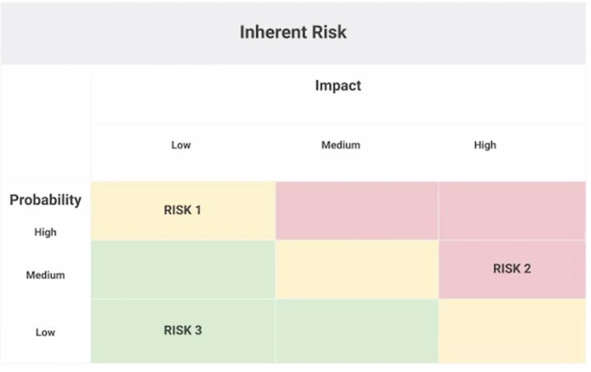

# Ejecución del proyecto: Ejecutar el proyecto

## Introduccion a la ejecucion de proyectos

### Seguimiento y medición del progreso del proyecto

#### La importancia del seguimiento

Una vez que comienza la fase de ejecución del proyecto, ¿cómo sabes que realmente se está haciendo el trabajo? Bueno, puedes
hacerlo de distintas maneras, pero sobre todo, puedes vigilar el progreso del proyecto a través del seguimiento y la medición.
En realidad, esto es una gran parte de la gestión de proyectos.

Por definición, el seguimiento es un método de controlar el progreso de las actividades de un proyecto. Medir el desempeño
del proyecto habitualmente para identificar desviaciones del plan del proyecto puede ayudar a asegurar que el proyecto se
mantenga en marcha.

Una desviación es cualquier cosa que altere el curso de acción original. Las desviaciones del plan del proyecto pueden ser
positivas o negativas.

    ¿Te adelantas a lo previsto porque un problema técnico es menos complejo de lo que pensabas? Qué bien.
    ¿Un desastre natural cerró tu equipo de pruebas? Qué mal.

Ambos son ejemplos de desviaciones. También son ejemplos de por qué el seguimiento es una parte tan fundamental de tu papel
durante la fase de ejecución del proyecto.

Vamos a examinar algunas de las formas en que el seguimiento es beneficioso para el éxito de tu proyecto:

Para empezar, el seguimiento hace que la información clave del proyecto sea transparente, y la transparencia es esencial
para una toma de decisiones precisa. Incluso los gerentes de proyectos más fuertes toman malas decisiones cuando carecen
de información o contexto.

El seguimiento centraliza información del proyecto para que todo el mundo pueda entender el estado de cada parte del pro-
yecto, lo que puede ayudarte a identificar lagunas en tus conocimientos. Además, los proyectos tienen muchos detalles pe-
queños. Es difícil mantener todo como se planeó. El seguimiento ayuda a garantizar que no te arriesgues y olvides algo
importante.

El seguimiento ayuda a mantener a todo el equipo y a los interesados en contacto con los plazos y las metas. Para garantizar
que todos tengan visibilidad del progreso del proyecto, deberías tener un plan de proyecto que funcione tanto para ti como
para tu equipo. De esta manera, todos sabrán lo mismo sobre cómo avanza el proyecto.

El seguimiento también es fundamental para reconocer riesgos y problemas que pueden descarrilar tu progreso. Con un segui-
miento efectivo, serás capaz de identificar problemas de manera oportuna y trabajar con tu equipo para tomar una acción
correctiva. Cuando proporcionas visibilidad de las diversas partes del proyecto, el seguimiento te ayuda a ti y a tu equipo
a identificar y enfocarse en las áreas de riesgo.

El seguimiento ayuda a generar confianza en que el proyecto está planeado para entregarse a tiempo y dentro del alcance
y el presupuesto. Tener una imagen clara y actualizada del estado general del proyecto mantiene al equipo motivado y cen-
trado en mantener el rumbo.

Para recapitular, el seguimiento es importante por algunas razones clave, como la transparencia, la gestión de riesgos y
el mantenimiento del proyecto en marcha.

#### Elementos comunes para hacer un seguimiento

Bueno, hemos hablado sobre que el seguimiento controla el progreso de las actividades del proyecto. Sin embargo, es posible
que aún te preguntes, ¿a qué específicamente deberías hacerle un seguimiento? Ahora, analizaremos los elementos más comunes
para hacer seguimiento que considero útiles en la gestión de proyectos en Google.

Primero, siempre debes realizar un *seguimiento del cronograma del proyecto*. Esto se compone de tareas y actividades que
garantizan que el proyecto está efectivamente encaminado hacia su fecha de finalización. Después de todo, tu objetivo
final es cumplir con los entregables a tiempo.

Igual de importante es el *seguimiento del estado de los elementos de acción, las tareas clave y las actividades* para
garantizar que ese trabajo en verdad se esté haciendo. El seguimiento de las tareas también ayuda a controlar el progreso
de tu equipo hacia los hitos. Cuando estés en medio de un proyecto, surgirán nuevas tareas todo el tiempo. Para evitar no
poder cumplir con las entregas, es esencial realizar un seguimiento de las tareas mientras progresan y se acercan a los
hitos clave.

hacer *seguimiento de los costos* para garantizar que no gastes de más o de menos en las tareas del proyecto. Como mencioné
anteriormente, todos los proyectos tienen presupuestos, y ya sea que supervises o no todo el presupuesto, es posible que
supervises tareas y recursos que producen consecuencias en los presupuestos.

Por último, tendrás que realizar un *seguimiento de las decisiones clave, los cambios, las dependencias y los riesgos del*
*proyecto, incluidos los acordados en caso de cambios en el alcance*. De esta manera, tu equipo y los interesados sabrán
qué se debe hacer para que el proyecto triunfe.

Para resumir, los elementos que son útiles para hacer un seguimiento en toda la fase de ejecución del proyecto incluyen
el cronograma del proyecto, que contiene las tareas y actividades clave, el estado de los elementos de acción, el progreso
hacia los hitos, los costos y las decisiones y los cambios clave.

#### Diferentes métodos de seguimiento

El propósito de tu plan del proyecto es guiarte a través de la ejecución de tu proyecto. Por lo tanto, siempre incluirá,
al menos, un tipo de método de seguimiento y, a veces, podrías usar más de uno según las necesidades de tu equipo. Los
métodos de seguimiento que debatiremos son un diagrama de Gantt, una hoja de ruta y un diagrama de trabajo pendiente. El
tipo que elijas dependerá de lo que consideres adecuado para tu proyecto. Es importante recordar que debes seleccionar
algo que todo el equipo pueda entender, consultar y mantener actualizado fácilmente.

Quizás el método de seguimiento más común de todos es el *diagrama de Gantt*. Es una herramienta de eficacia probadas
para mantener tu proyecto en marcha. Un diagrama de Gantt mide las tareas contra el tiempo e incluye información útil,
como quién hará cada tarea y cuál debería ser el orden de las tareas. Por este motivo, *es un diagrama útil para mantener*
*el cronograma y para proyectos con muchas dependencias, tareas, actividades o hitos que dependen unos de otros.* También
es un diagrama útil para equipos con muchas personas porque la propiedad y las responsabilidades se presentan explícita-
mente de forma visual. A medida que haces un seguimiento y avanzas de manera secuencial en el tiempo, comienza a verse
como una cascada; es por eso que los diagramas de Gantt *se usan generalmente en la gestión de proyectos de Waterfall*.
Cada tarea está representada por una barra de progreso horizontal y la longitud de la barra depende de cuánto tiempo se
asigne a la tarea. Las barras se agrupan una sobre la otra para denotar que la tarea en la parte superior debe completarse
antes de que la siguiente se pueda completar. Los diagramas de Gantt suelen residir en tu plan de proyecto y se actualizan
con el progreso del proyecto.

*Las hojas de ruta* son otro método de seguimiento común usado aquí en Google. Una hoja de ruta es más *adecuada para cuando*
necesitas una forma de *hacer un seguimiento de los grandes hitos* de tu proyecto. Es útil para ilustrar a un equipo y a los
interesados clave cómo debe evolucionar un proyecto a lo largo del tiempo. Aquí hay un ejemplo:

una hoja de ruta puede incluir las metas de tu proyecto en la parte superior y una descripción del enfoque que nos ayudará
a cumplir esos objetivos. En este ejemplo, la meta es aumentar las ventas en línea de la empresa a consumidores en un 20%
interanual e incrementar las ventas de vacaciones a clientes existentes en un 8% respecto al año anterior. El enfoque detalla
las principales tácticas que tu equipo usará para alcanzar el objetivo. Una hoja de ruta también incluye un resumen del
proyecto de alto nivel. En este contexto, alto nivel significa un resumen conciso, por lo general de tres a cuatro oraciones,
para indicar claramente los objetivos y las prioridades de tu proyecto. Por debajo de los objetivos, el enfoque y el resumen
está la tabla que mapea lo que implicará el proceso. En este ejemplo, nuestra la tabla se divide en trimestres que reflejan
el cronograma del proyecto. Un trimestre es un período de tres meses en el calendario financiero de una empresa. Los hitos
clave se enumeran para cada trimestre. También hay tareas que cada miembro del equipo o departamento debe completar. La mayoría
de las tareas se pueden asignar a un hito programado para el mismo trimestre. En nuestro ejemplo, el proyecto en su conjunto
tiene un hito clave en el primer trimestre de finalizar el inventario para la temporada navideña. El trabajo de la prueba
del producto y la finalización de las sugerencias para las ofertas recaen principalmente en los equipos de marketing y ventas.
Sin embargo, a veces las tareas pueden tener que completarse antes para desbloquear a otro equipo o hito de futuros trimestres.
El equipo de producto e ingeniería trabaja en tareas del primer trimestre y el segundo trimestre que conducirán al lanzamiento
de la renovada tienda en línea en el tercer trimestre. Para alcanzar ese hito, cada departamento debe completar tareas específicas
y la hoja de ruta hace un seguimiento individual y del progreso del proyecto en cuanto a los hitos.

Un *diagrama de trabajo pendiente*, el más detallado de estos tres métodos de seguimiento. Un diagrama de trabajo pendiente
mide el tiempo en función de la cantidad de trabajo realizado y la cantidad de trabajo restante. Su función principal es
mantener al equipo del proyecto al tanto de las fechas de finalización previstas y que el equipo sea consciente del alcance
a medida que ocurre. Los diagramas de trabajo pendiente son los *más adecuados para proyectos que requieren una revisión*
*detallada y desglosada de cada tarea asociada con un proyecto*, y son geniales para proyectos en los que terminar a tiempo
es la máxima prioridad.

El eje y, o eje vertical, representa el número de tareas que quedan por ompletar, y el eje x, o eje horizontal, representa
el tiempo. Se realiza un seguimiento del progreso desde la esquina superior izquierda del diagrama. A medida que el proyecto
avanza, harás un seguimiento y trabajarás para conseguir cero tareas restantes, y a la derecha, trabajarás para cumplir
con la fecha de finalización. Suele haber una línea de puntos para lo que se espera o proyecta del progreso en función
del tiempo que tu equipo estima que llevará cerrar tareas, y una línea continua que representa tu progreso real.

Antes de seguir adelante con tu proyecto, tendrás que decidir qué sistema de seguimiento es más adecuado.

Si necesitas comunicar hitos a un gran equipo, podrías elegir una hoja de ruta.
Si tienes un proyecto con múltiples dependencias, podrías elegir un diagrama de Gantt.
Si el seguimiento de las tareas contra la fecha límite es especialmente importante, entonces el diagrama de trabajo pendiente
podría ser tu mejor opción.

Incluso puedes elegir usar más de uno. Debido a que el método de seguimiento será determinado por el tipo de proyecto en
el que estés trabajando, tus recursos y el alcance del proyecto, probablemente usarás varios tipos de métodos de seguimiento
en algún momento de tu carrera.​

#### Elegir el método de seguimiento adecuado para tu proyecto

Hasta ahora, has aprendido sobre la importancia de hacer un seguimiento del progreso del proyecto. También revisaste algunos
de los diferentes métodos de seguimiento usados por los gerentes de proyectos, como los planes de proyectos, los diagramas
de Gantt y de trabajo pendiente, y las hojas de ruta.

- Diagramas de Gantt

El diagrama de Gantt es uno de los métodos de seguimiento más populares y se puede usar para todo tipo de proyectos. Los
diagramas de Gantt suelen estar en el estatuto del proyecto y se actualizan a medida que el proyecto avanza.

Los diagramas de Gantt son útiles para lo siguiente:

    Ayudar a un equipo a cumplir con el cronograma

    Proyectos con muchas tareas, dependencias e hitos

    Proyectos con grandes equipos, porque la propiedad y las responsabilidades se establecen explícitamente de forma visual

Asana, una de las herramientas de software de gestión del trabajo incluida en esta certificación, tiene recursos útiles
para comenzar con los diagramas de Gantt.

[Diagramas de gantt]([https://](https://asana.com/es/resources/gantt-chart-basics))

- Hojas de ruta

Las hojas de ruta son otro método de seguimiento común. Al igual que los diagramas de Gantt, las hojas de ruta también
hacen un seguimiento del progreso individual y del proyecto para cumplir los hitos. Sin embargo, las hojas de ruta son más
adecuadas para realizar un seguimiento de los grandes hitos de tu proyecto.

Las hojas de ruta son útiles para lo siguiente:

    Seguimiento de alto nivel de grandes hitos. Las hojas de ruta describen el proyecto en su conjunto y proporcionan una
    imagen general de los puntos clave, al igual que un mapa de ruta real contiene puntos de interés y marcadores de
    millas.

    Demostrar a tu equipo o a los interesados clave cómo debe evolucionar un proyecto con el tiempo

Las hojas de ruta se pueden crear usando diferentes herramientas. Puedes crear una hoja de ruta en un documento de google
docs o Ms Word.

[Platillas de hojas de ruta]([https://](https://www.smartsheet.com/free-product-roadmap-templates-smartsheet))
[Conceptos]([https://](https://www.smartsheet.com/content/project-roadmap-templates))

- Diagramas de trabajo pendiente

Los equipos de Agile Scrum suelen usar los diagramas de trabajo pendiente. Los diagramas de trabajo pendiente revelan qué
tan rápido trabaja tu equipo, ya que muestran cuánto trabajo queda por hacer y cuánto tiempo queda para completarlo. Los
usos principales de un Gráfico de quemado son:

    Mantener al equipo del proyecto al tanto de las fechas de finalización objetivo
    
    Dar a conocer la corrupción del alcance si ocurrieran.

El diagrama debe mostrarse para que todos puedan verlo y actualizarse habitualmente para que sea eficaz. Los diagramas de
trabajo pendiente son útiles para lo siguiente:

    Proyectos que requieren una revisión detallada de las tareas

    Proyectos donde terminar a tiempo es la máxima prioridad

Un Gráfico de quemado te ayuda, como gerente de proyectos, a comprender cómo trabaja tu equipo y qué influye en su capacidad
para completar las tareas a tiempo. De esta manera, puedes abordar los inconvenientes de inmediato, antes de que se
conviertan en problemas importantes. También te ayudan a planificar de manera más eficiente para el próximo proyecto, ya
que identifica áreas potencialmente problemáticas.

[Trabajo pendiente en jira]([https://](https://www.atlassian.com/agile/tutorials/burndown-charts))
[Conceptos basicos]([https://](https://www.projectmanager.com/blog/burndown-chart-what-is-it))

#### Informes de estado del proyecto

Identificar y comparar varios tipos de métodos de seguimiento y cómo usarlos para hacer un seguimiento y comunicar los
elementos comunes del proyecto en una imagen.

- Componentes clave de un informe de estado del proyecto

Un informe de estado del proyecto ofrece una descripción general de todos los elementos comunes del proyecto y los resume
en una imagen. Es una herramienta de comunicación eficiente para transmitir el estado más reciente en un solo lugar para
el equipo y los interesados.

*La mayoría de los informes de estado contienen los siguientes componentes:*

*Nombre del proyecto:* El nombre del proyecto debe ser específico para el propósito del proyecto, de modo que el objetivo
general del proyecto se pueda entender de un vistazo.

*Fecha:* Crearás informes de estado del proyecto muchas veces durante el transcurso de la fase de implementación de un
proyecto. Los informes se pueden crear semanal o mensualmente; todo depende de las necesidades de los interesados y del
ritmo del proyecto. Agregar la fecha a cada informe de estado sirve como un punto de referencia para tu audiencia y también
crea un registro histórico del estado del proyecto a lo largo del tiempo.

*Resumen:* El resumen condensa los objetivos, el cronograma, los mejores y peores aspectos del proyecto en un lugar central
para facilitar la visibilidad de los interesados. Por lo general, la sección de resumen irá seguida del resumen del cronograma
y el estado general del proyecto o estará junto a ellos.

*Estado:* Como puedes imaginar, el estado es una pieza fundamental. El estado del proyecto ilustra tu progreso real frente a
tu progreso planificado. En la gestión de proyectos, una forma común de describir esto es a través de los informes de estado
RAV (rojo, ámbar, verde) o rojo-amarillo-verde. El informe RAV sigue un patrón de semáforo para indicar el progreso y el
estado.

    *El rojo* indica que hay problemas que necesitan una solución y que el proyecto puede retrasarse o exceder significa-
    tivamente el presupuesto.

    *El ámbar/amarillo* significa que hay posibles problemas con el cronograma o el presupuesto, pero que es probable que
    estos se resuelvan con acciones correctivas.

    *el verde* significa que el cronograma y el presupuesto van bien y que el proyecto va por buen camino.

Puedes usar el informe RAV para indicar el estado general del proyecto, así como el estado de los hitos. Cada equipo del
proyecto y los interesados pueden tener una perspectiva ligeramente diferente sobre lo que significan los colores y la
urgencia de escalar los problemas cuando ven un estado ámbar/amarillo o rojo, por lo que es importante asegurarse de que
todos entiendan lo que significan los diferentes estados de color para tu proyecto.

*Hitos y tareas:* Un resumen de los principales hitos del proyecto hasta el momento y las tareas actuales ayuda al equipo
y a los interesados a visualizar fácilmente el progreso de esos elementos. En un plan de proyecto, normalmente representarás
las tareas y los hitos como "no iniciados", "en curso" o "completados" en un nivel de elemento por elemento. Sin embargo, en
el informe de estado del proyecto, es común resumir estos elementos en dos categorías para comunicar mejor el estado. Usarás
los logros clave para detallar lo que ha sucedido y los futuros para detallar los grandes hitos que lograrás después.

*Problemas:* Los problemas incluyen los obstáculos actuales y los riesgos potenciales de tu proyecto. Los informes de estado
son una oportunidad importante para establecer expectativas con los interesados. Si el estado de tu proyecto es rojo o ámbar,
puedes destacar qué te impide estar donde planeabas estar. También puedes aprovechar esta oportunidad para indicar tu plan
para que el proyecto vuelva a ser de color verde y solicitar cualquier recurso o ayuda que puedas necesitar para hacerlo.

- Tipos de informes de estado del proyecto

Si tienes esos elementos clave en mente, puedes dar formato a tu informe de diversas formas según tu audiencia y lo que
necesitas comunicar.

Si necesitas compartir un informe de estado con tu equipo para un proyecto que contiene múltiples capas de complejidad,
puede ser mejor formatear el informe en una hoja de cálculo para realizar un seguimiento de todos los aspectos móviles.

Si simplemente necesitas comunicar actualizaciones a los interesados sénior, es mejor que tu informe de estado tenga un
ormato como una presentación de diapositivas que contiene solo una descripción general de los puntos más importantes.

- Conclusiones clave

En resumen, los informes de estado del proyecto son una herramienta poderosa para lograr lo siguiente:

    Mejorar y simplificar la comunicación en todo el equipo.

    Mantener informados a todos, incluidos los interesados clave.

    Solicitar más recursos y apoyo (si fuera necesario).

    Crear estructura y transparencia registrando el estado del proyecto en un lugar centralizado.

### Gestión de cambios, riesgos y dependencias

#### Por qué ocurren los riesgos y los cambios

Por qué los riesgos y los cambios podrían ocurrir durante un proyecto y cómo eso puede afectar el alcance del proyecto.
Un riesgo es un evento potencial que podría ocurrir y afectar tu proyecto. Cuando piensas en los riesgos en el contexto
de la gestión de proyectos, lo harás de forma hipotética. En otras palabras, estos podrían no ser eventos que sin dudas
sucederán, pero como existe la posibilidad de que ocurran, es tu responsabilidad como gerente de proyectos identificarlos
y hacer planes para enfrentar esos riesgos.

Algunos ejemplos de riesgos. Un riesgo para el proyecto puede ser que un contratista no cumpla con una fecha límite,
o introducir una herramienta que podría provocar una interrupción de la comunicación dentro de tu equipo, o un trabajo
inesperado adicional debido a la puesta en marcha de una política imprevista.

Cuando se presenta algún riesgo, la consecuencia es un cambio en el plan del proyecto. Un cambio es cualquier cosa que
altera o afecta las tareas, las estructuras o los procesos dentro de un proyecto. Los cambios suelen ser inesperados.
La mayoría de las veces, tienen un impacto negativo en el proyecto y tendrás que aprender a afrontarlos.

Sin embargo, a veces, y hago un énfasis especial en "a veces", los cambios pueden tener un impacto positivo. Los cambios
pueden abarcar cualquier variación del plan del proyecto original con respecto a la triple restricción. Esto puede implicar
cambios en las prioridades, el alcance, el presupuesto y los recursos, o cambios en el cronograma del proyecto. Las dependencias
internas y externas de un proyecto se afectan entre sí y provocan cambios.

Algunos tipos de cambios que pueden afectar tu proyecto. Algunos ejemplos de cambios pueden incluir:

*cambios en las dependencias o nuevas dependencias.* Las dependencias son tareas, actividades o hitos que dependen unas de
otras. Así que si una tarea no se completa a tiempo, podría atrasar el resto de las tareas. Podrías estar a cargo de las
renovaciones de una vivienda donde hay dependencias. Por ejemplo, en la remodelación del baño, no se puede instalar un
lavabo nuevo hasta que se coloquen el tocador y las tuberías. Lo siguiente es cambiar las prioridades. El alcance de la
remodelación cambia si los suegros de tu cliente de repente tienen que mudarse y tienes que adelantar el trabajo planificado
del dormitorio libre antes de completar la remodelación del baño. A continuación, la capacidad y las personas disponibles
podrían cambiar. Tal vez tengas que reemplazar el plomero porque tenías problemas en el sitio de trabajo.

*Otro tipo de cambio podría incluir una nueva limitación en tu presupuesto o recursos.* Por ejemplo, si necesitas reducir
los costos del diseño del baño nuevo en un 10% porque tu presupuesto para el trabajo eléctrico es más alto de lo esperado.

*Otro cambio podría ser la corrupción del alcance.* La corrupción del alcance se refiere a cuando los cambios, el crecimiento
y otros factores afectan el alcance del proyecto. Por ejemplo, tus clientes están tan contentos con los azulejos del baño
nuevo que les gustaría reemplazar los azulejos de todos sus baños.

Por último, *está la fuerza mayor.* Este es otro cambio que podría ocurrir debido a una crisis nacional o internacional. Si
no estás familiarizado con este término, significa una circunstancia imprevista que impide que alguien cumpla con el contrato
debido a una crisis grave. La fuerza mayor es poco común, pero, por ejemplo, si un sindicato se declara en huelga, ciertos
proveedores no podrán cumplir con sus contratos. Si hay una pandemia, toda la producción de tu nuevo producto podría detenerse.

Los cambios se deben medir en contra de las estimaciones del cronograma de alcance, el presupuesto y el tiempo asignadas para
tu proyecto, según los requisitos originales. Ten en cuenta que cuando cambies cualquiera de esas cosas, puede tener efectos
que pueden ser positivos o negativos. Por ejemplo, tus clientes pueden creer que tienen hermosos pisos de madera escondidos
debajo alfombra vieja de la sala y querer sacar la alfombra vieja y usar el piso original que está debajo. Tú, como gerente
de proyectos de este trabajo de construcción particular presupuestaste retirar la alfombra y lijar los pisos viejos y manchados.
Pero surgieron malas noticias. Levantas la alfombra y encuentras que los pisos están en mal estado y podridos. Tendrán que ser
reemplazados o reparados, lo que podría resultar costoso. Por lo tanto, tu cronograma y presupuesto probablemente se modifiquen.

Cuando se trata de quién asume la responsabilidad de gestionar el cambio, serás tú, el gerente de proyectos. Sin embargo, según
el proyecto, es probable que no lo hagas solo. Para gestionar los cambios de forma apropiada, querrás referirte a documentos
como tu Declaración de trabajo y el gráfico RACI. Sin embargo, es posible que también debas crear documentos nuevos. Querrás
crear o familiarizarte con los procesos para solicitar cambios para tu equipo u organización. Estos procesos pueden incluir un
formulario de solicitud de cambio.

*Los formularios de solicitud de cambios.* Tú y los interesados usarán estos formularios para estar preparados para cualquier
cambio y poder gestionarlo de manera adecuada. Dado que muchas personas con diferentes funciones en el proyecto pueden llenar
estos formularios, es importante que los formularios sean claros y muy completos. En la plantilla proporcionada, que contiene
una tabla de 2 por 10, tendrás que incluir información en las celdas, tales como:

    el nombre del proyecto,

    el propietario del debate,
    
    quién toma la iniciativa en este debate del equipo
    
    el tipo de debate. Querrás que el público sepa si están debatiendo un riesgo, una oportunidad o cualquier otra cosa.
    identificar a los equipos involucrados
    
    el resultado esperado del debate, lo que podría implicar un cambio en las prioridades, un cambio en el cronograma o una
    convocatoria oficial sobre cómo proceder con un problema.
    
    Agrega la fecha límite del debate
    
    identifica qué hitos o metas podrían verse afectados
    
    Proporciona una breve descripción de la situación actual, el cambio y cualquier diferencia esperada que se deba hacer en el
    plan de registro, como una imagen del antes y el después.

    profundiza la propuesta de los cambios necesarios y aborda cualquier compensación.
    
    proporciona cualquier información previa para que todos tengan el mismo contexto.

También puedes consultar tu declaración de trabajo, o SOW, para obtener más información sobre quién necesita participar en esa
conversación. Si notas que uno o más de tus hitos corren riesgo de no completarse, entonces necesitarás que el cliente lo
apruebe antes de que el alcance, la fecha límite o el presupuesto se modifiquen, y todos los involucrados deben estar
informados.

#### Identificación y seguimiento de las dependencias

las dependencias son uno de los factores más importantes de un proyecto, tanto internas como externas, pero, ¿qué son exactamente
las dependencias? *Las dependencias son los enlaces* que conectan una tarea del proyecto con otra y, como mencionamos, a menudo son
la mayor fuente de riesgo para un proyecto.

Es posible que dos o más tareas del proyecto tengan una relación entre sí en la que la finalización de una tarea dependa de la
iniciación de otra y viceversa. Piensa en estas tareas como una línea de dominós en la que una pieza cae sobre la otra, una por
una. Si una pieza cae, golpeará a la siguiente y así sucesivamente.

Por ejemplo, una empresa constructora puede tener varios trabajos en toda la ciudad. Cada proyecto requiere que el capataz y el
gerente de proyectos sean elegidos antes de firmar los requisitos, el cronograma y el presupuesto, y contratar a los empleados. No
elegirías un equipo y les dirías que se pongan a trabajar antes de que el trabajo haya sido claramente delimitado y se hayan firmado
los contratos. Ese es un ejemplo de una *dependencia interna*, que describe la relación entre dos tareas dentro del mismo proyecto.

Por otro lado, *las dependencias externas* se refieren a tareas que dependen de factores externos, como organismos reguladores u otros
proyectos. Por ejemplo, si una empresa de construcción debe demoler un sitio de construcción, tendrá que esperar hasta que el municipio
apruebe el proyecto. Las dependencias externas no siempre están bajo el control del gerente de proyectos, pero es importante conocerlas
para que el proyecto se mantenga en marcha.

*Las dependencias obligatorias* son tareas requeridas legal o contractualmente. Por ejemplo, cuando esa empresa de construcción finaliza
la demolición y comienza la construcción, primero tendrá que verter una base de hormigón y luego el municipio los inspeccionará para
asegurarse de que cumpla con sus normas antes de que la empresa pueda seguir construyendo.

Por último, el equipo del proyecto define las *dependencias discrecionales*. Estas son dependencias que pueden ocurrir por sí solas, pero
el equipo vio la necesidad de hacer que esas dependencias dependan unas de otras. Por ejemplo, la empresa constructora puede usar hormigón
de un proveedor nuevo y querer hacer una prueba, vertiendo una parte del hormigón para obtener una mejor estimación de la cantidad total
de producto necesaria para completar el trabajo, en lugar de comprar demasiado o muy poco producto por adelantado. La tarea de verter una
porción del hormigón es lo primero, porque el equipo necesita más información antes de tomar una decisión.

Un gerente de proyectos tiene que trabajar con diligencia para incorporar la gestión de la dependencia. La gestión de la dependencia es el
proceso de gestionar todas estas tareas y los recursos interrelacionados dentro del proyecto para garantizar que tu proyecto en general se
complete con éxito a tiempo y dentro del presupuesto. Para lograr una gestión eficaz de la dependencia, hay cuatro pasos importantes que un
gerente de proyectos puede tomar:

    Identificación adecuada,
    
    Registro de las dependencias,
    
    Control y monitoreo continuos,
    
    Comunicación eficiente.

El primer paso es la *identificación adecuada*. Un gerente de proyectos hará una lluvia de ideas sobre todas las posibles dependencias del
proyecto con su equipo y las clasificará en consecuencia.

El siguiente paso es *registrar las dependencias*. Una vez identificadas todas las dependencias, debe crearse un registro de riesgos. Un
registro de riesgos es una tabla o diagrama que contiene una lista de riesgos y dependencias. El registro de riesgos debe incluir una
descripción de la dependencia, la fecha y todas las actividades o tareas que pueden verse afectadas por la dependencia.

A continuación, el gerente de proyectos querrá hacer un *monitoreo y control continuos*. Esto significa que querrás programar reuniones
periódicas para verificar las tareas interrelacionadas, mantenerte actualizado sobre cualquier progreso realizado y verificar los cambios
que afectarán otras tareas.

El último paso es una *comunicación eficiente*. Mantener al equipo del proyecto y a los interesados actualizados puede ayudar a resolver
las dependencias y lograr que el proyecto esté encaminado.

#### Técnicas para ayudar a gestionar los riesgos

La gestión de riesgos es absolutamente fundamental para el éxito de un proyecto. La gestión de riesgos es el proceso de identificar
los riesgos potenciales y las cuestiones que podrían afectar un proyecto, luego evaluar y aplicar medidas para abordar los efectos de
los problemas y los riesgos identificados.

Una forma de gestionar riesgos y, con suerte, evitar que cualquier riesgo se materialice es centrarse en gestionar los cambios y las
dependencias, así como cualquier riesgo imprevisto en tu proyecto. Si puedes gestionar tanto los cambios como las dependencias y la
corrupción del alcance, otros tipos de riesgos se vuelven mucho más fáciles de gestionar.

    Si tus dependencias se logran a tiempo, es menos probable que tu equipo se atrase con el cronograma.

    Si el alcance está bien gestionado, es menos probable que se produzcan cambios en tu presupuesto o que te veas obligado a extender
    el cronograma.

*Una lluvia de ideas* con tu equipo es una de las técnicas más efectivas para identificar los riesgos de un proyecto. Es probable que tus
compañeros de equipo aporten habilidades y experiencia de proyectos anteriores, lo que puede ayudar a descubrir similitudes y evitar que
se repitan los problemas. Mientras hacemos una lluvia de ideas con nuestro equipo, lo mejor es crear un registro de riesgos.

Un *registro de riesgos* es una tabla o diagrama que contiene la lista de riesgos de tu equipo. Será buena idea hacer preguntas a tu equipo,
como qué podría mejorar el resultado del proyecto o qué podría perjudicarlo u obstaculizarlo. Haz una lista de todo como si fueran afirma-
ciones. Por ejemplo, si ocurre un evento determinado, así es como se ve afectado el proyecto. Para ayudar a priorizar los riesgos dentro
de tu registro de riesgos, puedes calcular tu exposición al riesgo. *La exposición al riesgo* es una forma de medir el potencial de pérdidas
futuras que se den como resultado de una actividad o un evento específicos. Un buen método para calcular la exposición al riesgo es construir
una matriz como esta:

Cuando desarrolles tu matriz, usarás dos variables: impacto del riesgo y probabilidad. Escribe "impacto del riesgo" en la parte superior, en
el eje horizontal, y "probabilidad" en el lateral, en el eje vertical. También, marca el alto, el medio y el bajo a lo largo de cada eje, en
la parte superior de izquierda a derecha y hacia abajo en el costado, porque así es como vas a diagramar la exposición al riesgo. Suma cada
riesgo al gráfico en la sección de la intersección del impacto que puede tener el riesgo en tu proyecto y la probabilidad o posibilidad de
que se produzca el riesgo. Esta es una técnica, pero en cualquier estrategia que uses para examinar tu exposición al riesgo, tus riesgos deberán
ser la prioridad para que tú y tu equipo sepan a cuáles deben prestar atención inmediata. Para cualquier cosa que tenga un gran impacto en tu
proyecto, incluso si tiene una baja probabilidad de que ocurra, asegúrate de tener un plan de mitigación en marcha. ¿Cómo manejarás este riesgo
si realmente se materializa? Si bien un registro de riesgos es una gran herramienta, es probable que surjan algunos riesgos imprevistos.

Es casi imposible dar cuenta de todos los riesgos en el transcurso de un proyecto. Ahí es donde la técnica ROAM puede ayudar. La técnica ROAM,
que significa resuelto, asignado, aceptado y mitigado, se usa para ayudar a gestionar acciones después de que surgen los riesgos. Una vez que
se presenta un riesgo, debes decidir qué hacer con él.

    Si el riesgo se eliminó y no será un problema, entra en la categoría de "resuelto".

    Si al miembro de un equipo se le asigna un cierto riesgo y se le confía que lo maneje, ese riesgo pasa a la categoría de "asignado" y se
    supervisa hasta su finalización.

    Si el riesgo fue "aceptado", se acordó que no se hará nada al respecto.

    Si se han tomado acciones y el riesgo se ha mitigado, ya sea reduciendo la probabilidad de que se produzca o el impacto en el proyecto, pasa
    a la categoría de "mitigado".

Después de que cada riesgo se coloca en una categoría, el equipo debatirá cada riesgo y decidirá cuál debe tener prioridad.

### Comunicar problemas a los interesados

#### Priorizar problemas

#### Comunicar cambios al equipo

#### Escribir un correo electrónico de elevación efectivo

## modulo_4_2

## modulo_4_3

## modulo_4_4

## modulo_4_5

## modulo_4_6
