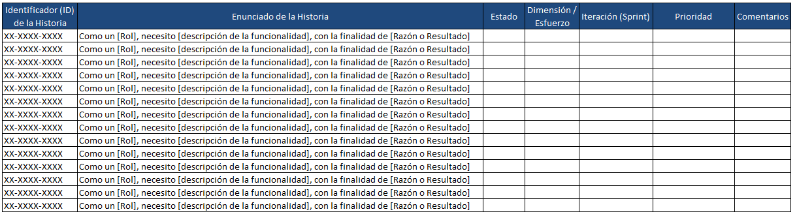

# Gestión de proyectos con la metodología Agile

## Aspectos basicos de las metodologias agiles

### Introducción a Agile

¿Qué es Agile?

Un enfoque flexible para la gestión de proyectos que prioriza la entrega de valor al cliente.
No es una metodología específica, sino un conjunto de principios y prácticas.

Beneficios de Agile:

    Mayor adaptabilidad a los cambios
    Entrega más rápida de valor
    Mejor colaboración y comunicación

Principios Agile:

    Iterativo e incremental: Dividir el proyecto en partes más pequeñas y entregarlas gradualmente.
    Enfoque en el cliente: Involucrar al cliente en todo el proceso.
    Autoorganización: Permitir que los equipos tomen sus propias decisiones.
    Mejora continua: Buscar constantemente formas de mejorar los procesos.

Marcos de trabajo Agile:

    Scrum: Un marco de trabajo popular que utiliza sprints (ciclos de trabajo cortos) y reuniones diarias.
    Kanban: Un sistema visual que ayuda a rastrear el progreso del trabajo.
    Extreme Programming (XP): Un conjunto de prácticas que enfatizan la programación en pareja y las pruebas continuas.

Roles en un equipo Agile:

    Scrum Master: Facilita las reuniones y elimina los obstáculos.
    Product Owner: Representa las necesidades del cliente.
    Equipo de desarrollo: Construye y entrega el producto.

#### Una breve historia de Agile

Waterfall es una metodología popular de gestión de proyectos que alude al orden secuencial o lineal de las fases, Completas
una fase a la vez y no pasas a la siguiente hasta que hayas terminado. Luego, te mueves en la línea como una cascada:
comienzas en la parte superior de la montaña y vas hacia abajo.

El término “ágil” se refiere a la capacidad de moverse rápida y fácilmente. También se refiere a la flexibilidad, a la
disposición y a la capacidad para el cambio y la adaptación. Los proyectos que adoptan una gestión de proyectos con la
metodología Agile aplican un enfoque iterativo, lo que significa que los procesos del proyecto suelen repetirse muchas
veces durante el ciclo de vida del proyecto. En este caso, el equipo opera en muchos bloques de tiempo más cortos, llamados
iteraciones. Cada una de las iteraciones pueden repetirse según los comentarios recibidos. Durante cada iteración, el
equipo toma un subconjunto de todas las actividades del proyecto y hace todo el trabajo requerido para completar ese subconjunto
de actividades. Puedes entenderlo como muchas “minicascadas” para cada actividad. Con este enfoque iterativo, el proyecto
puede avanzar rápidamente, además de que se vuelve mucho más adaptable al cambio. Por eso, el término “agile” (ágil) significa
flexibilidad, repetición y apertura al cambio, pero, ¿qué entendemos por gestión de proyectos con la metodología Agile?

La gestión de proyectos con la metodología Agile es un enfoque para la gestión de proyectos y la gestión de equipos basado
en el Manifiesto de la metodología Agile. El manifiesto es una colección de 4 valores y 12 principios que definen la mentalidad
que todos los equipos de metodología Agile deben procurar desarrollar.

    Entonces, en términos muy básicos, Waterfall es lineal y secuencial, y no anima a cambiar el proceso una vez que se ha
    iniciado. Agile, por otro lado, es iterativo, flexible e incorpora los cambios necesarios a lo largo del proceso.

Las metodologías Agile surgieron orgánicamente durante la década de 1990, cuando la industria del software estaba en auge,
Las startups de software, como Google, estaban abriendo camino para conseguir desarrollar más productos de software en menos
tiempo. Mientras tanto, los gigantes tecnológicos de la época estaban experimentando con formas más rápidas de crear un mejor
software y mantenerse competitivos.

Y, por cierto, el software no consiste solo en las aplicaciones y los sitios web que todos usamos día a día. El software
también incluye el código detrás de las innovaciones en la agricultura, dispositivos médicos, fabricación y más.

Entonces, en este entorno de crecimiento competitivo, las empresas no podían únicamente crear productos nuevos e innovadores,
También debían innovar los mismos procesos que estaban usando para desarrollar estos nuevos productos. En 2001, intelectuales
y creadores de algunos de estos nuevos procesos, también llamados metodologías, se reunieron para encontrar un punto común
entre sus métodos y resolver un problema. Acordaron que el problema era que las empresas estaban tan concentradas en planificar
y documentar sus proyectos que habían perdido de vista lo que realmente importaba: complacer a sus clientes.

Por tal motivo, estos líderes idearon el Manifiesto de la metodología Agile para guiar y enseñar lo que realmente importa
al desarrollar software, que es mantener el proceso flexible y concentrarse en las personas, tanto del equipo como los
usuarios, y no tanto en los productos finales o los entregables.

Ahora bien, este es el punto en que Agile se vuelve aún más interesante. Puedes usar Agile incluso si no planeas trabajar
en proyectos de software. Agile ha tenido tanto éxito en la industria del software que sus valores, principios y frameworks
se han aplicado a casi todas las industrias. De hecho, los métodos Agile se basan en gran medida en los principios de fabricación
Lean que se originaron en las fábricas de automóviles de Toyota en la década de 1930. También encontrarás métodos Agile
aplicados en las industrias aeronáutica, sanitaria, educativa y financiera, entre muchas más.

En resumen Metodologías de gestión de proyectos: Agile vs. Cascada

Cascada

    Secuencial: las fases se completan una a la vez.
    Rígido: el proceso no se puede cambiar una vez iniciado.

Agile

    Iterativo: el proyecto se divide en ciclos más pequeños (iteraciones).
    Flexible: el proceso se puede adaptar a los cambios.
    Enfocado en el cliente: prioriza la satisfacción del cliente.

Historia de Agile

    Surgió en la década de 1990 en la industria del software.
    Las empresas necesitaban desarrollar software más rápido y mejor.
    El Manifiesto Ágil (2001) definió los valores y principios de Agile.
    Aplicación de Agile

No solo para proyectos de software. Se utiliza en diversas industrias, como:

    Fabricación
    Atención médica
    Educación
    Finanzas

#### Diferencia entre Agile y Waterfall

Agile se creó en respuesta al estricto proceso lineal de Waterfall.

Mientras que Waterfall apunta a la previsibilidad y trata de evitar el cambio, Agile acepta la realidad de que el mundo,
los mercados y los usuarios son inciertos e impredecibles.

Por ejemplo, tu cliente podría decir que quiere la característica A, pero al momento de entregarle el resultado final, se
da cuenta de que en realidad quería la característica B. Agile tiene como objetivo resolver ese problema obteniendo
comentarios de los clientes más rápidamente para garantizar que el equipo construya lo que el cliente realmente quiere.

Parte de trabajar con una mentalidad Agile consiste siempre en buscar formas de trabajar más eficientemente. Lo conseguimos
buscando formas de optimizar los procesos sin reducir la calidad o el valor del producto. La clave para optimizar es reducir
el desperdicio.

Por ejemplo, la documentación innecesaria es una forma de desperdicio. Otra forma de desperdicio es pasar semanas o meses
trabajando en una característica y, luego, descubrir que a los clientes, que también podrían ser usuarios o interesados,
definitivamente no les gusta la característica.

Podrías reducir o eliminar ambas formas de desperdicio aumentando la colaboración entre el equipo y los interesados. Más
colaboración significa menos documentación y comentarios anticipados sobre el producto.

Consideremos algunas diferencias más entre Waterfall y Agile.

Los tres aspectos importantes de un proyecto son los requisitos, la documentación y los entregables.

Los requisitos son condiciones que deben cumplirse o tareas que deben terminarse para asegurar la culminación exitosa del
proyecto. Piensa en ellos como el conjunto de criterios que se encuentran dentro del alcance de tu proyecto o una lista de
especificaciones que deben cumplirse.

En un proyecto Waterfall, probablemente necesitarás un documento de requisitos del producto, que enumera el alcance y los
requisitos del proyecto. Necesitas tener varios planes de proyecto aprobados formalmente, y es posible que tengas un equipo
de personas cuyo trabajo sea solo escribir y aprobar estos planes. También podrías establecer una junta de control de cambios,
y un proceso formal y riguroso para gestionar cualquier cambio en los requisitos. Todo esto está diseñado para evitar que
el equipo construya algo que el cliente o los interesados no quieren y apunta a minimizar cualquier cambio que pueda provocar
la corrupción del alcance.

Los planes de proyecto aprobados formalmente funcionan bien cuando el producto final deseado se conoce y comprende. Un
ejemplo de esto podría ser dirigir un proyecto con requisitos y objetivos claros basados en la norma exigida. Pero si ese
no es el caso, un equipo de Waterfall corre el riesgo de construir un entregable completo y, luego, descubrir que al cliente
no le gusta el resultado final.

En Agile, los requisitos se tratan como más dinámicos y se espera que cambien conforme el equipo recibe comentarios y nueva
información. Por lo general, hay un conjunto inicial de requisitos o ideas destacadas cuando el proyecto comienza, pero
esa lista de requisitos y características crece continuamente y cambia durante todo el proyecto. El equipo trabaja con los
interesados para priorizar los requisitos, moviendo siempre los elementos más urgentes o valiosos al principio de la lista,
Luego, el equipo sigue el orden de la lista y trabaja en los requisitos por iteraciones. Gracias a que sigue el orden de
la lista, el equipo puede recibir comentarios sobre su trabajo de manera rápida y frecuente.

Al final de cada iteración, el equipo recibe comentarios y puede hacer los ajustes necesarios a los requisitos antes de
continuar.

el segundo aspecto es la documentación. Todos los proyectos requieren documentación, planes de proyecto, mapas de interesados,
cronogramas, estatutos, contratos... y la lista sigue. Los proyectos de Waterfall usan mucha documentación, ya que hay mucha
cantidad de traspasos entre fases y traspasos entre diferentes equipos dentro del proyecto. Además, debido a que el trabajo
se realiza en porciones más grandes, deberás dejar atrás más partes de documentación en cada etapa del proyecto.

Pero con Agile, se pone énfasis en las conversaciones en tiempo real. Esto no significa que no haya documentación; simplemente
está presente de una forma diferente. En lugar de grandes documentos formales con una gestión de cambios y un proceso de
aprobación rigurosos, hay documentos más cortos que tienen los detalles justos para lograr su propósito. Estos documentos
están mucho más enfocados en lo que el lector necesita saber para hacer el trabajo y se redactan solo cuando es necesario.

Los entregables. Un entregable es un resultado tangible de un proyecto. En los proyectos de Waterfall, es común presentar
el entregable al final de todo. La presentación del producto final se siente como un gran evento, un gran anuncio, mucho
alboroto y a menudo resulta sumamente divertida y emocionante. Agile es igual de emocionante, pero tiene presentaciones
más pequeñas y frecuentes. Así que cada presentación tiene una celebración menos formal, pero con la importancia necesaria
para ser igual de emocionante.

Cuando hay mucha incertidumbre en un proyecto, como en una industria o un mercado nuevos y emergentes, la presentación
constante de entregables del proyecto permite que el equipo Agile reciba comentarios y aprenda sobre la marcha. Sin comentarios
frecuentes, el equipo podría terminar entregando algo que el cliente no quiere.

En resumen las diferencias clave entre Agile y Waterfall

Requisitos:

    Waterfall: Estáticos y definidos al inicio del proyecto.
    Agile: Dinámicos y cambian a medida que se recibe retroalimentación.

Documentación:

    Waterfall: Abundante y formal, con procesos de aprobación rigurosos.
    Agile: Mínima y enfocada en lo esencial para completar la tarea.

Entregables:

    Waterfall: Lanzamiento único al final del proyecto.
    Agile: Lanzamientos frecuentes y más pequeños.

Otros aspectos:

    Waterfall: Enfatiza la planificación y la previsibilidad.
    Agile: Abraza el cambio y la retroalimentación.
    Waterfall: Adecuado para proyectos con requisitos claros y estables.
    Agile: Adecuado para proyectos con incertidumbre y requisitos cambiantes.

El término VUCA (entornos V.U.C.A) es el acrónimo inglés de Volatility, Uncertainty, Complexity y Ambiguity, es decir
volatilidad, incertidumbre, complejidad y ambigüedad.

#### Los cuatro valores del Manifiesto de la metodología Agile

El Manifiesto de la metodología Agile se escribió en 2001 y reúne la sabiduría colectiva de las personas que lo idearon
a partir de su vasta experiencia y liderazgo intelectual en la industria tecnológica.

El Manifiesto para el desarrollo de software con metodología Agile establece lo siguiente: Estamos descubriendo mejores
formas de desarrollar software haciéndolo y ayudando a otros a hacerlo. Gracias a este trabajo, hemos llegado a:

    valorar a las personas y las interacciones por sobre los procesos y las herramientas
    el software funcional por sobre la documentación exhaustiva
    la colaboración con el cliente por sobre la negociación de contratos
    responder al cambio por sobre seguir un plan.

A partir de los cuatro valores, se desarrolló un conjunto de 12 principios que recalcaron el mensaje del Manifiesto. Estos
valores y principios especifican el porqué, el cómo y el qué de los procesos y la planificación de la gestión de proyectos
con la metodología Agile.

*Los individuos y las interacciones* por sobre los procesos y las herramientas. En esencia, este valor enfatiza que las personas
se comuniquen entre sí, en lugar de usar muchos procesos y herramientas para forzar que las cosas sucedan de cierta manera,
Por ejemplo, ¿alguna vez le has enviado un correo electrónico a alguien con una pregunta y terminaron en un largo intercambio
de ida y vuelta debido a simples preguntas de seguimiento o aclaraciones? Lo más probable es que podrías haber obtenido la
misma información en menos tiempo con una breve conversación.

Agile quiere asegurarse de que los equipos trabajen juntos, colaboren y se ayuden entre sí para lograr los mejores resultados
posibles. Agile también valora las perspectivas individuales y la creatividad. Esto no significa que todos los equipos sean
aóticos. El valor solo significa que los procesos y las herramientas deben usarse para facilitar e impulsar una buena gestión
de proyectos y una mejor colaboración dentro del equipo, y nunca deben usarse como un obstáculo para que los equipos trabajen
bien entre sí.

*El software funcional por sobre la documentación exhaustiva*, lo que significa que los equipos deben priorizar pasar tiempo
trabajando en cosas que realmente crean valor y evitar dedicar más tiempo del realmente necesario a debatir, redactar y
revisar documentos. Ahora bien, este valor puede parecer que solo se aplica a proyectos de software, pero reemplaza el término
“software funcional” con lo que sea que tu proyecto esté intentando entregar. Tal vez el proyecto sea redactar un resumen
legal, diseñar un espacio de oficinas o preparar una presentación de ventas.

Lo que crea valor es aquello que tu proyecto está intentando entregar. En otras palabras: es más importante entregar el
producto que el cliente quiere que documentar exhaustivamente el proceso que usaste.

*colaboración con el cliente por sobre la negociación del contrato.* En los proyectos Agile, la satisfacción del cliente
se considera como la máxima prioridad, que consiste en construir un producto valioso y de alta calidad. En definitiva,
si no es valioso para el cliente, entonces no tiene mucho sentido dedicarle tiempo.

Cuando en el Manifiesto se habla de contratos, se hace referencia a los documentos oficiales que requieren la aprobación
del cliente y un acuerdo formal con este, como esos extensos documentos de requisitos o solicitudes de cambio formales. Agile
valora la libertad de colaborar con los clientes desde el principio y a menudo. Al hacerlo, los equipos pueden reaccionar
rápidamente y adaptarse a las necesidades de los clientes, en lugar de esperar a negociar las condiciones del contrato solo
para hacer algunos cambios o solicitar recursos. La gestión de proyectos con la metodología Agile sí incluye contratos,
pero se hace hincapié en identificar lo que realmente se necesita y dejar espacio para el trabajo colaborativo y centrado
en el cliente. Se alienta a los equipos Agile a buscar todas las oportunidades para incluir al cliente o interesado durante
la ejecución del proyecto. Por ejemplo, podría ser presentar prototipos anticipadamente, hacer preguntas o reunirse para
hacer algunas pruebas iniciales del producto.

*Responder al cambio por sobre seguir un plan.* Este último valor es crucial para un proyecto Agile, ya que, Agile surgió
de un mundo que estaba cambiando tan rápido que las organizaciones no podían adaptarse y luchaban por sobrevivir. En
consecuencia, este valor enfatiza que cada equipo Agile debe reconocer que el cambio es inevitable. Cuanto más grande, más
largo y más complejo sea tu proyecto, más incertidumbre habrá. Para muchos proyectos, finalizar un plan consolidado al
comienzo del proyecto probablemente conllevará una entrega a tiempo dentro del presupuesto, pero puedes correr el riesgo
de no satisfacer las necesidades del cliente o agregar el máximo valor.

Como gerente de proyectos, la enseñanza clave que debes recordar es que los proyectos más exitosos son aquellos que pueden
integrar el cambio sin problemas. Los gerentes de proyectos que usan la metodología Agile crean y valoran sus planes, pero
pueden asumir el cambio y adaptarse si es necesario revisar los planes en cualquier momento durante el proyecto.

En resumen El Manifiesto Ágil es un conjunto de principios que guían el desarrollo de proyectos ágiles.
Estos principios enfatizan:

    Individuos e interacciones sobre procesos y herramientas: Priorizar la comunicación y la colaboración entre los miembros
    del equipo.

    Software funcional sobre documentación exhaustiva: Centrarse en crear productos valiosos en lugar de documentar excesivamente
    el proceso.

    Colaboración con el cliente sobre negociación de contratos: Involucrar al cliente en el proceso de desarrollo para garantizar
    que se satisfagan sus necesidades.

    Respuesta al cambio sobre seguir un plan: Adaptarse a los cambios inevitables y priorizar la flexibilidad.

Cómo equilibrar los valores ágiles

Los equipos ágiles deben encontrar un equilibrio entre estos valores:

    Individuos e interacciones vs. Procesos y herramientas: Utilizar procesos y herramientas para facilitar la colaboración,
    pero no permitir que obstaculicen la comunicación.

    Software funcional vs. Documentación exhaustiva: Crear productos valiosos sin dedicar demasiado tiempo a la documentación.
    
    Colaboración con el cliente vs. Negociación de contratos: Colaborar con el cliente para comprender sus necesidades,
    pero establecer acuerdos claros para evitar malentendidos.
    
    Respuesta al cambio vs. Seguir un plan: Adaptarse a los cambios, pero mantener un plan general para guiar el proyecto.
    Al comprender y equilibrar estos valores, los equipos ágiles pueden crear productos valiosos, satisfacer las necesidades
    del cliente y adaptarse a los cambios.

#### 12 principios del Manifiesto de la metodología Agile

Los cuatro temas de los principios de Agile son los siguientes:

Entrega de valor, o ¿cómo hacen los equipos Agile para entregar productos de gran valor a sus clientes?
Colaboración de negocios, o ¿cómo colaboran los equipos Agile con sus socios comerciales e interesados para crear valor
comercial para la organización y sus usuarios?
Cultura de equipo, o ¿cómo hace un equipo para crear y mantener la dinámica interpersonal y de equipo adecuada para entregar
valor a los clientes y al negocio?
retrospectiva, o ¿cómo hace el proyecto para aprender a aumentar continuamente el rendimiento de una organización y un
negocio?

*El primer tema es la entrega de valor,* que incluye cinco principios, Este tema se trata de entregar el trabajo lo más rápido
posible. ¿Recuerdas por qué? Para que podamos recibir comentarios y mitigar el riesgo de dedicar demasiado tiempo a generar
algo equivocado. Además, nadie obtiene ningún valor de tu trabajo, incluida tu empresa, hasta que lo entregas. Así que, cuanto
más tardes en entregarlo, más deberás esperar para recibir ingresos, y tal vez más tiempo tendrá la competencia para adelantarse,
Pueden parecer muy orientados al software, pero si reemplazas la palabra “software” por “entregables” o “soluciones”, pueden
aplicarse a casi cualquier proyecto.

Por ejemplo: entregar soluciones funcionales con frecuencia. ¿Ves? El tema del valor también tiene que ver con la simplicidad.
¿Cuánto tiempo crees que les lleva a los ingenieros agregar botones y características a los productos que finalmente terminan
confundiendo al usuario? La simplicidad permite que un equipo se concentre y trabaje en lo que más importa. Un ejemplo práctico
de este tema podría ser priorizar el recibir comentarios sobre el prototipo de un producto para saber qué características
son realmente importantes o para asegurarte de que el equipo solo trabaje en características aprobadas y no pierda tiempo
en las innecesarias.

Otro ejemplo podría ser reservar el diez por ciento del tiempo del equipo para trabajar en la corrección de errores o el
pulido de un proceso, lo cual debería ayudarte a ir más rápido en futuras iteraciones.

*El segundo tema es la colaboración de negocios*, que incluye dos principios más. Nota rápida: uno de los principios usa
el término “gente de negocios” para referirse a aquellas personas involucradas en actividades como ventas, marketing, atención
al cliente y administración de cuentas. Usaremos el término “desarrolladores” para referirnos a aquellas personas involucradas
en la generación y creación de productos.

Bien, la colaboración con el cliente en la charla sobre valores y aquí lo vemos otra vez. Colaborar con tus clientes ayuda
al equipo a obtener información comercial crítica de inmediato, lo que le permite ajustarse y adaptarse a cualquier información
nueva al instante. No importa si se realiza temprano o tarde en el proyecto, los clientes obtendrán lo que quieren para alcanzar
sus objetivos comerciales.

Puedes lograr una buena colaboración asegurándote de que la gente de negocios trabaje cerca del equipo de desarrollo, idealmente
en la misma oficina o espacio virtual. Si eso no es posible, se puede intentar compartir el espacio un día a la semana,
fomentar el uso de mensajería instantánea o programar tiempo en los calendarios de tu equipo cada día o semana para colaborar.
El objetivo es facilitar el acceso para la gente de negocios y los desarrolladores.

Otro ejemplo podría ser cómo manejas los comentarios y los cambios de prioridades. En lugar de tratar de mantener al cliente
alejado de los desarrolladores debido a preocupaciones sobre la corrupción del alcance, crea una reunión semanal en la que
los clientes y la gente de negocios puedan estudiar los comentarios y las ideas nuevas con el equipo. Esta podría ser una
gran manera de descubrir que una característica realmente valiosa es muy fácil de construir, mientras que otra característica
que los usuarios pensaron que sería fácil es realmente muy difícil.

*El tercerercer tema es la dinámica y la cultura del equipo* e incluye cuatro principios más. Recuerda que el primer valor
de Agile prioriza a los individuos y las interacciones por sobre procesos y herramientas. Ten en cuenta que los principios
de este tema reflejan dicho valor. Este tema enfatiza la creación de una cultura de equipo eficaz que sea inclusiva, solidaria
y empoderadora. Tener una cultura de equipo eficaz es esencial para el éxito de un proyecto.

Estos principios se reducen, en efecto, a garantizar que tu equipo esté motivado para hacer lo correcto, se sienta confiado
para hacer lo correcto, tenga los recursos y el espacio para trabajar en estrecha colaboración para lograr objetivos y trabaje
a un ritmo sostenible.

Un ejemplo de énfasis en la cultura de equipo eficaz sería preguntarle al equipo qué tipo de equipamiento necesita para
hacer su trabajo y, luego, darle esas herramientas. Otra manifestación de este tema es dejar que los equipos escriban sus
propios procesos y plantillas, en lugar de obligarlos a usar algo de la oficina central. Los equipos funcionan mejor cuando
sienten que sus aportes se valoran, por lo que tú, como gerente de proyectos, debes dejar margen para que tu equipo se
comprometa y contribuya activamente a la cultura del equipo.

Desarrollarás confianza y lo empoderarás para que aborde su trabajo de la manera que más le convenga, lo que, a su vez,
le permitirá trabajar de manera más productiva.

*El cuarto tema es retrospectiva y aprendizaje continuo.* El último principio se basa únicamente en este tema, De manera
regular, el equipo reflexiona sobre cómo lograr mayor eficacia para, luego, ajustar y perfeccionar su comportamiento en
consecuencia. lo importante que es que los equipos Agile aprendan continuamente y se adapten a lo que les funciona bien
y a lo que no. Los equipos siempre deben encontrar mejores formas de trabajar. Vale la pena reservar este tiempo después
de cada iteración para concentrarse por completo en cómo mejorar. En estas sesiones, el equipo puede dar un paso atrás y
plantear preguntas como las siguientes:

¿Cómo le está yendo al equipo?
¿Los clientes están satisfechos?
¿Hay procesos que podríamos optimizar?
¿Nuestras herramientas nos funcionan bien?
¿Estamos siguiendo los valores?
¿Estamos acumulando alguna deuda? Y por “deuda” me refiero a procesos o tecnología que nos ralentiza.

#### Adopción de una mentalidad Agile: Manifiesto de la metodología Agile

Valores de la Metodología Agile

    Individuos e interacciones sobre procesos y herramientas: Priorizar a las personas y la colaboración por encima de las
    reglas y los procedimientos.

    Software funcional sobre documentación completa: Entregar software que funcione en lugar de centrarse en una documentación
    exhaustiva.

    Colaboración con el cliente sobre la negociación del contrato: Trabajar estrechamente con los clientes para comprender
    sus necesidades y brindarles valor.

    Responder al cambio por sobre seguir un plan: Adaptarse a los cambios y estar dispuesto a modificar los planes según
    sea necesario.

Principios de la Metodología Agile

    Satisfacer al cliente mediante la entrega temprana y continua de software valioso.

        Así sea que estés trabajando para crear un producto para tu empresa o para un cliente, lo más probable es que
        alguien esté a la espera de tu entrega. Si esa entrega se retrasa, el resultado es que el cliente, el usuario o
        la organización se quedan esperando ese valor agregado a sus vidas y flujos de trabajo. Agile enfatiza que entregar
        valor a los usuarios de manera temprana y frecuente crea un flujo de valor constante, lo que aumenta tu éxito y
        el de tus clientes. Esto generará confianza y seguridad por medio de comentarios continuos, así como la concreción
        temprana del valor comercial.

    Aceptar los requisitos cambiantes, incluso al final del desarrollo.

        Cuando se trabaja con Agile, es importante ser ágil. Eso significa poder moverse rápidamente y cambiar de dirección
        siempre que sea necesario. Eso también significa que tú y tu equipo están constantemente analizando el entorno para
        asegurarse de que los cambios necesarios se tengan en cuenta en los planes. Reconocer y aceptar que tus planes pueden
        cambiar (una, dos o varias veces) garantiza que tanto tú como tus clientes maximicen su éxito.

    Entregar software funcional con frecuencia, desde un par de semanas hasta un par de meses.

        Entregar tu producto en incrementos pequeños y frecuentes es importante, ya que permite ahorrar tiempo y te ofrece
        oportunidades regulares para que los interesados, incluidos los clientes, den su opinión sobre el progreso. Esto
        asegura que el equipo nunca pierda tiempo yendo por el camino equivocado.

    Los empresarios y los desarrolladores deben trabajar juntos todos los días.

        Eliminar los obstáculos entre los desarrolladores y las personas centradas en el aspecto comercial del proyecto
        genera confianza y comprensión, y garantiza que los desarrolladores, o quienes crean la solución, estén en sintonía
        con las necesidades de los usuarios.

    Construir proyectos en torno a personas motivadas.

        Un equipo que aplica exitosamente la metodología Agile cuenta con miembros del equipo que no solo confían entre
        sí para realizar el trabajo, sino que también cuentan con la confianza de sus patrocinadores y ejecutivos para
        hacerlo. Los equipos generan mejores soluciones cuando están empoderados y motivados para entregar proyectos difíciles.

    La comunicación cara a cara es el método más eficiente y efectivo.

        No hay nada como la comunicación cara a cara. La comunicación en persona nos permite captar ciertas señales, lenguaje
        corporal y expresiones faciales que a veces se pierden al usar otras formas de comunicación, como el correo electrónico,
        el chat o el teléfono. Sin embargo, no siempre podemos reunirnos físicamente. Establecer normas para una comunicación
        efectiva, sin importar el formato, es esencial para la efectividad de un equipo.

    El software funcional es la medida principal del progreso.

        En los equipos que aplican la metodología Agile, la principal forma de demostrar la finalización significativa del
        trabajo es mostrar una parte funcional de la solución. En los equipos de software, eso podría significar una pieza
        de software funcional. En los equipos que trabajan en otras disciplinas, eso podría significar una parte crítica
        de la solución que está lista para demostrarse ante los usuarios o sus representantes con el fin de escuchar opiniones,
        Esto contrasta con los proyectos tradicionales o de la metodología Waterfall, en los que la finalización de los
        documentos del proyecto podría usarse para medir el progreso. En la gestión de proyectos Agile, no basta con decir
        que el equipo ha terminado un 80% de una actividad si no hay un recurso demostrable y en funcionamiento disponible
        para revisar.

    Los procesos Agile promueven el desarrollo sostenible.

        Mantener un ritmo constante y prudente a la vez evitará cometer errores en el camino. Además, no es recomendable
        que tu equipo se sienta sobrecargado de trabajo o abrumado. Por el contrario, un equipo subutilizado puede aburrirse
        y perder la chispa creativa para innovar. El ideal de Agile es lograr un ritmo constante de esfuerzo para el equipo
        que evite las horas extras y el agotamiento.

    La atención a la excelencia técnica y al buen diseño mejora la agilidad.

        Este principio expresa que el hecho de que el equipo esté trabajando rápido no significa que sacrifique la calidad,
        Al enfatizar la calidad y el diseño a lo largo de la fase de desarrollo del proyecto, se incrementará la agilidad,
        la eficiencia y la velocidad del equipo. Cuando un equipo ofrece una solución bien construida, puede responder
        rápidamente a los comentarios de los usuarios y a la nueva información. Sin embargo, si el producto es de baja
        calidad, implementar cambios puede volverse problemático, complejo y ralentizar a todo el equipo.

    La simplicidad es esencial.

        El equipo debe evitar implementar funciones adicionales que no hayan sido solicitadas explícitamente por el usuario
        o el propietario del producto. Esto incluye eliminar procedimientos que ya no son necesarios y reducir la documentación
        excesiva.

    Los mejores requisitos, arquitecturas y diseños surgen de equipos autoorganizados.

        Los miembros del equipo deben poder realizar su trabajo diseñando sus propios procesos y prácticas de trabajo, sin
        un gerente que dicte cómo trabajar. Los miembros del equipo también deben sentirse empoderados para hablar, plantear
        preguntas e inquietudes o dar su opinión.

    Los equipos reflexionan regularmente sobre cómo mejorar su eficacia.

        En Agile, es importante reconocer que el aprendizaje de los éxitos y los fracasos es continuo. Ningún equipo es
        perfecto. Habrá errores, desafíos, pruebas y triunfos. Los equipos deben reflexionar sobre todos estos diferentes
        aspectos de sus actividades para que puedan hacer los ajustes necesarios.

#### Adopción de una mentalidad Agile

Todo proyecto existe dentro de organizaciones y entornos con diferentes culturas, objetivos comerciales y dinámica de la
industria.

Agile consiste en aportar valor en un mundo con altos grados de incertidumbre, riesgo y competencia. Prepara a un equipo
para que reaccione lo más rápido posible a la información nueva, a las oportunidades emergentes del mercado e, incluso, a
las tecnologías novedosas. Agile funciona bien en industrias o proyectos que son susceptibles al cambio y la incertidumbre,
o que los fomentan.

¿Qué tipos de negocios o industrias, además del software, crees que afrontan muchísimos cambios? Algunas son:

    la biotecnología, debido a las vacunas, los tratamientos y las tecnologías emergentes.
    los medios, debido al sinfín de nuevas formas de compartir contenido.
    La industria alimentaria, con chefs famosos y la última tendencia gastronómica.
    la moda, una industria basada en mantenerse al día con las tendencias cambiantes.

Por el contrario, estas son algunas industrias que podrías pensar que son bastante estables:

    la agricultura, la industria aeroespacial, la manufactura y la minería.

Pero incluso estas industrias con cadenas de suministro y códigos rigurosos tienen que adaptarse al cambio debido a nuevas
leyes y regulaciones, desastres naturales y otros problemas imprevistos. Algo que el año 2020 enseñó a todos es que ninguna
industria es verdaderamente inmune al cambio y la incertidumbre.

Veamos un concepto para categorizar y pensar estas fuerzas que dan forma a nuestro mundo, sin importar en qué industria,
Ese concepto se llama VUCA y puede ayudar a decidir qué enfoque de gestión de proyectos es el mejor para el proyecto, La
Escuela Superior de Guerra del Ejército de los EE.UU. desarrolló un concepto llamado VUCA, deletreado en inglés V-U-C-A.

VUCA es un acrónimo que define las condiciones que afectan a las organizaciones en un mundo cambiante y complejo, Fue
diseñado para ayudarnos a tener en cuenta las fuerzas del cambio y la incertidumbre en nuestros proyectos y negocios,
*VUCA significa volatilidad, incertidumbre, complejidad y ambigüedad.*

El primero es la volatilidad. La volatilidad se refiere a la tasa de cambio y rotación en un negocio o una situación. En
un proyecto volátil, analizarías que, en tus operaciones, siempre hay una alteración que puede llegar a suceder. O parece
que las cosas nunca llegan a asentarse a un ritmo normal.

Lo siguiente es la incertidumbre. La incertidumbre se refiere a la falta de previsibilidad o al alto potencial de sorpresa,
En un entorno incierto, sería difícil crear planes para el futuro no basados en una gran cantidad de suposiciones que podrían
resultar equivocadas.

Luego, la complejidad. La complejidad se refiere al elevado número de fuerzas interrelacionadas, problemas, organizaciones
y factores que influirían en el proyecto. Por ejemplo, si un producto en el cual se está trabajando se basara en diversos
proveedores de todo el mundo, eso aumentaría la complejidad del proyecto

Finalmente, tenemos la ambigüedad. La ambigüedad se refiere a la posibilidad de entender mal las condiciones y las causas
raíz de hechos o circunstancias. En un proyecto que adoleciera de ambigüedad, sería difícil identificar las causas de los
retrasos, lo que dificultaría el diseño de planes de mitigación para reducir los riesgos.

Recapitulando. VUCA significa volatilidad, incertidumbre, complejidad y ambigüedad. Es un concepto que fue desarrollado para
lidiar con estas fuerzas en un mundo cambiante e incierto. Las empresas pueden aplicar el concepto de VUCA como una herramienta
para determinar la mejor manera de abordar los proyectos.

#### Aplicación de Agile en un entorno VUCA

VUCA es un acrónimo que significa:

    Volatilidad
    Uncertidumbre
    Complejidad
    Ambigüedad

Agile es una metodología de gestión de proyectos que se adapta bien a entornos VUCA. Esto se debe a que Agile se centra
en:

    Flexibilidad: Adaptarse rápidamente a los cambios.
    Iteración: Dividir el proyecto en partes más pequeñas y trabajar en ellas de forma incremental.
    Colaboración: Trabajar en equipo para resolver problemas y tomar decisiones.

Ejemplo de VUCA y Agile

Office Green, una empresa de paisajismo, se enfrentó a un entorno VUCA cuando el trabajo desde casa se hizo más común. Para
adaptarse, utilizaron Agile para:

    Dividir el proyecto en partes más pequeñas: Crearon equipos para centrarse en diferentes aspectos del nuevo servicio,
    Virtual Verde.

    Iterar rápidamente: Probaron diferentes ideas y recibieron comentarios de los clientes para mejorar el servicio.

    Colaborar estrechamente: Los equipos trabajaron juntos para resolver problemas y tomar decisiones.

    Al utilizar Agile, Office Green pudo adaptarse a los cambios del mercado y lanzar Virtual Verde con éxito.

### Frameworks populares de la metodología Agile

#### Introducción a Scrum

¿qué es Scrum?, en primer lugar, no es un acrónimo. Si ha jugado o visto rugby alguna vez, seguramente reconocerá el término,
Para quienes no están familiarizados con el rugby, es similar al fútbol americano, un deporte de contacto que se juega en
una cancha con una pelota de forma similar. “Scrum” se refiere a una formación en rugby en la que todos los jugadores del
equipo se inclinan hacia adelante, unen sus cabezas y, luego, trabajan como una unidad para tratar de ganar yardas preciadas
para pasar la línea de anotación. Los creadores de la metodología Scrum vieron a sus equipos muy concentrados con la cabeza
agachada y trabajando muy estrechamente para sacar adelante los proyectos, como en un scrum de un partido de rugby.

¿cómo funciona la metodología Scrum para la gestión de proyectos? Si trabajas en la gestión de proyectos con la metodología
Agile, es muy probable que utilices Scrum o un enfoque basado en Scrum. Según el informe State of Agile de 2019, el 72% de
los equipos que utilizan métodos Agile usaban Scrum o una forma híbrida.

Cuando usas Scrum para la gestión de proyectos, formas un equipo que trabajará en conjunto para desarrollar y probar
rápidamente un entregable.

El trabajo se completa en ciclos cortos, y el equipo se reúne diariamente para discutir las tareas actuales y aclarar
cualquier cosa que esté trabando su progreso.

Conceptos específicos de Scrum:

*La Lista de tareas(BackLog)* del producto es el artefacto central en Scrum, donde todas las ideas posibles, los entregables, las
características o las tareas se capturan para que el equipo trabaje en ellos. El equipo se encarga de priorizarla y
administrarla proactivamente de forma continua a lo largo del proyecto.

*El Sprint* es el nombre del tiempo máximo en Scrum durante el cual se realiza el trabajo. Este Sprint puede durar entre una
y cuatro semanas, pero la mayoría de los Sprints duran alrededor de dos semanas. Esto a menudo se llama “iteración”.

*Scrum diario o reunión diaria(Dayle metting)*. Es cuando el equipo se reúne durante 15 minutos o menos cada día del Sprint
para revisar el avance hacia su meta.

Los roles:

el primero de los cuales es *el Scrum Master*. Es responsable de garantizar que el equipo se ciña a los valores y principios
de Agile, y siga los procesos y las prácticas que el equipo acordó mediante el intercambio de información con el equipo de
proyecto más grande, y, además, ayuda al equipo a concentrarse en dar lo mejor de sí.

El otro rol notable en Scrum es el *encargado del producto(Product owner)*, quien es responsable de maximizar el valor del
producto y el trabajo del equipo. El encargado del producto posee el inventario de trabajo y tiene la última palabra sobre
cómo priorizar el trabajo.

*El equipo de Desarrollo* es responsable de cómo un equipo entregará ese producto.

Scrum es popular por muchas razones:

En primer lugar, establece responsabilidades y roles claros para los integrantes del equipo y, al mismo tiempo, enfatiza
continuamente el poder del equipo en su conjunto.

Scrum fija reuniones muy regulares y predecibles, y cronogramas de entrega con órdenes del día y resultados predefinidos
para las reuniones, lo que facilita instruir a los nuevos miembros del equipo.

Apoya y refuerza los valores y principios de Agile al tiempo que agrega cierta estructura y fundamentos que ayudan a los
nuevos equipos Agile a comenzar y a los equipos más experimentados a mejorar.

Es gratis y está abierto para que todos lo usen. Dado que es el framework de entrega Agile más utilizado, también hay una
gran cantidad de guías y soporte en línea, así como capacitaciones y certificaciones específicas de Scrum.

Scrum se presta mejor a los siguientes tipos de proyectos y equipos:

Idealmente, un equipo Scrum debe ser multidisciplinario, compuesto de entre tres y nueve miembros. Algunos lo llaman un
“equipo del tamaño de una pizza”, porque tiene la misma cantidad de personas que podrían compartir una pizza grande. Si
el equipo es demasiado pequeño, es posible que no tenga la diversidad de habilidades para culminar el trabajo. Si el equipo
es demasiado grande, se hace difícil distribuir la información.

Por último, Scrum se adapta mejor a los proyectos en los que el equipo y la dirección tienen la mente abierta, son adaptables
y valoran aprender continuamente cómo ser un mejor equipo.

Intentar obligar a un equipo a hacer Scrum casi siempre fallará. Ten en cuenta que en todos estos ejemplos nunca mencioné
la palabra “software”. Si bien Scrum surgió de proyectos de software, la gente ha ajustado Scrum para adaptarlo a todo tipo
de proyectos, desde la planificación de bodas a las mudanzas y la construcción de cohetes.

*En resumen:*

¿Qué es Scrum?

    No es un acrónimo.
    Proviene del deporte del rugby, donde los jugadores se unen para avanzar juntos.

Cómo funciona Scrum:

    Backlog: Lista de tareas y características priorizadas.
    Sprint: Período de tiempo (1-4 semanas) para completar el trabajo.
    Daily Scrum: Reunión diaria de 15 minutos para discutir el progreso.

Roles en Scrum:

    Scrum Master: Garantiza que el equipo siga los principios ágiles.
    Product Owner: Prioriza el trabajo y maximiza el valor del producto.
    Equipo de desarrollo: Responsable de entregar el producto.

Beneficios de Scrum:

    Roles y responsabilidades claras.
    Reuniones y entregas predecibles.
    Apoya los valores ágiles.
    Estructura y soporte para equipos nuevos y experimentados.
    Gratuito y de uso abierto.

Proyectos adecuados para Scrum:

    Equipos multifuncionales (3-9 miembros).
    Proyectos donde el equipo y la gerencia son adaptables y abiertos al aprendizaje.

#### Los principios fundamentales de Scrum

Las principales caracteristicas o principios de la metodologia scrum son:

Inestabilidad incorporada: En el mundo de Scrum, los equipos tienen la libertad de lograr resultados importantes con “requisitos
desafiantes”. Takeuchi y Nonaka explican que esto les da a los equipos “un elemento de tensión” necesario para “llevar a
cabo un proyecto de importancia estratégica para la empresa”.

Equipos auto-organizados: El objetivo de los equipos que trabajaban con Scrum era operar como su propia empresa emergente,
con un orden único que carece de una verdadera jerarquía. Estos equipos se consideran auto-organizados cuando exhiben autonomía,
crecimiento continuo y colaboración.

Fases de desarrollo superpuestas: Las personas en un equipo Scrum deben “trabajar para sincronizar su ritmo para cumplir
los plazos”. En algún momento del proceso, el ritmo de cada individuo comienza a superponerse con el de los demás, y, finalmente,
se forma un ritmo colectivo dentro del equipo.

Aprendizaje múltiple: Scrum es un framework que se basa en gran medida en el ensayo y error. Los miembros de un equipo
Scrum también tienen como objetivo mantenerse actualizados con las condiciones cambiantes del mercado para luego poder
responder rápidamente a dichas condiciones.

Control sutil: Como mencionamos, los equipos Scrum se organizan a sí mismos y funcionan como una empresa emergente, pero
eso no significa que no tengan ninguna estructura. Gracias a los puntos de control a lo largo del proyecto cuya finalidad
es analizar las interacciones y el progreso del equipo, los equipos Scrum mantienen el control sin obstaculizar la creatividad.

Transferencia organizacional del aprendizaje: En los equipos Scrum, se alienta a todos a aprender habilidades que pueden
ser nuevas para ellos y que sirvan para los otros miembros del equipo.

#### Introducción a Kanban, XP y Lean

*En primer lugar, Kanban.* Esta es una metodología que se puede aplicar de una manera muy sencilla o se puede utilizar para
impulsar todo el proyecto. El nombre Kanban proviene de dos palabras japonesas. Kan, que significa “signo”, y ban, que
significa “tablero”. Es posible que ya hayas utilizado un tablero Kanban, porque es la función más famosa adoptada por
la mayoría de los entusiastas de Agile. La razón por la que Kanban es tan popular es que proporciona comentarios visuales
transparentes a todos los que puedan estar interesados en el estado del trabajo en curso.

Los tableros o gráficos Kanban muestran el progreso de un proyecto como si estuviera en curso y terminado. De esta manera,
también existen herramientas de software que crean tableros Kanban digitales para ti. El método Kanban garantiza que el
equipo del proyecto solo acepte una cantidad sostenible de trabajo en curso. Esto significa que la cantidad de tareas en
curso se limita a lo que el equipo puede realmente manejar durante una determinada cantidad de tiempo. Esto se denomina
límite de trabajo en curso o límite WIP. El límite WIP lo decide el equipo. Esto es igual a Agile en el sentido de que
los equipos se auto-organizan y están empoderados, además de que operan a un ritmo sostenible.

Los miembros del equipo agregan nuevas tareas que se realizarán solo después de que terminen la tarea anterior y estén por
debajo del límite WIP. Este enfoque significa que, una vez que se comienza a trabajar en una tarea, terminarla se vuelve
una prioridad para todo el equipo. Gracias a que se concentran en menos trabajo, este se hace más rápido. El objetivo de
tratar de maximizar la eficiencia se llama flujo, que es un principio central de Kanban.

*Extreme Programming o XP*. Fue nombrada así porque llevó las actividades de desarrollo de software tradicional a un nivel
extremo. Pero también creo que es porque surgió al mismo tiempo que los deportes extremos, como el snowboard. Dado que XP
surgió de la industria del software, incluye términos y actividades de software específicos, como codificación y programación,
pero el método XP también se puede usar en muchos entornos que no son de software.

La metodología XP tiene como objetivo mejorar la calidad del producto y la capacidad para responder a las necesidades cambiantes
de los clientes. Lo hace llevando las prácticas recomendadas del proceso de desarrollo a niveles extremos. Por ejemplo, una
práctica recomendada consiste en comprobar el desarrollo primero. Esto significa probar partes del producto antes de construirlas
por completo. A menudo, solo se prueban las funciones más importantes, lo cual sigue siendo bueno, pero significa que es
posible que se pierdan algunos detalles.

XP lleva esta práctica al extremo encontrando formas de probar más funciones menores del producto para obtener aún má
comentarios. Hay cuatro actividades básicas que se realizan durante el proceso de desarrollo del producto que el método
XP intenta potenciar.

Diseño: en el desarrollo de software, es cuando redactas un documento de diseño en el cual se describen las partes del
código o las instrucciones del producto y cómo funcionará. En otras industrias, consistiría en describir las diversas piezas
y partes de lo que sea que estés tratando de entregar. Por ejemplo, si estás entregando una campaña publicitaria, tal vez
las piezas principales sean las ilustraciones, el texto y el anuncio según el plan. Con XP, te aseguras de que todas las
piezas del producto encajen correctamente. Por lo tanto, se hace énfasis en la simplicidad. Comienza con un diseño simple
para cumplir los requisitos más básicos e importantes. Los diseños simples también llevan menos tiempo. Una vez diseñado
y probado el modelo básico, puedes pensar en agregar otras características.

Codificación: el código es el lenguaje que se utiliza para escribir programas de software. Son las instrucciones que le
dicen a la computadora qué hacer. En la escritura de desarrollo de software el código claro es crucial. Al igual que la
escritura clara es crucial en cualquier situación en la que quieres que te entiendan. XP exige usar un código claro y
conciso, para que otros puedan leer y entender el programa fácilmente. Esto facilita la resolución de problemas y la
búsqueda de soluciones. En otras industrias, el código sería similar a escribir procesos o instrucciones de forma clara y
concisa sobre cómo construir o usar tu producto.

Prueba: como expliqué anteriormente, significa revisar el producto para detectar fallas, para que no terminen en el producto
final. En XP, más es mejor. Entonces, si una prueba mínima puede eliminar algunas fallas, muchas pruebas eliminarán aún más,
El objetivo es probar y eliminar cualquier falla en una característica antes de construirla y seguir haciéndolo. Probar
también significa verificar para asegurarte de que las características del producto cumplan los requisitos del cliente. Lo
que nos lleva a escuchar, que significa escuchar al cliente y garantizar que sus requisitos estén integrados en el producto,
Esto guarda similitud con Agile, porque también valora la colaboración con el cliente, la comunicación regular y los
comentarios frecuentes.

*la programación en pareja*, que es cuando dos miembros del equipo trabajan juntos al mismo tiempo en una tarea. Por lo general,
esto se hace en la misma ubicación física, pero con el uso de herramientas de colaboración digital, también se puede hacer
de forma remota.

*La integración continua y la refactorización continua.* Esta es la práctica de fusionar los cambios del producto en una
versión compartida varias veces al día para obtener comentarios rápidos sobre la calidad del código o producto.

*Evitar hacer un diseño complejo al principio.* Se relaciona con el diseño y significa que el bosquejo debe bastar para
comenzar y se debe mejorar continuamente a medida que el producto evoluciona.

*Pruebas de escritura,* no los requisitos. Esto significa que, en lugar de escribir un documento con los requisitos del
producto para luego escribir un plan de prueba, tu plan de prueba puede servir para dos propósitos:

    A: decirle al equipo qué generar
    B: comparar lo que hicieron con lo que se suponía que se tenía que hacer.

*Lean 6 Sigma*, la metodología Lean consta de cinco principios que sirven como receta para mejorar los resultados del
proyecto. Estos son:

    definir el valor, mapear el flujo de valor, crear el flujo, establecer un sistema pull y perseguir la perfección.

- Definir el valor: significa identificar y concentrarse en lo que el cliente quiere e incluir al cliente en el proceso. El
valor de un producto es la suma de todas las cosas que el cliente quiere.

- Mapear el flujo de valor: significa mapear el proceso o flujo incluyendo todos los pasos involucrados en la producción de
valor para el cliente. También significa cuestionar cualquier paso que pueda considerarse inútil o innecesario.

- Crear el flujo: significa garantizar la transición del producto a través de la cadena de valor, seguido de la eliminación
de residuos a lo largo del ciclo. Trabaja para eliminar las interrupciones, los retrasos y los obstáculos del flujo de
trabajo.

- Sistema pull (jalar), es como pedirle a alguien que saque algo de un estante. Quieres asegurarte de que el cliente “jale”
el producto o lo solicite a lo largo de la cadena de valor. Podría jalar o solicitar funciones y entregas incrementales,
La idea es hacer que tu proceso sea lo más sencillo posible para que el cliente pueda jalar el producto en cualquier
momento, para que puedas presentar tu trabajo o agregar una función solicitada.

- Perseguir la perfección: Esto significa presionar a tu equipo para que mejore continuamente los primeros cuatro pasos
  del proceso.

Entonces, ¿qué relación guarda con la metodología Agile? Bueno, Agile surgió después de Lean, y los inventores de Agile
se inspiraron para aplicar los principios de la manufactura Lean (o esbelta) al desarrollo de software. Al igual que Agile,
Lean es un conjunto de principios y un sistema de valores. Muchas de las diferencias están en realidad en la terminología.

En resumen:

Además de Scrum, existen otras metodologías ágiles populares que comparten los valores y principios ágiles, pero tienen
prácticas y aplicaciones específicas.

Kanban

    Se centra en la visualización del progreso del trabajo.
    Utiliza tableros o gráficos para mostrar las tareas como "por hacer", "en progreso" y "hecho".
    Limita la cantidad de tareas en progreso para garantizar un ritmo de trabajo sostenible.

Programación extrema (XP)

    Enfatiza las pruebas tempranas y frecuentes.
    Promueve la colaboración en pareja y la integración continua.
    Se centra en la simplicidad del diseño y la claridad del código.

Lean

    Se centra en la creación de valor para el cliente.
    Identifica y elimina el desperdicio en los procesos.
    Promueve la mejora continua y la colaboración con el cliente.

Cómo se relacionan con Agile

    Agile se basa en los principios de Lean.

    Las metodologías ágiles comparten valores como la colaboración, la comunicación frecuente y la retroalimentación
    regular.

    Los equipos ágiles pueden mezclar y combinar métodos para crear procesos que se adapten a sus necesidades específicas.

#### Combinación de enfoques de gestión de proyectos

Puedes obtener algunos beneficios de pensar en forma Agile e intentar aplicar esos valores y principios Agile, que están
en el Manifiesto, aún cuando necesites usar un enfoque de entrega Waterfall.

Un ciclo de vida del proyecto Waterfall se compone de las siguientes fases:

    iniciación, planificación, ejecución y finalización de tareas, cierre del proyecto y todas las tareas que integran cada
    una de estas fases, como la identificación de los objetivos y del alcance, la planificación, la elaboración de presupuestos
    y la gestión de riesgos.

La gestión de proyectos con Agile incluye la mayor parte de las mismas fases y tareas, solo que se realizan de maneras
diferentes. Entonces, aunque estos dos enfoques tienen diferencias claras, combinarlos podría tener mucho sentido, según
el tipo de proyecto o el equipo de proyecto con el que trabajes.

Aquí hay algunas razones por las cuales querrías combinar los estilos de Agile y Waterfall:

Los interesados, clientes y patrocinadores están más cómodos con enfoques tradicionales y el uso de flujos de trabajo,
o bien la entrega de productos de trabajo tradicionales les resulta más fácil de comprender y seguir, pero tu equipo de
proyecto ya se estableció en Scrum y los miembros desean continuar.

Puede haber exigencias normativas que insistan en ciertos procesos de trabajo tradicionales, tales como los grandes
documentos que exigen certificaciones. O podría ser que uno de los proveedores involucrado en un proyecto grande ya haya
adoptado un enfoque tradicional, y la integración entre los equipos demanda la combinación de ciertos métodos.

En estos casos, el gerente de proyectos podría optar por combinar aspectos de Waterfall y Agile para que las diferentes
partes del proyecto se puedan adaptar de manera que cumplan con los requisitos del proyecto, pero no tengan un impacto
negativo en otras partes del proyecto o en el proyecto en su totalidad.

Por ejemplo: Supongamos que tu proyecto consiste en desarrollar un producto de software. Durante la retrospectiva sobre
el último Sprint, un miembro del equipo dice: "Necesito implementar una característica determinada, pero no tengo mucha
experiencia en la creación de esa característica en particular". Otro miembro del equipo es un experto en esa característica,
así que decides emparejarlos para que puedan trabajar en la creación de la característica juntos durante el próximo Sprint.
Acabas de combinar XP y Scrum. XP brinda la base para trabajar en pareja desde la Programación en pareja y las retrospectivas
son un componente clave de Scrum.

Otro ejemplo bastante común. La mayoría de los equipos Scrum usan un tablero Kanban para supervisar el progreso en su
Sprint. Sin embargo, hay una advertencia: cuidado con cambiar demasiado la forma en que se hacen las cosas. Los equipos
funcionan mejor cuando son constantes.

Volvamos a Office Green. Como gerente de proyectos de Virtual Verde, ¿qué tipos de métodos desearías utilizar para iniciar
el proyecto? ¿Dónde combinarías algunos métodos tradicionales con métodos Agile? Aquí hay algunos factores a considerar.
Los proveedores de plantas existentes están acostumbrados a tratar con el equipo de entrega original de la oficina de Plant
Pals. Posiblemente, algunos de ellos estén interesados en experimentar con un enfoque Agile, pero no todos. En este caso,
querrás incluir a esos proveedores en las primeras discusiones sobre cómo obtener aceptación y abordar cualquier inquietud,
Office Green también necesita controlar bien los costos, así que desearás aplicar controles tradicionales de gestión
presupuestaria para asegurarte de que no excedan el presupuesto del programa.

Recapitulando Agile es una mentalidad, una manera de concebir el proceso de entrega de proyectos a través de los valores
y principios descritos en el Manifiesto de la metodología Agile. los valores y principios Agile se pueden alcanzar a través
de ciertos frameworks y métodos de entrega, como Scrum, Kanban, XP y Lean. Finalmente, tanto Agile como Waterfall son
formas efectivas de abordar la gestión de proyectos que agregan valor específico. Hay momentos en que la combinación de
estos estilos aportará incluso más valor que si usáramos solo uno, así que no temas combinarlos. Siempre que las diferentes
partes del proyecto puedan beneficiarse de ciertos procesos sin tener un impacto negativo en el proyecto en su totalidad.

En resumen, Agile y Waterfall: Métodos de gestión de proyectos

Agile

    Es una mentalidad que prioriza la flexibilidad, la colaboración y la entrega continua de valor.
    Se centra en dividir los proyectos en tareas más pequeñas y manejables llamadas "sprints".
    Los equipos de Agile trabajan en estrecha colaboración y se adaptan rápidamente a los cambios.

Waterfall

    Es un enfoque tradicional que sigue un proceso lineal y secuencial.
    Las tareas se completan en orden y no se pueden cambiar una vez que se inicia una fase.
    Es más estructurado y predecible que Agile.

Combinación de Agile y Waterfall

A veces, tiene sentido combinar aspectos de Agile y Waterfall para aprovechar las fortalezas de ambos enfoques, Por
ejemplo:

    Utilizar Agile para la planificación y el desarrollo: Esto permite flexibilidad y colaboración.
    Utilizar Waterfall para la gestión de requisitos y la entrega: Esto proporciona estructura y previsibilidad.

Factores a considerar al combinar métodos

    Comodidad de las partes interesadas: ¿Están familiarizadas con los métodos Agile?
    Requisitos reglamentarios: ¿Existen requisitos específicos que deban cumplirse?
    Integración con otros equipos: ¿Otros equipos involucrados utilizan métodos diferentes?

Ejemplo

Imagina que estás gestionando un proyecto para desarrollar un nuevo software. Puedes utilizar Agile para planificar y
desarrollar el software, pero utilizar Waterfall para gestionar los requisitos y la entrega. Esto te permite aprovechar la
flexibilidad de Agile para el desarrollo, mientras mantienes la estructura y previsibilidad de Waterfall para la gestión
de requisitos.

#### El modelo de Spotify

El modelo de Spotify fomenta la innovación, la colaboración y la productividad y, al mismo tiempo, mantiene la autonomía,
la calidad y la comunicación necesaria. Lo hace mediante el uso de un sistema de organización único que incluye Squads
(Escuadrones), Tribes (Tribus), Chapters (Divisiones) y Guilds (Gremios).

En Spotify, los equipos se dividen en lo que llaman Squads (Escuadrones). Un Escuadrón es como un equipo Scrum y se supone
que debe sentirse como su propia empresa emergente dentro de la empresa. Los Escuadrones se auto-organizan y se coordinan
de forma autónoma. Trabajan juntos para lograr una misión a largo plazo. En Spotify, un Escuadrón puede estar a cargo de
una tarea específica, como mejorar la usabilidad de la aplicación para Android, mejorar la experiencia de radio de Spotify
o proporcionar soluciones de pago.

Al igual que un equipo Scrum, el Escuadrón no tiene un líder formal, pero sí un propietario del producto. Los propietarios
de productos colaboran entre sí para mantener una hoja de ruta para seguir el progreso de Spotify en su conjunto. Cada
equipo también tiene acceso a un coach de Agile, quien se encarga de fomentar la mejora continua.

Podemos concluir que:

    Siempre debes poder adaptarte en función de las preferencias y objetivos de tu equipo. El equipo de Spotify comenzó
    con Escuadrones, pero a medida que escalaba, agregó nuevos tipos de grupos dentro de la organización, sin alterar los
    Escuadrones existentes. Continuó haciéndolo hasta que encontró el equilibrio perfecto entre colaboración y propiedad.

    Analiza siempre las necesidades de tu proyecto y organización. Lo que funciona para Spotify puede no encajar a la perfección
    en tu equipo. Si estás en un equipo que necesita escalar, inspírate en este modelo, pero usa los aspectos que funcionan
    mejor para tu organización.

    No tengas miedo del ensayo y error. Si intentas algo y el resultado no te convence, puedes ajustarlo sin problemas.

    Nunca pienses que has terminado de mejorar. Siempre hay cambios que se pueden hacer para mejorar.

## Scrum 101

### Pilares y valores de scrum

#### Los tres pilares de Scrum

¿qué es Scrum?

La Guía Scrum define a Scrum como un framework para desarrollar, entregar y mantener productos complejos. Eso significa
que un equipo puede usar Scrum para crear productos valiosos para sus usuarios, incluso cuando el entorno o la industria
en la que se encuentran son difíciles de predecir y hay muchos riesgos. Scrum usa un enfoque iterativo e incremental.

Iterativo se refiere al hecho de que los procesos del proyecto se repiten. iterativo significa que el proyecto funciona
en bloques de tiempo o iteraciones. Incremental se refiere a que el trabajo se divide en partes más pequeñas que se sustentan
entre sí. El producto se crea con el tiempo a través del trabajo realizado durante cada iteración.

Cada una de estas instancias del producto se denomina un incremento. Las iteraciones y los incrementos nos permiten seguir
controlando nuestro progreso a lo largo todo el ciclo de vida del proyecto. Esto nos ayuda a ser más predecibles y a
gestionar la incertidumbre de nuestro proyecto.

Scrum se basa en una teoría científica llamada empirismo. Esta es una palabra elegante para un concepto simple: la idea
de que el verdadero conocimiento proviene de la experiencia real y vivida. Los fundadores de Scrum enfatizan que no debemos
tratar de suponer que las cosas sucederán exactamente según lo planeado o intentar predecir el futuro en un mundo incierto.

En cambio, si usas Scrum, te aseguras de que cada decisión que tomes en tu proyecto esté basada en experiencias reales y
datos concretos. Por lo tanto, cada iteración e incremento se entiende como un mini experimento en el que podemos aprender
cosas realmente valiosas para ayudar a mejorar el proyecto.

El empirismo se construye sobre tres pilares fundamentales: la transparencia, la inspección y la adaptación. Estos también
son los tres pilares de Scrum.

*la transparencia.* La transparencia implica hacer visibles los aspectos más significativos de nuestro trabajo para los
responsables del resultado. Todos deben ser transparentes. Esto incluye a todos, desde los miembros del equipo de Scrum
hasta los patrocinadores principales e incluso a nuestros usuarios. Es más fácil ser transparente con un equipo pequeño.
Y, afortunadamente, los equipos de Scrum son deliberadamente pequeños y están conformados por entre tres y nueve personas.
De esta forma, evitas señales confusas, interrupciones en la comunicación y complicaciones innecesarias. La transparencia
dentro de un equipo de Scrum es fundamental para la productividad del equipo y la finalización del proyecto.

En términos de transparencia fuera del equipo, ser transparente con todos los interesados, incluidos clientes, patrocinadores
y la gerencia, construye un nivel de confianza entre todos los involucrados. La transparencia también fomenta una mayor
colaboración y menos errores.

*la inspección.* La inspección implica realizar verificaciones oportunas del resultado de un objetivo de un Sprint para
detectar variaciones indeseables. Esto significa que siempre estamos revisando nuestro progreso y los entregables para
detectar cualquier cambio no deseado. Cuando los equipos trabajan según Agile, una revisión de su trabajo por parte de los
interesados es una oportunidad necesaria para el crecimiento y el progreso. Cuantas más inspecciones se realicen, más mejora
experimenta un equipo en su trabajo. Se puede obtener un valor real de una inspección deliberada mientras haya oportunidad
de cambiar y mejorar.

*la adaptación.* La adaptación implica buscar continuamente formas de ajustar nuestro proyecto, producto o proceso para
minimizar las desviaciones o los problemas. En Scrum, y en Agile como un todo, aceptamos el cambio para propiciar la mejora
continua. Entonces, cuando nos adaptamos, cambiamos aspectos que no funcionan o podrían ser mejores.

La transparencia y la inspección brindan a los equipos de Scrum la información y la oportunidad necesarias para identificar
mejoras o cambios. Aunque la adaptación incluye soluciones inmediatas a los problemas, también puede tratarse de implementar
un cambio para que los proyectos futuros no repitan los errores del pasado.

En resumen los pilares de Scrum son:

Scrum se basa en tres pilares fundamentales:

    Transparencia: Hacer visible el trabajo para todos los involucrados.
    Inspección: Revisar regularmente el progreso para detectar desviaciones.
    Adaptación: Ajustar el proyecto, producto o procesos según sea necesario para mejorar.

Estos pilares permiten a los equipos Scrum:

    Tomar decisiones basadas en la experiencia real.
    Identificar y corregir problemas rápidamente.
    Mejorar continuamente sus procesos y resultados.

#### Los cinco valores de Scrum

Los equipos de Scrum trabajan y se comportan de acuerdo con cinco valores fundamentales:

    compromiso, coraje, enfoque, apertura y respeto.

*El compromiso.* Esto significa comprometerse personalmente con el logro de los objetivos del equipo de Scrum. Por ejemplo,
tal vez un miembro del equipo esté teniendo dificultades para superar algo que le impide hacer su trabajo, como una nueva
tecnología que le resulta difícil de aprender. En este caso, otro miembro del equipo que esté familiarizado con la tecnología
puede dejar su propio trabajo a un lado para intervenir y ayudar a su compañero de equipo a aprender la tecnología.

*El coraje.* Los miembros del equipo de Scrum deben tener el coraje de hacer lo correcto e intentar solucionar los problemas
difíciles. En cualquier proyecto, hay un cuerpo de trabajo que debe realizarse. Parte del trabajo será relativamente simple
y otra parte será muy compleja con muchos riesgos. Un ejemplo de coraje incluye asumir una tarea difícil que sabes que
requerirá aprender una nueva habilidad. El coraje podría implicar decirle a tu equipo que estás atascado y necesitas ayuda.
También podría significar denunciar un comportamiento negativo dentro del equipo para analizarlo abiertamente y abordar
ese comportamiento. Demostrar coraje al responder a situaciones desafiantes puede fortalecer la resiliencia del equipo.

*El enfoque*. Esto se refiere a que todos se centren en el trabajo necesario dentro del Sprint y en los objetivos generales
del equipo de Scrum. Por ejemplo, un miembro del equipo está trabajando en una solución que implica el uso de una nueva
tecnología, y es muy difícil aprender a usarla. Permitir que ese miembro del equipo se concentre en esa parte de la solución
que es difícil pero necesaria es clave, y sus compañeros de equipo lo ayudan a llegar a la meta. Saben que centrarse en la
solución acelerará el progreso del equipo a largo plazo, por lo que vale la pena la inversión ahora.

El Scrum Master, una función que a menudo asume el gerente de proyectos, ayuda al equipo a centrarse en el Sprint y los
objetivos del producto organizando sus actividades y eventos a diario.

*La apertura.* Para que Scrum funcione, el equipo y sus interesados acuerdan ser abiertos sobre todo el trabajo y los
diversos desafíos que conlleva realizar el trabajo. La apertura es esencial para un equipo de Scrum productivo. Para recopilar
datos, los miembros del equipo deben estar dispuestos a compartir sus observaciones y experiencias. Si un miembro del equipo
tiene un problema dentro del proyecto pero no está seguro de cómo solucionarlo, debe compartirlo con el equipo. Otro miembro
del equipo puede tener una solución muy rápida y fácil, o al menos información valiosa sobre algunas opciones sobre cómo
lidiar con su problema.

*El respeto.* Los miembros del equipo deben respetar las opiniones, las habilidades y la independencia de sus compañeros
de equipo. Cuando respetas la independencia y las contribuciones de los demás, y te sientes respetado, es más probable que
escuches los comentarios. Esto es crucial para que el producto o negocio sea lo más exitoso posible.

Para que un equipo ponga en práctica los tres pilares de Scrum, deben actuar de acuerdo con los cinco valores de Scrum.
Por ejemplo, si un equipo tiene como objetivo lograr la transparencia entre ellos y los interesados, deben estar abiertos
a compartir información sin dejar de estar enfocados en compartir la información más relevante. Para que un equipo inspeccione
eficazmente su trabajo y sus procesos, debe tener el coraje de hacer comentarios difíciles y respetarse mutuamente lo suficiente
para escuchar realmente lo que otros tienen que decir.

Para que un equipo se adapte a los resultados de su inspección, debe tener el coraje de hacer cambios y aprender de ellos,
También debe estar comprometido con los objetivos del equipo y dar seguimiento a la adaptación.

En resumen los salores de Scrum son:

Scrum se basa en cinco valores fundamentales que guían el comportamiento y las acciones de los equipos:

    Compromiso: Dedicarse a lograr los objetivos del equipo.
    Coraje: Abordar problemas difíciles y hacer lo correcto.
    Enfoque: Concentrarse en el trabajo esencial y las metas generales.
    Apertura: Compartir información y desafíos abiertamente.
    Respeto: Valorar las opiniones, habilidades e independencia de los demás.

Relación con los pilares de Scrum

Estos valores apoyan los tres pilares de Scrum:

    Transparencia: La apertura fomenta la transparencia.
    Inspección: El coraje y el respeto permiten la retroalimentación y la mejora.
    Adaptación: El compromiso y el enfoque impulsan la adaptación a los cambios.

Ejemplo

Un equipo de desarrollo de software que sigue los valores de Scrum:

    Se compromete a entregar un producto de alta calidad.
    Tiene el coraje de abordar errores y buscar soluciones.
    Se enfoca en completar las tareas del sprint y alcanzar los objetivos del proyecto.
    Comparte abiertamente información sobre el progreso y los desafíos.
    Respeta las habilidades y opiniones de cada miembro del equipo.

#### La Guía Scrum

Pilares y valores

En resumen, cada persona de un equipo de Scrum debe cumplir los tres pilares y los cinco valores de Scrum. Los tres pilares
de Scrum son los siguientes:

    Transparencia

    Inspección

    Adaptación

Los cinco valores de Scrum son los siguientes:

    Coraje

    Compromiso

    Enfoque

    Apertura

    Respeto

Para que un equipo tenga éxito, es muy importante que cada miembro del equipo respete estos pilares y valores fundamentales.

Scrum solo tiene algunas reglas y prácticas fáciles de seguir. También es fácil de entender. Sin embargo, puede ser difícil
dominar Scrum porque depende de poder representar, vivir y promover sus pilares y valores.

### Funciones y responsabilidades en scrum

#### Funciones esenciales de Scrum

los equipos de Scrum. Y al igual que la inspiración de nuestro nombre Scrum, relativo al rugby, el equipo trabaja hacia
un objetivo específico para ganar. Empecemos analizando la misión y visión del producto del equipo. Recuerda, Scrum es una
metodología Agile, por lo que representa los valores y principios de Agile.

Uno de los principios de Agile establece lo siguiente: construir proyectos en torno a personas motivadas. Ofréceles el
entorno y el apoyo que necesitan, y confía en ellos para hacer el trabajo. La mejor manera de motivar a las personas es
darles una misión y una visión del producto que realmente les importe, para que puedan sentirse bien al momento de trabajar
para lograrlo.

    En Agile, una misión es una breve declaración que se mantiene constante para tu equipo durante todo el proceso
    y les da algo en lo que deben trabajar.

Además de la misión, un equipo Agile también establecerá una visión del producto y dejará en claro de qué resultados es
responsable el equipo y cuáles son los límites de tu equipo. Una misión me dice por qué estamos haciendo el trabajo. Una
visión del producto me ayuda a imaginar cómo quedará el trabajo cuando lo terminemos.

Cada equipo de Scrum está conformado por tres funciones definidas: un Scrum Master, un encargado del producto y el equipo
de desarrollo. Estas funciones trabajan juntas para lograr los objetivos del equipo y concretar la misión y la visión. El
encargado del producto es responsable de lo que crea un equipo. También debe asegurarse de que todos entiendan el porqué.
El trabajo del encargado del producto es crear el producto correcto.

El equipo de desarrollo es responsable de cómo un equipo entregará ese producto. Por ejemplo, crear un nuevo sitio web es
lo siguiente en nuestra lista de tareas pendientes para que los clientes puedan pedir plantas para la oficina en el hogar,
El equipo de desarrollo está creando sitios web, integrando sistemas de facturación y resolviendo problemas. El trabajo del
equipo de desarrollo es crear el producto correctamente.

El Scrum Master es responsable de cuándo un equipo aportará valor a sus usuarios. Esta función es más o menos equivalente
a la función del gerente de proyectos en los proyectos tradicionales.

El Scrum Master está ayudando a destrabar al equipo y se ocupa de ciertas tareas, como averiguar por qué un proveedor llegó
tarde o ayudar al equipo a priorizar los problemas de los usuarios u organizar la demostración para el CEO. El trabajo del
Scrum Master es crear el producto rápido.

Aunque hay funciones bien definidas en un equipo de Scrum, es importante tener en cuenta que todo el equipo trabaja en
conjunto para lograr sus objetivos. En otras palabras, aunque existen expectativas específicas para cada función, el equipo
de desarrollo aun puede aportar ideas para el "qué" y el "cuándo" de un proyecto, mientras que el encargado del producto
puede hacer aportes en los debates sobre el "cómo" del proyecto.

Como grupo, los equipos de Scrum deben contar con algunas habilidades específicas. La Guía Scrum detalla estas habilidades
de la siguiente manera. Los equipos de Scrum son multidisciplinarios. Cuando un equipo de Scrum entrega algo, el logro es
de todo el equipo, sin importar en qué función u organización se encuentren.

En tu equipo de Scrum, puedes tener un desarrollador de software, un especialista en marketing, un experto en control de
calidad y un experto en logística.

Los equipos de Scrum son autoorganizados. Esto puede sonar radicalmente diferente de otras organizaciones en las que trabajaste
antes, donde tus gerentes dictan sus tareas y solicitan actualizaciones frecuentes. Sin embargo, dado que los equipos de
Scrum se basan en esos cinco valores (compromiso, coraje, enfoque, apertura y respeto), pueden trabajar en conjunto para
ofrecer resultados sorprendentes en un entorno más orgánico y flexible.

Aunque los equipos se organizan por sí solos, los equipos de Scrum de alto rendimiento suelen tener un gerente ajeno al
equipo que aporta un liderazgo estratégico y desarrollo profesional individual sin interrumpir la naturaleza de autoorganización
de Scrum.

- Scrum simplificado

Imagina un equipo de fútbol. Cada jugador tiene un papel específico: delantero, defensa, portero, etc. Todos trabajan
juntos para ganar el partido.

Scrum es similar. Un equipo Scrum tiene tres roles principales:

    Product Owner: Es como el entrenador. Decide qué jugadas hacer (características del producto) y por qué.
    Development Team: Son los jugadores. Construyen el producto (marcan goles).
    Scrum Master: Es como el árbitro. Se asegura de que el equipo siga las reglas y resuelve cualquier problema.

Los equipos Scrum también tienen una misión (por qué están jugando) y una visión de producto (cómo se ve el éxito). Esto
los mantiene motivados y enfocados.

A diferencia de los equipos tradicionales, los equipos Scrum son multifuncionales (tienen diferentes habilidades) y
autoorganizados (deciden cómo hacer las cosas). Esto les permite ser más flexibles y eficientes.

En resumen, Scrum es una forma de trabajar en equipo que enfatiza la colaboración, la motivación y la entrega rápida de
valor.

#### Características de un Scrum Master eficaz

El Scrum Master promueve y apoya el proceso de Scrum ayudando a todos a comprender e implementar Scrum. Esto incluye sus
prácticas, reglas y valores. La función de un Scrum Master es explicar que es el responsable de ayudar al equipo a dar lo
mejor de sí. Puede lograr esto entrenando a los miembros del equipo para que manejen los factores externos, así como
maximizando el potencial interno del equipo.

Las responsabilidades del Scrum Master incluyen entrenar a los miembros del equipo sobre las prácticas, las reglas y los
valores de Agile y Scrum, y ayudar a encontrar maneras de gestionar el Backlog del producto de manera efectiva. El Backlog
del producto es la única fuente autorizada para todo aquello en lo que trabaja un equipo. Contiene todas las características
del producto, los requisitos del producto y las actividades asociadas con los entregables para alcanzar la meta del proyecto.

El Scrum Master organiza eventos de Scrum, como las retrospectivas de Sprint que se llevan a cabo al final de cada Sprint.

El Scrum Master ayuda al equipo a eliminar cualquier obstáculo para su progreso, como información faltante, o acceso a
capacitación o herramientas. El Scrum Master también evita interacciones inútiles o interrupciones provenientes de factores
ajenos al equipo.

Para ejecutar sus funciones los scrum master necesitan las siguiente características. Un Scrum Master debe ser organizado
y solidario al tiempo que lidera. También son organizadores, entrenadores y excelentes comunicadores.

Los Scrum Master deben tener buenas habilidades de organización que los ayuden a organizar de manera efectiva los artefactos
del proyecto y gestionar los eventos de Scrum. Los Scrum Master deben ser líderes solidarios que se centren en las necesidades
de los demás y las del equipo antes que en sus propias necesidades. No tienen la intención de erigirse como gerentes del
equipo y dar órdenes. Más bien, siempre hacen preguntas como: "¿Cómo puedo ayudar?" o "¿Qué ayudaría al equipo a seguir
adelante con este proyecto?" Los Scrum Master promueven la productividad y la colaboración. Esta es una habilidad crítica
para garantizar que se tenga en cuenta la perspectiva de cada miembro del equipo y que se aborde su aporte. Los Scrum Master
deben asesorar a los miembros del equipo sobre la teoría y la aplicación de Scrum. La habilidad de asesoramiento fomenta
el diálogo y el debate sobre algo tan sencillo como dar respuestas de la manera correcta. Finalmente, los Scrum Master
deben ser buenos comunicadores, particularmente cuando se trata de los interesados. Los Scrum Master tienen experiencia
en relacionarse con diversos interesados que pueden tener perspectivas y estilos opuestos. Un Scrum Master que puede
relacionarse con muchos tipos diferentes de personas es un compañero de equipo valioso y esencial para tener en un proyecto.

Como responsabilidad principal, el Scrum Master actúa como organizador y entrenador del equipo de Scrum, y debe asegurarse
de tener el tiempo suficiente durante el día para hacer este trabajo primero que nada. Si la empresa requiere la gestión
de muchas actividades adicionales de gestión de proyectos, el equipo podría contratar gerentes de proyectos que hagan más
trabajo tradicional orientado a la gestión de proyectos. Ese trabajo puede incluir cosas como gestión de presupuestos,
hojas de cálculo de riesgos o diagramas de Gantt. Sin embargo, como he dicho, es común que los gerentes de proyectos
tradicionales asuman la función de Scrum Master. Cuentan con habilidades de toma de decisiones, flexibilidad comunicativa,
organizativas y de otra índole, y el puesto de Scrum Master es una opción natural para muchos de los que somos gerentes
de proyectos.

- En resumen ¿Qué es un Scrum Master?

Un Scrum Master es un facilitador y entrenador que ayuda a los equipos a utilizar la metodología Scrum de manera efectiva.

Responsabilidades de un Scrum Master:

    Promover y apoyar el proceso Scrum.
    Ayudar al equipo a comprender e implementar las prácticas, reglas y valores de Scrum.
    Ayudar al equipo a ser lo mejor posible.
    Entrenar a los miembros del equipo sobre las prácticas, reglas y valores de Agile y Scrum.
    Ayudar a encontrar formas de gestionar eficazmente el Product Backlog.
    Facilitar eventos Scrum, como las retrospectivas de Sprint.
    Eliminar cualquier obstáculo para el progreso del equipo.
    Prevenir interacciones o interrupciones externas que no sean útiles.

Diferencias entre un Scrum Master y un gerente de proyecto:

    El Scrum Master se centra principalmente en facilitar y entrenar al equipo Scrum.
    Los gerentes de proyecto pueden ser responsables de actividades adicionales de gestión de proyectos, como la gestión
    del presupuesto y la creación de gráficos de Gantt.

Habilidades de un Scrum Master:

    Organización
    Liderazgo de apoyo
    Facilitación
    Coaching
    Excelentes habilidades de comunicación

#### Características de un encargado del producto eficaz

Un encargado del producto debe garantizar que el equipo esté creando el producto o servicio correcto. Un equipo de Scrum
eficaz no es útil para nadie si crea un producto que los usuarios no quieren.

    - El encargado del producto se asegura de que el equipo esté construyendo el producto correcto.
    - Un encargado del producto es responsable de maximizar continuamente el valor del producto entregado por el equipo de
      Scrum.
    - Ayudar al equipo de Scrum a comprender por qué su trabajo es importante dentro del objetivo y la misión generales.
    - Prioriza el Backlog del producto para optimizar el logro de los objetivos y aportar valor a los clientes.
    - El encargado del producto se asegura de que el Backlog del producto sea visible y transparente para todos.
    - Es responsable de asegurarse de que el producto o servicio satisfaga las necesidades del cliente.

Su actividad clave es representar la perspectiva del cliente dentro del equipo. Representa y expresa esta perspectiva al ser
responsable del Backlog del producto.

    El Backlog del producto es la única fuente autorizada para cosas en las que trabaja un equipo de Scrum
    con el fin de lograr el objetivo del proyecto.

*¿cómo logran todo eso los encargados del producto?*

    - Confían en sus características clave. La función de un encargado del producto requiere que se enfoque en el cliente,
      por lo que debe comprender muy bien las necesidades de los clientes y la industria de su negocio.

    - Los encargados del producto también deben ser decididos y buenos comunicadores, y deben entender ambos lados del
      problema para poder defender sus decisiones ante el equipo.

    - Deben ser flexibles y estar abiertos a recibir nueva información que pueda generar un cambio rentable para el equipo.

    - También tienen que ser optimistas y positivos, especialmente porque deben mostrar la visión del producto al equipo.

    - Deben inspirar al equipo a creer en su misión.

    - Los encargados del producto también deben estar disponibles. La naturaleza iterativa de Scrum implica que el equipo
      necesita que el encargado del producto ayude a inspeccionar, adaptar y planificar la próxima iteración de forma
      regular.

    - Deben ser colaboradores. Los encargados del producto tendrán que trabajar con su equipo para asegurarse de que las
      necesidades del cliente se satisfagan, y eso requerirá reunirse y trabajar con varios interesados.

Como habrás notado, los encargados del producto son responsables de gran parte del proyecto, al igual que el Scrum Master.

#### Características de un equipo de desarrollo eficaz

El equipo de desarrollo está conformado por las personas que trabajan para crear el producto.

Un equipo puede estar conformado por entre tres y nueve personas. Esto permite garantizar que el equipo sea lo suficientemente
pequeño para mantenerse ágil, pero lo suficientemente grande para completar un trabajo considerable dentro de cada Sprint.

Es importante contar con un equipo del tamaño adecuado. Los equipos más pequeños pueden tener dificultades con la diversidad
de habilidades e ideas, mientras que los equipos más grandes pueden encontrarse con problemas en los que hay demasiadas
opiniones y corrientes de comunicación.

El equipo de desarrollo debe ser multidisciplinario para poder crear el producto o servicio internamente, ya que cuenta
con todas las habilidades necesarias.

El equipo de desarrollo también posee sus propios procesos y estructuras. Debe ser autoorganizado y no puede depender de
que otros le indiquen cómo organizarse. Las personas que lo conforman trabajan continuamente como un equipo, no en forma
individual, y se apoyan mutuamente para alcanzar los objetivos del equipo.

Por último, el equipo de desarrollo reconoce que los mejores productos surgen de los equipos que están orientados al cliente
y se enfocan en el usuario al momento de crear sus productos. Muchos equipos de Scrum prefieren tener la misma ubicación,
lo que significa que trabajan juntos en el mismo espacio físico. Muchos creen que el equipo logra un trabajo de mayor
calidad y mejora más rápido si están ubicados en el mismo lugar. Sin embargo, esto no siempre es posible para todos los
equipos.

#### Comprender las funciones de un equipo de Scrum

Cada miembro de un equipo de Scrum desempeña una función fundamental en el éxito del proyecto, para ayudar a que un proyecto
llegue a la meta tenemos tres roles definidos, Product owner o propietario de producto, Scrum master y Equipo de desarrollo.

- El Scrum Master

Una responsabilidad clave del Scrum Master es ayudar al equipo a comprender y respetar la teoría de Scrum. Más específicamente,
de acuerdo con la Guía Scrum:

    “El Scrum Master es responsable de establecer Scrum tal como se define en la Guía Scrum Lo hace ayudando a todos a
    comprender la teoría y la práctica de Scrum, tanto dentro del equipo de Scrum como en la rganización".

    "El Scrum Master es responsable de la efectividad del equipo de Scrum. Lo hace permitiendo que el equipo de Scrum mejore
    sus prácticas, dentro del framework de Scrum”.

El Scrum Master se asegura de que se lleven a cabo reuniones importantes, como el Scrum diario. De la misma manera en que
un entrenador estaría pendiente del reloj del juego, el Scrum Master debe asegurarse de que la reunión se mantenga dentro
del timebox apropiado. Un timebox es un concepto de Scrum que se refiere a la duración estimada de un evento.

El Scrum Master actúa como un entrenador del equipo de Scrum: alienta al equipo a construir el producto dentro del marco
de tiempo. También apoya al equipo creando un entorno colaborativo para que se logren los objetivos del proyecto. Las
tareas del Scrum Master incluyen lo siguiente:

    Entrenar a los miembros del equipo en autogestión y funcionalidad cruzada

    Ayudar al equipo de Scrum a concentrarse en crear incrementos de alto valor que cumplan con la Definición de hecho
    (un conjunto acordado de elementos que deben completarse antes de que un proyecto o una historia de usuario puedan
    considerarse completos)

    los impedimentos para el progreso del equipo de Scrum

    Asegurarse de que se lleven a cabo todos los eventos de Scrum, que sean positivos y productivos, y que se mantengan
    dentro del timebox (un concepto de Scrum que se refiere a la duración estimada de un evento)

- El Scrum Master vs. el gerente de proyectos

A veces, la función del Scrum Master se confunde con la del gerente de proyectos. Si bien las dos funciones comparten
habilidades y cualidades relacionadas, son muy diferentes.

Un Scrum Master es responsable de ayudar al equipo a comprender la teoría y la práctica de Scrum. Se asegura de que los
eventos de Scrum se lleven a cabo y ayuda al equipo a concentrarse en brindar valor eliminando los impedimentos. Sin embargo,
a diferencia de un gerente de proyectos tradicional, no se encarga de gestionar los cambios en el alcance o las prioridades.
Además, los Scrum Master no llevan artefactos de proyecto tradicionales como los diagramas de GANTT.

- Product owner o El encargado del producto

De acuerdo con la Guía Scrum:

    “El Encargado del producto es responsable de maximizar el valor del producto resultante del trabajo generado por el
    equipo de Scrum. La forma de hacerlo puede variar ampliamente según las organizaciones, los equipos de Scrum y las
    personas”.

Los encargados del producto maximizan el valor del producto representando y expresando la perspectiva del cliente a lo
largo de la duración del proyecto. Un producto no es útil para sus clientes si no cumple con sus expectativas y necesidades.

Las tareas del encargado del producto incluyen lo siguiente:

    Desarrollar y comunicar explícitamente el objetivo del producto

    Crear y comunicar claramente los elementos del Backlog del producto (el Backlog del producto contiene todas las
    características, los requisitos y las actividades asociadas con los entregables para lograr el objetivo del proyecto)

    Garantizar que el Backlog del producto sea transparente, visible y comprensible

- El encargado del producto vs. el gerente de proyectos

En la gestión de proyectos tradicional, la gestión del alcance es la principal responsabilidad del gerente de proyectos,
Sin embargo, en Scrum, la definición y gestión del alcance del producto recae en el encargado del producto. Por el contrario,
el encargado del producto no es responsable del rendimiento del equipo: no se lo considera un gerente. El gerente de proyectos
dirige al equipo del proyecto para cumplir con los objetivos del proyecto y supervisa las tareas y el progreso.

También hay similitudes entre las funciones del encargado del producto y el gerente de proyectos. Por ejemplo, ambas funciones
tienen la tarea de gestionar a los interesados. Esto significa que ambos deben poner en práctica y propiciar la comunicación
efectiva entre los miembros del equipo y los interesados.

Además, en muchas empresas, incluida Google, la definición del alcance del producto o la solución es la responsabilidad
de una función diferente llamada un gerente de producto. Por lo tanto,cuando te incorporas a una nueva empresa, es importante
descubrir cómo esa empresa aborda el área de definición de productos, desarrollo de requisitos e investigación de usuarios
para comprender lo que consideran que está a cargo del gerente de proyectos.

- El equipo de desarrollo

El equipo de desarrollo, también denominado los desarrolladores, está conformado por las personas trabajan en construir
el producto. De acuerdo con la Guía Scrum:

    los desarrolladores son “las personas del equipo de Scrum que se comprometen a crear los aspectos de un incremento
    usable en cada Sprint”.

Sus responsabilidades incluyen lo siguiente:

    Crear un plan para el Sprint, el Backlog del Sprint (el conjunto de elementos del Backlog del producto que se
    seleccionan para completar durante el próximo Sprint)

    Infundir calidad adhiriéndose a una Definición de hecho

    Adaptar su plan cada día según el objetivo del Sprint

    Rendirse cuentas unos a otros como profesionales

    Ejecutar los sprint diseñando, creando y probando los elementos del Backlog del producto en incrementos

Un aspecto importante del equipo de desarrollo que vale la pena destacar es que son multifuncionales, lo que significa
que tendrá miembros del equipo especialistas en diferentes disciplinas. En un equipo de software, eso podría significar
tener un desarrollador web, un desarrollador de bases de datos y un especialista en experiencia del usuario. En un equipo
de marketing, eso podría significar tener escritores, editores, especialistas en optimización de motores de búsqueda y
analistas de negocios.

- El trabajo conjunto de las funciones

Las funciones de Scrum se complementan entre sí y cada una aporta sus cualidades, habilidades y responsabilidades únicas
en conjunto para lograr proyectos de Scrum exitosos. Es crucial que todos en el equipo entiendan su función y cómo trabajan
juntos para brindar valor a sus usuarios y clientes. Cuando el equipo tiene este entendimiento compartido, pueden apoyarse
mejor durante las prácticas de Scrum.

- Características necesarias de cada función

En general, es recomendable que tu equipo esté formado por personas que estén interesadas en la colaboración y la mejora
constantes. Más específicamente, es bueno tener miembros en el equipo que valoren los comentarios, aporten energía y
diversión al equipo, y puedan admitir sus errores y aprender de ellos.

Veamos qué características debe exhibir cada miembro del equipo:

*El encargado del producto* debe poder proporcionar al equipo con total seguridad instrucciones, requisitos y objetivos
generales del proyecto, pero permitirá que el equipo determine cómo lograr estos objetivos. Tu equipo debe contar con un
encargado del producto que promueva la visión del producto y priorice el Backlog del producto para maximizar el valor
para el cliente. Para cumplir con esto, el encargado del producto debe ser organizado y tener buenas habilidades de
comunicación.

*El Scrum Master* debe tener buenas habilidades de liderazgo que le permitan ser un facilitador y un negociador eficiente
que sepa cómo resolver conflictos. Tu equipo debe contar con un Scrum Master que tenga como objetivo entrenar de manera
efectiva al equipo de desarrollo, organizar eventos y eliminar las distracciones que puedan impedir el progreso del equipo.

*El equipo de desarrollo*, se recomienda contar con personas que estén enfocadas en completar los entregables y crear un
producto final superior. Dado que el equipo es de autoorganización y multifuncional, debes contar con personas que estén
ansiosas por trabajar juntas y que no teman comprometerse para beneficiar la creación del producto.

## Implementacion de Scrum

### La lista de producto

#### Introducción: Implementación de Scrum

Scrum es un marco de trabajo ágil que ayuda a los equipos a trabajar de manera más eficiente y efectiva.

Se basa en los siguientes valores:

    Compromiso: El equipo está comprometido a lograr el objetivo del proyecto.
    
    Coraje: El equipo está dispuesto a asumir riesgos y probar cosas nuevas.
    
    Enfoque: El equipo se centra en completar una tarea a la vez.
    
    Respeto: El equipo respeta las opiniones y contribuciones de los demás.
    
    Apertura: El equipo está abierto a la retroalimentación y al cambio.

- Roles en Scrum

Hay tres roles principales en un equipo Scrum:

    Propietario del producto: Es responsable de definir y priorizar los requisitos del proyecto.
    
    Scrum Master: Es responsable de facilitar el proceso de Scrum y eliminar los obstáculos.
    
    Equipo de desarrollo: Es responsable de completar el trabajo del proyecto.

- Eventos de Scrum

Hay cinco eventos principales en Scrum:

    Sprint: Es un período de tiempo (generalmente de 2 a 4 semanas) durante el cual el equipo trabaja para completar una
    lista de tareas.

    Planificación del sprint: Es una reunión en la que el equipo planifica el trabajo que se completará durante el sprint.

    Scrum diario: Es una reunión diaria en la que el equipo discute su progreso y los obstáculos que enfrenta.

    Revisión del sprint: Es una reunión en la que el equipo demuestra el trabajo que ha completado durante el sprint.

    Retrospectiva del sprint: Es una reunión en la que el equipo reflexiona sobre el sprint y busca formas de mejorar.

- Artefactos de Scrum

Hay tres artefactos principales en Scrum:

    Lista de producto: Es una lista de todas las características y requisitos del proyecto.

    Lista de sprint: Es una lista de las tareas que el equipo planea completar durante el sprint.

    Gráfico de quemado: Es un gráfico que muestra el progreso del equipo hacia la finalización del sprint.

- Beneficios de Scrum

Scrum puede proporcionar varios beneficios, entre ellos:

    Mayor productividad
    
    Mejor calidad
    
    Mayor satisfacción del cliente
    
    Mayor capacidad de respuesta al cambio
    
    Herramientas de Scrum

Hay varias herramientas que se pueden utilizar para apoyar a los equipos Scrum, entre ellas:

    Google Docs: Se puede utilizar para crear y compartir documentos.
    
    JIRA: Se puede utilizar para rastrear el progreso del proyecto.
    
    Asana: Se puede utilizar para gestionar tareas.
    
    Trello: Se puede utilizar para crear tableros Kanban.
    
    Tableros Kanban: Se pueden utilizar para visualizar el flujo de trabajo.

#### Crear una lista de producto

Se define la lista de producto como la única fuente autorizada para las tareas en las que trabaja un equipo. Contiene todas
las funciones, los requisitos, y las actividades asociados con entregables para lograr el objetivo del proyecto.

El equivalente tradicional a Agile para la gestión de proyectos sería el conjunto de requisitos del proyecto. Hay tres
características clave de una lista de producto.

    Primero, la lista de producto es un artefacto vivo, lo que significa que se agregan elementos a la lista en cualquier
    momento. La lista de producto evoluciona a lo largo de todo el ciclo de vida del proyecto y sirve como una guía central
    para el equipo para saber en qué trabajar a continuación.

    Segundo, la lista de producto es propiedad del propietario del producto, que también hace los ajustes.

    Tercero, la lista de producto es siempre una lista priorizada de características.

Entonces, cuando hay nueva información o nuevas características, estas se agregan a la lista en orden de importancia. Los
elementos en la parte superior de la lista son muy específicos y bien definidos, y los elementos menos definidos quedan
al final de la lista.

La lista de producto es la guía y hoja de ruta de tu producto. Es el artefacto central de Scrum, donde todas las ideas
posibles, entregables, características, o tareas se capturan para que el equipo trabaje en ellas.

Debido a que la lista es tan importante, hay algunas mejores prácticas y datos para capturar cuando se trabaja con listas
de producto. Entre ellos, está la descripción, el valor, el pedido y la estimación.

La descripción del elemento. La descripción del elemento es exactamente eso, la descripción de un elemento. Al escribir
la descripción de un elemento, es conveniente ser muy claro al agregar elementos de la lista de producto, por lo que se
fomenta la inclusión de detalles, el siguiente es un formato inicial de la toma de requisitos o tareas o un ejemplo de
item para la lista de producto o backlog:

    Como el actor(cliente/PO/SM/DT) de (Aqui la organizacion o nombre del cliente)
    pienso/Necesito (Aqui lo que el actor desea realizar, para que desea realizarlo y en donde se realizara o ejecutara).

La descripción de este elemento incluye detalles esenciales, como una acción y una ubicación desde la perspectiva del cliente,
esto asegura que el Equipo de Desarrollo tenga suficiente información para satisfacer las necesidades del usuario.

A continuación, tenemos:

    El campo de valor. Este campo nos dice cuánto valor comercial aporta el elemento a los clientes, al equipo, o a los
    usuarios.

Cómo indicar el valor es una decisión que el Equipo de Scrum debe tomar en conjunto, se sugiere establecer el valor con
signos de dólar, que van desde un signo de dólar para el valor bajo, hasta cuatro signos de dólar para el alto valor
comercial agregado.

A continuación, tenemos:

    La estimación. Una estimación es cuánto esfuerzo cree el Equipo de Scrum que un elemento necesitará para completarse.

la estimación del esfuerzo relativo se captura en cada elemento de la lista. Este campo de la lista es propiedad del Equipo
de Desarrollo.

A continuacion, la lista siempre se debe priorizar. Los campos de estimación y de valor que acabamos de discutir ayudan
al propietario del producto a determinar dónde colocar un elemento en el orden de jerarquía de la lista. El propietario del
producto puede preguntarse,

    ¿qué tan importante es este elemento de la lista en comparación con todos los demás elementos?

La lista de producto ordena los elementos de mayor a menor prioridad. Esto se llama un rango apilado. Ordenar los elementos
de esta manera permite que los equipos operen de manera más eficiente. Al crear elementos de la lista, el objetivo es
incluir todo lo que se pueda sin estresarse demasiado por las incógnitas.

[plantilla](<PMOInformatica Plantilla de Product Backlog.xlsx>)

*En rusumen:*

¿Qué es el Product Backlog?

El Product Backlog es una lista de todas las características, requisitos y actividades necesarias para completar un
proyecto. Es como un mapa que guía al equipo sobre qué hacer a continuación.

Características clave del Product Backlog:

    Vivo: Se actualiza constantemente a medida que surgen nuevas ideas o requisitos.
    Propiedad: Es propiedad del Product Owner, quien es responsable de priorizar y gestionar el Backlog.
    Priorizado: Los elementos se ordenan de mayor a menor importancia.

Campos de un elemento del Product Backlog:

    Descripción: Una breve descripción del elemento.
    Valor: El valor comercial que aporta el elemento.
    Estimación: El esfuerzo estimado para completar el elemento.
    Orden: La prioridad del elemento en el Backlog.

Cómo crear un Product Backlog:

    Describe los elementos: Sé claro y detallado en las descripciones de los elementos.
    Indica el valor: Asigna un valor a cada elemento para ayudar a priorizar.
    Estima el esfuerzo: Estima cuánto esfuerzo llevará completar cada elemento.
    Prioriza los elementos: Ordena los elementos de mayor a menor importancia.

Beneficios del Product Backlog:

    Proporciona una visión clara del proyecto.
    Ayuda al equipo a centrarse en las tareas más importantes.
    Permite al equipo adaptarse a los cambios rápidamente.

#### Lista de producto: Descripción general de la guía de Scrum

[Guia de scrum]([https://](https://scrumguides.org/scrum-guide.html#product-backlog))

#### Escribir historias de usuario

Para crear correctamente la lista, el gerente de proyectos debe considerar factores como las descripciones, el valor, el
orden y las estimaciones. Esto garantiza que tú, como gerente de proyectos, incluirás suficiente información para cumplir
la visión del propietario del producto para el valor del usuario. Una forma popular de capturar y administrar esos elementos
de la lista, son las historias de usuario.

*Las historias de usuario* son descripciones breves y simples de una característica desde la perspectiva del usuario. Esto
ayuda al equipo a crear una solución centrada siempre en el usuario y en la experiencia del usuario. Las historias de
usuarios pueden comenzar grandes y amplias o pueden resumirse y ser tan breves o específicas como sea posible.

Las historias de usuario constan de tres elementos diferentes: el usuario, la acción que realizará, y el beneficio para
ellos. Estos elementos pueden tener varios formatos diferentes, pero el más común es:

    "Como (user role), quiero (la acción) para (como aporta valor la acion)".

Para escribir historias de usuario efectivas, el equipo debe tener un usuario en mente. Imagina que el usuario interactuará
con el producto para lograr un resultado específico, es sugerible hacer en esta etapa perfiles o descripciones detalladas
de los diferentes usuarios.

Por ejemplo: En Virtual Verde, podemos asignar a nuestros usuarios nombres y algo de información sobre ellos. Algunas ideas
de perfiles de usuario.

    Leo es mi proveedor de plantas, gestiona la adquisición de las plantas, la cadena de suministro y la logística de entrega.

    Felicity es experta en jardinería y ayuda al equipo de atención al cliente a dar consejos realmente excelentes sobre
    cómo cuidar las plantas.

    Zach es mi horticultor aficionado, que quiere usar las plantas que compra para hacer la cena.

    Nia es consultora de gestión, trabaja desde casa y quiere establecer un telón de fondo profesional para videoconferencia
    en su oficina en casa.

    Reena es aficionada a las flores, quiere tener un arreglo floral diferente cada semana para alegrar su hogar.

Al dar a estos usuarios un nombre y una historia de fondo, podemos imaginarlos y así diseñar mejores productos para ellos.

Cada historia de usuario debe cumplir seis criterios diferentes, representados por las siglas INVEST, o invertir en inglés:

    La I es por: <i>independent</i> (independiente): la historia debe poder iniciar y terminar por su cuenta. No depende de
                otra historia para terminar.

    La N es por: <i>negotiable</i> (negociable): hay espacio para la negociación y el debate sobre este elemento.

    La V es por: <i>valuable</i> (valioso): esto significa que completar la historia de usuario tiene que aportar valor.

    La E es por: <i>estimable</i> (estimable): nuestra Definición de Listo debe ser clara para que el equipo pueda asignar
                una estimación a cada historia de usuario.

    La S es por: <i>small </i>(pequeño): cada historia de usuario debe entrar en un Sprint planificado. Si la historia de
                usuario es demasiado grande, se la debe dividir en historias más  pequeñas. Las historias con prioridad
                baja en la lista pueden ser grandes hasta que se convierten en una prioridad para un próximo Sprint.

    La T es por <i>testable</i> (comprobable): se puede crear una prueba para comprobar y asegurar el cumplimiento de los
                criterios de aceptación.

Mientras que el propietario del producto es el principal responsable de escribir historias de usuario, el equipo tiene la
responsabilidad de aportar retroalimentación sobre la historia de usuario para garantizar la claridad y el cumplimiento
de los criterios de inversión antes de invertir tiempo en ello.

Además de las historias de usuario, necesitas conocer el término epopeya, que simplemente representa un grupo o una
colección de historias de usuario.

Ahora crearemos una historia de usuario de muestra para los clientes de Virtual Verde:

en el título de epopeya de entregade plantas vivas.
Como cliente de Virtual Verde, me gustaría adquirir un árbol bonsái para tener una hermosa planta y poder meditar mientras
podo las ramas.

El propietario del producto crea algo llamado criterios de aceptación, que es una lista de verificación que se usa para
decidir si la historia de usuario está terminada. Para que la historia de usuario esté terminada, se debe cumplir la lista
de verificación de criterios de aceptación.

Este es un ejemplo de criterios de aceptación para la historia de usuario del árbol bonsái. Los usuarios pueden:

    Buscar tres tipos diferentes de árboles bonsái para comprar. Comparar los tres árboles para saber cuáles son más fáciles
    y más difíciles de cultivar en su hogar. Tal vez cada planta tiene un indicador de jardinero principiante, intermedio
    y avanzado junto a ella.

    Comprar paquetes específicos para el cuidado de árboles bonsái con fertilizante, tijeras de podar, etc.

    Acceder en línea a un cuadernillo de cuidados de bonsái, y a un folleto de cuidado empaquetado con el árbol.

    Encontrar una página de resolución de problemas de árboles bonsái en la página de preguntas frecuentes de Virtual Verde.

Cada historia de usuario en la lista debe escribirse de esta manera. Es natural que los artículos que figuran primero en
la lista de prioridades tengan más detalles y menos áreas grises. Al evitar las precisiones en los elementos de baja prioridad,
se ahorra al equipo tiempo de trabajo en elementos que pueden terminar perdiendo prioridad más adelante.

En resumen:

¿Qué son las historias de usuario?

    Las historias de usuario son descripciones breves y sencillas de una función contadas desde la perspectiva del usuario,
    Ayudan al equipo a crear una solución que siempre se centra en el usuario y su experiencia.

Estructura de una historia de usuario:

    Usuario: La persona que utilizará la función.
    Acción: Lo que el usuario quiere hacer.
    Beneficio: El resultado que el usuario espera obtener.

Formato común:

    "Como (rol de usuario) de (nombre de la organizacion/equipo de desarrollo), quiero (acción) para (razon de la solicitud)".

Criterios de una historia de usuario eficaz (INVEST):

    Independiente: Se puede iniciar y finalizar por sí sola.
    Negociable: Se puede discutir y negociar.
    Valiosa: Completarla aporta valor.
    Estimable: Se puede estimar el tiempo y el esfuerzo necesarios.
    Pequeña: Se puede completar en un sprint.
    Comprobable: Se puede probar para verificar que cumple con los criterios de aceptación.

Ejemplo de historia de usuario:

    "Como (cliente) de (Virtual Verde), quiero (adquirir un bonsái) para (tener una planta hermosa y meditar mientras podo
    sus ramas)".

Criterios de aceptación:

    Los usuarios pueden navegar por tres tipos diferentes de bonsáis para comprar.
    
    Los usuarios pueden comparar los tres árboles para saber cuál es más fácil y más difícil de cultivar en su hogar.

    Los usuarios pueden comprar paquetes específicos de cuidado de bonsáis, como fertilizantes y tijeras de podar.

    Los usuarios pueden acceder en línea a un folleto de bonsáis y recibir un folleto de cuidado con el árbol.

    Los usuarios pueden encontrar una página de solución de problemas de bonsáis en la página de preguntas frecuentes de
    Virtual Verde.

#### Los componentes de historias de usuario y epopeyas

Las historias de usuario son descripciones breves y sencillas de un producto contadas desde la perspectiva del usuario. La
creación de historias de usuario ayuda al equipo a desarrollar una solución que siempre se centra en las necesidades y
la experiencia general del usuario.

Las epopeyas son una colección de historias de usuario.

- Historias de usuario

El factor impulsor detrás de cada proyecto de Scrum es poner al cliente primero. Las historias de usuario son un componente
clave para garantizar que los clientes estén satisfechos con el producto. Un equipo escribe una historia de usuario desde
la perspectiva del posible usuario. Las historias de usuario no solo brindan información sobre los objetivos que el usuario
desea lograr, sino que también permiten la colaboración, inspiran soluciones creativas y generan impulso al brindarle al
equipo una pequeña victoria cuando se desarrollan las historias.

Al escribir historias de usuario, deberás incluir los siguientes componentes:

Representación del usuario. ¿Cómo es tu usuario? ¿Cuál es su relación con el proyecto? ¿Qué objetivos tiene?

Definición de Listo. Un conjunto acordado de elementos que deben completarse antes de que una historia de usuario pueda
considerarse completa.

Tareas. ¿Cuáles son las actividades clave necesarias para completar la historia de usuario?

Cualquier retroalimentación ya proporcionada. Si estás agregando funciones a un producto existente y ya recibiste
retroalimentación de los clientes sobre una iteración anterior, asegúrate de considerar esta retroalimentación.

IINVEST

Recuerda, las historias de usuario deben cumplir con los criterios INVEST:

    Independent (Independiente): La finalización de la historia no depende de otra historia.

    Negotiable (negociable): Hay lugar para el debate sobre este elemento.

    Valuable (Valioso): Completar la historia de usuario tiene que aportar valor.

    Estimable (Estimable): La Definición de Listo debe ser clara para que el equipo pueda dar una estimación a cada
                           historia de usuario.

    Small (Pequeño): Cada historia de usuario debe poder encajar dentro de un Sprint planificado.

    Testable (Comprobable): Se puede realizar una prueba para comprobar que cumple los criterios.

por ejemplo, imaginemos que estás trabajando en un proyecto para una biblioteca local:

La biblioteca espera lanzar un sitio web para que los clientes puedan leer reseñas antes de sacar libros de la sucursal,
La plantilla típica para una historia de usuario se ve así:

       Como <rol de usuario> quiero esta <acción> para poder obtener este <valor>.

Por lo tanto, una historia de usuario de ejemplo para esta situación podría decir:

       Como lector ávido, quiero poder leer reseñas antes de sacar un libro de mi sucursal local para saber que estoy
       recibiendo un libro que me interesa.

- Epopeyas

El propósito de una epopeya es ayudar a gestionar historias de usuario relacionadas entre sí. En esta
[publicación]([https://](https://www.mountaingoatsoftware.com/blog/stories-epics-and-themes)) , Mike Cohn, el inventor del
término "epopeya" en relación con Scrum, describe la epopeya como una "historia de usuario muy extensa", una que no se puede
entregar en una sola iteración y es posible que deba dividirse en historias más breves.

Los miembros del equipo deben discutir juntos y llegar a una visión compartida de cómo escribir y capturar sus historias
de usuario y epopeyas. Ten en cuenta que las epopeyas son solo historias de usuarios más extensas que están ahí para ayudar
a organizar el proyecto.

Imaginemos que estás creando historias de usuario y epopeyas basadas en el ejemplo anterior. Las historias de usuario pueden
incluir clientes que desean leer reseñas de libros en el sitio web o que desean agregar libros a su carrito. Estas historias
de usuario podrían incluirse en la epopeya "creación de sitios web".

Otra historia de usuario podría ser que los clientes quieran entrar a la biblioteca y encontrar fácilmente la sección de
no ficción. Esto podría incluirse en la epopeya “organización del espacio físico”.

Entonces, en lugar de que esas diversas historias de usuarios aparezcan juntas en una lista, están organizadas en secciones
o epopeyas.

#### Refinamiento de la lista y estimación del esfuerzo

El refinamiento de la lista se refiere a mantener la lista descrita, estimada y priorizada, para que el equipo de Scrum
pueda operar de manera efectiva.

Después de que el propietario del producto haya agregado los elementos de la lista con una descripción y una declaración
de valor, se hace el refinamiento de la lista. Es cuando el propietario del producto y parte o todo el equipo de Scrum
revisan la lista para asegurarse de que: contenga los elementos apropiados y no se necesite nada nuevo o no se necesite
eliminar nada, que el propietario del producto priorice los elementos, (esto también se llama establecer el campo de
pedido) que los elementos en la parte superior de la lista están listos para su entrega con criterios de aceptación claros,
y que los elementos de la lista incluyen estimaciones, o una evaluación informada sobre cuánto trabajo llevará un elemento
de la lista en particular.

Analicemos las estimaciones ya que son cruciales en el refinamiento de la lista. Agregamos estimaciones a los elementos
de la lista para informar nuestras prácticas de planificación sobre cuánto esfuerzo llevará terminar cada elemento o historia
de usuario. A través de la estimación, podemos saber cuánto trabajo tenemos por delante. Puede ser difícil estimar la
cantidad de tiempo que lleva completar una tarea.

La mayoría de las veces, los seres humanos tendemos a subestimar el tiempo necesario para terminarla. Cuando se trata de
proyectos grandes, este efecto se puede multiplicar muchas veces y puede ser la causa raíz de que los proyectos se retrasen
y excedan el presupuesto. De esta manera, en Scrum, tratamos de superar este problema practicando la estimación relativa,
en lugar de la estimación absoluta.

La estimación absoluta también se llama estimación de tiempo y esfuerzo en la gestión de proyectos tradicional. La estimación
relativa significa que en vez de tratar de determinar exactamente cuánto tiempo tomará una tarea, comparamos el esfuerzo
de esa tarea con el esfuerzo de otra tarea, y eso se convierte en la estimación. Esa estimación no se realiza en unidades
tradicionales de horas, días o semanas, sino que asignamos cada elemento de valor de la lista que es una unidad o tamaño
relativo.

Hay dos métodos comunes de estimación relativa que encuentro más útiles al momento de estimar historias de usuario. Son
las tallas de camisetas y los puntos de historia. Comencemos con el más simple de los dos:

*las tallas de camiseta.*Para empezar, el equipo simplemente elige un elemento de la lista que parezca ser de una carga de
trabajo mediana y simplemente lo llama "mediano" en el campo de estimación. Después, toman otro elemento de la lista y lo
comparan con el elemento mediano que acaban de identificar y responden la pregunta:

    si ese primer elemento era mediano, ¿qué tamaño le asignaría a este?

El equipo repetirá este proceso con cada elemento adicional o historia de usuario de la lista hasta que estén todos abordados
y listos.

*Estimar historias de usuarios,* tareas y elementos de la lista como puntos de historia. Los puntos de historia son un
poco más avanzados que los talles de camiseta, pero el concepto es similar. El primer paso es el mismo: El equipo elige
un elemento como su elemento principal y realiza sus estimaciones en relación con ese elemento. En vez de usar tallas de
camisetas, este proceso utiliza lo que se llama puntos de la historia. La mayoría de los equipos usan una famosa secuencia
matemática de números llamada la secuencia de Fibonacci. La secuencia es 0,1,1,2,3,5,8,13, 21, y continúa hasta el infinito.
Por el bien de los puntos de la historia, omitimos el cero y el primer 1. Estos números son especiales porque comienzan
cerca uno del otro, pero, a medida que aumentan, se separan cada vez más. Esto es útil porque, a medida que aumenta la
estimación, la incertidumbre y el riesgo también aumentan. Este número combina el esfuerzo y el riesgo en un solo número.
Es decir, no sirve de mucho debatir los valores de estimación entre 21 y 25 puntos, pero elegir entre 21 y 34 sí requiere
una conversación real. Este concepto puede ser complicado al principio y la práctica es la mejor manera de aprender a explicar
este concepto.

El refinamiento de la lista, que incluye agregar presupuestos y actualizar el campo de pedido deben realizarse con regularidad,
Así como el método de estimación elegido depende del equipo, también depende del equipo decidir cuándo y con qué frecuencia
realizar el refinamiento de la lista. Algunos equipos prefieren organizar reuniones especiales solo para refinar la lista,
Otros simplemente refinan la lista continuamente en conversaciones o correos electrónicos. Finalmente, algunos equipos llevan
a cabo el refinamiento de la lista como parte de un evento programado, como la reunión de planificación de Sprint.

En resumen:

Refinamiento del Backlog

El refinamiento del Backlog es el proceso de mantener el Backlog del producto actualizado, estimado y priorizado para que
el equipo Scrum pueda trabajar de manera efectiva.

Estimación relativa

    En lugar de estimar el tiempo exacto que llevará completar una tarea, la estimación relativa compara el esfuerzo de
    esa tarea con el esfuerzo de otra tarea.

Métodos de estimación relativa

    Tallas de camisetas: Se asigna a cada elemento del Backlog un tamaño relativo (por ejemplo, pequeño, mediano, grande).

    Puntos de historia: Se utilizan números de la secuencia de Fibonacci (1, 2, 3, 5, 8, 13, 21, etc.) para estimar el
    esfuerzo y el riesgo.

Beneficios del refinamiento del Backlog

    Mantiene el Backlog actualizado y relevante.
    Ayuda al equipo a planificar y priorizar el trabajo.
    Identifica los elementos del Backlog que requieren más investigación o refinamiento.
    Fomenta la colaboración y la comunicación dentro del equipo.

Frecuencia del refinamiento del Backlog

La frecuencia del refinamiento del Backlog varía según el equipo. Algunos equipos lo hacen regularmente, mientras que otros
lo hacen como parte de eventos programados, como la planificación del Sprint.

#### Técnicas de Agile para la estimación del esfuerzo

Existen todo tipo de técnicas para utilizar a la hora de estimar el esfuerzo de forma ágil. La estimación efectiva del
esfuerzo relativo conduce a resultados de Sprint exitosos y predecibles, lo que conduce a un proyecto exitoso en general.

En términos generales, los pasos principales de Agile para la estimación son los mismos, incluso si el enfoque específico
varía. Algunos ejemplos de técnicas de estimación Agile son:

- Planning Poker™

Este método en particular es reconocido y se utiliza comúnmente cuando los equipos de Scrum tienen que hacer estimaciones
de esfuerzo para una pequeña cantidad de elementos (menos de 10). Planning Poker se basa en el consenso, lo que significa
que todos deben ponerse de acuerdo sobre la cantidad elegida. En esta técnica, cada individuo tiene un mazo de cartas con
números de la secuencia de Fibonacci. La sucesión de Fibonacci es aquella en la que un número es la suma de los dos últimos
números (p. ej., 0, 1, 2, 3, 5, 8, 13, etc.).

A veces, los mazos de Planning Poker también incluyen cartas con tazas de café y signos de interrogación. La carta con
signo de interrogación significa que la persona no entiende lo que se está discutiendo o no tiene suficiente información
para sacar una conclusión. La carta con la taza de café significa que la persona necesita un descanso.

La estrategia de Planning Poker se utiliza en las reuniones de planificación de Sprint. A medida que se analiza cada elemento
de la lista de producto/historia de usuario, cada miembro del equipo coloca una carta boca abajo sobre la mesa. Luego, todos
dan la vuelta a su carta al mismo tiempo y el equipo discute las estimaciones, especialmente cuando son muy dispares. Al
ocultar primero las estimaciones, el grupo evita cualquier sesgo que se presente cuando los números se dicen en voz alta.

A veces, cuando escuchan números en voz alta, tienden a  reaccionar a esa estimación o a la persona que la realiza, y cambia
lo que pudo haber sido su idea inicial. En Planning Poker, los equipos pueden evitar fácilmente ese sesgo.

- Votación de puntos

La votación de puntos, como Planning Poker, también es útil durante un Sprint con una cantidad baja de elementos de la
lista de Sprint. En la votación por puntos, cada miembro del equipo comienza con pequeños pegatinas de puntos, codificados
por colores según el esfuerzo estimado requerido (p. ej., S=verde, M=azul, L=naranja, XL=rojo). Los elementos o historias
de usuario se escriben en hojas de papel colocadas alrededor de una mesa o en la pared. Luego, los miembros del equipo
caminan alrededor de la mesa y agregan sus pegatinas de colores a los elementos.

- El sistema de cubetas

El sistema de cubetas es útil para los pedidos atrasados con muchos elementos, ya que se puede hacer muy rápidamente. De
hecho, se pueden estimar un par de cientos de elementos en solo una hora con el sistema de cubetas. El sistema de cubetas
es una estrategia eficaz para dimensionar elementos porque explora cada elemento en términos de "cubetas" predeterminadas
de complejidad. Ten en cuenta que estas cubetas son metafóricas; esta estrategia no requiere el uso de cubetas reales y,
en su lugar, se utilizan notas adhesivas o tarjetas de notas como cubetas.

En esta técnica, el equipo comienza colocando una línea de tarjetas de notas en el centro de la mesa, cada una marcada con
un número que representa un nivel de esfuerzo. Luego, el equipo escribe cada elemento o historia de usuario en una tarjeta.

Cada persona toma un elemento y lo lee al azar, luego lo coloca en algún lugar a lo largo de la línea de tarjetas de notas
numeradas. No hay necesidad de discutir más con el equipo. Si una persona toma un objeto que no entiende, puede ofrecérselo
a otra persona para que lo coloque donde le parece que corresponde. Además, si una persona encuentra un elemento que cree
que no encaja donde se colocó, puede discutirlo con el equipo hasta que se llegue a un consenso sobre una ubicación más precisa.

Los miembros del equipo no deben dedicar más de 120 segundos a cada elemento.

- Grande/Incierto/Pequeño

Grande/Incierto/Pequeño es otro método rápido de estimación aproximada. Es excelente para las listas de producto que tienen
varios elementos similares o comparables entre sí.

Esta es la misma idea general que el sistema de cubetas, pero en lugar de varias cubetas, solo usa tres categorías: grande,
incierto y pequeño. Comenzando con las historias de usuario más simples y obvias, el equipo coloca los elementos en una de
las categorías. Luego, el equipo discute y coloca elementos más complejos hasta que cada uno es asignado a una categoría.

- Método de pedido

El método de pedido es ideal para proyectos con un equipo más pequeño y una gran cantidad de elementos de la lista de producto,
Primero, se prepara una escala y los elementos se colocan al azar, de menor a mayor. Luego, uno a la vez, cada miembro del
equipo mueve cualquier elemento un lugar hacia abajo o hacia arriba en la escala o pasa su turno. Esto continúa hasta que
los miembros del equipo ya no quieren mover ningún elemento.

- Mapeo de afinidad

El mapeo de afinidad es útil para equipos que tienen más de 20 elementos en su lista de producto.

Una mejor práctica es llevar a cabo esta técnica utilizando notas adhesivas colocadas en una pared, pizarra o mesa. Cada
nota adhesiva presenta una historia de usuario o elemento diferente. El uso de notas adhesivas permite al equipo mover las
historias de los usuarios para agruparlas por tema, grupo y patrón similares. El equipo comienza colocando una nota adhesiva
en la pizarra. Luego, el equipo toma la siguiente nota adhesiva y analiza si es similar al primer elemento. Según la evaluación
del equipo, la segunda nota adhesiva se coloca en el primer grupo o en su propio grupo.

Después de agrupar todos los elementos (debe haber entre 3 y 10 grupos en total), el equipo asigna un nombre a cada grupo
que representa el tema general de los elementos. Luego, los grupos se priorizan por importancia para que el equipo sepa
qué elementos abordar primero.

Características de la estimación efectiva

Independientemente de la técnica que elija tu equipo, hay varias características importantes que comparten las técnicas
que conducen a una estimación efectiva:

*Evita recopilar falsa precisión de estimaciones.* En Scrum, la asignación de estimaciones aproximadas da como resultado
una mayor precisión en todo el proyecto. Por lo tanto, si el equipo se enfoca en identificar estimaciones relativas, en
lugar de tener un largo debate sobre si una tarea llevará siete o 10 días de trabajo, ahorrará tiempo y evitará posibles
incumplimientos en los plazos.

*Evita el sesgo de anclaje.* Muchas de estas técnicas (p. ej., Planning Poker) mantienen oculta la estimación inicial, lo
que permite a los miembros del equipo formar una opinión independiente sobre la estimación antes de compartir sus ideas con
el equipo. Esto evita un fenómeno conocido como sesgo de anclaje, en el que las personas se ven obligadas a presentar estimaciones
similares a las de los demás en la sala para evitar sentirse avergonzados.

*Promueve la inclusión.* Estas técnicas de estimación grupal no solo conducen a mejores estimaciones, sino que también
ayudan al equipo a desarrollar confianza y cohesión.

*Lleva al descubrimiento del esfuerzo.* Estimar de estas formas dinámicas puede ayudar al equipo a descubrir estrategias
para completar elementos que de otro modo no se habrían revelado.

*En resumen:*

Estimación del esfuerzo en Agile

En Agile, estimar el esfuerzo es importante para planificar y ejecutar proyectos de manera efectiva. Existen varias técnicas
para estimar el esfuerzo, cada una con sus ventajas y desventajas.

Técnicas de estimación de esfuerzo

    Planning Poker: Los miembros del equipo votan en secreto sobre el esfuerzo estimado utilizando cartas con números de
                    la secuencia de Fibonacci.

    Votación de puntos: Similar a Planning Poker, pero los miembros del equipo utilizan pegatinas de colores para representar
                        el esfuerzo estimado.

    Sistema de cubetas: Los elementos se colocan en "cubetas" predefinidas de complejidad.

    Grande/Incierto/Pequeño: Los elementos se clasifican en tres categorías: grande, incierto y pequeño.

    Método de pedido: Los elementos se ordenan de menor a mayor esfuerzo.

    Mapeo de afinidad: Los elementos se agrupan por temas o patrones similares.

Características de la estimación efectiva

    Evita la falsa precisión.
    Evita el sesgo de anclaje.
    Promueve la inclusión.
    Conduce al descubrimiento del esfuerzo.

Conclusión

Elegir la técnica de estimación adecuada depende de las preferencias del equipo y la naturaleza del proyecto. Al utilizar
técnicas de estimación efectivas, los equipos pueden mejorar la precisión de la planificación, evitar incumplimientos de
plazos y fomentar la colaboración.

#### Tallas de camisetas y puntos de historia

La estimación relativa significa comparar el esfuerzo estimado para completar un elemento del trabajo pendiente con el
esfuerzo estimado para otro elemento del trabajo pendiente. Hacer esto en lugar de tratar de determinar exactamente cuánto
tiempo llevará una tarea permite que tus comparaciones y estimaciones sean más precisas entre sí.

Entonces, ¿qué implica el proceso de asignación de tallas de camisetas? Hay varias técnicas específicas que un equipo puede
probar, pero cada una generalmente sigue estos pasos. El equipo:

    Acuerda la escala elegida y las métricas a utilizar.

    Identifica al menos un elemento de anclaje de la lista. A ese elemento se le asignará una talla de camiseta. Algunos
    equipos elegirán dos elementos de anclaje: uno en la parte superior del rango y otro en la parte inferior del rango.

    Ordena los elementos restantes y acuerda las tallas de camiseta para cada uno de ellos.

Puntos de historia

Usar los puntos de historia como unidad de estimación es un poco más avanzado que las tallas de camisetas, pero es esencialmente
el mismo concepto. Este método es bueno para equipos experimentados. Cuando se utilizan puntos de historia, los equipos
suelen utilizar la secuencia de Fibonacci. Como recordatorio, esta secuencia proviene de sumar los dos números anteriores
en la secuencia. Por ejemplo, 1 + 2 = 3 y 2 + 3 = 5. Lo importante a tener en cuenta sobre esta secuencia es que, a medida
que la lista continúa, los números se separan más unos de otros. Debido a esto, los puntos de historia brindan más precisión
y especificidad que las tallas de camisetas.

Entonces, ¿qué implica el proceso de asignación de puntos de historia? Hay varias técnicas específicas que un equipo puede
probar, pero los pasos básicos son los mismos que con las tallas de camiseta. El equipo:

    Acuerda los valores de puntos permitidos. Algunos equipos limitan el tamaño a un cierto número, como 21. Algunos equipos
    deciden saltar de 21 a 100 como el siguiente valor más grande. Esta es una decisión de equipo.

    Identifica al menos un elemento de anclaje de la lista y acepta asignarle un valor en puntos. Algunos equipos elegirán
    dos elementos de anclaje: uno en la parte superior del rango y otro en la parte inferior del rango.

    Clasifica los elementos restantes como equipo, acuerda un presupuesto para cada elemento y lo captura en el sistema
    de gestión de pedidos de la lista

Prácticas recomendadas

Algunas mejoras recomendadas, independientemente de la técnica que utilices, incluyen:

    Hacer preguntas al propietario del producto sobre la historia de usuario o el elemento para asegurarse de que haya
    suficiente información para estimarlo.

    Discutir estimaciones divergentes de varios miembros del equipo para que todos tengan la oportunidad de comprender
    cómo implementar el elemento.

    Acordar las tallas finales de las camisetas o el valor de los puntos y asentarlo en el sistema.

    Si ciertos elementos pertenecen al tamaño de camiseta o al rango de valor de puntos de historia más grande, analiza
    si tiene sentido dividirlos en partes más pequeñas antes de continuar.

#### Actividad: Añadir estimación

Asana es una herramienta de gestión de proyectos que te permite estimar el esfuerzo necesario para completar tareas. Esto
puede ayudarte a planificar tu proyecto de manera más efectiva y a asegurarte de que tienes los recursos necesarios para
completarlo a tiempo.

Para estimar el esfuerzo en Asana, puedes utilizar el campo "Estimación". Este campo te permite asignar un valor numérico
a cada tarea, que representa la cantidad de tiempo o esfuerzo que crees que se necesitará para completarla.

Puedes utilizar cualquier escala que desees para tus estimaciones. Por ejemplo, puedes utilizar horas, días o puntos de
historia. Lo importante es utilizar una escala que sea consistente en todo tu proyecto.

Una vez que hayas estimado el esfuerzo para todas tus tareas, puedes utilizar Asana para generar un cronograma del
proyecto. Esto te ayudará a visualizar la duración del proyecto y a identificar cualquier cuello de botella potencial.

También puedes utilizar Asana para realizar un seguimiento del progreso de tu proyecto. A medida que completes tareas,
puedes actualizar el campo "Estimación" para reflejar el esfuerzo real que se necesitó para completarlas. Esto te ayudará
a identificar áreas donde puedes mejorar tus estimaciones en el futuro.

Ejemplo

Digamos que estás planificando un proyecto para lanzar un nuevo producto. Una de las tareas que necesitas completar es
crear una campaña de marketing. Estimas que esta tarea requerirá 8 horas de esfuerzo.

Puedes agregar esta estimación al campo "Estimación" de la tarea en Asana. Esto te ayudará a planificar tu proyecto de
manera más efectiva y a asegurarte de que tienes los recursos necesarios para completarlo a tiempo.

### Eventos de Scrum

#### Introducción al Sprint

los Sprints, también llamados iteraciones, proporcionan todo el ritmo para el equipo y son uno de los cinco eventos de
Scrum. Nos permiten obtener retroalimentación más rápido, fomentar la colaboración del equipo, y proporcionar más enfoque
para los equipos de Scrum.

Dentro de un Sprint, la cantidad de trabajo se planifica en función de la capacidad histórica del equipo y se prepara
para el evento de Planificación de Sprint. Puede ser útil pensar en cada Sprint como un miniproyecto con planificación,
ejecución, entrega, cierre y una retrospectiva en un pequeño paquete.

Los Sprints son tan importantes para Scrum, que los otros cuatro eventos de Scrum giran en torno al Sprint. La Guía de
Scrum define técnicamente cinco eventos:

El propio Sprint, la planificación de Sprint, el Scrum diario, la revisión de Sprint y la retrospectiva de Sprint.

Los bloques de tiempo son un concepto importante en Scrum. Algunos ejemplos de beneficios son el hecho de que crean un
sentido de urgencia que impulsará la priorización, proporcionan una ventana de enfoque que mejora la productividad, y
ayudan al equipo a desarrollar un ritmo predecible para su trabajo. El bloque de tiempo de un Sprint puede variar de una
a cuatro semanas.

¿Cómo eliges? Bueno, hay tres consideraciones:

Primero, piensa cuál esperas que sea la frecuencia de los cambios. ¿Con qué frecuencia crees que podrían cambiar los requisitos?
Si esperas que tu proyecto tenga nuevas solicitudes cada semana, es posible que desees que la duración del Sprint sea de
una semana, para que puedas adaptarte más a menudo. Si las necesidades son más estables, tal vez más tiempo estará bien.

En segundo lugar, piensa en cuánto tiempo de atención necesitan los desarrolladores de tu solución para construir un elemento
de la lista. Si el esfuerzo de referencia para la mayoría de tus actividades requiere al menos una semana para crear algo
valioso, entonces la longitud de tu Sprint debería ser de al menos dos semanas para que el equipo tenga tiempo de ejecutarlas
sin sentirse presionados.

Tercero, piensa en cuántos gastos generales se dedican a la entrega del producto. Si tu entregable o solución requiere una
gran revisión con muchos interesados o pasa por un proceso riguroso de prueba y control de calidad que lleva varios días,
debes tener eso en cuenta en la duración del Sprint y elegir un Sprint más extenso, por ejemplo, de tres o cuatro semanas
en su lugar.

Como la mayoría de las cosas en Scrum, no hay un enfoque único para todo. Si estableces una duración de Sprint y determinas
que es demasiado extensa o demasiado corta después de algunos Sprints, siempre puedes cambiarla.

Los Sprints son períodos de tiempo cortos (generalmente de 1 a 4 semanas) en los que los equipos de Scrum trabajan para
completar una cantidad definida de trabajo. Son como miniproyectos dentro de un proyecto más grande.

Beneficios de los Sprints:

    Retroalimentación más rápida
    Mayor colaboración en equipo
    Enfoque mejorado

Cómo elegir la duración del Sprint:

Considera estos factores:

    Frecuencia de cambios: ¿Con qué frecuencia cambian los requisitos?
    Tiempo de desarrollo: ¿Cuánto tiempo necesitan los desarrolladores para completar un elemento del Backlog?
    Gastos generales de entrega: ¿Cuánto tiempo lleva entregar el producto?

Eventos de Scrum relacionados con los Sprints:

    Sprint Planning: Planificación del trabajo para el Sprint.
    Daily Scrum: Reunión diaria para discutir el progreso y los obstáculos.
    Sprint Review: Revisión del trabajo completado al final del Sprint.
    Sprint Retrospective: Reflexión sobre el Sprint y búsqueda de mejoras.

Recuerda:

    No existe una duración de Sprint única para todos.
    Puedes ajustar la duración del Sprint según sea necesario.
    Los Sprints son esenciales para el ritmo y el éxito de los equipos de Scrum.

#### El Sprint: Descripción general de la guía de Scrum

Los Sprints son el latido del corazón de Scrum, donde las ideas se convierten en valor.

Son eventos de duración fija de un mes o menos para crear consistencia. Un nuevo Sprint comienza inmediatamente después
de la conclusión del Sprint anterior.

Todo el trabajo necesario para lograr el objetivo del producto, incluida la planificación de Sprint, los scrums diarios,
la revisión de Sprint y la retrospectiva de Sprint, se realiza dentro de Sprints.

Durante el Sprint:

    no se realizan cambios que puedan poner en peligro el objetivo del Sprint;

    la calidad no disminuye;

    la lista de producto se refina según sea necesario;

    el alcance puede aclararse y volver a negociarse con el propietario del producto a medida que se aprende más.

Los Sprints permiten la previsibilidad al garantizar la inspección y la adaptación del progreso hacia un objetivo del
producto al menos cada mes calendario. Cuando el horizonte de un Sprint es demasiado largo, el objetivo del Sprint puede
volverse inválido, la complejidad puede aumentar y el riesgo puede aumentar. Se pueden emplear Sprints más cortos para
generar más ciclos de aprendizaje y limitar el riesgo de costo y esfuerzo a un marco de tiempo más breve. Cada Sprint
puede considerarse un proyecto corto.

Existen varias prácticas para pronosticar el progreso, como los diagramas de trabajo pendiente, los diagramas de trabajo
realizado o los flujos acumulativos. Si bien han demostrado ser útiles, estos no reemplazan la importancia del empirismo,
En entornos complejos, se desconoce qué sucederá. Solo lo que ya sucedió puede usarse para la toma de decisiones con vista
a futuro.

Un Sprint podría cancelarse si el objetivo del Sprint se vuelve obsoleto. Solo el propietario del producto tiene la autoridad
para cancelar el Sprint.

#### Planificación de Sprints

La planificación de Sprint, el primer evento dentro del Sprint que prepara a tu equipo para el éxito durante las siguientes
una a cuatro semanas, dependiendo de la duración que elijas. Para la planificación de Sprint:

Todo el equipo de Scrum se reúne para confirmar cuánta capacidad, es decir, tiempo y personas, están disponibles durante
este Sprint.

Identifican qué elementos de la lista se realizarán durante el Sprint. Esto se convierte en la lista del Sprint y, en última
instancia, en el objetivo del Sprint.

El Scrum Master debe facilitar la comunicación del equipo y responder las siguientes preguntas durante el evento:

    ¿Quién está disponible durante este Sprint? ¿Hay vacaciones o conflictos que debamos conocer?
    ¿Cuál ha sido nuestra velocidad media, es decir, cuántos puntos o elementos de la lista hemos podido completar en un solo
    Sprint en el pasado?
    ¿Qué puede y debe lograr el equipo en este próximo Sprint?
    ¿Cuál es el objetivo final del Sprint?
    ¿Cómo se hará el trabajo? A lo largo del Sprint,
    ¿quién es responsable de cada tarea?

La definición de Listo se refiere a un conjunto acordado de elementos que deben completarse antes de que la historia de
usuario o el elemento de la lista pueda considerarse completo. Algunas cosas que pueden estar dentro de la definición de
Listo son el código o la solución en sí, revisada por un grupo independiente de pares. El producto o la unidad pasa todos
los requisitos de prueba, lo que podría incluir pruebas de seguridad o rendimiento. La documentación está completa. Se
cumplen todos los criterios de aceptación de historias de usuario especificados por el propietario del producto.

El propietario del producto acepta la historia de usuario. Esta lista no es exhaustiva y el equipo debe determinar los contenidos
de esta lista y mejorarla según sea necesario.

Un entregable clave del evento de planificación del Sprint es la lista de Sprint. La lista de Sprint es el conjunto de elementos
de la lista de producto que se identifican para la finalización durante el próximo Sprint. En otras palabras, la lista de Sprint es un
subconjunto de elementos de la lista de producto que intentarás terminar durante ese Sprint en particular.

La meta del Sprint es el objetivo general que el equipo pretende lograr y ayuda al equipo a comprender el por qué del Sprint,
Esto debe tomarse desde una perspectiva general de los elementos de la lista de Sprint. El beneficio de tener identificado
un objetivo de Sprint más amplio ayuda al equipo a enfocarse en un objetivo de equipo más amplio, en lugar de separarlos
en flujos de trabajo diferentes.

En resumen:

Sprint Planning

Objetivo: Preparar al equipo para el próximo Sprint (1-4 semanas).

Participantes: Todo el equipo Scrum

Pasos:

    Confirmar capacidad: Determinar quién está disponible y cualquier conflicto.
    Revisar velocidad: Estimar cuántos elementos del Backlog se pueden completar en el Sprint.
    Identificar elementos del Backlog: Seleccionar los elementos del Backlog que se completarán en el Sprint.
    Crear el Sprint Backlog: Subconjunto de elementos del Backlog para el Sprint.
    Definir el objetivo del Sprint: Objetivo general que el equipo quiere lograr.
    Asignar tareas: Determinar quién es responsable de cada tarea.

Definición de Hecho:

    Criterios acordados que deben cumplirse antes de considerar un elemento del Backlog como completo.

Puede incluir:

    Revisión del código por pares
    Aprobación de pruebas
    Documentación completa
    Aceptación del propietario del producto

#### Crear y administrar Sprints en Asana

Sprints en Asana

Los sprints son períodos de tiempo en los que los equipos trabajan para completar un conjunto específico de tareas. En
Asana, puedes crear y administrar sprints para planificar y realizar un seguimiento del trabajo de tu equipo.

Cómo crear un sprint en Asana:

    Crea un campo personalizado llamado "Sprint".
    Agrega elementos al sprint arrastrándolos y soltándolos en el campo "Sprint".
    Ordena el proyecto por sprint para agrupar los elementos del sprint.

Cómo administrar un sprint en Asana:

    Asigna fechas de vencimiento a las tareas.
    Realiza un seguimiento del progreso del sprint en el panel de control del proyecto.
    Ajusta el sprint según sea necesario para mantener el rumbo.

Beneficios de usar sprints en Asana:

    Mayor claridad sobre los planes de sprint, los hitos y las fechas de lanzamiento.
    Mejor colaboración y comunicación del equipo.
    Mayor productividad y eficiencia.

#### El scrum diario y la revisión de Sprint

A modo de repaso, uno de los principios del manifiesto de Agile dice: el método más eficiente y efectivo de transmitir
información dentro de un Equipo de Desarrollo es una conversación cara a cara. Establecemos la comunicación con el equipo
mediante dos tipos de eventos cara a cara que ocurren durante y después del Sprint, el Scrum diario y la revisión de Sprint.

*Primero, el Scrum diario,* que a veces se conoce como reunión breve, es un momento para que el equipo de Scrum sincronice
y priorice las actividades del día. En 15 minutos, y a la misma hora y en el mismo lugar todos los días, cada miembro del equipo
responde las siguientes preguntas:

    ¿Qué hice ayer que ayudó al equipo de desarrollo a alcanzar la meta del Sprint?
    ¿Qué haré hoy para ayudar al equipo de desarrollo a alcanzar la meta del Sprint?
    ¿Noté algún impedimento que evite que el equipo de desarrollo o yo alcancemos nuestras metas?

Las reuniones diarias deben brindarle al Scrum Master la oportunidad de desbloquear rápidamente el equipo con poca demora,
Las reuniones diarias son una oportunidad para reforzar el enfoque en la lista del Sprint y en la meta del Sprint. La Guía
oficial de Scrum dice que las reuniones diarias deben hacerse todos los días.

*Al cierre de un Sprint, el equipo completará otro evento, conocido como revisión de Sprint.* Este evento de Sprint es crucial
para los pilares del Scrum de inspección y adaptación, y demuestra los valores de apertura, valentía y respeto. La revisión
de Sprint es una reunión con todo el equipo de Scrum donde se demuestra el producto para determinar qué aspectos están
terminados y cuáles no. Durante una revisión de Sprint, el equipo de desarrollo y el propietario del producto jugarán un papel
clave en esta inspección y discusión. También cubrirán una exploración de qué elementos deben considerarse listos en la
lista de producto, y ellos demostrarán e inspeccionarán el producto. Las revisiones de Sprint deben ser muy divertidas y
edificantes. La Revisión de Sprint es cuando el equipo comparte los logros conseguidos en las últimas 1 a 4 semanas. Estas
reuniones con límite de tiempo no deben exceder las cuatro horas y son una buena oportunidad para que el equipo practique
los Valores de Scrum de apertura y respeto al dar retroalimentación sobre el trabajo terminado. A menudo, algunas de las
mejores ideas de productos surgen de la revisión de Sprint.

Esta inspección grupal de un producto de trabajo del equipo tiene muchos beneficios que van mucho más allá de un mejor
cierre de ciclo. En primer lugar, hace que la retroalimentación sea lo más inmediata posible. No es necesario esperar a
que las personas hagan la revisión por su cuenta y envíen la retroalimentación luego. La retroalimentación y los ajustes
pueden hacerse allí mismo en la reunión. En segundo lugar, todos tienen voz, lo que genera un sentido compartido de propiedad
de cada aspecto del lanzamiento del producto. Por último, pero no menos importante, el equipo aprende más sobre cómo trabajan
sus compañeros de equipo, lo que aumenta la confianza y la comprensión entre los miembros del equipo.

La revisión de Sprint es el momento ideal para que el equipo demuestre lo que ha logrado. La revisión de Sprint también permite
que los miembros del equipo revelen lo que se llama el incremento del producto.

El incremento del producto se produce después de un Sprint específico y se considera publicable. Un producto es publicable
cuando el equipo ha desarrollado un Producto Mínimo Viable, que tiene un conjunto de características o requisitos implementados,
Un Producto Mínimo Viable es una versión de un producto con las funciones suficientes para satisfacer a los primeros clientes.

Al final de cada Sprint, solo los elementos que han cumplido la ddefinición de “listo” se consideran parte del Incremento
de Producto. Todo lo que no está listo vuelve a la lista de producto.

*En resumen:*

Daily Scrum (Reunión diaria)

Reunión diaria de 15 minutos para sincronizar y priorizar actividades.

Cada miembro del equipo responde a 3 preguntas:

    ¿Qué hice ayer para ayudar al equipo a alcanzar el objetivo del Sprint?
    ¿Qué haré hoy para ayudar al equipo a alcanzar el objetivo del Sprint?
    ¿Veo algún impedimento que nos impida alcanzar nuestros objetivos?

Sprint Review (Revisión del Sprint)

    Reunión al final del Sprint para demostrar el producto y determinar qué aspectos están terminados.
    El equipo de desarrollo y el propietario del producto inspeccionan y discuten el producto.
    El equipo demuestra el "Incremento del producto", que es lo que se ha producido durante el Sprint y se considera liberable.
    Los elementos que no se completan vuelven al Product Backlog.

#### Sarah: Los beneficios de una reunión breve diaria

La metodología Agile es un enfoque de desarrollo de software que se centra en la colaboración, la flexibilidad y la entrega
continua de valor. Se basa en los siguientes principios:

    Iterativo e incremental: El trabajo se divide en pequeños incrementos, que se desarrollan y entregan gradualmente.
    Colaborativo: Los equipos trabajan juntos estrechamente, compartiendo información y responsabilidades.
    Adaptable: El proceso se adapta a los cambios en los requisitos y las circunstancias.
    Centrado en el valor: El objetivo es entregar software que satisfaga las necesidades de los usuarios y genere valor comercial.

Beneficios de la metodología Agile:

    Mayor velocidad y flexibilidad
    Mejor calidad del software
    Mayor satisfacción del cliente
    Reducción de riesgos

Términos clave:

    Sprint: Un período de tiempo fijo en el que el equipo trabaja en un incremento específico.
    Scrum: Un marco Agile popular que utiliza sprints y otros roles y ceremonias.
    Kanban: Otro marco Agile que utiliza un tablero visual para rastrear el progreso del trabajo.
    Backlog: Una lista de todas las características y requisitos que deben implementarse.
    Burndown chart: Un gráfico que muestra el progreso del equipo hacia la finalización del backlog.

#### Incremento publicable vs. producto mínimo viable

#### La retrospectiva de Sprint

#### Retrospectivas de Sprints: Dificultades y prácticas recomendadas

### Herramientas de Scrum

## Aplicar la metodologia Agile en la organizacion
