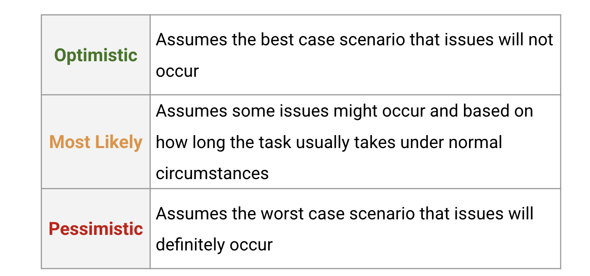
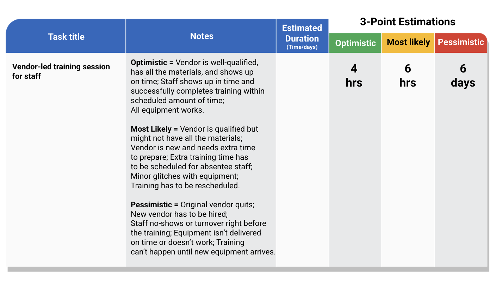
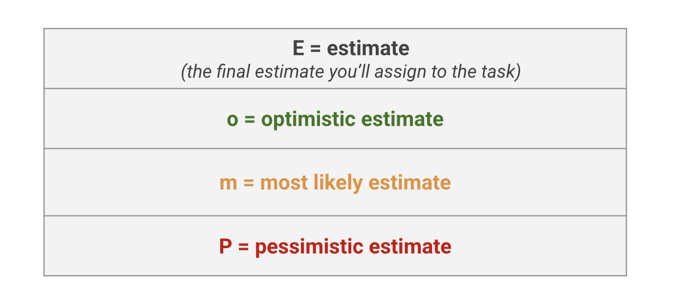
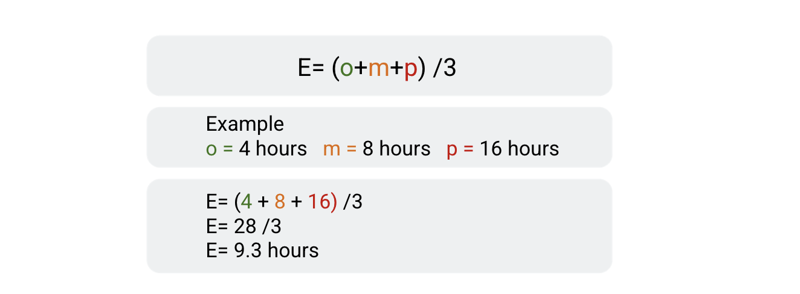
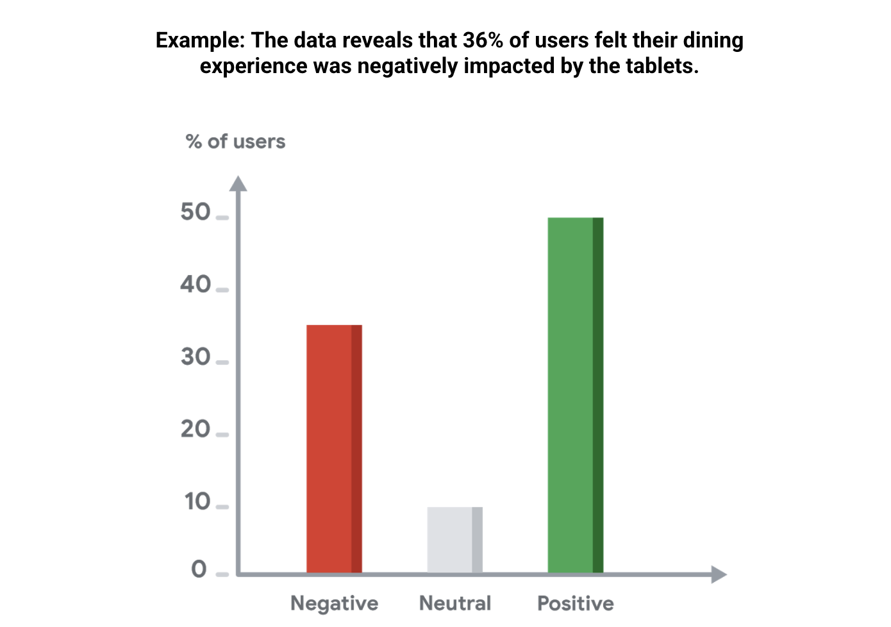

# Proyecto final: Aplicación de la gestión de proyectos en el mundo real

## Iniciar un proyecto

### Creación del estatuto de un proyecto

#### Estatutos del proyecto: Propósito y componentes

El pensamiento estratégico implica analizar la documentación y hablar con los interesados para fundamentar las decisiones
que se basan en la información disponible para ti.

Un estatuto del proyecto es un documento formal que define con claridad el proyecto y destaca los detalles necesarios para
alcanzar los objetivos del proyecto.

El gerente de proyectos crea el estatuto durante la fase de iniciación, que es la primera fase del ciclo de vida del proyecto.

El estatuto del proyecto te ayuda a organizar la información vital del proyecto, a crear un framework para el trabajo que
hay que hacer y a comunicar esos detalles a las personas necesarias. También es útil como una referencia a lo largo del
ciclo de vida del proyecto, ya que puede ayudar a los interesados a reajustar el alcance, los objetivos y los costos del
proyecto.

El estatuto del proyecto contiene información clave sobre un proyecto, como el resumen, los objetivos y los entregables,

El objetivo del resumen es proporcionar una perspectiva general del proyecto y destacar los objetivos que esperas lograr,
Los resúmenes deben ser breves, de unas pocas oraciones como máximo, y directos.

Después del resumen vienen los objetivos y los entregables del proyecto.

Los objetivos del proyecto hacen referencia a los resultados deseados del proyecto, y los entregables hacen referencia a
las tareas específicas y a los resultados tangibles que permiten al equipo cumplir con los objetivos del proyecto En general,
los objetivos del proyecto abordan el resultado global que los interesados pretenden alcanzar. Están determinados por las
aportaciones de los interesados y el gerente de proyectos. Por ejemplo, parte de los objetivos anuales de crecimiento y
expansión de Sauce and Spoon es la puesta en marcha del proyecto del lanzamiento de tabletas, y uno de los entregables del
proyecto es la instalación con éxito de las tabletas en dos restaurantes.

La última parte del estatuto del proyecto que cubriremos aquí es el alcance. Recuerda que el alcance se refiere a los
límites de un proyecto. Junto con el alcance, el estatuto contiene información sobre el trabajo que está fuera del alcance,
Los detalles que no contribuyen a los objetivos del proyecto se consideran fuera de alcance.

Un estatuto del proyecto es un documento formal que define con claridad el proyecto y destaca los detalles necesarios para
alcanzar los objetivos del proyecto. Los componentes principales de un estatuto del proyecto son el resumen, los objetivos,
los entregables y el alcance. Un estatuto también puede incluir otras secciones, como el presupuesto y las métricas de costo
y éxito.

#### Estatutos del proyecto: Alineación de partes interesadas

Cada vez que comuniques los detalles de tu proyecto, debes pensar en tu público y en qué información es
importante para ellos. Al agregar detalles a un estatuto del proyecto, hazte las siguientes preguntas
sobre tu público, y, si es útil, intenta responder a estas preguntas en tus notas:

¿Quiénes son tus interesados? En este caso, tu público incluye a todos tus principales interesados.
¿Qué detalles son más importantes para ellos?
¿Hay detalles del proyecto acerca de los cuales ellos podrían estar en desacuerdo?

Una vez que hayas identificado los que creas que son detalles importantes, revisa tu estatuto y asegúrate
de que todos esos detalles estén incluidos. A partir de ahí, podrás presentar el estatuto a tus interesados
y confirmar que todos estén de acuerdo con la información del proyecto.

El estatuto del proyecto: además de servir como un documento formal que define el proyecto, un estatuto
del proyecto es también una herramienta de alineación. En este caso, la alineación se refiere a alcanzar
un acuerdo entre dos o más partes. Una causa común del fracaso de un proyecto es la desalineación entre
los interesados sobre los detalles del proyecto. La desalineación también puede suceder entre tú y tus
interesados cuando tienes visiones diferentes para el proyecto. Por eso es tan importante alinearse con
tus interesados antes de comenzar el trabajo.

Los interesados no suelen participar en las tareas cotidianas de la ejecución del proyecto, por lo que
es fundamental dedicar tiempo durante la fase de iniciación a crear un estatuto del proyecto que establezca
con claridad los detalles de un proyecto. Esto ayuda a garantizar que el equipo trabaje para obtener
los resultados esperados por todos los interesados y no solo por algunos de ellos.

Normalmente, la fase de iniciación es el momento ideal para realizar cambios en el proyecto. A medida
que el proyecto avanza en las fases de planificación y ejecución, es posible que los cambios sustanciales
requieran deshacer el trabajo ya realizado. Por eso, en esta primera fase del ciclo de vida del proyecto,
no hay que tener miedo de hacer ajustes.

Aquí hay un ejemplo de cómo podrías experimentar la desalineación. Supongamos que estás hablando de los
principales objetivos del proyecto de Sauce and Spoon. Un interesado tiene la visión de poder automatizar
por completo, con el tiempo, la experiencia de pedidos con las tabletas. Otro interesado tiene un objetivo
diferente. En lugar de automatizar por completo los pedidos, quiere que el proyecto de lanzamiento de
tabletas mejore la precisión de los pedidos. Para ayudar a resolver esta situación, un gerente de
proyectos podría facilitar una discusión entre los dos interesados para tratar de llegar a un acuerdo
para confirmar la alineación sobre los objetivos del proyecto.

Cuando presentas un estatuto del proyecto a tus interesados, es importante recopilar feedback e identificar
dónde hay desalineaciones. Luego, puedes realizar cambios para abordar esas desalineaciones. Si tú y
tus interesados se toman el tiempo necesario para definir con claridad el proyecto, es mucho más probable
que obtengas los resultados que tus interesados esperan al final del proyecto. Como gerente de proyectos,
es importante registrar el feedback que recibes y documentar cualquier desalineación y sus soluciones,
Esto les permite a ti y a tu equipo del proyecto, más adelante, hacer referencia a esas decisiones.

Una forma de documentar las desalineaciones y las soluciones es crear un apéndice con un sello de tiemp
para la información nueva o actualizada. Un apéndice es una sección de contenido adicional al final
de un documento. Un sello de tiempo incluye la fecha, y en algunos casos la hora, de cuándo se creó
o se agregó el nuevo contenido al documento.

Excelente. Repasemos algunas de las ideas principales de lo que hemos hablado. Cada vez que comuniques
los detalles de un proyecto, debes pensar en tu público y en qué información es importante para ellos,
En el caso de un estatuto del proyecto, tu público está formado por tus interesados. Una causa común
del fracaso de un proyecto es la desalineación entre las partes interesadas sobre los detalles del
proyecto. Es importante tomarte el tiempo durante la fase de iniciación para crear un estatuto del
proyecto que establezca con claridad los detalles clave de un proyecto y para alinearte con tus
interesados antes de comenzar el trabajo. Y, por último, documenta cualquier desalineación y sus
soluciones en tus notas y en el estatuto del proyecto para poder consultarlos más adelante.

#### Estatutos del proyecto: Redacción de objetivos SMART

Ser capaz de escribir objetivos específicos y medibles es una parte importante de la gestión de proyectos y una buena forma
de demostrar tus habilidades de gestión de proyectos a los posibles empleadores.

Durante la fase de iniciación, algunos de los objetivos del proyecto pueden ser amplios porque no todos los los detalles
del proyecto se han determinado. Si bien está bien tener objetivos más amplios, es útil agregar especificidad cuando sea
posible. Esto se debe a que aclarar los objetivos del proyecto desde el principio puede ayudarte a evitar desajustes y a
comprender mejor el alcance, el presupuesto y el plazo del proyecto.

Los objetivos del proyecto son los resultados deseados del proyecto. Esbozar objetivos claros y específicos es un paso
importante en la creación de un estatuto del proyecto eficaz y crucial para el lanzamiento de un proyecto con éxito, por
lo que tendrás que ser capaz de identificar con precisión si un objetivo se ha cumplido o no.

Cuando tus objetivos estén claros, podrás determinar los entregables de tu proyecto. Los entregables del proyecto son
tareas específicas o resultados que contribuyen a la finalización de un objetivo. Como gerente de proyectos, es probable
que te encuentres con interesados que solo describen vagamente los resultados que desean para un determinado proyecto.

Por ejemplo, un interesado podría decirte que le gustaría que más clientes usaran un determinado servicio o que les gustaría
vender más unidades de un producto en particular. Estos son buenos objetivos, pero no son muy específicos. No sabes cuántos
clientes más, qué tipo de clientes o cuántas unidades necesitarás para cumplir los objetivos. Como gerente de proyectos, tu
rol es asegurarte de que los objetivos del proyecto estén bien definidos para que tú y tu equipo tengan una hoja de ruta clara,
Esto no solo te permite concentrarte, sino que también elimina la pérdida de tiempo y la falta de comunicación en el futuro.

Es posible crear objetivos claramente definidos con la ayuda del método SMART. El método SMART ayuda a convertir los objetivos
de tu proyecto en objetivos SMART. Recuerda, esto significa que tus objetivos son:

    Specific (específicos).
    Measurable (medibles).
    Attainable (alcanzables).
    Relevant (relevantes).
    Time-bound (de duración determinada).

Estas cualidades pueden ayudarte a medir tu éxito con mayor precisión y permitirte hacer ajustes más precisos a lo largo
del proceso.

Algunas de las prácticas recomendadas para garantizar los objetivos de tu proyecto que también son objetivos SMART:

Para hacer que un objetivo sea más *específico*, asegúrate de que proporciona respuestas a preguntas como:

    "¿Qué quiero lograr?"
    "¿Cuáles son los requisitos y las limitaciones de este objetivo?"

Para agregar especificidad a los objetivos, elije palabras en tus objetivos que puedan ser subjetivas o que se basen en
una opinión, por ejemplo, más grande, mejor o más rápido. Una vez que hayas identificado palabras subjetivas, comunícate
con tus interesados para acordar una definición de lo que en realidad significa hacer algo más grande o mejor o más rápido,

    ¿Qué implica en la práctica ser más grande o mejor?
    ¿En qué medida debería ser más rápido?

El método SMART te ayuda a hacer que tus objetivos sean más específicos al hacerlos *medibles*. Por ejemplo, si tu interesado
quiere aumentar las ganancias de la empresa, pregunta:

"¿En cuánto?"
"¿Quiere aumentar las ganancias en un 5%?"
"¿En un 30%?"

Si agregas números y cifras a tu objetivo, te resultará mucho más fácil saber cuando lo hayas conseguido. Si tienes problema
en hacer que un objetivo sea medible, investiga cómo cuantifican el éxito otras personas de tu sector. Esto se llama *benchmarking*,
que se refiere a la evaluación del éxito con respecto a la norma. Por ejemplo, hay muchas formas para medir el éxito en
el sector de restaurantes. Puedes buscar en línea información mediante consultas del siguiente tipo:

 "¿Cómo hacen los restaurantes para medir el éxito?"
 "¿Cómo se evalúan las sesiones de capacitación para empleados?"

Es probable que encuentres algunos resultados. Algunas métricas comunes incluyen:

    la tasa de rotación de las mesas o el tiempo promedio que un cliente pasa en su mesa;
    el costo de producción, que es el costo de la mano de obra más el costo total de bienes como alimentos y bebidas;
    el importe promedio de la cuenta, que es la cantidad promedio de dinero que los clientes gastan en una comida determinada.

La mayoría de los sectores, como la hostería, el sector de entretenimiento y el sector de la construcción, tendrán sus
propias métricas para el éxito. Eso también incluye el sector tecnológico. Las métricas son una parte importante de cómo
medimos el éxito.

Los objetivos SMART también son *alcanzables*, lo que significa que el objetivo es desafiante, pero no es imposible de
alcanzar. Pregúntate a ti mismo y al equipo:

    "¿Se puede hacer?"
    ¿Tienes el tiempo, los recursos y las personas disponibles para cumplir el objetivo a tiempo y dentro del presupuesto?

Si no, tendrás que hacer algunos cambios en tus objetivos.

los objetivos del proyecto deben ser *relevantes*. Pregúntate:

    "¿Tiene sentido para nosotros como empresa o como equipo de proyecto perseguir este objetivo?"

Una práctica recomendada para determinar la relevancia de tus objetivos del proyecto es darte cuenta
el grado de alineación de los objetivos de tu proyecto con los objetivos más amplios de tu empresa u
organización. Es posible utilizar una herramienta para el establecimiento de objetivos en toda la
organización llamada *objetivos y resultados clave, u OKR*. los OKR combinan un objetivo y una métrica
para determinar un resultado medible.

Por ejemplo, uno de los objetivos más amplios de Sauce and Spoon es hacer alimentos frescos y rápidos
para las familias trabajadoras de su comunidad. Así que un objetivo relevante para el lanzamiento de
la tableta de Sauce and Spoon podría ser disminuir el tiempo de permanencia del cliente en un 10%, en
promedio, en las primeras seis semanas después de la implementación. Este objetivo del proyecto ayuda
a la cadena de restaurantes a alcanzar su objetivo más grande: proporcionar comidas rápidas para los
lientes.

La última parte del framework SMART es hacer que tu objetivo *tenga un plazo determinado*. Es conveniente
que agregues una fecha límite a tu objetivo para que sepas cuándo debe estar terminado.

#### Estatutos del proyecto: Definición del alcance, los beneficios y los costos

A la hora de pensar en qué tipo de información incluir en estatuto del proyecto, siempre es bueno tener en cuenta el público
principal que lo leerá. Ya que el objetivo de crear un estatuto del proyecto es comunicarse con los interesados, ellos soluciones
tu público principal.

Si sabes que uno de los beneficios de tu proyecto puede ser de especial interés para un interesado clave, debes asegurarte
de destacar este beneficio en tu estatuto del proyecto. Es posible que los interesados que lean tu estatuto no vean los
planes de proyecto más detallados en otros documentos posteriores, por lo que es importante conseguir un consenso sobre
los elementos críticos ahora, mientras se ultiman los detalles del proyecto.

A continuación, debes establecer con tus interesados sobre el alcance, los beneficios y el costo:

*El alcance*, rápidamente, alcance se refiere a los límites del proyecto; por ejemplo, el número de restaurantes que
participan en el proyecto piloto. Los detalles que no contribuyen a los objetivos del proyecto se consideran fuera del
alcance. Para determinar lo que está dentro y fuera del alcance, piensa en lo que se necesita para lograr el objetivo del
proyecto. Ten en cuenta las siguientes preguntas:

    ¿En qué detalles del proyecto coinciden los interesados que se considerarían dentro del alcance?
    ¿Los interesados están en desacuerdo con algún elemento?
    ¿Hay algún detalle que debas designar como fuera del alcance de este proyecto en particular?

Al pensar en estas preguntas, toma notas de lo que concluyas y recurre a ellas cuando completes la sección de alcance de
tu estatuto del proyecto.

*Los beneficios y los costos* del proyecto. Los beneficios son las ganancias esperadas de un proyecto. Estos pueden ser
directos, como las ganancias monetarias, o indirectos, como una mejora en la participación o satisfacción del cliente. Los
costos se refieren al dinero gastado en las tareas del proyecto y a los precios del tiempo, los recursos y la mano de obra,
por ejemplo. Los costos pueden evaluarse y gestionarse con un presupuesto de proyecto.

Un presupuesto es una estimación de la cantidad de dinero asignado para completar el proyecto. Usarás esa información para
agregar dos listas a tu estatuto del proyecto: una lista de beneficios y una lista de costos. Por lo general, puedes encontrar
los beneficios que el proyecto aportará al caso de negocio o a la propuesta del negocio.

Por ejemplo, tu lista de beneficios para el lanzamiento de la tableta puede incluir su potencial para acelerar el servicio
y aumentar las ventas en un porcentaje estimado. Aquí hay otro beneficio. Las tabletas proporcionarán al restaurante puntos
de datos claros sobre los pedidos de los clientes y un sistema de punto de venta integrado que ayude a guiar la toma de
decisiones en el futuro.

Una lista de beneficios puede ayudarte a identificar los objetivos potenciales del proyecto que te hayas perdido. Una lista
de costos incluirá artículos que la organización tendrá que pagar para poder realizar el trabajo, como el precio de la mano
de obra o los materiales.

La enumeración de los costos ayuda a los interesados a sopesar los beneficios contra la cantidad de dinero necesaria para
obtener esos beneficios. Puedes elaborar una lista de los costos junto con los interesados para obtener las estimaciones
sobre la mano de obra, los materiales y cualquier otro factor que podría costarle dinero a la empresa durante el proyecto.

Los beneficios de un proyecto deben superar los costos. Esto es casi siempre el caso cuando se inicia o propone un proyecto,
Cuando agregas estos detalles al estatuto, ayuda a visualizarlos en un solo lugar y que los costos y los beneficios sean
muy claros para los interesados. Esta sección se usa mucho como una ayuda para asegurarse de que los interesados estén de
acuerdo en que vale la pena el dinero para llevar a cabo el proyecto.

#### Afsheen: Iniciar un proyecto de manera efectiva

El problema más frecuente que veo cuando se está en la fase de iniciación del establecimiento de un proyecto es conseguir
la alineación entre los principales interesados. Además, hay que asegurarse de que las personas adecuadas se hagan cargo
del proyecto para incentivar a los gerentes de proyectos con verdadero talento a querer sumarse al proyecto.

Me parece que la atracción es mucho más eficaz que la promoción. Quiero que el talento venga hacia el proyecto en lugar
de solo asignar el trabajo del proyecto. Eso lleva mucho trabajo. Vale la pena porque estás sentando una buena base para
un proyecto exitoso, y, en última instancia, la mejor velocidad que podrías esperar.

Durante la fase de iniciación, cuando intento perfeccionar los criterios de éxito, hago muchas preguntas. Probablemente
haya una lista de 20 de ellas. Un par de ejemplos podrían ser la comprensión del entorno: ¿Cuáles son algunos de los
escollos o riesgos del ecosistema? También intento hacer encuestas de las entrevistas, de las personas en el entorno, y
les pregunto, "¿Qué es lo que ves como un problema?" Además, planteo una serie de preguntas cuantitativas cuando corresponde,
para entender ¿a qué me estoy enfrentando en términos de medidas? "Hay muchas razones por las que los proyectos pueden
fracasar. En mi opinión, todo se reduce a lo siguiente: uno, definición del proyecto realmente pobre; dos, desorganización,
el director del proyecto no está estableciendo un framework para gestionar el proyecto; y tres, hay demasiadas personas".

A menudo, se produce el efecto de que todos quieren trabajar en el proyecto y entonces no hay responsabilidad. No todos
los interesados van a abordar el problema con la misma perspectiva. Así que retrocedo y pienso: ¿Quiénes son mis principales
interesados? Digamos que, por ejemplo, hay dos patrocinadores, los principales interesados, y que son como peras con manzanas.
Eso es un problema. En ese caso, tendré que reunirme mucho con ellos, entender el compromiso del intermediario y trabajar
realmente en ese problema de formación inicial del proyecto.

### Negociación eficaz con las partes interesadas

#### Realizar un análisis de los interesados

Casi todas las partes de un proyecto requieren las aportaciones y el acuerdo de múltiples interesados,
Por supuesto, no todos los interesados valorarán la misma información o estarán de acuerdo en las mismas
cosas. Por eso, un gerente de proyectos exitoso también necesita ser un negociador experto.

Algunos aspectos comunes del proyecto que se negocian durante el curso de un proyecto incluyen

    El alcance,
    Los costos y beneficios,
    El plazo,
    Los criterios de éxito,
    Las funciones y responsabilidades,
    Los recursos.

Esta es otra razón por la que resulta útil alinearse con los interesados desde el principio. Una buena
alineación puede ayudar a evitar algunos de estos tipos de negociaciones en el futuro.

Al principio del proyecto, es importante acordar el alcance. Es bueno recordar que muchas de las habilidades
que aplicarás aquí serán útil para negociar otros elementos en todo el ciclo de vida del proyecto,
si ese es el presupuesto, el plazo o los requisitos del producto. Te prepararás para esto y para las
negociaciones futuras mediante la creación de un análisis de los interesados.

Un análisis de los interesados es una representación visual de todos los interesados. Te ayuda a entender
quiénes son tus interesados, cuáles son sus prioridades y cómo prefieren comunicarse. Puede ayudarte
a determinar el grado de prioridad que debes dar a las necesidades de determinados interesados o metas
en el proyecto.

Los interesados tienen un interés centrado en el éxito del proyecto. Comprender a los interesados te
ayuda a descubrir las personas adecuadas para incluir en las conversaciones importantes y cómo priorizar
las diferentes necesidades de los diferentes interesados. Esto es clave para obtener el apoyo que
necesitas durante el proyecto.

Como parte de tu análisis, intenta responder a todas las preguntas que puedas sobre cada interesado,
Luego, mientras revisas tu lista, identifica qué interesados influyen directamente en el proyecto y
el nivel de interés que tiene cada uno. La influencia de un interesado está relacionada con la cantidad
de poder que tiene y cuánto puede afectar sus acciones al resultado del proyecto.

El interés se refiere a la medida en que las necesidades de los interesados se verán afectadas por las
operaciones y los resultados del proyecto. Por ejemplo:

si un interesado tiene un alto interés e influencia, puede ser muy importante que lo mantengas informado
y te asegures de que sus objetivos para el proyecto sean la máxima prioridad.

Si tiene intereses bajos y baja influencia, entonces podrías no priorizar una de sus preferencias personales
para el proyecto.

Si se traza una tabla de poder e interés, se sabrá con mayor claridad a quién dar prioridad y cuál es
la mejor forma de abordar las negociaciones con cada interesado. Una vez que tengas una idea clara de
quiénes son tus interesados y de qué papel desempeñan en el éxito del proyecto, puedes usar esta
información para apoyar las negociaciones de tu proyecto.

En una de las negociaciones más importantes, tratarás de definir y mantener el alcance del proyecto,
Los interesados pueden presionar para que se agregue algo más al alcance, y es tu trabajo como gerente
de proyectos negociar lo que sea realista dentro de las expectativas del presupuesto y el plazo.

#### Gestionar a los interesados Consejos y conclusiones

La gestión de los interesados es el proceso de mantener buenas relaciones con las personas que tienen
la mayor influencia en tu trabajo. La gestión eficaz de los interesados es una parte integral de todo
proyecto porque fomenta la buena comunicación, el trabajo en equipo, la confianza entre los miembros
y mucho más. Sin una gestión eficaz de los interesados, es menos probable que un proyecto tenga éxito.

*Gestión de los interesados durante el inicio del proyecto:*

*Identificar a todos los interesados al comienzo de tu proyecto o iniciativa.* Involucra a todos lo
antes posible para establecer expectativas, responsabilidades y límites claros. Identificar a tus
interesados desde el principio les da tiempo suficiente para expresar cualquier inquietud que puedan
tener sobre el proyecto o su papel dentro de él. Si tienen un sentido de propiedad desde el principio,
es más probable que tus interesados acepten tus roles, brinden información adecuada y ayuden a eliminar
los obstáculos para permitir que el proyecto avance.

*Mantener clara la visión del proyecto.* La visión del proyecto describe la necesidad que satisface
el proyecto. Es importante tener una visión clara y específica del proyecto porque, como hemos aprendido,
los interesados pueden ejercer presión para aumentar los requisitos, acortar el plazo o recortar los
recursos. Asegurarse de que los interesados hayan acordado la visión y, más específicamente, lo que
parece "hecho" proporciona claridad para todos los involucrados en el proyecto. La inclusión de
interesados altamente influyentes en los procesos de planificación estratégica garantizará que todos
los miembros del equipo estén alineados con la visión del proyecto.

*Equipa a tus interesados con recursos fáciles de usar en todo momento.* Esto podría significar crear
un informe de una página (un documento de una página que proporciona una descripción general de tu
proyecto) o un informe de estado semanal con la información más reciente y enlaces a los principales
artefactos del proyecto. También puede significar garantizar que todos tengan acceso a la documentación
necesaria.

*Gestión de las partes interesadas a lo largo del ciclo de vida del proyecto:*

A medida que avances en el ciclo de vida del proyecto, deberás mantener buenas relaciones con todos
los interesados para asegurarte de que estén satisfechos yy colaboren con el equipo. Las siguientes
estrategias pueden ayudarte a conocer los intereses, las preocupaciones y las preferencias de comunicación
de tus interesados y solicitar su ayuda a lo largo del ciclo de vida de tu proyecto:

*Averigua qué les importa a los interesados y por qué.* Pregunta a tus interesados: ¿Cuáles son tus
prioridades y objetivos más importantes? ¿Qué papel te gustaría desempeñar en este proyecto? ¿De qué
manera te respaldará este proyecto y cómo respaldará tus prioridades más importantes?

*Ajusta la frecuencia y el enfoque de tu comunicación según las funciones y preferencias de los*
*interesados.* Diles a tus interesados: Así es como pienso mantenerte informado, ¿te parece bien?

*Recurre a la ayuda de los principales interesados cuando sea necesario.* Pregunta a tus interesados:
¿Con quién más recomiendas que me ponga en contacto acerca de este proyecto?

*Una vez que los interesados tengan un interés personal, hay que plantearles los problemas del proyecto.*
Pregunta a tus interesados: ¿Cómo manejarías esta situación? ¿Qué soluciones te vienen a la mente?

*Conclusión clave:*

Los interesados pueden ser tus mayores aliados como gerente de proyectos. Practicar tus habilidades
de gestión de los interesados puede ayudarte a obtener el apoyo de ellos y a mantenerlos comprometidos
a lo largo de tu proyecto.

#### Encontrar soluciones de beneficio mutuo

Como gerente de proyectos, tienes muchas herramientas útiles a tu disposición, pero incluso los
negociadores más hábiles tienen que poner a prueba sus habilidades para cumplir con los objetivos del
proyecto y conseguir la satisfacción de los interesados.

Habrá ocasiones en las que tengas que negociar un aspecto delicado de los objetivos o el alcance del
proyecto, o podría haber un desacuerdo entre los interesados o podrías estar en desacuerdo con algo
que los interesados quieren. Tendrás que usar técnicas de negociación para que un desacuerdo pase del
estancamiento a la solución.

Cuando se trata de la gestión de proyectos, La persuasión y la negociación son herramientas constructivas
que se pueden usar para mejorar la comunicación, aclarar los deseos y las necesidades y lograr soluciones
viables para todos los involucrados. Ser hábil en la persuasión y en la negociación también aumentará
tu nivel de influencia. Es importante que veas a las personas con las que negocias como tus colegas y
compañeros, no como adversarios. Por eso hay que hacer un análisis de interesados para que puedas conocerlos
como personas, con sus propios trabajos y responsabilidades, y como asociados que quieren que el proyecto
tenga éxito.

Cuando se produzcan conflictos o desacuerdos entre tus interesados, lo mejor es abordar esos problemas,
crear un consenso entre los grupos de interesados y reducir los conflictos. Una forma de hacerlo es
encontrar soluciones que sean de beneficio mutuo. El beneficio mutuo es cuando todas las partes
involucradas obtienen algún tipo de beneficio o de ventaja.

Por ejemplo, digamos que hay un desacuerdo sobre el número de personas que hay que contratar para un
proyecto. Te gustaría contratar a cinco, pero un interesado quiere limitar el número de personas a
tres. Una solución que ofrecería un beneficio mutuo podría ser la instalación de un software automatizado
que asumiera parte del trabajo. Otra solución podría ser ajustar el plazo o las expectativas de manera
que no se necesiten cinco personas para alcanzar el objetivo del proyecto. El interesado puede tener
el tamaño deseado de equipo más pequeño, y puedes completar las tareas con menos personas.

El objetivo es alcanzar una solución que maximice los beneficios, minimice las pérdidas y sea justa
para todos. Haz una lluvia de ideas de todas las opciones posibles que cumplan con estos criterios,
Luego, durante las negociaciones, podrás presentar múltiples alternativas y elegir una que beneficie
a todos en cierta medida. Ahora bien, por mucho que quieras satisfacer a tus interesados, es igual
de importante que pienses en las concesiones que estás dispuesto a hacer.

Para hacerlo con éxito, necesitas comprender las prioridades del proyecto. Debes saber qué es lo más
importante respecto del alcance, el plazo y el presupuesto. Por ejemplo, si hay un plazo específico
que se debe cumplir, habrá que negociar cualquier cambio en el alcance que podría hacer que el proyecto
se exceda de ese plazo. Si el producto necesita tener un aspecto o funcionar de una manera determinada,
los requisitos son una prioridad absoluta, y se podrían negociar aspectos del presupuesto o del plazo
para respetar el alcance.

Una herramienta común que se usa para determinar las prioridades es el modelo de la restricción triple,
o el triángulo de hierro. La restricción triple te ayudará a decidir si una solicitud de proyecto es
aceptable y qué impacto tendrá.

Repasemos. Persuasión y la negociación son herramientas constructivas que se pueden usar para mejorar
la comunicación, aclarar los deseos y las necesidades y lograr soluciones viables para todos los
involucrados. El objetivo es alcanzar un beneficio mutuo, que es cuando todas las partes involucradas
obtienen algún tipo de beneficio o ventaja. Muy bien, eso es todo por ahora.

#### Negociación del alcance con las partes interesadas

Incluso después de haber establecido el alcance del proyecto, es posible que algunos interesados deseen
analizar cómo ajustarlo. Pueden pensar que el alcance actual del proyecto requerirá demasiado trabajo
con muy pocos recursos, que el cronograma no es realista dado el alcance o que el proyecto requiere
tareas y objetivos adicionales. Cuando tus interesados soliciten revisar el alcance de un proyecto,
debes reunirte con ellos para que puedan plantear sus inquietudes. Saber cómo facilitar de manera
efectiva las negociaciones del alcance te permitirá llegar a soluciones adecuadas para todos.

- Consejos para examinar el alcance con los interesados

*Entender las motivaciones.* Antes de tu discusión, considera las motivaciones de cada interesado para
querer ajustar el alcance del proyecto. Algunas de esas motivaciones son presupuestarias (como el
deseo de reducir los costos del proyecto), otras son interpersonales (como el deseo de disponer de
más tiempo para completar las tareas) y otras están relacionadas con objetivos personales de la
carrera (como mantener su puesto actual o la lucha por un ascenso). Comprender las motivaciones de los
interesados puede ayudarte a trabajar juntos para llegar a un acuerdo.

*Plantea la situación.* Comienza la discusión con una reflexión sobre por qué se están reuniendo,
Recuerda a tus interesados por qué estás involucrado en este proyecto y asegúrales que todos comparten
un objetivo común.

*Escucha primero.* Escucha lo que tus interesados tienen que decir antes de presentar tus puntos de
vista. Esto demostrará tu deseo de entender la perspectiva de la otra parte. Reconocer su punto de
vista puede facilitar que acepten tus sugerencias o soluciones cuando sus ideas u opiniones difieren
de las tuyas.

*Haz preguntas para definir los objetivos.* Sé minucioso y haz todas las preguntas que consideres
necesarias para entender lo que quiere el interesado. Esto podría incluir que definan sus objetivos
comerciales o de clientes. Esfuérzate por obtener detalles específicos y medibles de tus interesados,
de modo que más adelante puedas determinar si has alcanzado con éxito sus objetivos. Un lenguaje medible
(en lugar de subjetivo o poco claro) te ayudará a definir los objetivos. Un ejemplo de un objetivo
específico y medible podría ser: “Queremos reducir el tiempo que tardan los clientes en suscribirse
a nuestro boletín informativo en al menos un 30%”.

*Explica el "porqué" antes del "qué".* Cuando intentes persuadir a los interesados, o a cualquiera,
en realidad, para que vean las cosas a tu manera, explica las razones de tu solicituda antes de describir
lo que quieres. Por ejemplo, empieza por explicar el valor que se podría agregar a tu empresa o proyecto
definiendo el alcance de una manera en particular. Si los interesados entienden primero de dónde vienes,
es más probable que concedan tu solicitud cuando la hagas.

*No los abrumes.* A veces es mejor exponer tu caso y dar tiempo a los demás para que respondan. Después
de haber presentado tus razones, posición y solicitud, retírate un poco para darle tiempo a tu audiencia
de procesar lo que has dicho. Piensa en tu silencio, en esta situación, como una señal de respeto hacia
tus interesados; les demuestra que quieres escucharlos. Y, si se callan por un rato, significa que has
estimulado el pensamiento.

*Sé creativo.* Trabajar para encontrar soluciones alternativas puede convertir rápidamente una negociación
pesada en un esfuerzo de equipo inspirador. Para encontrar soluciones reales a los estancamientos de
la negociación, piensa de forma creativa en todos los aspectos del proyecto. Es posible que descubras
que hay más de una solución para las diferentes opiniones.

*No lo hagas personal.* Concéntrate siempre en lo que es bueno para el proyecto. Si las consideraciones
personales entran en la discusión, replantea la conversación mencionando hechos objetivos.

*Busca un resultado beneficioso para todos.* Por último, considera lo que se necesita para que la otra
parte esté satisfecha. Luego, intenta identificar una manera de asegurarte de que tú también estés
satisfecho. Habrá ocasiones en las que una de las partes tenga que ceder más que la otra, pero el
objetivo debe ser siempre un acuerdo de beneficio mutuo (un acuerdo que beneficie a todas las partes
involucradas).

#### Lograr un resultado beneficioso para todos

El objetivo al negociar con los interesados debe ser siempre lograr un resultado beneficioso para todos
o un acuerdo de beneficio mutuo. Este es un acuerdo que beneficia a todas las partes involucradas. Sin
embargo, los acuerdos de beneficio mutuo no son solo para los interesados internos. Son una parte
importante del proceso de negociación con vendedores, contratistas, proveedores, entre otros.

- Mejores prácticas para llegar a un acuerdo de beneficio mutuo

*Compartir la información.* A veces, en las negociaciones, una o ambas partes pueden pensar que tienen
que ocultar información para no revelar demasiado. Sin embargo, esto no es muy eficaz. Lo mejor es
esforzarse por mantener las líneas de comunicación abiertas, en las que cada parte comparta sus
preocupaciones y preferencias. Por ejemplo, si el último proveedor de tu equipo te proporcionó productos
de baja calidad, puedes expresar esto como una preocupación para que tus expectativas sobre la calidad
queden claras.

*Hacer preguntas y escuchar activamente las respuestas.* Así como compartiste tus inquietudes y expectativas,
puedes hacer preguntas a la otra parte para aclarar cuáles son sus inquietudes y expectativas. De esa forma,
ambas partes habrán compartido toda la información necesaria para lograr un acuerdo de beneficio mutuo.

*Proponer múltiples opciones siempre que sea posible.* En las negociaciones, presentar solo una opción
o solución puede llevarte al fracaso porque la otra persona puede pensar que tu primera oferta es la
única. Si la otra parte rechaza todas tus propuestas, pídele que te comunique cuál es la que más le
gusta, ya que eso puede orientarte a encontrar una solución que funcione para todos.

#### Stanton dice: Gestión de los cambios de alcance con los interesados

Hola. Soy Stanton, gerente del programa en YouTube. Un gerente del programa en YouTube básicamente trabaja en un montón
de proyectos diferentes, pero los reúne en un programa que puede ayudar a las personas a entender lo que está sucediendo
en cualquier momento, ya sea el desarrollo o los requisitos o las pruebas del producto, todo lo que tiene que confluir
para que un proyecto funcione bien.

Un cambio de alcance puede suceder en cualquier momento, y descubrí que a menudo sucede cuando no quieres que suceda, por
lo general justo antes de un lanzamiento. Este es un proyecto en el que estaba trabajando en una startup antes de llegar
a YouTube, Se estaba implementando una nueva aplicación que tenía que ver con los porcentajes de peso corporal. La gestión
de los interesados es realmente importante como gerente del programa porque es posible que los interesados no siempre sepan
lo que está sucediendo. En este caso, con nuestro director ejecutivo, estaba realmente centrado en conseguir lanzáramos
el producto, mientras pensábamos en todas las relaciones públicas y el marketing y todo lo que iba a anunciar una vez que
todo entrara en funcionamiento. Vio eso específico con los gráficos y realmente quería que se cambiara. Esto es algo que
sucede mucho. Puedes suceder un cambio de requisitos en el último minuto. Encuentras algunas formas de asegurarte de que
tu cliente o los interesados sigan contentos con lo que puedes producir. En este caso, lo que se terminó haciendo fue
volver a nuestros desarrolladores, obtuvimos una estimación de cuánto tiempo creían que llevaría hacer ese cambio, y eso
nos llevó a superar los plazos que teníamos en mente. Así que se nos ocurrieron unas cuantas propuestas diferentes, y lo
que terminó sucediendo fue que como se fijó la fecha del lanzamiento, no había forma de que pudiéramos hacer todos los
cambios que él quería a tiempo para el lanzamiento. Así que negociamos y dijimos: "Oye, los tendremos así en el
lanzamiento, pero según las estimaciones que recibimos, podremos tenerlos listos en otras dos semanas, y después haremos
otro lanzamiento. No debería ser un gran problema. Solo será un cambio después del lanzamiento inicial".

Cuando se trata de los interesados, siempre habrá algunas cosas que quieran hacer más que otras. Cuando gestionas el alcance,
especialmente si surge algo de última hora, puedes intentar clasificarlo dentro de ese nivel de prioridad. Lo único que
también agregaría y sobre lo que advertiría es que no se puede conseguir nada gratis, así que, si tienes un cambio en el
alcance, tienes que asegurarte de volver a mirar esa prioridad y ver qué es lo que realmente se elimina debido a lo nuevo
que se incorpora. Acuden a ti porque eres un gerente de proyectos o un gerente del programa.

#### Ejercer influencia en las negociaciones

El Dr. Jay Conger enumera estos cuatro pasos para influir con eficacia:

    Establecer la credibilidad
    Un marco para intereses comunes
    Proporcionar evidencia
    Conectarse emocionalmente

Una forma de aplicar estos cuatro pasos es formar una coalición. Una coalición es una alianza temporal o una asociación
de personas o grupos para lograr un propósito común o para participar en una actividad conjunta. Cuando dos o más personas
abogan juntas por una idea, son capaces de ejercer más influencia que si intentan actuar solas.

Formar una coalición con el grupo adecuado de personas es una técnica de negociación poderosa y eficaz. Por ejemplo,
piensa en algunos de los principales interesados que identificaste anteriormente en el proyecto de Sauce and Spoon. ¿Con
cuáles podrías formar una coalición para que te ayuden a negociar uno de los elementos fuera del alcance que se solicitó?
La creación de una coalición aumenta tu credibilidad al involucrar a otras personas que apoyan tu objetivo.

Las personas de tu coalición pueden ayudarte a encontrar intereses comunes y aportar pruebas. Además, puedes conectar
emocionalmente al incluir a alguien que tenga una relación positiva con el interesado o que entienda al interesado y al
objetivo lo suficientemente bien para establecer una conexión.

Una coalición eficaz incluye personas con la combinación adecuada de influencia o poder e interés. En otras palabras,
identifica a las personas que pueden ayudarte a lograr tu objetivo a través de sus intereses creados y de la experiencia
en el tema de tu proyecto. También puedes ir equilibrando tu coalición con personas que tengan un alto nivel de poder en
tu organización para ayudar a influir y conseguir que las cosas se hagan.

Un análisis de los interesados es una herramienta útil para ayudar a guiar la formación de coaliciones. Una vez que hayas
decidido quién es una buena opción para tu coalición, ponte en contacto con ellos y pide su apoyo. Una buena forma de
hacerlo es a través de un correo electrónico bien redactado, pero también puedes preguntar en persona o con una llamada
telefónica, el método que consideres más apropiado. Cuando hagas tu solicitud, expón con claridad el problema que estás
intentando resolver, explica qué aspecto del proyecto se está negociando. Luego, pregúntales si podrían considerar el
apoyo a tu posición o solución y explica en qué consiste. Y, por supuesto, consulta a las fuentes de poder o interés de
esa persona que identificaste.

Por ejemplo, si estás negociando el plazo del proyecto, podrías decir algo como: "El momento del lanzamiento afectará al
horario comercial, y tu experiencia en la gestión de proyectos de restaurantes durante todo el año podría ser útil para
explicar por qué hay que reconsiderar este factor". Esto le hará saber que lo valoras, por qué lo impacta y por qué crees
que puede ser de ayuda específica para ti.

## Desarrollar un plan de proyecto

### Identificar tareas e hitos

#### Identificar las tareas del proyecto: Análisis de la documentación

La documentación útil incluye estatutos de proyectos, correos electrónicos y planes de proyecto anteriores que una empresa
podría tener disponibles cuando te unes a una nueva organización o cambias a un nuevo proyecto.

Un plan de proyecto puede ser útil para cualquier proyecto, grande o pequeño, ya que te ayuda a documentar el alcance, las
tareas, los hitos, el presupuesto y las actividades generales para mantener el proyecto en marcha. En el centro del plan
de proyecto está el cronograma del proyecto. El cronograma es tu guía para hacer estimaciones de tiempo para las tareas
del proyecto, determinar los hitos y supervisar el progreso general del proyecto.

Uno de tus trabajos principales como gerente de proyectos es identificar todas las tareas del proyecto, calcular cuánto
tiempo llevará cada tarea y realizar un seguimiento del progreso de cada una. Entonces, ¿cómo haces para agregar tareas
e hitos al plan por primera vez? podrias revisar los objetivos y entregables en el estatuto del proyecto. Luego, realizar
una lista de todos los elementos que tienen tareas o hitos asociados a ellos. Los hitos son puntos importantes dentro del
cronograma que indican el progreso. Suelen corresponderse con un entregable o una fase del proyecto, mientras las tareas
del proyecto son actividades que se deben realizar en un período establecido de tiempo y se asignan a diferentes miembros
del equipo de acuerdo con los roles y las habilidades de cada persona.

Para alcanzar un hito, tu equipo y tú deben completar ciertas tareas. Por ejemplo, uno de los entregables del proyecto de
Sauce and Spoon es promocionar los nuevos menús para tabletas con letreros en las mesas y correos electrónicos masivos. En
este caso, un hito podría ser la finalización de este entregable, que incluiría todas las tareas que se requieren para
conseguir la aprobación de las versiones finales de los materiales de marketing y confirmar las fechas de envío masivo del
correo electrónico. Algunas de estas tareas podrían incluir la redacción de varios borradores de los diferentes materiales
de marketing, generar una lista de correo electrónico y programar los correos electrónicos para que se envíen en las fechas
correctas. Para cada entregable, pregúntate lo siguiente:

    ¿Qué pasos debemos dar para lograr esto?

Los pasos se convertirán en las tareas individuales que deben completarse. Dirijamos nuestra atención a otro producto de
Sauce and Spoon: la implementación de una encuesta posterior a la cena para evaluar la satisfacción del cliente.

    ¿Qué pasos debe seguir para lograr este entregable?

Es posible que deba asignar a un miembro del equipo para desarrollar una encuesta. También deberás determinar cómo entregar
la encuesta y crear un proceso para llevarla a cabo.

Estos son solo algunos ejemplos de las muchas tareas que deberás completar para para lograr el entregable. Es tu trabajo
ayudar a descubrir el resto de las tareas. ¿Cómo descubres más tareas? Además del estatuto del proyecto, existen otras
formas comunes de documentación que pueden ayudarte a identificar tareas. Por ejemplo, puedes pedir a los interesados o
colegas que compartan correos electrónicos o un plan de proyecto anterior para un proyecto similar.

Analicemos cómo estos pueden ser útiles a medida que creas tu lista de tareas. Los correos electrónicos relacionados con
el proyecto pueden proporcionar mucha información útil de donde obtener tareas. Dado que gran parte de la comunicación en
el lugar de trabajo se realiza a través del correo electrónico, pide que te envíen correos electrónicos relacionados que
contengan debates sobre los detalles del proyecto. Estos correos electrónicos pueden ayudarte a descubrir tareas y también
a identificar miembros del equipo con quienes conectarte si tienes preguntas adicionales.

También es útil revisar un plan de proyecto anterior para una iniciativa similar y averiguar qué tipo de tareas se
incluyeron. Por ejemplo, si eres un gerente de proyectos encargado de lanzar un nuevo producto, podrías preguntarle a un
colega con experiencia en el lanzamiento de otros productos para la misma empresa que comparta su plan de proyecto como
ejemplo. O, si tu proyecto incluye algún trabajo de construcción, podrías preguntar a tus colegas sobre proyectos no
relacionados que también tenían componentes de construcción.

Los planes de proyectos anteriores pueden brindarte una inspiración útil a medida que creas tu propia lista de tareas,
También pueden ayudarte a identificar la posible duración de las tareas, los expertos en la materia e incluso los proveedores
que pueden ser útiles para tu proyecto.

Mientras revisas la documentación del proyecto, toma nota de la información que sugiera otras tareas que tu equipo debería
completar para ejecutar los entregables del proyecto. Durante este proceso, hazte preguntas como estas:

    ¿Hay una gran tarea en la que están trabajando muchas personas que podría dividirse en tareas más pequeñas asignadas a
    los individuos?
    ¿Hay señales que implican que las tareas anteriores deben completarse primero?

Por ejemplo, un entregable como «instalar tabletas» podría implicar seleccionar un proveedor de tabletas como una tarea
previa.

#### Consejos para definir las tareas del proyecto

El proceso de identificar las tareas del proyecto y definirlas es algo que requiere práctica. Dividir las tareas en partes
viables es un desafío porque tienes que decidir qué tareas pueden requerir subtareas adicionales y cuáles no. Por ejemplo,
si estás gestionando una mudanza a través del país, no necesitas analizar la tarea de descargar las cajas del automóvil para
ver qué caja debe moverse primero. Sin embargo, es posible que debas dividir las tareas de la mudanza en pasos más pequeños
y detallados. A medida que progreses en tu carrera, mejorarás en el desglose de las tareas.

- Definir las tareas del proyecto en una o dos oraciones

Cuando escribas descripciones de las tareas del proyecto, redúcelas a una o dos oraciones. Si descubres que la descripción
de una tarea determinada debe ser más larga que una o dos oraciones, esto indica que la tarea es compleja y podría dividirse
en tareas más pequeñas o que podría necesitar una aclaración adicional.

- Examinar las dependencias de las tareas del proyecto

Cuando veas cómo puedes dividir ciertas partes del proyecto en tareas, ten en cuenta las dependencias de las tareas o lo
que debe completarse o entregarse de una persona a otra antes de que se pueda comenzar el trabajo en cada tarea. Identificar
las dependencias puede ayudarte a decidir cuánto se debe dividir una tarea. Por ejemplo, si estás gestionando un proyecto
que incluye una ceremonia de premios y una de las tareas es preparar el escenario, las dependencias para esta tarea podrían
incluir obtener estimaciones de un contratista audiovisual (AV), adquirir el equipo necesario y construir el telón de fondo
del escenario.

- Obtener ayuda de los miembros del equipo

A menudo, es útil que tu equipo participe en el proceso de desglose de las tareas. Es posible que tengas una reunión en la
que debatas cada objetivo general o tarea importante con el equipo. De esta manera, los miembros del equipo pueden presentar
diferentes perspectivas a medida que trabajan juntos para dividir las tareas. Por ejemplo, si alguien de tu equipo tuvo
experiencia en un proyecto similar, es posible que sugiera que una determinada tarea se divida en tres tareas diferentes.

- Definir las tareas del proyecto por la cantidad de tiempo que tardarán en completarse

Definir las tareas del proyecto por la cantidad de tiempo que se espera que lleven revelará cualquier tarea especialmente
larga. Si se espera que una tarea lleve mucho tiempo, podría indicar que hay subtareas adicionales que deben definirse. La
identificación de tareas por tiempo es útil para programar otras tareas o eventos en torno a las tareas más largas. Esta
estrategia también te ayuda a determinar los hitos adecuados, ya que estos suelen ser la culminación de una serie de tareas,
Reconocer la finalización de una tarea grande y larga también es una excelente manera de celebrar el éxito, aprender del
proceso y mantener el proyecto en marcha.

- Identificar las tareas del proyecto por sus factores «terminados»

Comienza con el final en mente: ¿Qué significa que la tarea se considere «terminada»? A partir de ahí, puedes trabajar
hacia atrás para ver si omitiste algún paso e identificar puntos de control para completar durante el proceso.

#### Identificar las tareas del proyecto: Realizar una investigación en línea

El conocimiento del dominio se refiere al conocimiento de una industria, tema o actividad específica. Si no estás familiarizado
con el dominio de un nuevo proyecto, analiza la documentación de apoyo del proyecto que te ayudará a ampliar tus
conocimientos. Habrá momentos a lo largo de tu carrera en los que serás nuevo en una organización o industria. Es posible
que te asignen a un proyecto que no se parezca a nada que hayas gestionado, y eso está bien. Los nuevos desafíos pueden
ser una parte realmente emocionante del trabajo.

Otra clave del éxito cuando se trabaja en un proyecto desconocido es saber dónde encontrar información útil que pueda
ayudarte a aumentar tu conocimiento del dominio. Aquí hay un ejemplo. Supongamos que te contrataron para gestionar proyectos
en la industria de la banca privada.

Para gestionar con éxito estos proyectos, necesitarás una comprensión básica de cómo funciona la banca privada. Esto incluye
cómo los clientes abren cuentas, las operaciones administrativas y cómo se verifican las confirmaciones comerciales, para
citar algunos ejemplos. Y, en el caso de Sauce and Spoon, necesitarás una comprensión básica de la industria de los
restaurantes, como saber el promedio de comensales y el tiempo de rotación de mesas.

De nuevo, no necesitas ser un experto en tu proyecto, pero familiarizarse con las diferentes industrias y los tipos de
proyectos es una habilidad valiosa que demuestra tu versatilidad. Tener conocimiento de la industria también puede ahorrarte
tiempo en proyectos futuros dentro de esa industria, ya que no tendrás que hacer tantas preguntas ni investigar tanto. Dicho
esto, si eres nuevo en una industria u organización, nadie esperará que tengas todas las respuestas de inmediato, Una forma
de ayudar a desarrollar tu conocimiento del dominio cuando recién comienzas con la planificación del proyecto es a través
de la investigación en línea.

La investigación en línea puede ayudarte a aumentar tu conocimiento de los términos, las técnicas, los procesos y mucho
más, todo lo cual puede ser útil si te embarcas en un nuevo proyecto. Esto te permite investigar sobre cómo otras
organizaciones han manejado proyectos similares. También es una oportunidad para inspirarse en sus éxitos y para aprender
de sus errores.

Entonces, ¿a qué debes apuntar cuando investigues para un proyecto determinado? Repasemos algunos consejos que pueden
ayudarte a comenzar:

Primero, intenta buscar en línea para encontrar cobertura de noticias sobre proyectos similares en otras empresas. Por
ejemplo, puedes buscar artículos de noticias que se centren en grupos de restaurantes que hayan agregado capacidades de
tabletas para tomar pedidos en sus restaurantes. Experimenta con términos de búsqueda como «noticias sobre tabletas de
menú» o «noticias sobre tabletas en restaurantes» para encontrar artículos de noticias pertinentes. Mientras leas, toma
nota de los datos interesantes.

¿La empresa experimentó algún resultado sorprendente después del lanzamiento de su producto? ¿Se encontraron con obstáculos
inesperados? Si es así, toma nota de esto y decide si hay tareas que debas agregar a tu proyecto para lograr resultados
similares o para evitar obstáculos parecidos. Identificar dónde podrían ocurrir éxitos o errores similares en tu propio
proyecto puede ayudarte a descubrir tareas que podrías haber pasado por alto.

También es útil buscar en línea investigaciones sobre temas relacionados con tu proyecto. Por ejemplo, puedes buscar frases
como «investigación sobre tabletas para restaurante» o «pedidos de menú digitales». Agregar etiquetas de búsqueda como
«mejores prácticas» o «conclusiones clave» pueden ayudarte a optimizar tus resultados de búsqueda.

Luego, puedes revisar la investigación pertinente para buscar información que podría ayudar a completar la planificación
de tu proyecto.

También puedes intentar investigar proyectos similares en otras industrias. Esto puede ser especialmente útil cuando eres
nuevo en un proyecto o una industria. Por ejemplo, aunque tu proyecto se centre en el uso de tabletas en un entorno de
restaurante, también puedes aprender sobre el proceso de instalación a partir de la investigación sobre el uso de tabletas
en entornos similares, como tiendas minoristas o cafeterías. Los detalles serán diferentes, pero los proyectos similares
en otras industrias pueden ser una fuente útil de ideas.

Una vez que hayas realizado una investigación inicial en línea, revisa la lista de tareas que identificaste hasta ahora
e investiga los detalles de la ejecución de ese trabajo. Por ejemplo, tal vez una de las tareas de tu lista sea elegir el
modelo de tableta que finalmente instalarás en los restaurantes. ¿Hay alguna subtarea más pequeña que tu equipo deba completar
para decidir sobre un modelo de tableta? Buscar en línea puede ayudar a descubrir cualquier tarea adicional que necesites
tener en cuenta.

#### Identificar las tareas del proyecto: Análisis de conversaciones clave

Completar tu planificación con un conjunto de tareas puede indicar a futuros empleadores que eres capaz de identificar
áreas clave de trabajo basado en documentación, investigación, conversaciones y más. También puede demostrar que eres capaz
de resumir estas tareas en un documento único y organizado, algo que es una parte clave de la gestión de proyectos.

Revisar la documentación del proyecto e investigar tu proyecto en línea puede ayudarte a identificar tareas, pero eso no
te dirá todo lo que necesitas saber. Debatir con otras personas con las que trabajes en el proyecto, como los interesados
o los miembros del equipo, puede ayudarte a descubrir tareas que todavía se deben hacer o aclarar las subtareas más pequeñas.

Comencemos con consejos para identificar las tareas a través de conversaciones grupales con miembros de tu equipo del proyecto,
Una forma de descubrir más tareas es mantener una sesión de lluvia de ideas en grupo con los miembros del equipo que probablemente
trabajarán en esas tareas. Por ejemplo, Peta podría reunirse con el equipo del proyecto de Sauce and Spoon para hacer una
lluvia de ideas sobre posibles desafíos que los camareros e invitados podrían tener con las tabletas.

Analizar estos temas como grupo puede ayudar a identificar ideas para tareas que podrían haberse pasado por alto. Otra forma de
descubrir tareas es tener conversaciones individuales con los miembros del equipo sobre tareas que probablemente sean responsables
de completar. Por ejemplo, podrías tener una conversación con un proveedor que se especializa en la capacitación de empleados
de restaurante para determinar cómo prepararse para la capacitación; o podrías comunicarte con un diseñador gráfico para ver
la creación de nuevos materiales de marketing.

Tu equipo, los proveedores externos y los ejecutivos de la compañía tienen experiencia específica y laboral que les brinda
una comprensión más profunda del trabajo necesario para completar tareas o alcanzar hitos. A través de conversaciones con
tus compañeros de equipo, es posible que aprendas que ciertas tareas son más complejas de lo que suponías o que le falta
un paso clave a un proceso específico. En este caso, aprovecha la experiencia de tus compañeros de equipo para descubrir
lo que no sabes y completar información en tu lista de tareas.

Además de conectar con tus compañeros de equipo para descubrir tareas del proyecto, también puede ser útil consultar con
otras personas en tu organización que sean expertas en tareas determinadas. Aunque es posible que estas personas no participen
en tu proyecto, podrían proporcionar una valiosa experiencia que te ayude a identificar, procesar y completar la información.

Una vez que te hayas conectado con miembros de tu equipo del proyecto y otros expertos de tu organización, examina tu lista
de tareas. ¿Todavía hay áreas donde necesitas más información? Si es así, puede ser útil tener una conversación con los
interesados clave para completar cualquier información faltante.

Como hemos debatido, los interesados principales a menudo están ocupados con otros aspectos de sus puestos de trabajo, por
lo que debes saber a quién pedirle tener una reunión. Los interesados que tienen interés o influencia de nivel medio o alto
en el proyecto son quienes más probablemente te proporcionen la información que necesitas. Algunos ejemplos incluyen interesados
que son expertos en la materia y otros que se ven directamente afectados por el resultado del proyecto, como el gerente de
tu equipo. Puedes consultar de nuevo el análisis de los interesados para lograr decidir a quién sería mejor contactar.

Una vez que hayas identificado qué interesados serán de ayuda para ti, asegúrate de estar preparado; reúne tanta información
como sea posible antes de la conversación y resume claramente las preguntas pendientes que todavía necesitan respuestas,
Durante la conversación, presenta tu investigación y la lista actual de tareas, y explica exactamente cómo puede ayudarte
a seguir adelante. Esto le dará al interesado una imagen clara de lo que has logrado hasta ahora y le ayudará a identificar
brechas o tareas faltantes que sean necesarias para lograr tu objetivo. Una buena preparación ayuda a garantizar que podrás
obtener la información que necesitas respetando el tiempo limitado de los interesados.

Ten en cuenta que las conversaciones que tengas sobre las tareas del proyecto a menudo contendrán más detalles e información
de la que necesitas para crear una lista exhaustiva, pero deberías tener en cuenta esta información adicional, ya que podría
ser útil más adelante en el proyecto. Cada tarea de tu lista debe estar lo suficientemente detallada para que puedas comprobar
el progreso e identificar los problemas desde el principio, pero no detallada al punto que tengas que revisar sin cesar tu
plan del proyecto y agobiar a tu equipo con pedidos constantes de actualizaciones sobre su trabajo.

El nivel correcto de detalle que debas incluir en tu lista de tareas variará de un proyecto a otro proyecto y de un equipo
otro. Lograr el equilibrio adecuado es una habilidad que desarrollarás a lo largo de tu carrera.

#### Ordenar tareas e identificar hitos

A esta altura, deberías tener una larga lista de tareas del proyecto. Para finalizar la lista, revisa lo que tienes hasta
ahora. Comprueba si hay alguna tarea más grande que podría dividirse en subtareas aun más pequeñas y agrega esas tareas a
tu lista.

Cuando creas que has puesto en la lista todas las tareas del proyecto necesarias en tu plan de proyecto, el siguiente paso
es acomodar las tareas en el orden en que deben completarse. Determinar el orden correcto de tareas te ayudará a asignar
las fechas de inicio y fin de cada tarea.

Si determinas la importancia, primero considera el orden básico de operaciones. En otras palabras, ¿cuál es la secuencia
natural de las tareas? ¿Hay alguna dependencia o requisitos previos? Por ejemplo, no puedes capacitar al personal sobre
cómo usar las tabletas antes de que se hayan instalado y probado.

Para ayudarte a ordenar las tareas, puedes tener una conversación con tu equipo para descubrir las dependencias o los
requisitos previos de cada persona dueña de una tarea. Puedes preguntar a cada persona qué debe suceder antes de que puedan
empezar a trabajar. De manera similar, puedes buscar información en Internet con términos como «requisitos previos para
lanzar hardware nuevo».

Después de haber pensado en el orden, ajusta las tareas en tu plan del proyecto para que refleje esto. Para hacerlo,
simplemente reorganiza las filas de la hoja de cálculo para establecer el orden de tus tareas. Por ejemplo, la tarea de
investigar diferentes modelos de tabletas de menú tiene que suceder antes de la tarea de firmar un contrato con el proveedor
de tabletas de menú. Tiene sentido, ¿verdad? Probablemente no quieras firmar un contrato con el proveedor antes de investigar
todas las opciones posibles.

Una vez que tus tareas estén en orden, empezarás a identificar hitos. Recuerda que los hitos son puntos importantes dentro
del cronograma del proyecto que indican el progreso. Los hitos por lo general significan la finalización de un entregable
o de una fase del proyecto.

Para determinar los hitos dentro de tu lista de tareas, identifica puntos en el plan de proyecto donde tú y tu equipo puedan
evaluar el trabajo completado hasta el momento. Por ejemplo, si hay varias tareas relacionadas con la instalación de tabletas
de menú, un hito podría ser la primera prueba interna de la capacidad de la tableta para tomar pedidos.

Estos tipos de hitos pueden ser iguales que algunos de los entregables que enumeraste anteriormente. Otra forma de determinar
hitos es identificar tareas importantes en las que tus interesados tengan un interés en particular. Para ello, revisa tus
notas de conversaciones anteriores con los interesados e identifica las tareas sobre las que los interesados parecían querer
saber más o que querían revisar cuando se hubieran completado. Si tu interesado tiene un gran interés en una tarea o un punto
determinado en el proyecto, etiqueta esa tarea como un hito. Por ejemplo, uno de los interesados de Sauce and Spoon podría
estar interesado en saber cuando el proveedor de una tableta haya sido seleccionado, dado que esa decisión tendrá un impacto
en el presupuesto.

Mientras revisas tu lista, también debes identificar tareas que conllevan un riesgo alto o que señalan la finalización de
una fase o tarea importantes. Estas tareas suelen ser consideradas hitos porque tienen un impacto importante en el progreso
general del proyecto. Por ejemplo, la primera ejecución de prueba exitosa de la capacidad de la tableta de menú para tomar
pedidos podría considerarse un hito.

### Estimaciones de tiempo precisas

#### Estimación de tiempo: Formular las preguntas correctas

La estimación del tiempo es una predicción de la cantidad total de tiempo necesaria para completar una tarea. Proporcionar
estimaciones de tiempo para cada tarea te da una mejor idea del total del plazo del proyecto en relación con los plazos e
hitos individuales. Conocer la duración estimada de una tarea también te permite seguir fácilmente su progreso para que
puedas reconocer si es probable que la tarea supere el tiempo estimado. De esa manera, podrás proyectar mejor la línea de
tiempo y hacer rápidamente los ajustes necesarios. Como mencioné antes, no necesariamente serás un experto en los proyectos
que gestiones al principio. Además de revisar la documentación del proyecto e investigar un poco, también necesitarás la
ayuda de tu equipo y de otros expertos en la materia para completar algunos de los detalles y proporcionar información.

Hacer las preguntas correctas puede ayudar a tus expertos a estimar el tiempo con la mayor precisión posible.

Algunas estrategias para obtener estimaciones de tiempo precisas de tus expertos en tareas.

Primero, comprobar su comprensión de la tarea. Pide al experto que explique todos los pasos detallados involucrados en la
tarea. No incluirás todos los detalles en el plan del proyecto, pero si el experto hace esto, estarás logrando que piense
detenidamente en todo el trabajo involucrado antes de proporcionarte una estimación. Luego, solicitar estimaciones de los
subpasos y anotarlas. A continuación, súmalas a todas y compara ese total con la estimación de los expertos del tiempo total
necesario para completar la tarea.

Otra estrategia es debatir las suposiciones que el experto podría estar haciendo cuando te da una estimación. Por ejemplo,
¿qué equipo suponen que tendrán? ¿Qué tipo de suministros? ¿Cuántas personas suponen que trabajarán en la tarea? ¿Cuáles
son sus suposiciones acerca de la habilidad y el nivel de experiencia de las personas que trabajan con ellos en la tarea?

Luego, pide al experto en la tarea que considere la probabilidad de que todos o algunos de estos supuestos podrían no ser
correctos y cómo eso podría afectar su estimación. Un detalle importante que se debe aclarar aquí es la diferencia entre
una estimación de esfuerzo y una estimación de la duración total. *Una estimación de esfuerzo* solo tiene en cuenta el
tiempo real que se tarda en completar una tarea. *Una estimación de la duración total* representa el esfuerzo, la estimación
y cualquier otro factor, como obtener aprobaciones, trabajo de preparación, pruebas, etc. Por ejemplo, imagina que una de
tus tareas es diseñar y lanzar la página de pago de la tableta.

La estimación de esfuerzo para diseñar la página podría ser de ocho horas, que es la cantidad de tiempo que lleva maquetar
e implementar el diseño, pero la duración total de la tarea incluye pruebas, feedback y aprobaciones necesarias para el
lanzamiento. Eso significa que el tiempo total estimado para la página de pago es, en realidad, de más de ocho horas.

Finalmente, otra estrategia para obtener estimaciones precisas es comparar las estimaciones del experto con el tiempo real
dedicado a tareas similares en trabajos anteriores. Pide al experto que piense en un proyecto similar en el que haya trabajado
y que describa qué fue diferente y qué fue igual. Pregunta cuánto tiempo tomó ese proyecto y si pensar en ese proyecto
cambia su estimación por completo.

#### Estimación de tiempo: Estimación de tres puntos

Se llama estimación de tres puntos. La estimación de tres puntos se utiliza para ayudar a determinar la estimación de tiempo
más realista para una tarea. Utiliza cálculos optimistas y pesimistas, lo que significa que los cálculos están basados en
el mejor y en el peor de los casos. Un beneficio secundario de esta estrategia es que tiene en cuenta los riesgos potenciales
que podrían impactar no solo en la estimación de tareas, sino en otros aspectos del proyecto, como el presupuesto y los recursos.

Tal como su nombre lo indica, la técnica de estimación consta de tres puntos, que son tres partes de la estimación que veremos,
Cada tarea recibe tres estimaciones de tiempo: optimista, más probable y pesimista. Cada estimación indica la cantidad proyectada
de tiempo que tomará una tarea según esa categoría y cuánta probabilidad hay de que surja un posible riesgo.

**Una estimación "optimista"** supone el mejor de los casos: los problemas no ocurrirán y la tarea se completará dentro
del tiempo estimado. En otras palabras, es cuánto tiempo esperas que la tarea tome, suponiendo que todo salga según lo
planeado.

**Por ejemplo**, si todos los suministros necesarios para una tarea llegan temprano y todo funciona como se supone que debe
hacerlo.

**Una estimación "más probable"** supone que pueden producirse algunos problemas. Otra forma de pensar la estimación
más probable es que se basa en cuánto tarda la tarea por lo general en circunstancias normales, por ejemplo, si los suministros
llegaran en el tiempo esperado y solo necesitaras hacer algunos ajustes menores antes de que todo finalmente funcione de
la forma en que se supone que debe hacerlo.

Y, finalmente, **una estimación "pesimista"** supone que los problemas definitivamente ocurrirán. Aquí es donde todo lo
que podría salir mal, sale mal; por ejemplo, si los suministros llegan tarde o el pedido es incorrecto y nada funciona como
se supone que debe hacerlo.

Cuando determines las estimaciones utilizando esta técnica, tendrás que preguntar a tus expertos en tareas o realizar
investigaciones que te ayuden a entender el mejor y el peor de los casos. Luego, agrega estas notas al plan para cada tarea.

**Vamos a probar una estimación de tres puntos** con un ejemplo del proyecto Sauce and Spoon: la tarea de capacitar al
personal para usar las tabletas. Le pides a la persona encargada de organizar la capacitación del personal que te diga una
estimación de tiempo en cada categoría y que describa las condiciones para cada una.

El experto en tareas te dice que las condiciones para una *estimación optimista* significaría que el proveedor contratado
para hacer la capacitación esté bien calificado, tenga todos los materiales que necesita y llegue a tiempo para impartir
la capacitación. Todo el personal se presenta a tiempo y con éxito completa la capacitación en la cantidad de tiempo programada,
Todos los equipos funcionan para que el personal practique; En el mejor de los casos, tu experto en tareas estima de cuatro
a dos horas para llevar a cabo la capacitación, y una hora para la configuración y otra para la revisión luego de la
capacitación en la fecha originalmente programada.

*En una estimacion mas probale*, el experto en tareas supone que el proveedor está calificado, pero es posible que no cuente
con todos los materiales necesarios. Tendrá que modificar algo, o alguien del personal del restaurante tendrá que buscar
algunos suministros, o el proveedor podría ser nuevo y necesitar tiempo adicional para prepararse o tardar más en dar la
capacitación. Por lo general, algunos miembros del personal no pueden asistir o llegar a tiempo, así que tendría que
programarse tiempo de capacitación adicional. También podría haber pequeñas fallas con el equipo y la capacitación podría
tener que reprogramarse para un día posterior de la semana. La estimación de tiempo en este caso es cercana a las seis
horas, y la fecha es probable que se postergue a dos o tres días después de lo previsto originalmente.

*En condiciones pesimistas*, podría pasar que el proveedor de la capacitación original renuncie y que tengas que reemplazarlo
por uno nuevo. Podría haber varios empleados que no se presenten o rotación de personal justo antes de la capacitación. O
posiblemente el equipo no llegue a tiempo o no funcione, por lo que la capacitación no podrá hacerse hasta que llegue el
nuevo equipo. En este caso, el tiempo real de capacitación sigue siendo de alrededor de seis horas, pero la fecha tiene que
ser reprogramada para una semana después de lo previsto originalmente.

**Cuando realices tu investigación o hables con expertos en tareas**, ten en cuenta los tres puntos para que puedas
determinar los resultados optimistas, más probables y pesimistas. Si alguien te da una estimación de tiempo, no te limites a
tomar su palabra sin comprender el contexto en que está haciendo esa estimación.

**Piénsalo de esta manera:** si alguien está siendo optimista, podría estimar que una tarea solo tomará dos días para
completarse. Si te atienes a esa estimación y termina tomando una semana entera, tu cronograma se arruinará. Pero, si
alguien es pesimista y piensa que tardará un mes y la tarea solo toma una semana, entonces tienes tiempo adicional en tu
cronograma que podrías haber ocupado para otras tareas, o podrías haber lanzado antes del producto.

Tener en cuenta siempre el peor de los casos quizás parezca algo bueno, pero en realidad es un desperdicio si calculaste la
mayor parte de tu estimación de esta manera. **Debes examinar el mejor y el peor de los casos**, y compararlos con el
escenario más probable. A partir de ahí, puedes incorporar un margen que tenga en cuenta los riesgos probables, pero que
mantenga el proyecto en curso a un ritmo eficiente.

**Bien, repasemos.** La estimación de tres puntos es una técnica para ayudar a determinar la estimación de tiempo más
realista para una tarea. Esta estimación utiliza cálculos optimistas, más probables y pesimistas. La estimación de tres
puntos requiere un poco más de trabajo, pero ofrece un aspecto más claro de lo que es posible realizar con cada tarea para
que puedas hacer una estimación más realista y precisa. Incluso hay fórmulas para ayudarte a cuantificar estas estimaciones,
que no veremos aquí, pero te alentamos a que las revises en las lecturas del curso.

Un paso a paso recomendado seria:

1. **Define los escenarios de estimación:**
   - Optimista: Supone que todo saldrá según lo planeado sin problemas.
   - Más probable: Considera la posibilidad de algunos problemas que se pueden resolver.
   - Pesimista: Supone problemas graves que podrían afectar significativamente la tarea.

2. **Recopila información de expertos o investigaciones:**
   - Habla con expertos en tareas relevantes.
   - Investiga casos anteriores similares.

3. **Aplica la técnica de tres puntos:**
   - **Optimista:** Estima el mejor tiempo posible si todo funciona perfectamente.
   - **Más probable:** Considera los problemas comunes y ajusta el tiempo de acuerdo a ellos.
   - **Pesimista:** Piensa en los peores problemas que podrían ocurrir y cuánto tiempo tomaría
     resolverlos.

4. **Documenta y agrega margen de seguridad:**
   - Registra las estimaciones en el plan de proyecto.
   - Agrega un margen de tiempo adicional para imprevistos o retrasos.

5. **Revisa y ajusta según sea necesario:**
   - Actualiza las estimaciones a medida que obtengas más información.
   - Ajusta el plan de proyecto para mantener un ritmo eficiente.

#### La técnica de estimación de tres puntos

La estimación es un aspecto crucial de la gestión de proyectos. Se espera que los gerentes de proyecto estimen con precisión
los elementos esenciales del proyecto, como los costos, el alcance y el tiempo. Hay muchas técnicas de estimación diferentes
que se pueden utilizar, según qué aspecto del proyecto necesite una estimación. Las técnicas de estimación permiten a los
gerentes de proyectos proporcionar mejores pronósticos a los interesados y clientes, y presupuestar con mayor precisión los
fondos y recursos que necesitan para el éxito del proyecto.

La técnica de estimación de tres puntos se puede utilizar para ayudar a determinar la estimación de tiempo más realista para
una tarea. Esta técnica utiliza cálculos optimistas,pesimistas y más probables, lo que significa que los cálculos se basan
en los escenarios de «mejor de los casos» (optimistas), «peor de los casos» (pesimistas) y más probables.

**Estimación de tres puntos.**

En esta técnica, cada tarea recibe tres estimaciones: optimista, más probable y pesimista. Cada una de estas tres
estimaciones se asocia a la cantidad de tiempo correspondiente que se espera que lleve esa tarea.

Optimista: supone el mejor de los casos, en el que los problemas no ocurrirán. Más probable: supone que podrían ocurrir
algunos problemas y se basa en el tiempo que suele tardar la tarea en circunstancias normales. Pesimista: supone el peor de
los casos, en el que seguramente se producirán problemas

**El proceso de estimación de tres puntos.**

Para cada tarea, agrega una estimación de duración en cada categoría: optimista, más probable y pesimista. Puedes obtener
estas estimaciones investigando la tarea o preguntando a un experto en tareas. Como práctica recomendada, agrega notas sobre
las condiciones que determinan cada estimación.

Optimista = el proveedor está bien calificado, tiene todos los materiales y se presenta a tiempo; el personal se presenta a
tiempo y completa con éxito la capacitación dentro del tiempo programado; todo el equipo funciona. 4 horas más probable = el
proveedor puede estar calificado, pero es posible que no tenga todos los materiales; el proveedor es nuevo y necesita tiempo
adicional para prepararse; se debe programar tiempo de capacitación adicional para el personal ausente; fallas menores con
el equipo; la capacitación debe reprogramarse. 6 horas pesimista = el proveedor original abandona el proyecto; hay que
contratar a un nuevo proveedor; el personal no se presenta o cambia el personal justo antes de la capacitación; el equipo no
se entrega a tiempo o no funciona; la capacitación no puede realizarse hasta que llegue el nuevo equipo. 6 días

**Determinación de una estimación final.**

Para determinar tu estimación final (la estimación que vas a utilizar en el plan de tu proyecto), examina el plazo optimista
y el pesimista y luego compáralo con el plazo más probable. Ten en cuenta las condiciones que probablemente existan mientras
se completa la tarea. ¿Parece razonable que se pueda cumplir el plazo más probable? Si tu equipo nunca ha completado esta
tarea antes, o si se desconocen las dependencias de la tarea, la estimación final debería estar más cerca de la estimación
pesimista. Si tu equipo está familiarizado con la tarea y puedes confirmar las condiciones para una estimación optimista, la
estimación final puede estar más cerca de la estimación optimista. Alternativamente, solo usa la estimación más probable, en
especial si la diferencia entre las estimaciones optimista y pesimista es mínima (unas pocas horas o no más de uno o dos
días). Una buena práctica es construir un «margen» que tenga en cuenta los riesgos que son probables, pero que aun así
mantenga el progreso del proyecto a un ritmo eficiente.

**Fórmulas de estimación de tres puntos.**

Algunos proyectos requerirán que calcules valores numéricos específicos para las estimaciones de tiempo de las tareas. Hay
muchos recursos en línea que brindan más instrucciones sobre cómo calcular estimaciones, pero hemos proporcionado dos
fórmulas populares: la distribución triangular y la distribución beta (PERT).

Para cada fórmula: E es Estimación (la estimación final que asignará a la tarea), o = estimación optimista, p = estimación
pesimista y m = estimación más probable.

**La distribución triangular.**

La ponderación de cada estimación en esta ecuación es idéntica, lo que significa que el caso más probable no afecta la
estimación final más que las estimaciones optimistas o pesimistas.

**La distribución beta (PERT).**

La distribución beta (PERT) es un promedio ponderado. La estimación más probable recibe un multiplicador de cuatro, mientras
que el divisor general se incrementa a seis.

Este método tiene en cuenta que es más probable que ocurra el caso más probable, por lo que se le da más peso. El peso
agregado se refleja en el multiplicador de cuatro.

Poner más peso en la estimación más probable aumenta la precisión de la estimación. En la mayoría de los casos, se ha
demostrado que la distribución beta (PERT) es más precisa que la estimación de tres puntos y, a menudo, se usa para calcular
estimaciones de costo y tiempo.

#### Estimación de tiempo: Aplicar calificaciones de nivel de confianza

Una **calificación de nivel de confianza** indica qué tan seguro estás de la exactitud de una estimación. Poder compartir
estas calificaciones con los interesados es útil porque pueden indicar la probabilidad de que una tarea se completará en la
cantidad de tiempo estimada. La estimación no es una ciencia perfecta, así que, agregar una calificación de nivel de
confianza para una tarea no te permite abordar cualquier incertidumbre.

En una actividad posterior, terminarás de calcular tus estimaciones de tiempo y agregarás calificaciones de nivel de
confianza a tus tareas en el plan del proyecto Sauce and Spoon. **¡Empecemos!**

La calificación del nivel de confianza varía de **alta**, lo que significa que tienes mucha confianza en tu estimación, a
**baja**, lo que significa que no confías mucho en tu estimación. Conocer el nivel de confianza de tu estimación y agregar
notas sobre cualquier riesgo o problema que puede afectar a la estimación pueden ayudarte a identificar si debes pedir su
opinión al equipo del proyecto. Tal vez puedan señalar las estimaciones o tareas que debes seguir más de cerca.

Además, si observas que tu confianza es baja en un gran porcentaje de las estimaciones de tareas, es posible que debas
comunicar tu incertidumbre sobre el plazo del proyecto a los interesados.

Hay varias maneras de determinar una **calificación de nivel de confianza**. La técnica de tres puntos que acabamos de
analizar es una forma de ganar confianza en tus estimaciones. Si puedes demostrar que has considerado las mejores y peores
condiciones para una tarea, entonces tu calificación de nivel de confianza para la estimación del tiempo de esa tarea sería
alta, dado que ya tienes una comprensión de la tarea.

Otra forma de determinar una calificación de confianza es sondeando a tu equipo sobre las tareas que se les asignan y
logrando un consenso sobre tu confianza colectiva. Para ello, puedes calcular su nivel de confianza como un porcentaje, lo
que significa encuestar a todos sobre sus estimaciones y calcular el nivel de confianza promedio.

Es posible que descubras que tienen un 90% de confianza, lo que significaría que tienes una calificación de confianza alta
en general. O tal vez solo tienen un 60% de confianza, lo que significaría que tienes una calificación de confianza media. O
puedes definir categorías para el equipo. Por ejemplo, nunca hemos hecho un proyecto como este antes, ya lo hemos hecho una
vez, lo hemos hecho varias veces y ya lo hemos hecho un montón de veces. Cada categoría se correlaciona con tu nivel de
confianza. Si nunca han hecho el proyecto antes o solo lo han hecho una vez, entonces, la calificación de confianza para la
estimación de tiempo puede ser baja.

La estimación está lejos de ser una ciencia exacta, particularmente en la gestión de proyectos donde hay tantas incógnitas.
Implementar un sistema que tenga en cuenta esas incógnitas y garantice una imagen precisa del plazo del proyecto significa
que todos estarán mejor a largo plazo.

**Bien, repasemos lo que hemos tratado.** Una calificación de nivel de confianza indica qué tan seguro estás de la exactitud
de una estimación. Puedes determinar las calificaciones de confianza de varias maneras, incluso realizando encuestas a tu
equipo sobre las tareas a las que están asignados o definiendo categorías.

Y recuerda: la estimación está lejos de ser una ciencia exacta, particularmente en la gestión de proyectos donde hay tantas
incógnitas. Implementar un sistema que tenga en cuenta esas incógnitas y garantizar una imagen precisa de los costos del
proyecto significa que todos estarán mejor a largo plazo.

**paso a paso general para calcular las calificaciones del nivel de confianza en las estimaciones de tiempo de tarea:**

1. **Entender la importancia:** Reconoce la relevancia de determinar una calificación de nivel de confianza en tus
   estimaciones de tiempo. Comprende cómo estas calificaciones pueden influir en la gestión del proyecto y en la
   comunicación con los interesados.

2. **Definir niveles de confianza:** Establece una escala de niveles de confianza, como alta, media y baja, para evaluar
   tu grado de certeza en cada estimación de tiempo.

3. **Evaluar la comprensión de la tarea:** Asegúrate de entender completamente la tarea en cuestión. Considera los
   diferentes escenarios y condiciones que podrían afectar la duración de la tarea.

4. **Considerar riesgos y problemas:** Identifica y anota cualquier riesgo o problema que pueda impactar la estimación de
   tiempo de la tarea. Estos elementos pueden influir en tu nivel de confianza en la estimación.

5. **Consultar al equipo:** Si es posible, consulta con tu equipo sobre las tareas asignadas. Busca un consenso sobre el
   grado de confianza colectiva en las estimaciones de tiempo.

6. **Realizar encuestas:** Si tienes un equipo grande, considera realizar encuestas para recopilar las opiniones
   individuales y calcular un nivel de confianza promedio.

7. **Asignar calificaciones de nivel de confianza:** Basándote en la información recopilada y considerando todos los
   factores relevantes, asigna a cada estimación de tiempo una calificación de nivel de confianza según tu escala
   previamente definida.

8. **Documentar y comunicar:** Registra las calificaciones de nivel de confianza junto con las estimaciones de tiempo en el
   plan del proyecto. Comunica estas calificaciones y cualquier información relevante sobre riesgos o problemas a los
   interesados en el proyecto.

9. **Revisión continua:** Revisa periódicamente las calificaciones de nivel de confianza a medida que avanza el proyecto.
   Actualiza estas calificaciones según la evolución de la comprensión de las tareas y la mitigación de riesgos.

10. **Aprender y mejorar:** Utiliza la retroalimentación y la experiencia obtenida en cada proyecto para mejorar la
    precisión de las estimaciones de tiempo y las calificaciones de nivel de confianza en futuros proyectos.

#### Estimación de tiempo: Negociación efectiva de la estimación de tiempo

Es posible tener que negociar con los **miembros del equipo** sobre algunas de las tareas que tienen calificaciones de bajo
nivel de confianza o que se estima que tardarán más de lo que ella esperaba.

Anteriormente, aplicaste algunas habilidades de negociación a los debates sobre el alcance del proyecto. Las habilidades de
negociación también pueden ayudarte a obtener estimaciones precisas de tiempo y esfuerzo, pero las habilidades que uses y el
enfoque que adoptes serán un poco diferentes. En este caso, estás negociando con un experto en la tarea, no con un
interesado. Tu objetivo es tratar de determinar una estimación precisa de tiempo y esfuerzo para una tarea, en lugar de
persuadirlos para que estén de acuerdo con un determinado resultado. Están tratando de llegar a una estimación objetivamente
precisa en conjunto.

En cualquier proyecto, tendrás que trabajar con personas que tienen una tendencia a sobrestimar o subestimar el tiempo, los
costos o los recursos. La gente no hace esto intencionalmente. Por lo general, solo está siendo optimista o tratando de
complacerte ofreciendo lo que creen que quieres escuchar, en lugar de lo que es realista. O a veces pueden ser demasiado
cautelosos y darte una estimación extrema en caso de que algo no salga según lo planeado.

En algunas situaciones, usar habilidades de negociación para obtener estimaciones de tiempo más precisas puede ser
fundamental para el éxito del proyecto. Hay muchos tipos de técnicas de negociación, pero centrémonos en algunas que sean
específicas para negociar una estimación de tiempo. Estas son:

- **Decir no sin decir no**: La idea detrás de esta técnica es conseguir que la otra persona empiece a pensar en una
  solución alternativa contigo. Primero, piensa en las formas en que usualmente le dices a alguien que no. "Eso no
  funcionará". "Eso no va a suceder". "No puedo hacer eso". O, "No hay manera de que eso suceda". Declaraciones como estas
  pueden hacer que la persona con la que te estás comunicando se ponga a la defensiva y se cierre a la conversación. En su
  lugar, haz preguntas abiertas como: ¿Cómo quieres que proceda? ¿Cómo podemos solucionar este problema? Y, ¿qué puedo hacer
  para ayudar? Preguntas como estas invitan a la otra persona a colaborar contigo. Esto mantiene la conversación enfocada en
  llegar a una solución que funcione para ambos.

- **Centrarse en los intereses, no en las posiciones**: Aquí, el objetivo no es ganar. En su lugar, trata de identificar los
  intereses de la otra persona, sus necesidades básicas, deseos y motivaciones para completar una determinada tarea. Es
  posible que estés trabajando con un experto en tareas que se preocupa profundamente acerca de completar la tarea con un
  alto grado de calidad, pero te preocupa que si no cumples con el plazo, la calidad del trabajo no importará. Puedes
  preguntar si hay áreas de calidad en las que estaría dispuesto a ceder, ya que eso acortaría el tiempo estimado, pero aun
  así le permitiría completar la tarea en un grado aceptable.

- **Presentar opciones mutuamente beneficiosas**: Tal vez haya información que le falte al experto, o un recurso que podrías
  comprometerte a encontrar y suministrar para hacer la estimación más corta.

- **Insistir en criterios objetivos**: Es posible que tengas un experto que insista en seguir sus instintos cuando lleguen a
  las estimaciones de tiempo. Si le pides por adelantado que proporcione datos claros objetivos que apoyen sus instintos,
  puedes hacer que lleguen a una estimación más precisa.

Estas son algunas técnicas que son específicas para negociar una estimación de tiempo. Excelente. Ahora cuentas con algunas
nuevas técnicas de negociación como herramientas de gestión de proyectos. En la siguiente actividad, aplicarás lo aprendido
a las negociaciones de estimación de tiempo para el proyecto de lanzamiento de tabletas.

#### Estimación de tiempo: Negociar con empatía

Pedir estimaciones de tiempo o preguntar por qué un aspecto del proyecto está retrasado puede ser una conversación difícil,
Por eso, practicar la **empatía** es tan importante a la hora de negociar y al comunicarse en general. La empatía es la
capacidad de entender y sentir lo que otros están sintiendo. Es cuando haces el esfuerzo para imaginarte en el lugar de la
otra persona y experimentar cosas desde su perspectiva.

Comenzar una conversación con empatía puede hacer que el debate sea mucho más fácil. Ya aprendiste cómo incorporar la
empatía en la gestión de proyectos en general, incluidos estar presente, escuchar y hacer preguntas. En este video, vamos a
ver cómo puedes usar la empatía en conversaciones sobre las estimaciones y los plazos de la tarea.

Hacer preguntas sobre cuánto tiempo tardará una tarea podría hacer que algunas personas se sientan inseguras. Quizás sientan
que no confías en ellas, que crees que no son competentes, que crees que sabes más que ellas sobre su propio trabajo, y así
sucesivamente. ¿Alguna vez sentiste que alguien no confiaba en ti o que cuestionara tu habilidad para completar tu trabajo?

Incluso cuando simplemente estás tratando de lograr una comprensión clara sobre una tarea que no entiendes, hacer preguntas
sin empatía puede dejar a los miembros del equipo con la sensación de que estás haciendo microgestión. La **microgestión**
es cuando un gerente observa demasiado de cerca, controla o recuerda continuamente a las personas bajo su gestión el trabajo
que se les ha asignado. Esto tiene un impacto negativo porque demuestra la falta de confianza del gerente en las personas a
las que supervisa.

Hay muchas formas en que puedes incorporar la empatía a tus conversaciones. Una forma es **escuchar con curiosidad**. Haz
preguntas para demostrar tu interés en lo que la gente tiene para decir. En lugar de suponer o sugerir, inicia la
conversación con una pregunta. Por ejemplo, podrías preguntar a la persona cuánto tiempo le tomó realizar una tarea
particular en un proyecto anterior, en lugar de sugerir un marco de tiempo para completar una tarea similar.

Otra forma de mostrar empatía es **repetir periódicamente** lo que piensas que la otra persona dijo. Cuando noten que
repites su mensaje en tus propias palabras, los animará a confirmar su intención y sabrán que entiendes lo que están
comunicando. También podría ayudarlos a ver los problemas que están debatiendo desde una perspectiva diferente.

También puedes demostrar empatía si tratas de **conectarte con su experiencia**. Hazle saber a la persona que entiendes que
hacer las estimaciones puede ser difícil para cualquiera, incluso para ti mismo. Puedes contarle acerca de un proyecto en el
que tuviste problemas para hacer una estimación de tiempo para una tarea, o sobre una estimación completamente errónea que
hiciste. Deja claro que sabes que quiere hacer el mejor trabajo posible y que lo apoyas.

Practicar la empatía también significa que eres capaz de **reconocer tus propios juicios**. Reconoce cuando estés haciendo
juicios internos sobre la persona con la que te estás comunicando, como cuando tienes dudas sobre la calidad de su trabajo,
por ejemplo. A continuación, encuentra formas de ver la situación con mayor consideración. Incluso si no mencionas tus
juicios en voz alta, las personas son muy buenas en leer el lenguaje corporal y las expresiones faciales e interpretar el
tono de los demás. Trata de ponerte en el lugar del otro y pregunta sobre cualquier obstáculo que podría estar enfrentando.

Otra estrategia para practicar la empatía es **reconocer el margen**. Un miembro del equipo podría agregar un margen a su
estimación de tiempo para una tarea sin comunicar por qué agregó dicho margen. Pregúntale en persona si incluyó un margen
para tener en cuenta las vacaciones, los días por enfermedad, el cuidado de niños o las emergencias. Esto puede demostrar tu
empatía por su situación y también te ayudará a obtener una estimación más precisa. Anímalo a compartir este margen
adicional asegurándole que quieres una respuesta honesta, incluso si no es la ideal.

Y por último, con el fin de emplear eficazmente todas estas estrategias para practicar la empatía en tus conversaciones,
debes ser capaz de **enfocarte totalmente en lo que la otra persona te está comunicando**. Esto significa evitar
distracciones. Poner tu teléfono en silencio, no mirar las notificaciones ni los mensajes de texto y cerrar tu computadora
portátil son algunas maneras de mostrar a la persona que le estás dando toda tu atención y que lo que está compartiendo es
importante para ti.

Hagamos un repaso rápido. La empatía es la capacidad de entender y sentir lo que otros están sintiendo. Algunos consejos
para aportar empatía a tus conversaciones son: **escuchar con curiosidad, repetir lo que crees haber escuchado, conectarte**
**con su experiencia, reconocer juicios, reconocer los márgenes y evitar distracciones**. ¡Excelente! Considera estos consejos
para practicar la empatía en la próxima actividad. Entonces, nos vemos en el siguiente video para recapitular todo lo que
hemos tratado hasta ahora.

**Procedimiento para Negociar con Empatía:**

1. **Prepara el terreno:** Antes de comenzar la negociación, asegúrate de estar presente y enfocado en la conversación.
   Elimina distracciones como el teléfono y la computadora portátil para demostrar que le estás dando toda tu atención a la
   persona con la que estás hablando.

2. **Inicia con empatía:** Comienza la conversación mostrando empatía. Haz preguntas para entender la perspectiva y las
   preocupaciones de la otra persona. Escucha con curiosidad y repite periódicamente lo que crees haber entendido para
   confirmar que estás interpretando correctamente sus puntos de vista.

3. **Conecta con su experiencia:** Demuestra que comprendes las dificultades que pueden surgir al hacer estimaciones de
   tiempo o al enfrentar retos en el proyecto. Comparte tus propias experiencias similares para establecer una conexión y
   crear un ambiente de apoyo mutuo.

4. **Reconoce juicios y márgenes:** Sé consciente de tus propios juicios y evita expresarlos de manera negativa durante la
   negociación. Reconoce los márgenes que la otra persona pueda haber incluido en sus estimaciones y pregúntale sobre las
   razones detrás de esos márgenes para comprender mejor su situación.

5. **Propón soluciones colaborativas:** En lugar de imponer plazos o estimaciones, propón soluciones que surjan de la
   colaboración y la comprensión mutua. Explora opciones que satisfagan las necesidades de ambas partes y que tomen en
   cuenta los márgenes y las preocupaciones planteadas durante la negociación.

6. **Agradece y comprométete:** Al finalizar la negociación, agradece a la otra persona por su tiempo y esfuerzo en la
   conversación. Comprométete a apoyar mutuamente los acuerdos alcanzados y a mantener abiertas las líneas de comunicación
   para resolver cualquier problema que pueda surgir en el futuro.

#### Torie: Practicar la empatía como gerente del programa

**Hola. Soy Torie**, gerenta del Programa de educación en Google. En concreto, trabajo en nuestro currículo de
alfabetización digital, llamado *Habilidades digitales aplicadas*, que ayudan a estudiantes de todas las edades a aprender
las habilidades digitales prácticas necesarias para los trabajos de hoy y mañana.

La empatía puede ser muy importante en la gestión de proyectos porque, muchas veces, estás lidiando con muchos diferentes
estilos de trabajo posibles y estilos de comunicación con varios miembros del equipo y varios interesados, así que tienes
que aprender a comunicarte con esos diferentes estilos y posiblemente adaptar tu mensaje a diferentes audiencias. Es muy
importante poder entender cómo se pueden sentir las diferentes personas, cómo les gustaría recibir la información, para que
puedas asegurarte de que estás comunicando las metas de tu proyecto y tu impacto de una manera muy eficaz.

**Así que, un ejemplo de cuando tuve que practicar la empatía como gerenta de programa fue cuando estaba liderando un**
**proyecto con unas cinco personas diferentes en el equipo del programa**. Estábamos teniendo algunos problemas con algunos
plazos incumplidos, en realidad. Tuve que terminar comunicándome con uno de los miembros del equipo del proyecto solo para
intentar entender lo que estaba pasando y averiguar por qué se habían incumplido algunos de los plazos. Finalmente,
descubrimos que había algunas cuestiones personales que provocaron que finalmente tuviéramos que volver a cambiar algunos de
nuestros recursos y obtener ayuda de otros compañeros de equipo. **Así que ese es un ejemplo de simplemente intentar conocer**
**a la gente desde su lugar**. Entender que hay muchas cosas fuera del trabajo que también están pasando y que a veces puedes
ajustar tus plazos y tus fechas de entrega como sea necesario u obtener ayuda de otros miembros del equipo durante el
proyecto.

**Cuando estés negociando estimaciones de tareas**, creo que algo muy bueno desde el comienzo es simplemente hacer muchas
preguntas. Solo habla con diferentes personas del equipo. Tal vez incluso tú seas nuevo en el equipo y quieras tener una
perspectiva diferente de las personas que hace más tiempo que están en el equipo, e intenta averiguar si hay algunos
ejemplos de proyectos anteriores que sean similares al que estás liderando. Prueba a ver si hay otros proyectos que puedan
ser algo diferentes, pero que tengan plazos distintos. Creo que eso realmente puede ayudar al principio. **Simplemente haz**
**muchas preguntas y recopila tantos datos e información como puedas desde el principio**.

## Mantener la calidad

### Desarrollar un plan de gestión de calidad

#### Introducción: Mantener la calidad

**Bienvenido de nuevo.**

Hasta ahora, completaste un estatuto y un plan del proyecto para el proyecto de lanzamiento de las tabletas de Sauce &
Spoon.

**A continuación, pasaremos de la fase de planificación del ciclo de vida del proyecto a la fase de ejecución.**

Pero antes de que puedas comenzar a ejecutar, tendrás que asegurarte de que se haya establecido el **plan de gestión de
calidad** de tu proyecto para que sepas que estás entregando un proyecto que cumple con las expectativas de tus interesados.

En los próximos videos y actividades, practicarás la definición de estándares de calidad para tu proyecto. Luego, evaluarás
con qué éxito se están cumpliendo los estándares del proyecto y presentarás tus resultados a los interesados.

**También crearás un documento retrospectivo**, que los gerentes de proyectos usan durante los debates sobre el progreso del
proyecto, y cualquier mejora del proceso que sea necesaria realizar.

Antes de comenzar, revisemos el escenario del proyecto para este curso. Sauce & Spoon es una cadena de restaurantes pequeña,
pero en crecimiento, con cinco sucursales. Contrataron a Peta como su primera gerenta de proyectos interna para el
lanzamiento del piloto de menús en tabletas en dos de sus sucursales.

En los siguientes videos, compartiré información útil que puedes usar para completar cada actividad y evaluación, y te
ofreceré consejos que puedes utilizar después de completar este curso. Cuando hayamos terminado, comprenderás cómo
establecer una lista de estándares de calidad para un aspecto del proyecto Sauce & Spoon.

**También practicarás redactar preguntas de evaluación y de encuesta** que te ayudarán a determinar si se cumplen los
estándares de calidad. Y, finalmente, aprenderás cómo mejorar todo el proceso y a crear un documento retrospectivo, que
podrás agregar a tu portfolio de documentos de gestión de proyectos.

¿Todo listo para empezar? Nos vemos en el siguiente video, donde comenzaremos a desarrollar tu plan de gestión de calidad.

#### Conceptos clave de gestión de la calidad

Una parte clave de la planificación y ejecución del proyecto incluye la implementación de un **plan de gestión de calidad**
y mantenerlo durante todo el proyecto.

La **planificación de la calidad** se refiere al proceso que el gerente de proyectos o el equipo establecen y siguen para
identificar y determinar exactamente qué estándares de calidad son pertinentes para el proyecto en su conjunto y cómo
satisfacerlos. No podemos simplemente lanzar un proyecto y suponer que todo estará bien. Es por eso que planificar para la
calidad con estándares, procesos y métodos de evaluación es importante.

Te ayuda a mantenerte enfocado en ver si el proyecto está progresando con éxito y te avisa de los ajustes que debes hacer
para mantenerlo en marcha. Como gerente de proyectos, eres responsable de la planificación y ejecución del proyecto, así
como también de que este tenga una finalización exitosa.

La **planificación de la calidad** se complementa con la planificación general del proyecto y se alinea con el proceso
general del proyecto. Las metas del proyecto y los criterios de éxito para el proyecto de las tabletas de **Sauce & Spoon**
focalizarán los detalles de un plan de gestión de calidad en los estándares de calidad, las preguntas de evaluación y las
encuestas con feedback para asegurar que el proyecto se entregue con calidad y produzca el resultado deseado.

**Beneficios de la gestión de calidad.**

Hay muchos beneficios en crear y mantener la gestión de calidad en un proyecto. Algunos de estos beneficios incluyen
**entregar un producto de calidad**, **reducir los gastos generales(Gastos generales es otra palabra para costos)** y
**aumentar la colaboración y las revisiones regulares**.

La gestión de calidad ayuda a disminuir los gastos generales con la reducción de la cantidad de errores que le costaría
dinero a la organización si tuviera que arreglarlos. Los procesos de gestión de calidad garantizan que el equipo siempre
esté aprendiendo y proporcionando feedback, lo que a su vez asegura que el proyecto esté encaminado para lograr el resultado
previsto.

Los conceptos principales son:

- **Planificación de la calidad**, se refiere al proceso que el gerente de proyectos o el equipo establecen y siguen para
  identificar y determinar exactamente qué estándares de calidad son pertinentes para el proyecto en su conjunto y cómo
  satisfacerlos.
- **Estándares de calidad**, que son los requisitos, las especificaciones o las pautas que podrían usarse para asegurar que
  los materiales, los productos, los procesos y servicios sean aptos para lograr el resultado deseado.
- **Aseguramiento de calidad (QA)**, que es un proceso de revisión que evalúa si tu proyecto está encaminado a la entrega de
  un servicio o producto de alta calidad.
- **Control de calidad (QC)**, a menudo conocido como QC. El control de calidad se refiere a las técnicas que se utilizan
  para garantizar que los estándares de calidad se mantengan cuando se identifica un problema.

**Desarrollo de estándares de calidad.**

Aquí nos centraremos en crear estándares de calidad para el proyecto de **Sauce & Spoon**, pero, en muchos proyectos, todos
estos conceptos se combinan para conformar un plan global de gestión de calidad que documenta toda la información necesaria
para gestionar eficazmente la calidad a lo largo del ciclo de vida del proyecto.

*El plan de gestión de calidad* define las políticas, los procesos y los criterios para la calidad del proyecto, así como los
roles y las responsabilidades de llevarlos a cabo. Una vez más, hay muchas formas diferentes de desarrollar y realizar un
seguimiento de la gestión de calidad para tu proyecto, pero los beneficios y conceptos principales que componen la gestión
de calidad siguen siendo los mismos.

**Resumen de beneficios y conceptos clave.**

Algunos de los beneficios de la gestión de calidad incluyen la entrega de un producto de calidad, la reducción de los gastos
generales y el aumento de la colaboración y la revisión; y los principales conceptos de la gestión de calidad son la
planificación de la calidad, los estándares de calidad, el aseguramiento de la calidad (QA) y el control de calidad (QC).

Comprender estos beneficios y conceptos te ayudará a garantizar la entrega de un proyecto que cumpla con las expectativas de
los interesados.

#### Definición de estándares de calidad

La calidad significa asegurarse de que entregas lo que dijiste que harías y que lo harás de la manera más eficiente posible.
Lograr que un proyecto se complete a tiempo y dentro del presupuesto no necesariamente significa que hayas alcanzado tus
objetivos; tienes que asegurarte de que entregues un proyecto que cumpla las necesidades de tus interesados.

Es por eso que la calidad del proyecto recibe seguimiento durante el ciclo de vida del proyecto. Puedes medir la calidad del
proyecto definiendo los estándares de calidad para los diversos aspectos del proyecto, como tareas, hitos y entregables
importantes.

Los estándares de calidad son los requisitos y las especificaciones que tu producto o servicio deben cumplir para ser
considerados exitosos por tu organización y el cliente. Establecer estándares te ayuda a identificar formas de probar y
evaluar la calidad del proyecto a lo largo de las fases de planificación y ejecución, y luego de que se lanza el proyecto.

Si la calidad de diferentes aspectos de un proyecto no cumple con los estándares acordados, entonces tendrás la oportunidad
de ajustar el plan de tu proyecto para cumplir con esos estándares. Vamos a usar un ejemplo del proyecto de Sauce & Spoon.
Uno de los entregables es la capacitación de los encargados, del personal de recepción y del personal de servicio.

¿Cómo sabrás si ese entregable se cumplió correctamente? Cuáles son las expectativas o normas que los interesados tienen
para cumplir con este requisito? Para este entregable, piensa en lo que el personal necesita ser capaz de hacer o demostrar
al final de la capacitación.

¿Cada grupo del personal debe estar capacitado en las mismas cosas? ¿Los encargados tendrá diferentes requisitos de
capacitación que el personal de recepción y el personal de servicio? ¿La capacitación debe ajustarse a un marco temporal
específico, un presupuesto o una sucursal geográfica para ser considerada exitosa?

Tus respuestas a preguntas como estas serán el inicio de tu lista de estándares de calidad para este entregable. Hay muchos
recursos que pueden ayudarte a determinar los estándares para tu proyecto, y los estándares serán diferentes según el tipo
de proyecto.

Los primeros recursos para consultar son documentos de proyectos, como el caso de negocios y el estatuto del proyecto. En
estos documentos se indican las metas, el alcance, el presupuesto y cualquier otro detalle que pueda aclarar los diferentes
requisitos del proyecto, para que sea aceptable para tus interesados.

De la misma forma que lo hiciste cuando identificaste tareas y estimaciones de tiempo, si necesitas más información para
ayudarte a determinar los estándares de calidad, puedes tener conversaciones con los expertos y los interesados, y puedes
investigar un poco sobre la industria.

Por ejemplo, si necesitas saber cuánto tiempo tardan las tabletas en recargarse, pregunta al proveedor quién llevará a cabo
la capacitación del personal o del representante de ventas de las tabletas. También es una buena idea hablar con los
interesados que financiarán el proyecto para conocer su perspectiva sobre cuánto tiempo esperan que duren las tabletas antes
de que sea necesario reemplazarlas.

Haz investigaciones en Internet sobre la industria para saber si hay estándares de calidad establecidos para el tipo de
proyecto en el que estás trabajando. Por ejemplo, las industrias de software y construcción tienen estándares de calidad
establecidos relacionados con el funcionamiento, el diseño y la seguridad.

Otras categorías de estándares de calidad establecidos que encontrarás en muchas industrias incluyen la facilidad de uso, la
productividad, la eficacia y la satisfacción del cliente. Es importante que tus estándares sean objetivos y medibles para
que puedas identificar que se ha cumplido dicho estándar.

A medida que hables y lleves a cabo tu investigación, podrías notar que los interesados se refieren a una categoría general,
como la facilidad de uso, sin proporcionar detalles específicos. Como gerente de proyectos, deberías apuntar a conseguir
detalles específicos con preguntas como “¿cuál sería una señal de que las tabletas son fáciles o difíciles de usar?”.

Quizás recibas una respuesta como: “no debería tardar más de 20 segundos en realizar un pedido” o “los clientes informan que
es más rápido usar la tableta que hacer un pedido con un camarero”. Ahora tienes estándares objetivos y medibles.

Veamos algunas preguntas para hacerte cuando consideres varios estándares. Si los estándares están relacionados con la
productividad y la eficacia, podrías hacer preguntas como las siguientes: “¿La existencia de las tabletas cambió algo acerca
de cómo el personal de recepción trabaja? ¿Los hace más rápidos o permite que atiendan más mesas a la vez?”.

Si los estándares están relacionados a la satisfacción del cliente, puedes hacer las siguientes preguntas: “¿Cómo sería el
impacto ideal de las tabletas en la experiencia del cliente? ¿Qué te gustaría que el cliente haga o diga como resultado de
su uso de las tabletas?”.

Si te haces estas preguntas o si realizas a tus expertos en tareas este tipo de preguntas, puedes reducir el estándar al que
estás apuntando para que sea objetivo y medible. Todos estos recursos, tales como documentos de proyectos, conversaciones
con expertos y la investigación de la industria, pueden ayudarte a determinar los estándares de calidad para los diferentes
aspectos de tu proyecto.

Pero recuerda, aún necesitas usar tus habilidades de pensamiento crítico para determinar los estándares correctos y
ajustarlos, si fuera necesario, para cumplir con las necesidades de tu proyecto. Repasemos lo que hemos analizado hasta el
momento.

Calidad significa asegurarte de entregar lo que dijiste que entregarías y que lo harás de la manera más eficiente posible.
Los estándares de calidad son los requisitos y las especificaciones que tu producto o servicio deben cumplir para ser
considerados exitosos por tu organización y el cliente.

Hay muchos recursos que pueden ayudarte a determinar los estándares para tu proyecto, incluidos documentos de proyectos,
como el caso de negocios y el estatuto, las conversaciones con expertos y los interesados y la investigación de la
industria. Algunas categorías comunes

de estándares de calidad establecidos para varias industrias incluyen funcionamiento, diseño, seguridad, facilidad de uso,
productividad y eficacia.

Por último, es importante que tus estándares sean objetivos y medibles para que puedas identificar que se ha cumplido dicho
estándar.

**En resumen:**

La gestión de calidad se centra en definir estándares que aseguren la entrega eficiente de lo prometido, cumpliendo las
necesidades de los interesados. Estos estándares son requisitos y especificaciones que un producto o servicio debe cumplir
para considerarse exitoso. Para establecerlos, es crucial considerar distintos contextos como la capacitación del personal,
la productividad y la satisfacción del cliente. Los estándares deben ser objetivos, medibles y ajustables para garantizar el
éxito del proyecto y satisfacer las expectativas de calidad.

Preguntas que se sugiere para establecer los estándares de calidad, relacionadas con los contextos en los que deben ser
aplicadas:

1. **Contexto de la capacitación del personal:**
   - ¿Cómo sabrás si ese entregable se cumplió correctamente?
   - ¿Cuáles son las expectativas o normas que los interesados tienen para cumplir con este requisito?
   - ¿Cada grupo del personal debe estar capacitado en las mismas cosas?
   - ¿Los encargados tendrán diferentes requisitos de capacitación que el personal de recepción y el personal de servicio?
   - ¿La capacitación debe ajustarse a un marco temporal específico, un presupuesto o una sucursal geográfica para ser
     considerada exitosa?

2. **Contexto de la productividad y la eficacia:**
   - ¿La existencia de las tabletas cambió algo acerca de cómo el personal de recepción trabaja?
   - ¿Los hace más rápidos o permite que atiendan más mesas a la vez?

3. **Contexto de la satisfacción del cliente:**
   - ¿Cómo sería el impacto ideal de las tabletas en la experiencia del cliente?
   - ¿Qué te gustaría que el cliente haga o diga como resultado de su uso de las tabletas?

### Evaluacion de los estandares de calidad

#### Crear preguntas de evaluación

Hola de nuevo. En el último video, revisamos los principales conceptos de la gestión de calidad y definimos los estándares
de calidad para un proyecto. Luego, después de analizar la documentación del proyecto y de ver la conversación entre Peta y
los interesados, ayudaste a consolidar una lista de estándares de calidad para uno de los entregables del proyecto de Sauce
& Spoon.

Una vez que el plan de gestión de calidad esté en marcha con estándares de calidad bien definidos, estarás listo para
medirlos comparados con tus estándares y por fin podrás empezar a implementar el proyecto. Desde la última actividad, Peta y
su equipo ha comenzado a implementar el lanzamiento de las tabletas. Ambos restaurantes que fueron seleccionados para el
piloto equiparon las mesas con tabletas. El personal recibió la capacitación y los clientes han hecho sus pedidos con las
nuevas tabletas.

En este video, analizaremos la importancia de la evaluación en lo que respecta al plan de gestión de calidad del proyecto,
específicamente al aseguramiento de la calidad. Recuerda, el aseguramiento de la calidad consiste en revisar los procesos
para evaluar si tu proyecto está cumpliendo con un nivel de calidad aceptable. Y la evaluación implica observar, medir y
luego comparar tus resultados con un conjunto de criterios acordados. Estos podrían ser tus estándares de calidad o los
objetivos generales de tu proyecto.

A continuación, crearás preguntas de evaluación como parte del proceso de aseguramiento de la calidad para que puedas medir
qué tan bien el proyecto cumple con los estándares de calidad establecidos. Entender cómo crear preguntas de evaluación
sólidas te dará las herramientas y habilidades que necesitas para medir el éxito de todo el ciclo de vida del proyecto.
¡Empecemos!

De la misma manera que los planes de gestión de la calidad pueden tener un aspecto diferente para cada proyecto, el
aseguramiento de la calidad podría ser implementado de diversas maneras. Algunos ejemplos de aseguramiento de la calidad son
las pruebas beta, las listas de verificación interna y las encuestas con feedback. Cada uno de estos métodos te permiten
evaluar y medir qué tan bien tu proyecto está cumpliendo sus metas.

La evaluación es una forma de investigación diseñada para promover el aprendizaje y tomar decisiones fundadas. También
proporciona responsabilidad y te ayuda a evaluar en qué medida el proyecto ha alcanzado sus objetivos. Cuando utilizas la
evaluación, eres capaz de mejorar, juzgar y conocer los diferentes aspectos del proyecto y el proyecto en sí.

Por ejemplo, con el proyecto de Sauce & Spoon, la evaluación puede ayudarte a mejorar cómo implementar el proceso de
capacitación del personal de manera más eficiente. Podría ayudarte a juzgar o evaluar si algo funciona como se suponía o si
debes o no continuar en la misma dirección.

Puede ser que al personal le haya costado aprender a usar las tabletas porque las pantallas táctiles funcionaban mal; en
este caso, necesitarías evaluar si seguir o no con la fecha de lanzamiento original. También debes asegurarte de que el
proyecto no cree ningún problema imprevisto, ya sea para la organización, tu equipo o cualquier otra persona afectada por la
existencia de los proyectos.

Por ejemplo, tendrás que evaluar cuándo es el mejor momento para instalar las tabletas. Si programas la instalación de las
tabletas cuando el restaurante esté abierto, eso podría crear una experiencia de cena negativa para los clientes. Si
reflexionas sobre las áreas de mejora y juzgas cómo se desarrollan ciertos aspectos del proyecto, sabrás qué cosas ayudaron
en la ejecución prevista del proyecto, cómo se puede replicar y cómo los desafíos se podrían superar en el futuro.

Tu evaluación puede tener un enfoque único, como identificar lo que hay que mejorar o juzgar si un proyecto o proceso debe
continuar en su formato actual. Independientemente de tus metas, tu evaluación en última instancia te permitirá calcular
tres de estas áreas de mejora y te brindará una mejor comprensión del éxito general del proyecto, así como su impacto y el
beneficio para la organización.

Bien, ahora que sabemos por qué la evaluación se utiliza en la gestión de proyectos, veamos el proceso de evaluación para
que sepas cómo llevar a cabo una evaluación y obtengas la información que necesitas. Para identificar lo que realmente
quieres saber sobre tu proyecto, primero explica por qué estás haciendo una evaluación.

Comprender tu “porqué” dará forma a los tipos de preguntas que hagas sobre tu proyecto. Esto nos lleva de vuelta a mejorar,
juzgar y aprender. A pesar de que estos tres temas se abordarán en cierta medida, algunos aspectos tendrán un enfoque más
específico para la evaluación. Puedes acotar en qué enfocarte si revisas tanto las metas del proyecto como las metas de tu
organización y determinas cómo el aspecto que estás evaluando se conecta con una de estas metas.

Vamos a analizar un ejemplo. El proyecto de Sauce & Spoon acaba de alcanzar uno de sus últimos hitos: finalizar los tres
entregables clave que se requieren para el lanzamiento de prueba del proyecto. Esos entregables son instalar las tabletas,
integrarlas con el sistema de POS y capacitar al personal para que utilice las tabletas. En una próxima reunión con los
interesados, Peta tendrá que proporcionar información actualizada sobre el progreso del proyecto y compartir una evaluación
de este hito.

Es importante para Peta compartir esta evaluación, ya que informará a los interesados sobre las fases futuras y otros temas,
incluido el lanzamiento de tabletas en dos sucursales del restaurante más. Así que el “porqué” de Peta es juzgar la calidad
y el rendimiento de las tabletas e identificar formas de mejorar el proceso de capacitación.

Una vez que hayas decidido cuáles son tus razones para evaluar, estarás listo para escribir tus preguntas de evaluación. Una
pregunta de evaluación es una pregunta clave sobre los resultados, el impacto o la eficacia de tu proyecto o programa. Hay
dos categorías principales de preguntas de evaluación: preguntas que indagan acerca de cómo puedes hacer mejoras y preguntas
que te ayudan a medir y comparar.

Las preguntas que te ayudan a mejorar son de este tipo: ¿Cómo podemos mejorar? ¿Qué funciona y qué no en este momento? ¿Qué
objetivos se están cumpliendo? ¿Quién se está beneficiando? ¿Cuáles son las reacciones más comunes de los participantes? A
continuación, tenemos preguntas que miden y comparan. Estas preguntas te ayudarán a emit

ir juicios sobre cómo continuar con el proceso o proyecto mismo o si debes hacerlo.

Las preguntas para medir y comparar son de este tipo: ¿Cuáles fueron los resultados? ¿Hubo resultados no deseados? ¿Cuáles
fueron los costos y beneficios? ¿Hay lecciones que debemos aprender? ¿Deberíamos continuar? Así que, si pensamos en el
proyecto de Sauce & Spoon, una de las preguntas de evaluación podría ser la siguiente: ¿En qué medida las tabletas mejoraron
el rendimiento laboral del personal?

Si tienes en cuenta las metas del proyecto, podrás escribir preguntas efectivas que generen el tipo de datos que deseas. Las
preguntas de evaluación efectivas cumplen los siguientes criterios: abordan los valores, los intereses y las preocupaciones
de los interesados o usuarios; se relacionan con el propósito del proyecto y de la evaluación; vale la pena responderlas y
son importantes para el proyecto y otros aspectos; y son prácticas y fáciles de responder con los recursos disponibles.

en resumen: La evaluación es una forma de investigación diseñada para promover el aprendizaje y tomar decisiones fundadas,
También proporciona responsabilidad. Una pregunta de evaluación es una pregunta clave sobre los resultados, el impacto o
la eficacia o sobre un aspecto clave de tu proyecto.

Hay dos categorías principales de preguntas de evaluación: las que preguntan cómo hacer mejoras y las que te ayudan a medir
y comparar.

#### Determinación de los indicadores de evaluación

Los indicadores muestran qué quieres medir o evaluar, como la cantidad de algo, el nivel de satisfacción, las preferencias
o los datos demográficos, como la edad, el género, la experiencia, etc. Del mismo modo en que los estándares de calidad
agregan especificidad a tus entregables y metas, los indicadores de evaluación toman tus preguntas de evaluación y determinan
el tipo específico de respuesta que estás buscando. Necesitarás esta información para comprender si tu proyecto o proceso
cumple con los estándares de calidad que se acordaron en el plan del proyecto.

Volvamos al proyecto de Sauce & Spoon y a la pregunta de evaluación que dice: "¿hasta qué punto las tabletas mejoran el
rendimiento laboral del personal?". Para evaluar esto, tienes que preguntarte: "¿cómo voy a medir el rendimiento laboral?".
Tendrás que decidir entre los indicadores de rendimiento laboral, como tasas de rotación de mesas, promedios de propinas más
altas o mayor calificación de calidad de los clientes.

Otra forma de pensar en los indicadores es que proporcionan vías para responder tus preguntas de evaluación. Los indicadores
demuestran que los resultados se logran y proporcionan evidencia medible sobre el cumplimiento de una meta, También incluyen
señales visibles como puntajes de exámenes, tasas de asistencia o comportamiento observado. La palabra indicar significa
señalar o mostrar.

Los indicadores de evaluación señalan o muestran la forma de responder a la pregunta de evaluación. Esto podría incluir
señales visibles de cómo trabaja el personal con las nuevas tabletas. El comportamiento observado, como menor cantidad
de miembros del personal esperando en la estación de bebidas o menos llegadas tarde al trabajo, podrían ser un indicador
de aumento de la productividad, o más del 90% de cumplimiento del personal con el proceso de pedidos a través de las
tabletas podría ser un indicador de precisión en la realización de pedidos.

Excelente. Repasemos. Los indicadores de evaluación determinan los datos que se deben recolectar que ayudarán a responder
tus preguntas de evaluación. Esto incluye pistas, señales o marcadores que miden un aspecto de un proyecto y demuestran
cuán cerca está ese aspecto de cumplir con los estándares de calidad establecidos.

#### Desarrollo de una encuesta

Las encuestas son una de las herramientas que usan los gerentes de proyectos para obtener respuestas para sus preguntas de
evaluación. Hay muchos métodos para recopilar datos, y las encuestas son un método popular en la gestión de proyectos.

Las encuestas evalúan los criterios que deseas analizar y proporcionan datos que te indicarán si cumpliste con tus
estándares de calidad. Diseñar una encuesta efectiva que entregue los datos que deseas es una habilidad y requiere un
proceso de desarrollo estratégico.

Comencemos con una breve revisión de las encuestas. Las encuestas son herramientas que puedes utilizar para evaluar y medir
la calidad del proceso, de una meta o de un entregable del proyecto. Incorporar las encuestas a tu plan de gestión de
calidad es una forma de ayudarte a comprender lo que funciona y lo que no lo hace.

En una encuesta, cada encuestado responde un conjunto de preguntas claramente definidas y se recogen y analizan los datos.
Estos datos podrían usarse para demostrar ejemplos específicos de los indicadores de evaluación que identificaste para tu
proyecto. Para el lanzamiento de las tabletas, Peta ha decidido crear encuestas para los clientes como una forma de obtener
respuestas a las preguntas de evaluación del proyecto.

Ser capaz de desarrollar una encuesta y escribir preguntas de encuesta es importante porque demuestra tu capacidad para
comprender las metas de tu proyecto y evaluar cómo tus interesados y usuarios valoran el proyecto. Esto te ayuda a
determinar si estás alcanzando tus metas de calidad y dónde necesitas hacer ajustes.

Las preguntas abiertas requieren respuestas de más de una palabra, como sí o no. Hacen que los encuestados respondan con sus
propias palabras. Por ejemplo, ¿qué salió bien durante la presentación? ¿Qué te pareció más útil o interesante de la
presentación? El punto es que el encuestado tiene que construir su propia respuesta a la pregunta, en lugar de seleccionar
entre una lista de opciones de respuesta predeterminadas.

Las preguntas cerradas se pueden responder con una sola respuesta, como sí o no, o verdadero o falso, o seleccionando una
sola respuesta de una lista. Examinemos tres tipos de preguntas cerradas con más detalle. El primer tipo de pregunta cerrada
tiene respuestas por sí/no o verdadero o falso. Estas son preguntas como "¿Pediste un aperitivo?" y "¿Has comido en este
restaurante antes?".

El segundo tipo de pregunta cerrada es de opción múltiple. Las preguntas de respuestas múltiples tienen, como adivinaste,
múltiples opciones de respuesta. Por lo general, debes seleccionar una de las opciones de respuesta o todas las opciones que
correspondan. La pregunta podría ser algo como "¿Con qué frecuencia cenas en este lugar por mes?" y, luego, un rango de
opciones de respuesta como de cero a uno, dos a tres, cuatro a cinco y cinco o más.

Un tercer tipo de pregunta cerrada es una pregunta escalada. Las preguntas de escalada ofrecen más de dos opciones, pero son
diferentes de las de opción múltiple porque piden al encuestado que califique sus respuestas en una escala. Por ejemplo, con
qué frecuencia ocurre algo, cuánto les gusta o disgusta algo, o cuán importante creen que es una cosa. Un ejemplo de
pregunta de escalada podría ser "En una escala del uno al cinco, ¿cómo calificas tu experiencia gastronómica en general, si
uno es mala y cinco, excelente?".

Independientemente del tipo de pregunta, crear buenas preguntas de encuesta es una habilidad que requiere un poco de
práctica. Aquí hay algunos consejos. En primer lugar, asegúrate de que tus preguntas sean lo que quieres preguntar. Cada
pregunta debe ser específica y abordar solo un aspecto medible.

Ten cuidado de no hacer suposiciones acerca de tus encuestados. Por ejemplo, no supongas que todos los que respondieron tu
encuesta saben o disfrutan de las mismas cosas o tienen experiencias de vida similares. Haz preguntas y ofrece opciones de
respuesta que permitan a las personas responder con precisión sobre su experiencia.

Al mismo tiempo, debes asegurarte de que tus preguntas no proporcionen demasiados detalles o información. Si lo haces,
podrías terminar influenciando al encuestado para que responda de cierta manera, lo que podría crear un sesgo sin querer.

Esto es mucha información. Repasemos para refrescar nuestro conocimiento. Los datos de encuesta te ayudan a determinar si
estás alcanzando tus metas de calidad y dónde necesitas hacer ajustes. Las encuestas también pueden ayudarte a comprender
qué funciona y qué no, a evaluar los criterios que deseas analizar y proporcionar datos que te indicarán si cumpliste con
tus estándares de calidad. El proceso de desarrollo de la encuesta incluye el desarrollo de preguntas de evaluación, la
definición de tus indicadores de evaluación y la determinación de qué tipo de encuesta diseñar y qué preguntas hacer.

### Presentación de datos

#### Entrega de una presentación de evaluación

Hay diferentes maneras de presentar una evaluación y tendrás que decidir qué estilo es el mejor para tu proyecto y tu
audiencia.

Comienza por considerar a tu audiencia. Piensa en lo que es más significativo para ellos, así como en cuánto tiempo tienen.
Si tu audiencia es una mezcla de roles o grupos, como miembros del equipo, gerentes, interesados y ejecutivos, considera la
mejor manera de compartir información con cada grupo.

En algunos casos, deberás presentar los mismos datos de diferentes maneras. Cada audiencia tiene diferentes razones para
querer información. Tu equipo, por ejemplo, podría beneficiarse de un informe detallado para poder abordar aspectos del
proyecto del que son responsables.

Sin embargo, los grupos de interesados y los ejecutivos séniores generalmente no necesitan, quieren o tienen tiempo para
escuchar un análisis detallado. Prefieren tener un resumen de la información más importante y del impacto que su inversión
tendrá en el proyecto.

Después de considerar a tu audiencia, debes crear un informe de evaluación detallado que aborde tus preguntas de evaluación.
A continuación, puedes tomar el informe detallado y resumir la información en el formato más adecuado para un público
determinado.

Además de un informe completo, dos estilos comunes de informes incluyen una hoja de resumen y una presentación basada en
diapositivas. Una hoja de resumen es una o dos páginas con un resumen de la información más pertinente. Piensa en esto como
si fuera un folleto o una instantánea de tus resultados.

Y una presentación basada en diapositivas utiliza diapositivas digitales para presentar de forma visual la información. La
presentación de los resultados de evaluación no solo debe ser un informe de datos sin procesar; tu presentación debe
reflejar lo que significan los datos y explicar cómo ofrecen una respuesta a las preguntas de evaluación.

Para ello, necesitas filtrar y analizar los datos. Esta es probablemente la parte más importante. Porque aquí es donde le
das sentido a los datos para ti mismo.

Cuando realizas el trabajo de filtrar y analizar, te familiarizas con los resultados, los encuestados, y qué significan esos
resultados en lo que respecta a la calidad del proyecto.

Reproduce el video desde :3:4 y sigue la transcripción3:04

Ahí está la diferencia entre los informes de datos y la presentación de los resultados de evaluación. Supongamos que los
datos de la encuesta revelan que el 36% de los encuestados informó una experiencia gastronómica negativa con las tabletas,
pero ¿qué significan esos datos?

Podría significar varias cosas. Podría significar que las tabletas no se instalaron correctamente, lo que provocó fallas de
rendimiento. Podría significar que las tabletas eran de mala calidad, por lo que incluso si se instalaron correctamente, no
funcionaron muy bien. Podría significar que el personal no estaba capacitado lo suficientemente bien, lo que provocó
retrasos o pedidos incorrectos. O podría significar que a los encuestados simplemente no les gustó usar las tabletas y
prefieren una experiencia gastronómica estándar.

Como verás, los datos por sí solos no son suficientes. Necesitas realizar análisis que explique los datos. Tu trabajo es
averiguar qué significan esos datos y explicar cómo responden a tus preguntas de evaluación. Cuando puedas explicar qué
significan los datos en tus propias palabras, tendrás la base para tu presentación.

Una buena manera de empezar a analizar los datos que debes presentar es buscar tendencias, patrones y anomalías. Otro
consejo es compartir este proceso con algunos de los miembros de tu equipo. Turnarse para compartir lo que crees que
significan los datos te permite comprobar tu comprensión y descubrir información adicional a través de las distintas
perspectivas.

Después de haber analizado tus datos y saber cómo te gustaría presentarlos, da forma a la historia de tus resultados uniendo
todo en una narrativa coherente. Tómate un tiempo para pensar en lo que esperas lograr, los puntos que deseas destacar y las
preguntas e inquietudes que deseas responder.

Una gran manera de presentar una evaluación es a través de una historia. La narración de historias es el proceso de
convertir hechos en narrativa para comunicar algo a tu audiencia. Esto es esencialmente lo que haces cuando presentas los
resultados de tu evaluación: contar la historia de tus datos.

Brindamos algunos consejos excelentes y más detalles sobre el proceso de narración en los cursos anteriores, así que échales
un vistazo si necesitas más ayuda.

Para el proyecto de las tabletas, el objetivo de la presentación es demostrar a los interesados si el proyecto está
cumpliendo con éxito los estándares de calidad, así que quizás podrías comenzar recordándoles el objetivo general y el
propósito del proyecto. A partir de ahí, identifica el hito que se está evaluando y cómo se espera que cumpla con las metas
del proyecto.

Explica lo que revelaron los datos, pero no trates cada punto de datos o pregunta de encuesta. De nuevo, estás contando una
historia sobre los datos, no presentando los datos sin procesar en sí mismos. Identifica cualquier problema importante que
hayan revelado los datos y resume el resto. Si los datos revelan que las cosas estaban saliendo bien, elige algunos aspectos
destacados

 y sigue adelante. Si hay algunas fallas importantes, sugiere posibles soluciones o presenta preguntas específicas para las
 que necesitas respuestas.

Repasemos. Hay diferentes formas de presentar una evaluación. Tienes que decidir qué estilo es el mejor para tu audiencia.
Para hacer esto, considera qué es más importante para ellos y cuánto tiempo tienen. En algunos casos, deberás presentar los
mismos datos de diferentes maneras.

Los estilos de informes comunes, además de un informe detallado y completo, son una hoja de resumen y una presentación
basada en diapositivas. Una evaluación no es simplemente un informe de datos sin procesar. Necesita reflejar qué significan
los datos y explicar cómo ofrecen una respuesta a las preguntas de evaluación. Para ello, tendrás que filtrar y analizar los
datos.

Una gran manera de presentar una evaluación es a través de una historia. La narración de historias es el proceso de
convertir hechos en narrativa para comunicar algo a tu audiencia. En la siguiente actividad, revisarás los resultados de los
datos de las encuestas con feedback y las diapositivas de presentación de Sauce & Spoon que cuentan la historia de tu
evaluación.

Luego, irás a la sección de cierre con una retrospectiva. Nos vemos pronto.

#### Presentaciones de evaluación: Componentes y consejos

**Qué incluir en la presentación de la evaluación.**

*Introducción.*

La introducción sirve como un resumen de tu presentación e incluye una visión general de los objetivos del proyecto y los
resultados deseados. Esta debe incluir un resumen de tus hallazgos, lecciones aprendidas y recomendaciones para el futuro.
Esta es una sección muy importante de tu presentación, pero debe ser breve. Tu introducción no debe tener más de un párrafo
y solo debe incluir la información más necesaria.

*Qué se está evaluando y por qué?*

Aquí es donde indicarás el propósito de la evaluación. Recuerda, en el contexto de la gestión de calidad del proyecto, el
propósito de la evaluación es medir qué tan bien tu proyecto cumple con los estándares de calidad establecidos. Presentar
los resultados de la evaluación a tus interesados les demuestra cómo el proyecto está cumpliendo con los estándares de
calidad y les informa sobre el éxito del proyecto. Para ello:

Indica la meta, el hito o el entregable que se está evaluando y los estándares de calidad que se definieron para ese aspecto
del proyecto.

Incluye las preguntas de evaluación y los indicadores que se utilizaron para evaluar cada estándar de calidad.

*Consejo:* Recuerda, tus interesados tienen un tiempo limitado. Cuando prepares tu presentación, solo selecciona los
estándares y las preguntas más importantes.

*Resultados de la evaluación.*

Ahora es el momento de exponer tus resultados. Otorga a cada estándar su propia sección dentro de esta parte de la
presentación y resume lo que los resultados significan para cada estándar. Haz un juicio claro sobre los resultados: ¿Qué
aprendiste? ¿Qué puedes obtener de los datos? Cuenta la historia de lo que significan los datos para el futuro del proyecto
y para los interesados.

Ejemplo:"Los datos revelan que el 36% de los usuarios sintieron que su experiencia gastronómica se vio afectada
negativamente por las tabletas". Depende de ti resumir esos datos y determinar cuál podría ser la razón. Tal vez sea porque
el software de la tableta no se instaló correctamente, lo que derivó en una tecnología defectuosa. O quizás sea porque el
personal no fue capacitado de manera eficaz y, por lo tanto, el proceso de pedidos se retrasó demasiado. Tal vez algunos
clientes simplemente no quieran que las tabletas tomen su pedido y prefieran tratar con los camareros. Explica lo que
significan los datos de una manera que permita a los interesados tomar decisiones o declarar este aspecto del proyecto como
exitoso o no.

*Consejo:* Visualiza los datos con gráficos o diagramas para transmitir rápidamente el mensaje de los resultados.

*Conclusión con recomendaciones.*

En tu conclusión, expón tus hallazgos nuevamente y propón algunas recomendaciones sobre cómo aplicar los hallazgos a la
siguiente fase del proyecto. También puedes describir cómo se pueden utilizar estos hallazgos en proyectos futuros.

*Cómo dar formato a la presentación.*

Las presentaciones basadas en diapositivas se pueden crear utilizando aplicaciones digitales como Google Slides o Microsoft
PowerPoint. Este tipo de presentación utiliza imágenes y viñetas concisas para proporcionar la información necesaria a los
interesados. Las presentaciones basadas en diapositivas suelen incluir información resumida en lugar de párrafos largos y
detallados. Son excelentes herramientas para presentaciones resumidas cuando los interesados no necesitan conocer cada
detalle del proyecto.

*Consejos adicionales.*

Adapta las comunicaciones a los interesados: Cuando se trata de comunicar hitos importantes a los interesados, considera a
quién se los estás presentando. Adapta tu presentación a la audiencia de una manera que la entiendan y puedan disfrutarla.

Comienza con un tema interesante: Comienza tu presentación con un tema para romper el hielo, una broma o una ayuda visual
interesante para llamar la atención de tus interesados de inmediato.

Usa elementos visuales a lo largo de la presentación: El uso de imágenes crea interés y mantiene a la audiencia involucrada
en tu presentación.

### Facilitar las retrospectivas

#### El valor de las retrospectivas

Una retrospectiva, a veces denominada una retro, es un taller o una reunión que ofrece tiempo a los equipos para reflexionar
sobre un proyecto.

Una retrospectiva te proporciona la oportunidad de debatir los éxitos y contratiempos del proyecto, y de aprender de los
errores. Aunque las retrospectivas a menudo ocurren al final de un proyecto, también son una herramienta útil para mejorar
los procesos que pueden y deben usarse en todo el ciclo de vida del proyecto, especialmente después de alcanzar un hito del
proyecto.

Por ejemplo, justo después de implementar las tabletas y probarlas con usuarios beta es un buen momento para hacer una
retrospectiva de Sauce & Spoon. Podrías celebrar partes del proyecto que salieron bien hasta ahora e identificar
oportunidades de mejora a medida que el proyecto avanza hacia los próximos hitos.

Las retrospectivas tienen muchos beneficios. Fomentan la formación de equipos, ya que proporcionan a los miembros del equipo
la oportunidad de comprender las diferentes perspectivas dentro del equipo. También facilitan una mejor colaboración en
proyectos futuros y promueven cambios positivos en procesos y procedimientos futuros.

Debido a que una retrospectiva es un tipo específico de reunión, es clave tener una agenda que ayude a guiar el debate,
organizar la reunión y documentar el aprendizaje. Como gerente de proyectos, debes moderar el tono de la conversación,
asegurarte de que cada miembro del equipo se sienta incluido e identificar los detalles que se registrarán en el documento
retrospectivo para referencia futura.

En otras palabras, es tu rol facilitar una relación respetuosa y un debate de retrospectiva productiva que reconozca los
éxitos y las áreas de mejora.

Recapitulemos las ideas principales. Una retrospectiva es un taller o una reunión que ofrece tiempo a los equipos para
reflexionar sobre un proyecto. Los tres propósitos principales de las retrospectivas son fomentar la formación de equipos,
facilitar una mejor colaboración y promover cambios positivos.

Y recuerda, es tu rol como gerente de proyectos facilitar un debate de retrospectiva respetuoso y productivo donde se
reconozcan los éxitos y las áreas de mejora.

#### Retrospectivas: Fomentar la participación

Las retrospectivas pueden ser un poco intimidantes. Cuando organizas una retrospectiva con tu equipo, no solo llamas la
atención sobre los éxitos del proyecto, sino también sobre los desafíos.

Si un equipo se siente incómodo expresando los desafíos, entonces es posible que no deseen participar durante un debate
retrospectivo. Así que antes de realizar cualquier retrospectiva, debes preguntarte, ¿parece probable que tu equipo
contribuya al debate?

Si te parece que la respuesta puede ser no, síguenos mientras analizamos algunas técnicas útiles que usar en Google para
fomentar la participación en una retrospectiva.

Una técnica para alentar la participación es crear un entorno seguro para el equipo. Para crear un entorno seguro, puedes
empezar la reunión diciendo que hay una política de que lo que se dice allí, se queda allí; y lo que se aprende allí,
se va con cada uno.

Recuerda al equipo que la retrospectiva es una reunión sin interesados o clientes, y que es un espacio seguro donde el
equipo puede hablar claramente sobre los problemas.

Para ayudar a aumentar la participación, también puede ser útil modelar el tipo de participación que te gustaría obtener de
tu equipo.

Así que si estás intentando ayudar a que tu equipo se sienta cómodo para que hable con franqueza sobre los éxitos y desafíos
del proyecto, puedes empezar el debate mencionando tus propios éxitos y desafíos.

Antes de la reunión, trata de preparar algunos ejemplos de tareas o procesos que sabes que podrías haber manejado mejor. Si
sabes que cometiste un error en una tarea del proyecto, dilo en voz alta.

Por ejemplo, quizás cometiste un error de papeleo que retrasó la entrega de tabletas dos días hábiles. Sé honesto acerca de
tu equivocación y habla sobre cómo evitarás errores similares en el futuro.

Cuando admites tus propios errores, haces que el resto de tu equipo pueda compartir sus errores también.

Otra técnica útil para fomentar la participación es hacer una pregunta al grupo y solicitar respuestas individuales. Por
ejemplo, podrías pedir a los miembros de tu equipo que cada uno piense piense en un éxito y un desafío del proyecto hasta el
momento, y luego invitarlos a que compartan su respuesta.

Si notas que una pregunta que hiciste no consigue el tipo de respuesta que esperabas, intenta expresarla de una manera
diferente. Por ejemplo, si las preguntas como “¿qué salió bien?” y “¿qué salió mal?”, no te dan las respuestas que te
gustarían, prueba con otras.

Quizás puedes preguntar algo como: “¿qué pasa con este proyecto? ¿debemos empezar, parar y continuar?”.

Por último, si tu equipo participa, pero contribuye solo con éxitos y desafíos muy recientes, podría ser útil revisar el
plazo del proyecto.

Esta es una técnica por alentar a los compañeros del equipo para se retrotraigan en el ciclo de vida del proyecto e
identifiquen los éxitos y desafíos. Si le recuerdas a tu equipo el plazo del proyecto, puedes refrescar sus recuerdos y
desatarás un debate sobre todo el proyecto.

Hagamos un resumen rápido. Una escasa participación durante una retrospectiva puede evitar que un equipo del proyecto haga
mejoras importantes en los procesos.

Algunas técnicas efectivas para fomentar la participación incluyen establecer un entorno seguro para el equipo, modelar el
tipo de participación que te gustaría obtener de tu equipo, plantear una pregunta grupal y pedir respuestas individuales, y
revisar el plazo del proyecto.

#### Retrospectivas: Fomentar la responsabilidad

La responsabilidad se refiere a garantizar las decisiones asociadas con un proyecto o una tarea, La responsabilidad es una
parte realmente importante en una retrospectiva productiva.

Si con una retrospectiva se pretende contar con una herramienta útil para mejorar un proceso, entonces los participantes en
la retrospectiva deben ser honestos sobre cómo el equipo podría haber tenido un mejor desempeño. ¿Solo en ese momento el
equipo puede descubrir cómo mejorar en el futuro?

Saber cómo lograr que un equipo asuma la responsabilidad de un proyecto determinado será un gran beneficio para ti en tu
carrera.

La responsabilidad y la culpabilización son dos cosas muy diferentes, y solo la responsabilidad pertenece a una
retrospectiva. La culpabilización agobia a las personas en lugar de empoderarlas para compartir honestamente. La
responsabilidad no implica culpabilizar a miembros específicos del equipo por sus errores.

En su lugar, anima al equipo a que piense holísticamente sobre los errores y desafíos para identificar soluciones en el
futuro. Otro beneficio de la responsabilidad es que fomenta la propiedad. Cuando un miembro del equipo siente propiedad
sobre un aspecto del proyecto, puede motivarlo más a lo largo del proyecto para garantizar que el aspecto cumpla con los
estándares de calidad y ayuda al progreso del proyecto hacia la meta.

Entonces, analicemos algunas técnicas excelentes que puedes usar para fomentar la responsabilidad durante una retrospectiva.

Una técnica es preparar desafíos específicos para debatir en un grupo. Esto podría ser especialmente útil si descubres que
tu equipo quiere concentrar el debate solo en los éxitos del royecto. Para fomentar la responsabilidad, llama la atención en
un desafío específico. Tal vez, los encargados de cocina de Sauce & Spoon comentaron que se sintieron excluidos de la toma
de decisiones por los gerentes generales. Durante una retrospectiva, puedes compartir este feedback con el grupo y pedir que
ayuden a resolver los problemas que llevaron a este feedback.

Otra técnica útil es convertir las quejas del equipo en elementos de acción inteligentes. Los objetivos del proyecto deben
ser SMART, lo que significa que sus objetivos deben ser specific (específico), measurable (medible), attainable
(alcanzable), relevant (relevante) y time-bound (de duración determinada). Pero aquí hay otro consejo, los elementos de
acción también podrían ser SMART. Si descubres que el equipo se queja más de lo que resuelve, elige una queja y conviértela
en un elemento de acción SMART. En este caso, volvamos a nuestro ejemplo donde los encargados de cocina se sintieron
excluidos del sistema de toma de decisiones generales. Como gerente de proyectos, podría ser una buena idea agregar un
elemento de acción para invitar a los encargados de cocina a la reunión de personal semanal de actualización. Si deseas ir
un paso más allá, incluso puedes agregar un elemento de la agenda de cinco minutos para que los encargados de cocina
analicen los problemas y obtengan feedback. Luego, podrías hacer un plan para verificar en dos meses si todavía se sienten
de la misma forma o si se sienten más incluidos. Si muestras a tu equipo cómo convertir las quejas en acciones, puedes
ayudarlos a orientarse más hacia las soluciones.

Cuando se trata de fomentar la responsabilidad, también es una buena idea impulsar al equipo para que identifique su papel
en la creación de un desafío en particular. Es posible que el equipo se sienta más enfocado solo en los desafíos que sienten
que no pueden controlar o en los que no tienen ningún tipo de influencia, como la entrega tardía de tu proveedor de
tabletas, por ejemplo. Cuando analices los desafíos hacia los que el equipo parece reacio a asumir la responsabilidad,
puedes ayudarlos a pensar en la serie de eventos que condujeron a un determinado desafío. Luego, puedes impulsar a tu equipo
para que identifique un momento en esa serie de eventos donde no pudieron reconocer y abordar el problema.

Volvamos al tema de la entrega del proveedor de tabletas.

Tal vez si a alguien del equipo se le hubiera asignado la responsabilidad de tratar con el proveedor de tabletas desde el
principio del proyecto, esta persona asignada hubiera realizado llamadas de actualización semanales con el proveedor. Esto
podría haber ayudado a los encargados de los restaurantes a planificar y resolver el problema de la entrega.

Cuando ayudas a tu equipo a identificar su propio papel en la creación de desafíos, fomentas la reflexión que podría
conducir a ideas y conclusiones útiles para mejorar el proceso. A medida que tu equipo hable sobre los diversos desafíos que
enfrentaron, asegúrate de que las críticas sean constructivas.

La crítica constructiva es una forma respetuosa de feedback que tiene la intención de ayudar a que el destinatario mejore en
su trabajo. Si la crítica de una parte del proyecto comienza a pasar de constructiva a inútil o severa, será tu rol como
gerente de proyectos redirigir la conversación. Para cambiar de tema, trata de separar el desafío que se está debatiendo de
cualquier persona específica en la sala. Puedes hacer esto dirigiendo la conversación hacia las mejoras del proceso de las
que todo el equipo puede aprender.

Repasemos las ideas principales.

La responsabilidad y la culpabilización son dos cosas muy diferentes, y solo la responsabilidad pertenece a una
retrospectiva. La responsabilidad se refiere a garantizar las decisiones asociadas con un proyecto o una tarea. La
responsabilidad se trata de fomentar que el equipo piense de manera holística sobre los errores y los desafíos, y de
fomentar la propiedad. Algunas técnicas que puedes utilizar para fomentar la responsabilidad durante una retrospectiva
incluyen: preparar desafíos específicos para debatir como grupo. Transformar las quejas del equipo en elementos de acción
SMART. Animar al equipo para que identifique su rol en la creación de un desafío en particular y separar el desafío que se
está debatiendo de cualquier persona específica en la sala.

#### Retrospectivas: Abordar la negatividad

El manejo cuidadoso de la negatividad es una habilidad importante que necesitarás para liderar eficazmente debates
productivos en el futuro. La capacidad de guiar debates que desglosen el rendimiento del proyecto y que mantengan un tono
constructivo y positivo te ayudará a identificar y mejorar las áreas problemáticas de un proyecto específico.

Antes de hacer tu propia retrospectiva, es importante que te preguntes, ¿es probable que esta conversación sea estresante
para el equipo? A veces, la respuesta será sí. Hablemos de por qué la negatividad a veces aparece durante los debates
retrospectivos.

Las retrospectivas son una gran forma de crear confianza, honestidad y comunicación directa con un equipo. Pero ten en
cuenta que si el entorno no se siente psicológicamente seguro para el equipo, es muy fácil que una retrospectiva se vuelva
negativa. La negatividad podría hacer más difícil mantener un debate productivo donde se identifiquen soluciones para los
desafíos del proyecto.

Si sientes una negatividad sutil, o incluso obvia, durante un debate retrospectivo, aquí encontrarás algunas técnicas que
puedes utilizar para cambiar el tono de la reunión y guiar al equipo hacia una perspectiva más positiva.

Para abordar la negatividad del equipo, trata de establecer un tono positivo al comienzo de la reunión, comienza resaltando
los éxitos del proyecto. Tal vez el equipo recibió un feedback positivo de un interesado, o quizás puedas agradecer al
equipo por su trabajo arduo para alcanzar un hito importante.

Determina cómo establecerás el tono de la reunión. Los accesorios para la reunión pueden ayudar con esto. Por ejemplo,
puedes repartir una cantidad pareja de fichas verdes y rojas a cada participante y pedirles que escriban los éxitos en las
fichas verdes y los desafíos en las rojas. Repartir fichas verdes podría animar sutilmente al equipo a pensar en los éxitos,
además de los desafíos. Incluso en equipos con una dinámica general positiva, siempre es posible que surja la negatividad.
Por lo tanto, podría ser una buena idea tratar de anticipar cualquier negatividad potencial mediante reuniones individuales
con los miembros del equipo antes de que ocurra la retrospectiva.

Si tienes la sensación de que un miembro del equipo podría tener una actitud negativa a la retrospectiva, intenta hacerte
algunas preguntas. ¿Esta persona se siente insegura acerca del valor que aporta a este equipo? ¿Esta persona recibe feedback
negativo sobre la calidad de su trabajo? Comprender el origen de la negatividad puede guiarte a descubrir cómo ayudar a que
la persona se involucre con el grupo de una manera más positiva. Por ejemplo, si te parece que la persona se siente
insegura, podrías intentar infundir confianza en su valor.

Una sola voz negativa puede arruinar lo que podrían ser debates productivos. Como líder de la retrospectiva, es tu rol
intervenir cuando la negatividad de una persona domina la conversación. Para tratar con la participación negativa de un
miembro del equipo en especial, considera hablar con cada miembro de forma individual para que comparta sus pensamientos.

Hablar con los miembros del equipo individualmente ofrece algunas ventajas:

   Le brinda a cada persona un espacio donde compartir los desafíos.

   Los ayuda a modelar soluciones orientadas al miembro negativo del equipo.

Desanima al miembro negativo del equipo a dominar la conversación respondiendo a cada pregunta.

Finalmente, puedes hacer un descanso de la reunión. Un tiempo de espera es una excelente manera de ayudar a calmar la
situación.

Es bueno recordar que no hay una técnica que se adapte a cada escenario. Cómo elijas abordar la negatividad dependerá de la
situación.

Repasemos.

Para abordar la negatividad durante una retrospectiva, puedes apuntar a establecer un tono positivo al comienzo de la
reunión, lo que determinará cómo será el tono de la reunión. Considera pedir a cada miembro del equipo que comparta sus
pensamientos en lugar de plantear preguntas al grupo o haz un descanso de la reunión.

#### Dana: Liderar con retrospectivas positivas

Recomendaciones para una retrospectiva efectiva:

1. Realizar retrospectivas al final de cada proyecto para repasar lo que salió bien, lo que salió mal y las lecciones
   aprendidas.
2. Considerar realizar retrospectivas también en la mitad del proyecto si se necesitan tomar decisiones importantes.
3. Fomentar un ambiente positivo en las retrospectivas, evitando culpar a personas y enfocándose en la mejora continua.
4. Promover la participación abierta y honesta de todos los miembros del equipo, asegurándose de que se sientan seguros para
   expresar sus opiniones.
5. Asegurar que los miembros del equipo sepan que sus contribuciones son valoradas y que tienen la capacidad de influir en
   cambios futuros.
6. Utilizar los resultados de las retrospectivas para mejorar la gestión de proyectos, la comunicación y la planificación
   futura.

Estas recomendaciones ayudarán a garantizar que las retrospectivas sean efectivas en el aprendizaje y la mejora del equipo y
los procesos.

## Comunicacion efectiva con los interesados

### Comunicación con los interesados sénior

### Demostrar el impacto

### Preparación para una entrevista
