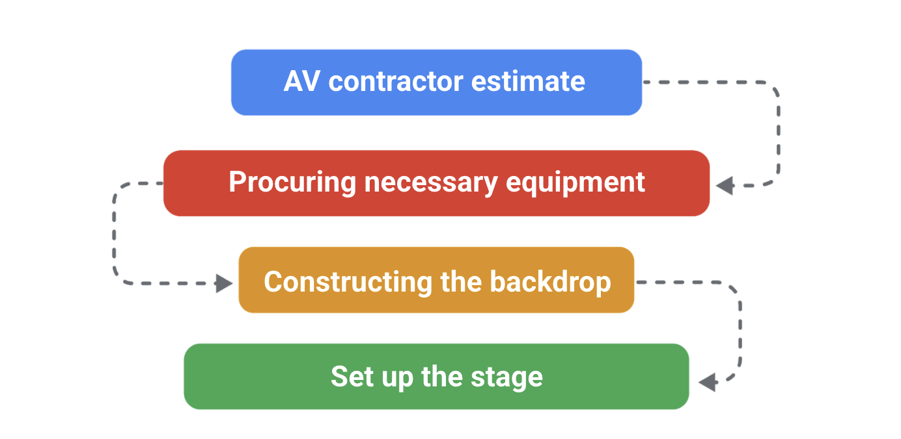

# Proyecto final: Aplicación de la gestión de proyectos en el mundo real

## Iniciar un proyecto

### Creación del estatuto de un proyecto

#### Estatutos del proyecto: Propósito y componentes

El pensamiento estratégico implica analizar la documentación y hablar con los interesados para fundamentar las decisiones
que se basan en la información disponible para ti.

Un estatuto del proyecto es un documento formal que define con claridad el proyecto y destaca los detalles necesarios para
alcanzar los objetivos del proyecto.

El gerente de proyectos crea el estatuto durante la fase de iniciación, que es la primera fase del ciclo de vida del proyecto.

El estatuto del proyecto te ayuda a organizar la información vital del proyecto, a crear un framework para el trabajo que
hay que hacer y a comunicar esos detalles a las personas necesarias. También es útil como una referencia a lo largo del
ciclo de vida del proyecto, ya que puede ayudar a los interesados a reajustar el alcance, los objetivos y los costos del
proyecto.

El estatuto del proyecto contiene información clave sobre un proyecto, como el resumen, los objetivos y los entregables,

El objetivo del resumen es proporcionar una perspectiva general del proyecto y destacar los objetivos que esperas lograr,
Los resúmenes deben ser breves, de unas pocas oraciones como máximo, y directos.

Después del resumen vienen los objetivos y los entregables del proyecto.

Los objetivos del proyecto hacen referencia a los resultados deseados del proyecto, y los entregables hacen referencia a
las tareas específicas y a los resultados tangibles que permiten al equipo cumplir con los objetivos del proyecto En general,
los objetivos del proyecto abordan el resultado global que los interesados pretenden alcanzar. Están determinados por las
aportaciones de los interesados y el gerente de proyectos. Por ejemplo, parte de los objetivos anuales de crecimiento y
expansión de Sauce and Spoon es la puesta en marcha del proyecto del lanzamiento de tabletas, y uno de los entregables del
proyecto es la instalación con éxito de las tabletas en dos restaurantes.

La última parte del estatuto del proyecto que cubriremos aquí es el alcance. Recuerda que el alcance se refiere a los
límites de un proyecto. Junto con el alcance, el estatuto contiene información sobre el trabajo que está fuera del alcance,
Los detalles que no contribuyen a los objetivos del proyecto se consideran fuera de alcance.

Un estatuto del proyecto es un documento formal que define con claridad el proyecto y destaca los detalles necesarios para
alcanzar los objetivos del proyecto. Los componentes principales de un estatuto del proyecto son el resumen, los objetivos,
los entregables y el alcance. Un estatuto también puede incluir otras secciones, como el presupuesto y las métricas de costo
y éxito.

#### Estatutos del proyecto: Alineación de partes interesadas

Cada vez que comuniques los detalles de tu proyecto, debes pensar en tu público y en qué información es
importante para ellos. Al agregar detalles a un estatuto del proyecto, hazte las siguientes preguntas
sobre tu público, y, si es útil, intenta responder a estas preguntas en tus notas:

¿Quiénes son tus interesados? En este caso, tu público incluye a todos tus principales interesados.
¿Qué detalles son más importantes para ellos?
¿Hay detalles del proyecto acerca de los cuales ellos podrían estar en desacuerdo?

Una vez que hayas identificado los que creas que son detalles importantes, revisa tu estatuto y asegúrate
de que todos esos detalles estén incluidos. A partir de ahí, podrás presentar el estatuto a tus interesados
y confirmar que todos estén de acuerdo con la información del proyecto.

El estatuto del proyecto: además de servir como un documento formal que define el proyecto, un estatuto
del proyecto es también una herramienta de alineación. En este caso, la alineación se refiere a alcanzar
un acuerdo entre dos o más partes. Una causa común del fracaso de un proyecto es la desalineación entre
los interesados sobre los detalles del proyecto. La desalineación también puede suceder entre tú y tus
interesados cuando tienes visiones diferentes para el proyecto. Por eso es tan importante alinearse con
tus interesados antes de comenzar el trabajo.

Los interesados no suelen participar en las tareas cotidianas de la ejecución del proyecto, por lo que
es fundamental dedicar tiempo durante la fase de iniciación a crear un estatuto del proyecto que establezca
con claridad los detalles de un proyecto. Esto ayuda a garantizar que el equipo trabaje para obtener
los resultados esperados por todos los interesados y no solo por algunos de ellos.

Normalmente, la fase de iniciación es el momento ideal para realizar cambios en el proyecto. A medida
que el proyecto avanza en las fases de planificación y ejecución, es posible que los cambios sustanciales
requieran deshacer el trabajo ya realizado. Por eso, en esta primera fase del ciclo de vida del proyecto,
no hay que tener miedo de hacer ajustes.

Aquí hay un ejemplo de cómo podrías experimentar la desalineación. Supongamos que estás hablando de los
principales objetivos del proyecto de Sauce and Spoon. Un interesado tiene la visión de poder automatizar
por completo, con el tiempo, la experiencia de pedidos con las tabletas. Otro interesado tiene un objetivo
diferente. En lugar de automatizar por completo los pedidos, quiere que el proyecto de lanzamiento de
tabletas mejore la precisión de los pedidos. Para ayudar a resolver esta situación, un gerente de
proyectos podría facilitar una discusión entre los dos interesados para tratar de llegar a un acuerdo
para confirmar la alineación sobre los objetivos del proyecto.

Cuando presentas un estatuto del proyecto a tus interesados, es importante recopilar feedback e identificar
dónde hay desalineaciones. Luego, puedes realizar cambios para abordar esas desalineaciones. Si tú y
tus interesados se toman el tiempo necesario para definir con claridad el proyecto, es mucho más probable
que obtengas los resultados que tus interesados esperan al final del proyecto. Como gerente de proyectos,
es importante registrar el feedback que recibes y documentar cualquier desalineación y sus soluciones,
Esto les permite a ti y a tu equipo del proyecto, más adelante, hacer referencia a esas decisiones.

Una forma de documentar las desalineaciones y las soluciones es crear un apéndice con un sello de tiemp
para la información nueva o actualizada. Un apéndice es una sección de contenido adicional al final
de un documento. Un sello de tiempo incluye la fecha, y en algunos casos la hora, de cuándo se creó
o se agregó el nuevo contenido al documento.

Excelente. Repasemos algunas de las ideas principales de lo que hemos hablado. Cada vez que comuniques
los detalles de un proyecto, debes pensar en tu público y en qué información es importante para ellos,
En el caso de un estatuto del proyecto, tu público está formado por tus interesados. Una causa común
del fracaso de un proyecto es la desalineación entre las partes interesadas sobre los detalles del
proyecto. Es importante tomarte el tiempo durante la fase de iniciación para crear un estatuto del
proyecto que establezca con claridad los detalles clave de un proyecto y para alinearte con tus
interesados antes de comenzar el trabajo. Y, por último, documenta cualquier desalineación y sus
soluciones en tus notas y en el estatuto del proyecto para poder consultarlos más adelante.

#### Estatutos del proyecto: Redacción de objetivos SMART

Ser capaz de escribir objetivos específicos y medibles es una parte importante de la gestión de proyectos y una buena forma
de demostrar tus habilidades de gestión de proyectos a los posibles empleadores.

Durante la fase de iniciación, algunos de los objetivos del proyecto pueden ser amplios porque no todos los los detalles
del proyecto se han determinado. Si bien está bien tener objetivos más amplios, es útil agregar especificidad cuando sea
posible. Esto se debe a que aclarar los objetivos del proyecto desde el principio puede ayudarte a evitar desajustes y a
comprender mejor el alcance, el presupuesto y el plazo del proyecto.

Los objetivos del proyecto son los resultados deseados del proyecto. Esbozar objetivos claros y específicos es un paso
importante en la creación de un estatuto del proyecto eficaz y crucial para el lanzamiento de un proyecto con éxito, por
lo que tendrás que ser capaz de identificar con precisión si un objetivo se ha cumplido o no.

Cuando tus objetivos estén claros, podrás determinar los entregables de tu proyecto. Los entregables del proyecto son
tareas específicas o resultados que contribuyen a la finalización de un objetivo. Como gerente de proyectos, es probable
que te encuentres con interesados que solo describen vagamente los resultados que desean para un determinado proyecto.

Por ejemplo, un interesado podría decirte que le gustaría que más clientes usaran un determinado servicio o que les gustaría
vender más unidades de un producto en particular. Estos son buenos objetivos, pero no son muy específicos. No sabes cuántos
clientes más, qué tipo de clientes o cuántas unidades necesitarás para cumplir los objetivos. Como gerente de proyectos, tu
rol es asegurarte de que los objetivos del proyecto estén bien definidos para que tú y tu equipo tengan una hoja de ruta clara,
Esto no solo te permite concentrarte, sino que también elimina la pérdida de tiempo y la falta de comunicación en el futuro.

Es posible crear objetivos claramente definidos con la ayuda del método SMART. El método SMART ayuda a convertir los objetivos
de tu proyecto en objetivos SMART. Recuerda, esto significa que tus objetivos son:

    Specific (específicos).
    Measurable (medibles).
    Attainable (alcanzables).
    Relevant (relevantes).
    Time-bound (de duración determinada).

Estas cualidades pueden ayudarte a medir tu éxito con mayor precisión y permitirte hacer ajustes más precisos a lo largo
del proceso.

Algunas de las prácticas recomendadas para garantizar los objetivos de tu proyecto que también son objetivos SMART:

Para hacer que un objetivo sea más *específico*, asegúrate de que proporciona respuestas a preguntas como:

    "¿Qué quiero lograr?"
    "¿Cuáles son los requisitos y las limitaciones de este objetivo?"

Para agregar especificidad a los objetivos, elije palabras en tus objetivos que puedan ser subjetivas o que se basen en
una opinión, por ejemplo, más grande, mejor o más rápido. Una vez que hayas identificado palabras subjetivas, comunícate
con tus interesados para acordar una definición de lo que en realidad significa hacer algo más grande o mejor o más rápido,

    ¿Qué implica en la práctica ser más grande o mejor?
    ¿En qué medida debería ser más rápido?

El método SMART te ayuda a hacer que tus objetivos sean más específicos al hacerlos *medibles*. Por ejemplo, si tu interesado
quiere aumentar las ganancias de la empresa, pregunta:

"¿En cuánto?"
"¿Quiere aumentar las ganancias en un 5%?"
"¿En un 30%?"

Si agregas números y cifras a tu objetivo, te resultará mucho más fácil saber cuando lo hayas conseguido. Si tienes problema
en hacer que un objetivo sea medible, investiga cómo cuantifican el éxito otras personas de tu sector. Esto se llama *benchmarking*,
que se refiere a la evaluación del éxito con respecto a la norma. Por ejemplo, hay muchas formas para medir el éxito en
el sector de restaurantes. Puedes buscar en línea información mediante consultas del siguiente tipo:

 "¿Cómo hacen los restaurantes para medir el éxito?"
 "¿Cómo se evalúan las sesiones de capacitación para empleados?"

Es probable que encuentres algunos resultados. Algunas métricas comunes incluyen:

    la tasa de rotación de las mesas o el tiempo promedio que un cliente pasa en su mesa;
    el costo de producción, que es el costo de la mano de obra más el costo total de bienes como alimentos y bebidas;
    el importe promedio de la cuenta, que es la cantidad promedio de dinero que los clientes gastan en una comida determinada.

La mayoría de los sectores, como la hostería, el sector de entretenimiento y el sector de la construcción, tendrán sus
propias métricas para el éxito. Eso también incluye el sector tecnológico. Las métricas son una parte importante de cómo
medimos el éxito.

Los objetivos SMART también son *alcanzables*, lo que significa que el objetivo es desafiante, pero no es imposible de
alcanzar. Pregúntate a ti mismo y al equipo:

    "¿Se puede hacer?"
    ¿Tienes el tiempo, los recursos y las personas disponibles para cumplir el objetivo a tiempo y dentro del presupuesto?

Si no, tendrás que hacer algunos cambios en tus objetivos.

los objetivos del proyecto deben ser *relevantes*. Pregúntate:

    "¿Tiene sentido para nosotros como empresa o como equipo de proyecto perseguir este objetivo?"

Una práctica recomendada para determinar la relevancia de tus objetivos del proyecto es darte cuenta
el grado de alineación de los objetivos de tu proyecto con los objetivos más amplios de tu empresa u
organización. Es posible utilizar una herramienta para el establecimiento de objetivos en toda la
organización llamada *objetivos y resultados clave, u OKR*. los OKR combinan un objetivo y una métrica
para determinar un resultado medible.

Por ejemplo, uno de los objetivos más amplios de Sauce and Spoon es hacer alimentos frescos y rápidos
para las familias trabajadoras de su comunidad. Así que un objetivo relevante para el lanzamiento de
la tableta de Sauce and Spoon podría ser disminuir el tiempo de permanencia del cliente en un 10%, en
promedio, en las primeras seis semanas después de la implementación. Este objetivo del proyecto ayuda
a la cadena de restaurantes a alcanzar su objetivo más grande: proporcionar comidas rápidas para los
lientes.

La última parte del framework SMART es hacer que tu objetivo *tenga un plazo determinado*. Es conveniente
que agregues una fecha límite a tu objetivo para que sepas cuándo debe estar terminado.

#### Estatutos del proyecto: Definición del alcance, los beneficios y los costos

A la hora de pensar en qué tipo de información incluir en estatuto del proyecto, siempre es bueno tener en cuenta el público
principal que lo leerá. Ya que el objetivo de crear un estatuto del proyecto es comunicarse con los interesados, ellos soluciones
tu público principal.

Si sabes que uno de los beneficios de tu proyecto puede ser de especial interés para un interesado clave, debes asegurarte
de destacar este beneficio en tu estatuto del proyecto. Es posible que los interesados que lean tu estatuto no vean los
planes de proyecto más detallados en otros documentos posteriores, por lo que es importante conseguir un consenso sobre
los elementos críticos ahora, mientras se ultiman los detalles del proyecto.

A continuación, debes establecer con tus interesados sobre el alcance, los beneficios y el costo:

*El alcance*, rápidamente, alcance se refiere a los límites del proyecto; por ejemplo, el número de restaurantes que
participan en el proyecto piloto. Los detalles que no contribuyen a los objetivos del proyecto se consideran fuera del
alcance. Para determinar lo que está dentro y fuera del alcance, piensa en lo que se necesita para lograr el objetivo del
proyecto. Ten en cuenta las siguientes preguntas:

    ¿En qué detalles del proyecto coinciden los interesados que se considerarían dentro del alcance?
    ¿Los interesados están en desacuerdo con algún elemento?
    ¿Hay algún detalle que debas designar como fuera del alcance de este proyecto en particular?

Al pensar en estas preguntas, toma notas de lo que concluyas y recurre a ellas cuando completes la sección de alcance de
tu estatuto del proyecto.

*Los beneficios y los costos* del proyecto. Los beneficios son las ganancias esperadas de un proyecto. Estos pueden ser
directos, como las ganancias monetarias, o indirectos, como una mejora en la participación o satisfacción del cliente. Los
costos se refieren al dinero gastado en las tareas del proyecto y a los precios del tiempo, los recursos y la mano de obra,
por ejemplo. Los costos pueden evaluarse y gestionarse con un presupuesto de proyecto.

Un presupuesto es una estimación de la cantidad de dinero asignado para completar el proyecto. Usarás esa información para
agregar dos listas a tu estatuto del proyecto: una lista de beneficios y una lista de costos. Por lo general, puedes encontrar
los beneficios que el proyecto aportará al caso de negocio o a la propuesta del negocio.

Por ejemplo, tu lista de beneficios para el lanzamiento de la tableta puede incluir su potencial para acelerar el servicio
y aumentar las ventas en un porcentaje estimado. Aquí hay otro beneficio. Las tabletas proporcionarán al restaurante puntos
de datos claros sobre los pedidos de los clientes y un sistema de punto de venta integrado que ayude a guiar la toma de
decisiones en el futuro.

Una lista de beneficios puede ayudarte a identificar los objetivos potenciales del proyecto que te hayas perdido. Una lista
de costos incluirá artículos que la organización tendrá que pagar para poder realizar el trabajo, como el precio de la mano
de obra o los materiales.

La enumeración de los costos ayuda a los interesados a sopesar los beneficios contra la cantidad de dinero necesaria para
obtener esos beneficios. Puedes elaborar una lista de los costos junto con los interesados para obtener las estimaciones
sobre la mano de obra, los materiales y cualquier otro factor que podría costarle dinero a la empresa durante el proyecto.

Los beneficios de un proyecto deben superar los costos. Esto es casi siempre el caso cuando se inicia o propone un proyecto,
Cuando agregas estos detalles al estatuto, ayuda a visualizarlos en un solo lugar y que los costos y los beneficios sean
muy claros para los interesados. Esta sección se usa mucho como una ayuda para asegurarse de que los interesados estén de
acuerdo en que vale la pena el dinero para llevar a cabo el proyecto.

#### Afsheen: Iniciar un proyecto de manera efectiva

El problema más frecuente que veo cuando se está en la fase de iniciación del establecimiento de un proyecto es conseguir
la alineación entre los principales interesados. Además, hay que asegurarse de que las personas adecuadas se hagan cargo
del proyecto para incentivar a los gerentes de proyectos con verdadero talento a querer sumarse al proyecto.

Me parece que la atracción es mucho más eficaz que la promoción. Quiero que el talento venga hacia el proyecto en lugar
de solo asignar el trabajo del proyecto. Eso lleva mucho trabajo. Vale la pena porque estás sentando una buena base para
un proyecto exitoso, y, en última instancia, la mejor velocidad que podrías esperar.

Durante la fase de iniciación, cuando intento perfeccionar los criterios de éxito, hago muchas preguntas. Probablemente
haya una lista de 20 de ellas. Un par de ejemplos podrían ser la comprensión del entorno: ¿Cuáles son algunos de los
escollos o riesgos del ecosistema? También intento hacer encuestas de las entrevistas, de las personas en el entorno, y
les pregunto, "¿Qué es lo que ves como un problema?" Además, planteo una serie de preguntas cuantitativas cuando corresponde,
para entender ¿a qué me estoy enfrentando en términos de medidas? "Hay muchas razones por las que los proyectos pueden
fracasar. En mi opinión, todo se reduce a lo siguiente: uno, definición del proyecto realmente pobre; dos, desorganización,
el director del proyecto no está estableciendo un framework para gestionar el proyecto; y tres, hay demasiadas personas".

A menudo, se produce el efecto de que todos quieren trabajar en el proyecto y entonces no hay responsabilidad. No todos
los interesados van a abordar el problema con la misma perspectiva. Así que retrocedo y pienso: ¿Quiénes son mis principales
interesados? Digamos que, por ejemplo, hay dos patrocinadores, los principales interesados, y que son como peras con manzanas.
Eso es un problema. En ese caso, tendré que reunirme mucho con ellos, entender el compromiso del intermediario y trabajar
realmente en ese problema de formación inicial del proyecto.

### Negociación eficaz con las partes interesadas

#### Realizar un análisis de los interesados

Casi todas las partes de un proyecto requieren las aportaciones y el acuerdo de múltiples interesados,
Por supuesto, no todos los interesados valorarán la misma información o estarán de acuerdo en las mismas
cosas. Por eso, un gerente de proyectos exitoso también necesita ser un negociador experto.

Algunos aspectos comunes del proyecto que se negocian durante el curso de un proyecto incluyen

    El alcance,
    Los costos y beneficios,
    El plazo,
    Los criterios de éxito,
    Las funciones y responsabilidades,
    Los recursos.

Esta es otra razón por la que resulta útil alinearse con los interesados desde el principio. Una buena
alineación puede ayudar a evitar algunos de estos tipos de negociaciones en el futuro.

Al principio del proyecto, es importante acordar el alcance. Es bueno recordar que muchas de las habilidades
que aplicarás aquí serán útil para negociar otros elementos en todo el ciclo de vida del proyecto,
si ese es el presupuesto, el plazo o los requisitos del producto. Te prepararás para esto y para las
negociaciones futuras mediante la creación de un análisis de los interesados.

Un análisis de los interesados es una representación visual de todos los interesados. Te ayuda a entender
quiénes son tus interesados, cuáles son sus prioridades y cómo prefieren comunicarse. Puede ayudarte
a determinar el grado de prioridad que debes dar a las necesidades de determinados interesados o metas
en el proyecto.

Los interesados tienen un interés centrado en el éxito del proyecto. Comprender a los interesados te
ayuda a descubrir las personas adecuadas para incluir en las conversaciones importantes y cómo priorizar
las diferentes necesidades de los diferentes interesados. Esto es clave para obtener el apoyo que
necesitas durante el proyecto.

Como parte de tu análisis, intenta responder a todas las preguntas que puedas sobre cada interesado,
Luego, mientras revisas tu lista, identifica qué interesados influyen directamente en el proyecto y
el nivel de interés que tiene cada uno. La influencia de un interesado está relacionada con la cantidad
de poder que tiene y cuánto puede afectar sus acciones al resultado del proyecto.

El interés se refiere a la medida en que las necesidades de los interesados se verán afectadas por las
operaciones y los resultados del proyecto. Por ejemplo:

si un interesado tiene un alto interés e influencia, puede ser muy importante que lo mantengas informado
y te asegures de que sus objetivos para el proyecto sean la máxima prioridad.

Si tiene intereses bajos y baja influencia, entonces podrías no priorizar una de sus preferencias personales
para el proyecto.

Si se traza una tabla de poder e interés, se sabrá con mayor claridad a quién dar prioridad y cuál es
la mejor forma de abordar las negociaciones con cada interesado. Una vez que tengas una idea clara de
quiénes son tus interesados y de qué papel desempeñan en el éxito del proyecto, puedes usar esta
información para apoyar las negociaciones de tu proyecto.

En una de las negociaciones más importantes, tratarás de definir y mantener el alcance del proyecto,
Los interesados pueden presionar para que se agregue algo más al alcance, y es tu trabajo como gerente
de proyectos negociar lo que sea realista dentro de las expectativas del presupuesto y el plazo.

#### Gestionar a los interesados Consejos y conclusiones

La gestión de los interesados es el proceso de mantener buenas relaciones con las personas que tienen
la mayor influencia en tu trabajo. La gestión eficaz de los interesados es una parte integral de todo
proyecto porque fomenta la buena comunicación, el trabajo en equipo, la confianza entre los miembros
y mucho más. Sin una gestión eficaz de los interesados, es menos probable que un proyecto tenga éxito.

*Gestión de los interesados durante el inicio del proyecto:*

*Identificar a todos los interesados al comienzo de tu proyecto o iniciativa.* Involucra a todos lo
antes posible para establecer expectativas, responsabilidades y límites claros. Identificar a tus
interesados desde el principio les da tiempo suficiente para expresar cualquier inquietud que puedan
tener sobre el proyecto o su papel dentro de él. Si tienen un sentido de propiedad desde el principio,
es más probable que tus interesados acepten tus roles, brinden información adecuada y ayuden a eliminar
los obstáculos para permitir que el proyecto avance.

*Mantener clara la visión del proyecto.* La visión del proyecto describe la necesidad que satisface
el proyecto. Es importante tener una visión clara y específica del proyecto porque, como hemos aprendido,
los interesados pueden ejercer presión para aumentar los requisitos, acortar el plazo o recortar los
recursos. Asegurarse de que los interesados hayan acordado la visión y, más específicamente, lo que
parece "hecho" proporciona claridad para todos los involucrados en el proyecto. La inclusión de
interesados altamente influyentes en los procesos de planificación estratégica garantizará que todos
los miembros del equipo estén alineados con la visión del proyecto.

*Equipa a tus interesados con recursos fáciles de usar en todo momento.* Esto podría significar crear
un informe de una página (un documento de una página que proporciona una descripción general de tu
proyecto) o un informe de estado semanal con la información más reciente y enlaces a los principales
artefactos del proyecto. También puede significar garantizar que todos tengan acceso a la documentación
necesaria.

*Gestión de las partes interesadas a lo largo del ciclo de vida del proyecto:*

A medida que avances en el ciclo de vida del proyecto, deberás mantener buenas relaciones con todos
los interesados para asegurarte de que estén satisfechos yy colaboren con el equipo. Las siguientes
estrategias pueden ayudarte a conocer los intereses, las preocupaciones y las preferencias de comunicación
de tus interesados y solicitar su ayuda a lo largo del ciclo de vida de tu proyecto:

*Averigua qué les importa a los interesados y por qué.* Pregunta a tus interesados: ¿Cuáles son tus
prioridades y objetivos más importantes? ¿Qué papel te gustaría desempeñar en este proyecto? ¿De qué
manera te respaldará este proyecto y cómo respaldará tus prioridades más importantes?

*Ajusta la frecuencia y el enfoque de tu comunicación según las funciones y preferencias de los*
*interesados.* Diles a tus interesados: Así es como pienso mantenerte informado, ¿te parece bien?

*Recurre a la ayuda de los principales interesados cuando sea necesario.* Pregunta a tus interesados:
¿Con quién más recomiendas que me ponga en contacto acerca de este proyecto?

*Una vez que los interesados tengan un interés personal, hay que plantearles los problemas del proyecto.*
Pregunta a tus interesados: ¿Cómo manejarías esta situación? ¿Qué soluciones te vienen a la mente?

*Conclusión clave:*

Los interesados pueden ser tus mayores aliados como gerente de proyectos. Practicar tus habilidades
de gestión de los interesados puede ayudarte a obtener el apoyo de ellos y a mantenerlos comprometidos
a lo largo de tu proyecto.

#### Encontrar soluciones de beneficio mutuo

Como gerente de proyectos, tienes muchas herramientas útiles a tu disposición, pero incluso los
negociadores más hábiles tienen que poner a prueba sus habilidades para cumplir con los objetivos del
proyecto y conseguir la satisfacción de los interesados.

Habrá ocasiones en las que tengas que negociar un aspecto delicado de los objetivos o el alcance del
proyecto, o podría haber un desacuerdo entre los interesados o podrías estar en desacuerdo con algo
que los interesados quieren. Tendrás que usar técnicas de negociación para que un desacuerdo pase del
estancamiento a la solución.

Cuando se trata de la gestión de proyectos, La persuasión y la negociación son herramientas constructivas
que se pueden usar para mejorar la comunicación, aclarar los deseos y las necesidades y lograr soluciones
viables para todos los involucrados. Ser hábil en la persuasión y en la negociación también aumentará
tu nivel de influencia. Es importante que veas a las personas con las que negocias como tus colegas y
compañeros, no como adversarios. Por eso hay que hacer un análisis de interesados para que puedas conocerlos
como personas, con sus propios trabajos y responsabilidades, y como asociados que quieren que el proyecto
tenga éxito.

Cuando se produzcan conflictos o desacuerdos entre tus interesados, lo mejor es abordar esos problemas,
crear un consenso entre los grupos de interesados y reducir los conflictos. Una forma de hacerlo es
encontrar soluciones que sean de beneficio mutuo. El beneficio mutuo es cuando todas las partes
involucradas obtienen algún tipo de beneficio o de ventaja.

Por ejemplo, digamos que hay un desacuerdo sobre el número de personas que hay que contratar para un
proyecto. Te gustaría contratar a cinco, pero un interesado quiere limitar el número de personas a
tres. Una solución que ofrecería un beneficio mutuo podría ser la instalación de un software automatizado
que asumiera parte del trabajo. Otra solución podría ser ajustar el plazo o las expectativas de manera
que no se necesiten cinco personas para alcanzar el objetivo del proyecto. El interesado puede tener
el tamaño deseado de equipo más pequeño, y puedes completar las tareas con menos personas.

El objetivo es alcanzar una solución que maximice los beneficios, minimice las pérdidas y sea justa
para todos. Haz una lluvia de ideas de todas las opciones posibles que cumplan con estos criterios,
Luego, durante las negociaciones, podrás presentar múltiples alternativas y elegir una que beneficie
a todos en cierta medida. Ahora bien, por mucho que quieras satisfacer a tus interesados, es igual
de importante que pienses en las concesiones que estás dispuesto a hacer.

Para hacerlo con éxito, necesitas comprender las prioridades del proyecto. Debes saber qué es lo más
importante respecto del alcance, el plazo y el presupuesto. Por ejemplo, si hay un plazo específico
que se debe cumplir, habrá que negociar cualquier cambio en el alcance que podría hacer que el proyecto
se exceda de ese plazo. Si el producto necesita tener un aspecto o funcionar de una manera determinada,
los requisitos son una prioridad absoluta, y se podrían negociar aspectos del presupuesto o del plazo
para respetar el alcance.

Una herramienta común que se usa para determinar las prioridades es el modelo de la restricción triple,
o el triángulo de hierro. La restricción triple te ayudará a decidir si una solicitud de proyecto es
aceptable y qué impacto tendrá.

Repasemos. Persuasión y la negociación son herramientas constructivas que se pueden usar para mejorar
la comunicación, aclarar los deseos y las necesidades y lograr soluciones viables para todos los
involucrados. El objetivo es alcanzar un beneficio mutuo, que es cuando todas las partes involucradas
obtienen algún tipo de beneficio o ventaja. Muy bien, eso es todo por ahora.

#### Negociación del alcance con las partes interesadas

Incluso después de haber establecido el alcance del proyecto, es posible que algunos interesados deseen
analizar cómo ajustarlo. Pueden pensar que el alcance actual del proyecto requerirá demasiado trabajo
con muy pocos recursos, que el cronograma no es realista dado el alcance o que el proyecto requiere
tareas y objetivos adicionales. Cuando tus interesados soliciten revisar el alcance de un proyecto,
debes reunirte con ellos para que puedan plantear sus inquietudes. Saber cómo facilitar de manera
efectiva las negociaciones del alcance te permitirá llegar a soluciones adecuadas para todos.

- Consejos para examinar el alcance con los interesados

*Entender las motivaciones.* Antes de tu discusión, considera las motivaciones de cada interesado para
querer ajustar el alcance del proyecto. Algunas de esas motivaciones son presupuestarias (como el
deseo de reducir los costos del proyecto), otras son interpersonales (como el deseo de disponer de
más tiempo para completar las tareas) y otras están relacionadas con objetivos personales de la
carrera (como mantener su puesto actual o la lucha por un ascenso). Comprender las motivaciones de los
interesados puede ayudarte a trabajar juntos para llegar a un acuerdo.

*Plantea la situación.* Comienza la discusión con una reflexión sobre por qué se están reuniendo,
Recuerda a tus interesados por qué estás involucrado en este proyecto y asegúrales que todos comparten
un objetivo común.

*Escucha primero.* Escucha lo que tus interesados tienen que decir antes de presentar tus puntos de
vista. Esto demostrará tu deseo de entender la perspectiva de la otra parte. Reconocer su punto de
vista puede facilitar que acepten tus sugerencias o soluciones cuando sus ideas u opiniones difieren
de las tuyas.

*Haz preguntas para definir los objetivos.* Sé minucioso y haz todas las preguntas que consideres
necesarias para entender lo que quiere el interesado. Esto podría incluir que definan sus objetivos
comerciales o de clientes. Esfuérzate por obtener detalles específicos y medibles de tus interesados,
de modo que más adelante puedas determinar si has alcanzado con éxito sus objetivos. Un lenguaje medible
(en lugar de subjetivo o poco claro) te ayudará a definir los objetivos. Un ejemplo de un objetivo
específico y medible podría ser: “Queremos reducir el tiempo que tardan los clientes en suscribirse
a nuestro boletín informativo en al menos un 30%”.

*Explica el "porqué" antes del "qué".* Cuando intentes persuadir a los interesados, o a cualquiera,
en realidad, para que vean las cosas a tu manera, explica las razones de tu solicituda antes de describir
lo que quieres. Por ejemplo, empieza por explicar el valor que se podría agregar a tu empresa o proyecto
definiendo el alcance de una manera en particular. Si los interesados entienden primero de dónde vienes,
es más probable que concedan tu solicitud cuando la hagas.

*No los abrumes.* A veces es mejor exponer tu caso y dar tiempo a los demás para que respondan. Después
de haber presentado tus razones, posición y solicitud, retírate un poco para darle tiempo a tu audiencia
de procesar lo que has dicho. Piensa en tu silencio, en esta situación, como una señal de respeto hacia
tus interesados; les demuestra que quieres escucharlos. Y, si se callan por un rato, significa que has
estimulado el pensamiento.

*Sé creativo.* Trabajar para encontrar soluciones alternativas puede convertir rápidamente una negociación
pesada en un esfuerzo de equipo inspirador. Para encontrar soluciones reales a los estancamientos de
la negociación, piensa de forma creativa en todos los aspectos del proyecto. Es posible que descubras
que hay más de una solución para las diferentes opiniones.

*No lo hagas personal.* Concéntrate siempre en lo que es bueno para el proyecto. Si las consideraciones
personales entran en la discusión, replantea la conversación mencionando hechos objetivos.

*Busca un resultado beneficioso para todos.* Por último, considera lo que se necesita para que la otra
parte esté satisfecha. Luego, intenta identificar una manera de asegurarte de que tú también estés
satisfecho. Habrá ocasiones en las que una de las partes tenga que ceder más que la otra, pero el
objetivo debe ser siempre un acuerdo de beneficio mutuo (un acuerdo que beneficie a todas las partes
involucradas).

#### Lograr un resultado beneficioso para todos

El objetivo al negociar con los interesados debe ser siempre lograr un resultado beneficioso para todos
o un acuerdo de beneficio mutuo. Este es un acuerdo que beneficia a todas las partes involucradas. Sin
embargo, los acuerdos de beneficio mutuo no son solo para los interesados internos. Son una parte
importante del proceso de negociación con vendedores, contratistas, proveedores, entre otros.

- Mejores prácticas para llegar a un acuerdo de beneficio mutuo

*Compartir la información.* A veces, en las negociaciones, una o ambas partes pueden pensar que tienen
que ocultar información para no revelar demasiado. Sin embargo, esto no es muy eficaz. Lo mejor es
esforzarse por mantener las líneas de comunicación abiertas, en las que cada parte comparta sus
preocupaciones y preferencias. Por ejemplo, si el último proveedor de tu equipo te proporcionó productos
de baja calidad, puedes expresar esto como una preocupación para que tus expectativas sobre la calidad
queden claras.

*Hacer preguntas y escuchar activamente las respuestas.* Así como compartiste tus inquietudes y expectativas,
puedes hacer preguntas a la otra parte para aclarar cuáles son sus inquietudes y expectativas. De esa forma,
ambas partes habrán compartido toda la información necesaria para lograr un acuerdo de beneficio mutuo.

*Proponer múltiples opciones siempre que sea posible.* En las negociaciones, presentar solo una opción
o solución puede llevarte al fracaso porque la otra persona puede pensar que tu primera oferta es la
única. Si la otra parte rechaza todas tus propuestas, pídele que te comunique cuál es la que más le
gusta, ya que eso puede orientarte a encontrar una solución que funcione para todos.

#### Stanton dice: Gestión de los cambios de alcance con los interesados

Hola. Soy Stanton, gerente del programa en YouTube. Un gerente del programa en YouTube básicamente trabaja en un montón
de proyectos diferentes, pero los reúne en un programa que puede ayudar a las personas a entender lo que está sucediendo
en cualquier momento, ya sea el desarrollo o los requisitos o las pruebas del producto, todo lo que tiene que confluir
para que un proyecto funcione bien.

Un cambio de alcance puede suceder en cualquier momento, y descubrí que a menudo sucede cuando no quieres que suceda, por
lo general justo antes de un lanzamiento. Este es un proyecto en el que estaba trabajando en una startup antes de llegar
a YouTube, Se estaba implementando una nueva aplicación que tenía que ver con los porcentajes de peso corporal. La gestión
de los interesados es realmente importante como gerente del programa porque es posible que los interesados no siempre sepan
lo que está sucediendo. En este caso, con nuestro director ejecutivo, estaba realmente centrado en conseguir lanzáramos
el producto, mientras pensábamos en todas las relaciones públicas y el marketing y todo lo que iba a anunciar una vez que
todo entrara en funcionamiento. Vio eso específico con los gráficos y realmente quería que se cambiara. Esto es algo que
sucede mucho. Puedes suceder un cambio de requisitos en el último minuto. Encuentras algunas formas de asegurarte de que
tu cliente o los interesados sigan contentos con lo que puedes producir. En este caso, lo que se terminó haciendo fue
volver a nuestros desarrolladores, obtuvimos una estimación de cuánto tiempo creían que llevaría hacer ese cambio, y eso
nos llevó a superar los plazos que teníamos en mente. Así que se nos ocurrieron unas cuantas propuestas diferentes, y lo
que terminó sucediendo fue que como se fijó la fecha del lanzamiento, no había forma de que pudiéramos hacer todos los
cambios que él quería a tiempo para el lanzamiento. Así que negociamos y dijimos: "Oye, los tendremos así en el
lanzamiento, pero según las estimaciones que recibimos, podremos tenerlos listos en otras dos semanas, y después haremos
otro lanzamiento. No debería ser un gran problema. Solo será un cambio después del lanzamiento inicial".

Cuando se trata de los interesados, siempre habrá algunas cosas que quieran hacer más que otras. Cuando gestionas el alcance,
especialmente si surge algo de última hora, puedes intentar clasificarlo dentro de ese nivel de prioridad. Lo único que
también agregaría y sobre lo que advertiría es que no se puede conseguir nada gratis, así que, si tienes un cambio en el
alcance, tienes que asegurarte de volver a mirar esa prioridad y ver qué es lo que realmente se elimina debido a lo nuevo
que se incorpora. Acuden a ti porque eres un gerente de proyectos o un gerente del programa.

#### Ejercer influencia en las negociaciones

El Dr. Jay Conger enumera estos cuatro pasos para influir con eficacia:

    Establecer la credibilidad
    Un marco para intereses comunes
    Proporcionar evidencia
    Conectarse emocionalmente

Una forma de aplicar estos cuatro pasos es formar una coalición. Una coalición es una alianza temporal o una asociación
de personas o grupos para lograr un propósito común o para participar en una actividad conjunta. Cuando dos o más personas
abogan juntas por una idea, son capaces de ejercer más influencia que si intentan actuar solas.

Formar una coalición con el grupo adecuado de personas es una técnica de negociación poderosa y eficaz. Por ejemplo,
piensa en algunos de los principales interesados que identificaste anteriormente en el proyecto de Sauce and Spoon. ¿Con
cuáles podrías formar una coalición para que te ayuden a negociar uno de los elementos fuera del alcance que se solicitó?
La creación de una coalición aumenta tu credibilidad al involucrar a otras personas que apoyan tu objetivo.

Las personas de tu coalición pueden ayudarte a encontrar intereses comunes y aportar pruebas. Además, puedes conectar
emocionalmente al incluir a alguien que tenga una relación positiva con el interesado o que entienda al interesado y al
objetivo lo suficientemente bien para establecer una conexión.

Una coalición eficaz incluye personas con la combinación adecuada de influencia o poder e interés. En otras palabras,
identifica a las personas que pueden ayudarte a lograr tu objetivo a través de sus intereses creados y de la experiencia
en el tema de tu proyecto. También puedes ir equilibrando tu coalición con personas que tengan un alto nivel de poder en
tu organización para ayudar a influir y conseguir que las cosas se hagan.

Un análisis de los interesados es una herramienta útil para ayudar a guiar la formación de coaliciones. Una vez que hayas
decidido quién es una buena opción para tu coalición, ponte en contacto con ellos y pide su apoyo. Una buena forma de
hacerlo es a través de un correo electrónico bien redactado, pero también puedes preguntar en persona o con una llamada
telefónica, el método que consideres más apropiado. Cuando hagas tu solicitud, expón con claridad el problema que estás
intentando resolver, explica qué aspecto del proyecto se está negociando. Luego, pregúntales si podrían considerar el
apoyo a tu posición o solución y explica en qué consiste. Y, por supuesto, consulta a las fuentes de poder o interés de
esa persona que identificaste.

Por ejemplo, si estás negociando el plazo del proyecto, podrías decir algo como: "El momento del lanzamiento afectará al
horario comercial, y tu experiencia en la gestión de proyectos de restaurantes durante todo el año podría ser útil para
explicar por qué hay que reconsiderar este factor". Esto le hará saber que lo valoras, por qué lo impacta y por qué crees
que puede ser de ayuda específica para ti.

## Desarrollar un plan de proyecto

### Identificar tareas e hitos

#### Identificar las tareas del proyecto: Análisis de la documentación

La documentación útil incluye estatutos de proyectos, correos electrónicos y planes de proyecto anteriores que una empresa
podría tener disponibles cuando te unes a una nueva organización o cambias a un nuevo proyecto.

Un plan de proyecto puede ser útil para cualquier proyecto, grande o pequeño, ya que te ayuda a documentar el alcance, las
tareas, los hitos, el presupuesto y las actividades generales para mantener el proyecto en marcha. En el centro del plan
de proyecto está el cronograma del proyecto. El cronograma es tu guía para hacer estimaciones de tiempo para las tareas
del proyecto, determinar los hitos y supervisar el progreso general del proyecto.

Uno de tus trabajos principales como gerente de proyectos es identificar todas las tareas del proyecto, calcular cuánto
tiempo llevará cada tarea y realizar un seguimiento del progreso de cada una. Entonces, ¿cómo haces para agregar tareas
e hitos al plan por primera vez? podrias revisar los objetivos y entregables en el estatuto del proyecto. Luego, realizar
una lista de todos los elementos que tienen tareas o hitos asociados a ellos. Los hitos son puntos importantes dentro del
cronograma que indican el progreso. Suelen corresponderse con un entregable o una fase del proyecto, mientras las tareas
del proyecto son actividades que se deben realizar en un período establecido de tiempo y se asignan a diferentes miembros
del equipo de acuerdo con los roles y las habilidades de cada persona.

Para alcanzar un hito, tu equipo y tú deben completar ciertas tareas. Por ejemplo, uno de los entregables del proyecto de
Sauce and Spoon es promocionar los nuevos menús para tabletas con letreros en las mesas y correos electrónicos masivos. En
este caso, un hito podría ser la finalización de este entregable, que incluiría todas las tareas que se requieren para
conseguir la aprobación de las versiones finales de los materiales de marketing y confirmar las fechas de envío masivo del
correo electrónico. Algunas de estas tareas podrían incluir la redacción de varios borradores de los diferentes materiales
de marketing, generar una lista de correo electrónico y programar los correos electrónicos para que se envíen en las fechas
correctas. Para cada entregable, pregúntate lo siguiente:

    ¿Qué pasos debemos dar para lograr esto?

Los pasos se convertirán en las tareas individuales que deben completarse. Dirijamos nuestra atención a otro producto de
Sauce and Spoon: la implementación de una encuesta posterior a la cena para evaluar la satisfacción del cliente.

    ¿Qué pasos debe seguir para lograr este entregable?

Es posible que deba asignar a un miembro del equipo para desarrollar una encuesta. También deberás determinar cómo entregar
la encuesta y crear un proceso para llevarla a cabo.

Estos son solo algunos ejemplos de las muchas tareas que deberás completar para para lograr el entregable. Es tu trabajo
ayudar a descubrir el resto de las tareas. ¿Cómo descubres más tareas? Además del estatuto del proyecto, existen otras
formas comunes de documentación que pueden ayudarte a identificar tareas. Por ejemplo, puedes pedir a los interesados o
colegas que compartan correos electrónicos o un plan de proyecto anterior para un proyecto similar.

Analicemos cómo estos pueden ser útiles a medida que creas tu lista de tareas. Los correos electrónicos relacionados con
el proyecto pueden proporcionar mucha información útil de donde obtener tareas. Dado que gran parte de la comunicación en
el lugar de trabajo se realiza a través del correo electrónico, pide que te envíen correos electrónicos relacionados que
contengan debates sobre los detalles del proyecto. Estos correos electrónicos pueden ayudarte a descubrir tareas y también
a identificar miembros del equipo con quienes conectarte si tienes preguntas adicionales.

También es útil revisar un plan de proyecto anterior para una iniciativa similar y averiguar qué tipo de tareas se
incluyeron. Por ejemplo, si eres un gerente de proyectos encargado de lanzar un nuevo producto, podrías preguntarle a un
colega con experiencia en el lanzamiento de otros productos para la misma empresa que comparta su plan de proyecto como
ejemplo. O, si tu proyecto incluye algún trabajo de construcción, podrías preguntar a tus colegas sobre proyectos no
relacionados que también tenían componentes de construcción.

Los planes de proyectos anteriores pueden brindarte una inspiración útil a medida que creas tu propia lista de tareas,
También pueden ayudarte a identificar la posible duración de las tareas, los expertos en la materia e incluso los proveedores
que pueden ser útiles para tu proyecto.

Mientras revisas la documentación del proyecto, toma nota de la información que sugiera otras tareas que tu equipo debería
completar para ejecutar los entregables del proyecto. Durante este proceso, hazte preguntas como estas:

    ¿Hay una gran tarea en la que están trabajando muchas personas que podría dividirse en tareas más pequeñas asignadas a
    los individuos?
    ¿Hay señales que implican que las tareas anteriores deben completarse primero?

Por ejemplo, un entregable como «instalar tabletas» podría implicar seleccionar un proveedor de tabletas como una tarea
previa.

#### Consejos para definir las tareas del proyecto

El proceso de identificar las tareas del proyecto y definirlas es algo que requiere práctica. Dividir las tareas en partes
viables es un desafío porque tienes que decidir qué tareas pueden requerir subtareas adicionales y cuáles no. Por ejemplo,
si estás gestionando una mudanza a través del país, no necesitas analizar la tarea de descargar las cajas del automóvil para
ver qué caja debe moverse primero. Sin embargo, es posible que debas dividir las tareas de la mudanza en pasos más pequeños
y detallados. A medida que progreses en tu carrera, mejorarás en el desglose de las tareas.

- Definir las tareas del proyecto en una o dos oraciones

Cuando escribas descripciones de las tareas del proyecto, redúcelas a una o dos oraciones. Si descubres que la descripción
de una tarea determinada debe ser más larga que una o dos oraciones, esto indica que la tarea es compleja y podría dividirse
en tareas más pequeñas o que podría necesitar una aclaración adicional.

- Examinar las dependencias de las tareas del proyecto

Cuando veas cómo puedes dividir ciertas partes del proyecto en tareas, ten en cuenta las dependencias de las tareas o lo
que debe completarse o entregarse de una persona a otra antes de que se pueda comenzar el trabajo en cada tarea. Identificar
las dependencias puede ayudarte a decidir cuánto se debe dividir una tarea. Por ejemplo, si estás gestionando un proyecto
que incluye una ceremonia de premios y una de las tareas es preparar el escenario, las dependencias para esta tarea podrían
incluir obtener estimaciones de un contratista audiovisual (AV), adquirir el equipo necesario y construir el telón de fondo
del escenario.

- Obtener ayuda de los miembros del equipo

A menudo, es útil que tu equipo participe en el proceso de desglose de las tareas. Es posible que tengas una reunión en la
que debatas cada objetivo general o tarea importante con el equipo. De esta manera, los miembros del equipo pueden presentar
diferentes perspectivas a medida que trabajan juntos para dividir las tareas. Por ejemplo, si alguien de tu equipo tuvo
experiencia en un proyecto similar, es posible que sugiera que una determinada tarea se divida en tres tareas diferentes.

- Definir las tareas del proyecto por la cantidad de tiempo que tardarán en completarse

Definir las tareas del proyecto por la cantidad de tiempo que se espera que lleven revelará cualquier tarea especialmente
larga. Si se espera que una tarea lleve mucho tiempo, podría indicar que hay subtareas adicionales que deben definirse. La
identificación de tareas por tiempo es útil para programar otras tareas o eventos en torno a las tareas más largas. Esta
estrategia también te ayuda a determinar los hitos adecuados, ya que estos suelen ser la culminación de una serie de tareas,
Reconocer la finalización de una tarea grande y larga también es una excelente manera de celebrar el éxito, aprender del
proceso y mantener el proyecto en marcha.

- Identificar las tareas del proyecto por sus factores «terminados»

Comienza con el final en mente: ¿Qué significa que la tarea se considere «terminada»? A partir de ahí, puedes trabajar
hacia atrás para ver si omitiste algún paso e identificar puntos de control para completar durante el proceso.

#### Identificar las tareas del proyecto: Realizar una investigación en línea

El conocimiento del dominio se refiere al conocimiento de una industria, tema o actividad específica. Si no estás familiarizado
con el dominio de un nuevo proyecto, analiza la documentación de apoyo del proyecto que te ayudará a ampliar tus
conocimientos. Habrá momentos a lo largo de tu carrera en los que serás nuevo en una organización o industria. Es posible
que te asignen a un proyecto que no se parezca a nada que hayas gestionado, y eso está bien. Los nuevos desafíos pueden
ser una parte realmente emocionante del trabajo.

Otra clave del éxito cuando se trabaja en un proyecto desconocido es saber dónde encontrar información útil que pueda
ayudarte a aumentar tu conocimiento del dominio. Aquí hay un ejemplo. Supongamos que te contrataron para gestionar proyectos
en la industria de la banca privada.

Para gestionar con éxito estos proyectos, necesitarás una comprensión básica de cómo funciona la banca privada. Esto incluye
cómo los clientes abren cuentas, las operaciones administrativas y cómo se verifican las confirmaciones comerciales, para
citar algunos ejemplos. Y, en el caso de Sauce and Spoon, necesitarás una comprensión básica de la industria de los
restaurantes, como saber el promedio de comensales y el tiempo de rotación de mesas.

De nuevo, no necesitas ser un experto en tu proyecto, pero familiarizarse con las diferentes industrias y los tipos de
proyectos es una habilidad valiosa que demuestra tu versatilidad. Tener conocimiento de la industria también puede ahorrarte
tiempo en proyectos futuros dentro de esa industria, ya que no tendrás que hacer tantas preguntas ni investigar tanto. Dicho
esto, si eres nuevo en una industria u organización, nadie esperará que tengas todas las respuestas de inmediato, Una forma
de ayudar a desarrollar tu conocimiento del dominio cuando recién comienzas con la planificación del proyecto es a través
de la investigación en línea.

La investigación en línea puede ayudarte a aumentar tu conocimiento de los términos, las técnicas, los procesos y mucho
más, todo lo cual puede ser útil si te embarcas en un nuevo proyecto. Esto te permite investigar sobre cómo otras
organizaciones han manejado proyectos similares. También es una oportunidad para inspirarse en sus éxitos y para aprender
de sus errores.

Entonces, ¿a qué debes apuntar cuando investigues para un proyecto determinado? Repasemos algunos consejos que pueden
ayudarte a comenzar:

Primero, intenta buscar en línea para encontrar cobertura de noticias sobre proyectos similares en otras empresas. Por
ejemplo, puedes buscar artículos de noticias que se centren en grupos de restaurantes que hayan agregado capacidades de
tabletas para tomar pedidos en sus restaurantes. Experimenta con términos de búsqueda como «noticias sobre tabletas de
menú» o «noticias sobre tabletas en restaurantes» para encontrar artículos de noticias pertinentes. Mientras leas, toma
nota de los datos interesantes.

¿La empresa experimentó algún resultado sorprendente después del lanzamiento de su producto? ¿Se encontraron con obstáculos
inesperados? Si es así, toma nota de esto y decide si hay tareas que debas agregar a tu proyecto para lograr resultados
similares o para evitar obstáculos parecidos. Identificar dónde podrían ocurrir éxitos o errores similares en tu propio
proyecto puede ayudarte a descubrir tareas que podrías haber pasado por alto.

También es útil buscar en línea investigaciones sobre temas relacionados con tu proyecto. Por ejemplo, puedes buscar frases
como «investigación sobre tabletas para restaurante» o «pedidos de menú digitales». Agregar etiquetas de búsqueda como
«mejores prácticas» o «conclusiones clave» pueden ayudarte a optimizar tus resultados de búsqueda.

Luego, puedes revisar la investigación pertinente para buscar información que podría ayudar a completar la planificación
de tu proyecto.

También puedes intentar investigar proyectos similares en otras industrias. Esto puede ser especialmente útil cuando eres
nuevo en un proyecto o una industria. Por ejemplo, aunque tu proyecto se centre en el uso de tabletas en un entorno de
restaurante, también puedes aprender sobre el proceso de instalación a partir de la investigación sobre el uso de tabletas
en entornos similares, como tiendas minoristas o cafeterías. Los detalles serán diferentes, pero los proyectos similares
en otras industrias pueden ser una fuente útil de ideas.

Una vez que hayas realizado una investigación inicial en línea, revisa la lista de tareas que identificaste hasta ahora
e investiga los detalles de la ejecución de ese trabajo. Por ejemplo, tal vez una de las tareas de tu lista sea elegir el
modelo de tableta que finalmente instalarás en los restaurantes. ¿Hay alguna subtarea más pequeña que tu equipo deba completar
para decidir sobre un modelo de tableta? Buscar en línea puede ayudar a descubrir cualquier tarea adicional que necesites
tener en cuenta.

#### Identificar las tareas del proyecto: Análisis de conversaciones clave

Completar tu planificación con un conjunto de tareas puede indicar a futuros empleadores que eres capaz de identificar
áreas clave de trabajo basado en documentación, investigación, conversaciones y más. También puede demostrar que eres capaz
de resumir estas tareas en un documento único y organizado, algo que es una parte clave de la gestión de proyectos.

Revisar la documentación del proyecto e investigar tu proyecto en línea puede ayudarte a identificar tareas, pero eso no
te dirá todo lo que necesitas saber. Debatir con otras personas con las que trabajes en el proyecto, como los interesados
o los miembros del equipo, puede ayudarte a descubrir tareas que todavía se deben hacer o aclarar las subtareas más pequeñas.

Comencemos con consejos para identificar las tareas a través de conversaciones grupales con miembros de tu equipo del proyecto. Una forma de descubrir más tareas es mantener una sesión de lluvia de ideas en grupo con los miembros del equipo que probablemente trabajarán en esas tareas. Por ejemplo, Peta podría reunirse con el equipo del proyecto de Sauce and Spoon para hacer una lluvia de ideas sobre posibles desafíos que los camareros e invitados podrían tener con las tabletas. Analizar estos temas como grupo puede ayudar a identificar ideas para tareas que podrían haberse pasado por alto. Otra forma de descubrir tareas es tener conversaciones individuales con los miembros del equipo sobre tareas que probablemente sean responsables de completar. Por ejemplo, podrías tener una conversación con un proveedor que se especializa en la capacitación de empleados de restaurante para determinar cómo prepararse para la capacitación; o podrías comunicarte con un diseñador gráfico para ver la creación de nuevos materiales de marketing. Tu equipo, los proveedores externos y los ejecutivos de la compañía tienen experiencia específica y laboral que les brinda una comprensión más profunda del trabajo necesario para completar tareas o alcanzar hitos. A través de conversaciones con tus compañeros de equipo, es posible que aprendas que ciertas tareas son más complejas de lo que suponías o que le falta un paso clave a un proceso específico. En este caso, aprovecha la experiencia de tus compañeros de equipo para descubrir lo que no sabes y completar información en tu lista de tareas. Además de conectar con tus compañeros de equipo para descubrir tareas del proyecto, también puede ser útil consultar con otras personas en tu organización que sean expertas en tareas determinadas. Aunque es posible que estas personas no participen en tu proyecto, podrían proporcionar una valiosa experiencia que te ayude a identificar, procesar y completar la información. Una vez que te hayas conectado con miembros de tu equipo del proyecto y otros expertos de tu organización, examina tu lista de tareas. ¿Todavía hay áreas donde necesitas más información? Si es así, puede ser útil tener una conversación con los interesados clave para completar cualquier información faltante. Como hemos debatido, los interesados principales a menudo están ocupados con otros aspectos de sus puestos de trabajo, por lo que debes saber a quién pedirle tener una reunión. Los interesados que tienen interés o influencia de nivel medio o alto en el proyecto son quienes más probablemente te proporcionen la información que necesitas. Algunos ejemplos incluyen interesados que son expertos en la materia y otros que se ven directamente afectados por el resultado del proyecto, como el gerente de tu equipo. Puedes consultar de nuevo el análisis de los interesados para lograr decidir a quién sería mejor contactar. Una vez que hayas identificado qué interesados serán de ayuda para ti, asegúrate de estar preparado; reúne tanta información como sea posible antes de la conversación y resume claramente las preguntas pendientes que todavía necesitan respuestas. Durante la conversación, presenta tu investigación y la lista actual de tareas, y explica exactamente cómo puede ayudarte a seguir adelante. Esto le dará al interesado una imagen clara de lo que has logrado hasta ahora y le ayudará a identificar brechas o tareas faltantes que sean necesarias para lograr tu objetivo. Una buena preparación ayuda a garantizar que podrás obtener la información que necesitas respetando el tiempo limitado de los interesados. Ten en cuenta que las conversaciones que tengas sobre las tareas del proyecto a menudo contendrán más detalles e información de la que necesitas para crear una lista exhaustiva, pero deberías tener en cuenta esta información adicional, ya que podría ser útil más adelante en el proyecto. Cada tarea de tu lista debe estar lo suficientemente detallada para que puedas comprobar el progreso e identificar los problemas desde el principio, pero no detallada al punto que tengas que revisar sin cesar tu plan del proyecto y agobiar a tu equipo con pedidos constantes de actualizaciones sobre su trabajo. El nivel correcto de detalle que debas incluir en tu lista de tareas variará de un proyecto a otro proyecto y de un equipo otro. Lograr el equilibrio adecuado es una habilidad que desarrollarás a lo largo de tu carrera. Hagamos un resumen rápido. Los debates con otras personas sobre el trabajo en el proyecto puede ayudarte a descubrir tareas faltantes o a aclarar subtareas más pequeñas. Algunas formas de descubrir tareas incluyen realizar una lluvia de ideas con los miembros del equipo asignados a tareas similares o relacionadas, tener conversaciones individuales con los miembros del equipo sobre las tareas, consultar con otras personas de tu organización que sean expertas en tareas determinadas y hablar con los interesados. El nivel correcto de detalle que debas incluir en tu lista de tareas variará de un proyecto a otro proyecto y de un equipo otro. Como gerente de proyectos, una parte clave de tu rol es identificar el nivel correcto de detalle y luego resumir las tareas de una forma clara y concisa en el plan del proyecto. En la próxima actividad, revisarás los materiales de apoyo para descubrir más detalles de la tarea y los agregarás al plan del proyecto de Sauce and Spoon. Ve a la actividad para comenzar y nos veremos en el siguiente video.

#### Ordenar tareas e identificar hitos

### Estimaciones de tiempo precisas

## Mantener la calidad

## Comunicacion efectiva con los interesados
